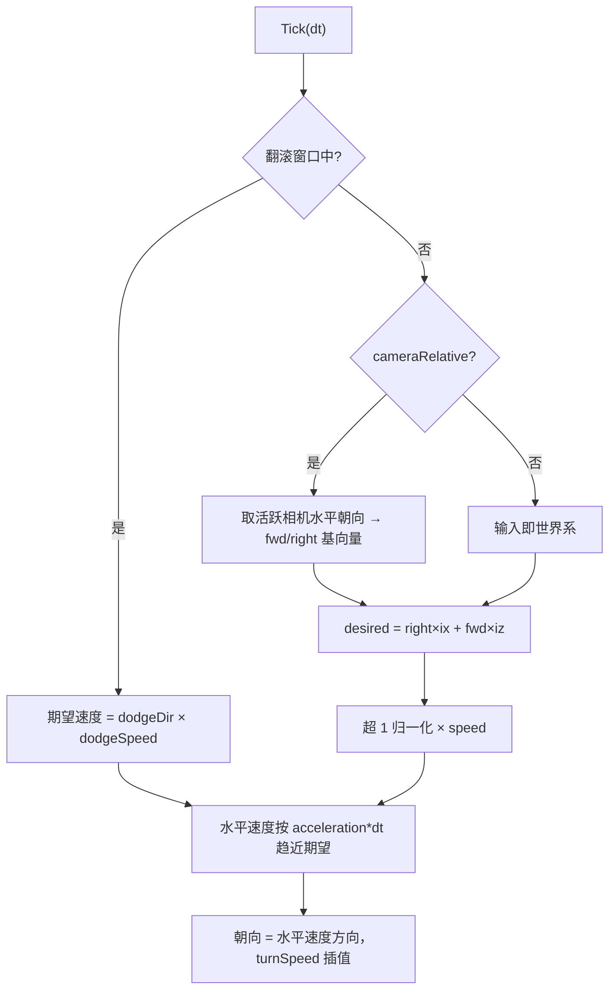

# 物理碰撞体与角色控制器（ColliderComponents / CharacterControllerComponent）

> **一句话定位**：碰撞体三兄弟（Box/Circle/Capsule，形状与 gizmo）+ 第三人称角色控制器（输入→速度注入 cannon body），是 [physics_system.md](./physics_system.md) 里"ColliderComponent 基类"之上的具体实现层。
> **什么时候会用到你**：给角色加移动/跳跃/翻滚时；给建筑配静态碰撞、给兵配动态碰撞时；排查"角色穿墙/站不上台阶/翻滚不生效"时。
> 代码位置：`src/engine/physics/ColliderComponents.ts`、`src/engine/physics/CharacterControllerComponent.ts`

## 1. 先记住这几个文件

| 文件 | 一句话职责 | 你要改它的场景 |
|---|---|---|
| [ColliderComponent.ts](../../src/engine/physics/ColliderComponent.ts) | 基类：body 创建/事件/分层/位置回写（已有文档） | 通用能力改动才碰它 |
| [ColliderComponents.ts](../../src/engine/physics/ColliderComponents.ts) | 三个具体碰撞体：形状创建 + 线框 gizmo | 加新形状（圆锥/网格）时 |
| [CharacterControllerComponent.ts](../../src/engine/physics/CharacterControllerComponent.ts) | 角色控制器：移动/跳跃/翻滚/击退/地面检测 | 加爬坡限制、蹬墙跳等角色能力时 |
| [registerBuiltinComponents.ts](../../src/engine/tools/registerBuiltinComponents.ts) | 四者的场景资产工厂注册（props 白名单） | 给组件加资产可配属性时 |

**关键心智模型**：控制器**不自己移动物体**——每帧把"期望水平速度"以有限加速度逼近的方式写进 cannon body 的 `velocity`，物理引擎负责真正的位移与碰撞。头注释点明它"与 TroopMoveComponent 同一物理形态，但面向重力世界"。所以：改速度上限、加速度手感在控制器上改；改穿墙、卡墙问题在碰撞体/物理世界上查。

## 2. 角色控制器：一帧 Tick 做了什么

### 2.1 装配与前置校验

```ts
// src/projects/arena/gameplay/ArenaPlayerPawn.ts:48-60 —— 标准装配
this.collider = this.addComponent(CapsuleColliderComponent)
this.charCtrl = this.addComponent(CharacterControllerComponent)
```

BeginPlay 三道校验，不满足直接罢工（warn + 不生效，不抛错）：

```ts
// CharacterControllerComponent.ts:93（节选）
override BeginPlay(): void {
  super.BeginPlay()
  const col = this.collider
  if (!col) {
    logger.warn(`[CharacterController] ${this.owner.name} 未挂碰撞体，控制器不生效`)
    return
  }
  if (col.bodyType !== 'dynamic') {
    logger.warn(`[CharacterController] ${this.owner.name} 碰撞体非 dynamic，控制器不生效`)
    return
  }
  if (col.lockY) {
    logger.warn(`[CharacterController] ${this.owner.name} 碰撞体 lockY=true，重力移动无效（建议 lockY=false）`)
  }
  const body = col.body
  if (body) {
    body.allowSleep = false // 角色随时要响应输入/重力，禁休眠
    body.linearDamping = 0 // 水平速度全权由本组件控制，阻尼会拖累跳跃
  }
  ...
```

最后两行是两个必须的强制项：`allowSleep = false`——睡着的 body 不响应速度注入，角色会"按了没反应"；`linearDamping = 0`——阻尼会衰减控制器写入的速度，跳跃变矮。这两个值**抢在游戏代码前面覆盖**，保证控制器的速度全权假设成立。lockY 只 warn 不断言：lockY=true 时控制器还能水平移动，只是重力/跳跃失效，属于"能跑但不对"的配置。

### 2.2 输入 → 期望速度 → 速度注入



```ts
// CharacterControllerComponent.ts:200（节选）
override Tick(dt: number): void {
  // ... 计时器推进
  if (this.isDodging) {
    // 翻滚：固定方向匀速（忽略输入）
    desiredX = this._dodgeDir.x * this.dodgeSpeed
    desiredZ = this._dodgeDir.z * this.dodgeSpeed
  } else {
    // ... cameraRelative 换算 + 归一化
    desiredX *= this.speed
    desiredZ *= this.speed
  }
  // 水平速度按加速度趋近期望（y 保留重力域，不碰）
  body.wakeUp()
  const curX = body.velocity.x
  const curZ = body.velocity.z
  const maxDelta = this.acceleration * dt
  const dx = desiredX - curX
  const dz = desiredZ - curZ
  const dl = Math.hypot(dx, dz)
  if (dl <= maxDelta || dl < 1e-6) {
    body.velocity.x = desiredX
    body.velocity.z = desiredZ
  } else {
    body.velocity.x = curX + (dx / dl) * maxDelta
    body.velocity.z = curZ + (dz / dl) * maxDelta
  }
```

三个要点：

1. **y 速度从不写**——重力域完全交给物理世界，控制器只管水平面。这就是为什么 lockY 必须 false：y 被锁住的 body 不会受重力。
2. **速度逼近而非直接赋值**——`acceleration=40` 时约 0.15 秒从静止到满速，这是"跟手但有一点重量感"的来源；要街机手感把 acceleration 调大即可，不需要改代码。
3. **每帧 `body.wakeUp()`**——防止物理引擎在输入间隙把角色休眠。

朝向是**视觉假旋转**：

```ts
// CharacterControllerComponent.ts:262 附近
const targetYaw = Math.atan2(body.velocity.x, body.velocity.z)
const cur = this.owner.root.rotation.y
this.owner.root.rotation.y = cur + angleDelta(cur, targetYaw) * Math.min(1, this.turnSpeed * dt)
```

cannon body 被 `fixedRotation` 锁旋转（头注释），朝向写在 `owner.root.rotation.y` 上——物理体永远不转，视觉网格转。`angleDelta` 把角度差归一到 `[-π, π]`，防止从 350° 转到 10° 时倒转 340°。

### 2.3 地面检测：碰撞事件驱动，不用射线

```ts
// CharacterControllerComponent.ts:113-131
col.onCollisionEnter = (e) => this._probeGround(e)
col.onCollisionStay = (e) => this._probeGround(e)
col.onCollisionExit = (e) => {
  if (this._isGroundLike(e.other)) this._grounded = false
}

/** 碰撞事件 → 地面判定（对方中心低于自身 0.05 即视为可站立） */
private _probeGround(e: { other: ColliderComponent }): void {
  const body = this.collider?.body
  const other = e.other.body
  if (!body || !other) return
  if (e.other.isTrigger) return // 触发体不算地面
  if (other.position.y < body.position.y - 0.05) {
    this._grounded = true
  }
}
```

判定规则极简：**对方 body 中心比自己低 0.05 米就算地面**。Enter/Stay 持续刷新为 true，Exit 时若离开的正是"地面样"接触才置 false。不用射线探测的好处是零额外物理查询；代价是贴墙站立时若墙体中心略低于脚底也可能误判接地（踩坑 3）。`isTrigger` 排除保证治疗圈、门禁触发器不会被当平台踩。

### 2.4 jump / dodge / knockback

```ts
// CharacterControllerComponent.ts:154
jump(): boolean {
  if (!this._grounded || this.isDodging) return false
  const body = this.collider?.body
  if (!body) return false
  body.wakeUp()
  body.velocity.y = this.jumpSpeed
  this._grounded = false
  return true
}
```

起跳 = 直接写 `velocity.y`，同时立刻自置 `_grounded = false`（不等 Exit 事件，防止同一帧二段跳）。翻滚是"定时变速"：`dodge()` 校验冷却后记下方向与 `dodgeDuration`，之后 Tick 里翻滚窗口的期望速度被强制为 `dodgeDir × dodgeSpeed`（忽略输入），窗口结束自然恢复。`knockback` 是最原始的速度叠加，数量级参考注释：`mass≈1 时 6≈一次明显击退`。

## 3. 碰撞体三兄弟：形状与资产配置

### 3.1 蓝图直接配，零代码

```json
// 建筑静态碰撞（ColliderComponents.ts 头注释示例）
{ "baseClass": "BoxColliderComponent",
  "properties": { "size": [1.6, 1.6, 1.6], "bodyType": "static",
                  "group": "building", "mask": ["troop", "building"] } }
```

fish 的全部建筑蓝图（`barracks/cannon/wall/townhall` 等）与 arena 场景的地板/墙都这样配；`CircleColliderComponent` 用于俯视角地面兵（圆柱碰撞范围）；角色用 `CapsuleColliderComponent`。资产侧有对应检查器（`comp:BoxColliderComponent` / `comp:CapsuleColliderComponent`，见 [asset_preview_lint_system.md](../editor/asset/asset_preview_lint_system.md)）。

### 3.2 Capsule 是三球拼的

```ts
// ColliderComponents.ts:152
protected override createShape(): CANNON.Shape {
  // cannon-es 无原生 Capsule：中心球体 + BeginPlay 后补挂上下两个偏移球近似
  return new CANNON.Sphere(this.radius)
}

override BeginPlay(): void {
  super.BeginPlay()
  const body = this.body
  if (body) {
    const half = this.length / 2
    body.addShape(new CANNON.Sphere(this.radius), new CANNON.Vec3(0, half, 0))
    body.addShape(new CANNON.Sphere(this.radius), new CANNON.Vec3(0, -half, 0))
    body.updateBoundingRadius()
  }
}
```

cannon-es 没有原生胶囊形状：`createShape` 只返回中心球，上下两个偏移球在 `BeginPlay` body 创建后补挂（`createShape` 接口只能返回单 Shape，组合形状只能事后加）。这解释了一个现象：**胶囊碰撞体在 BeginPlay 前查 body 的 shapes 只有 1 个球，BeginPlay 后是 3 个**。Circle 同理是"竖直圆柱"（`CANNON.Cylinder`，轴向 y）——俯视角游戏里圆即圆柱投影。

### 3.3 gizmo 线框是编辑器可读性的全部来源

三个类各自 `OnDrawGizmos` 画绿线框（`GIZMO_COLOR = 0x00e676`）：Box 画 12 边盒，Circle/Capsule 画上下两环 + 4 条竖线。绘制中心经基类 `resolveGizmoCenterInto` 统一解析——游戏运行时用 body 位置、编辑器预览回退到属性配置中心，保证"没进游戏也能看到碰撞范围"。

## 4. 关键方法速查

| 方法 | 位置 | 干什么 | 注意 |
|---|---|---|---|
| `setMoveInput(x, z)` | [CharacterControllerComponent.ts:144](../../src/engine/physics/CharacterControllerComponent.ts) | 设置持续移动输入 | 不自动清零，配 pressed/released |
| `clearMoveInput()` | [CharacterControllerComponent.ts:149](../../src/engine/physics/CharacterControllerComponent.ts) | 立即停输入 | 暂停/失焦用 |
| `jump()` | [CharacterControllerComponent.ts:154](../../src/engine/physics/CharacterControllerComponent.ts) | 地面起跳 | 翻滚中拒绝；成功即置空 grounded |
| `dodge(dirX?, dirZ?)` | [CharacterControllerComponent.ts:168](../../src/engine/physics/CharacterControllerComponent.ts) | 翻滚冲刺 | 无参时取输入方向或面朝向 |
| `knockback(ix, iy, iz)` | [CharacterControllerComponent.ts:189](../../src/engine/physics/CharacterControllerComponent.ts) | 受击冲击 | 直接叠加 body.velocity |
| `Tick(dt)` | [CharacterControllerComponent.ts:200](../../src/engine/physics/CharacterControllerComponent.ts) | 速度注入 + 朝向 | owner 需 enableTick |
| `_probeGround(e)` | [CharacterControllerComponent.ts:121](../../src/engine/physics/CharacterControllerComponent.ts) | 地面判定 | 低于自身 0.05 即地面 |
| `createShape()` | [ColliderComponents.ts:50](../../src/engine/physics/ColliderComponents.ts) | Box 形状 | 半宽_vec3 |
| `createShape()` | [ColliderComponents.ts:93](../../src/engine/physics/ColliderComponents.ts) | Circle = 竖直圆柱 | 俯视角圆即圆柱 |
| `BeginPlay()` | [ColliderComponents.ts:157](../../src/engine/physics/ColliderComponents.ts) | Capsule 补挂上下球 | 三球组合近似胶囊 |

## 5. 流程影响：牵动哪些功能

### 上游：谁驱动它

| 上游 | 怎么驱动 | 相关文档 |
|---|---|---|
| `Pawn.MoveForward/MoveRight/Jump` | 默认实现直接写入本组件（`setMoveInput`/`jump`） | [entity_system.md](./entity_system.md) |
| `ComponentRegistry` 场景工厂 | 四组件均可蓝图挂载，`applyColliderProps` 注入 bodyType/group/mask | [asset_tools_system.md](./asset_tools_system.md) |
| `PhysicsWorld` | 碰撞体 BeginPlay 建 body 注册进世界；每步进回调碰撞事件 | [physics_system.md](./physics_system.md) |
| arena gameplay | ArenaPlayerPawn 装配、ArenaPlayerController 发指令 | [gameplay_code_standard.md](../engine/../projects/gameplay_code_standard.md) |

### 下游：它波及谁

| 下游功能 | 波及点 | 相关文档 |
|---|---|---|
| NavGrid 寻路 | 从 static BoxColliderComponent 的 AABB 栅格化阻挡表 | [navigation_system.md](./navigation_system.md) |
| 资产检查器 | comp:Box/Capsule 碰撞体属性校验 | [asset_preview_lint_system.md](../editor/asset/asset_preview_lint_system.md) |
| Gizmos 编辑器显示 | 三类线框 + resolveGizmoCenterInto 双模式 | [selection_transform_system.md](../editor/core/selection_transform_system.md) |
| HealthComponent 无敌帧 | `isDodging` 可接 `grantInvulnerability`（由游戏代码组合） | [gameplay_components.md](./gameplay_components.md) |

## 6. 踩坑清单（都有代码依据）

**1. 角色完全不动，也没有报错** —— 原因：大概率没挂碰撞体，或碰撞体不是 `dynamic`——BeginPlay 校验只 warn 一条日志就 return，控制器静默罢工。规则：装配角色先确认 `CapsuleColliderComponent` + `bodyType: 'dynamic'` + `lockY: false` 三件套，再查日志里有没有 `[CharacterController]` warn。

**2. 跳跃高度不对/落地后自动滑走** —— 原因：碰撞体被手动配了 `linearDamping` 或没配世界重力。控制器 BeginPlay 会把 damping 强制为 0（注释"阻尼会拖累跳跃"），想靠阻尼刹车是行不通的；跳跃高度 = `jumpSpeed` 与世界重力共同决定，重力没配则跳完不下来。规则：手感调 `speed/acceleration/jumpSpeed`，重力在场景 `gravity` 字段配，别碰 damping。

**3. 贴墙站着显示 isGrounded=true** —— 原因：地面判定只看"对方中心比自身低 0.05"，一个中心偏低的竖长墙贴身时也会被判成地面。规则：墙类碰撞体把中心抬到角色腰部以上，或用 static Box 且底部与角色脚底平齐，别用中心极低的细长体当墙。

**4. 场景里配了 CharacterControllerComponent 却没有输入** —— 原因：控制器只接收 `setMoveInput` 写入的世界系输入，谁给它喂输入？`Pawn` 默认实现会接（`Pawn.ts:50`），但前提是 PlayerController 把轴值驱动到 Pawn；蓝图里光挂组件没有任何输入源。规则： Pawn + PlayerController + InputComponent 的完整输入链参照 `ArenaPlayerPawn` / `ArenaPlayerController` 装配。

**5. 翻滚中按跳没反应** —— 原因：`jump()` 首行 `if (!this._grounded || this.isDodging) return false`，翻滚窗口内明确拒绝起跳。规则：要"翻滚取消跳"需游戏代码先打断翻滚（自行清 `_dodgeTimer` 无公开 API，需扩展），或错开按键窗口。

## 7. 边界条件

| 条件 | 行为 | 怎么应对 |
|---|---|---|
| 无碰撞体 / 非 dynamic | BeginPlay warn 后控制器不生效 | 按 warn 日志排查三件套 |
| `dt <= 0` | Tick 直接 return | 暂停帧安全 |
| 输入向量长度 > 1 | 归一化后再乘 speed | 斜向不超速 |
| 无活跃相机且 cameraRelative | 回退世界系直读输入 | 俯视固定相机项目可关 cameraRelative |
| 翻滚冷却未到 | `dodge` 返回 false 不启动 | 冷却从翻滚开始计 |
| 触发体接触 | 不算地面（isTrigger 排除） | 平台必须是非触发碰撞体 |
| 胶囊 length=0 | 退化为单球 | 圆形角色可用 |
