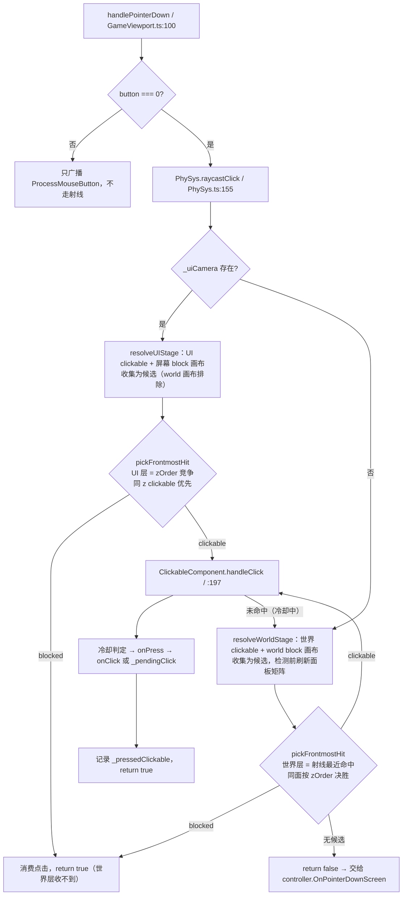

# 物理与射线命中（Physics & Picking）

> **一句话定位**：`src/engine/physics/` 装着两套互不相干的能力——`PhySys` 的**射线命中**（屏幕坐标 → Clickable 回调）和 `PhysicsWorld` + `ColliderComponent` 的**刚体碰撞模拟**（cannon-es），两者**共用目录但没有任何调用关系**。
>
> **什么时候会用到你**：点不中按钮/建筑、UI 遮挡顺序不对、拖拽误触发点击、拖拽滚动卡顿、碰撞事件不触发、放建筑要判重叠、预览视口里物理没反应。
>
> 代码位置：`src/engine/physics/`

---

## 1. 先记住这几个文件

| 文件 | 一句话职责 | 你要改它的场景 |
|---|---|---|
| [PhySys.ts](../../src/engine/physics/PhySys.ts) | 射线命中全局单例：复用 `THREE.Raycaster`，按 layer 分流持有 Clickable 注册表，提供 `screenToRay` / `raycastClick` / `raycastHover` | 点不中、点穿、拦截顺序错 |
| [ClickableComponent.ts](../../src/engine/physics/ClickableComponent.ts) | 命中执行者：过滤隐藏目标 + 求交，管冷却 / 按下 / 拖拽取消点击 | 命中区域不对、连点、拖拽误触点击 |
| [PhysicsWorld.ts](../../src/engine/physics/PhysicsWorld.ts) | 刚体世界（**World 级实例** `world.physics`）：固定步长步进 + 碰撞事件 + `overlapTest` / `queryAll` | 碰撞事件、放置重叠判定、改步长 |
| [ColliderComponent.ts](../../src/engine/physics/ColliderComponent.ts) | 碰撞体基类（抽象）：`BeginPlay` 建 cannon body 注册、`EndPlay` 注销，dynamic 回写 Actor 位置 | 加字段、改分层、改回写规则 |

**关键心智模型**：**射线命中是全局单例（进程一份相机 + 一份注册表），碰撞模拟是 World 级实例（每个 World 一份物理世界）。** 前者随游戏启停 `setup` / `clear`，后者随 `World` 创建与销毁——`PhySys` 里没有碰撞体，`world.physics` 也不能帮你做点击。

---

## 2. 一次点击怎么命中到物体：从屏幕坐标到 Clickable

### 2.1 谁调用了它

DOM 事件先进 `GameViewport`（[GameViewport.ts:100](../../src/editor/GameViewport.ts)）：`inst.inputSys.handlePointerDown(e.clientX, e.clientY, worldPos, controller, e.button)`。`InputSys.handlePointerDown`（[InputSys.ts:36](../../src/engine/input/InputSys.ts)）是射线命中的唯一入口：

```ts
// 仅左键参与点击检测（右键用于摄像机平移等，不应误触 UI/建筑点击）
const consumed = button === 0 ? PhySys.raycastClick(screenX, screenY) : false
controller?.inputComponent.ProcessMouseButton(button, 'pressed')
// 已被 ClickableComponent 消费（UI 按钮/建筑点击）→ 不再下发 controller
if (consumed) return true
if (button === 0) {
  controller?.OnPointerDownScreen(screenX, screenY)
  if (worldPos) controller?.OnPointerDown(worldPos)
}
return consumed
```

> **为什么 `consumed` 就 return**：命中了 UI 按钮/建筑，这一击就不能再落地成"放置建筑/移动兵"，否则点按钮会顺带触发一次地面逻辑。右键（`button !== 0`）**完全不进射线**，只广播给 `BindMouseButton` 订阅者（摄像机右键平移），永不误触按钮。

### 2.2 射线链路



**① `screenToRay`：屏幕坐标 → NDC → Raycaster**（[PhySys.ts:128](../../src/engine/physics/PhySys.ts)）

```ts
screenToRay(screenX: number, screenY: number, camera?: THREE.Camera | null): THREE.Raycaster | null {
  if (!this._ready || !this._camera || !this._uiEl) return null
  const cam = camera ?? this._camera
  if (!cam) return null
  const rect = this._uiEl.getBoundingClientRect()
  if (rect.width === 0 || rect.height === 0) return null
  cam.updateMatrixWorld()
  this._ndc.set(
    ((screenX - rect.left) / rect.width) * 2 - 1,
    -((screenY - rect.top) / rect.height) * 2 + 1,
  )
  this.raycaster.setFromCamera(this._ndc, cam)
  return this.raycaster
}
```

> 三个反直觉点。**（a）返回的是全局复用的同一个实例**（`PhySys.ts:24`），不能跨帧持有比较，下一次调用就覆写。**（b）`cam.updateMatrixWorld()` 必须**：相机不参与渲染时（如 `CameraComponent` 内部相机由 `syncCamera` 驱动），`matrixWorld` 陈旧会算出方向错、原点 `0,0,0` 的射线。**（c）减的是 `rect.left/top` 而非 0**：`e.clientX/Y` 是页面全局坐标，编辑器里视口是内嵌面板，不减偏移就整体错位。`_uiEl` 是 `SceneRendererComponent.uiLayer`（[SceneRendererComponent.ts:42](../../src/engine/gameflow/SceneRendererComponent.ts)），一个 `position:absolute` 居中、`pointer-events:none` 的 DOM 覆盖层，只当坐标系基准。

**② 按 layer 分流：注册时就分好两个 Set**（[PhySys.ts:48](../../src/engine/physics/PhySys.ts)）

```ts
register(c: ClickableComponent): void {
  if (c.layer === 'ui') this._uiClickables.add(c)
  else this._clickables.add(c)
}
```

> 这不是位掩码过滤，而是**注册期分流**。`ClickableComponent.BeginPlay`（:101）调 `PhySys.register(this)`；`layer` setter 赋值即重注册（BeginPlay 后改层会自动迁移集合，[ClickableComponent.ts:34](../../src/engine/physics/ClickableComponent.ts)），但为免歧义仍建议在 `addComponent` 前定好层。`GMConsoleHUD` 有明确注释（[GMConsoleHUD.ts:379](../../src/engine/gm/GMConsoleHUD.ts)）：资产声明的 `ClickableComponent` **schema 里没有 `layer` 字段**（[componentChecker.ts:83](../../src/editor/asset/assetLint/checkers/componentChecker.ts) 只认 `clickCooldown`），UI 层 clickable 一律代码创建。设 `layer = 'ui'` 的共 5 处：`UIButtonComponent.ts:68`、`UIScrollListComponent.ts:421`、`UIScrollContainerComponent.ts:213/326`、`UITooltipComponent.ts:111`、`GMConsoleHUD.ts:392/395`。

**③ 两级仲裁：UI 层按 zOrder，世界层按射线最近**（[PhySys.ts:262](../../src/engine/physics/PhySys.ts)）

`raycastClick` / `raycastHover` 共用两个解析器，命中归属由 `pickFrontmostHit` 纯函数决定（可单测，[physysArbitration.test.ts](../../tests/physysArbitration.test.ts)）：

```ts
// UI 层 resolveUIStage：clickable 与屏幕 block 画布收集为候选（world 模式画布被排除），
// 世界层 resolveWorldStage：世界 clickable 与 world 模式 block 画布收集为候选。
// 仲裁规则统一：
export function pickFrontmostHit(candidates: HitCandidate[]): HitCandidate | null {
  let best: HitCandidate | null = null
  for (const c of candidates) {
    if (!best) { best = c; continue }
    if (c.distance < best.distance - SAME_PLANE_EPS) {
      best = c                                   // 明显更近 → 直接胜出
    } else if (c.distance <= best.distance + SAME_PLANE_EPS) {
      const cWins = c.z > best.z                 // 同面（差 < 1e-3）→ zOrder 高者胜
        || (c.z === best.z && c.kind === 'clickable' && best.kind === 'blocked')
      if (cWins) best = c                        // 同 z 时 clickable 优先于拦截画布
    }
  }
  return best
}
```

> **（a）严格大于**：同 `zOrder` 时先跑的 clickable 赢，block 画布挤不掉它——模态遮罩通常铺在按钮**下面**，用 `>=` 会让它把自己上面的按钮吃掉。**（b）`uiZOrder` 取 owner 及祖先链上 `CanvasUIComponent` 的最大 `zOrder`**（[ClickableComponent.ts:289](../../src/engine/physics/ClickableComponent.ts)，`layer !== 'ui'` 直接返回 0），按钮不必自己设 zOrder，继承祖先面板层级即可。**（c）世界层按最近命中仲裁，不按注册序**：收集全部命中（世界 clickable + world 模式 block 画布）取射线最近者——这是 UE 语义"游戏输入是 UI 未命中时的兜底，归属由几何决定"。没有这一层时，后 spawn 的 world 面板按钮会被先注册的建筑 clickZone 抢走点击（信息牌"点升级"变成重选建筑的根因）。**（d）block 画布按空间分流**：屏幕画布归 UI 层（UICamera 射线），`__dsWorldUI` 标记的 world 画布归世界层（主相机射线）——world 坐标在米制世界系，拿 UICamera（原点附近正交）的射线检测会数值性误命中；检测前必须 `updateWorldMatrix`（billboard 逐帧旋转，旧矩阵会算错命中）。

**④ 为什么 UI 用独立 `uiCamera`**：渲染端是双摄像机，主相机跑 3D，`UICamera`（正交，contain 模式完整显示 9.6×5.4 画布，[UICamera.ts:22](../../src/engine/rendering/UICamera.ts)）在主场景后叠加（`autoClear=false` + `clearDepth`）；它在 `SceneRendererComponent.attachUIScene`（:373）里创建、`uiCamera` getter（:81）暴露。`Game.launch` 把**同一台**交给 PhySys（[Game.ts:208](../../src/engine/gameflow/Game.ts)）：

```ts
// 双摄像机：PhySys 注入 UI 独立相机，UI 层点击用平行射线（优先于 3D）
PhySys.setupUI(gameMgr.uiCamera)
```

> 用同一台是**强制的**：UI 面板活在 UI 场景的世界坐标里，拿会被玩家平移/缩放/旋转的主相机打射线，NDC→世界映射和屏幕看到的 UI 位置对不上。停止游戏时 `PhySys.setupUI(null)`（[Game.ts:282](../../src/engine/gameflow/Game.ts)）。**`_uiCamera` 为 null 时整个 UI 层（含 block 拦截）被跳过**，点击直落世界层——"看得见但点不到"先查这一对有没有成对。

### 2.3 命中结果怎么变成回调

`handleClick` 是冷却、按下、拖拽三条语义的交汇点（[ClickableComponent.ts:181](../../src/engine/physics/ClickableComponent.ts)）：

```ts
handleClick(raycaster: THREE.Raycaster): boolean {
  if (this.isDestroyed() || this.owner.isDestroyed()) return false
  const now = performance.now()
  if (now - this._lastClickTime < this.clickCooldown) return false
  const hit = this.hitTest(raycaster)
  if (hit) {
    this._lastClickTime = now
    this._pressed = true
    this._pressScreen = null
    this._pendingClick = null
    this.onPress?.(hit)      // 按下视觉/状态先于点击逻辑（长按保持按下）
    this.onMouseDown?.(hit)  // 精确交互用（输入框按点击 X 定位光标）
    if (this.onDragMove) this._pendingClick = hit   // 拖拽语义：延迟到释放
    else this.onClick?.(hit)                        // 普通点击：按下即触发
    return true
  }
  return false
}
```

> **`clickCooldown` 默认 500ms**（:55），是**每组件独立**的防连点，不是全局节流。它卡在最前面且**只在命中时刷新时间戳**（`_lastClickTime = now` 在 `if (hit)` 内），点空不消耗冷却。500ms 的动机是"一次点击 = 一次业务动作"（开面板、放建筑），连点两次通常是误触；需要更高频的组件自己调小——`ClashBuildingActors.ts:86` 设 200ms、`ObstacleSystem.ts:98` 设 300ms、`FishHouseActor.ts:86` 设 500ms。**代码里不存在 80ms 冷却常量**。`onPress` 先于 `onClick`：按下视觉要在点击逻辑前生效。

释放与 8px 拖拽阈值（[ClickableComponent.ts:231](../../src/engine/physics/ClickableComponent.ts) / [:212](../../src/engine/physics/ClickableComponent.ts)）：

```ts
handleRelease(): void {
  if (this.isDestroyed() || this.owner.isDestroyed() || !this._pressed) return
  this._pressed = false
  const dragged = this._pressScreen !== null     // 是否发生过真实拖拽
  this._pressScreen = null
  const hit = this._pendingClick
  this._pendingClick = null
  if (hit) this.onClick?.(hit)
  if (dragged) this.onDragEnd?.()                // 纯点击松手不触发回弹
  this.onRelease?.()
}

handleDragMove(screenX: number, screenY: number): void {
  if (!this._pressed) return
  if (!this._pressScreen) {
    this._pressScreen = [screenX, screenY]
    this.onDragStart?.(screenX, screenY)
  } else if ((screenX - this._pressScreen[0]) ** 2 + (screenY - this._pressScreen[1]) ** 2
             > ClickableComponent.DRAG_THRESHOLD_PX ** 2) {
    this._pendingClick = null                    // 超阈值 → 取消待触发点击
  }
  this.onDragMove?.(screenX, screenY)
}
```

> `raycastRelease` / `dispatchDragMove`（[PhySys.ts:212/222](../../src/engine/physics/PhySys.ts)）**直接作用于 `_pressedClickable`，不再发射线**——拖出按钮、拖出窗口再松手状态依然恢复，滚动列表拖拽滚动也依赖这一点；`_pressedClickable` 在 `unregister` 时被清空（[PhySys.ts:53](../../src/engine/physics/PhySys.ts)）。
>
> 阈值 `DRAG_THRESHOLD_PX = 8`（:70），判**位移平方**省一次开方。语义是：**绑定 `onDragMove` 就自动启用拖拽语义**——按下不立即 `onClick`，改存 `_pendingClick`，移动到 8px 外就清掉，松手时为空即点击取消；手抖 2~3px 松手仍算点击，不绑 `onDragMove` 的按钮完全不受影响。

**hitTest 的三道关**：过滤不可见目标 → 强制刷父链矩阵 → 求交取最近（[ClickableComponent.ts:148](../../src/engine/physics/ClickableComponent.ts)）。

```ts
const targets = this.getTargets()
if (targets.length === 0) return null
const visibleTargets: THREE.Object3D[] = []
for (const t of targets) {
  let o: THREE.Object3D | null = t
  let visible = true
  while (o) { if (!o.visible) { visible = false; break }; o = o.parent }
  if (visible) { t.updateWorldMatrix(true, false); visibleTargets.push(t) }
}
if (visibleTargets.length === 0) return null
const hits = raycaster.intersectObjects(visibleTargets, false)
return hits.length > 0 ? hits[0] : null
```

> **`THREE.Raycaster` 不检查 `visible`**，父节点隐藏时子 mesh 照样命中（"UI 隐藏了但还能点到"），这里沿父链补过滤。默认目标是 `owner.root` 下所有 Mesh（:127），`setTargets([img.panel])`（[UIButtonComponent.ts:197](../../src/engine/ui/UIButtonComponent.ts)）把它锁到按钮的透明点击层，子节点（Frame/Text）的 mesh 就不参与命中。`updateWorldMatrix(true, false)` 每次命中都强制刷父链矩阵，是正确性的代价，也是拖拽卡顿的根因（§6 坑 6）。

---

## 3. 碰撞检测那一半：ColliderComponent + PhysicsWorld

这一半与射线命中**没有任何调用关系**——`PhySys` 里不存在碰撞体，两者只是同目录。

**接线是真的，且接入点比射线那半更分散。** 实例挂在 World 上（`readonly physics = new PhysicsWorld()`，[World.ts:61](../../src/engine/gameflow/World.ts)），步进由 World 自己驱动——`tick`（:278）和 `manualTick`（:352）都在**本帧最后**调 `this.physics.step(dt)`，源码注释写明动机：`// 保证本帧所有 Tick 读到的是上一帧求解后的位置`。激活在 `Game.launch`（[Game.ts:238](../../src/engine/gameflow/Game.ts)）：`inst.world.physics.begin()`。`begin()` 前 `active === false`，`ColliderComponent.BeginPlay`（[ColliderComponent.ts:83](../../src/engine/physics/ColliderComponent.ts)）首行就检查 `const phys = this.resolvePhysics(); if (!phys || !phys.active) return`——这是**预览与运行时隔离的唯一开关**：预览 World 也 BeginPlay 碰撞体组件，但从不 `begin()`，不建 body、不步进，无需全局标志位。

dynamic 模式下 **body 是碰撞权威**，步进后统一回写（[PhysicsWorld.ts:162](../../src/engine/physics/PhysicsWorld.ts)）：

```ts
while (this._accumulator >= FIXED_STEP) {
  this._world.step(FIXED_STEP)
  this._accumulator -= FIXED_STEP
  stepped = true
}
if (stepped) { this.dispatchCollisionEvents(); this.syncActorsFromBodies() }
```

> 固定步长 `FIXED_STEP = 1/60`，`MAX_FRAME_TIME = FIXED_STEP * 3`（:27）钳住单帧 dt——页面 hidden 后恢复的大 dt 不会连击步进穿透。碰撞事件由 `dispatchCollisionEvents`（:192）对比上一帧接触对集合分发 Enter/Exit/Stay，接触对键用 `uid` 小的在前（`pairKey`:235）保证 a-b 与 b-a 同键。

**已确认的调用方**：`setVelocity` 由 [TroopMoveComponent.ts:265](../../src/projects/fish/gameplay/battle/troops/TroopMoveComponent.ts) 每帧注入寻路速度；`onCollisionEnter` 由 [TroopMoveComponent.ts:58](../../src/projects/fish/gameplay/battle/troops/TroopMoveComponent.ts) 订阅（撞建筑）；`overlapTest` 由 [FishBaseGameMode.ts:355/742](../../src/projects/fish/gameplay/base/FishBaseGameMode.ts) 做建筑放置重叠判定（传 `{ group: CollisionLayer.BUILDING }`）；`queryAll` 由 [NavGrid.ts:70](../../src/engine/navigation/NavGrid.ts) 重建导航阻挡格。

**无调用方的接口**：`PhysicsWorld.setPaused`（:298）、`ColliderComponent.syncStaticPosition`（:243）grep 不到调用点，属预留 API。cannon 初始化失败时 `enabled === false`，所有接口静默降级（查询返回空、注册跳过），游戏继续跑只是没碰撞。

---

## 4. 关键方法速查

| 方法 | 位置 | 干什么 | 注意 |
|---|---|---|---|
| `screenToRay(x, y, cam?)` / `raycastClick(x, y)` | [PhySys.ts:131](../../src/engine/physics/PhySys.ts) / [:155](../../src/engine/physics/PhySys.ts) | 前者屏幕 → NDC → Raycaster；后者 UI 层（zOrder 竞争）→ 世界层（射线最近命中，`pickFrontmostHit`），返回是否消费 | 返回**复用实例**，不可跨帧持有；视口宽高 0 返回 null；世界层命中归属由几何决定，与注册顺序无关 |
| `raycastRelease()` / `dispatchDragMove(x, y)` | [PhySys.ts:212](../../src/engine/physics/PhySys.ts) / [:222](../../src/engine/physics/PhySys.ts) | 向 `_pressedClickable` 分发释放 / 拖拽 | 都不发射线；拖出命中区仍持续收到 |
| `raycastHover(x, y)` / `isVisibleChain(o)` | [PhySys.ts:231](../../src/engine/physics/PhySys.ts) / [:251](../../src/engine/physics/PhySys.ts) | 逐个 `handleHover`，不竞争 / 沿父链判可见 | 拖拽期间由 InputSys 跳过；`isVisibleChain` 是**非导出**的模块级函数 |
| `setup(camera, uiEl)` / `setupUI(cam \| null)` | [PhySys.ts:82](../../src/engine/physics/PhySys.ts) / [:94](../../src/engine/physics/PhySys.ts) | 注入主相机 + 视口 DOM / 注入 UI 相机 | 前者阶段切换时调（[FishGameInstance.ts:622](../../src/projects/fish/gameplay/FishGameInstance.ts)）；UI 相机为 null 时 UI 层整体跳过 |
| `clear()` / `reset()` | [PhySys.ts:98](../../src/engine/physics/PhySys.ts) / [:112](../../src/engine/physics/PhySys.ts) | 清相机 + 三个 Set | 无直接调用方，由 `Game.shutdown` 遍历 `_singletons` 调 `reset()` 触发（[Game.ts:292](../../src/engine/gameflow/Game.ts)） |
| `handleClick(ray)` / `handleRelease()` | [ClickableComponent.ts:181](../../src/engine/physics/ClickableComponent.ts) / [:231](../../src/engine/physics/ClickableComponent.ts) | 冷却 → 命中 → `onPress` → `onClick`；释放 → 补触发 `onClick` → `onDragEnd` → `onRelease` | 绑了 `onDragMove` 则延迟到释放；无位移松手不触发 `onDragEnd` |
| `hitTest(raycaster)` / `handleDragMove(x, y)` | [ClickableComponent.ts:148](../../src/engine/physics/ClickableComponent.ts) / [:212](../../src/engine/physics/ClickableComponent.ts) | 前者过滤隐藏目标 + 刷矩阵 + 求交；后者首移触发 `onDragStart`，超 8px 取消点击 | Raycaster 不检查 `visible`，靠 `hitTest` 补；阈值 `DRAG_THRESHOLD_PX = 8`（:70） |
| `get uiZOrder()` / `setTargets(t)` | [ClickableComponent.ts:273](../../src/engine/physics/ClickableComponent.ts) / [:113](../../src/engine/physics/ClickableComponent.ts) | owner 及祖先链最大 `zOrder` / 覆盖默认"root 下所有 Mesh" | `layer !== 'ui'` 时 zOrder 返回 0；`setTargets` 只能代码调 |
| `physics.step(dt)` / `begin()` | [PhysicsWorld.ts:162](../../src/engine/physics/PhysicsWorld.ts) / [:111](../../src/engine/physics/PhysicsWorld.ts) | accumulator 固定步长 + 事件 + 回写 / 激活运行态 | 由 `World.tick:278` / `manualTick:352` 自动调用；预览 World 永不 `begin()` |
| `physics.queryAll(...)` / `overlapTest(...)` | [PhysicsWorld.ts:247](../../src/engine/physics/PhysicsWorld.ts) / [:270](../../src/engine/physics/PhysicsWorld.ts) | 圆形范围查询 / 盒重叠（x/z AABB 投影） | 都是 AABB 投影近似；支持 `group` 过滤，`overlapTest` 另有 `exclude` |
| `physics.setPaused(p)` | [PhysicsWorld.ts:298](../../src/engine/physics/PhysicsWorld.ts) | 暂停物理 | **当前无调用方** |
| `collider.setVelocity(vx, vz)` / `syncStaticPosition()` | [ColliderComponent.ts:233](../../src/engine/physics/ColliderComponent.ts) / [:243](../../src/engine/physics/ColliderComponent.ts) | 注入 dynamic 速度 / 拖动 static 建筑后同步 body | 前者仅 dynamic 生效（内部 `wakeUp()`）；**后者当前无调用方** |
| `collider.syncActorFromBody()` / `cleanup()` / `restore()` | [ColliderComponent.ts:208](../../src/engine/physics/ColliderComponent.ts) / [:155](../../src/engine/physics/ColliderComponent.ts) / [:168](../../src/engine/physics/ColliderComponent.ts) | body → `owner.root.position`；对象池回收/取出（不触发销毁） | 回写由 `syncActorsFromBodies` 统一驱动，勿手调；`restore` 内 `collisionFilterGroup` 置 0 |

---

## 5. 流程影响：牵动哪些功能

### 上游：谁驱动它

| 上游 | 怎么驱动 | 相关文档 |
|---|---|---|
| `GameViewport` DOM 事件 | `mousedown/mousemove/mouseup` → `inputSys.handlePointerDown/Move/Up` | [输入系统](./input_system.md) |
| `Game.launch` / `shutdown` / `FishGameInstance` 阶段切换 | 前两者 `PhySys.setupUI(uiCamera)` / `setupUI(null)` + `world.physics.begin()`，`shutdown` 遍历 `_singletons` 调 `reset()`；后者调 `PhySys.setup(mode.gameCamera.camera, uiLayer)` 换主相机 | [游戏流程系统](./gameflow_system.md) |
| `CanvasUIComponent`（`hitTest='block'`）/ 两个组件的 `BeginPlay` | 前者 `registerUIBlocker` / `unregisterUIBlocker` 进出拦截集合；后者 Clickable → `register` 到 PhySys（layer 已定型）、Collider → `registerCollider` 到 `world.physics` | [实体系统](./entity_system.md) |
| `World.tick` / `manualTick` / 编辑器预览视口 | 前两者本帧末尾 `physics.step(dt)`；预览 World 从不 `begin()` | [视口系统](../editor/core/viewport_system.md) |

### 下游：它波及谁

| 下游功能 | 波及点 | 相关文档 |
|---|---|---|
| UI 按钮 / 滚动列表 / Tooltip | 点击、hover、拖拽全靠 `raycastClick` + `ClickableComponent` 回调；列表绑 `onDragMove` 自动获得 8px 取消点击语义 | [UI 画布组件](./ui_canvas_component.md) |
| Controller 地面逻辑 / 拖拽滚动流畅度 | `raycastClick` 返回 true 时 `InputSys` 直接 return，controller 收不到；`PhySys.isDragging` 为真时跳过 hover 射线 | [输入系统](./input_system.md) |
| 建筑放置重叠判定 / 导航阻挡格 / 兵移动推挤 | `overlapTest(..., { group: CollisionLayer.BUILDING })`；`NavGrid.rebuildFromStaticColliders` 经 `queryAll` 拉全量静态 body；`setVelocity` 注入 + `syncActorsFromBodies` 回写位置 | [实体系统](./entity_system.md) |
| 编辑器视口（预览）/ 双摄像机渲染 | 前者预览 World 从不 `begin()`，碰撞体不注册 body 不步进，场景页签 Gizmo 拖拽走另一套 `hitTest`；后者要求渲染的 UI 相机与点击的 UI 相机是同一台 | [渲染系统](./rendering_system.md) |

---

## 6. 踩坑清单

**1. 改了 `layer` 但命中还是走错层** —— `PhySys.register` 分流发生在 `BeginPlay`（触发于 `addComponent`）；`layer` setter 现已赋值即重注册（BeginPlay 后改层自动迁移集合），但仍建议在 `addComponent(clickable)` **之前**写好，避免依赖迁移时序。

**2. 模态遮罩盖不住它上面的按钮** —— 遮挡竞争用**严格大于**比较，同 `zOrder` 时 clickable 优先。**规则**：遮罩 `zOrder` 必须严格更高；GM 控制台靠 `GM_ZORDER_BASE = 1000` 整树抬升。

**3. 连点第二下没反应** —— `clickCooldown` 默认 500ms，**每组件独立**计数。**规则**：需要高频的自己调小（200/300/500 项目里都有先例）；只有命中才刷新时间戳；冷却中的最前端命中会让本次点击穿透到 controller（被遮挡者不会接管）。

**4. 隐藏的 UI 仍然能被点中** —— `THREE.Raycaster` 不检查 `visible`，父节点隐藏时子 mesh 照样命中。**规则**：隐藏一律走 `bActive = false`（经 `applyActive` 级联 `owner.bActive`），不要只改单个 mesh 的 `visible`。

**5. UI 看得见但点不到** —— `_uiCamera` 为 null 时整个 UI 层被跳过，点击直落世界层。**规则**：`attachUIScene(scene)` 与 `PhySys.setupUI(gameMgr.uiCamera)` 必须成对。

**6. 拖拽滚动列表明显卡顿** —— 每个 UI clickable 的 `hitTest` 都强制 `updateWorldMatrix(true, false)`，拖拽时每帧跑全套射线是主要开销。**规则**：`InputSys.handlePointerMove` 已用 `PhySys.isDragging` 跳过，别再往 `raycastHover` 链路加遍历。

**7. 停止游戏后再启动，点击打到旧 World 的组件** —— 残留组件闭包链指向已销毁的旧 `GameInstance`/`World`。**规则**：`PhySys.clear()` 清空三个 Set，由 `Game.shutdown` 的 `reset()` 兜底；`isDestroyed()` 只是第二道防线。

**8. world 面板的按钮点不动 / 点面板空白处把面板关了** —— 前者是历史 bug：世界层曾按注册序先到先得，先注册的建筑 clickZone 抢走后 spawn 的面板按钮点击（已改为几何仲裁 + alwaysOnTop 视觉优先权）；后者是面板底板没有拦截能力，点击穿透到空地触发"点空地关牌"。**规则**：world 模式面板要挡住身后点击，给节点声明 `hit-test: block`——V2 命中权威在节点 marker（编译器写 marker 块，引擎懒创建 UI_HIT_LAYER 透明射线 mesh，相机不渲染零绘制成本）；无背景的纯容器也能拦截。面板树 `alwaysOnTop` 时对 3D 命中拥有视觉优先权（面板与建筑盒深度交叠时不再按几何距离翻转归属）；按钮与底板的 zOrder 用 CSS `z-index` 表达，同面时 zOrder 高者胜。

**9. hover 状态"透"到被遮挡的物体上** —— `raycastHover` 已互斥化：只有每层最前端命中者处于 hover，其余（含被 UI/blocker 盖住的世界物体）统一 `clearHover()`。**规则**：不要再依赖"多个 clickable 同时 hovering"；tooltip 与按钮同节点时 `onHover` 仍会互相覆盖（各自单回调字段，见 `UITooltipComponent`）。

**8. 预览视口里碰撞体不生效** —— 设计如此：`ColliderComponent.BeginPlay` 检查 `phys.active`，预览 World 从不 `begin()`。**规则**：验证碰撞得跑 `Game.launch` 的运行时 World。

**9. 3D 物体重叠时命中的不是最近的那个** —— 世界层取首个 `handleClick` 返回 true 者，不排序、不比距离。**规则**：需要深度优先就自己 `PhySys.screenToRay(x, y)` 再手动 `intersectObjects` 排 `distance`（`FishLevelGameMode.ts:548`、`SpellCaster.ts:82` 就这么做）。

**10. 屏幕坐标错位** —— 传的是 `e.clientX/Y` 全局坐标，`screenToRay` 内部减 `rect.left/top`。**规则**：不要手工换算成视口内坐标再传，会减两次。

---

## 7. 边界条件

| 条件 | 行为 | 怎么应对 |
|---|---|---|
| `PhySys` 未 `setup` 或视口宽高为 0 / 非左键 | 前者 `screenToRay` 返回 null、`raycastClick` 返回 false；后者完全不走射线，只广播 `ProcessMouseButton` | 调用前用 `PhySys.ready`（[PhySys.ts:116](../../src/engine/physics/PhySys.ts)）判空；右键交互 `BindMouseButton` 订阅 |
| `_uiCamera` 为 null | UI 层（含 block 拦截）整体跳过，点击直落世界层 | 保证 `setupUI` 与 `attachUIScene` 成对 |
| `layer` 在 `addComponent` 之后才改 / 同 `zOrder` 的 clickable 与 block 同时命中 | 前者留在错误层的 Set 里被错误相机打射线；后者 clickable 优先（严格大于比较） | 先设 layer 再 `addComponent`；遮罩 `zOrder` 需严格更高 |
| `hitTest: 'block'` 但画布或祖先 `visible=false` / 目标全部不可见 | `isVisibleChain` false 不拦截；后者 `hitTest` 返回 null 不响应点击/悬停 | 隐藏即失效符合预期；走 `bActive=false` 级联 |
| 绑定了 `onDragMove` / 按下期间被注销 | 前者按下不立即 `onClick`，超 8px 取消；后者 `unregister` 清空 `_pressedClickable` 不再收释放 | 想要"按下即触发"就别绑；引擎内置防残留引用 |
| 预览 World（未 `begin()`）/ cannon 初始化失败 | 前者碰撞体不建 body、不步进，射线点击照常；后者 `enabled=false` 物理静默降级 | 两套系统互不影响；查日志 `[PhysicsWorld] 初始化失败` |
| 单帧 dt 超大（hidden 后恢复）/ 多个 3D 物体重叠 | 前者 `MAX_FRAME_TIME` 钳到 3 步防穿透；后者世界层不比距离，Set 插入顺序决定胜负 | 引擎内置；需深度优先就手动排 `distance` |
