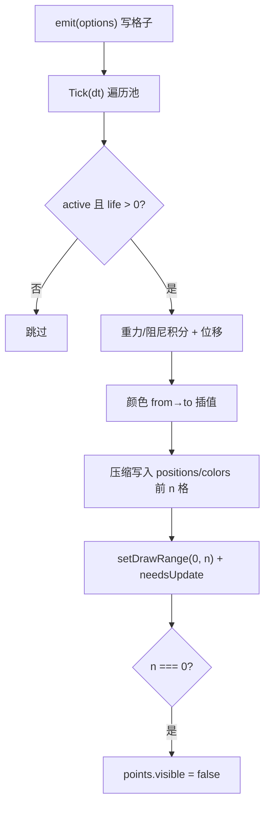

# 渲染组件族（LightComponent / ParticleEmitterComponent / ShadowBlobComponent / FollowCameraComponent）

> **一句话定位**：渲染系统主链路之外的四个"效果型"组件——灯光 actor 化、CPU 粒子爆发、Blob 假阴影、第三人称跟随相机，都是场景/蓝图里 `baseClass` 直接挂载的积木。
> **什么时候会用到你**：场景里加灯/调阴影时；给打击死亡加火花迸裂时；俯视角单位脚下要阴影时；做第三人称跟随相机和受击屏震时。
> 代码位置：`src/engine/rendering/`（四个文件同目录）

## 1. 先记住这几个文件

| 文件 | 一句话职责 | 你要改它的场景 |
|---|---|---|
| [LightComponent.ts](../../src/engine/rendering/LightComponent.ts) | 五种 THREE 灯光挂上 Actor + 阴影参数显式化 | 加灯型、调阴影管线参数 |
| [ParticleEmitterComponent.ts](../../src/engine/rendering/ParticleEmitterComponent.ts) | 单发射器 CPU 粒子，`emit()` 一次性爆发 | 加拖尾/持续发射模式 |
| [ShadowBlobComponent.ts](../../src/engine/rendering/ShadowBlobComponent.ts) | 贴地半透明椭圆假阴影（共享贴图零资产） | 换渐变形状、支持斜坡地面 |
| [FollowCameraComponent.ts](../../src/engine/rendering/FollowCameraComponent.ts) | 阻尼跟随 + lookAt + 屏震 | 加肩越视角、死区 |

**关键心智模型**：这四个组件全部走 `ComponentRegistry` 场景工厂注册（[registerBuiltinComponents.ts](../../src/engine/tools/registerBuiltinComponents.ts)），所以**所有属性都能在 `.scene.json` / `.blueprint.json` 里配、在 Inspector 里调**，代码只在需要程序化触发（`emit()`、`shake()`、`setTarget()`）时出场。渲染主链路（对象工厂/场景合成/相机管理）见 [rendering_system.md](./rendering_system.md)。

## 2. LightComponent：灯光 actor 化与阴影参数

### 2.1 为什么灯光要挂 Actor

```ts
// SceneDefaults.ts:31 —— 编辑器默认灯光的创建方式
const makeLightActor = (name: string, options: LightComponentOptions): void => {
  const actor = new GenericActor(name)
  actor.addComponent(LightComponent, options)
  ...
}
```

裸 `THREE.Light` 加进 scene 后在大纲里不可见、不可选中、Inspector 无从编辑。把灯挂到 Actor 上（头注释"仿 UE LightActor 模式"），灯光就成为场景树里可选中/可变换的节点——fish 全部 5 个场景、arena 场景的灯光都是 `"baseClass": "LightComponent"` 声明的，[SceneViewport.ts:409](../../src/editor/SceneViewport.ts)、两个 PreviewManager 里的 `makeLightActor` 是编辑器侧同一惯例的三份实现。

### 2.2 target 显式化：不挂树的 target 是隐坑

```ts
// LightComponent.ts:150 附近（构造期）
const withTarget = this.asTargetLight()
if (withTarget) {
  const tp = options.targetPosition ?? [0, 0, 0]
  withTarget.target.position.set(tp[0], tp[1], tp[2])
  owner.root.add(withTarget.target)
}
```

three 的 `DirectionalLight.target` 默认是**不在场景树上的 Object3D**（matrixWorld 恒单位阵），"照向世界原点"只是碰巧能工作。这里显式把 target 挂到 `owner.root`：跟随 Actor 移动，语义 = 灯光照向自身锚点方向。**「actor 定位」模式**（owner 在灯位、light 局部原点）必须配 `targetPosition` 设为灯位负值，否则光照方向只剩竖直向下（踩坑 2）。

### 2.3 阴影参数：三个必踩的 three 缺省

```ts
// LightComponent.ts:126 附近（构造期，ambient/hemisphere 无 shadow 自动跳过）
if (options.shadowExtent && options.shadowExtent > 0 && this._lightType === 'directional') {
  this.applyShadowExtent(shadow as THREE.DirectionalLightShadow, options.shadowExtent)
}
if (options.shadowMapSize && options.shadowMapSize > 0) {
  shadow.mapSize.set(options.shadowMapSize, options.shadowMapSize)
}
```

头注释把三个坑写得很直白：`shadowExtent` 缺省时 three 只给 ±5 的正交阴影相机，fish 48×48 地图会被截到原点一小块，必须显式放宽；`shadowMapSize` 缺省 512，开 2048 立刻细腻；运行中改 mapSize 必须 dispose 旧 map 否则"改了没反应"（setter 里已处理，[LightComponent.ts:201](../../src/engine/rendering/LightComponent.ts) 有对应日志）。所有参数缺省都是"不改"，零破坏。

### 2.4 灯型切换 = 整灯重建 + 参数迁移

```ts
// LightComponent.ts:206 附近（set lightType 节选）
const next = createLight(v, color, intensity)
next.position.copy(pos)
next.castShadow = this._castShadow
// 阴影参数迁移（新 light 是全新的 shadow 对象；两侧都可能无 shadow）
if (oldShadow && nextShadow) {
  nextShadow.mapSize.copy(oldShadow.mapSize)
  nextShadow.bias = oldShadow.bias
  ...
}
// target 重挂（target 是 directional/spot 的字段，新 light 有自己的 target）
if (nextTargetLight) {
  ...
  this.owner.root.add(nextTargetLight.target)
}
;(this as unknown as { light: THREE.Light }).light = next
old.dispose()
```

THREE 灯型之间没有公共可变类型字段，切 `point → directional` 无法原地改——只能新建灯实例、迁移位置/颜色/强度/阴影参数/target、替换 `readonly light` 引用、dispose 旧灯。Inspector 的 type 下拉框改的就是这条路径。注意 `directional → directional` 时正交范围才迁移（`oldDirShadow.camera.right !== 5` 判断放过未定制过的缺省值）。

## 3. ParticleEmitterComponent：一次 emit 的生命周期

### 3.1 结构化池 + 环形分配，零 GC

```ts
// ParticleEmitterComponent.ts:73 附近（构造期预分配）
for (let i = 0; i < this.maxParticles; i++) {
  this._particles.push({ active: false, x: 0, ..., cr1: 1, cg1: 1, cb1: 1 })
}

// emit() 里的分配
const p = this._particles[this._cursor]
this._cursor = (this._cursor + 1) % this.maxParticles
```

512 个 `Particle` 结构体构造期一次分配，之后 emit 只是复用格子——容量满时游标绕回**覆盖最老粒子**（爆发型特效生命周期短，最老的先亡是正确语义）。没有 new、没有数组扩容，这就是头注释说"单发射器几百粒"性能档位的底气。

### 3.2 Tick 压缩写缓冲



```ts
// ParticleEmitterComponent.ts:161（Tick 节选）
let n = 0
for (const p of this._particles) {
  if (!p.active) continue
  p.life -= dt
  if (p.life <= 0) { p.active = false; continue }
  p.vy += gravity * dt
  ...
  const t = 1 - p.life / p.maxLife
  const i3 = n * 3
  this._positions[i3] = p.x
  ...
  n++
}
this._activeCount = n
this._geometry!.setDrawRange(0, n)
```

活粒子**压缩到顶点缓冲前部**，`setDrawRange(0, n)` 只画前 n 个——GPU 不处理死粒子格。`frustumCulled = false`（`_ensureResources` 里）：粒子云经常跨界包围盒，逐帧算包围盒反而浪费。两个设计取舍要知道：Points 挂在 `world.scene` 而非 owner 下（**世界空间发射**，命中火花不随目标移动）；`size` 是全粒统一的（`PointsMaterial` 无 per-particle size），能量衰减靠颜色渐变近似。

### 3.3 重力/阻尼是发射器级而非粒子级

```ts
// ParticleEmitterComponent.ts:112 附近（emit 内）
// 重力/阻尼为发射器级参数（单爆发器同一时刻一般只有一种火花，简化为最近一次 emit 生效）
this._pendingGravity = options.gravity ?? -9.8
this._pendingDrag = options.drag ?? 0
```

`emit({gravity})` 传的值存在发射器上、影响之后所有粒子（含未亡的旧爆发）。注释明说是刻意简化：单发射器同一时刻一般只有一种火花。同一发射器连发两种参数不同的火花会互相污染——需要隔离就多挂一个 ParticleEmitterComponent。

## 4. ShadowBlobComponent：贴地假阴影

### 4.1 共享资源模型：全实例一张贴图一个几何

```ts
// ShadowBlobComponent.ts:117（构造期节选）
this.material = new THREE.MeshBasicMaterial({
  map: getSharedTexture(),        // 256² 程序化径向渐变，模块级单例
  transparent: true,
  depthWrite: false,
  opacity: this._opacity,
})
this.obj = new ThreeObject(new THREE.Mesh(ShadowBlobComponent_getSharedGeo(), this.material), {
  disposeGeometry: false,          // 共享几何不随实例释放
})
```

贴图是 2D canvas 现画的径向渐变（中心 α0.5 → 边缘全透明），jsdom 等无 2D 上下文环境降级为等价 DataTexture——**零资产文件依赖**。半径变化 = 改 mesh scale（几何恒 1×1），透明度独立所以材质 per-instance clone，`EndPlay` 只 dispose 材质（`MeshBasicMaterial.dispose` 不释放 map，共享贴图由模块单例持到进程结束）。几百个单位脚下一块阴影也只有一张 256² 贴图的显存。

### 4.2 贴地法线：双朝向场景约定

```ts
// ShadowBlobComponent.ts:187（applyGrounding 节选）
const q = new THREE.Quaternion().setFromUnitVectors(
  new THREE.Vector3(0, 0, 1),      // PlaneGeometry 原生法线 +Z
  new THREE.Vector3(nx / len, ny / len, nz / len),
)
mesh.quaternion.copy(q)
mesh.position.set((nx / len) * this._offset, ...)
```

PlaneGeometry 原生法线是 +Z，四元数转到目标法线并沿法线抬升 `offset`（缺省 0.02）防 z-fighting。**双朝向约定**（头注释 TC-S8）：XZ 地面（fish/arena，Y 向上）用缺省 `normal: [0,1,0]`；XY 世界（FishMenu，Z 为深度）必须显式 `normal: [0,0,1]`，否则 blob 立起来像面旗。配套的 `renderOrder = 1` + `depthWrite: false` 保证画在地面之上且不遮挡后续透明体。资产检查器已覆盖（`comp:ShadowBlobComponent`：radius>0、opacity∈[0,1]、normal 不可零向量）。

## 5. FollowCameraComponent：阻尼跟随与屏震

### 5.1 跟随链路：root 才是相机权威位姿

```ts
// ArenaGameMode.ts:57 —— 相机 Actor 上的装配
this.follow = this.cameraActor.addComponent(FollowCameraComponent)

// FollowCameraComponent.ts:71（Tick 节选）
const pLerp = Math.min(1, this.followSpeed * dt)
this._basePos.lerp(this._tmpDesired, pLerp)
const lLerp = this.lookAtSpeed > 0 ? Math.min(1, this.lookAtSpeed * dt) : 1
this._lookPos.lerp(this._tmpTarget, lLerp)
...
this.owner.root.lookAt(this._tmpLook)
```

组件每帧把 `owner.root`（相机 Actor 的权威位姿）阻尼趋近"目标 + offset"，朝向 lookAt 平滑注视点；`PlayerCameraManager.UpdateCamera`（GameMode.Tick 内）随后把 root 同步进真相机——本组件**只写 root，不碰相机本体**，与渲染系统的相机委托链解耦（见 [rendering_system.md](./rendering_system.md)）。位置与注视点分开阻尼：`lookAtSpeed=0` 时注视点立即跟，转角画面更稳。

### 5.2 屏震叠加在阻尼位上

```ts
// FollowCameraComponent.ts:126（_applyToRoot 节选）
const shakeOff = this._computeShakeOffset(dt)
this.owner.root.position.set(
  this._basePos.x + shakeOff.x,
  ...
)
this._tmpLook.set(
  this._lookPos.x + shakeOff.x * 0.5,   // 注视点只吃一半震动，方向抖动更自然
  ...
)
```

震动偏移同时加到位移与注视点（注视点减半）——只抖位置不抖朝向会像"平移不晃"，只抖朝向又太晕，各吃一半是手感折中。`shake()` 的强度取更大者不打断进行中的强震；偏移量 = 强度 × 线性衰减 × 伪随机。开局用 `setTarget(actor, true)` 触发 `snapToTarget()` 瞬移对齐，避免相机从原点飞过去。

## 6. 关键方法速查

| 方法 | 位置 | 干什么 | 注意 |
|---|---|---|---|
| `set lightType` | [LightComponent.ts:206](../../src/engine/rendering/LightComponent.ts) | 切灯型（整灯重建迁移参数） | readonly light 靠断言换引用 |
| `set shadowMapSize` | [LightComponent.ts:194](../../src/engine/rendering/LightComponent.ts) | 改阴影贴图尺寸 | 自动 dispose 旧 map 下一帧生效 |
| `applyShadowExtent()` | [LightComponent.ts:180](../../src/engine/rendering/LightComponent.ts) | 放宽 directional 阴影正交范围 | 仅 directional 有效 |
| `emit(options)` | [ParticleEmitterComponent.ts:96](../../src/engine/rendering/ParticleEmitterComponent.ts) | 一次性粒子爆发 | 即发即忘；重力/阻尼发射器级 |
| `Tick(dt)` | [ParticleEmitterComponent.ts:161](../../src/engine/rendering/ParticleEmitterComponent.ts) | 积分 + 压缩写缓冲 | owner 需 enableTick |
| `applyGrounding()` | [ShadowBlobComponent.ts:187](../../src/engine/rendering/ShadowBlobComponent.ts) | 法线旋转 + 抬升 | normal/offset setter 自动重算 |
| `EndPlay()` | [ShadowBlobComponent.ts:222](../../src/engine/rendering/ShadowBlobComponent.ts) | 只释放材质 clone | 共享贴图/几何存活 |
| `setTarget(actor, snap?)` | [FollowCameraComponent.ts:59](../../src/engine/rendering/FollowCameraComponent.ts) | 设跟随目标 | snap=true 瞬移对齐 |
| `shake(intensity, duration)` | [FollowCameraComponent.ts:76](../../src/engine/rendering/FollowCameraComponent.ts) | 受击屏震 | 取更强者不打断 |
| `Tick(dt)` | [FollowCameraComponent.ts:87](../../src/engine/rendering/FollowCameraComponent.ts) | 阻尼跟随 + 写 root | 只写 root，相机同步在 CameraManager |

## 7. 流程影响：牵动哪些功能

### 上游：谁驱动它们

| 上游 | 怎么驱动 | 相关文档 |
|---|---|---|
| `ComponentRegistry` 场景工厂 | 四组件全部 `baseClass` 可配（Light/ShadowBlob/Particle/FollowCamera 各一段工厂） | [asset_tools_system.md](./asset_tools_system.md) |
| Actor Tick 链 | Particle/FollowCamera 的 Tick 依赖 owner `enableTick()` | [entity_system.md](./entity_system.md) |
| `PlayerCameraManager.UpdateCamera` | 每帧把 FollowCamera 写过的 root 同步进真相机 | [rendering_system.md](./rendering_system.md) |
| 编辑器灯光创建 | SceneDefaults / SceneViewport / 两个 PreviewManager 的 `makeLightActor` | [viewport_system.md](../editor/core/viewport_system.md) |

### 下游：它们波及谁

| 下游功能 | 波及点 | 相关文档 |
|---|---|---|
| Inspector 属性面板 | 四组件的 `getEditableProperties` 全量可编辑（含 vec3/color 控件） | [property_edit_system.md](../editor/core/property_edit_system.md) |
| 资产检查器 | `comp:LightComponent` / `comp:ShadowBlobComponent` 等专用 checker | [asset_preview_lint_system.md](../editor/asset/asset_preview_lint_system.md) |
|大纲树 | 灯光以 Actor 节点呈现，可选中/变换 | [selection_transform_system.md](../editor/core/selection_transform_system.md) |
| gameplay 表现层 | 打击火花（emit）、受击屏震（shake）由游戏代码按事件触发 | [gameplay_code_standard.md](../engine/../projects/gameplay_code_standard.md) |

## 8. 踩坑清单（都有代码依据）

**1. directional 灯开了阴影，地图大部分没影子** —— 原因：three 阴影正交相机缺省 ±5，大地图被截到灯位附近一小块。规则：`shadowExtent` 设为地图半径量级（fish 场景都显式配了），`shadowMapSize` 同步提到 2048。

**2. 灯光"actor 定位"后光只从头顶垂直照下** —— 原因：`targetPosition` 没配，target 世界位置 = owner 位置（灯在自己头上），光照方向只剩竖直向下。规则：owner 在灯位、light 局部原点的用法必须把 `targetPosition` 设为灯位负值（如灯在 (20,30,10) 则约 [-20,-30,-10]）。

**3. 运行中调 shadowMapSize 没反应** —— 原因：WebGLShadowMap 复用旧尺寸渲染目标。规则：走组件的 `shadowMapSize` setter（内含 dispose 旧 map 逻辑），别直接改 `light.shadow.mapSize`。

**4. 同一发射器两种火花互相污染** —— 原因：`gravity/drag` 存在发射器上，最近一次 `emit` 生效（代码注释明示的简化）。规则：参数差异大的爆发拆到不同 Actor / 不同 ParticleEmitterComponent 实例。

**5. XY 世界（FishMenu）里阴影立起来了** —— 原因：用了缺省 `normal: [0,1,0]`（XZ 地面约定），在 Z 为深度的世界里平面朝向错误。规则：双朝向场景约定——XZ 地面 `[0,1,0]`，XY 世界显式 `[0,0,1]`。

**6. 相机开局从原点飞到玩家身边** —— 原因：`setTarget` 没传 snap，首帧阻尼从当前位（原点附近）趋近期望位。规则：开局对齐用 `setTarget(actor, true)`。

## 9. 边界条件

| 条件 | 行为 | 怎么应对 |
|---|---|---|
| ambient/hemisphere 配 shadow 参数 | no-op（three 语义无 shadow） | 需要环境光参与阴影用 directional 补 |
| emit 时 owner 无 world | 静默 return | 只在游戏运行中 emit |
| 粒子容量满 | 覆盖最老粒子 | 加大 `maxParticles`（最小 16） |
| 粒子全灭 | drawRange=0 + points 不可见 | 零渲染开销 |
| jsdom / 无 2D canvas | 贴图降级 DataTexture，视觉一致 | 单测环境无需特判 |
| `opacity >= 1` | transparent 自动关 | 全不透明时走不透明渲染路径 |
| FollowCamera 无 target / dt=0 | Tick 直接 return | 暂停帧安全 |
| 震动期间再次 shake | 仅当更强才覆盖 | 短震不打断长强震 |
