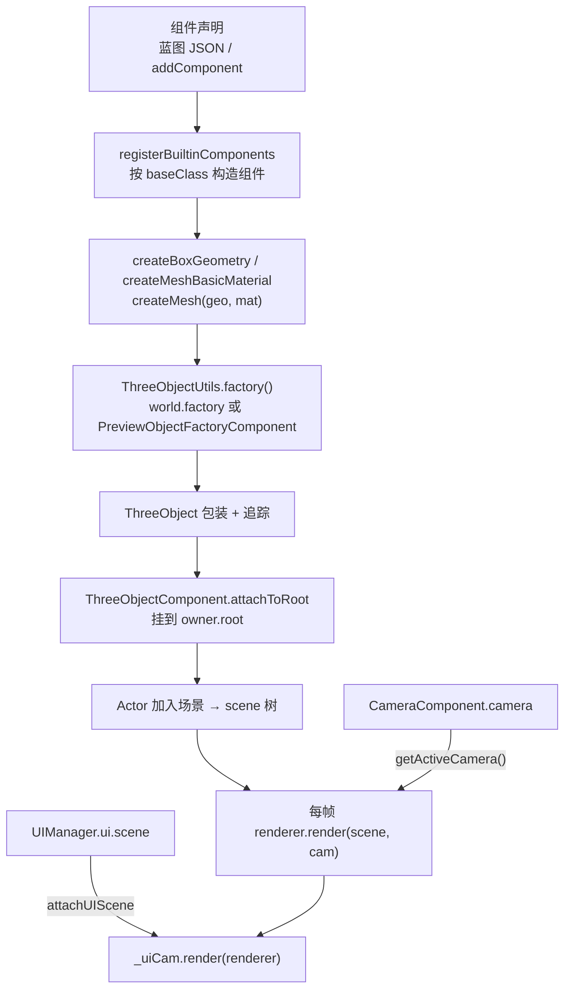

# 渲染系统（Rendering）

> **一句话定位**：渲染系统把「组件声明」翻译成「屏幕像素」——组件只声明要画什么，`ThreeObjectFactory` 造 THREE 对象，[SceneRendererComponent.ts](../../src/engine/gameflow/SceneRendererComponent.ts) 持唯一的 WebGLRenderer 每帧把主场景和 UI 场景按顺序画出来。
>
> **什么时候会用到你**：新增/改一个可视组件（精灵、盒子、线框、灯光、文字）；排查「东西没画出来 / 位置不对 / 被谁挡住 / 内存涨」；排查相机不对（黑屏、比例拉伸、相机没跟上）；排查 UI 盖不住 3D 或点不到。
>
> 代码位置：`src/engine/rendering/`

---

## 1. 先记住这几个文件

| 文件 | 一句话职责 | 你要改它的场景 |
|---|---|---|
| [SceneRendererComponent.ts](../../src/engine/gameflow/SceneRendererComponent.ts)（`src/engine/gameflow/`） | 游戏视口渲染主人：WebGLRenderer + rAF 循环 + 每帧合成主场景与 UI 场景 | 改每帧渲染顺序、尺寸/比例、UI 叠加、上下文丢失处理 |
| [ThreeObjectComponent.ts](../../src/engine/rendering/ThreeObjectComponent.ts) | 所有可视组件的基类：挂 `owner.root`、EndPlay 释放 | 新增一个渲染组件类型 |
| [CameraComponent.ts](../../src/engine/rendering/CameraComponent.ts) | 相机组件：持 THREE 相机，维护投影矩阵 | 改投影参数、新增投影模式 |
| [PlayerCameraManager.ts](../../src/engine/rendering/PlayerCameraManager.ts) | 决定「当前用哪台相机」（按 priority 选活跃） | 改相机切换/优先级规则 |

**关键心智模型**：渲染分两条独立链路——**3D 主场景用游戏相机**（游戏自己创建，每帧通过委托交给渲染器），**UI 场景用 `UICamera` 固定正交相机**。两者共用同一个 renderer，UI 后画且清 depth，所以永远在顶层。相机不是渲染器创建的，渲染器只是「借来用」。

---

## 2. 一个东西怎么被画出来：从组件声明到屏幕像素

### 2.1 谁驱动了它

渲染器不是启动就有的，是 `Game.launch()` 里按需创建并接线的（`Game.ts`）：

```ts
// Game 视口渲染器：DOM 保存在 instance.viewport.container，启动时取出创建
const gameMgr = this.ensureGameMgr()
...
    if (gameMgr) {
      gameMgr.setControlsEnabled(true)
      // UI 独立场景接入叠加渲染（widget 与 3D 场景分离，场景由 UIManager 持有）
      const world = (inst as unknown as { world?: World }).world
      if (world?.ui?.scene) {
        gameMgr.attachUIScene(world.ui.scene)
        // 双摄像机：PhySys 注入 UI 独立相机，UI 层点击用平行射线（优先于 3D）
        PhySys.setupUI(gameMgr.uiCamera)
      }
      gameMgr.start()
    }
...
    // Game 摄像机：注册委托，渲染器每帧从游戏实例获取当前主摄像机直接渲染
    if (gameMgr) {
      gameMgr.setCameraProvider(() => inst.getActiveCamera())
    }
```

> 三件事缺一不可：**①** `ensureGameMgr()` 走 `World.ensureGameRenderer()`（`World.ts:93`），首次调用才 new 渲染器，没有活跃 `GameInstance` 或没有 `viewport.container` 就返回 null——此时游戏跑得起来但**没有画面**。**②** `attachUIScene` 与 `PhySys.setupUI` 必须成对，**渲染的 UI 相机和点击检测的 UI 相机要是同一台**，否则「看到的 UI」和「点到的 UI」错位。**③** `setCameraProvider` 传的是**函数不是相机对象**，渲染器每帧调它取相机，所以运行时切 GameMode 换相机，渲染器无需任何通知就自动跟上。

项目侧实现（以 `fish` 为例，`FishGameInstance.ts:1010`）：

```ts
override getActiveCamera(): THREE.PerspectiveCamera | THREE.OrthographicCamera | null {
  switch (this._currentStage) {
    case 'menu': return this._menuGameMode?.cameraManager.GetActiveCameraObject() ?? null
    case 'base': return this._baseGameMode?.cameraManager.GetActiveCameraObject() ?? null
    case 'game': return (this._gameMode ?? this._levelGameMode)?.cameraManager.GetActiveCameraObject() ?? null
  }
}
```

> 渲染器 → `getActiveCamera()` → 当前阶段 GameMode 的 `cameraManager` → `GetActiveCameraObject()` → THREE 相机。**相机所有权在游戏侧，渲染器只借用**。

### 2.2 创建链路



**① 造对象：禁止裸 `new THREE.xxx`**

[ThreeObjectUtils.ts](../../src/engine/gameflow/ThreeObjectUtils.ts) 是唯一入口，按优先级解析工厂：

```ts
function factory() {
  const gi = GameInstance.current
  if (gi?.world) return gi.world.factory
  const pf = PreviewObjectFactoryComponent.getCurrent()
  if (pf) return pf
  return null
}

export function createMesh(geometry, material): ThreeObject<THREE.Mesh> {
  const f = factory()
  if (f) return f.createMesh(geometry, material)
  return new ThreeObject(new THREE.Mesh(geometry, material))
}
```

> 跑游戏时工厂是 `world.factory`（[ThreeFactoryComponent.ts](../../src/engine/gameflow/ThreeFactoryComponent.ts)），把每个 `ThreeObject` push 进 `_objects`，shutdown 时 `disposeAll()` 统一回收；编辑器预览（无 GameInstance）退回 `PreviewObjectFactoryComponent`；两者都没有时**降级为未追踪创建**，由持有方自己 dispose。裸 `new THREE.Mesh` 绕过追踪，漏掉就是 GPU 泄漏。

**② 包装：释放逻辑只在 `ThreeObject.dispose()` 一处**

```ts
dispose(): void {
  if (this._disposed) return
  this._disposed = true
  const walk = (obj: THREE.Object3D) => {
    // Geometry（可跳过：共享几何体）
    if (this._disposeGeometry) anyObj.geometry?.dispose?.()
    const mats = Array.isArray(anyObj.material) ? anyObj.material : anyObj.material ? [anyObj.material] : []
    for (const mat of mats) {
      for (const key of Object.keys(anyMat)) {
        if (value instanceof THREE.Texture) value.dispose()
      }
      mat.dispose()
    }
    for (const child of obj.children) walk(child)
  }
  walk(this.object)
  this.markDestroyed()
  this.owner = null
}
```

> `_disposed` 保证**幂等**（组件 EndPlay 释放过，工厂 shutdown 兜底再扫到也不二次 dispose）；用 `Object.keys(mat)` 找纹理而非写死 `map`，因为材质除 `map` 外还有 `normalMap`/`emissiveMap`；`disposeGeometry=false` 给**共享几何**用（见 ④）。

**③ 挂树：组件构造末尾就挂，不等 BeginPlay**

```ts
protected attachToRoot(obj: ThreeObject): void {
  if (obj.object.parent) obj.object.parent.remove(obj.object)
  obj.owner = this.owner   // shutdown 兜底时用于孤儿诊断
  this.owner.root.add(obj.object)
}
```

> 先 `remove` 再 `add`：工厂造出的对象若已挂过父节点，不 remove 会被 THREE 挂回原来的树。**构造期就挂**是为了对象池场景（activate 时网格已就位，不依赖 BeginPlay 时序）。

**④ 共享几何：Sprite 不重建几何，只改 scale**

```ts
private static getSharedGeo(): THREE.PlaneGeometry {
  if (!SpriteComponent.sharedGeo) SpriteComponent.sharedGeo = new THREE.PlaneGeometry(1, 1)
  return SpriteComponent.sharedGeo
}
// 共享 geometry 不释放（disposeGeometry=false），材质由 ThreeObject.dispose 释放
this.obj = new ThreeObject(new THREE.Mesh(SpriteComponent.getSharedGeo(), this.material), { disposeGeometry: false })
this.obj.object.scale.set(width, height, 1)
```

> 全场 Sprite 共用一份单位平面，尺寸靠 `scale`，成千上万个精灵只占一份几何。**代价**是必须传 `disposeGeometry: false`，否则第一个 Sprite 销毁就把共用几何 dispose 掉，其余精灵全部变空白。

### 2.3 每帧渲染与合成

`SceneRendererComponent.start()` 的 rAF 循环（`SceneRendererComponent.ts:389`），顺序**不能乱**：

```ts
this.camera = this.cameraProvider ? this.cameraProvider() : this.camera
const cam = this.camera

// 每帧同步宽高比到游戏相机
if (cam instanceof THREE.PerspectiveCamera) {
  if (Math.abs(cam.aspect - this._aspect) > 1e-6) { cam.aspect = this._aspect; cam.updateProjectionMatrix() }
} else if (cam instanceof THREE.OrthographicCamera) {
  // 正交：半高保持不变（游戏设定），半宽按视口比例伸缩
  const halfH = cam.top
  const halfW = halfH * this._aspect
  ...
}

this.controls?.update()
for (const cb of this.updateCallbacks) cb(dt)

// 主场景：直接用游戏相机的引用渲染（不再复制同步）
if (cam) this.renderer.render(this.scene, cam)
else this.renderer.clear()

// UI 独立场景叠加渲染（UI 永远在顶层）
this._uiCam?.render(this.renderer)

for (const cb of this.afterRenderCallbacks) cb()
```

> 正交相机的处理反直觉：**只改左右、不改上下**。正交半高 `orthoSize` 是游戏设定的视野高度，渲染器若按视口比例同时改上下，游戏的 `SetOrtho` 就失效了；只伸缩左右 → 视野高度恒定、宽度随窗口变。透视相机则必须两边一起按 `aspect` 走，否则画面拉伸。`cam` 为 null 时执行 `renderer.clear()` 而非跳过——不清屏会残留上一帧。

UI 叠加相机的合成（[UICamera.ts](../../src/engine/rendering/UICamera.ts:66)）：

```ts
render(renderer: THREE.WebGLRenderer): void {
  if (!this._scene) return
  const prevAutoClear = renderer.autoClear
  renderer.autoClear = false
  renderer.clearDepth()
  renderer.render(this._scene, this.camera)
  renderer.autoClear = prevAutoClear
}
```

> 三步缺一不可：`autoClear=false` 保留主场景颜色；`clearDepth()` 让 UI 不参与 3D 遮挡；渲染后**必须还原** `autoClear`，否则下一帧主场景不清屏、画面叠成一团。用 `prevAutoClear` 局部变量存而非硬写 `true`，是因为调用方自己也会改这个标志。

---

## 3. 相机族：谁在看、看到哪

| 类 | 职责 | 关键事实 |
|---|---|---|
| [CameraComponent.ts](../../src/engine/rendering/CameraComponent.ts) | 持 THREE 相机，管投影矩阵 | `mode` 只有 `'perspective' \| 'orthographic'`；构造 `(owner, name, mode)`，第二参仍是 name（snake/eatfish 兼容） |
| [CameraActor.ts](../../src/engine/rendering/CameraActor.ts) | 把相机提升为 Actor | 内部 `new CameraComponent(this, `${name}Camera`, mode)`，参数全转发到组件 |
| [PlayerCameraManager.ts](../../src/engine/rendering/PlayerCameraManager.ts) | 选活跃相机 | 注册时 `priority >=` 就顶替当前活跃 |
| [CameraRigComponent.ts](../../src/engine/rendering/CameraRigComponent.ts) | 俯瞰相机交互（缩放+平移+边缘平移+右键拖拽） | 与 CameraComponent 挂同一 Actor，`BeginPlay` 里 `getComponent(CameraComponent)` |
| [CameraZoomComponent.ts](../../src/engine/rendering/CameraZoomComponent.ts) | 只要滚轮缩放的轻量版 | `zoom()` 与 Rig 逐行相同，但无平移/边缘/拖拽 |
| [UICamera.ts](../../src/engine/rendering/UICamera.ts) | UI 独立正交相机，contain 模式 | 画布固定 9.6×5.4（`UI_CANVAS_W/H`） |

**投影：所有参数变更都必须重算矩阵**

```ts
private applyProjection() {
  const cam = this.camera
  if (cam instanceof THREE.PerspectiveCamera) {
    cam.fov = this.fov
    cam.aspect = this.aspect
  } else {
    const halfH = this.orthoSize
    const halfW = halfH * this.aspect
    cam.left = -halfW; cam.right = halfW; cam.top = halfH; cam.bottom = -halfH
  }
  cam.near = this.near
  cam.far = this.far
  cam.updateProjectionMatrix()
}
```

> `SetView` / `SetOrtho` / `SetAspect` 三个 setter 全部收敛到这一个私有方法。改了 `fov`/`left`/`near` 而**不调 `updateProjectionMatrix()`，画面不会有任何变化**——这是「改了相机参数没效果」的第一嫌疑点。

**位置同步：相机与 Actor 是双向的**

```ts
SyncFromActor() {
  if (this.owner instanceof Actor) {
    this.owner.root.getWorldPosition(this.camera.position)
    this.owner.root.getWorldQuaternion(this.camera.quaternion)
  }
}
SyncToActor() {
  if (this.owner instanceof Actor) {
    this.owner.root.position.copy(this.camera.position)
    this.owner.root.quaternion.copy(this.camera.quaternion)
  }
}
```

> 每帧 `GameMode` 调 `cameraManager.UpdateCamera()` → `SyncFromActor()`，把 Actor 位置灌进相机。所以**直接改 `camera.position` 会被下一帧覆盖**——Rig/Zoom 的 `zoom()` 末尾那行 `SyncToActor()` 就是为此存在。`owner` 不是 Actor 时（组件挂 GameMode 上）两个方法**静默跳过**，相机位置全靠手动设。

**Rig 缩放与平移：改动必须写回 Actor**

`zoom(delta)` 沿视线 `clamp` 到 `[minDistance, maxDistance]` 后 `cam.lookAt(target)`，`pan(dx, dz)` 把 target clamp 到 `±panLimit` 并保持相机相对偏移不变，两者末尾都调 `this._camera!.SyncToActor()`。delta 约定统一为 **>0 拉远、<0 拉近**。

**Rig 边缘平移：只对屏幕 X 轴取反**

```ts
this.pan(
  -_tmpRight.x * dx + _tmpTop.x * dy,
  -_tmpRight.z * dx + _tmpTop.z * dy,
)
```

> 拖拽跟手要求鼠标右拖时场景跟着右移，所以屏幕右方向取反；但取反**必须按屏幕轴分别处理**（`-right*dx`，`+top*dy`），不能对整个世界 X 分量取反——相机有偏航时（如基地相机 `(12,16,18)` 看向原点）整体取反会把上下一起反掉，拖拽轨迹扭曲。

**边缘平移与右键拖拽互斥**

```ts
if (!this.edgePanEnabled) return
// 右键拖拽平移中 → 屏蔽屏幕边缘平移（避免拖拽时鼠标贴近边缘导致画面乱跳）
if (this.rightDragging) return
```

> 两个平移来源同时生效会打架。拖拽期间鼠标经常贴到视口边缘，边缘平移叠加进来会让画面乱跳，所以拖拽优先级更高。`setEdgePanEnabled(false)` 只屏蔽边缘平移，滚轮缩放与右键拖拽不受影响。

---

## 4. 关键方法速查

| 方法 | 位置 | 干什么 | 注意 |
|---|---|---|---|
| `setCameraProvider(fn)` | `gameflow/SceneRendererComponent.ts:51` | 注册相机委托，每帧取当前主相机 | 传 null 即解绑；会重建 OrbitControls（仍禁用交互） |
| `attachUIScene(scene)` | `gameflow/SceneRendererComponent.ts:373` | 挂载/分离 UI 叠加场景 | 传 null 会 `_uiCam.EndPlay()` 并置空，下次重建 |
| `SceneRendererComponent.start()` | `gameflow/SceneRendererComponent.ts:389` | rAF 渲染循环 | 上下文丢失期间跳过渲染但**继续 rAF** |
| `SceneRendererComponent.resize()` | `gameflow/SceneRendererComponent.ts:316` | 重算尺寸/比例，同步 UI 相机视锥 | 由 ResizeObserver 自动触发 |
| `dispose()` | `gameflow/SceneRendererComponent.ts:520` | 停循环 + 断监听 + forceContextLoss | 必须调，WebGL 上下文不释放会耗尽浏览器额度 |
| `CameraComponent.applyProjection()` | `CameraComponent.ts:71` | 重算投影矩阵 | 私有；所有 setter 收敛于此 |
| `CameraComponent.SyncFromActor()` | `CameraComponent.ts:90` | Actor root → 相机 | owner 非 Actor 时静默跳过 |
| `CameraComponent.SyncToActor()` | `CameraComponent.ts:98` | 相机 → Actor root | 手动改相机位置后必须调 |
| `SetView / SetOrtho / SetAspect` | `CameraComponent.ts:106 / 114 / 122` | 改透视 / 正交 / 宽高比 | 内部都调 `applyProjection()` |
| `RegisterCamera(cam)` | `PlayerCameraManager.ts:29` | 注册相机，`priority >=` 则顶替活跃 | 同时写入 `cam.cameraManager` 反向引用 |
| `UnregisterCamera(cam)` | `PlayerCameraManager.ts:40` | 注销；注销活跃则回退 `cameras[0]` | 空列表 → `activeCamera = null` |
| `GetActiveCameraObject()` | `PlayerCameraManager.ts:59` | 取活跃 THREE 相机（委托用它） | 无活跃返回 null → 主场景不渲染 |
| `UpdateCamera()` | `PlayerCameraManager.ts:64` | 每帧 `SyncFromActor()` | 无活跃/禁用时只 `logger.debug` |
| `ApplyToRenderer(cam, aspect)` | `PlayerCameraManager.ts:73` | 把游戏相机复制到外部渲染器相机 | 旧路径，仅 `syncCamera` 兼容实现在用 |
| `UICamera.setCanvasSize(w, h)` | `UICamera.ts:54` | contain 模式同步视锥 | 非 16:9 视口留空，**不裁切** |
| `UICamera.render(renderer)` | `UICamera.ts:66` | 叠加渲染并还原 autoClear | 未挂场景直接 return |
| `ThreeObjectComponent.attachToRoot()` | `ThreeObjectComponent.ts:39` | 摘旧父挂 `owner.root` | 组件构造期调用，不等 BeginPlay |
| `ThreeObject.dispose()` | `ThreeObject.ts:64` | 递归释放 geo/mat/texture | 幂等；`disposeGeometry=false` 跳过共享几何 |
| `MeshComponent` 构造 | `MeshComponent.ts:33` | 抽象基类保护 + 单 Mesh 校验 | `new.target === MeshComponent` 直接 throw |
| `BoxMeshComponent.size` setter | `BoxMeshComponent.ts:74` | 重建 BoxGeometry 并 dispose 旧的 | 走 `createBoxGeometry`（带追踪） |
| `CameraRigComponent.bindInput(input)` | `CameraRigComponent.ts:136` | 订阅滚轮/右键/指针移动 | 重复调用先取消旧订阅；传 null 只取消 |
| `CameraRigComponent.zoom(delta)` | `CameraRigComponent.ts:169` | 沿视线缩放，clamp 到 [min,max] | delta>0 拉远；末尾 `SyncToActor()` |
| `CameraRigComponent.pan(dx, dz)` | `CameraRigComponent.ts:194` | 平移 target 与相机，clamp ±panLimit | 末尾 `SyncToActor()` |
| `CameraRigComponent.Tick(dt)` | `CameraRigComponent.ts:215` | 屏幕边缘平移 | 需外部每帧驱动；`rightDragging` 时跳过 |
| `CameraZoomComponent.zoom(delta)` | `CameraZoomComponent.ts:54` | 只要缩放时的轻量版 | 与 Rig 的 zoom 逻辑相同 |
| `Compositor2D.render()` | `Compositor2D.ts:41` | NDC 空间 2D 叠加 | 仅 `editor/SceneViewport.ts:726` 的 `createCompositor2D()` 定义处 new；该方法当前无调用方 |
| `CameraOverlayRenderer`（pip/split/full） | `CameraOverlayRenderer.ts:54` | 多相机画中画/分屏叠加 | 未从 `engine/index.ts` 导出，src 下无 new；**未接线** |
| `loadTexture(path)` / `clearTextureCache()` | `TextureLoader.ts:15 / 25` | 同步返回 Texture（按路径缓存） | 无错误处理，路径错由 THREE 内部报错 |

---

## 5. 流程影响：牵动哪些功能

### 上游：谁驱动它

| 上游 | 怎么驱动 | 相关文档 |
|---|---|---|
| `Game.launch()` | `ensureGameMgr()` 建渲染器、`attachUIScene`、`setCameraProvider`、`start()` | [游戏流系统](./gameflow_system.md) |
| World | `ensureGameRenderer()` 创建并挂 `SceneRendererComponent`；`world.factory` 提供 THREE 工厂 | [实体系统](./entity_system.md) |
| GameInstance | `getActiveCamera()` 每帧回答「用哪台相机」 | [游戏流系统](./gameflow_system.md) |
| 实体组件体系 | 组件声明 → 构造 → 挂 `owner.root` | [实体系统](./entity_system.md) |
| UIManager | 持有 `ui.scene`，`attachUIScene` 交给渲染器 | [UI 系统](./ui_system.md) |
| 蓝图/场景资产 | `baseClass` 决定构造哪个渲染组件 | [资产工具系统](./asset_tools_system.md) |

### 下游：它波及谁

| 下游功能 | 波及点 | 相关文档 |
|---|---|---|
| UI 点击检测 | `PhySys.setupUI(gameMgr.uiCamera)` 注入同一台 UI 相机做平行射线；UI 层按 `zOrder` 遮挡竞争后优先消费 | [UI 画布组件](./ui_canvas_component.md) |
| 物理射线 | 世界层用主相机射线；`screenToRay` 前强制 `cam.updateMatrixWorld()` | [物理系统](./physics_system.md) |
| 编辑器预览 | 预览走 `PreviewObjectFactoryComponent` 与独立渲染器，与本系统不是同一套 | [编辑器视口](../editor/core/viewport_system.md) |
| 资产预览与检查 | 预览用独立工厂；`MeshComponent` 抽象基类未注册，资产写它会报 lint | [资产预览与检查](../editor/asset/asset_preview_lint_system.md) |
| Gizmos 调试绘制 | `gizmos.attach(this.scene)` 挂进游戏场景；`lines.renderOrder = 999` | [游戏流系统](./gameflow_system.md) |
| 场景加载 | `SceneLoader` 用 `loadTexture` 装载贴图 | [资产工具系统](./asset_tools_system.md) |
| 选择与变换 | 选中高亮走 `LineComponent` + `createEdgesBox` | [选择与变换](../editor/core/selection_transform_system.md) |

---

## 6. 踩坑清单

**1. 直接改 `camera.position` 一帧就失效** —— `GameMode` 每帧 `cameraManager.UpdateCamera()` → `SyncFromActor()` 从 Actor root 重灌位置。改完相机必须 `SyncToActor()` 写回 Actor；Rig 的 `zoom()`/`pan()` 全靠末尾这一行生效。

**2. 改了 `fov`/`orthoSize`/`near` 画面毫无变化** —— 字段改了但没调 `updateProjectionMatrix()`。必须走 `SetView` / `SetOrtho` / `SetAspect`，它们统一收敛到 `applyProjection()`。

**3. 一个 Actor 挂两个 Mesh 组件，第二个静默不显示** —— 基类构造里查到已有 `MeshComponent` 就 `this.rejected = true` 并 `logger.error` 后 return，组件构造成功但 mesh 不挂树。组合网格要拆子 Actor。同理 `MeshComponent` 是抽象基类，直接 new 会 throw，资产写 `baseClass: 'MeshComponent'` 也会报 lint。

**4. Sprite 销毁后其他精灵全部变空白** —— 用了 `sharedGeo` 却没传 `disposeGeometry: false`，第一个 Sprite 的 `EndPlay` 把共用几何 dispose 掉了。

**5. 运行中销毁相机后画面卡住** —— `CameraComponent.EndPlay()` 做 `cameraManager.UnregisterCamera(this)`；少了这步管理器会持有已销毁组件。切换场景 `DestroyAllActors` 时最易触发。

**6. 右键拖拽时画面乱跳或方向扭曲** —— 两个原因叠加：边缘平移没被拖拽屏蔽（需 `if (this.rightDragging) return`）；且屏幕轴取反只能对 `dx` 贡献做（`-_tmpRight.x * dx`），整体对世界 X 取反会在相机有偏航时把上下一起反掉。

**7. UI 盖不住 3D，或画面叠成一团** —— `UICamera.render()` 里 `autoClear=false` + `clearDepth()` + 还原 `autoClear` 三步缺一不可。少了还原，下一帧主场景不清屏，画面层层叠加。

**8. 看到的 UI 和点到的 UI 错位** —— `attachUIScene(scene)` 和 `PhySys.setupUI(gameMgr.uiCamera)` 必须成对。只挂渲染不注入点击相机，点击会落到世界层。

**9. 正交相机视野高度被渲染器改掉** —— 渲染器对正交相机**只改左右**（`halfH = cam.top` 保持）。游戏想改半高必须调 `CameraComponent.SetOrtho`，指望渲染器代劳无效。

**10. 纹理路径写错没有友好报错** —— `loadTexture` 无 try/catch、无 null 分支，同步返回；路径不存在由 THREE 内部异步报错，表现为「贴图不显示但别处都正常」。

**11. WebGL 上下文丢失后永久黑屏** —— `_onContextLost` 里的 `e.preventDefault()` 是关键：不阻止默认行为，浏览器会把上下文永久销毁，再也等不到 `webglcontextrestored`。恢复后 `restoreAllTextures()` 遍历材质把纹理标 `needsUpdate` 重新上传，否则全是黑块。

**12. `Compositor2D` / `CameraOverlayRenderer` 不是当前主链路** —— `Compositor2D` 只在 `editor/SceneViewport.ts:726` 的 `createCompositor2D()` 定义处被 `new`，而该方法**无任何调用方**；`CameraOverlayRenderer` 未从 `engine/index.ts` 导出，src 下也没有 `new`。游戏视口的 UI 叠加走的是 `UICamera`。排查问题时不要把这两个类当成主链路。

**13. `dispose()` 不调会耗尽浏览器 WebGL 上下文** —— `dispose()` 里 `renderer.forceContextLoss()` + `renderer.dispose()` + 移除事件监听。浏览器同时存活的 WebGL 上下文有上限（约 16 个），反复开关游戏不释放会报「Too many active WebGL contexts」。

---

## 7. 边界条件

| 条件 | 行为 | 怎么应对 |
|---|---|---|
| 无活跃 GameInstance / 无 `viewport.container` | `ensureGameRenderer()` 返回 null；`SceneRendererComponent` 构造直接 throw | 先 `Game.createInstance` 并保证 viewport 已挂载 |
| `cameraProvider` 返回 null | 主场景不渲染，执行 `renderer.clear()`；UI 仍叠加 | 检查 GameMode 的 `cameraManager` 是否注册了相机 |
| 相机未注册 / `bEnabled=false` | `UpdateCamera()` 只 `logger.debug`；`ApplyToRenderer` 直接 return | 先 `RegisterCamera` 再使用 |
| 注销活跃相机 | 回退到 `cameras[0]`；空列表 → `activeCamera = null` | 切换场景时注意相机会变 |
| `SyncFromActor` 的 owner 非 Actor | 静默跳过（无 root） | 挂 CameraActor 或 Actor 上使用 |
| `resize()` 容器宽或高为 0 | 直接 return（不更新 aspect） | 面板折叠时属正常 |
| `Compositor2D.render()` 场景无子节点 | 直接 return | 引擎内置 |
| `renderOverlay` 渲染器尺寸为 0 | 直接 return | 引擎内置防御 |
| 未安装 `troika-three-text` | `TroikaTextComponent` 静默降级，`mesh` 保持 null | 不崩溃；`setText` 排队到 `_pendingText` |
| `TroikaTextComponent` 未 ready 时改文本 | 存入 `_pendingText`，加载完成后补应用 | 引擎内置 |
| 视口非 16:9 | UI 画布 contain 模式居中留空，不裁切 | 资产按 9.6×5.4 设计 |
| 灯光改 `lightType` | 重建 light，保留 position/color/intensity，旧灯 `dispose()` | `readonly light` 通过断言替换引用 |
| `SphereMeshComponent.radius` 传 ≤0 | `Math.max(0.01, v)` 兜底 | 引擎内置 |
