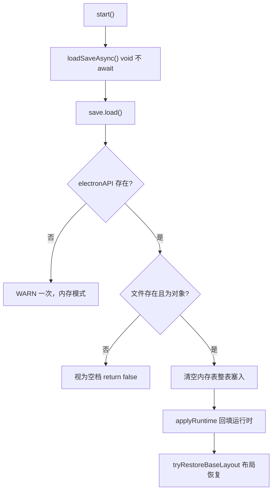

# 存档组件（SaveSlotComponent）

> **一句话定位**：挂在 GameInstance 上的 KV 内存表 + 手动落盘组件——游戏过程只写内存零 IO，`flush()` 才经 `writeJsonFile` IPC 整表写 JSON 文件。
> **什么时候会用到你**：给项目加存档/进度持久化时；排查"存档没写进去/读档后数据丢了"时；设计自动落盘策略（stop/destroy/周期）时。
> 代码位置：`src/engine/gameflow/SaveSlotComponent.ts`

## 1. 先记住这几个文件

| 文件 | 一句话职责 | 你要改它的场景 |
|---|---|---|
| [SaveSlotComponent.ts](../../src/engine/gameflow/SaveSlotComponent.ts) | 全部实现：KV 表 / load / flush / 自动 flush 策略 | 加加密、加多槽位、改落盘策略 |
| [FishGameInstance.ts](../../src/projects/fish/gameplay/FishGameInstance.ts) | 唯一在用的宿主：装配 + 钩子转发 + 手动存读档 | 新项目接入存档时照抄它的结构 |
| [FishSaveAdapter.ts](../../src/projects/fish/gameplay/common/FishSaveAdapter.ts) | fish 的 KV schema 适配层（版本迁移/回填） | 改存档字段结构时 |
| [main.ts](../../electron/main.ts) | writeJsonFile IPC：.json 校验 + 路径逃逸防护 | 动 IPC 白名单时才碰 |

**关键心智模型**：**内存优先，落盘是显式动作**。所有 `set/delete` 只改内存 Map 并置 `_dirty`，不触发任何 IO——`flush()`（或 autoFlush 策略）才是唯一写盘点。头注释明示设计决策："不依赖 GameInstance 快照虚方法，游戏侧无需实现序列化钩子"，存什么、什么时候存完全由游戏代码用 KV 自由组织。

## 2. 主流程：从 set 到磁盘上的 JSON

### 2.1 宿主装配（fish 是唯一参照实现）

```ts
// src/projects/fish/gameplay/FishGameInstance.ts:143
this.save = new SaveSlotComponent(this, {
  filePath: FISH_SAVE_FILE,   // src/projects/fish/data/save.json
})
this.addComponent(this.save)
```

构造只做三件事：校验 filePath 必填（缺了直接 throw）、归一化 autoFlush 策略、挂到 GameInstance。fish **没配 autoFlush**——纯手动模型，注释写明"唯一写盘入口是存档菜单'保存存档' → saveGame() → flush(force)"。

### 2.2 读档：start 里的 fire-and-forget



```ts
// FishGameInstance.ts:190
this.loadSaveAsync()
if (this.initialMode === 'base') return this.switchToPhase('base')
...

// FishGameInstance.ts:204
private loadSaveAsync(): void {
  void this.save.load().then(() => {
    applyRuntime(this)
    this._kvReady = true
    ...
    this.tryRestoreBaseLayout()
  })
}
```

两个刻意设计：`void` 不 await——`start()` 必须保持同步返回契约（switchToPhase 立刻路由阶段），读档在后台就绪后回填并补做布局恢复；`load()` 内部整表覆盖时**不走 `set()`**（直接 `_data.set`）——避免污染 `_dirty`，刚读进来的档不应该被标记为"有未落盘改动"。文件不存在返回 false 但**不算错误**（首次运行/刚清档是正常路径，error 匹配"不存在/No such"时不打 warn）。

### 2.3 写档：手动 flush 与脏标记

```ts
// SaveSlotComponent.ts:232
async flush(force = false): Promise<boolean> {
  if (!this._dirty && !force) return true
  const api = window.electronAPI
  if (!api?.writeJsonFile) {
    warnOnceNoIO('flush')
    return false
  }
  const obj: Record<string, KVValue> = {}
  for (const [k, v] of this._data) obj[k] = v
  const res = await api.writeJsonFile(this.filePath, obj)
  if (!res.success) {
    logger.warn(`[SaveSlot] flush 失败 "${this.filePath}": ${res.error}`)
    return false
  }
  this._dirty = false
  this._lastFlushedAt = new Date().toISOString()
  logger.info(`[SaveSlot] 已落盘 ${this._data.size} 项 → ${this.filePath}`)
  return true
}
```

`!dirty && !force` 直接返回 true——无改动时不重写文件。`force=true` 的用途见 fish 注释："首次游玩也能创建存档文件"（空表也写出一个 `{}`，让"存档存在"成为可判定状态）。整表序列化为 plain object 后走 `writeJsonFile`，与蓝图资产写盘共用同一条 IPC，main.ts 侧强校验 `.json` 后缀与路径逃逸（`..`），所以 filePath **必须在项目根目录内**——约定 `src/projects/<game>/data/*.json`。

### 2.4 自动 flush：钩子由宿主显式转发

```ts
// FishGameInstance.ts 的三处转发（组件自身没有 Tick 魔法）
this.save.tick(dt)      // :1087  GameInstance.tick 末尾 —— 周期 flush
this.save.onStop()      // :1185  GameInstance.stop 末尾 —— onStop 策略
this.save.onDestroy()   // :1212  GameInstance.destroy 末尾 —— onDestroy 策略
```

autoFlush 策略支持 `'onStop' | 'onDestroy' | 数字（毫秒周期）| 数组组合`，但**组件不会自动收到生命周期事件**——必须像 fish 一样在宿主的 tick/stop/destroy 里显式转发这三个调用（这正是 gameflow_system.md 里"钩子由项目 stop/destroy 转发"一句的完整含义）。周期策略内部只取所有数字项的**最小周期**且要求 `_dirty` 才落盘，避免空转写盘。

## 3. 活引用纪律：get 返回的是内部对象

```ts
// FishSaveAdapter.ts:32 —— 头注释纪律
// 纪律：SaveSlotComponent.get<T> 返回内部对象的活引用——所有写回一律传新建对象。

// FishSaveAdapter.ts:76
// 新建对象快照（组件返回值可能是活引用，直接存会绕过 dirty 纪律）
save.set('army', inst.training.getArmySnapshot())
save.set('queue', inst.training.getQueueSnapshot().map((t) => ({ ...t })))
```

`get()` 返回数组/对象时拿到的是**内存 Map 里的活引用**：外部改它等于绕过 `set()` 改了存档数据，但 `_dirty` 不会被置位——下次 flush 可能漏写。所以 fish 的适配层规定：写回一律传新建对象（快照或浅拷贝），读出来只想看的话直接用没关系。这是整个存档系统最容易踩的坑（踩坑 1）。

fish 在其上建了完整适配层：`FishSaveAdapter`（schema 版本迁移 `v` 字段、resources/army/queue/clearedLevels 的读写包装）+ `ProgressionService`/`ProductionService` 注入 `save` 引用消费——组件本身保持无 schema，结构知识全部在游戏侧。

## 4. 浏览器降级

```ts
// SaveSlotComponent.ts:298
let _noIoWarned = false
function warnOnceNoIO(op: string): void {
  if (_noIoWarned) return
  _noIoWarned = true
  logger.warn(`[SaveSlot] electronAPI JSON IPC 不可用（${op} 降级为内存模式，刷新即丢）`)
}
```

渲染进程没有 `electronAPI`（编辑器 Mock、纯浏览器模式、单测）时，load 返回 false、flush 返回 false，KV 读写照常工作——**降级为纯内存模式，只 WARN 一次**（模块级开关，避免周期 flush 场景每帧刷屏）。Playwright 浏览器调试时存档功能"看起来正常"但刷新即丢，是预期行为。

## 5. 关键方法速查

| 方法 | 位置 | 干什么 | 注意 |
|---|---|---|---|
| `get<T>(key)` | [SaveSlotComponent.ts:97](../../src/engine/gameflow/SaveSlotComponent.ts) | 读 key，缺失返回 null | 返回活引用，见 §3 |
| `require<T>(key)` | [SaveSlotComponent.ts:102](../../src/engine/gameflow/SaveSlotComponent.ts) | 读 key，缺失抛错 | 语义明确的必填字段用 |
| `getOrDefault(key, fb)` | [SaveSlotComponent.ts:107](../../src/engine/gameflow/SaveSlotComponent.ts) | 读 key 带 fallback | 缺省值场景 |
| `set(key, v)` | [SaveSlotComponent.ts:116](../../src/engine/gameflow/SaveSlotComponent.ts) | 写内存 + 置 dirty | 零 IO |
| `load()` | [SaveSlotComponent.ts:184](../../src/engine/gameflow/SaveSlotComponent.ts) | 文件 → 内存整表覆盖 | 不置 dirty；文件不存在不算错 |
| `flush(force?)` | [SaveSlotComponent.ts:232](../../src/engine/gameflow/SaveSlotComponent.ts) | 内存整表 → 文件 | force 创建空档文件 |
| `tick(dt)` | [SaveSlotComponent.ts:265](../../src/engine/gameflow/SaveSlotComponent.ts) | 周期 flush 计时 | 宿主 tick 转发，最小周期生效 |
| `onStop()` / `onDestroy()` | [SaveSlotComponent.ts:281](../../src/engine/gameflow/SaveSlotComponent.ts) | 钩子 flush | 宿主 stop/destroy 转发 |

## 6. 流程影响：牵动哪些功能

### 上游：谁驱动它

| 上游 | 怎么驱动 | 相关文档 |
|---|---|---|
| GameInstance 生命周期 | start 里 load；tick/stop/destroy 转发自动 flush 钩子 | [gameflow_system.md](./gameflow_system.md) |
| 游戏 UI（存档菜单） | "保存存档"→ saveGame → flush(true)；"读取存档"→ loadGame → load | [level_system.md](../engine/../projects/level_system.md) |
| gameplay 服务层 | ProductionService / ProgressionService 持 save 引用读写进度 | [gameplay_code_standard.md](../engine/../projects/gameplay_code_standard.md) |

### 下游：它波及谁

| 下游功能 | 波及点 | 相关文档 |
|---|---|---|
| Electron IPC writeJsonFile | 落盘唯一通道，.json 校验 + 逃逸防护在 main.ts | [mcp_integration.md](../editor/integration/mcp_integration.md) |
| 布局恢复门控 | KV 就绪（`_kvReady`）与场景构建双条件，读档时序影响基地重建 | [level_system.md](../engine/../projects/level_system.md) |
| Playwright 浏览器调试 | 无 IPC 降级内存模式，存档断言需区分环境 | [playwright_commands.md](../testing/playwright_commands.md) |

## 7. 踩坑清单（都有代码依据）

**1. 改了 get 出来的对象，flush 后数据没变** —— 原因：`get` 返回活引用，外部直接改不经过 `set`，`_dirty` 未置位，flush 跳过。规则：写回一律传新建对象（快照/浅拷贝），参照 `FishSaveAdapter.ts:76-78` 的写法。

**2. 配了 autoFlush 却从来没自动落盘** —— 原因：钩子不是自动的，宿主 GameInstance 必须在 tick/stop/destroy 里显式转发 `save.tick/onStop/onDestroy`（组件注释"钩子由宿主 GameInstance 显式转发"）。规则：接入 autoFlush 时三处转发一个都不能少，缺哪条对应策略就静默失效。

**3. flush 报错或写到了奇怪的地方** —— 原因：filePath 不在项目根目录内（main.ts 逃逸防护拒绝 `..`）或不是 `.json` 结尾（IPC 强校验）。规则：路径固定用 `src/projects/<game>/data/xxx.json` 相对路径。

**4. Playwright 浏览器模式测存档，刷新后进度丢失** —— 原因：无 electronAPI，降级纯内存模式（控制台有且仅有一条 WARN）。规则：浏览器模式只测 KV 逻辑不测落盘；落盘验证去 Electron 里做。

**5. start 里同步读 save.get 拿到的全是空** —— 原因：`loadSaveAsync` 是 fire-and-forget，start 同步返回时读档可能还没完成。规则：依赖存档数据的初始化放 `load().then` 回调里（参照 `applyRuntime` + `tryRestoreBaseLayout` 的时序），或检查 `_kvReady` 门控。

## 8. 边界条件

| 条件 | 行为 | 怎么应对 |
|---|---|---|
| 构造缺 filePath | 直接 throw | 必填，不提供无路径模式 |
| 文件不存在 | load 返回 false，视为空档 | 首次运行正常路径 |
| 文件内容非对象（数组/标量） | warn + 保留空表 | 手改坏档的自愈 |
| KV 值类型 | 仅 JSON 兼容（KVValue 递归定义） | 存 THREE.Vector 等需先转 plain |
| 重复 load | 整表覆盖内存，dirty 清零 | 不合并旧内存数据 |
| 周期 flush 无改动 | 不写盘（`_dirty` 门控） | 空转零 IO |
| autoFlush 数字项多个 | 取最小周期 | 无需自己合并 |
| electronAPI 缺失 | 内存模式，WARN 一次 | 浏览器/单测环境预期行为 |
