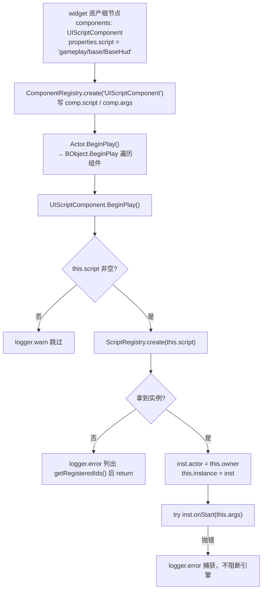

# 行为脚本系统（Script）

> **一句话定位**：`BehaviourScript` 是挂在 **UI Actor** 上的轻量行为载体——把「UI 结构（widget 资产）」与「UI 行为（TypeScript 代码）」解耦，脚本只写逻辑，挂载关系由资产的 `UIScriptComponent.script` 字段声明。
>
> **什么时候会用到你**：给某个 UI 面板写交互（按钮绑定 / 文本刷新 / 动态生成卡片）、排查「脚本没执行 / `script` 未注册 / `findInChildren` 找不到节点 / UI 销毁后回调还在跑」、新增一个 `.script.ts` 文件。
>
> 代码位置：`src/engine/script/`

---

## 1. 先记住这几个文件

| 文件 | 一句话职责 | 你要改它的场景 |
|---|---|---|
| [ScriptRegistry.ts](../../src/engine/script/ScriptRegistry.ts) | 「脚本 id → 构造器」的静态 Map，负责 `create` 与批量注册 | 改 id 推导规则、加注册诊断 |
| [BehaviourScript.ts](../../src/engine/script/BehaviourScript.ts) | 脚本基类：`actor` / `world` / `gameMode` / `findInChildren`，三个生命周期空实现 | 给所有脚本加一个通用能力 |
| [UIScriptComponent.ts](../../src/engine/ui/UIScriptComponent.ts) | 唯一挂载点：`BeginPlay` 里 new 脚本、`Tick` 里转发 `onUpdate`、`EndPlay` 里收尾 | 改脚本的实例化/驱动时机 |
| [index.ts](../../src/projects/fish/asset/index.ts)（项目资产入口） | `import.meta.glob` 扫描 `../gameplay/**/*.script.ts` 交给注册中心 | 新项目接入脚本扫描 |

**关键心智模型**：脚本**不自己注册**（没有 `ScriptRegistry.register` 散落在业务代码里），靠**文件路径**被 glob 捡走；脚本也**不被引擎直接驱动**，它是 `UIScriptComponent` 的附属品——组件活着脚本才 Tick，组件销毁脚本就死。所以「脚本为什么没跑」的第一个排查点永远是**组件那行 `script` 字段**，不是脚本文件本身。

---

## 2. 一个 `*.script.ts` 怎么跑到游戏里：从文件到 Tick

### 2.1 谁注册了它

注册链路有三级，脚本作者只参与第 ① 级（按约定命名 + 默认导出）：

```ts
// src/projects/fish/asset/index.ts
const scriptModules = import.meta.glob<{ default: BehaviourScriptConstructor }>(
  '../gameplay/**/*.script.ts',
  { eager: true },
)

AssetRegistry.registerAll({
  scenes,
  blueprintModules: bpModules,
  scriptModules,
})
```

> **为什么 `eager: true`**：非 eager 的 glob 返回的是「路径 → 动态 import 函数」的懒加载表，`ScriptRegistry.register` 需要的是**构造器本身**。用懒加载就得在 `create` 时 `await`，而 `UIScriptComponent.BeginPlay()` 是同步的，做不到。代价是工程打开时所有脚本模块被一次性求值——脚本文件顶层的重活会拖慢注册。

> **注意 glob 的范围是 `../gameplay/**`**：相对 `asset/index.ts` 往上一级再进 `gameplay`，**只扫项目 `gameplay/` 目录**。把脚本文件放到 `src/projects/fish/asset/` 或 `src/projects/fish/hud/` 下都不会被捡到（旧文档写「扫描所有 `*.script.ts`」是错的）。

id 由文件路径推导，没有第二种写法：

```ts
// src/engine/script/ScriptRegistry.ts
function globKeyToScriptId(key: string): string {
  return key
    .replace(/^\.\.\//, '')   // 去掉 '../' 前缀
    .replace(/\.script\.ts$/, '') // 去掉 '.script.ts' 后缀
}
```

`../gameplay/base/BaseHud.script.ts` → `gameplay/base/BaseHud`。**id 是路径式的、带目录**，两个不同目录下的同名 `Hud.script.ts` 不会冲突。但反过来——**移动或重命名脚本文件，id 立刻变**，引用它的 widget 资产不会跟着改，直接掉进「脚本未注册」。

`registerAll` 收到 `scriptModules` 后原样转交：`if (assets.scriptModules) { ScriptRegistry.registerAll(assets.scriptModules) }`（[AssetRegistry.ts:82](../../src/engine/asset/AssetRegistry.ts)）。

```ts
// src/engine/script/ScriptRegistry.ts:69
static registerAll(scriptModules: ScriptModules): void {
  for (const [key, mod] of Object.entries(scriptModules)) {
    const id = globKeyToScriptId(key)
    const ctor = mod?.default
    if (!ctor) {
      logger.warn(`[ScriptRegistry] 脚本模块 ${key} 缺少默认导出，已跳过`)
      continue
    }
    ScriptRegistry.register(id, ctor)
    logger.debug(`[ScriptRegistry] 注册脚本: ${id} (来自 ${key})`)
  }
}
```

> **为什么必须 `export default`**：取的是 `mod.default`，写成 `export class BaseHudScript` 会命中 `logger.warn` 静默跳过——文件被扫到了但没注册，控制台只有一条 debug 级日志，很容易被当成「引擎 bug」。

注册发生在**打开工程时**，不是游戏启动时（`registry.ts:119` `registerProjectAssets`）。热重载脚本文件**不会**重跑 glob：改了脚本要重启工程或触发工程切换。切换/关闭工程时 `clearProjectAssets()` 调 `ScriptRegistry.clearAll()`（`registry.ts:133`），旧工程脚本 id 全部作废。

### 2.2 实例化与挂载



实例化这段是**唯一** new 脚本的地方：

```ts
// src/engine/ui/UIScriptComponent.ts:34
override BeginPlay() {
  super.BeginPlay()
  if (!this.script) {
    logger.warn(`[UIScriptComponent] "${this.owner.name}" 未配置 script，跳过`)
    return
  }
  const inst = ScriptRegistry.create(this.script)
  if (!inst) {
    logger.error(
      `[UIScriptComponent] 脚本 "${this.script}" 未注册（owner="${this.owner.name}"）。已注册: [${ScriptRegistry.getRegisteredIds().join(', ')}]`,
    )
    return
  }
  inst.actor = this.owner
  this.instance = inst
  try {
    inst.onStart(this.args)
    logger.info(`[UIScriptComponent] 脚本 "${this.script}" 已挂载到 "${this.owner.name}"`)
  } catch (e) {
    logger.error(`[UIScriptComponent] 脚本 "${this.script}" onStart 抛错: ${(e as Error).message}`)
  }
}
```

三点要记牢：

1. **`inst.actor = this.owner` 在 `onStart` 之前**。`onStart` 一进来就能用 `this.actor` / `this.world` / `this.gameMode`；但 `ScriptRegistry.create` 是 `new ctor()` 无参构造，构造期 `actor` 还没注入，所以拿宿主、查节点只能写在 `onStart` 里，不能写在字段初始化器里。
2. **`onStart` 被 try/catch 包住**，抛错只记日志、不向上冒泡。好处是一个脚本写崩了不拖垮整个 UI；代价是脚本挂了在界面上表现为「什么都没发生」，得去日志找 `onStart 抛错`。
3. **未注册的 id 是 `logger.error` + `return`，不抛异常**，组件继续存在但 `instance` 恒为 null，`Tick` 里 `this.instance?.onUpdate` 全部静默跳过。错误日志会打出 `getRegisteredIds()` 全量列表，直接对着看 id 拼写。

### 2.3 生命周期与每帧驱动

脚本自己没有驱动源，全靠组件转发：

```ts
// src/engine/ui/UIScriptComponent.ts:57
override Tick(deltaTime: number) {
  super.Tick(deltaTime)
  this.instance?.onUpdate(deltaTime)
}

override EndPlay() {
  super.EndPlay()
  try {
    this.instance?.onDestroy()
  } catch (e) {
    logger.error(`[UIScriptComponent] 脚本 "${this.script}" onDestroy 抛错: ${(e as Error).message}`)
  }
  // 脚本终态（BObject.EndPlay 自动 markDestroyed + 注册表注销），幂等
  this.instance?.EndPlay()
  this.instance = null
}
```

驱动链是：`World.tick` → `this.ui.tickUI(dt)`（[World.ts:261](../../src/engine/gameflow/World.ts)）→ `UIManager.tickUI` 遍历 `_uiActors` 调 `actor.Tick(dt)`（[UIManager.ts:480](../../src/engine/ui/UIManager.ts)）→ `BObject.Tick` 遍历 `bEnabled` 的组件（[BObject.ts:52](../../src/engine/entity/BObject.ts)）→ `UIScriptComponent.Tick` → `onUpdate`。

> **脚本只挂在 UI Actor 上**：`UIScriptComponent extends Component<Actor>`，而它只在 widget 资产里出现、只由 `UIManager` 那条 UI Actor 链驱动。它**不是**给 3D Actor 写玩法逻辑的通用脚本（3D 玩法逻辑写 GameMode / Controller / 组件，见 [gameplay 代码规范](../projects/gameplay_code_standard.md)）。

> **EndPlay 的顺序是「先 onDestroy、再 BObject.EndPlay」**：`onDestroy` 是脚本还能说话的最后时机（清回调、清集合），此时 `actor` 仍在；`BObject.EndPlay()` 之后 `markDestroyed()` 生效，对象从注册表注销。基类三个空实现都调了 `assertValid`（[BehaviourScript.ts:43/48/53](../../src/engine/script/BehaviourScript.ts)），销毁后被调用会直接抛错——这是给异步回调兜底的（定义见 [OObject.ts:55](../../src/engine/entity/OObject.ts)）。

`onUpdate` 的写法有个**必须遵守的性能约束**：每帧都在跑，只有值变了才写组件。`BattleHud.script.ts` 的倒计时段是标准写法：

```ts
// src/projects/fish/gameplay/battle/BattleHud.script.ts:290
if (this.timerText) {
  const sec = gm.getTimeRemainingSec()
  if (sec !== this.lastTimerSec) {
    this.lastTimerSec = sec
    this.timerText.text = sec > 0 ? `⏱ ${Math.floor(sec / 60)}:${String(sec % 60).padStart(2, '0')}` : '时间到'
    this.timerText.color = sec <= 30 ? '#ff5252' : '#ffffff'
  }
}
```

> **为什么每次都判 `!== last`**：写 `UITextComponent.text` 会触发重绘。不判等就是每秒 60 次无意义重绘。`BattleHud`、`TasksUi`、`GemShop`、`BarracksUi`、`BuildingUpgrade` 全部用「缓存上次值 + 变化才写」这个模式。

---

## 3. UI 脚本这条支线

资产侧不直接写 JSON，写在 `.widget.html` 源里，由 UI 编译器发射成组件：

```html
<!-- src/projects/fish/asset/blueprints/ui/base_hud.widget.html -->
<widget name="FishBaseHUD" canvas="1920x1080" world="9.6x5.4" data-script="gameplay/base/BaseHud">
```

编译器 `emitDataScript`（[compile.ts:1538](../../src/editor/asset/uiCompiler/compile.ts)）把它翻成：

```json
{
  "baseClass": "UIScriptComponent",
  "properties": { "script": "gameplay/base/BaseHud" }
}
```

两个反直觉点：

- **`data-script` 可以写在任意元素上，不一定是根节点**。多数面板挂根（`base_hud`），但 `main_menu` 挂在按钮上：`<button class="StartButton" data-script="gameplay/menu/MainMenu">`。此时 `this.actor` 是那个 button 节点，`MainMenu.script.ts` 就直接 `this.actor.getComponent(UIButtonComponent)`，不用 `findInChildren`。
- **按钮交互态色不经过脚本**：`:hover` / `:active` / `:disabled` 的 color/opacity 由 `emitButtonStates`（[compile.ts](../../src/editor/asset/uiCompiler/compile.ts)）写进 `UIButtonComponent.stateColors`，状态机切换时按钮**原生驱动**同 Actor 的视觉 Image 上色（`applyStateVisual`），脚本零参与、也无须轮询（历史上有过"透传 args + 脚本 onUpdate 轮询上色"的方案，已被原生机制取代；旧资产里的 `UIScript.args.hover` 键反编译仍识别，属兼容残留）。

脚本内查节点用 `findInChildren`，它沿 `root.name` 精确匹配递归（[BehaviourScript.ts:63](../../src/engine/script/BehaviourScript.ts)，底层 `Actor.getChildren` 见 [Actor.ts:292](../../src/engine/entity/Actor.ts)）：

```ts
// src/projects/fish/gameplay/base/BaseHud.script.ts:60
const buildBtnActor = this.findInChildren('Btn_build')
const buildBtn = buildBtnActor?.getComponent(UIButtonComponent)
if (buildBtn) {
  buildBtn.onClick = () => mode.toggleBuildMode()
  logger.info('[BaseHudScript] 建筑按钮已绑定（切换建筑模式）')
} else {
  logger.warn('[BaseHudScript] 未找到 Btn_build 按钮，跳过')
}
```

> **比的是 `root.name`（THREE.Group 的名字），不是 Actor 变量名**，且只向下搜**子树**——跨面板拿不到。要拿别的面板，得持有对方 Actor 再 `getComponent(UIScriptComponent)`，如 `Tips.script.ts:265`：`panel.getComponent(UIScriptComponent) as TipsScript | null`，拿到后直接调脚本自己的公开方法。

脚本能拿到的东西一共四样：`this.actor`（宿主 Actor）、`this.world`、`this.gameMode`、`this.findInChildren()`。要 GameInstance 用 `GameInstance.current` 强转；要按数值表动态生成节点用 `world.ui.spawnUIActor`（[UIManager.ts:131](../../src/engine/ui/UIManager.ts)），`MapPanel.script.ts` 读关卡表生成卡片即此模式。

---

## 4. 关键方法速查

| 方法 | 位置 | 干什么 | 注意 |
|---|---|---|---|
| `ScriptRegistry.registerAll(scriptModules)` | [ScriptRegistry.ts:69](../../src/engine/script/ScriptRegistry.ts) | 遍历 glob 结果推导 id 注册 | 缺 `default` 导出只 warn 跳过 |
| `ScriptRegistry.create(id)` | [ScriptRegistry.ts:44](../../src/engine/script/ScriptRegistry.ts) | `new ctor()` 返回实例，未注册返回 `null` | 唯一调用方是 `UIScriptComponent.BeginPlay`（`UIScriptComponent.ts:40`） |
| `ScriptRegistry.register(id, ctor)` | [ScriptRegistry.ts:39](../../src/engine/script/ScriptRegistry.ts) | 单条注册 | 仅被 `registerAll` 内部调用（`ScriptRegistry.ts:77`），业务代码不要手调 |
| `ScriptRegistry.has(id)` | [ScriptRegistry.ts:51](../../src/engine/script/ScriptRegistry.ts) | 查 id 是否已注册 | **当前无调用方**（引擎自检外无人用） |
| `ScriptRegistry.getRegisteredIds()` | [ScriptRegistry.ts:56](../../src/engine/script/ScriptRegistry.ts) | 返回全部 id | 仅用于未注册时的错误日志 |
| `ScriptRegistry.clearAll()` | [ScriptRegistry.ts:61](../../src/engine/script/ScriptRegistry.ts) | 清空映射 | 切换/关闭工程时由 `registry.ts:133` 调 |
| `globKeyToScriptId(key)` | [ScriptRegistry.ts:30](../../src/engine/script/ScriptRegistry.ts) | `../gameplay/base/BaseHud.script.ts` → `gameplay/base/BaseHud` | 模块私有函数，改它就改了所有资产的 id |
| `BehaviourScript` 构造 | [BehaviourScript.ts:28](../../src/engine/script/BehaviourScript.ts) | `super(new.target.name)`，无参 | 此时 `actor` 未注入，字段初始化器里不能用 `this.actor` |
| `get world()` | [BehaviourScript.ts:33](../../src/engine/script/BehaviourScript.ts) | `actor?.world ?? null` | 宿主未入世界返回 null |
| `get gameMode()` | [BehaviourScript.ts:38](../../src/engine/script/BehaviourScript.ts) | `actor?.world?.gameMode ?? null` | 拿不到就 `logger.warn` 跳过绑定，别假设非空 |
| `onStart(args?)` | [BehaviourScript.ts:43](../../src/engine/script/BehaviourScript.ts) | 树就绪后一次，绑按钮/建引用 | 抛错被组件 catch，只记日志 |
| `onUpdate(dt)` | [BehaviourScript.ts:48](../../src/engine/script/BehaviourScript.ts) | 每帧 | 必须缓存上次值、变化才写组件 |
| `onDestroy()` | [BehaviourScript.ts:53](../../src/engine/script/BehaviourScript.ts) | 宿主销毁，清回调 | 重写时**要调 `super.onDestroy()`**（走 `assertValid`） |
| `findInChildren(name)` | [BehaviourScript.ts:63](../../src/engine/script/BehaviourScript.ts) | 子树内按 `root.name` 递归查找 | 只向下、只比 `root.name`；同名的返回**首个** |
| `UIScriptComponent.BeginPlay()` | [UIScriptComponent.ts:34](../../src/engine/ui/UIScriptComponent.ts) | 注入 actor + new 脚本 + `onStart` | `bEnabled=false` 的组件不会被调（[BObject.ts:44](../../src/engine/entity/BObject.ts)） |
| `UIScriptComponent.Tick(dt)` | [UIScriptComponent.ts:57](../../src/engine/ui/UIScriptComponent.ts) | 转发 `onUpdate` | `instance` 为 null 时静默跳过 |
| `UIScriptComponent.EndPlay()` | [UIScriptComponent.ts:62](../../src/engine/ui/UIScriptComponent.ts) | `onDestroy` → `EndPlay` → 置 null | 幂等，`markDestroyed` 允许重复 |
| `AssetRegistry.registerAll(assets)` | [AssetRegistry.ts:58](../../src/engine/asset/AssetRegistry.ts) | 场景/蓝图/脚本一把注册 | `scriptModules` 是可选字段，不传就不注册脚本 |

---

## 5. 流程影响：牵动哪些功能

### 上游：谁驱动它

| 上游 | 怎么驱动 | 相关文档 |
|---|---|---|
| 项目 `asset/index.ts` 的 `import.meta.glob` | 扫描 `../gameplay/**/*.script.ts`，eager 求值后交给 `AssetRegistry.registerAll` | [./asset_tools_system.md](./asset_tools_system.md) |
| `registerProjectAssets` / `clearProjectAssets` | 打开工程时注册、切换工程时 `ScriptRegistry.clearAll()` | [./asset_tools_system.md](./asset_tools_system.md) |
| `ComponentRegistry.register('UIScriptComponent')` | 资产里的 `baseClass` 靠它造出组件实例并填 `script` / `args` | [./asset_tools_system.md](./asset_tools_system.md) |
| `World.tick` → `UIManager.tickUI` → `Actor.Tick` → `BObject.Tick` | 每帧把 `onUpdate` 送到脚本 | [./gameflow_system.md](./gameflow_system.md) |
| UI 编译器 `emitDataScript` / `emitButtonStates` | `.widget.html` 的 `data-script` → `UIScriptComponent`；交互态色 → `UIButtonComponent.stateColors`（引擎原生驱动） | [./ui_system.md](./ui_system.md) |
| `assetLint` 的 `comp:UIScriptComponent` 检查器 | 校验 `properties.script` 为 string、`args` 为 object | [./asset_tools_system.md](./asset_tools_system.md) |

### 下游：它波及谁

| 下游功能 | 波及点 | 相关文档 |
|---|---|---|
| 世界 UI（`UIManager` / 控件组件） | 脚本用 `findInChildren` + `getComponent(UIButtonComponent/UITextComponent)` 直接改组件状态；`spawnUIActor` 动态生面板 | [./ui_system.md](./ui_system.md) |
| 实体与组件体系 | 脚本是 `BObject` 子类，随组件 `EndPlay` 走 `markDestroyed`；宿主 `bActive` 由脚本改写（如 HUD 自隐） | [./entity_system.md](./entity_system.md) |
| GameMode / GameState | 脚本经 `this.gameMode` 调玩法方法、订阅广播回调（`onBuildModeChange` 等），`onDestroy` 必须解绑 | [../projects/gameplay_code_standard.md](../projects/gameplay_code_standard.md) |
| 配置表 / 存档 | 脚本读 `getLevelTable()` / `getTroopTable()` 动态生成 UI；`GameInstance.resources.onChange` 驱动文本刷新 | [./asset_tools_system.md](./asset_tools_system.md) |
| 场景与阶段切换 | 切阶段销毁旧 UI → 组件 `EndPlay` → 脚本 `onDestroy`；新阶段的 widget 重新走一遍注册 id 查找 | [./gameflow_system.md](./gameflow_system.md) |

---

## 6. 踩坑清单

**1. 日志报「脚本 xxx 未注册」，但文件明明存在** —— `ScriptRegistry.create` 走 Map 精确查找。三种成因：文件不在 `gameplay/` 下（glob 只扫 `../gameplay/**`）、改名/移动后 id 变了而 widget 资产里的 `script` 不会跟着变、文件没写 `export default`（只 warn 跳过）。规则：改脚本路径时**同步改引用它的 `data-script`**。

**2. 脚本 `onStart` 里 `this.actor` 是 undefined** —— `ScriptRegistry.create` 是 `new ctor()` 无参构造，`inst.actor = this.owner` 在之后才赋值。规则：所有依赖 `actor` 的初始化写进 `onStart`，不要写进字段初始化器或构造函数。

**3. 脚本写崩了但游戏照跑，界面毫无反应** —— `inst.onStart(this.args)` 被 try/catch 包住，只 `logger.error`。规则：验证脚本是否生效，先查日志里的 `onStart 抛错` 与 `已挂载到`，别只看画面。

**4. UI 面板关掉后回调还在跑、报「已销毁」** —— 脚本在 `onStart` 里给 GameMode 挂了广播回调（`onBuildModeChange` 等），不清理就会悬挂。规则：**`onStart` 里挂的每一个回调，都要在 `onDestroy` 里置 null**，见 `BaseHud.script.ts:133`。

**5. `onUpdate` 里直写文本导致帧率掉** —— 写 `UITextComponent.text` / `UIButtonComponent.state` 触发重绘，每帧无脑写就是 60Hz 重绘。规则：缓存 `lastXxx`，值变了才写，见 `BattleHud.script.ts:290`。

**6. `findInChildren` 一直返回 null** —— 它比的是 `child.root.name`（THREE.Group 名），且只在宿主子树的**后代**中搜。规则：查不到先看资产里节点的 `name` 属性；跨面板拿节点改用 `actor.getComponent(UIScriptComponent)` 拿脚本实例。

**7. 改了脚本代码，重启游戏没生效** —— glob 注册发生在**打开工程时**，HMR 只重载模块不重跑 glob。规则：改脚本后重启工程或触发一次工程切换。

---

## 7. 边界条件

| 条件 | 行为 | 怎么应对 |
|---|---|---|
| `properties.script` 为空串 | `logger.warn` 后 `return`，`instance` 恒 null | 按编译器对无 `data-script` 交互态色的 warning 补齐 |
| `ScriptRegistry.create` 未命中 | `logger.error` 列出全部已注册 id 后 `return`，不抛异常 | 对着日志里的 id 列表核对拼写与目录 |
| 脚本模块无 `export default` | `registerAll` `logger.warn` 跳过该模块 | 一律 `export default class XxxScript extends BehaviourScript` |
| `script` id 与导出类名不一致 | 正常运行——id 只认路径，类名只影响 `BObject.name` | 保持文件名与类名同前缀，便于日志排查 |
| `onStart` 抛异常 | catch 后 `logger.error`，后续 `Tick` 全静默跳过 | 查 `onStart 抛错` 日志 |
| 宿主 Actor 已销毁后调脚本方法 | 基类三钩子里的 `assertValid` 抛错 | 异步回调/定时器入口自行调 `assertValid()` |
| 组件 `bEnabled=false` | `BObject` 不调 `BeginPlay` / `Tick`，脚本不实例化也不更新 | 检查组件是否被代码置为 disabled |
| 切换/关闭工程 | `clearProjectAssets` → `ScriptRegistry.clearAll()`，旧 id 全部失效 | 新工程需有自己的 `registerAssets` 扫描 |
| 同名脚本在不同目录 | 不冲突——id 含目录（`gameplay/base/X` vs `gameplay/battle/X`） | 移动文件视为改 id |
| 多个 `UIScriptComponent` 挂同一节点 | 每个组件各 new 一个脚本实例，各自 `onStart`，都会收到 `root.name` 相同的 `findInChildren` 结果 | 一个节点挂一个；需要多行为拆成子节点 |
| 反复 `EndPlay` | 幂等：`BObject.EndPlay` 允许重复 `markDestroyed`，`instance` 置 null 后 `?.` 全跳过 | 无需额外防护 |
