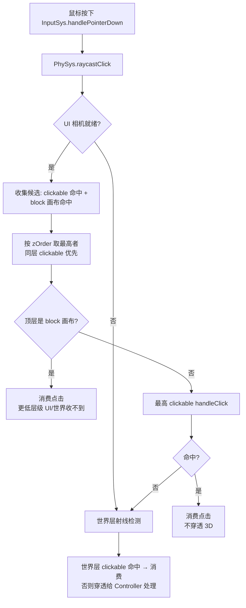

# CanvasUIComponent（UI 画布组件）

> 引擎级 UI 渲染与命中测试组件：Canvas 2D 自绘贴图到 3D 世界空间平面，承载 UI 树渲染；提供仿 UE `EVisibility` 的命中测试模式（visible / block / hitTestInvisible）。
> 代码位置：`src/engine/rendering/CanvasUIComponent.ts`
> 相关文档：[系统总览](../system_overview.md) / [世界 UI 系统](./ui_system.md) / [UI 锚点系统](../ui_anchor_system.md) / [输入物理脚本](./input_physics_script_system.md)

## 1. 概述

`CanvasUIComponent` 是 UI 树的**渲染根组件**：用 `<canvas>` 2D API 自绘内容 → 贴到 `THREE.PlaneGeometry` → 挂载为 Actor 的 Component（与 SpriteComponent / MeshComponent 同级）。每个 UI Actor 通常挂一个本组件（`UIImageComponent` / `UITextComponent` 是它的子类或派生控件）。

**两大职责**：

1. **渲染**：纯 GPU 位图渲染（作为贴图 mesh），`active=false` 时统一隐藏自身 + 子树所有注册的渲染对象（显隐控制中心）
2. **命中测试**（2026-08-15 新增，仿 UE `EVisibility`）：`hitTest` 枚举决定画布如何参与点击检测——可命中 / **拦截点击** / 穿透

`markerOnly` 模式（`UIMarker`）不创建渲染 mesh，仅把 Actor 标记为 UI 元素，不参与命中拦截。

| 角色 | 干什么 |
|---|---|
| `CanvasUIComponent` | 画布渲染 + 显隐控制 + 命中测试模式（本组件） |
| `PhySys` | 点击分发：UI 层遮挡竞争（clickable + block 画布按 zOrder 竞争） |
| `UITransformComponent` | 尺寸权威（worldWidth/worldHeight）+ 锚点定位 |
| `UIImageComponent` / `UITextComponent` | 派生渲染控件（继承/组合本组件能力） |

## 2. 核心属性 / 选项

| 选项 | 类型 | 默认 | 说明 |
|---|---|---|---|
| `width` / `height` | number | 512 / 256 | canvas 像素分辨率 |
| `worldWidth` / `worldHeight` | number | 5 / 2.5 | 3D 世界尺寸（米）；未显式传时读 owner 的 uitransform |
| `doubleSided` | boolean | true | 双面可见 |
| `zOrder` | number | 0 | UI 层级（越大越靠前）：`renderOrder` + `position.z = zOrder × 0.001` 分层 |
| `active` | boolean | true | 节点级显隐（false = 不渲染，统一隐藏自身 + 子树渲染对象） |
| `markerOnly` | boolean | false | 仅标记模式：不创建渲染 mesh，仅声明"本 Actor 是 UI" |
| `hitTest` | `'visible' \| 'block' \| 'hitTestInvisible'` | `'visible'` | 命中测试模式（仿 UE EVisibility） |

### hitTest 枚举语义（仿 UE）

| 值 | 渲染 | 命中测试 | 典型用途 |
|---|---|---|---|
| `'visible'` | ✅ | 可被射线命中（默认） | 普通面板：按钮/图片区域可点，空白处射线穿透到更低层级 |
| `'block'` | ✅ | **拦截点击**：画布 mesh 命中射线即消费，挡住更低 zOrder 的 UI 与 3D 世界 | 模态遮罩、GM 控制台、暂停/结算全屏层 |
| `'hitTestInvisible'` | ✅ | 完全穿透（不参与任何命中/拦截） | 装饰性画布（纯展示不接受点击） |

## 3. 使用方法

### 3.1 代码构造

```ts
import { CanvasUIComponent, type UIHitTestMode } from '@/engine'

const actor = new GenericActor('Modal')
actor.addComponent(new UITransformComponent(actor, { worldWidth: 9.6, worldHeight: 5.4 }))
const canvas = new CanvasUIComponent(actor, {
  width: 1920, height: 1080,
  hitTest: 'block',            // 拦截点击（模态遮罩）
  zOrder: 100,
})
actor.addComponent(canvas)
world.SpawnActor(actor)
```

运行时切换（Inspector / 脚本 / 调试）：

```ts
canvas.hitTestMode = 'block'              // 注册到 PhySys 参与拦截
canvas.hitTestMode = 'hitTestInvisible'   // 穿透（自动从 PhySys 注销）
```

### 3.2 蓝图 / widget 资产声明

```json
{
  "baseClass": "CanvasUIComponent",
  "properties": {
    "width": 1920,
    "height": 1080,
    "zOrder": 100,
    "hitTest": "block"
  }
}
```

assetLint 已支持：`comp:CanvasUIComponent` schema 含 `properties.hitTest` 枚举（`visible`/`block`/`hitTestInvisible`），非法值报错。

### 3.3 触发时机与使用前提

- `hitTest:'block'` 的注册时机：构造（`hitTestMode` setter）/ `BeginPlay` 兜底（组件未全挂载时）；注销时机：`EndPlay` / 退出 block 模式
- 点击拦截在 `PhySys.raycastClick` 的 UI 层生效（需 UI 相机已 setup）
- **同 zOrder 竞争规则**：clickable 优先于 block 画布（同层按钮先于遮罩），block 仅在 zOrder 严格更高时胜出

## 4. 工作流程

### 4.1 渲染管线

```mermaid
flowchart LR
    A[Canvas 2D 自绘<br/>draw()/markDirty] --> B[CanvasTexture]
    B --> C[PlaneGeometry mesh<br/>scale = 世界尺寸]
    C --> D[owner.root 挂载]
    D --> E[UI 场景叠加渲染<br/>renderOrder = zOrder]
```

### 4.2 点击拦截（遮挡竞争）



- `block` 画布命中测试用 `uiRay.intersectObject(panel)`（沿父链 visible 过滤：父隐藏则穿过）
- 穿透语义：`visible` 画布的空白处（无 clickable 命中）与 `hitTestInvisible` 画布不拦截，射线继续到更低层级/世界层

### 4.3 设计要点

- **UI 永远在顶层**：UI 层命中即消费（`block` 或 clickable），3D 世界永远收不到 UI 下方的点击
- **显隐控制中心**：`active=false` 统一隐藏自身 panel + 子树注册的渲染对象（UIText troika mesh 等）；隐藏的画布/按钮不响应射线（沿父链 visible 过滤，与 Unity 一致）
- **zOrder 是全局渲染顺序**（跨层比较）：block 画布必须比目标层级 zOrder 更高才能拦住它——GM 控制台用 `GM_ZORDER_BASE=1000` 保证盖过一切浮动面板

## 5. 边界条件

| 条件 | 行为/后果 | 处理方式 |
|---|---|---|
| `markerOnly: true` | `panel=null`，不创建 mesh/不参与拦截；仅标记 Actor 为 UI | 子元素 UIMarker 约定 |
| `hitTest:'block'` 但画布 `visible=false` | 不拦截（沿父链 visible 过滤，射线穿过） | 引擎内置 |
| 同 zOrder 的 clickable 与 block 同时命中 | clickable 优先（按钮先于遮罩） | 遮挡竞争规则 |
| 组件销毁时仍为 block | `EndPlay` 自动从 PhySys 注销 | 引擎内置 |
| `active=false` 的子树 | 不渲染 + 不响应射线 | `applyActiveTree` + 命中过滤 |
| 非 UI 相机（`PhySys._uiCamera` 为 null） | UI 层检测整体跳过（含 block 拦截） | 引擎内置（游戏运行时必有 UI 相机） |
| `zOrder` 负值 | 允许（低于世界层基准），但不建议用于拦截 | Inspector 约束 min 0 |

## 6. 依赖关系 / 注册机制

```
CanvasUIComponent → UITransformComponent（尺寸权威，循环引用活绑定）
                 → PhySys（block 模式注册/注销点击拦截）
PhySys.raycastClick → ClickableComponent.uiZOrder（owner 及祖先链最大 canvas zOrder）
```

- 蓝图组件声明：`ComponentRegistry` 注册（`registerBuiltinComponents.ts`），props 透传 `hitTest`
- 资产检查：`comp:CanvasUIComponent` assetLint checker（schema 含 hitTest 枚举）
- Inspector 可编辑：`hitTest`（enum）/ `active` / `zOrder`
