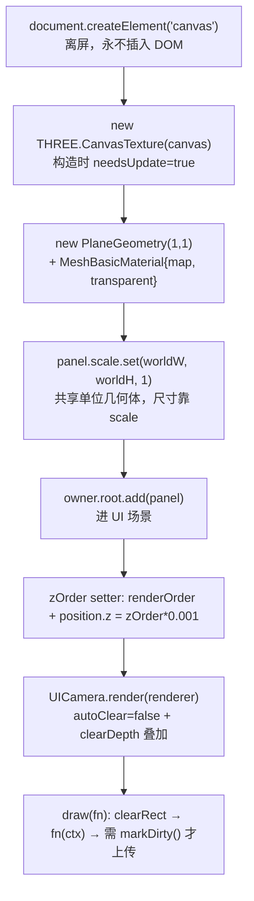
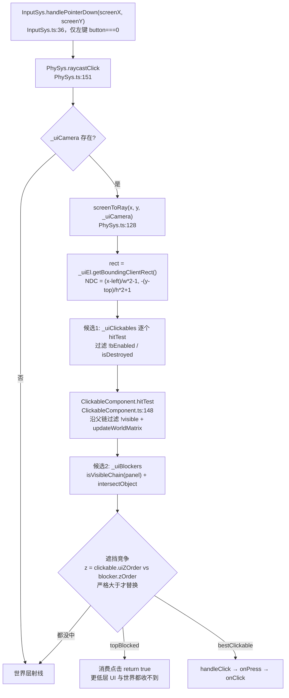

# CanvasUIComponent：把 UI 贴进 3D 世界

> **一句话定位**：`CanvasUIComponent` 是 UI 的**渲染根组件** —— 把 `<canvas>` 2D 自绘内容做成 `CanvasTexture`，贴到一张 `PlaneGeometry` 上变成 3D 场景里的 mesh，同时充当该 UI 节点的**显隐控制中心**与**点击命中模式开关**（仿 UE `EVisibility`）。
>
> **什么时候会用到你**：新增/排查 UI 控件（图片、文本、按钮背景）、UI 面板点不中或点穿到 3D、面板层级互相遮挡、改了颜色/图片但画面没变、想知道「点一下屏幕怎么就命中了某个按钮」。
>
> 代码位置：`src/engine/rendering/CanvasUIComponent.ts`

---

## 1. 先记住这几个文件

| 文件 | 一句话职责 | 你要改它的场景 |
|---|---|---|
| [CanvasUIComponent.ts](../../src/engine/rendering/CanvasUIComponent.ts) | 离屏 canvas → `CanvasTexture` → plane mesh；`active` 显隐、`zOrder` 分层、`hitTest` 命中模式 | 加画布字段、改重绘时机、改命中/拦截语义 |
| [PhySys.ts](../../src/engine/physics/PhySys.ts) | 点击总入口：`raycastClick` 做 UI 层遮挡竞争（clickable vs block 画布按 `zOrder` 竞争） | 点不中、点穿、遮罩拦不住 |
| [ClickableComponent.ts](../../src/engine/physics/ClickableComponent.ts) | 射线命中测试执行者：`hitTest` 沿父链过滤隐藏目标，`uiZOrder` 提供竞争用的层级 | 命中区域不对、隐藏的 UI 仍被点中 |
| [UICamera.ts](../../src/engine/rendering/UICamera.ts) | UI 独立正交相机（contain 模式）+ 叠加渲染；点击用的是这台相机 | UI 被裁切、非 16:9 视口留白、点击整体失效 |

**关键心智模型**：UI **不是网页**。那张 `<canvas>` 从头到尾没有插进 DOM，它只是一块离屏像素缓冲区，内容是"烤"进纹理再贴到一个 3D 平面上的。所以 UI 既没有 DOM 事件，也没有 CSS 命中测试 —— 一切交互都必须靠**射线几何求交**完成。

---

## 2. 世界空间 UI 怎么渲染出来

### 2.1 谁创建了它

三条入口，最终都汇到构造函数：

1. **蓝图/资产声明**：`ComponentRegistry` 注册项（[registerBuiltinComponents.ts:322](../../src/engine/tools/registerBuiltinComponents.ts)）把 JSON 里的 `CanvasUIComponent` 字段映射成构造参数；widget 编译器还会为每个 UI 节点自动打一个 `markerOnly` 的 `UIMarker` 占位（[compile.ts:710](../../src/editor/asset/uiCompiler/compile.ts)）。
2. **子类继承**：`UIImageComponent`（[UIImageComponent.ts:36](../../src/engine/ui/UIImageComponent.ts)）、`UITextComponent`（[UITextComponent.ts:89](../../src/engine/ui/UITextComponent.ts)）都是 `extends CanvasUIComponent`，走 `super(owner, ...)`。
3. **运行时代码**：按钮无背景时自动补透明点击层（[UIButtonComponent.ts:190](../../src/engine/ui/UIButtonComponent.ts)）、滚动容器补命中层（[UIScrollContainerComponent.ts:231](../../src/engine/ui/UIScrollContainerComponent.ts)）。

### 2.2 渲染链路



**① 离屏 canvas 与纹理**

```ts
// 1. 离屏 Canvas
this.canvas = document.createElement('canvas')
this.canvas.width = this._width
this.canvas.height = this._height
this.ctx = this.canvas.getContext('2d')!

// 2. Canvas → Texture
this.texture = new THREE.CanvasTexture(this.canvas)
this.texture.minFilter = THREE.LinearFilter
this.texture.magFilter = THREE.LinearFilter
```

> `canvas` 从头到尾没有 `appendChild` 到任何 DOM 节点上（全文件唯一的 `add` 是 `owner.root.add(this.panel)`）。**这就是"UI 交互不能走 DOM 事件"的根因** —— 页面上根本不存在对应的元素，`click` / `pointerdown` 无从谈起，命中只能靠射线打 `panel` 这个 mesh。
>
> 过滤器显式设成 `LinearFilter` 而不是默认的 mipmap 链：UI 纹理是逐像素对屏幕的位图，走 mipmap 会让缩小显示时文字发虚，且 canvas 尺寸非 2 的幂时 mipmap 会额外开销。

**② 几何体用共享单位平面，尺寸交给 scale**

```ts
const geo = new THREE.PlaneGeometry(1, 1)
const mat = new THREE.MeshBasicMaterial({
  map: this.texture,
  transparent: true,
  side: (options.doubleSided ?? true) ? THREE.DoubleSide : THREE.FrontSide,
})
this.panel = new THREE.Mesh(geo, mat)
this.panel.scale.set(ww, wh, 1)
this.panel.visible = this._bActive // 激活属性：false = 不渲染
owner.root.add(this.panel)
```

> 几何体固定 1×1，改变世界尺寸只改 `scale` —— 见 `setWorldSize`（:252）里 `this.panel?.scale.set(w, h, 1)`，不重建 geometry。**反直觉点**：所以"尺寸"在这套体系里不是几何属性而是变换属性，改尺寸不产生 GPU 缓冲重建，也不需要重画 canvas（位图分辨率 `width/height` 与世界尺寸 `worldWidth/worldHeight` 是两套独立量纲）。
>
> `transparent: true` 是硬要求，UI 纹理普遍带 alpha 通道（圆角、透明背景）。

**③ 世界尺寸由 uitransform 做权威**

```ts
//  - tsf 已显式设置且组件未传 → 用 tsf 值（JSON 迁移后标准）
//  - 组件显式传入（uitext 推导 / 旧数据兼容）→ 组件值并同步回 tsf
let ww = options.worldWidth ?? 5
let wh = options.worldHeight ?? 2.5
const uiTf = owner.getComponent(UITransformComponent)
if (uiTf) {
  if (uiTf.worldSizeExplicit && options.worldWidth === undefined && options.worldHeight === undefined) {
    ;[ww, wh] = uiTf.getWorldSize()
  } else if (options.worldWidth !== undefined || options.worldHeight !== undefined) {
    uiTf.setWorldSize(ww, wh)
  }
}
```

> 尺寸权威在 `UITransformComponent`（Unity RectTransform 风格），组件自身只是缓存。**为什么判据带 `worldSizeExplicit`**：布局系统写回尺寸时那个 `explicit=false` 的分支不代表作者意图，若直接读会污染"用户到底想不想自己定尺寸"这个信息。注册项也配合做了"只传显式值"（[registerBuiltinComponents.ts:319](../../src/engine/tools/registerBuiltinComponents.ts) 注释），否则默认值 5×2.5 会反过来覆盖资产里配好的尺寸。

**④ 重绘与脏标记（最容易踩的一段）**

```ts
/** 自定义绘制回调。每次调用清空 canvas 并执行 fn，然后标记纹理更新 */
draw(fn: (ctx: CanvasRenderingContext2D, w: number, h: number) => void) {
  this.ctx.clearRect(0, 0, this._width, this._height)
  fn(this.ctx, this._width, this._height)
}

/** 只标记纹理更新（外部已通过 this.ctx 直接绘制） */
markDirty() {
  this.texture.needsUpdate = true
}
```

> **这段是最反直觉的地方，务必看仔细。**
>
> 方法上方的文档注释写的是"然后标记纹理更新"，但**函数体里并没有标记** —— 只有 `clearRect` 和 `fn(...)` 两行。真正标记的是 `markDirty()` 里的 `this.texture.needsUpdate = true`。
>
> 而 three.js 的上传条件是 `source.version !== sourceProperties.__version`（[WebGLTextures.js](https://github.com/mrdoob/three.js/blob/dev/src/renderers/webgl/WebGLTextures.js)），`needsUpdate` 的 setter 才是把 `version++` 的地方（[Texture.js](https://github.com/mrdoob/three.js/blob/dev/src/textures/Texture.js)）。`CanvasTexture` 构造时置了一次 `needsUpdate = true`（version 0→1，[CanvasTexture.js](https://github.com/mrdoob/three.js/blob/dev/src/textures/CanvasTexture.js)），首帧上传后版本号与 GPU 侧记录相等，**此后不 bump version 就永远不再重传**。
>
> 结论：**`draw()` 只改 CPU 侧像素，不通知 GPU**。首次绘制赶在首帧上传之前所以看得见；之后若只有 `draw()` 而没有 `markDirty()`，画面不会更新。子类 `UIImageComponent.redraw()`（[UIImageComponent.ts:144](../../src/engine/ui/UIImageComponent.ts)）走的就是 `draw(...)`。
>
> **规则**：任何时候改完画布内容（含绕过 `draw()` 直接用 `this.ctx` 画），都必须跟一次 `markDirty()`。目前 `src/` 下 `markDirty()` 只有定义、没有调用方，新增重绘路径时别默认"已经有人标记了"。
>
> 顺带说性能：这里**没有任何节流或脏标记合并**，也没挂每帧重绘 —— 重绘是完全按需的（改颜色、改圆角、图片 `onload`）。代价是前述的漏标记问题，收益是静止 UI 零重绘开销。不要在这里加"每帧 markDirty"来绕开漏标记，那会让每个 UI 面板每帧重传一张位图到 GPU。

**⑤ 不透明度：transparent 必须恒为 true**

```ts
setOpacity(opacity: number) {
  if (!this.panel) return
  ;(this.panel.material as THREE.MeshBasicMaterial).opacity = opacity
  // 纹理常含 alpha（圆角矩形/透明背景 UI），材质必须保持透明混合：
  // 若按 opacity<1 才开 transparent，opacity=1 时 alpha 被忽略，
  // 圆角外的透明像素（RGB 黑 + alpha 0）会渲染成黑色方块（按钮 4 角"不透明"）。
  ;(this.panel.material as THREE.MeshBasicMaterial).transparent = true
}
```

> 第二行看着冗余（构造时已经是 `true`），但它是**防御性重设**：如果别处为了"优化"把 `transparent` 按 `opacity < 1` 动态开关，透明度回到 1 的那一帧圆角外会突然变黑方块。这是真踩过的坑，注释里保留了现象描述。

**⑥ 显隐控制中心：`active` 级联整棵子树**

```ts
protected applyActive(): void {
  if (this.panel) this.panel.visible = this._bActive
  for (const obj of this._registeredObjects) obj.visible = this._bActive
  // 节点级显隐开关：canvas active 统一控制自身 + 子对象所有渲染组件（Actor.applyActiveTree 递归）
  this.owner.bActive = this._bActive
}
```

> canvas 组件是本 UI 节点的显隐**唯一入口**。子类（UIText 的 troika mesh 等）通过 `registerRenderObject`（:194）把自己的渲染对象登记进来，由这里统一开关；再往下由 `owner.bActive` 借 `Actor.applyActiveTree` 递归到整棵子树。**规则**：子类不要自己持有 `bActive`，也不要直接改单个 mesh 的 `visible` —— 那样绕过了级联，且命中过滤仍会按父链判定导致行为不一致。
>
> `BeginPlay`（:234）里还有一句 `if (!this._bActive) this.owner.bActive = false`：构造时子节点尚未挂载，级联无法生效，所以要在 `BeginPlay` 兜底下推一次；激活态是默认值，不需要主动推。

---

## 3. 点击怎么命中到 UI 上

**先纠正一个常见误解：命中测试的输入不是 UV。** 全仓库 `src/` 下没有任何 `hit.uv` 的用法。真实链路是**屏幕坐标 → NDC → 射线 → 世界坐标交点**，需要落回控件局部坐标时再用 `worldToLocal`。



**① 屏幕坐标怎么变成射线（NDC 换算）**

```ts
const rect = this._uiEl.getBoundingClientRect()
if (rect.width === 0 || rect.height === 0) return null

// 相机可能不参与渲染（如 CameraComponent 内部相机由 syncCamera 驱动），
// matrixWorld 未更新会导致 setFromCamera 用陈旧矩阵算出错误射线（方向错/原点 0,0,0）。
// 每次射线前强制刷新，保证位置/朝向最新。
cam.updateMatrixWorld()

this._ndc.set(
  ((screenX - rect.left) / rect.width) * 2 - 1,
  -((screenY - rect.top) / rect.height) * 2 + 1,
)
this.raycaster.setFromCamera(this._ndc, cam)
```

> 三个要点：**（a）** 减 `rect.left/top` 而不是用裸 `clientX/Y` —— 视口不一定顶在页面左上角，编辑器里视口是嵌在布局中的，不减偏移会让点击整体偏移。**（b）** Y 轴取负 —— DOM 的 y 向下，NDC 的 y 向上，漏了负号点击会上下镜像。**（c）** 宽度/高度为 0 直接返回 null（面板隐藏或尚未布局时，射线没有意义）。
>
> `updateMatrixWorld()` 那一行是**性能与正确性的取舍**：每次点击/每次 hover 都强制刷新父链矩阵。这就是 `InputSys.handlePointerMove` 要用 `PhySys.isDragging` 跳过拖拽期间 hover 的原因 —— 拖拽时每帧跑全套射线是卡顿主因。

**② layer 掩码怎么过滤**

过滤不是位掩码，而是**注册时分流到不同的 Set**（[PhySys.ts:48](../../src/engine/physics/PhySys.ts)）：

```ts
register(c: ClickableComponent): void {
  if (c.layer === 'ui') this._uiClickables.add(c)
  else this._clickables.add(c)
}
```

> `ClickableComponent.layer`（[ClickableComponent.ts:26](../../src/engine/physics/ClickableComponent.ts)）默认 `'world'`，由 `UIButtonComponent` 等置成 `'ui'`。**含义**：UI 层的 clickable 用 UI 正交相机打平行射线，世界层的用主相机打透视射线，两批目标**永不互相遮挡**，只有 UI 层整体优先于世界层。所以"UI 永远在顶层"不是靠 z 值压过去，而是靠检测顺序。

**③ 命中测试本身要补两件 Raycaster 不做的事**

```ts
// 过滤不可见目标：自身或任一父节点 visible=false 均视为隐藏（父隐藏则子也看不到）
for (const t of targets) {
  let o: THREE.Object3D | null = t
  let visible = true
  while (o) {
    if (!o.visible) { visible = false; break }
    o = o.parent
  }
  if (visible) {
    t.updateWorldMatrix(true, false)
    visibleTargets.push(t)
  }
}
```

> `THREE.Raycaster` **不检查 `visible`** —— 隐藏的 mesh 照样会被命中。若不沿父链过滤，父节点 `bActive=false` 隐藏的按钮仍会响应点击（与 Unity 行为不符）。`updateWorldMatrix(true, false)` 则是补渲染循环之外矩阵可能陈旧的情形（刚生成、渲染已停止），否则射线打空。

**④ 遮挡竞争：zOrder 严格大于才替换**

```ts
// 候选 2：拦截画布（hitTestMode='block'，如 GM 控制台全屏遮罩）
for (const b of this._uiBlockers) {
  if (!b.panel || !isVisibleChain(b.panel)) continue
  if (uiRay.intersectObject(b.panel, false).length > 0) {
    const z = b.zOrder
    // 同 zOrder 时 clickable 优先（同层按钮先于遮罩）
    if (z > bestZ) {
      bestZ = z
      bestClickable = null
      topBlocked = true
    }
  }
}
```

> 比较是**严格大于**，不是大于等于 —— 这是刻意的：同层时按钮赢过遮罩，否则模态遮罩会把自己上面的按钮吃掉。`clickable.uiZOrder`（[ClickableComponent.ts:273](../../src/engine/physics/ClickableComponent.ts)）取的是 **owner 及祖先链上 `CanvasUIComponent` 的最大 zOrder**，所以父节点层级高，整棵子树在竞争中都占优。
>
> `intersectObject(b.panel, false)` 的 `false` 是**不递归子对象**：拦截只认这块画布自己的矩形。

**⑤ 命中之后怎么拿到控件内的局部坐标**（以输入框光标定位为例）

```ts
// UITextInputComponent.setCursorFromClick(clickWorldX, ...)  UITextInputComponent.ts:204
const worldPt = new THREE.Vector3(clickWorldX, 0, 0)
const rootLocal = this.owner.root.worldToLocal(worldPt)
const localX = rootLocal.x - troika.position.x
```

> 上游是 `ClickableComponent.onMouseDown = (hit) => ...`，`hit.point.x` 就是**世界坐标**（[GMConsoleHUD.ts:404](../../src/engine/gm/GMConsoleHUD.ts) 用法）。要落到控件内部，标准做法是 `owner.root.worldToLocal(...)` 换算，**没有 UV 可用** —— 因为 `PlaneGeometry` 的 UV 只描述贴图采样，与控件树的世界变换无关。

**⑥ `hitTest` 三态与 block 的注册/注销**

```ts
set hitTestMode(v: UIHitTestMode) {
  if (this._hitTest === v) return
  const wasBlock = this._hitTest === 'block'
  this._hitTest = v
  if (v === 'block' && !wasBlock) PhySys.registerUIBlocker(this)
  else if (wasBlock && v !== 'block') PhySys.unregisterUIBlocker(this)
  logger.info(`[CanvasUIComponent] "${this.name}" 命中测试模式 → ${v}`)
}
```

| 值 | 渲染 | 命中行为 | 典型用途 |
|---|---|---|---|
| `'visible'`（默认） | 是 | 画布本身不拦，靠挂在上面的 `ClickableComponent` 命中；空白处射线穿到更低层 | 普通面板 |
| `'block'` | 是 | 画布矩形命中即消费点击，挡住更低 zOrder 的 UI 与世界层 | 模态遮罩、GM 控制台 |
| `'hitTestInvisible'` | 是 | 完全穿透，不参与任何命中/拦截 | 纯装饰画布 |

> **`visible` 与 `block` 的关键区别**：`visible` 是"可命中"，但命中的主体是 `ClickableComponent` 的射线目标（按钮的透明点击层），不是画布 mesh 自己；`block` 是让**画布 mesh 本身**成为拦截体。所以一个 `visible` 面板的空白处点击会穿过去落到世界层 —— 这是设计如此，不是漏了拦截。
>
> 构造函数里是 `this._hitTest = options.hitTest ?? 'visible'`（:109）**直赋字段、不过 setter**，因此构造时传 `block` **不会**注册进 PhySys；注册由 `BeginPlay`（:236）兜底完成（注释写明"构造时可能组件未全挂载"）。注销在 `EndPlay`（:350）。运行时改 `hitTestMode` 走 setter，即时生效。

---

## 4. 关键方法速查

| 方法 | 位置 | 干什么 | 注意 |
|---|---|---|---|
| `constructor(owner, options)` | [CanvasUIComponent.ts:102](../../src/engine/rendering/CanvasUIComponent.ts) | 建 canvas + 纹理 + plane mesh，读 uitransform 定世界尺寸 | `hitTest` 走字段直赋不过 setter；`markerOnly` 时 `panel=null` |
| `draw(fn)` | [CanvasUIComponent.ts:338](../../src/engine/rendering/CanvasUIComponent.ts) | `clearRect` 后执行回调 | **不标记纹理更新**，需自行 `markDirty()` |
| `markDirty()` | [CanvasUIComponent.ts:345](../../src/engine/rendering/CanvasUIComponent.ts) | `texture.needsUpdate = true` → bump version 触发 GPU 重传 | 当前 `src/` 下无调用方 |
| `setWorldSize(w, h)` | [CanvasUIComponent.ts:252](../../src/engine/rendering/CanvasUIComponent.ts) | 改 `panel.scale` 并同步回 uitransform | 不重建 geometry，也不重画位图 |
| `getWorldSize()` | [CanvasUIComponent.ts:266](../../src/engine/rendering/CanvasUIComponent.ts) | 优先读 owner 的 uitransform | 与 `getSize()`（像素，:247）不是一回事 |
| `onWorldSizeChange()` | [CanvasUIComponent.ts:263](../../src/engine/rendering/CanvasUIComponent.ts) | 尺寸变化钩子，由 uitransform 遍历调用 | 空实现，子类覆写（如 UIText 重算换行宽度） |
| `setOpacity(v)` / `opacity` | [CanvasUIComponent.ts:316](../../src/engine/rendering/CanvasUIComponent.ts) / [:329](../../src/engine/rendering/CanvasUIComponent.ts) | 设 material.opacity，并强制 `transparent = true` | 别把 `transparent` 改成按 opacity 动态开关 |
| `bActive` / `applyActive()` | [CanvasUIComponent.ts:174](../../src/engine/rendering/CanvasUIComponent.ts) / [:182](../../src/engine/rendering/CanvasUIComponent.ts) | 节点级显隐，级联 panel + 注册对象 + 整棵子树 | 子类不要自己持有 `bActive` |
| `registerRenderObject(obj)` | [CanvasUIComponent.ts:194](../../src/engine/rendering/CanvasUIComponent.ts) | 子组件登记渲染对象（troika mesh 等）交给 canvas 统一显隐 | 销毁时配对 `unregisterRenderObject`（:207） |
| `zOrder` | [CanvasUIComponent.ts:214](../../src/engine/rendering/CanvasUIComponent.ts) | `renderOrder = v` + `position.z = v * 0.001` | 每 +1 前移 0.001 世界单位；正交相机无透视变形 |
| `hitTestMode` | [CanvasUIComponent.ts:224](../../src/engine/rendering/CanvasUIComponent.ts) | 切命中模式，进出 `block` 时注册/注销 PhySys blocker | 构造期传值不触发注册，靠 BeginPlay |
| `isClickOnly` | [CanvasUIComponent.ts:164](../../src/engine/rendering/CanvasUIComponent.ts) | 标记"透明点击层"（仅命中不渲染） | `TweenSystem.fade` 与三个 PreviewManager 都会跳过它 |
| `isMarkerOnly` | [CanvasUIComponent.ts:161](../../src/engine/rendering/CanvasUIComponent.ts) | 仅标记模式（无 mesh，只声明"本 Actor 是 UI"） | 锚点容器查找会跳过它 |
| `BeginPlay()` | [CanvasUIComponent.ts:234](../../src/engine/rendering/CanvasUIComponent.ts) | `block` 模式兜底注册 + 下推初始 `active` | 日志被刻意注释（高频噪音） |
| `EndPlay()` | [CanvasUIComponent.ts:350](../../src/engine/rendering/CanvasUIComponent.ts) | 注销 blocker、移除 panel、dispose 纹理/几何/材质 | `markerOnly` 提前 return（无渲染资源） |
| `getEditableProperties()` | [CanvasUIComponent.ts:289](../../src/engine/rendering/CanvasUIComponent.ts) | Inspector 暴露 `active` / `zOrder` / `hitTest` | `zOrder` 的 `min:0, max:10000` |
| `screenToRay(x, y, cam?)` | [PhySys.ts:128](../../src/engine/physics/PhySys.ts) | 屏幕 → NDC → Raycaster（复用实例） | 减 `rect.left/top`；Y 取负；宽高为 0 返回 null |
| `raycastClick(x, y)` | [PhySys.ts:151](../../src/engine/physics/PhySys.ts) | UI 层遮挡竞争 → 世界层；返回是否消费 | 无 UI 相机则 UI 层整体跳过 |
| `raycastHover(x, y)` | [PhySys.ts:231](../../src/engine/physics/PhySys.ts) | hover 分发（不走竞争，逐个 `handleHover`） | 拖拽期间由 InputSys 跳过 |
| `registerUIBlocker(ui)` | [PhySys.ts:61](../../src/engine/physics/PhySys.ts) | 登记 `block` 画布参与拦截 | 幂等（Set） |
| `setupUI(camera)` | [PhySys.ts:94](../../src/engine/physics/PhySys.ts) | 注入 UI 相机 | [Game.ts:208](../../src/engine/gameflow/Game.ts) 注入、[:282](../../src/engine/gameflow/Game.ts) 传 null |
| `isVisibleChain(o)` | [PhySys.ts:251](../../src/engine/physics/PhySys.ts) | 沿父链判可见（任一祖先 `visible=false` 即隐藏） | 模块级函数，非导出 |
| `hitTest(raycaster)` | [ClickableComponent.ts:148](../../src/engine/physics/ClickableComponent.ts) | 过滤隐藏目标 + 刷矩阵 + 求交 | Raycaster 自身不检查 visible |
| `uiZOrder` | [ClickableComponent.ts:273](../../src/engine/physics/ClickableComponent.ts) | owner 及祖先链上 CanvasUIComponent 的最大 zOrder | `layer !== 'ui'` 时返回 0 |
| `setCanvasSize(w, h)` | [UICamera.ts:54](../../src/engine/rendering/UICamera.ts) | contain 模式同步正交视锥 | 基准画布 9.6×5.4（:19-20） |

---

## 5. 流程影响：牵动哪些功能

### 上游：谁驱动它

| 上游 | 怎么驱动 | 相关文档 |
|---|---|---|
| `UIManager.reassignTreeOrder` | 按大纲树序遍历给每个 `CanvasUIComponent` 写 `zOrder` —— **层级真相是树序，不是资产里手写的数字** | [世界 UI 系统](./ui_system.md) |
| `HUD.layerBaseZ` | 特殊层 HUD（GM 控制台覆写 `GM_ZORDER_BASE = 1000`）整树抬升，经 `reassignTreeOrder` 生效 | [UI 系统](./ui_system.md) |
| `ComponentRegistry` 注册项 | 蓝图 JSON → 构造参数，含 `hitTest` / `markerOnly` / `active` 透传 | [资产与工具系统](./asset_tools_system.md) |
| widget 编译器 | 每个 UI 节点自动生成 `markerOnly` 的 `UIMarker`；`hit-test` CSS 映射到 `markerProps.hitTest` | [UI 源格式系统](../editor/ui/ui_source_format_system.md) |
| `UITransformComponent.setWorldSize` | 尺寸权威，改动时遍历回调 `onWorldSizeChange` | [UI 锚点系统](../editor/ui/ui_anchor_system.md) |
| `InputSys.handlePointerDown/Move` | 左键点击与 hover 汇入 `PhySys.raycastClick/Hover` | [物理系统](./physics_system.md) |
| `Game.ts` 启动/停止 | `PhySys.setupUI(uiCamera)` / `setupUI(null)`；`attachUIScene` 挂 UI 场景 | [渲染系统](./rendering_system.md) |

### 下游：它波及谁

| 下游功能 | 波及点 | 相关文档 |
|---|---|---|
| 点击分发与遮挡竞争 | `block` 画布经 `registerUIBlocker` 进入 `raycastClick`，命中即消费，Controller 收不到该次点击 | [物理系统](./physics_system.md) |
| 按钮命中区域 | `UIButtonComponent.createHitLayer` 生成 `isClickOnly` 的透明画布并 `setTargets([img.panel])` 锁定射线 | [世界 UI 系统](./ui_system.md) |
| 补间淡入淡出 | `TweenSystem` 遍历时跳过 `isMarkerOnly` 与 `isClickOnly`（fade 不该让点击层变可见） | [UI 增强系统](../editor/ui/ui_enhancement_system.md) |
| 遮罩裁剪 | `UIMaskComponent` 通过 `renderObjects` 只读视图收集子组件渲染对象 | [UI 增强系统](../editor/ui/ui_enhancement_system.md) |
| 编辑器 UI/蓝图/场景预览 | 三个 PreviewManager 按 `isClickOnly` 过滤掉运行时生成的内部组件，避免写回资产 | [资产预览与检查](../editor/asset/asset_preview_lint_system.md) |
| 资产检查 | `assetLint` 的 `comp:CanvasUIComponent` schema 含 `properties.hitTest` 枚举（[componentChecker.ts:392](../../src/editor/asset/assetLint/checkers/componentChecker.ts)） | [资产预览与检查](../editor/asset/asset_preview_lint_system.md) |
| AI 事件 / GM 控制台 | `GMConsoleHUD` 根画布用 `hitTest:'block'` + `zOrder: GM_ZORDER_BASE` 保证最顶且拦截点击（[GMConsoleHUD.ts:109](../../src/engine/gm/GMConsoleHUD.ts)）；AI 通道读取 `canvas.zOrder` | [GM 命令系统](./gm_system.md) |
| 特效挂载 | `LootFlyFx` 等需挂到"第一个非 markerOnly 画布宿主"而非 HUD 本身 | [UI 增强系统](../editor/ui/ui_enhancement_system.md) |

---

## 6. 踩坑清单（都是真踩过的）

**1. 改了颜色/圆角/图片，画面却没变** —— `draw()` 只做 `clearRect` + 回调，**不设置 `texture.needsUpdate`**（注释说的"然后标记纹理更新"与函数体不符）。three.js 只在 `source.version` 变化时重传，而 bump version 的是 `markDirty()`。**规则**：任何改完画布内容的路径后都必须 `markDirty()`；不要靠"每帧 markDirty"绕过，那会让每个面板每帧重传位图。

**2. 圆角按钮四角发黑** —— 有人把 `transparent` 改成按 `opacity < 1` 动态开关。`opacity` 回到 1 时透明混合关闭，纹理里圆角外的像素（RGB 黑 + alpha 0）被当成不透明黑渲染。**规则**：`setOpacity` 里的 `transparent = true` 是防御性重设，删不得。

**3. 隐藏的 UI 按钮仍然响应点击** —— `THREE.Raycaster` 不检查 `visible`，父节点隐藏时子 mesh 照样命中。**规则**：隐藏一律走 `bActive = false`（经 `applyActive` 级联），命中侧靠 `hitTest` 沿父链过滤与 `isVisibleChain` 兜底，不要只改单个 mesh 的 `visible`。

**4. 刚生成就隐藏的面板，子树仍然可见** —— 构造时子节点未挂载，`applyActive` 的级联到不了子树。**规则**：依赖 `BeginPlay` 里那句 `if (!this._bActive) this.owner.bActive = false` 兜底下推；激活态是默认值无需处理。

**5. 模态遮罩拦不住上面的按钮** —— 遮挡竞争用**严格大于**比较，同 `zOrder` 时 clickable 优先。**规则**：遮罩要压住按钮，`zOrder` 必须严格更高；GM 控制台靠 `GM_ZORDER_BASE = 1000` 整树抬升来保证。

**6. 点 UI 空白处直接穿到 3D 世界** —— `hitTest: 'visible'` 的画布自身不是拦截体，命中靠挂在上面的 `ClickableComponent`。没有 clickable 的裸画布（以及 `hitTestInvisible`）点击必然穿透。**规则**：要拦截就显式设 `'block'`，别指望 `'visible'` 兜底。

**7. 点击位置整体偏移 / 上下颠倒** —— `screenToRay` 里必须减 `rect.left/top`（视口不在页面原点），且 NDC 的 Y 要取负（DOM 向下、NDC 向上）。**规则**：排查点击偏移先确认视口 `getBoundingClientRect` 与这两个符号。

**8. 组件已销毁却仍被点击命中** —— 残留注册表里的组件闭包指向已销毁的 World。**规则**：`handleClick`/`handleHover` 开头用 `isDestroyed()` 拒绝；根因是销毁路径没走干净，`PhySys.clear()` 会清空三个 Set 兜底。

**9. 拖拽滚动列表时明显卡顿** —— 每个 UI clickable 的 `hitTest` 都沿父链强制 `updateWorldMatrix(true, false)`。**规则**：`InputSys.handlePointerMove` 已用 `PhySys.isDragging` 跳过拖拽期间的 hover，不要再往拖拽路径加全量射线。

**10. 在 `hitTest` 里找 UV 坐标死活找不到** —— 这套体系**不使用 UV**，命中的是 `Intersection.point`（世界坐标），需要局部坐标就用 `owner.root.worldToLocal()`。**规则**：控件内定位一律走世界点 → 局部点换算。

**11. 尺寸改了但布局没跟着动** —— 世界尺寸权威在 `UITransformComponent`，且写入要区分 `worldSizeExplicit`。**规则**：改尺寸走 `UITransformComponent.setWorldSize`（它会回调 `onWorldSizeChange`），不要直接改 `panel.scale`。

**12. WebGL 上下文丢失后 UI 全白** —— GPU 侧纹理数据全部失效，而 `needsUpdate` 不会自动重传。**规则**：依赖 `SceneRendererComponent.restoreAllTextures()`（[SceneRendererComponent.ts:198](../../src/engine/gameflow/SceneRendererComponent.ts)）在 `webglcontextlost` 时遍历重置所有纹理。

---

## 7. 边界条件

| 条件 | 行为 | 怎么应对 |
|---|---|---|
| `markerOnly: true` | `panel = null`，不建 mesh、不进场景、不参与拦截；仅声明"本 Actor 是 UI" | 矢量文本（troika）与纯容器用；锚点容器查找会跳过它 |
| `isClickOnly: true` | 有 mesh 但 `opacity` 恒 0，仅作命中体；`TweenSystem.fade` 与三个 PreviewManager 跳过 | 按钮无背景时自动生成，命名 `HitLayer` 避免重名警告 |
| `hitTest: 'block'` 但画布或其祖先 `visible=false` | 不拦截（`isVisibleChain` 返回 false，射线穿过） | 引擎内置；隐藏即失效，符合预期 |
| 同 zOrder 的 clickable 与 block 画布同时命中 | clickable 优先（严格大于比较） | 遮罩需更高 zOrder |
| 构造时传 `hitTest: 'block'` | 字段直赋不过 setter，**构造期不注册**；由 `BeginPlay` 兜底 | 构造后到 BeginPlay 之间有短暂窗口不拦截 |
| 非 UI 相机（`PhySys._uiCamera` 为 null） | UI 层检测整体跳过（含 block 拦截），点击直落世界层 | 由 `Game.ts` 在启动/停止时注入与置空 |
| 视口宽或高为 0 | `screenToRay` 返回 null，本次点击/悬停作废 | 面板隐藏或未布局时的正常行为 |
| `zOrder` 超出 [0, 10000] | Inspector 约束 min 0、max 10000；代码可写负值（低于世界层基准） | 拦截用途不要用负值 |
| 组件销毁时仍为 `block` | `EndPlay` 自动 `unregisterUIBlocker` | 引擎内置，无需手动 |
| `draw()` 后未 `markDirty()` / 每帧 `markDirty()` | 前者 GPU 纹理不更新；后者每帧重传整张位图 | 见踩坑 1，重绘必须按需且必须配对标记 |
| 非 16:9 视口 | UI 画布 contain 居中、两侧留空不裁切 | 见 `UICamera.setCanvasSize`（基准 9.6×5.4） |
| WebGL 上下文丢失 | GPU 纹理失效，UI 全白 | `restoreAllTextures()` 在 `webglcontextlost` 时重置 |
