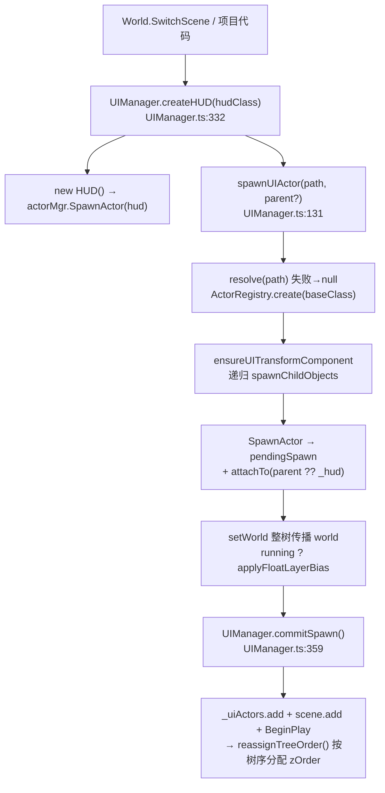
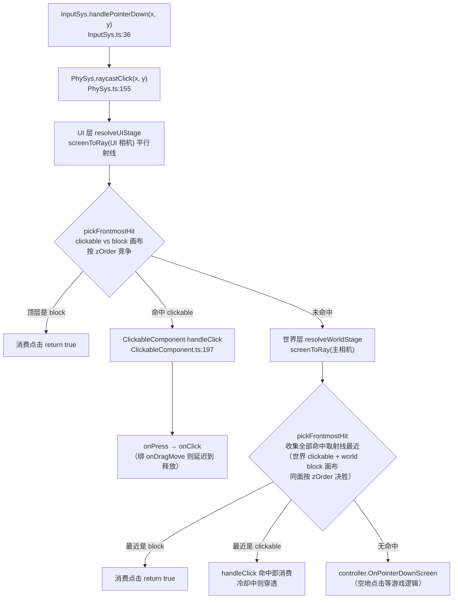

# 世界 UI 系统（Engine UI）

> **一句话定位**：`UIManager` 是 UI 的**唯一生成入口与生命周期主人** —— 它把 widget 蓝图实例化成一棵 Actor 树，挂进独立的 `uiScene`（与 3D 场景分离、叠加渲染永远在顶层），并每帧驱动这棵树的 Tick。
>
> **什么时候会用到你**：新增 widget 资产后想知道它怎么变成屏幕画面；UI 点了没反应 / 点穿到 3D；面板层级互相遮挡；Toast/补间不推进；脚本挂不到 UI 节点上。
>
> 代码位置：`src/engine/ui/`

---

## 1. 先记住这几个文件

| 文件 | 一句话职责 | 你要改它的场景 |
|---|---|---|
| [UIManager.ts](../../src/engine/ui/UIManager.ts) | 生成入口（蓝图 → Actor 树）+ 独立场景 `uiScene` + 每帧 `tickUI` + 渲染层级树序分配 | 加一种 UI 生成方式、改层级规则、排查"UI 没出现/没 Tick" |
| [UITransformComponent.ts](../../src/engine/ui/UITransformComponent.ts) | 尺寸 + 九宫格锚点定位（Unity RectTransform 风格），`applyAnchor` 是布局的核心 | 控件位置不对、锚点不生效、改尺寸不跟随 |
| [UIButtonComponent.ts](../../src/engine/ui/UIButtonComponent.ts) | 按钮状态机 + 自动生成透明点击层并把射线目标锁到它 | 按钮点不中、点击区域不对、hover 无反应 |
| [HUD.ts](../../src/engine/ui/HUD.ts) | 纯容器 Actor，承载 `GameMode.HUDClass` 那棵 UI 树 | 加特殊层级 HUD（如 GM 控制台覆写 `layerBaseZ`） |

**关键心智模型**：UI 和 3D 是**两套并行的 Actor 集合** —— 3D 进 `World.allActors`，UI 进 `UIManager._uiActors`，分流发生在 `ActorManagerComponent.commitSpawn`，判据是 `UIManager.isUIActor(actor)`（自身或子树含 `CanvasUIComponent`，或是 `HUD` 实例）。所以**不要用 `DestroyAllActors` 的思路去清 UI**：它内部会先调 `ui.destroyAll()`，但自己遍历 `allActors` 碰不到 UI。

---

## 2. 一个 UI 是怎么显示出来的：从 widget 资产到屏幕

### 2.1 谁调用了它

入口有两条：**场景切换时建 HUD**（[World.ts](../../src/engine/gameflow/World.ts):445），**运行时动态弹面板**（项目代码直接调 `world.ui.spawnUIActor`）。

HUD 由 `GameMode.HUDClass` 声明，值就是一个 widget 蓝图路径（[FishBaseGameMode.ts](../../src/projects/fish/gameplay/base/FishBaseGameMode.ts):37）：

```ts
override HUDClass = 'asset/blueprints/ui/base_hud.widget.json'
```

`World.SwitchScene` 在销毁旧 Actor、切完 GameMode 之后创建它：

```ts
if (newMode.HUDClass) {
  this.ui.createHUD(newMode.HUDClass)
} else {
  logger.info('[World] SwitchScene: GameMode 未声明 HUDClass，跳过 HUD 创建')
}
```

运行时弹面板就是一行，父 Actor 省略时**默认挂到当前 HUD**：

```ts
const panel = w.ui.spawnUIActor('asset/blueprints/ui/build_menu.widget.json')
```

> `spawnUIActor` 是同步的，只把 Actor 塞进 `pendingSpawn`，真正的 `BeginPlay` 要等下一次 `UIManager.commitSpawn()` —— 刚拿到 `panel` 那一刻组件还没 `BeginPlay`，取 `UIScriptComponent.instance` 之类会是 `null`。

UI 场景还要接进渲染才能看见。[Game.ts](../../src/engine/gameflow/Game.ts):206 在游戏启动时做这件事，同时把 UI 相机交给 PhySys（这是 §3 点击链路的前提）：

```ts
if (world?.ui?.scene) {
  gameMgr.attachUIScene(world.ui.scene)
  PhySys.setupUI(gameMgr.uiCamera)
}
```

> 这两行缺一不可：没有 `attachUIScene` 就没画面，没有 `setupUI` UI 层点击检测会整体跳过（直接漏到世界层）。

### 2.2 构建链路



**① 解析与构造 —— 失败直接返回 null，不抛异常**

```ts
try {
  resolved = BlueprintRegistry.resolve(path)
} catch (e) {
  logger.error(`[UIManager] 蓝图 "${path}" 解析失败: ${(e as Error).message}`)
  return null
}
const actor = ActorRegistry.create(resolved.baseClass)
if (!actor) {
  logger.error(`[UIManager] baseClass "${resolved.baseClass}" 未在 ActorRegistry 注册 (${path})`)
  return null
}
```

> 排查"UI 没出来"的第一站：路径拼错、`baseClass` 拼错都只留一行 error，调用方拿到 `null` 不判空就静默失败。

**② 组件挂载 —— TransformComponent 特意不重建**

```ts
const existingTf = cdef.baseClass === 'TransformComponent' ? actor.getComponent(TransformComponent) : null
if (existingTf) {
  ComponentRegistry.configure(existingTf, cdef.baseClass, cdef.properties)
  continue
}
```

> Actor 构造时已自带一个 `TransformComponent`（UE RootComponent 语义）。蓝图再声明一次不是为了"再加一个"，而是把 properties 应用到已有实例。直接 `create` 会挂出两个同名变换组件（重名警告 + 双重组件）。

**③ 锚点能力补挂 —— 替换分支必须手写 EndPlay**

```ts
actor.removeComponent(existing)
// 替换下来的旧组件必须显式销毁：本函数通常在 spawn 期间（bHasBegunPlay=false）
// 被调用，BObject.removeComponent 不会代为 EndPlay → 旧 TransformComponent 会
// 永久残留在 ObjectRegistry（SwitchScene 残留诊断 TransformComponent×N）。
if (!actor.bHasBegunPlay) existing.EndPlay()
actor.addComponent(uiTf)
```

> spawn 期间 `bHasBegunPlay=false`，`removeComponent` 认为"还没开始就不用收尾"，不会代为销毁；漏掉这行的症状是切场景后注册表残留一堆 `TransformComponent`。另一个反直觉点是**查询顺序**：`getComponent(TransformComponent)` 会先命中 Actor 自带的普通变换（数组顺序在前），所以 `ensureUITransformComponent`（[UITransformComponent.ts](../../src/engine/ui/UITransformComponent.ts):336）必须先查 `UITransformComponent`，否则造出第二个。

**④ 递归子节点 —— 三种形态**

`spawnChildObjects` 处理 `ref`（引用另一蓝图）、`baseClass`（内联创建）、以及**纯容器**（只有 `children`）：

```ts
// 纯容器节点（仅用来承载嵌套 children）
if (!childActor && child.children?.length) {
  childActor = new GenericActor(child.name ?? `Container_${parentActor.name}`)
}
```

> 容器节点没有任何组件，但依然要 `ensureUITransformComponent` + `attachTo`，否则它下面的子树拿不到布局基准。

**⑤ 挂载 + world 传播 + 浮动层**

`attachTo(parent ?? _hud)` 之后，`setWorld` 递归整树补 `world`（内联子节点不经 `SpawnActor`，字段恒 null），最后按 `owner.running` 决定是否施加 `FLOAT_LAYER_BIAS`（分别详见踩坑 9、2）。

**⑥ 提交与层级分配 —— 渲染顺序 = 大纲树序**

`commitSpawn` 之后调用 `reassignTreeOrder`（[UIManager.ts](../../src/engine/ui/UIManager.ts):409）：

```ts
const walk = (a: Actor, base: number): void => {
  // 特殊层 HUD（GM 控制台等）：子树整体抬升其层基准（子树内相对顺序不变）
  const nodeBase = a instanceof HUD && a.layerBaseZ > 0 ? a.layerBaseZ : base
  for (const comp of a.getComponents(CanvasUIComponent)) {
    comp.zOrder = nodeBase + order
  }
  order += 1
  for (const child of a.getChildren()) walk(child, nodeBase)
}
```

> **层级的真相**：不是资产里手写 `zOrder`，而是**大纲树的深度优先遍历序号** —— 树中靠后的节点盖在上面，所以调层级等于调大纲节点顺序。特殊层靠 `HUD.layerBaseZ` 整树抬升，GM 控制台覆写为 `GM_ZORDER_BASE`（1000）。同节点多个 canvas 组件（UIText/UIImage）**共享同一 zOrder**，靠 `position.z` 微偏移区分（UIText +0.0002），这是文本与背景同层不 z-fighting 的原因。

### 2.3 布局与变换

锚点计算在 [UITransformComponent.ts](../../src/engine/ui/UITransformComponent.ts):141，核心公式只有两行：

```ts
const x = fx * (cw / 2 - sw / 2) + ox
const y = fy * (ch / 2 - sh / 2) + oy
this.owner.setPosition(x, y, this.owner.root.position.z)
```

> `fx/fy` 是九宫格方向因子（`top-left` = `[-1, 1]`），`cw/ch` 容器尺寸，`sw/sh` 自身尺寸，`ox/oy` 是 `anchorOffset`。语义是**元素边缘贴合容器内边（不溢出）**，不是"锚点百分比落在哪里"。`stretch` 走独立分支：尺寸直接等于容器尺寸、位置归零，父容器一变自动跟随。

容器尺寸由 `findContainerSize` 向上查找，**第一条优先级最反直觉**：

```ts
// 1. 父 Actor 显式设置的 uitransform 尺寸 → 容器基准
const tf = p.getComponent(UITransformComponent)
if (tf && tf.worldSizeExplicit) {
  return tf.getWorldSize()
}
// 2. 兜底：真实画布（非仅标记）——markerOnly 组件只作 UI 标识，不作为容器
const comp = p.getComponents(CanvasUIComponent).find((c) => !c.isMarkerOnly)
if (comp) return comp.getWorldSize()
```

> 若跳过 `markerOnly` 容器（如 BottomBar，有明确世界尺寸但只作标识）直接找根画布，子元素锚点会**相对根画布再叠加一次父容器的锚点偏移 → 双重叠加掉出画布**。

三个必须知道的时序/换算事实：

- **锚点在 `BeginPlay` 才应用**，不是构造时 —— 构造期树还没建好、`findContainerSize` 返回 null，源码里的 `logger` 调用被注释掉并标注"构建期必然触发，属预期噪音"。
- **`syncAnchorOffset` 必须和 `setPosition` 成对用** —— 锚点模式下 `position = 锚点基准 + offset`，只改 position 不回写 offset，下次 `applyAnchor` 用旧 offset 重算 → 控件瞬移。
- **字号不随控件尺寸缩放** —— `UITextComponent` 构造时把像素→世界系数固化进 `_pxToWorld`（[UITextComponent.ts](../../src/engine/ui/UITextComponent.ts):120），`onWorldSizeChange` 只重算换行宽度。这是故意的：拖大控件不该把字撑大。

widget 源文件怎么编译成蓝图、锚点九宫格完整取值与编辑器把手行为，分别见 [UI 源格式与编译器](../editor/ui/ui_source_format_system.md) 与 [UI 锚点系统](../editor/ui/ui_anchor_system.md)，本文不重复。

---

## 3. 交互是怎么流进来的

点击不是 UI 自己监听 DOM，而是**引擎输入流 → PhySys 射线 → ClickableComponent 回调**。UI 层在这个链路里**优先于 3D**。



**① 输入入口只认左键，且被消费后不再下发 Controller**

```ts
const consumed = button === 0 ? PhySys.raycastClick(screenX, screenY) : false
controller?.inputComponent.ProcessMouseButton(button, 'pressed')
if (consumed) return true
```

> 右键不参与 UI 点击检测（它归摄像机平移）。左键命中 UI 后直接 `return true`，Controller 的 `OnPointerDownScreen` 不会执行 —— 这就是"点按钮不会同时触发放置建筑"的实现点。

**② 遮挡竞争：UI 层按 zOrder，世界层按射线最近**

`raycastClick` 分两级。**UI 层**（`resolveUIStage`）沿用 zOrder 竞争：遍历所有 UI `ClickableComponent` 做 `hitTest`，再遍历 `hitTestMode === 'block'` 的拦截画布（world 模式画布被排除，归世界层），由 `pickFrontmostHit` 取最高：

```ts
// 同 zOrder 时 clickable 优先（同层按钮先于遮罩）
const cWins = c.z > best.z || (c.z === best.z && c.kind === 'clickable' && best.kind === 'blocked')
```

> 比较是**严格大于**：同层时按钮赢过遮罩，否则模态遮罩会把自己上面的按钮吃掉。`uiZOrder` 取 owner 及祖先链上 `CanvasUIComponent` 的最大 zOrder（[ClickableComponent.ts](../../src/engine/physics/ClickableComponent.ts):289），所以父节点层级高则整棵子树在竞争中都占优。

**世界层**（`resolveWorldStage`）不按注册顺序——收集**全部**命中（世界 clickable + world 模式 block 画布）取**射线最近者**，距离差小于 `SAME_PLANE_EPS`（1e-3，世界模式 z 偏移经 1/pxPerMeter 缩放后约 5e-5）视为同面、按 zOrder 决胜。这是 UE 语义："游戏输入是 UI 未命中时的兜底，命中归属由几何决定，与注册时机无关"。没有这一层仲裁时，后 spawn 的 world 面板按钮会被先注册的建筑 clickZone 抢走点击（历史上信息牌"点升级"变成重新选中建筑的根因）。

**world 模式面板的底板拦截**：widget 里 `hit-test: block` 的带背景节点，编译器会把 `hitTest` 落到该节点的 `UIImageComponent` 视觉块（marker 块无 mesh 拦不住射线），其 panel mesh 注册进 `_uiBlockers`，PhySys 按 `__dsWorldUI` 标记分流到世界层用主相机射线检测——信息牌（building_info）的 `.Card` 即此配方：点卡片空白处被消费，不再穿透到空地把面板关掉。

**③ 按钮的点击层是自动生成的，且射线目标被锁定**

```ts
clickable.layer = 'ui'
clickable.onPress = () => this.press()
clickable.onClick = () => { this.triggerClick() }
clickable.onRelease = () => this.release()
clickable.onHover = (hit) => this.hover(hit !== null)
```

`createHitLayer`（BeginPlay 执行）生成 `opacity: 0` 的 `UIImageComponent`，尺寸按世界尺寸 × 200px/单位，再把射线目标**精确锁定**：

```ts
if (img.panel) clickable.setTargets([img.panel])
```

> **三个反直觉点**：（a）按钮自己不渲染任何视觉，背景靠同 Actor 的 `UIImageComponent` 或子节点提供；（b）`setTargets` 之后点击区域就是按钮矩形，**子节点（Frame/Text）的 mesh 不参与本按钮射线**；（c）没有 `ClickableComponent` 的裸 Image 根本不注册到 PhySys，点击直接穿透。

**④ 防连点、拖拽语义与释放**

```ts
if (now - this._lastClickTime < this.clickCooldown) return false
```

> `clickCooldown` 默认 **500ms**（[ClickableComponent.ts](../../src/engine/physics/ClickableComponent.ts):55），快速连点第二下不响应是设计如此。绑定了 `onDragMove` 的组件（滚动列表）走拖拽语义：`onClick` 延迟到 `handleRelease`，移动超 `DRAG_THRESHOLD_PX`（8px）就取消 —— 拖拽 ≠ 点击。
>
> `raycastRelease` / `dispatchDragMove` 直接作用于 `_pressedClickable`（无需射线），所以拖出按钮甚至拖出窗口再松手，状态依然能恢复。`InputSys.handlePointerMove` 还用 `PhySys.isDragging` 跳过拖拽期间的 hover 检测 —— 每个 UI clickable 的 `hitTest` 都会沿父链强制 `updateWorldMatrix`，拖拽滚动时每帧跑全套射线是卡顿主因。

---

## 4. 全局 UI 服务怎么被驱动

Toast、补间、色盲、输入提示都是**全局单例 + 外部挂接**，不吃 Actor 生命周期。

```ts
// FishGameInstance.start()
ToastSystem.instance.attach(this.world.ui, 'asset/blueprints/ui/toast.widget.json')
ColorblindService.instance.attach(this.world.ui)
```

`tickUI` 每帧推进 Tween 与 Toast（[UIManager.ts](../../src/engine/ui/UIManager.ts):471）：

```ts
tickUI(dt: number) {
  if (!this._running) return
  TweenSystem.instance.update(dt)
  ToastSystem.instance.update(dt)
  this.commitSpawn()
  this.commitDestroy()
  for (const actor of this._uiActors) {
    if (!actor.bPendingDestroy) actor.Tick(dt)
  }
}
```

> **为什么双保险**：TweenSystem 自带 rAF 循环，但隐藏页面/测试环境下 rAF 会被暂停，此时由 `tickUI` 兜底推进。代价是 `update(dt)` 必须幂等 —— 两条链同时跑不会双倍速。Toast 的 UI 也是 `spawnUIActor` 生成的（[ToastSystem.ts](../../src/engine/ui/ToastSystem.ts):176），所以自动获得浮动层偏移能盖住常驻 HUD；未 `attach` 就 `show` 不崩，只打 warn 并丢弃。

`UIScriptComponent` 是把行为挂到 UI 节点的挂载点（[UIScriptComponent.ts](../../src/engine/ui/UIScriptComponent.ts):34）：

```ts
const inst = ScriptRegistry.create(this.script)
if (!inst) {
  logger.error(`[UIScriptComponent] 脚本 "${this.script}" 未注册（owner="${this.owner.name}"）...`)
  return
}
inst.actor = this.owner
this.instance = inst
try {
  inst.onStart(this.args)
} catch (e) {
  logger.error(`[UIScriptComponent] 脚本 "${this.script}" onStart 抛错: ${(e as Error).message}`)
}
```

> 脚本 id 是路径式字符串（如 `gameplay/base/BaseHud`），由项目 `import.meta.glob` 自动注册。`onStart` 包在 try 里 —— **脚本抛错不会中断整个 UI 的 BeginPlay**，只留一行 error。反过来 `instance` 在 `BeginPlay` 之后才可用，生成当帧取会是 `null`。

---

## 5. 关键方法速查

| 方法 | 位置 | 干什么 | 注意 |
|---|---|---|---|
| `spawnUIActor(path, parent?)` | [UIManager.ts:131](../../src/engine/ui/UIManager.ts) | 蓝图 → UI Actor 树，挂到 `parent ?? _hud` | 只入 `pendingSpawn`，BeginPlay 要等 `commitSpawn`；失败返回 null |
| `createHUD(hudClass)` | [UIManager.ts:332](../../src/engine/ui/UIManager.ts) | 建 HUD 容器 + 从 HUDClass 蓝图实例化内容 | 由 `World.SwitchScene` 调；GameMode 没声明 HUDClass 就不调 |
| `commitSpawn()` / `commitDestroy()` | [UIManager.ts:359](../../src/engine/ui/UIManager.ts) / [UIManager.ts:377](../../src/engine/ui/UIManager.ts) | 提交生成 / 销毁队列，各自动 `reassignTreeOrder` | private；销毁不 `detach()` 会让已销毁节点仍显示在大纲 |
| `reassignTreeOrder()` | [UIManager.ts:409](../../src/engine/ui/UIManager.ts) | 按大纲树序分配 zOrder | 层级 = 树序；`HUD.layerBaseZ` 可整树抬升 |
| `destroyUIActor(actor)` | [UIManager.ts:436](../../src/engine/ui/UIManager.ts) | 延迟销毁；未提交生成时直接取消生成 | 子树节点走本地递归分支，不能入队（会被丢弃 → 泄漏） |
| `beginPlay()` / `tickUI(dt)` | [UIManager.ts:461](../../src/engine/ui/UIManager.ts) / [UIManager.ts:471](../../src/engine/ui/UIManager.ts) | 恢复运行 / 每帧驱动 Tween+Toast+提交+Tick | `_running=false` 时 `tickUI` 直接返回 |
| `destroyAll()` | [UIManager.ts:504](../../src/engine/ui/UIManager.ts) | 清 UI Actor 与 pending 队列，置空 `_hud` | 场景切换与 `World.Destroy` 各调一次 |
| `isUIActor(actor)` | [UIManager.ts:100](../../src/engine/ui/UIManager.ts) | 判据：子树含 `CanvasUIComponent` 或本身是 `HUD` | ActorManager 据此分流 UI / 3D |
| `applyAnchor()` / `syncAnchorOffset(x,y)` | [UITransformComponent.ts:141](../../src/engine/ui/UITransformComponent.ts) / [UITransformComponent.ts:191](../../src/engine/ui/UITransformComponent.ts) | 按容器尺寸+方向因子算位置 / 外部改位置时回写 anchorOffset | 前者 `BeginPlay` 才首次执行且 stretch 走独立分支；后者返回 false 表示无锚点/stretch |
| `setWorldSize(w, h, explicit?)` | [UITransformComponent.ts:102](../../src/engine/ui/UITransformComponent.ts) | 改尺寸并同步 canvas 面板 scale + `onWorldSizeChange` | `explicit=false` 用于布局拉伸写回，不污染作者意图 |
| `ensureUITransformComponent(actor)` | [UITransformComponent.ts:336](../../src/engine/ui/UITransformComponent.ts) | 复用 / 替换 / 补挂 UI 变换组件 | 替换下的旧组件必须显式 `EndPlay`，否则注册表残留 |
| `createHitLayer()` / `triggerClick()` | [UIButtonComponent.ts:165](../../src/engine/ui/UIButtonComponent.ts) / [UIButtonComponent.ts:103](../../src/engine/ui/UIButtonComponent.ts) | 生成透明点击层并 `setTargets` 锁定射线 / 触发 `_onClick` | 前者幂等（`_hitLayer` 判空）；后者 `disabled` 直接返回，非鼠标通道补 100ms 动效 |
| `raycastClick(x, y)` | [PhySys.ts:155](../../src/engine/physics/PhySys.ts) | UI 层优先 → 世界层（收集全部命中取射线最近，`pickFrontmostHit`）；返回是否消费 | UI 层遮挡竞争按 zOrder，block 画布同层时劣后；世界层同面按 zOrder 决胜 |
| `setupUI(camera)` | [PhySys.ts:94](../../src/engine/physics/PhySys.ts) | 注入 UI 相机（平行射线） | 游戏停止传 null；不注入则 UI 层检测整体跳过 |
| `handleClick(ray)` / `handleRelease()` | [ClickableComponent.ts:181](../../src/engine/physics/ClickableComponent.ts) / [ClickableComponent.ts:231](../../src/engine/physics/ClickableComponent.ts) | 命中后 `onPress` → `onClick`（或延迟到释放）/ 恢复按下态并触发延迟点击 | 500ms `clickCooldown` 防连点；释放无需射线，拖出窗口松手也恢复 |
| `attachUIScene(scene)` | [SceneRendererComponent.ts:373](../../src/engine/gameflow/SceneRendererComponent.ts) | 挂载 UI 场景叠加渲染（autoClear=false + clearDepth） | 内部创建/终态化 `UICamera`，传 null 即分离 |
| `ToastSystem.show(msg, opts)` | [ToastSystem.ts:102](../../src/engine/ui/ToastSystem.ts) | 入队通知，未达上限立即生成 | 未 attach 只 warn 丢弃；critical 优先级插队 |

---

## 6. 流程影响：牵动哪些功能

### 上游：谁驱动它

| 上游 | 怎么驱动 | 相关文档 |
|---|---|---|
| `World.SwitchScene` | 切场景时 `ui.destroyAll()` → `newMode.HUDClass` 存在则 `createHUD` | [游戏流系统](./gameflow_system.md) |
| `World.tick` / `manualTick` | 每帧调 `ui.tickUI(dt)`，再 `consumeUiListDirty()` 通知大纲刷新 | [游戏流系统](./gameflow_system.md) |
| `ActorManagerComponent` | `commitSpawn` 按 `isUIActor` 分流；`DestroyActor` 委托 `ui.destroyUIActor`；`DestroyAllActors` 先调 `ui.destroyAll()` | [实体系统](./entity_system.md) |
| `InputSys` / `PhySys` | 点击、hover、拖拽、释放四条输入流汇入 UI 层射线 | [输入系统](./input_system.md) / [物理系统](./physics_system.md) |
| `Game.ts` 启动 / `FishGameInstance.start` | 前者 `attachUIScene` + `PhySys.setupUI(uiCamera)`；后者挂接 Toast/Colorblind 单例 | [渲染系统](./rendering_system.md) |
| 项目脚本 | `world.ui.spawnUIActor(...)` 动态弹面板（兵营/地图/结算等） | [gameplay 代码规范](../projects/gameplay_code_standard.md) |

### 下游：它波及谁

| 下游功能 | 波及点 | 相关文档 |
|---|---|---|
| Canvas 渲染与命中拦截 | `reassignTreeOrder` 写的就是 `CanvasUIComponent.zOrder`；`hitTestMode='block'` 的画布经 `registerUIBlocker` 参与遮挡竞争 | [CanvasUIComponent](./ui_canvas_component.md) |
| 射线点击与遮挡竞争 | UI 层先于世界层检测，命中即消费；世界层按射线最近命中仲裁（world 面板按钮不再被先注册的建筑抢走），world 模式 block 画布参与世界层拦截；hover 互斥（仅每层最前端命中者悬停，被遮挡者 `clearHover`） | [物理系统](./physics_system.md) |
| 编辑器 UI 预览 / 运行时 UI 编辑 | 前者 `UIPreviewManager` 内置 World+UIManager 渲染 `ui.scene`；后者（UIScene 页签）遍历 `getAllUIActors()` 建大纲与拾取 | [资产预览与检查](../editor/asset/asset_preview_lint_system.md) |
| UI 锚点编辑 / widget 源与编译 | 前者把手拖动走 `syncAnchorOffset`，与运行时 `applyAnchor` 必须互逆；后者编译产物即本文档的蓝图输入，组件字段变动同时影响资产检查 | [UI 锚点系统](../editor/ui/ui_anchor_system.md) |
| 滚动列表 / 遮罩 / 输入框等增强组件 | 依赖 `owner.world`（由 `setWorld` 传播）与 `reassignTreeOrder` 重排 | [UI 增强系统](../editor/ui/ui_enhancement_system.md) |
| AI 事件通道 | `ai.showMessage` 走 `ToastSystem`；`triggerClick` 支持非鼠标通道短促动效 | [AI 系统](./ai_system.md) |

---

## 7. 踩坑清单（都是真踩过的）

**1. UI 完全没出现 / 刚 spawn 的面板脚本取不到、按钮点不中** —— 前者是 `spawnUIActor` 的两处失败分支只 `logger.error` 后 `return null`（不抛异常），调用方不判空就静默失败；后者是因为它只把 Actor 放进 `pendingSpawn`，`BeginPlay`（锚点应用、点击层生成、脚本挂载）要等下一次 `commitSpawn`。**规则**：拿到返回值先判 null；要立即操作新 UI 就把逻辑放进脚本 `onStart`，或等一帧后再取。

**2. 运行时弹的面板被常驻 HUD 的文字穿透** —— 层级主机制是 `reassignTreeOrder` 的树序遍历，浮动面板靠 `applyFloatLayerBias` 兜底偏移，且**只在 `owner.running` 时生效**。场景切换期生成的对象不走偏移。**规则**：优先靠调整大纲节点顺序解决层级问题，把 `+FLOAT_LAYER_BIAS` 当兜底而非手段。

**3. 切场景后注册表残留一堆 `TransformComponent` / 同一个 UI Actor 出现两个变换组件** —— 前者是因为 `ensureUITransformComponent` 替换分支若不显式调 `existing.EndPlay()`，spawn 期间（bHasBegunPlay=false）`removeComponent` 不会代为销毁；后者是因为 `getComponent(TransformComponent)` 会先命中 Actor 构造自带的普通变换。**规则**：spawn 期移除组件必须手动 `EndPlay()`；查 UI 变换不要用基类 `TransformComponent` 查询。

**4. 子元素锚点双重叠加，控件掉出画布** —— `findContainerSize` 若跳过 `markerOnly` 容器（如 BottomBar，有显式尺寸但只作标识）直接找到根画布，偏移会叠加两次。**规则**：容器判定优先级是"父 uitransform 且 `worldSizeExplicit`" > "父真实画布"，不要改成只看画布。

**5. 拖动控件后，下次刷新它瞬移回原位** —— 锚点模式下 `position = 锚点基准 + offset`，只 `setPosition` 不回写 `anchorOffset`，下次 `applyAnchor` 用旧 offset 重算。**规则**：编辑器拖动把手必须走 `syncAnchorOffset(x, y)`，返回 false 时才退回直接 `setPosition`。

**6. 按钮点不中，或点击区域和视觉对不上** —— 射线目标被 `setTargets([img.panel])` 锁定到自动生成的透明点击层，子节点（Frame/Text）的 mesh 不参与；裸 Image 没有 `ClickableComponent` 根本不注册到 PhySys。**规则**：要可点就挂按钮组件（它会自动补 Clickable + 点击层）；点击区域异常先查该层世界尺寸是否有效（`w<=0||h<=0` 会 warn 并跳过生成）。

**7. 快速连点第二下没反应 / 拖拽滚动误触发按钮点击 / 拖拽卡顿** —— `clickCooldown` 默认 **500ms**；绑定 `onDragMove` 才走拖拽语义（位移超 8px 取消点击）；每个 UI clickable 的 `hitTest` 会沿父链强制 `updateWorldMatrix`，所以 `InputSys.handlePointerMove` 用 `PhySys.isDragging` 跳过拖拽期间的 hover 射线。**规则**：高频响应显式调小 `clickCooldown`（项目里已有 200/300ms 先例）；滚动类组件必须绑 `onDragMove`；不要在拖拽路径上加全量 hover 射线。

**8. 关掉的 UI 按钮仍然响应点击** —— `THREE.Raycaster` 不检查 `visible`，父节点隐藏时子 mesh 仍会被命中，`ClickableComponent.hitTest` 因此沿父链过滤不可见目标。**规则**：隐藏 UI 用 `bActive=false`（走 `syncVisibility`），不要只改单个 mesh 的 visible。

**9. `UIScrollListComponent` 建池失败 / item 泄漏 / 游戏停止后 UI 仍被点击命中** —— 前两者源于内联子节点不走 `SpawnActor`、`world` 恒 null（靠 `setWorld` 整树传播补齐），且 `BeginPlay` 用 `_initialized` 保护、重复初始化会让旧 item 停在 pendingSpawn 销毁失效；第三者靠 `PhySys.clear()` 清空 `_clickables`/`_uiClickables`/`_uiBlockers`（残留组件闭包链指向已销毁的旧 World，会导致旧 world 被驱动）。**规则**：新增依赖 `owner.world` 的 UI 组件要确认 BeginPlay 时能拿到 world；停止游戏必须走 `PhySys.setupUI(null)` + `reset()`。

**10. Toast 不显示也不报错** —— 未 `attach` 时 `show` 只打 warn 并丢弃。**规则**：项目 `GameInstance.start()` 里必须挂接，AI 通道 `ai.showMessage` 也是先判 `ToastSystem.instance.attached` 再决定走 toast 还是回退日志。

---

## 8. 边界条件

| 条件 | 行为 | 怎么应对 |
|---|---|---|
| 蓝图路径错 / `baseClass` 未注册 | `spawnUIActor` 返回 null，仅 error 日志 | 调用方判 null；查蓝图是否注册 |
| 组件 `baseClass` 未注册 | warn 后跳过该组件，其余照常生成 | 查日志里的"组件未注册" |
| 蓝图根写顶层 `position/rotation/scale` | 严格模式：报错且**不应用**顶层值，位置只认 transform 组件 | 把变换写进 `transform`/`uitransform` 组件的 properties |
| 无 HUD 时 `spawnUIActor` / GameMode 未声明 `HUDClass` | 前者生成为独立顶层 Actor；后者 `SwitchScene` 跳过 HUD 创建（info 日志） | 动态 UI 不依赖 HUD 也能用；需常驻 HUD 就在 GameMode 上声明 |
| `world.running` 为 false | 不施加 `FLOAT_LAYER_BIAS`；`tickUI` 直接返回 | 预览/未启动状态下不要依赖 tick 推进 |
| 子节点 `active: false` | 节点已创建但不渲染，作用于整个子树 | 用于"先建好再显示"的面板 |
| 拖拽位移 ≤ 8px | 仍判定为点击，释放时触发 `onClick` | 拖拽阈值见 `DRAG_THRESHOLD_PX` |
| 同 zOrder 的按钮 vs block 画布 | 按钮优先（比较是严格大于） | 遮罩要压住按钮必须 zOrder 更高 |
| 非 16:9 视口 | UI 画布 contain 居中、两侧留空不裁切 | 见 `UICamera.setCanvasSize` |
| Toast 超过 `maxVisible`（默认 3） | 非 critical 的旧通知被顶掉 | 调 `maxVisible` 或用 critical 优先级 |
| UI Actor 销毁 / 已销毁组件仍在注册表 | 走 `UIManager.destroyUIActor`（子树走本地递归分支）；`handleClick`/`handleHover` 开头 `isDestroyed()` 拒绝响应 | 不要对 UI Actor 调 3D 销毁路径；引擎只短路不根治 |

