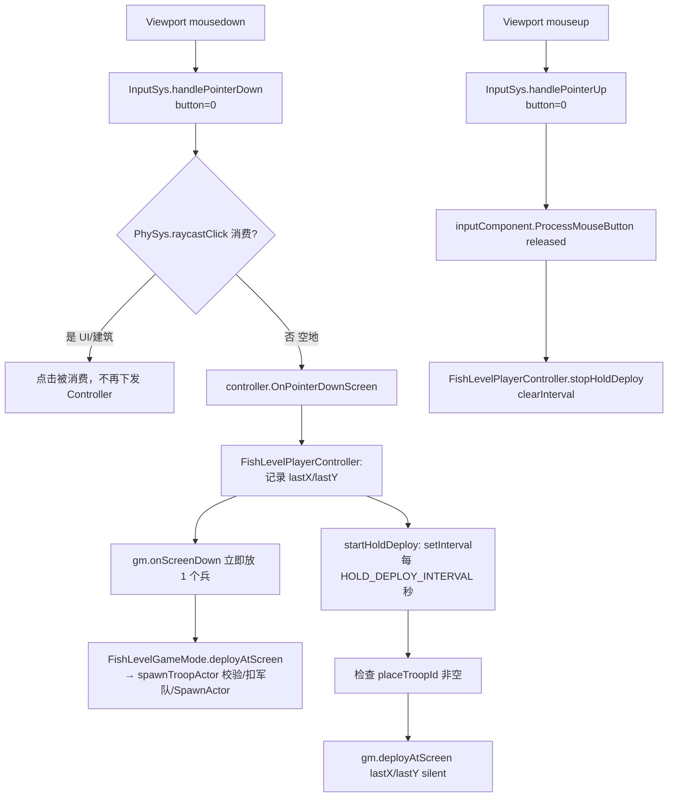

# gameplay 代码规范：GameMode / Controller / Pawn / GameState / 组件 / GameInstance / World 职责边界

> ClashMaster（fish）项目 gameplay 代码的分层规范：**GameMode（规则权威）/ Controller（用户输入操作）/ Pawn（世界化身）/ GameState（全局状态）/ 组件（行为模块）/ GameInstance（阶段路由+跨阶段共享）/ World（场景世界）** 七类角色的职责范围与禁止越界的红线。任何 gameplay 新增功能（放兵交互、建造、出海、UI 联动等）必须先按本文档归类落点，再动手写代码。
> 代码位置：`src/projects/fish/gameplay/`（各阶段 `{menu,base,game,level}/` 下的 GameMode/Controller/Pawn 三件套 + 阶段玩法）、引擎基类 `src/engine/`（`gameflow/GameMode.ts`、`input/PlayerController.ts`、`entity/Pawn.ts`、`gameflow/GameState.ts`、`gameflow/GameInstance.ts`、`gameflow/World.ts`、`entity/Component.ts`）。
> 相关文档：[`../engine/gameflow_system.md`](./engine/gameflow_system.md)（游戏流程基类与注册）、[`../engine/input_physics_script_system.md`](./engine/input_physics_script_system.md)（InputSys 输入路由）、[`../engine/entity_system.md`](./engine/entity_system.md)（实体与组件体系）、[`./battle_system.md`](./battle_system.md)（战斗玩法，本文档的规范实例）、[`./projects/clash_master.md`](./projects/clash_master.md)（项目总览）。

## 1. 概述

DemoStudio 的 gameplay 沿用 UE 风格角色模型：**GameMode 是规则权威**（生成/胜负/分数/世界对象管理），**Controller 是用户输入操作者**（把鼠标/键盘意图翻译成对游戏逻辑的调用），**Pawn 是玩家在世界中的化身**（移动/动作/属性，或占位标记）。项目每个阶段（menu / base / game / level）都注册一个"三件套"：`Fish{阶段}GameMode` + `Fish{阶段}PlayerController` + `Fish{阶段}Pawn`（见 §2）。

在此之上还有四个支撑角色，各自解决不同的问题：

| 角色 | 一句话职责 | 关键问题 |
|---|---|---|
| `GameMode` | 规则权威：本阶段游戏世界怎么运转 | 胜负/分数/生成/世界对象 |
| `Controller` | 用户输入操作者：把操作翻译成调用 | 鼠标/键盘意图 → 游戏逻辑 |
| `Pawn` | 玩家世界化身（或占位标记） | 玩家长什么样/在哪 |
| `GameState` | 可观察的全局状态（阶段/分数/时间） | React/HUD/存档读什么 |
| `Component` | 行为模块：挂到 Actor/Instance 上自管生命周期 | 单点行为内聚（血条/索敌/资源） |
| `GameInstance` | 阶段路由 + 跨阶段共享资源/军队 + 调试桥 | 整个游戏实例的"骨架" |
| `World` | 场景世界：Actor 生成/销毁/查询/场景切换 | 对象放在哪个场景里 |

**为什么需要这份规范**：七者的接口天然相邻（Controller 调 GameMode、GameMode 用 World/GameState、组件挂 Actor 上），职责一旦越界就会把"用户操作状态机"（定时器、坐标记录）、"规则状态"（掠夺、胜负）、"全局状态"（分数、阶段）塞进错误的类，导致同类逻辑分散多处、难维护难测试。真实教训：战斗放兵的长按连续放兵定时器曾一度写在 `FishLevelGameMode` 里，被纠正回 `FishLevelPlayerController`（见 §8 踩坑记录）。

**核心分工一句话**：
- **GameMode**：游戏世界怎么运转（规则），对外暴露游戏逻辑方法
- **Controller**：玩家怎么操作（输入），把操作翻译成对 GameMode/Pawn 的调用，**只做操作不做规则**
- **Pawn**：玩家长什么样/在哪（化身），被动响应 Controller 的命令
- **GameState**：可观察的全局状态（phase/score/timeElapsed/gameOver），**只存状态不做规则**
- **Component**：行为模块（组件优先原则），挂到 Actor/GameInstance 上自管生命周期
- **GameInstance**：阶段路由 + 跨阶段共享（resources/training）+ 调试桥，整个游戏实例的骨架
- **World**：场景世界（Actor 生命周期/场景切换），GameMode 与组件的操作对象

与相邻文档的边界：引擎基类的生命周期与注册机制归 `gameflow_system.md`；输入系统的路由链路（Viewport → InputSys → Controller）归 `input_physics_script_system.md`；实体/组件体系归 `entity_system.md`；战斗玩法具体规则归 `battle_system.md`。本文档只讲**职责归属红线**，不重复描述各系统实现。

## 2. 核心类 / 模块

### 2.1 引擎基类（src/engine/）

| 类 | 文件 | 职责 |
|---|---|---|
| `GameMode` | `gameflow/GameMode.ts` | 游戏规则基类（项目继承）：持有 `gameState` / `cameraManager` / `controller`；`InitGame` / `StartPlay` / `BeginPlay` / `EndPlay` / `Tick` 统一驱动 GameState → Controller → 相机；`HUDClass` 声明 HUD 蓝图；`SpawnPlayer()` 模板方法 → `spawnPlayerInternal()` 创建 controller + pawn |
| `PlayerController` | `input/PlayerController.ts` | 输入操作者基类：持有 `pawn` + `inputComponent`；`Possess` / `Unpossess`；屏幕坐标输入 `OnPointerDownScreen` / `OnPointerMoveScreen`（由 `InputSys.handlePointerDown/Move` 调用）、世界坐标输入 `OnPointerDown/Move/Up`、`OnScroll` |
| `Pawn` | `entity/Pawn.ts` | 玩家化身基类（Actor 子类）：`PossessedBy` / `Unpossessed`；`MoveForward` / `MoveRight` / `Jump`；`destroy()` 时自动 `Unpossess` |
| `GameState` | `gameflow/GameState.ts` | 可观察的全局状态基类：`phase`（waiting/playing/paused/gameover）/ `score` / `timeElapsed` / `gameOver`；`setPhase` / `addScore` / `reset` / `serialize` / `restoreFrom`；`subscribe` 供 React/HUD 监听；**只存状态不做规则**，由 GameMode 驱动（`BeginPlay`/`Tick`/`EndPlay` 由 GameMode 统一调） |
| `Component`（`AObjectComponent`/`BObjectComponent`/`ActorComponent`） | `entity/Component.ts` 等 | 行为模块基类：挂到 Actor/GameInstance 上，`BeginPlay`/`Tick`/`EndPlay` 自管生命周期（随宿主自动驱动/回收）；**组件优先原则**——新行为优先组件实现，不塞进拥有者类 |
| `GameInstance` | `gameflow/GameInstance.ts` | 游戏实例基类（全局唯一 `GameInstance.current`）：持有 `inputSys` / `gm` / `renderContainer`；抽象 `controller` / `start` / `tick` / `stop` / `destroy`；项目继承 `FishGameInstance` 做阶段路由与跨阶段共享 |
| `World` | `gameflow/World.ts` | 场景世界（继承 AObject）：持有 `THREE.Scene`、`gameMode`、`ui`（UIManager）、`actorMgr`（ActorManagerComponent）；`SpawnActor` / `SpawnActorFromBlueprint` / `FindActors` / `DestroyAllActors` / `SwitchToScene` / `createBoxMesh` 等；`running` 标记运行态 |

### 2.2 项目三件套（src/projects/fish/gameplay/，每阶段一套）

| 阶段 | GameMode | Controller | Pawn |
|---|---|---|---|
| menu | `FishMainMenuGameMode`（`menu/`） | `FishMainMenuPlayerController` | `FishMainMenuPawn`（占位） |
| base（村庄建造） | `FishBaseGameMode`（`base/`） | `FishBasePlayerController`：`OnPointerDownScreen` → `gm.onScreenDown`（放置/选中建筑）、`OnPointerMoveScreen` → `gm.setMouseScreen` + `gm.onScreenMove`（预览跟随） | `FishBasePawn`（**占位标记**，玩家无物理化身） |
| game（出海） | `FishGameMode`（`game/`） | `FishPlayerController`：`OnPossess` 绑定 1~5 键切炮、`OnPointerMove` → `pawn.SetAimTarget`、`OnPointerDown/Up` → `pawn.SetFiring(true/false)`、`OnScroll` 切炮等级 | `FishCannon`（**真化身**：炮塔，`SetLevel`/`SetAimTarget`/`SetFiring`） |
| level（战斗） | `FishLevelGameMode`（`level/`） | `FishLevelPlayerController`：`OnPointerDownScreen` → `gm.onScreenDown` 立即放兵 + 启动长按连续放兵定时器（`HOLD_DEPLOY_INTERVAL = 0.2`）、`OnPointerMoveScreen` 记录坐标 + 转发云台、构造里 `BindMouseButton` 订阅左键释放停止长按 | `FishLevelPawn`（**占位标记**） |

### 2.3 项目支撑角色实例（GameState / 组件 / GameInstance / World 在 fish 中的形态）

| 角色 | 实例 | 使用方式 |
|---|---|---|
| GameState | `GameMode.gameState`（基类内置，各 GameMode 直接使用） | 阶段流转：`InitGame`/`StartPlay` 里 `setPhase('waiting'/'playing')`、`finishBattle` 里 `setPhase('gameover')`、出海 `addScore`；`FishGameInstance` 订阅 `mode.gameState.subscribe(...)` 驱动 HUD 分数/阶段回调 |
| 组件（GameInstance 级） | `ResourcesComponent` / `TrainingComponent`（`common/comp/`） | 跨阶段共享的资源/军队：`FishGameInstance` 构造里 `new` + `addComponent`，各阶段经 `GameInstance.current as FishGameInstance` 访问 `inst.resources` / `inst.training` |
| 组件（Actor 级） | `BuildingHealthBarComponent` / `TroopHealthBarComponent`（血条）、`TroopHealthComponent` / `TroopTargetComponent` / `TroopMoveComponent` / `TroopAttackComponent`（兵组合）、`MuzzleFlashComponent`（炮口特效） | 挂到具体 Actor 上，组件自管生命周期（默认隐藏/受击显示/超时隐藏等），GameMode 只调 `onDamaged` 等公开方法 |
| 脚本组件 | `BaseHud.script.ts` / `BattleHud.script.ts` / `BuildMenu.script.ts` / `BarracksUi.script.ts` / `MapPanel.script.ts` 等（`extends BehaviourScript`，经 `UIScriptComponent` 挂 widget 资产） | UI 行为：绑定按钮、读表生成卡片、每帧刷新；经 `GameInstance.current` 拿实例、经宿主 Actor 的 `this.actor`/`this.world` 操作 UI |
| GameInstance | `FishGameInstance`（`gameplay/FishGameInstance.ts`） | 阶段路由中枢：`switchToPhase` / `setupXxxPhase`（创建 GameMode 三件套、托管相机、`PhySys.setup`）/ `enterLevel` / `returnToBase`；共享组件持有者（`resources` / `training`）；`window.__fishBattle` 调试桥；`getActiveCamera()` |
| World | `this.world`（GameMode/Actor/脚本都可访问） | `SpawnActor` / `SpawnActorFromBlueprint`（生成建筑/兵/弹丸）、`FindActors`（按类型查）、`actorMgr`（`GetAllActors`）、`world.ui`（UIManager：`spawnUIActor` / `destroyUIActor`）、`SwitchToScene`（阶段场景切换）、`createBoxMesh` 等网格工厂、`running` 运行态标记 |

## 3. 职责边界（红线）

### 3.1 GameMode 只做

1. **规则权威**：胜负判定、分数、生成/回收、掠夺累计（如 `FishLevelGameMode.finishBattle` / `damageBuilding`）
2. **游戏状态表**：hp 表、军队、放置模式当前选中兵种（`selectedTroopId`）等——状态归 GameMode，但**只通过公开方法/回调向外暴露**（如 `placeTroopId` getter、`getLootDisplay()`、`onLootDisplayChange` 回调）
3. **世界对象管理**：收集建筑、`SpawnActor` 兵/弹丸、挂组件（血条）、相机托管（`baseCamera`）
4. **对外提供游戏逻辑方法**：`onScreenDown` / `deployAtScreen` / `spawnTroopActor` / `selectTroop` / `cancelPlaceMode` 等——Controller 只调这些，不重复实现
5. **装配期绑定**（仅限 `spawnPlayerInternal` 内）：创建 controller + pawn、`rig.bindInput(controller.inputComponent)`（相机滚轮/右键）、`BindAction('battle-cancel', 'Escape', ...)` 等**一次性装配**——这是唯一允许 GameMode 碰输入组件的地方

### 3.2 Controller 只做

1. **用户输入操作**：把鼠标/键盘意图翻译成对 GameMode / Pawn 的调用（`OnPointerDownScreen` → `gm.onScreenDown`、`OnPointerMove` → `pawn.SetAimTarget`）
2. **操作状态机**：长按连续放兵定时器（`startHoldDeploy` / `stopHoldDeploy`）、最近坐标记录（`lastX/lastY`）、按下/释放状态——**定时器、坐标、按住标记这类"用户操作过程状态"必须留在 Controller**
3. **输入绑定**：`inputComponent.BindAction`（键盘动作）、`BindMouseButton`（鼠标按下/释放广播）、`BindScroll`——除 `spawnPlayerInternal` 装配期外，交互输入一律在 Controller 构造/`OnPossess` 里绑定
4. **控制 Pawn**：`this.pawn` 上的方法（`SetLevel` / `SetFiring` / `MoveForward`…）

### 3.3 Pawn 只做

1. **玩家世界化身**：位置/移动/动作/属性（`FishCannon` 的等级、瞄准、开火）
2. **占位标记**：无物理化身的阶段（base / level）Pawn 保持空壳，**不塞逻辑**
3. 被动响应 Controller 的命令，**不主动查询输入、不碰规则**

### 3.4 GameState 只做

1. **可观察的全局状态**：`phase` / `score` / `timeElapsed` / `gameOver`，`subscribe` 供 React/HUD/GameInstance 监听
2. **状态读写 API**：`setPhase` / `addScore` / `reset` / `serialize` / `restoreFrom`（存档）
3. 由 GameMode 驱动（`InitGame` → `reset`、`StartPlay` → `setPhase('playing')`、Tick/EndPlay 由 GameMode 统一调）——**GameState 不自己推规则**

### 3.5 组件系统只做（组件优先原则）

1. **单点行为模块**：血条（`BuildingHealthBarComponent` / `TroopHealthBarComponent`）、兵战斗组合（`TroopHealth/Target/Move/Attack`）、特效（`MuzzleFlashComponent`）、跨阶段共享（`ResourcesComponent` / `TrainingComponent`）——**每个组件内聚一个职责，自管生命周期与资源**
2. **自管生命周期**：`BeginPlay` 建资源（网格/订阅）、`Tick` 驱动自身逻辑（倒计时/索敌）、`EndPlay` 释放（MeshComponent 机制自动释放）；**拥有者只调公开方法**（如 `onDamaged(ratio)`），不替组件管理内部状态
3. **UI 行为用脚本组件**：`BehaviourScript` 经 `UIScriptComponent` 挂 widget 资产（`BaseHud` / `BattleHud` / `BuildMenu` / `MapPanel` 等），绑定按钮、读表生成、每帧刷新
4. **组件优先判定**：新功能先问"能否做成组件挂到某个 Actor/Instance 上"？能 → 组件实现，**非必要不修改拥有者（GameMode/Actor/GameInstance）类**（项目铁律，见 copilot-instructions.md）

### 3.6 GameInstance 只做

1. **阶段路由**：`switchToPhase` / `setupXxxPhase`（创建三件套、托管相机、`PhySys.setup`）/ `enterLevel` / `returnToBase`
2. **跨阶段共享组件持有者**：`resources` / `training`（构造里 `new` + `addComponent`，各阶段经 `GameInstance.current as FishGameInstance` 访问）
3. **调试桥**：`window.__fishBattle`（enterLevel/addArmy/deploy/getBattle/stepTicks…）
4. **实例级服务挂接**：Toast / Colorblind 等（`start()` 里 `attach`）
5. **相机委托**：`getActiveCamera()`（渲染器每帧委托）

### 3.7 World 只做

1. **Actor 生命周期**：`SpawnActor` / `SpawnActorFromBlueprint` / `DestroyAllActors` / `actorMgr.GetAllActors`
2. **场景切换**：`SwitchToScene(name, extraSetup?)`（阶段切换由 GameInstance 调，裸切换由调试桥）
3. **查询与工厂**：`FindActors`（按类型）、`createBoxMesh` / `createPlaneMesh` / `createGridLines` 等网格工厂
4. **UI 入口**：`world.ui`（UIManager：`spawnUIActor` / `destroyUIActor`）
5. **运行态标记**：`world.running`（动态 UI 生成/特效判断前置）

### 3.8 禁止越界（红线清单）

| 红线 | 正确归属 | 错误示范 |
|---|---|---|
| ❌ GameMode 里写用户操作状态机（定时器/坐标/按住标记） | Controller | 长按连续放兵的 `setInterval` 写在 `FishLevelGameMode`（历史踩坑，见 §8） |
| ❌ Controller 直接改游戏状态/世界对象 | GameMode 公开方法 | Controller 里直接 `world.SpawnActor`、直接改 `lootCoins` |
| ❌ Controller 持有规则数据 | GameMode | Controller 里缓存"掠夺累计值" |
| ❌ Pawn 查询输入或实现规则 | Controller / GameMode | `FishLevelPawn` 里做放兵判定 |
| ❌ GameMode 在装配期之外绑输入组件 | Controller | `FishLevelGameMode.Tick` 里 `BindMouseButton` |
| ❌ 项目逻辑写进引擎基类 | 项目层继承覆写 | 改 `PlayerController.ts` 加战斗逻辑 |
| ❌ 规则逻辑写进 GameState | GameMode | 在 `GameState.setPhase` 里塞胜负判定 |
| ❌ 把行为写进拥有者类而非组件 | 新组件 | 在 `FishLevelGameMode` 里直接实现兵的血条显隐逻辑（应该用 `TroopHealthBarComponent`） |
| ❌ 阶段玩法逻辑写进 GameInstance | 对应阶段 GameMode | `FishGameInstance` 里做放兵判定/建造逻辑（GameInstance 只做路由与共享） |
| ❌ GameMode/组件直接改全局共享资源 | GameInstance 的组件 | 战斗里直接改 `resources` 数值而不经 `ResourcesComponent` |
| ❌ 跨阶段共享逻辑写进单阶段 GameMode | GameInstance / 共享组件 | 把训练军队逻辑写进 `FishLevelGameMode` |
| ❌ 绕开 World 生命周期直接操作 THREE 对象 | World.SpawnActor / 组件 | 手动 `scene.add` 而不经 `SpawnActor`（漏生命周期/回收） |

## 4. 工作流程（用户操作 → 游戏逻辑的流转）

### 4.1 主流程（以战斗放兵为例）



### 4.2 分阶段说明

| 阶段 | 触发点 | 关键调用 | 归属 |
|---|---|---|---|
| 输入路由 | Viewport mousedown/mousemove/mouseup | `InputSys.handlePointerDown/Move/Up` | 引擎（input_physics_script_system.md） |
| 操作翻译 | 空地按下 / 移动 / 释放 | `Controller.OnPointerDownScreen/MoveScreen`、`BindMouseButton` 回调 | Controller |
| 规则执行 | Controller 调用 | `GameMode.onScreenDown` / `deployAtScreen` / `spawnTroopActor` | GameMode |
| 化身响应 | Controller 控制 | `Pawn.SetLevel` / `SetAimTarget` / `SetFiring`（出海） | Pawn |
| 装配 | 阶段切换 | `GameMode.spawnPlayerInternal`：new Controller/Pawn → `rig.bindInput` → 注入 `controller.gameMode = this` | GameMode（装配期） |

### 4.3 设计要点

- **Controller → GameMode 单向依赖**：Controller 持有 `gameMode` 引用（`spawnPlayerInternal` 注入），GameMode **不反向持有操作细节**；GameMode 需要通知外部时用公开回调（如 `onLootDisplayChange`）而不是反向调用 Controller
- **Controller → Pawn 通过 `this.pawn`**：出海玩法 Controller 在 `OnPossess(pawn)` 里把输入绑定到 Pawn 方法（`FishPlayerController` 先例）；占位阶段不绑
- **装配期例外**：`spawnPlayerInternal` 是 GameMode 创建三件套的唯一入口，允许在此绑相机输入（`rig.bindInput`）与全局动作（Esc），因为此时 Controller 尚未完全就绪、且这些绑定是"场景级装配"而非"用户操作状态机"
- **状态归属判定法**：写代码前逐问——"这是规则吗？"→ GameMode；"这是操作过程吗？"→ Controller；"这是化身行为吗？"→ Pawn；"这是全局可观察状态吗？"→ GameState；"这是单点行为/资源吗？"→ 组件；"这是跨阶段共享/阶段路由吗？"→ GameInstance；"这是对象生成/场景切换吗？"→ World

## 5. 边界条件（越界自查表）

新增 gameplay 代码前逐条对照：

| 检查项 | 判定 | 正确落点 |
|---|---|---|
| 要放一个兵/扣一滴血/判定胜负 | 规则/世界状态 | GameMode 公开方法 |
| 要响应鼠标按下/释放/移动、长按、连点 | 用户操作 | Controller（`OnPointerDownScreen` / `BindMouseButton` / 定时器） |
| 要响应键盘（Esc 取消放置等） | 装配期 → GameMode `spawnPlayerInternal`；阶段内 → Controller `BindAction` | 见 §3.1-5 |
| 要动玩家模型/位置/属性 | 化身行为 | Pawn |
| 需要跨阶段共享（资源/军队） | 非三者职责 | GameInstance / 组件（`ResourcesComponent` / `TrainingComponent`） |
| 需要 UI 联动（HUD 刷新） | 非三者职责 | UIScriptComponent 脚本 / 公开回调 |
| Controller 需要"再等 0.5 秒做什么" | 定时器 | Controller（**不得写进 GameMode.Tick**） |
| GameMode 需要"知道鼠标在哪" | 操作过程坐标 | Controller 记录并在需要时传给 GameMode 方法参数 |
| 需要记录"当前是第几关/游戏是否结束" | 全局可观察状态 | GameState（`setPhase` / `subscribe`），**规则判定留在 GameMode** |
| 需要一个血条/索敌/特效/资源这类单点行为 | 组件优先 | 新建组件挂到 Actor/Instance，**不塞拥有者类** |
| 需要给某建筑/兵种加一个可复用行为 | 组件 | 新建 `XxxComponent` + `addComponent` 挂载（血条/兵组合先例） |
| 需要切换阶段/维护跨阶段资源/暴露调试桥 | 实例级骨架 | GameInstance |
| 需要生成/销毁/查询 Actor 或切换场景 | 世界操作 | World（`SpawnActor` / `FindActors` / `SwitchToScene`） |
| 要读当前阶段/分数/是否 gameover | 只读状态 | GameState（`phase` / `score` / `gameOver`） |

**失败/边界行为**：
- Controller 定时器触发时若放置模式已取消（`placeTroopId` 为空）→ 立即 `stopHoldDeploy` 自停（`FishLevelPlayerController` 先例），不依赖 GameMode 反向通知
- Controller `EndPlay` 必须清理定时器（防悬挂）；GameMode `EndPlay` 只清规则状态与相机（`baseCamera?.destroy()`），不清理 Controller 私有状态
- 长按移动到非法位置（叠建筑/超范围）→ GameMode 静默失败参数（`deployAtScreen(..., silent=true)`），Controller 不自行做合法性判断
- 组件 `BeginPlay` 依赖 `this.owner.world`（无 world 时静默跳过，如未托管 Actor）；组件随宿主销毁自动 `EndPlay` 释放资源
- `GameInstance.current` 全局唯一，脚本/组件在运行中才能取到（未运行返回 null，须判空）
- `world.running` 为 false（场景切换期/未启动）时动态生成 UI/特效可能无 HUD 可挂——前置检查

## 6. 依赖关系 / 注册机制

```
FishGameInstance（阶段路由 + 共享组件 resources/training + 调试桥）
  ├─ start() → switchToPhase('menu'|'base'|'game') → setupXxxPhase
  │    └─ World.SwitchToScene(场景名) → GameModeRegistry 创建对应 GameMode
  │         ├─ GameMode（规则权威：GameState 驱动 + 世界对象管理 + HUDClass）
  │         └─ setupXxxPhase 里 mode.SpawnPlayer() → GameMode.spawnPlayerInternal()
  │              ├─ new Fish{阶段}PlayerController()  →  controller.gameMode = mode（注入）
  │              ├─ new Fish{阶段}Pawn()
  │              └─ rig.bindInput(controller.inputComponent)（相机输入装配）
  │         └─ _controller = spawn.controller（GameInstance 持有当前阶段 Controller）
  ├─ World（SpawnActor/FindActors/SwitchToScene/网格工厂/world.ui）
  ├─ GameState（GameMode.gameState：phase/score，subscribe 供 HUD/GameInstance）
  └─ 组件（挂 Actor：血条/兵组合/特效；挂 GameInstance：resources/training；挂 widget：*.script.ts）
GameModeRegistry.register('menu'|'base'|'game'|'level', ctor)  → 场景 mode 字符串映射（register.ts）
```

- 七角色的注册/生命周期（GameMode 驱动 Controller/GameState Tick、World 驱动 Actor/组件）归 `gameflow_system.md` / `entity_system.md`；输入路由链路归 `input_physics_script_system.md`；各阶段玩法文档（`battle_system.md` / `level_system.md`）是本文档的规范实例
- 新增一个阶段 = `register.ts` 注册 GameMode + 新建三件套类 + `setupXxxPhase` 装配，职责归属照本文档 §3
- 新增可复用行为 = 新建组件（`common/comp/` 或 `battle/troops/`）挂载，不修改拥有者类（组件优先原则）

## 7. 踩坑记录 / 历史决策

- **长按连续放兵定时器误入 GameMode（2026-08-17）**：初版把"放置模式 + 左键长按每 0.4s 放一个兵"的定时器与释放处理写在 `FishLevelGameMode.spawnPlayerInternal`（`BindMouseButton` 回调里置 `placingHold` 字段）。用户纠正：**用户操作应写在 Controller 里**。重构后定时器/坐标/释放订阅全部移入 `FishLevelPlayerController`，GameMode 只保留 `onScreenDown` / `deployAtScreen` / `spawnTroopActor` 游戏逻辑方法。教训：判断"这是操作还是规则"——操作归 Controller。
- **部署后自动退出放置模式（2026-08-17 反转）**：曾按"防连点"思路在 `spawnTroopActor` 成功后调 `cancelPlaceMode()`，用户要求 CoC 风格**部署后保持放置模式**（长按连续放兵），已删除该调用；放置模式仅由 Esc / 再次点卡片退出。
- **右键平移取消放置（2026-08-17 反转）**：曾绑 `rig.onRightPanStart = () => cancelPlaceMode()`（右键与放置互斥），用户要求**右键平移不取消放置模式**（可平移地图继续放兵），已删除该绑定；`CameraRigComponent.onRightPanStart` 回调机制保留给基地阶段使用。
