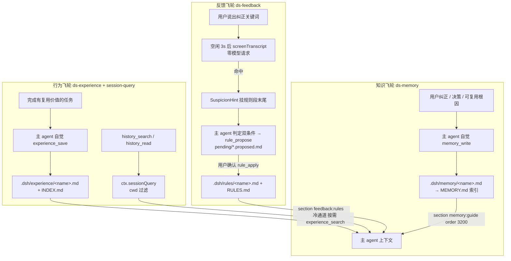
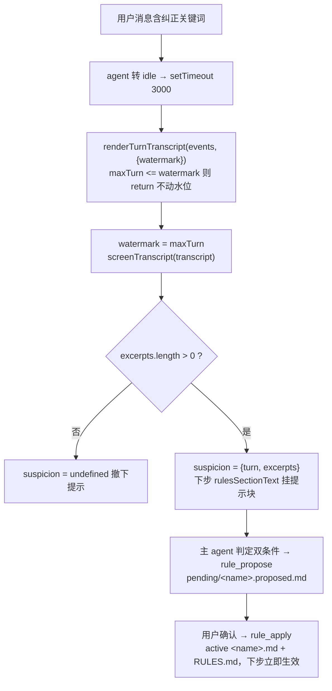

# 数据飞轮实施计划

> **一句话定位**：让 agent 在项目里越用越懂事的**三层数据闭环**——知识层（ds-memory 提示词结构化）、反馈层（ds-feedback 规则提案）、行为层（ds-experience 经验 + session-query 持久索引）；不训练模型，全部走 Markdown 落盘 + 提示词注入 + 按需检索。
>
> **什么时候会用到你**：改动 ds-memory 记忆格式、开发/维护 ds-feedback 或 ds-experience 插件、排查「规则没生效 / 经验没落盘 / history_search 报 SESSION_QUERY_SEARCH_DISABLED」、确认某条飞轮能力到底落地了没有。
>
> 代码位置：`harness/ds-memory/`、`harness/ds-feedback/`、`harness/ds-experience/`、`harness/`（session-query 走 profile patch 覆盖，无独立目录）

---

## 1. 先记住这几个文件

| 文件 | 一句话职责 | 你要改它的场景 |
|---|---|---|
| [memoryTypes.ts](../../harness/ds-memory/src/memoryTypes.ts) | 记忆提示词全文：四类型、条目格式、`WHAT_NOT_TO_SAVE`、保存触发点 | 改记忆格式规范、改「什么不该存」 |
| [ruleTypes.ts](../../harness/ds-feedback/src/ruleTypes.ts) | 规则段文本 `rulesSectionText` 与 `SECTION_ORDER = 3100` | 改规则段文案、改注入顺序 |
| [index.ts](../../harness/ds-feedback/src/index.ts) | 回合末预筛接线：`agent/status` 空闲防抖 → 预筛 → 挂提示 | 调防抖时长、改门控条件 |
| [historyTools.ts](../../harness/ds-experience/src/historyTools.ts) | `history_search` / `history_read`，包装 `ctx.sessionQuery` | 改历史检索行为、cwd 过滤 |
| [experienceStore.ts](../../harness/ds-experience/src/experienceStore.ts) | episode 落盘 + INDEX.md 索引同步 | 改经验文件格式 |

**关键心智模型**：**双通道严格分离**——记忆（ds-memory）= 事实与规则，注入 systemPrompt 常驻可见；经验（ds-experience）= 做事轨迹，只在主 agent 主动调工具时才读得到。两边各自写自己的目录，**禁止互相写入**。配套验证用例集见 [数据飞轮测试用例](./dsh_data_flywheel_test_cases.md)。

---

## 2. 三层飞轮各自怎么转：从产生到读回



### 2.1 知识飞轮（ds-memory）：提示词四段结构

这一层**不新增代码能力**，全部是提示词文本的结构化。数据由主 agent 自觉调用 `memory_write` 产生——[index.ts](../../harness/ds-memory/src/index.ts) 里没有后台提取模块，`EXTRACT_SYSTEM_PROMPT` 在仓库中已不存在（全库 grep 无命中）。

**落盘格式**（[memoryTypes.ts:147](../../harness/ds-memory/src/memoryTypes.ts)）：

```ts
export const MEMORY_ENTRY_FORMAT_TEXT = `## 记忆条目格式（以"条"为单位）

文件只是路由容器：name/description/type 都是**文件级**字段，检索按整文件注入。因此**每一条**记忆都必须是完整规范格式：

- **踩坑/教训类条目**固定四段（粗体标签）：
  \`**Problem:**\` 现象 → \`**Cause:**\` 根因 → \`**Solution:**\` 解法 → \`**Applicable:**\` 适用子系统/文件范围（供 AI 选择器路由）。
- **普通纠正/约定条目**沿用三段式：规则 → \`**Why:**\`（原因）→ \`**How to apply:**\`（何时生效）。
```

> **为什么强调「以条为单位」**：`memory_search` 是按**整文件**读回的（`wanted.has(record.fileName)` 精确匹配文件名），`name/description` 都在文件级。一份文件里塞两个不相关主题，检索时要么全读进来要么全读不进来，选择器没法路由。`Applicable` 那段就是给检索方判断"这条跟我当前任务有关吗"用的锚点。

**「什么不该存」的边界**（[memoryTypes.ts:162](../../harness/ds-memory/src/memoryTypes.ts)）：

```ts
export const WHAT_NOT_TO_SAVE_TEXT = `## 不要保存为记忆

- 代码模式、架构、文件结构 — 读代码可推导
- git 历史 — \`git log\` 是权威来源
- 一次性的修复过程流水账 — 修复已落在代码里；但可复用的根因教训要按踩坑四段格式存
```

> **反直觉处**：「调试修复配方」早先被一刀切禁止，结果踩坑飞轮断粮。现在口径是**切一刀**——一次性修复过程不存，可复用的根因教训必须存。判据是「下次遇到同类问题这条能省我时间吗」，不是「这次改了哪些文件」。

**保存触发点绑定**（[memoryTypes.ts:179](../../harness/ds-memory/src/memoryTypes.ts)）：

```ts
export const SAVE_FLOW_TEXT = `## 记忆如何被保存

你自己负责保存记忆——回合过程中出现以下触发点时，**当回合立即**调用 memory_write，不要期待有后台系统替你提取：
- 用户纠正了你的做法，或明确确认了某个方向（feedback；纠正与确认都要存）
```

> **为什么不写后台提取**：早期版本有回合末 side-query 提取，实践中要么漏存、要么滥存（把过程流水账全存进来）。现在改为「触发点绑定 + 回合末提醒」两段提示词，由主 agent 在回合内当场判定——它有完整上下文，比事后拿转录摘要判断准。

**读回路径**：[index.ts:89](../../harness/ds-memory/src/index.ts) 注册常驻段 `memory:guide`（order 3200），`text` 每次装配时重算，把截断后的 `MEMORY.md` 索引拼进段尾；主 agent 看到索引后按需调 `memory_search` 按文件名取正文。

### 2.2 反馈飞轮（ds-feedback）：从纠正到规则的完整往返



**① 预筛：零模型请求**（[preScreen.ts:13](../../harness/ds-feedback/src/preScreen.ts)）

```ts
export const CORRECTION_HINT_PATTERN =
  /(别|不要|不用这样|不准|不对|不是这样|不是这个|不行|错了|搞错|弄错|搞反|弄反|反了|漏了|回滚|重来|重新|撤回|停下|停止|打住|记住|以后都|以后别|以后不|沉淀|wrong|mistake|don't|do not|stop doing|revert|undo)/i

export function screenTranscript(transcript: string): string[] {
  const matched: string[] = []
  for (const line of transcript.split('\n')) {
    if (!line.startsWith('[用户] ') || !CORRECTION_HINT_PATTERN.test(line)) continue
    matched.push(clip(line.slice('[用户] '.length), MAX_HINT_EXCERPT_CHARS))
  }
  return matched.slice(-MAX_HINT_EXCERPTS)
}
```

> **宁滥勿缺**：误报只是让主 agent 下一回合多判一次，漏报就永久丢一条纠正，所以模式故意很宽泛（连「重新」「沉淀」都算命中）。双条件判定（① 确属用户人工纠正；② 可泛化为此类任务的必要条件）交回主 agent——它有上下文，插件不发任何 LLM 请求。
> **只测 `[用户] ` 行**是因为助手自己也常说"这样不对"，不限制来源会自触发死循环；非用户输入的行在 [transcript.ts:65](../../harness/ds-feedback/src/transcript.ts) 已被过滤（`event.data.source.kind !== 'user'`）。两份 transcript 是插件间零依赖的同语义副本（ds-feedback 侧行号 65、ds-experience 侧行号 62）。

**② 为什么要等空闲 3s**（[index.ts:75](../../harness/ds-feedback/src/index.ts)）

```ts
const DETECT_DEBOUNCE_MS = 3_000
// ...
if (payload.status === 'running') {
  // 用户回来了：撤销未触发的预筛计划，水位留待下次空闲补检
  if (state.timer !== null) {
    clearTimeout(state.timer)
    activeTimers.delete(state.timer)
    state.timer = null
  }
  return
}
```

> 用户连续追问时中途检测只拿到半截转录，且提示会在下一句话到来前被覆盖。等空闲 3s 意味着「用户停下来正在读结果」，这时挂提示最不打扰。用户中途又说话（`running`）就撤销定时器、**水位不动**——下次空闲连着这段一起补检，不会漏。

**③ 提案 → 落地的两段式**（[tools.ts:22](../../harness/ds-feedback/src/tools.ts) / [:65](../../harness/ds-feedback/src/tools.ts)）

```ts
async execute(args) {
  const file = await proposeRule(host.rulesDirectory, {
    name: args.name, content: args.content, reason: args.reason,
  })
// ...（applyRule 内）
if (existing !== undefined && input.mode === undefined) {
  throw new Error(`active 规则 ${fileName} 已存在；请显式给 mode：'overwrite'（整体替换）或 'append'（追加带日期小节）`)
}
```

> `rule_propose` 只写 `pending/<name>.proposed.md`，**绝不直接生效**。这是全飞轮最重要的一条铁律：规则会常驻进 systemPrompt 影响后续每一次会话，静默落盘等于让用户失去否决权。同名规则存在时必须显式给 `mode`——覆写有去无回，让模型被迫二选一比静默覆盖安全。`applyRule` 成功后删提案、同步 `RULES.md` 索引行（全量重写，同名替换，不产生重复行）。

**④ 为什么 apply 后当前会话立即生效**：规则段的 `text` 是**同步函数、每步重算**（[index.ts:108](../../harness/ds-feedback/src/index.ts)）：

```ts
ctx.systemPrompt.section({
  name: SECTION_NAME,
  order: SECTION_ORDER,
  text: (assembly) => {
    const state = assembly.agent !== undefined ? detectStateByAgent.get(assembly.agent) : undefined
    const rules = readActiveRulesSync(rulesDirectory)
```

> 每一步都重新 `readdir` + `readFile` 扫一遍规则目录。规则库设计上「少而精」（几十条以内），同步 IO 开销远小于"改了规则要重启会话"的体验损失。代价是段内容无缓存，规则文件多了会拖慢装配。

### 2.3 行为飞轮（ds-experience + session-query）

**① episode 落盘**（[experienceStore.ts:49](../../harness/ds-experience/src/experienceStore.ts)）

```ts
const fileName = normalizeEpisodeName(input.name)
const existing = await fileExists(episodeFilePath(experienceDirectory, fileName))
const content = renderEpisodeFile({ ...input, name: fileName.replace(/\.md$/, '') }, todayIso())
await mkdir(experienceDirectory, { recursive: true })
await writeFile(episodeFilePath(experienceDirectory, fileName), content, 'utf8')
await upsertIndexLine(experienceDirectory, fileName.replace(/\.md$/, ''), input)
return { status: existing ? 'updated' : 'created', fileName }
```

> 同名即覆盖、不产生副本——episode 是「某类任务怎么做」的一条路线，同类型第二次做应更新同一条，而不是堆出 `fix_junction_mount_2`。真实落盘格式见 `.dsh/experience/auto_scan_ds_instructions.md`：frontmatter 四键 `name/task_type/outcome/date` + `## Summary` / `## Lessons` / `## Effective Path` 三个固定小节。
>
> **触发方式**：完全靠主 agent 自觉调 `experience_save`（指导段 `experienceGuideSectionText` 驱动）。`extractFromSession` 在 [extractExperience.ts:94](../../harness/ds-experience/src/extractExperience.ts) 已被禁用，函数体只留日志并返回空结果：

```ts
// 此功能已被禁用，不再调用 LLM
_ctx.logger?.info('ds-experience: extractFromSession 已被禁用，经验保存由主 agent 自觉调用 experience_save 工具完成')
return { ok: true, saved: [], updated: [] }
```

> ds-experience 的 `index.ts` 里**没有任何** `ctx.on` / `setTimeout` / 水位逻辑——早期版本有回合末自动提炼，落地首日暴露出「自动落 5 条 episode、规则库 0 提案」的失衡，两侧一起裁撤。

**② 历史会话检索**（[historyTools.ts:75](../../harness/ds-experience/src/historyTools.ts)）

```ts
const cwd = exec.agent?.session.header.cwd
const page = await host.ctx.sessionQuery.searchSessions({
  query: args.query,
  ...(cwd === undefined ? {} : { sessionFilters: [{ kind: 'cwd' as const, values: [cwd] }] }),
  limit,
}, { signal: exec.signal })
```

> `sessionFilters` 按 cwd 过滤，只搜当前工作区的会话——跨项目串数据是灾难。注意 `cwd === undefined` 时是**不加过滤、退化为全库检索**，并在返回里带一条 `note` 说明，而不是报错。
> 官方模型侧工具包 `@deepseek-ai/dsh-tool-session-query` 不随 rc.2 内核发布，所以这两个工具自行包装内核常驻的 `ctx.sessionQuery` 服务（见 [historyTools.ts:3](../../harness/ds-experience/src/historyTools.ts) 头部注释）。

**③ 会话索引的持久化**：仓库里没有 session-query 代码，靠 profile patch 覆盖内核自带行（`E:\DemoStudio\.dsh\profiles\{web,headless}\cordis.patch.yml`）：

```yaml
- id: session-query-sqlite
  config:
    path: 'C:/Users/Kaplc/.dsh/session-query/index.sqlite'
    openAt: first-search
```

> 内核 base bundle 把这一行写死为 `path: ':memory:'` + `openAt: never`，只关闭全文搜索（报 `SESSION_QUERY_SEARCH_DISABLED`），精确读仍可用。索引放 home 而不是项目目录：它是**派生数据**，不进 git，丢了自动重建。

---

## 3. 三层之间怎么不打架

**段序即优先级**：内核自带段止于 2900，四个插件段排在其后，`text` 全部是每步重算的同步函数，谁都不会被谁缓存覆盖。

| order | 段名 | 插件 | 内容 |
|---|---|---|---|
| 3000 | `experience:guide` | ds-experience | 经验库分工声明 + INDEX.md |
| 3100 | `feedback:rules` | ds-feedback | 沉淀指引 + active 规则 + RULES.md + 纠正提示 |
| 3200 | `memory:guide` | ds-memory | 四类型 + 条目格式 + MEMORY.md |
| 3300 | `instructions` | ds-instructions | 用户手工维护的目录指令 |

> **为什么经验段排最前**：经验是「做事轨迹」，需要在 agent 开始规划前就看到「以前做过吗」；记忆是「事实与规则」，靠后作为基础背景。

**职责边界（硬约束）**：

| 内容类型 | 归属 | 目录 | 通道 |
|---|---|---|---|
| 事实、用户偏好、决策、可复用根因 | ds-memory | `.dsh/memory/` | 热：常驻注入索引 |
| 用户纠正沉淀出的持久规则 | ds-feedback | `.dsh/rules/` | 热：常驻注入全文 |
| 用户手工维护的项目规范 | ds-instructions | `.dsh/instructions/` | 惰性：读到匹配文件才注入 |
| 一次完整任务的做事轨迹 | ds-experience | `.dsh/experience/` | 冷：按需调工具 |

> 规则库与指令目录职责相近但**互不读写**——前者是纠正沉淀，后者是手工规范。同一条内容两边都放会重复注入。

---

## 4. 落地状态对照

**这一节是本文档最该看的部分**——代码实现了 ≠ 运行时在跑。当前三个插件的 `dist/index.js` 均未构建，junction 均未建立。

| 能力 | 状态 | 证据 |
|---|---|---|
| ds-memory 提示词四段结构 | ✅ 代码已实现 | `MEMORY_ENTRY_FORMAT_TEXT` 在 [memoryTypes.ts:147](../../harness/ds-memory/src/memoryTypes.ts) |
| ds-memory 后台自动提取 | ❌ 已删除，仓库无实现 | 无 `EXTRACT_SYSTEM_PROMPT`、无 `extractMemory` 模块（全库 grep 无命中） |
| ds-memory 数据落盘 | ✅ 已有数据 | `.dsh/memory/` 17 个文件 + MEMORY.md |
| ds-memory 运行时激活 | ❌ 未激活 | `harness/ds-memory/dist/index.js` 不存在；junction 未挂载 |
| ds-feedback 插件全套代码 | ✅ 代码已实现 | `rule_propose`/`rule_apply` + 规则段 + 预筛接线齐全 |
| ds-feedback 提案落盘 | ✅ 已有数据 | `.dsh/rules/pending/ui_default_no_icon.proposed.md`（date 2026-09-02） |
| ds-feedback active 规则 | ⚠️ 空库 | `RULES.md` 仅标题头，无 active 规则行 |
| ds-feedback 运行时激活 | ❌ 未激活 | `dist/index.js` 不存在；junction 未挂载 |
| ds-experience 插件全套代码 | ✅ 代码已实现 | 4 个工具 + 指导段齐全 |
| ds-experience 数据落盘 | ✅ 已有数据 | `.dsh/experience/` 22 个 episode + INDEX.md |
| ds-experience 回合末自动提炼 | ❌ 已删除，仓库无实现 | `extractFromSession` 禁用；`index.ts` 无 `ctx.on`/`setTimeout` |
| session-query 持久索引 patch | ✅ 已写入配置 | `.dsh/profiles/{web,headless}/cordis.patch.yml` 均含 `path` + `openAt: first-search` |
| session-query sqlite 文件 | ❌ 尚未建库 | `C:/Users/Kaplc/.dsh/session-query/index.sqlite` 不存在（`first-search` 惰性，未跑过首搜） |
| home 侧运行时 patch | ❌ 当前为空 | `%USERPROFILE%\.dsh\profiles\{web,headless}\cordis.patch.yml` 内容为 `[]` |
| 换机器后重建挂载 | ⚠️ 需人工 `mount_plugin` | junction 与 patch 在 home 侧，不随项目走，见 [插件安装](./dsh_plugin_install.md) |

> 判据说明：`dist/index.js` 是否存在用 `Test-Path` 实测；junction 用 `Get-ChildItem ...\@demostudio` 实测为空；patch 行用 `Select-String session-query-sqlite` 实测命中。

---

## 5. 关键方法速查

| 方法 | 位置 | 干什么 | 注意 |
|---|---|---|---|
| `memoryGuideSectionText` | [memoryTypes.ts:219](../../harness/ds-memory/src/memoryTypes.ts) | 拼记忆指导段全文 | 索引为空则不注入索引部分 |
| `MEMORY_ENTRY_FORMAT_TEXT` | [memoryTypes.ts:147](../../harness/ds-memory/src/memoryTypes.ts) | 四段/三段条目格式文本 | 改这里等于改全项目记忆规范 |
| `truncateEntrypoint` | [memoryScan.ts:111](../../harness/ds-memory/src/memoryScan.ts) | MEMORY.md 300 行 / 40KB 截断 | 超限时带截断提示，不崩 |
| `screenTranscript` | [preScreen.ts:31](../../harness/ds-feedback/src/preScreen.ts) | 从转录提取纠正摘录 | 只测 `[用户] ` 行；最多最近 2 条 |
| `CORRECTION_HINT_PATTERN` | [preScreen.ts:13](../../harness/ds-feedback/src/preScreen.ts) | 纠正关键词正则 | 宁滥勿缺，误报成本远低于漏报 |
| `rulesSectionText` | [ruleTypes.ts:96](../../harness/ds-feedback/src/ruleTypes.ts) | 拼规则段（指引+规则+索引+提示） | 单条规则超 8000 字截断 |
| `proposeRule` / `applyRule` | [ruleStore.ts:46](../../harness/ds-feedback/src/ruleStore.ts) / [:106](../../harness/ds-feedback/src/ruleStore.ts) | 写 pending / pending→active + 同步索引 | 同名无 `mode` 抛错 |
| `upsertIndexLine` | [ruleStore.ts:202](../../harness/ds-feedback/src/ruleStore.ts) | RULES.md 单行替换/追加 | 全量重写，不产生重复行 |
| `saveExperience` | [experienceStore.ts:49](../../harness/ds-experience/src/experienceStore.ts) | episode 落盘 + INDEX.md 同步 | 同名覆盖，返回 `updated` |
| `renderEpisodeFile` | [experienceTypes.ts:140](../../harness/ds-experience/src/experienceTypes.ts) | 序列化 episode 文件 | frontmatter 四键 + 三个固定小节 |
| `createHistorySearchTool` | [historyTools.ts:32](../../harness/ds-experience/src/historyTools.ts) | cwd 过滤的全文检索 | 无 cwd 时退化为全库并带 note |
| `createHistoryReadTool` | [historyTools.ts:107](../../harness/ds-experience/src/historyTools.ts) | 读会话转录 | 不存在 id 抛 `SESSION_QUERY_SESSION_NOT_FOUND` |
| `renderTurnTranscript` | [transcript.ts:41](../../harness/ds-experience/src/transcript.ts) | 事件流 → 转录 | 跳过插件注入与工具结果，只留真实用户输入 |

---

## 6. 流程影响：牵动哪些功能

### 上游：谁驱动它

| 上游 | 怎么驱动 | 相关文档 |
|---|---|---|
| DSH 内核启动 | 按 profile patch 的 insert 行装载三个插件，junction 解析包名 | [插件安装](./dsh_plugin_install.md) |
| 用户纠正行为 | 说出纠正关键词 → 空闲 3s 后预筛命中 → 挂提示 | [Harness 工程](./harness_system.md) |
| 主 agent 自觉调用 | `memory_write` / `experience_save` / `rule_propose` 全靠它主动 | [DSH 引擎集成](./dsh_engine_integration.md) |
| `ctx.sessionQuery` 服务 | ds-experience 包装它做历史检索；持久索引靠 patch 覆盖 | [DSH 引擎集成](./dsh_engine_integration.md) |

### 下游：它波及谁

| 下游功能 | 波及点 | 相关文档 |
|---|---|---|
| system prompt 装配 | 四段按 3000 / 3100 / 3200 / 3300 排序，全部每步重算 | [ds-instructions PRD](./dsh_instructions_prd_revised.md) |
| ds-instructions | 手工规范进 `.dsh/instructions`，纠正沉淀进 `.dsh/rules`，互不读写 | [ds-instructions PRD](./dsh_instructions_prd_revised.md) |
| agent 工具清单 | 新增 6 个工具（rule_propose/rule_apply/history_search/history_read/experience_save/experience_search） | [Harness 工程](./harness_system.md) |
| 项目可迁移快照 | `.dsh/{memory,rules,experience}` 随 git 走，session-query 索引在 home 属派生数据 | [插件安装](./dsh_plugin_install.md) |

---

## 7. 踩坑清单

**1. patch 是整行 config 替换，不是字段合并** —— 覆盖 `session-query-sqlite` 只写 `path`，`openAt` 被重置回 `never`，全文搜索依旧关闭。规则：覆盖时把关键键**写全**（`path` + `openAt`）。

**2. 依赖主模型自觉调用被证伪过一次** —— 早期版本落地首日，经验库自动落 5 条 episode，规则库 **0 提案**：模型倾向直接照做而不沉淀。规则：加客户端关键词**预筛**（零模型请求）挂「回合末纠正提示」，把判定推回主 agent 但给它一个明确触发信号。

**3. 独立 side-query 小模型方案被裁撤** —— 每回合空闲多一次小模型请求，成本高且判定不准，与「删后台提取、主 agent 主动」方向冲突。规则：`extractModel`/`extractProvider` 配置已删除，`extractFromSession` 保留函数体但只打日志。

**4. 经验塞进 memory 会淹掉热通道** —— 任务轨迹类记忆占满检索视野（索引 300 行 / 40KB 水位），真正的事实/规则被挤出。规则：记忆/经验**双通道严格分离**，指导段里把这条写成硬约束。

**5. 插件目录用相对路径会落进 `harness/dsh-source`** —— 编辑器 spawn 内核时 `cwd: DSH_SOURCE_DIR`（见 [插件安装 §2.1](./dsh_plugin_install.md)）。规则：`memoryDir` / `ruleDir` / `experienceDir` 在 patch 里用**绝对路径钉死**。

**6. 改了插件源码但行为没变，且无任何报错** —— DSH 加载的是 `dist/index.js`，junction 只是指针不帮你编译。规则：每次改源码后 `npm run build`；`mount_plugin` 见 `dist/` 已存在会跳过编译，需强制时传 `forceBuild: true`。

**7. 官方 session-search 工具包在 rc.2 内核里不存在** —— 按文档找 `@deepseek-ai/dsh-tool-session-query`，node_modules 里没有（dsh-base 不依赖）。规则：历史检索工具**自行包装 `ctx.sessionQuery`**。

**8. headless 无热重载** —— headless 是一次性进程，`patchReload: live` 只对 web 有效。规则：headless 每次改动后**重启内核**。

---

## 8. 边界条件

| 条件 | 行为 | 怎么应对 |
|---|---|---|
| `openAt: never`（内核默认） | 全文搜索报 `SESSION_QUERY_SEARCH_DISABLED`，精确读仍可用 | patch 覆写 `path` + `openAt: first-search` |
| 首次 `history_search` | 此时才建 SQLite 库，首搜偏慢 | 属 `first-search` 惰性语义的预期行为 |
| 会话 header 无 cwd | 不加 `sessionFilters`，退化为全库检索 | 返回值带 `note` 说明未过滤，非报错 |
| 搜索其他 cwd 的会话 | 不命中 | 按工作区隔离是设计目标 |
| `rule_apply` 同名无 `mode` | 抛错，提示 overwrite/append 二选一 | 显式传 `mode` |
| pending 提案未确认 / 规则库为空 | 不出现在规则段（段只列 active 规则） | 空库时规则段显示「规则库当前为空」 |
| 规则库超限（>300 行 / >40KB）、单条 >8000 字 | 索引/正文截断并带截断提示，不崩 | `MAX_INDEX_LINES`、`MAX_RULE_CONTENT_CHARS` |
| `autoDetect: false` | 不注册 `agent/status` 监听，规则段仍注册 | 只关预筛，不关规则能力 |
| 子 agent（`delegationDepth>0`） | 不预筛、不挂提示 | 提示经 `assembly.agent` 隔离，父 agent 才可见 |
| `running` 撤销未触发预筛 | 定时器清除、水位保留，下次空闲补检 | 自动，不会漏检 |
| episode 同名覆盖 | 更新原文件返回 `updated`，静默无 notice | 指导段要求覆盖时保留旧路线的教训 |
| 插件 `enabled: false` | `apply` 开头直接 return，一切不注册 | 三个插件都实现了该开关 |
