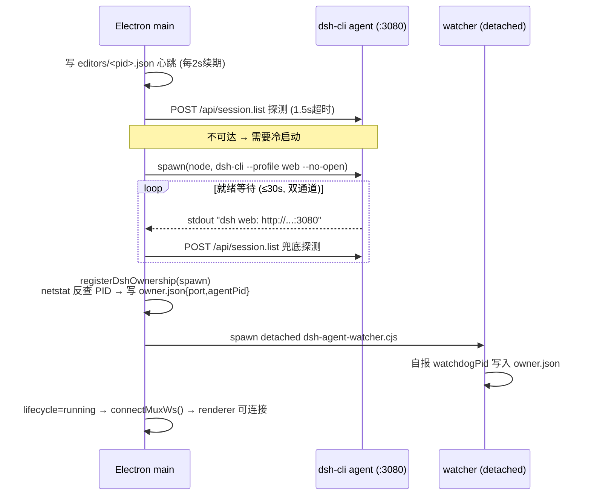
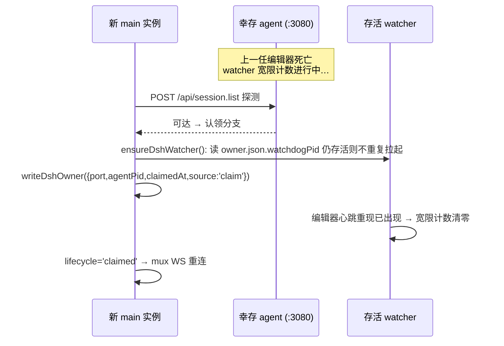

# DSH 与引擎集成架构（agent 常驻化）

> 状态：M2 已实现（agent 常驻化改造完成）；端到端实测依赖 dsh-source 构建产物。
>
> **最近更新**：DSH agent 从「Electron main 进程生命周期绑定」改为**常驻进程**——渲染层热刷新与 main 进程重启均不打断 agent；新增所有权 watchdog、认领机制、崩溃自愈与会话恢复。废弃的 `editor/dsh-agent-service.cjs` 已删除。

---

## 1. 使用方法（开发者视角）

### 启动编辑器（自动引导 agent）

```bash
npm run dev   # 或双击 editor.bat
```

启动顺序（`electron/main.ts` 的 `startApp()`）：

1. `showLoadingWindow()` —— 显示无边框加载窗口
2. `startMCPServer()` —— 引擎 HTTP API，端口从 `9877` 起自动递增（多实例支持）
3. `bootstrapDSH('startup')` —— **后台异步**执行 agent 引导（探测 → 认领 / spawn），不阻塞编辑器启动
4. `waitForDevServer()` —— 等 Vite 起来
5. `createMainWindow()` —— 主窗口加载
6. `app-ready` IPC 触发后关闭加载窗口

### Agent 面板连接与恢复

打开编辑器主窗口 → **Agent 面板** → `AgentService.connect()` 自动执行三阶段流程：

| 阶段 | 状态 | 行为 |
|---|---|---|
| 1 | `claiming` | 轮询 `electronAPI.dshStatus()` 直到 main 完成 agent 引导（≤60s），拿到端口 |
| 2 | `recovering` | 有 localStorage 会话映射 `{sessionId, port}` 时校验并 attach 旧会话（**无感接续**，历史以远端 `session.history` 为单一可信源拉回；若刷新期间有进行中回合则断档续听补齐），失败自动回退 |
| 3 | `connecting` | 无映射或映射失效 → `session.create` 新建并持久化映射 |

恢复成功时顶部显示系统消息「**会话已恢复**」。

### 手动重启 agent

当面板状态显示「Agent 故障 · 点击重启」（`degraded` 终态）时，点击状态指示器即触发：

```
ConnectionIndicator.onClick(degraded)
  └─ handleRestartAgent()
        ├─ electronAPI.dshRestart()      // IPC: dsh-restart → main 重置自愈计数后重新 bootstrapDSH('manual-restart')
        └─ 轮询 dshStatus 直至 running/claimed → agentService.connect() 自动重连
```

### Agent 独立窗口（唯一 Agent UI 形态）

> **编辑器内嵌 Agent 面板已移除**（RightPanel 仅承载 Inspector）。Agent UI 的唯一形态是独立 Electron 窗口。

入口（调用 `dsh-open-agent-window` IPC → `openAgentWindow()`）：

- 顶部菜单栏 **Agent → 「在独立窗口打开 Agent」**
- 快捷键 **Ctrl+Shift+A**

窗口加载**编辑器自身的 AgentUI**（与 agent `:3080` 交互、共享同一批会话）：

- 实现方式：窗口加载编辑器应用并携带 `?agentWindow=1`，`App.tsx` 检测该参数后只全屏渲染 `<AgentPanel/>`（不初始化引擎/菜单/视口）；
- 单例：重复触发聚焦已有窗口；agent 未就绪时窗口内 AgentPanel 自动进入 `claiming` 态轮询等待（复用自身连接状态机）；
- 仅是 UI 容器，不影响 agent 进程管理；主窗口关闭时级联关闭该窗口，随后 `window-all-closed` 正常触发 agent 收割（不变量不破坏）；
- spawn 参数保持 `--no-open`，不自动弹 DSH 自带的浏览器 WebUI（如需官方界面可手动访问 `http://127.0.0.1:3080`）。

---

## 2. 工作流程

### 2.1 分层职责（关键不变量表）

| 层 | 职责 | 明确不做 |
|---|---|---|
| agent 子进程（`:3080`，`dsh-cli --profile web --no-open`） | 唯一常驻者：提供 DSH 业务 HTTP（RPC over `/api/*`）、mux WS 下行流 | 不感知编辑器 UI，无所有权概念 |
| watchdog 进程（`editor/dsh-agent-watcher.cjs`，detached） | **所有权守护**：监视编辑器心跳注册表，全部编辑器消失且宽限期满 → 收割 agent 并自杀；自报 PID 到 owner.json | 不代理任何业务流量 |
| Electron main | 引导（探测/认领/spawn）、持有业务 mux WS、崩溃自愈、优雅停机、`dsh-status`/`dsh-restart` IPC | 不改 DSH 内核；不替 renderer 决定会话 |
| renderer | AgentPanel UI + AgentService（claiming/recovering 状态机、localStorage 映射、history 补档） | 不决定 agent 生死 |

> **为什么不用「内核 WS 心跳」表达所有权**：约束禁止修改 DSH 内核源码加接口，而 dsh-cli web profile 未提供 claim/ownership 能力。因此所有权落在我们自己侧的 **detached watchdog + 本地文件协议** 上，对内核零假设。

### 2.2 冷启动时序（无人认领）



### 2.3 main 重启认领时序（幸存 agent）



认领流程是幂等的：任意实例何时加入都只更新协议文件 + 确保 watcher 存活。

### 2.4 停机与孤儿收割

```mermaid
flowchart TD
    X[window-all-closed] --> Y[stopDSHService]
    Y --> Z1["删除本实例 editors/&lt;pid&gt;.json<br/>停心跳定时器"]
    Z1 --> Q{还有其他新鲜编辑器?}
    Q -->|是| R[仅注销自己<br/>agent 与 watcher 继续服务多实例]
    Q -->|否| S[killProcessTree agentPid<br/>killProcessTree watchdogPid<br/>删 owner.json]
    S --> T[app.quit():3080 无监听]

    U[编辑器崩溃/强杀] --> V[心跳过期&lt;6s 扫除<br/>editors 目录清空]
    V --> Wt{"连续 ORPHAN_GRACE_MS(30s)<br/>无活跃编辑器?"}
    Wt -->|宽限期内重开编辑器| OK[新实例认领, 计数清零]
    Wt -->|期满| KILL[taskkill /T /F agentPid<br/>清理协议文件 → watcher 自杀]
```

### 2.5 崩溃自愈

```
child.on('exit') 且 !_dshShuttingDown 且 lifecycle==='running'
  → disconnectMuxWs(), _dshPort=0
  → lifecycle='restart-wait'
  → 退避 delay = min(2000 × 2^n, 60000) 后重新 bootstrapDSH('auto-restart')
  → 成功: running + 计数清零
  → 达上限(5次): lifecycle='degraded' 终态 → AgentPanel 展示"Agent 故障·点击重启"，不弹窗，编辑器其余功能不受影响
```

配置常量（`electron/main.ts`）：

| 常量 | 默认值 | 含义 |
|---|---|---|
| `DSH_PORT_DEFAULT` | 3080 | agent 固定端口 |
| `DSH_EDITOR_HEARTBEAT_MS` | 2000 | 编辑器心跳周期 |
| `DSH_OWNER_GRACE_MS` | 30000 | 孤儿宽限时长（兼顾「强杀后快速重开认领」窗口） |
| `DSH_PROBE_TIMEOUT_MS` | 1500 | 探测 RPC 超时 |
| `DSH_SPAWN_READY_TIMEOUT_MS` | 30000 | spawn 就绪上限 |
| `DSH_AGENT_MAX_RESTARTS` | 5 | 自愈次数上限 |
| `DSH_AGENT_RESTART_BASE_MS` / `_MAX_MS` | 2000 / 60000 | 自愈退避区间 |
| watcher `HEARTBEAT_STALE_MS`（内置） | 6000 | 心跳过期阈值 |

### 2.6 会话恢复与断档补档

- **持久化映射**：renderer 在 localStorage `demostudio.dsh.session` 写 `{sessionId, port, savedAt}`；`connect/createSession/switchSession` 都会刷新，`deleteSession` 删除当前会话时清除。
- **单一可信源**：聊天历史永远从远端 `session.history` 拉回（`loadHistory()` 分页 fold），本地不缓存消息体。
- **断档补档**：恢复 attach 成功后检查 history 尾部——最后一个边界事件若是未闭合的 `turn/start`，说明刷新期间有回合在跑，启动 `pollForResponse()` 断档续听直到 `turn/end`。轮询内部以 history 最新 seq 为起点，不重复回放。
- **通信制式事实**：现行协议为 **session.prompt RPC + history 轮询主导**（mux WS 仅承载 `question/requested` 等 server-push 帧，由 main 持有）。当前 dsh-cli 版本不存在 per-session SSE 流端点，「SSE 主导」不适用；如后续内核提供再切换。

---

## 3. 边界条件

### 3.1 失败模式表

| 场景 | 行为 | 恢复 |
|---|---|---|
| `harness/dsh-source/apps/cli/lib/bin.js` 不存在 | `spawnDshAgent()` throw → `degraded` 终态，面板显示故障（不弹窗，编辑器其余功能正常） | 补齐构建产物后点状态指示器手动重启（`dsh-restart`） |
| 探测超时/:3080 无响应 | 按「需冷启动」处理走 spawn 路径 | 自动 |
| spawn 后就绪超时（30s） | kill 残留子进程 → `degraded` 终态 | 手动重启入口 |
| agent 运行中异常退出 | 指数退避自愈 ≤5 次；期间面板经 `restart-wait` 态感知；超限 `degraded` | 自动 / 手动 |
| 强杀整个编辑器后在宽限期内重开 | 新 main 探测到幸存 agent → 认领成功，日志记录探测→认领→attach 全链路 | 自动 |
| 强杀后超过宽限期才重开 | watcher 已收割 agent 并自杀 → 新实例冷启动新 agent（旧远端会话仍在 DSH 存储，renderer 凭映射 attach 回去，尽力而为） | 冷启动 + 会话恢复 |
| 多实例同时运行 | 共享同一 `:3080` agent；各实例独立 session；先退出者仅注销自己心跳 | watcher 以「全部编辑器消失」为准 |
| 正常关窗但检测到其他新鲜编辑器 | 不杀 agent/watchdog，仅注销自身心跳 | 自动 |
| 保存的 sessionId 已失效（归档等） | `recovering` 校验失败 → 清映射 → 回退新建会话 | 自动 |
| renderer 连接期间 main 进入 degraded | `waitForAgentReady()` 抛 `AGENT_DEGRADED` → 面板 `degraded` 态提示 | 手动重启 |
| owner.json 损坏 | watcher 连续读不到持续 grace 秒后自行退出（无 agent 可守）；main 写入失败打 error 日志不中断 | 下次引导重建 |
| 浏览器调试模式（无 electronAPI） | RPC 走 Vite 代理直连 :3080；跳过 claiming 等待直接返回默认端口 | 自动降级 |

### 3.2 安全约束

| 约束 | 实现 |
|---|---|
| 不修改 DSH 内核源码 | 只消费 `dsh-source` 构建产物与既有 HTTP/WS 协议；所有权由本地 watchdog + 文件协议实现 |
| 禁止 localhost 直连 | 全部固定 `127.0.0.1`；agent 端口不暴露外网 |
| 协议文件路径 | 仅落在 `<repo>/cache/dsh-runtime/`（已 gitignore）：`owner.json` / `editors/*.json` / `watchdog.log` |
| API Key/设置持久化 | 由 DSH host 侧承担（如 `~/.dsh/settings.yaml` 与 credentials）；前端重连后经 `credentials.describe` / `settings.describe` 还原展示 |
| watcher 进程权限 | detached + stdio ignore，仅具备 taskkill 目标 PID 的能力 |

### 3.3 关键不变量（修订版）

1. **agent 归属判定靠心跳注册表，不靠父子进程关系** —— 认领的旧 agent 不是本实例的 child，唯一凭据是 `owner.json.agentPid` 与 `editors/` 心跳
2. **主动关闭才收割 agent** —— `window-all-closed` 路径才会 kill；HMR 刷新与 main 重启绝不触碰 agent
3. **孤儿自杀宽限 = `DSH_OWNER_GRACE_MS`（可配）** —— watcher 是唯一有权在编辑器全部消失后收割 agent 的角色
4. **业务通道仍是 HTTP RPC + history 轮询兜底** —— mux WS 只承载 server-push 帧；WS 不用于业务数据通道
5. **DSH runtime 子进程由 dsh-cli 自持** —— 编辑器只管理 dsh-cli 这一层进程树
6. **会话恢复尽力而为** —— agent 进程本身崩溃重建后，远端 session 若仍存在于 DSH 存储则可 attach；DSH 不落盘的部分如实按「已知限制」标注，不虚报保证
7. **多实例共享单 agent** —— `:3080` 固定端口不做递增；互斥靠「是否还有新鲜编辑器心跳」

### 3.4 文件清单（现行）

| 文件 | 角色 |
|---|---|
| `electron/main.ts` | agent 常驻化引导（bootstrapDSH/spawnDshAgent/registerDshOwnership/stopDSHService/onDshChildExited）+ `dsh-status`/`dsh-rpc`/`dsh-restart`/mux WS 桥 |
| `editor/dsh-agent-watcher.cjs` | 所有权 watchdog（detached）：心跳注册表巡检、宽限收割、PID 自报 |
| `electron/preload.ts` | `electronAPI.dshStatus/dshRpc/dshMux*/dshRespond/dshRestart` |
| `src/editor/AgentService.ts` | Renderer DSH 客户端：claiming→recovering→connecting 三段连接、localStorage 映射、48 种事件 fold、断档续听、模型/凭证/设置 RPC |
| `src/components/AgentPanel.tsx` | Agent 面板（「会话已恢复」提示、degraded 手动重启入口） |
| `src/components/agent/ConnectionIndicator.tsx` | 状态指示器（含 degraded 点击重启交互） |
| `src/types/agent.ts` | `ConnectionState` 八态定义 |
| `harness/dsh-source/` | DSH runtime 源码（clone，禁止修改） |

### 3.5 已知限制

- agent 进程崩溃自愈后，崩溃瞬间正在执行的回合可能停在半途；界面上表现为该 turn 缺少最终回复（DSH 远端事件流已落盘部分会完整呈现）
- Linux/macOS 未承诺：taskkill/netstat 相关 helper 仅在 win32 生效，其他平台退化为 SIGTERM/单进程 kill
- 「强杀后宽限窗口内重开」依赖 taskkill 树杀语义；若用户用系统强制结束整棵进程树（含 watcher）则无孤儿可言，属预期行为

---

## 4. 与旧架构的差异（迁移说明）

| 维度 | 旧（cjs 代理时代 / 绑定 main） | 新（常驻化） |
|---|---|---|
| agent 启动方 | `dsh-agent-service.cjs` 内嵌 SDK client（已删除） | main 直接 spawn 系统 node + `dsh-cli --profile web --no-open` |
| agent 生命周期 | main 一死全灭 | 常驻；仅主动彻底关闭编辑器才收割 |
| 复用旧实例 | `DSH_SKIP=1` 环境变量（editor.bat 预探测） | main 启动时自动 `/api/session.list` 探测 + 显式认领 |
| 渲染层连接 | 每次 `session.create` 新会话 | 先恢复（localStorage 映射→attach）失败再新建 |
| 崩溃处理 | 无自愈 | 指数退避自愈 ≤5 次 → degraded 终态 + 手动重启入口 |
| EngineBridge 注入 | cjs 注入 `globalThis.__dshEngineCtx` | 由 main 以 env（`DSH_ENGINE_PORT` 等）+ profile patch 承担（`globalThis.__dshEngineCtx` 保留为 fallback 来源之一） |
