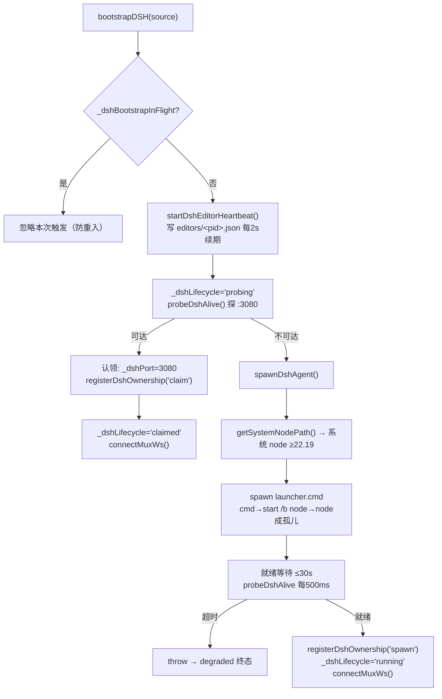

# DSH 与引擎集成架构

> **一句话定位**：把 DSH agent 变成**固定 `:3080` 的常驻服务**，编辑器只做「探测 → 认领 → 用」，并通过 `cache/dsh-runtime/` 下的文件协议表达多实例共享所有权。
>
> **什么时候会用到你**：排查「Agent 连不上 / 面板转圈 / 显示 Agent 故障」、理解编辑器启动为什么后台会多出一个 node 进程、多开时 agent 为什么只有一个、改 `electron/main.ts` 的引导/停机/重启逻辑。
>
> 代码位置：`electron/main.ts`（引导与停机）、`editor/dsh-agent-watcher.cjs`（所有权看门狗）、`src/editor/AgentService.ts`（renderer 连接）、`harness/ds-engine-tools/`（引擎侧插件）

**关键心智模型**：**agent 不是编辑器的子进程**。它经 `scripts/dsh-agent-launcher.cmd` 的 `start /b` 变成孤儿进程，所以编辑器崩溃、刷新、HMR 都不影响它。代价是拿不到 `child.on('exit')`，于是「生死判定」改成 RPC 探测、「所有权」改成磁盘文件协议（见 §2.3）。工程总览见 [harness_system.md](./harness_system.md)，插件 junction 安装见 [dsh_plugin_install.md](./dsh_plugin_install.md)。

---

## 1. 先记住这几个文件

| 文件 | 一句话职责 | 你要改它的场景 |
|---|---|---|
| [main.ts](../../electron/main.ts) | agent 引导主人：`bootstrapDSH` 探测/认领/spawn、停机注销、mux WS 桥、手动与 MCP 重启 | 改端口/超时/启动参数，或加 DSH IPC 通道 |
| [dsh-agent-watcher.cjs](../../editor/dsh-agent-watcher.cjs) | 所有权看门狗：巡检编辑器心跳，全消失且宽限期满才收割 agent | 改孤儿宽限策略、心跳过期阈值 |
| [AgentService.ts](../../src/editor/AgentService.ts) | renderer 客户端：`claiming→recovering→connecting` 三段连接 + 会话恢复 + 断档续听 | 改连接状态机、会话持久化、事件 fold |
| [engineContext.ts](../../harness/ds-engine-tools/src/engineContext.ts) | 引擎插件桥：兜底用 `DSH_ENGINE_PORT` 连编辑器 HTTP API | 插件调编辑器拿不到数据时查这里 |

---

## 2. agent 怎么常驻起来：从编辑器启动到 agent 可用

### 2.1 谁拉起了它

`startApp()` 在 MCP 服务启动后**后台异步**引导，`void` 故意不 await：

```ts
// 2. 启动 MCP HTTP API（多实例自动分配端口）
await startMCPServer()

// 3. DSH agent 常驻引导：探测 :3080 → 认领幸存实例 / spawn 新实例（后台异步，不阻塞编辑器启动）
void bootstrapDSH('startup')
```

> **为什么不 await**：冷启动最长要等 `DSH_SPAWN_READY_TIMEOUT_MS`（30s）。同步等待会让开屏窗口卡死。renderer 侧由 `AgentService.waitForAgentReady()` 自己轮询等（§3），两边解耦。

### 2.2 启动与认领



**① 防重入 + 心跳登记**

```ts
async function bootstrapDSH(source: string = 'startup'): Promise<void> {
  if (_dshBootstrapInFlight) return   // 防重入：忽略本次触发
  _dshBootstrapInFlight = true
  _dshShuttingDown = false
  try {
    startDshEditorHeartbeat()         // 先登记心跳，再探测
    _dshLifecycle = 'probing'
    const alive = await probeDshAlive()
```

`bootstrapDSH` 有 5 个调用方：`startup`（706 行）、`version-switch`（830 行）、`manual-restart`（869 行）、`mcp-restart`（1824 行）、`auto-restart`（627 行）。没有 `_dshBootstrapInFlight` 标记，一次冷启动里的多入口并发会叠出多个 spawn。心跳在探测**之前**启动，因为它是所有权的凭据——写 `editors/<pid>.json`（含 `pid`/`startedAt`/`heartbeatAt`），每 2s 续期。

**② 探测与认领 —— 幸存 agent 直接接管**

```ts
if (alive) {
  _dshPort = DSH_PORT_DEFAULT
  registerDshOwnership('claim')   // 幸存 agent → 认领
  _dshLifecycle = 'claimed'
  connectMuxWs()
  return
}
await spawnDshAgent()
```

探测走的是真实业务 RPC `POST /api/session.list`（超时 `DSH_PROBE_TIMEOUT_MS`），不是 TCP 探端口。**为什么探 `session.list` 而不是 `GET /`**：返回 200 就证明 HTTP 服务与会话层都活着，比探端口可靠得多；同时对 DSH 内核零假设，只依赖 renderer 也在用的同一套 RPC 协议。全部固定 `127.0.0.1`，agent 端口不暴露外网。

**③ 系统 Node 是硬要求**

```ts
function getSystemNodePath(): string {
  const candidates: string[] = []
  try {  // 候选来源 1：where/which node
    const cmd = process.platform === 'win32' ? 'where node' : 'which node'
    candidates.push(...execSync(cmd, { encoding: 'utf-8', timeout: 5000 }).trim()
      .split('\n').map((l) => l.trim()).filter(Boolean))
  } catch { /* 未找到，继续尝试注册表 */ }
  if (process.platform === 'win32') {  // 候选来源 2：三个注册表键覆盖 64 位 / 32 位 / 用户级
    for (const key of ['HKLM\\SOFTWARE\\Node.js', 'HKLM\\SOFTWARE\\WOW6432Node\\Node.js', 'HKCU\\SOFTWARE\\Node.js']) {
      try {
        const reg = execSync(`reg query "${key}" /v InstallPath`, { encoding: 'utf-8', timeout: 5000 })
        const m = reg.match(/InstallPath\s+REG_SZ\s+(.+)/)
        if (m) candidates.push(path.join(m[1].trim().replace(/\\$/, ''), 'node.exe'))
      } catch { /* 注册表键不存在，继续下一个 */ }
    }
  }
  const nodePath = candidates.find((p) => fs.existsSync(p))
  if (nodePath) return nodePath
  console.warn('[DSH] 无法找到系统 Node.js，将使用 Electron 内置 Node.js（可能版本不兼容）')
  return process.execPath
}
```

> **为什么必须用系统 Node**：DSH 要求 `^22.19.0 || >=24.0.0`，Electron 内置 Node 版本低于此，用它启动 agent 必然失败。
>
> **为什么要补查注册表**：Node 安装器写入的 `InstallPath` 常常不在 `PATH` 里（非默认安装或权限受限安装）。只靠 `where node` 会漏掉，退化到 `process.execPath` 后 agent 起不来。`restart-dsh.bat` 里重复了同一套探测逻辑，改动要两边同步。

**④ spawn —— 关键在 launcher 让 node 变孤儿**

```ts
const launcher = spawn('cmd.exe', ['/c', launcherPath,
  nodePath, cliPath, DSH_SOURCE_DIR, dshLogFile,
  isDev ? 'development' : 'production',
  String(MCP_API_PORT),          // 作为 DSH_ENGINE_PORT 注入，供引擎插件回连
], { cwd: DSH_SOURCE_DIR, stdio: 'ignore', windowsHide: true })
```

`dsh-agent-launcher.cmd` 的核心只有一行：`start "" /b "%NODE_PATH%" "%CLI_PATH%" --profile web --no-open > "%LOG_FILE%" 2>&1`。链路是 `cmd.exe → start /b node → cmd.exe 退出 → node 成为孤儿`，这样 vite-plugin-electron 的 `treeKillSync`（`taskkill /T /F`）杀编辑器时**杀不到 DSH**——这正是「HMR 不打断 agent」的实现基础。

就绪等待循环每 500ms 探一次 `probeDshAlive`，上限 `DSH_SPAWN_READY_TIMEOUT_MS`（30s）：

```ts
while (Date.now() < deadline) {
  if (_dshShuttingDown) return   // 停机触发，中止启动流程
  if (_dshPort === 0 && await probeDshAlive()) _dshPort = DSH_PORT_DEFAULT
  if (_dshPort !== 0) break
  await new Promise(r => setTimeout(r, 500))
}
if (_dshPort === 0) throw new Error(`agent 在 ${DSH_SPAWN_READY_TIMEOUT_MS}ms 内未就绪`)
```

launcher 用 `start /b` 是 fire-and-forget，stdio 也设了 `ignore`，所以**只能靠轮询 RPC 判断就绪**。循环里检查 `_dshShuttingDown`，让用户在 30s 等待窗口内关掉编辑器时能干净退出。

`registerDshOwnership(source)` 先取 `_dshChild?.pid`，取不到就用 `findDshAgentPidByPort` 走 `netstat -ano` 反查，最后 `writeDshOwner` 写 `owner.json`。反查失败时 `agentPid` 为 undefined 并只打 warn——少了它只是让精确 kill 退化成按端口收尾。引导失败不弹窗、不阻断编辑器其余功能，`catch` 里杀掉残留子进程后置 `_dshLifecycle = 'degraded'`，`finally` 复位 `_dshBootstrapInFlight`。

### 2.3 多实例共享一个 agent 的所有权协议

协议落在 `cache/dsh-runtime/`（已 gitignore）：`owner.json` 存 `{ port, agentPid, watchdogPid, claimedAt, source }`（main 写 / watcher 读并更新自身 `watchdogPid`），`editors/<pid>.json` 存 `{ pid, startedAt, heartbeatAt }`（每个编辑器实例只维护自己那份）。

> **为什么多实例要「认领」而不是各起一个**：`DSH_PORT_DEFAULT` 固定 `3080`，**不做递增**（与 MCP 的 9877+ 递增语义刻意相反）。第二个实例若也 spawn，就会端口冲突或出现两个割裂的会话空间。所以必须**先探测、再认领**；认领只是往 `owner.json` 登记自己，不抢锁，各实例仍是独立 session（见 §3）。

关掉一个编辑器实例而另一个还开着时，agent 必须继续服务。**优雅停机只注销自己，绝不杀 agent**（`stopDSHService`：`stopDshEditorHeartbeat()` + `disconnectMuxWs()` + 清 `_dshPort`）；收割是 watchdog 的专属权力，且前提是**全部**编辑器心跳消失。

**watchdog 的判定与收割**（[dsh-agent-watcher.cjs](../../editor/dsh-agent-watcher.cjs)）：`WATCH_INTERVAL_MS = 1000` 巡检间隔、`HEARTBEAT_STALE_MS = 6000` 心跳过期阈值（大于心跳周期 2s×3 以容忍抖动）、`AGENT_KILL_WAIT_MS = 8000` 自杀兜底。每轮巡检扫描心跳目录，有存活编辑器就把孤儿计数清零：

```js
const freshEditors = scanFreshEditors(now)
if (freshEditors.length > 0) { orphanMs = 0; continue }
orphanMs += WATCH_INTERVAL_MS

if (orphanMs >= graceMs) {
  await killTree(Number(owner.agentPid || 0))                          // 收割 agent 进程树
  try { fs.rmSync(path.join(stateDir, 'owner.json'), { force: true }) } catch { /* ignore */ }
  try { fs.rmSync(editorsDir, { recursive: true, force: true }) } catch { /* ignore */ }
  setTimeout(() => process.exit(0), AGENT_KILL_WAIT_MS).unref()        // 兜底确保退出
  process.exit(0)
}
```

`scanFreshEditors` 顺带清理两类文件：心跳超过 `HEARTBEAT_STALE_MS` 的，以及 `heartbeatAt` 新鲜但 `isPidAlive(pid)` 为假的（进程已死、文件没来得及清）。宽限 `graceMs` 由 `--grace-ms` 传入，main 侧对应 `DSH_OWNER_GRACE_MS = 30000`。

> **为什么要有 30s 宽限**：强杀编辑器后心跳文件没人清理，若立即收割，用户「关掉马上重开」就会丢掉整个 agent 和它的会话。30s 是「快速重开认领」的窗口。

### 2.4 崩溃自愈：代码在，但没有触发者

退避序列 2s→4s→8s→16s→32s（超时达 `DSH_AGENT_MAX_RESTARTS` 次置 `degraded` 终态），`.unref()` 让定时器不阻塞主进程退出——否则自愈等待期间编辑器关不掉：

```ts
const delay = Math.min(DSH_AGENT_RESTART_BASE_MS * Math.pow(2, _dshRestartCount), DSH_AGENT_RESTART_MAX_MS)
_dshRestartCount++
_dshLifecycle = 'restart-wait'
_dshRestartTimer = setTimeout(async () => {
  if (_dshShuttingDown) return
  try {
    await bootstrapDSH('auto-restart')
  } catch (err) {
    onDshChildExited(null)     // 以新一轮退出继续计数/终态判定
  }
}, delay)
_dshRestartTimer.unref?.()
```

> ⚠️ **规划中 / 未落地**：`onDshChildExited` 目前是**死代码**。它只在 630 行被自身递归调用，而设计上的入口——`_dshChild` 的 `exit` 回调——并不存在：`_dshChild` 在 27 行声明后**从未被赋值**（spawn 出来的是 `launcher`，不是 agent）。两个前置条件同时缺位：① agent 是孤儿进程，本来就没有 `exit` 回调可绑；② `probeDshAlive` 的 5 处调用全在「引导 / 手动重启 / MCP 重启」路径上，**没有周期性巡检**。因此当前 agent 崩溃后**不会自动重启**，`_dshLifecycle` 会停在 `running`。要让它生效，需补一个定期 `probeDshAlive` 巡检并在失活时调用本函数。

**degraded 的两条恢复路径**（都已落地）：`dsh-restart` IPC（面板手动，850 行）与 `dsh-restart` MCP 命令（1824 行，走 `mcp-restart`）逻辑一致——先按 `owner.agentPid` 杀旧进程，再 `stopDSHService()`，然后轮询等端口释放（上限 8s）后 `bootstrapDSH`。两者都先重置 `_dshRestartCount = 0` 与 `_dshShuttingDown = false`，因为 `stopDSHService` 会把后者置为 true，不重置后续引导会被抑制。

### 2.5 配置常量（真实值）

| 常量 | 值 | 位置与含义 |
|---|---|---|
| `DSH_PORT_DEFAULT` | `3080` | `main.ts:62` — 固定端口，**不做递增**（多实例共享） |
| `DSH_STATE_DIR` | `cache/dsh-runtime` | `main.ts:63` — 所有权协议目录（已 gitignore） |
| `DSH_EDITOR_HEARTBEAT_MS` | `2000` | `main.ts:64` — 编辑器心跳周期 |
| `DSH_OWNER_GRACE_MS` | `30000` | `main.ts:65` — 孤儿宽限：全清后 watcher 再等这么久才收割 |
| `DSH_PROBE_TIMEOUT_MS` | `1500` | `main.ts:66` — 探测 RPC 超时 |
| `DSH_SPAWN_READY_TIMEOUT_MS` | `30000` | `main.ts:67` — spawn 就绪上限 |
| `DSH_AGENT_MAX_RESTARTS` | `5` | `main.ts:68` — 自愈次数上限 |
| `DSH_AGENT_RESTART_BASE_MS` / `_MAX_MS` | `2000` / `60000` | `main.ts:69-70` — 自愈退避区间 |
| `WATCH_INTERVAL_MS` / `HEARTBEAT_STALE_MS` | `1000` / `6000` | `dsh-agent-watcher.cjs:27-28` — 巡检间隔 / 心跳过期阈值（> 心跳周期 2s×3） |

---

## 3. 会话恢复

触发条件只有一条：`AgentService.connect()` 走到阶段 2 且 localStorage 里存在映射。数据有两个来源，分工明确。

**数据来源 1：本地只存映射，不存内容**

`readSavedSession()` 从 localStorage 的 `SESSION_STORAGE_KEY`（`'demostudio.dsh.session'`）读回 `{ sessionId, port, savedAt }`。**不缓存消息体**——本地缓存会与远端 `session.history` 漂移，消息历史永远从远端 `loadHistory()` 分页 fold 拉回。

**数据来源 2：远端是单一可信源**

```ts
const saved = this.readSavedSession()
if (saved?.sessionId) {
  this.setState('recovering')
  try {
    if (await this.validateSession(saved.sessionId)) {
      this.setSession(saved.sessionId)     // 重置 seq 基线与实时缓冲
      this.setState('connected')
      this.emit({ type: 'ready', payload: { sessionId: this.sessionId, recovered: true, restored: true } })
      this.connectMux()
      this.resumePendingTurnIfNeeded()     // 断档续听
      return
    }
    this.clearPersistedSession()           // 会话已失效 → 清映射
  } catch (err) { /* 网络级错误也回退新建 */ }
}
```

校验方式是拉远端会话列表比对，且**网络级失败与「会话不存在」刻意区分**——`validateSession` 的 `catch` 里是 `throw err` 而非 `return false`，由调用方决定回退策略。

`setSession` 会一并重置实时流状态（`_lastSeq = -1`、`clearLiveBuffers()`、`pendingTools.clear()`）。**为什么必须清 `_lastSeq`**：seq 是去重游标，attach 旧会话时若沿用新会话基线，历史事件会被去重逻辑抑制掉，表现为「会话恢复了但历史一片空白」。

**断档续听**：刷新期间若最后一个回合尚未闭合，`resumePendingTurnIfNeeded()` 从 history 尾部**倒着**找回合边界——先遇 `turn/end` 说明已闭合无需续听，先遇 `turn/start` 说明有未闭合回合需要继续监听。续听前先 `refreshSeqBaseline()` 把基线推到远端最新 seq，所以不会回放已有事件。

恢复失败就回退新建（阶段 3）。新建时还有 preset 兜底：首次 `session.create` 失败则带 `agentPreset: 'cordis'` 重试——默认 preset 在 profile 里可能不存在，回退 DSH 自带的 `cordis` 保证不卡死。

---

## 4. 关键方法速查

| 方法 | 位置 | 干什么 | 注意 |
|---|---|---|---|
| `bootstrapDSH(source)` | `main.ts:640` | 引导入口：探测 → 认领 / spawn | `_dshBootstrapInFlight` 防重入；5 个 source |
| `probeDshAlive(port, timeoutMs)` | `main.ts:459` | POST `session.list` 探活 | 全链路 `127.0.0.1`；**无定期调用方** |
| `spawnDshAgent()` | `main.ts:499` | 经 launcher 拉起孤儿 agent | 失败 throw → 上层 degraded |
| `getSystemNodePath()` | `main.ts:77` | 找系统 Node（where + 3 个注册表键） | 与 `restart-dsh.bat` 逻辑重复，改动需同步 |
| `registerDshOwnership(source)` | `main.ts:596` | 反查 PID 写 `owner.json` | netstat 失败只 warn，退化为按端口收尾 |
| `writeDshEditorHeartbeat()` | `main.ts:426` | 写/续期 `editors/<pid>.json` | 2s 周期，watchdog 的判定依据 |
| `onDshChildExited(code)` | `main.ts:606` | 崩溃自愈调度（指数退避 ≤5 次） | ⚠️ 当前无触发者，未生效 |
| `stopDSHService()` | `main.ts:682` | 注销本实例心跳 | **不 kill agent**；会把 `_dshShuttingDown` 置 true |
| `connectMuxWs()` | `main.ts:901` | 连 `events.mux` 并广播渲染进程 | 断线 5s 自动重连 |
| `dsh-status` / `dsh-restart` IPC | `main.ts:841` / `850` | 状态查询 / degraded 手动重启 | 重启等端口释放上限 8s |
| `scanFreshEditors(now)` | `dsh-agent-watcher.cjs:92` | 扫心跳目录，清过期与死进程 | 返回空才是收割前提 |
| `waitForAgentReady()` | `AgentService.ts:422` | 轮询等 main 引导 | 浏览器模式直接返回默认端口 |
| `connect()` | `AgentService.ts:516` | 三段连接状态机 | 幂等，已连接直接 return |
| `validateSession(sessionId)` | `AgentService.ts:405` | 校验远端会话是否存在 | 网络错误 throw，不只是返回 false |
| `setSession(id)` | `AgentService.ts:377` | 绑会话 + 清 seq 基线/缓冲 | 不调用会导致历史事件被去重吃掉 |
| `resumePendingTurnIfNeeded()` | `AgentService.ts:447` | 断档续听补齐 | 倒序找 turn 边界 |

---

## 5. 流程影响：牵动哪些功能

### 上游：谁驱动它

| 上游 | 怎么驱动 | 相关文档 |
|---|---|---|
| 编辑器启动 | `startApp()` 内 `void bootstrapDSH('startup')` | [编辑器核心](../editor/core/core_system.md) |
| 版本切换 | `dsh-switch-version` → `stopDSHService()` → `bootstrapDSH('version-switch')` | [工程总览](./harness_system.md) |
| 面板手动重启 | `dsh-restart` IPC → `bootstrapDSH('manual-restart')` | [Agent 面板](../editor/integration/agent_panel_system.md) |
| MCP 命令 | `/api/command` 的 `dsh-restart` → `bootstrapDSH('mcp-restart')` | [MCP 集成](../editor/integration/mcp_integration.md) |
| 关窗退出 | `window-all-closed` → `stopDSHService()` → `process.exit(0)` | [编辑器核心](../editor/core/core_system.md) |

### 下游：它波及谁

| 下游功能 | 波及点 | 相关文档 |
|---|---|---|
| Agent 面板与会话 | `claiming/recovering/connecting` 状态机、会话恢复提示 | [Agent 面板](../editor/integration/agent_panel_system.md) |
| MCP 集成 | `MCP_API_PORT` 作为 `DSH_ENGINE_PORT` 注入 agent；`dsh-rpc`/`dsh-mux-*`/`dsh-respond` IPC 共用 `:3080` | [MCP 集成](../editor/integration/mcp_integration.md) |
| 引擎插件（ds-engine-tools） | 靠 `DSH_ENGINE_PORT` 回连编辑器 `/api/command`、`/api/status`、`/api/console-logs` | [插件安装](./dsh_plugin_install.md) |
| DSH 插件与数据飞轮 | agent 启动后按 profile patch 装载 ds-memory 等；ds-feedback / ds-experience 在 agent 进程内运行 | [插件安装](./dsh_plugin_install.md) / [数据飞轮](./dsh_data_flywheel_plan.md) |
| 日志系统 | `logs/dsh-agent.log` 由 `tailDshLog` 每秒回显到主进程控制台 | [编辑器核心](../editor/core/core_system.md) |

---

## 6. 踩坑清单

**1. agent 变成孤儿后拿不到 `exit` 回调** —— 现象：进程死了但回调从不触发。原因：`start /b` 让 node 脱离了 Electron 进程树。规则：改用 RPC 探针 `probeDshAlive` 检测存活。

**2. Electron 内置 Node 版本不够导致 agent 起不来** —— 现象：反复 spawn 失败、日志报 Node 版本错误。原因：DSH 要求 `^22.19.0 || >=24.0.0`。规则：必须走 `getSystemNodePath()`，且只查 `where node` 不够，必须补查三个注册表键。

**3. 多实例各自起一个 agent 会端口冲突** —— 现象：第二个实例又 spawn 一个，出现两个割裂会话空间。原因：`DSH_PORT_DEFAULT` 固定 `3080`，**不做递增**（与 MCP 9877+ 递增语义相反）。规则：先探测再认领，共享单 agent。

**4. 关掉一个编辑器实例把别人的 agent 杀了** —— 现象：多开时关掉一个，另一个面板立刻断连。原因：停机路径无条件 kill agent。规则：`stopDSHService()` 只注销本实例心跳，收割是 watchdog 的专属权力。

**5. 强杀编辑器后 agent 变孤儿常驻** —— 现象：agent 残留占着 `:3080`。原因：强杀不走 `window-all-closed`，心跳文件没人清理。规则：watchdog 巡检 `editors/`，6s 过期即扫除，全清后连续 30s 无新编辑器才 `taskkill`。

**6. `owner.json` 里可能没有 agent PID** —— 现象：无法精确 kill，只能按端口收尾。原因：`netstat -ano` 反查失败。规则：`registerDshOwnership` 失败只 warn，退化为按端口收尾。

**7. 自愈定时器不 unref 会让编辑器关不掉** —— 现象：自愈等待期间关闭编辑器，进程挂住。原因：未完的 `setTimeout` 保持事件循环存活。规则：`_dshRestartTimer.unref?.()`。

**8. 浏览器模式下 DSH 相关能力静默降级** —— 现象：面板不转圈但也没报错，实际没连上。原因：`window.electronAPI` 不存在，`waitForAgentReady` 直接返回默认端口。规则：这是自动降级而非错误，验证 agent 链路必须用 Electron 环境。

**9. 会话恢复是「尽力而为」，且恢复后可能历史空白** —— 前者：agent 重建后远端 session 不在存储里就 attach 不回去（DSH 不保证 session 落盘），失败自动清映射回退新建。后者：`setSession` 未重置 `_lastSeq`，旧基线导致历史事件被 dedupe 抑制。规则：每次 attach 必须走 `setSession()`。

**10. Taskkill 只在 win32 生效** —— 现象：Linux/macOS 上收割不干净。原因：`killProcessTree` 与 watcher 的 `killTree` 仅 Windows 走 `taskkill /T /F`，其他平台退化为 SIGTERM 单进程 kill。规则：跨平台进程树收割未承诺。

---

## 7. 边界条件

| 条件 | 行为 | 怎么应对 |
|---|---|---|
| 全局 DSH CLI 或 `dsh-agent-launcher.cmd` 缺失 | `spawnDshAgent()` throw → `degraded` 终态（不弹窗，编辑器其余功能正常） | 补齐后手动重启 |
| spawn 后 30s 未就绪 | throw → `degraded`；launcher 已退出，孤儿 agent 无法被本实例收割 | 查 `logs/dsh-agent.log`，手动重启 |
| agent 运行中崩溃 | ⚠️ 自愈**不会触发**（`onDshChildExited` 无调用方，见 §2.4），`_dshLifecycle` 停在 `running` | 手动重启；要修需补定期 `probeDshAlive` 巡检 |
| 自愈重试达 5 次 | 进入 `degraded` 终态并在控制台 error | 面板手动重启（IPC / MCP 两条路径） |
| 强杀后宽限期内重开 | 探测到幸存 agent → 认领成功，会话可恢复 | 自动 |
| 强杀后超过 30s 才重开 | watchdog 已收割 agent 与协议文件并自杀 → 冷启动新 agent | 冷启动 + 会话恢复（尽力而为） |
| 多实例同时运行 | 共享 `:3080` agent；各实例独立 session；先退出者仅注销自身心跳 | watcher 以「全部编辑器消失」为准 |
| 保存的 sessionId 已失效 / 校验时网络失败 | `validateSession` 返回 false 或 throw → 清映射 → 回退新建 | 自动 |
| renderer 等待期间 main 进入 degraded | `waitForAgentReady()` 抛 `AGENT_DEGRADED` → 面板 `degraded` 态 | 手动重启 |
| `owner.json` 连续 30s 读不到 / 写入失败 | 前者 watchdog 判定「无 agent 可守」自行退出；后者只 error 不中断引导 | 下次引导重建 |
| 浏览器调试模式（无 electronAPI） | RPC 走 Vite 代理直连 `:3080`；跳过 claiming 直接返回默认端口 | 自动降级，非错误 |
| 主窗口关闭 | 级联关闭 Agent 独立窗口，`window-all-closed` 触发 `stopDSHService()` + `process.exit(0)` | 自动 |
| 协议文件位置 | 仅落在 `<repo>/cache/dsh-runtime/`（已 gitignore） | 不提交到仓库 |
