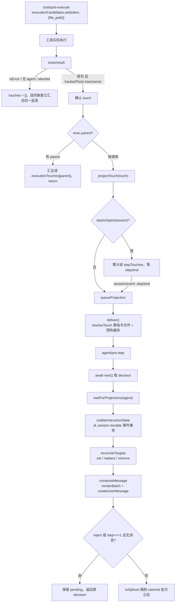

# ds-instructions 插件 PRD（修订版）

> **一句话定位**：`ds-instructions` 插件的产品需求文档——给 DemoStudio 补一套「路径前缀 → 目录指令文件」的映射机制，让 agent 读到 `src/engine/**` 下的文件后，下一次模型请求自动带上 `engine.instructions.md`。
>
> **什么时候会用到你**：实现或修改 `harness/ds-instructions/` 插件、确认某条生命周期/去重/安全规则该怎么定、写或跑该插件的测试用例、判断某个行为是 bug 还是设计。
>
> 代码位置：`harness/ds-instructions/src/`（实现）、`harness/ds-instructions/tests/`（测试）、`.dsh/instructions/`（指令文件）
>
> 文档状态：修订版 v0.2（修订历史与开放问题见 §9）

**关键心智模型**：本文档**既有规划也有实现**，两者必须分开读。§5「需求 ↔ 实现对照表」是核心：它逐条标注每条需求当前落地到哪一步。除 §5 标为「已实现」的条目外，其余条款**都是尚未落地的规划**，不要当成现状。

---

## 1. 先记住这几个文件

| 文件 | 一句话职责 | 你要改它的场景 |
|---|---|---|
| [index.ts](../../harness/ds-instructions/src/index.ts) | 插件入口：全部生命周期监听与状态边界 | 改注入时机、去重、并发语义 |
| [mapping.ts](../../harness/ds-instructions/src/mapping.ts) | 路径前缀 → 指令文件映射（最长前缀优先） | 加/改映射规则 |
| [frontmatter.ts](../../harness/ds-instructions/src/frontmatter.ts) | 从指令文件头部 `prefix:` 自动推导映射 | 新增指令文件后不想改 patch |
| [state.ts](../../harness/ds-instructions/src/state.ts) | session 可见状态、reconcile、set/replace/remove | 改去重与更新语义 |
| [config.ts](../../harness/ds-instructions/src/config.ts) | `projectRoot`/`instructionsDir`/预算配置与 schema | 加配置项 |
| [files.ts](../../harness/ds-instructions/src/files.ts) | 指令加载与缓存（版本+size 校验） | 改缓存策略、安全兜底 |
| [render.ts](../../harness/ds-instructions/src/render.ts) | 正文渲染、`<system-reminder>` 边界、字节预算 | 改注入正文措辞/截断策略 |

**当前指令目录实况**（`.dsh/instructions/`）：`engine.instructions.md`（`prefix: src/engine`）、`harness.instructions.md`（`prefix: harness`）、`global.instructions.md`（`prefix: /`）。默认映射里的 `project.instructions.md` **当前不存在**——读到 `src/projects/**` 不会注入任何指令（见 §5 FR-1）。

---

## 2. 一条目录指令怎么生效：从文件到 systemPrompt

### 2.1 谁加载了它

标准 Cordis 插件，靠 `name` + `inject` + `apply` 三件套被 DSH loader 加载（[index.ts:48](../../harness/ds-instructions/src/index.ts)）：

```ts
export const name = '@demostudio/ds-instructions'

/** 本插件访问的 Cordis 服务。logger 是 Context 内建能力不走 inject；fs 通过 ctx.get('fs') 运行时可选获取。 */
export const inject = ['tools', 'systemPrompt']
```

`inject` 里**只有两项**：`logger` 是 Context 内建属性，写进 `inject` 会让 boot 卡在 `pending (waiting for service: logger)`；`fs` 故意不静态声明，改在运行时 `ctx.get('fs')` 可选获取（[index.ts:120](../../harness/ds-instructions/src/index.ts)），这样没有 fs provider 的环境不会因注入失败而启动不了。

`apply` 第一行是短路开关，`enabled: false` 时**连 systemPrompt 段都不注册**：

```ts
export function apply(ctx: Context, config?: Partial<Config>): void {
  if (config?.enabled === false) return
  const resolved: ResolvedConfig = resolveConfig(config ?? {})
```

挂载三件事（`dist/index.js` + junction 让包名可解析 + patch `insert` 行）的机制见 [插件安装](./dsh_plugin_install.md)。两 profile 的 patch 都只写了 `projectRoot: 'E:/DemoStudio'`，**没写** `mappings`——映射全靠 frontmatter 自动扫描（§2.2 ①）。

### 2.2 映射链路



#### ① 映射从哪来：frontmatter 自动扫描（显式配置兜底）

指令文件自己声明前缀，插件扫一遍目录（[frontmatter.ts:32](../../harness/ds-instructions/src/frontmatter.ts)）：

```ts
export function parseFrontmatterPrefix(content: string): string | undefined {
  // 匹配 --- 包裹的 frontmatter 块（兼容 CRLF）
  const match = content.match(/^---\r?\n([\s\S]*?)\r?\n---/)
  if (!match?.[1]) return undefined
  const frontmatter = match[1]
  // 提取 prefix: value 行（值可能带引号）
  const prefixMatch = frontmatter.match(/^prefix:\s*['"]?([^'"\n\r]+)['"]?\s*$/m)
  if (!prefixMatch?.[1]) return undefined
  const value = prefixMatch[1].trim()
  return value.length > 0 ? value : undefined
}
```

这是**正则提取，不是 YAML 解析**——只认 `prefix:` 一个字段，不引第三方依赖。三个反直觉处：正则不校验 YAML 合法性，写错缩进不报错只静默返回 `undefined`；只扫指令目录下的 `*.instructions.md`（[frontmatter.ts:52](../../harness/ds-instructions/src/frontmatter.ts) 的 `entry.endsWith('.instructions.md')`）；**只读前 4096 字节**探测，frontmatter 必须在文件头部。

真实样例（`.dsh/instructions/engine.instructions.md`）：

```text
---
prefix: src/engine
---
# 引擎开发规范（ds-instructions 验证）
```

`prefix: /` 是**全局映射**，匹配项目根下一切路径。扫描结果与显式 `mappings` 合并时**显式优先**，同 prefix 不覆盖（[config.ts:215](../../harness/ds-instructions/src/config.ts)）；自动扫描的 `order` 从 1000 起跳，保证同长度前缀时显式声明排在前面。

#### ② 路径前缀怎么匹配：段级最长前缀，不是 includes

映射在解析期就被拆成「路径段数组」并按段数倒序排好（[config.ts:143](../../harness/ds-instructions/src/config.ts)）：

```ts
  // 最长前缀优先（段数多者优先），全局（0 段）自然垫底；同长按声明顺序
  return resolved.sort((a, b) =>
    b.segments.length - a.segments.length || a.order - b.order,
  )
```

匹配时按段逐个比（[mapping.ts:37](../../harness/ds-instructions/src/mapping.ts)）：

```ts
export function matchMapping(relPath: string, mappings: readonly ResolvedMapping[]): ResolvedMapping | undefined {
  const segments = relPath.split(/[\\/]+/).filter(segment => segment.length > 0)
  for (const mapping of mappings) {
    if (segments.length < mapping.segments.length) continue
    const ok = mapping.segments.every((segment, index) =>
      pathCompareKey(segments[index]!) === pathCompareKey(segment),
    )
    if (ok) return mapping
  }
  return undefined
}
```

三个反直觉处。**第一**，比的是**段数组**而非字符串前缀：`src/engine2/a.ts` 的段是 `['src','engine2','a.ts']`，第 2 段 `engine2 !== engine`，不会误命中——用 `includes` 就会错。**第二**，mappings 已按段数倒序排好，遇到第一个 `ok` 即可 `return`，这就是「最长前缀优先」的全部实现。**第三**，全局映射是空段数组：`segments.length < 0` 恒假、`every` 对空数组恒真，所以它匹配一切，且排序时自然垫底，只在无具体前缀命中时兜底。Windows 上 `pathCompareKey` 转小写比较，是平台一致化而非 bug。

#### ③ 路径规范化与越界拦截

工具参数的 `file_path` 先规范化（[mapping.ts:19](../../harness/ds-instructions/src/mapping.ts)）：

```ts
export function normalizeTouchedPath(root: string, rawPath: unknown): string | undefined {
  if (typeof rawPath !== 'string') return undefined
  const trimmed = rawPath.trim()
  if (trimmed.length === 0) return undefined
  const absolute = resolve(root, trimmed)
  return containedRelative(root, absolute)
}
```

`resolve(root, trimmed)` 同时吃相对路径、绝对路径和 Windows `\`——相对路径基于 `projectRoot` 解析，**不是** `process.cwd()`。越界判定在 `containedRelative`（[config.ts:175](../../harness/ds-instructions/src/config.ts)）：`relative()` 结果以 `..` 开头或为绝对路径（跨盘）即返回 `undefined`，调用方静默跳过。

#### ④ 指令文件路径与 scope 编码

命中后拼绝对路径并算 scope（[mapping.ts:79](../../harness/ds-instructions/src/mapping.ts)）：

```ts
  const absolutePath = resolve(resolved.instructionsDir, instructionFile)
  // scope 与官方 candidateScopeKey 同构：<相对目录>\u0000<文件名>，
  // 让官方 agent-instructions 共存时把我们的 scope 探测到同一个文件（digest 一致 → 静默）
  const displayPath = `${resolved.instructionsDisplayDir}/${instructionFile}`
  return { absolutePath, displayPath, scope: `${resolved.instructionsDisplayDir}\u0000${instructionFile}` }
```

scope 里的 `\u0000` 分隔符是为了和官方 `dsh-agent-instructions` 的 `candidateScopeKey` 同构。官方 reconcile 时会把我们的 scope 当普通指令 scope 探测同名文件，digest 一致就静默，双方状态互不覆盖——刻意设计，不是巧合。

### 2.3 注入与生效

**systemPrompt 段在 `apply` 里注册一次，内容是常量**（[index.ts:84](../../harness/ds-instructions/src/index.ts)）：

```ts
  ctx.systemPrompt.section({
    name: SECTION_NAME,
    order: SECTION_ORDER,
    text: SECTION_TEXT,
  })
```

`SECTION_ORDER = 3300`（[index.ts:58](../../harness/ds-instructions/src/index.ts)），排在 ds-experience(3000) / ds-feedback(3100) / ds-memory(3200) 之后。`text` 是**静态字符串**而非函数——对比 ds-feedback 传 `text: (assembly) => {...}` 每步重算的写法，本插件的段每步都一样，因为它只是一句「可能有目录指令，遵循它」的宣告，具体内容靠 user message 注入。

真正的注入在 `agent/pre-step`（[index.ts:308](../../harness/ds-instructions/src/index.ts)）。先 `await next()` 拿到下游 decision 并保留其字段，再 splice 进消息批次：

```ts
      const lastClaimedIndex = decision.messages.findLastIndex(message => messages.includes(message))
      const entered = decision.messages.toSpliced(lastClaimedIndex + 1, 0, desired)
      return { ...decision, messages: entered }
```

`lastClaimedIndex + 1` 就是「用户输入之后、运行时 context 之前」。用 `toSpliced`（返回新数组）而非 `splice`，是为了不改动下游插件持有的同一个数组引用。

**最关键的一处反直觉**：注入成功后**不清 pending**（[index.ts:359](../../harness/ds-instructions/src/index.ts) 的注释写明「durable 落地前的注入是『临时的』」）。消息进 decision 只是进了这一次请求，还没写进 session durable 事件；只有落进 durable，下一次 `visibleInstructionState` 才看得见它并抑制重复注入。所以每步都重新对账，写失败就下一步重试，这叫自愈。

---

## 3. 背景与目标

DemoStudio 的规范散落在 `doc/` 与 `.github/instructions/` 下，agent 只有主动去查才看得到。通行做法是让工作区指令「跟着文件走」：读到哪个目录的文件，就把哪个目录的规范自动带进上下文。

DSH 官方的 `@deepseek-ai/dsh-agent-instructions` 已解决 `AGENTS.md` / `CLAUDE.md` 这类通用工作区指令的发现、注入、去重与生命周期（含 session、压缩、版本、并发、持久化），但它不认 `.dsh/instructions/*.instructions.md` 这套 DemoStudio 专用目录指令，也不做「按被读文件路径选指令」的映射。因此本插件只**补上映射这一件事**，其余生命周期必须对齐官方的顺序与状态语义——官方已解决的问题不能因为文件名规则更简单就省略。

**能力范围**：官方 `agent-instructions` 管 `AGENTS.md` / `CLAUDE.md` 通用工作区指令，本插件管 `.dsh/instructions/*.instructions.md` 的 DemoStudio 专用目录指令。两者可以同时挂载，但**不读取同一文件、不互相覆盖对方状态**。

**成功标准（12 条）**：

1. Agent 成功读取 `src/engine/Entity.ts` 后，下一次模型请求包含 `engine.instructions.md`。
2. Agent 成功读取 `src/projects/snake/SnakePawn.ts` 后，下一次模型请求包含 `project.instructions.md`。
3. 同一 session 中，同一指令文件且内容 digest 未变化时只注入一次。
4. 指令文件内容发生变化后，下一次相关文件读取会注入更新后的内容。
5. 不同 Agent 或不同 session 的去重状态互不影响。
6. 文件不存在、路径无法解析、读取失败或工具执行失败时，不影响原始工具执行。
7. ContextCard 能显示注入内容，并显示指令来源与指令文件路径。
8. Agent 重启、session 恢复和上下文压缩后，指令状态仍然正确。
9. 指令文件修改、删除或替换后，模型能收到对应的更新或移除通知。
10. 并发工具、嵌套工具和 step 边界不会造成重复、乱序或错误注入。
11. 指令文件读取遵循 DSH `ctx.fs` 的路径、沙箱和版本策略。
12. 指令消息具备大小限制、版本校验和 durable message 记录。

**非目标**：不修改 DSH 源码；不修改 `ds-memory`、`ds-engine-tools` 或官方 `dsh-agent-instructions` 源码；不解析 `.github/instructions/*.md` 的 `applyTo` glob，也不解析 frontmatter `paths` 条件；不监听 shell 命令中的目录变化（只跟踪结构化文件工具调用）；不修改工具参数与工具结果；不把指令内容追加到当前工具结果，只在后续模型请求前作为 user message 注入。

---

## 4. 术语表

| 术语 | 含义 |
|---|---|
| 目录指令 / frontmatter 映射 | `.dsh/instructions/*.instructions.md` 下的专用规范文件；头部 `---` 块里的 `prefix:` 声明由插件自动扫描，免除手工维护 patch |
| 路径前缀映射 / 全局映射 | `prefix`（项目根相对路径段）→ 指令文件名，最长段级前缀优先；`prefix: /` 段数组为空，匹配一切路径，兜底 |
| touch / execution token | touch = 一次成功的被跟踪文件读取（注入的唯一触发源）；token 带 `parent` 关系，嵌套 touch 沿 parent 向外层汇总 |
| projection / durable surface | projection = 把 touch 换算成待投递目标并预热缓存（同 Agent 串行）；surface = `session.surface.nodes`，去重的唯一权威 |
| digest / set·replace·remove | digest = 内容 SHA-1，变化即允许再次注入；三种迁移 = 首次出现 / 新替代旧 / 已删除或不再适用 |
| scope / projectRoot / inbox | scope = `<指令目录>\u0000<文件名>`（与官方 `candidateScopeKey` 同构）；projectRoot 是解析与越界判定基准；inbox 是官方暂存机制，本插件改用 Agent 级 WeakMap |

---

## 5. 需求 ↔ 实现对照表

判定标准：能在 `harness/ds-instructions/` 下 grep 到实现代码 = 已实现；只有规划无代码 = 未实现。

| 编号 | 需求摘要 | 落地状态 | 源码证据 |
|---|---|---|---|
| FR-1 | `src/engine` → `engine.instructions.md`，`src/projects` → `project.instructions.md` | **部分实现** | 默认映射在 [config.ts:11](../../harness/ds-instructions/src/config.ts)；但 `.dsh/instructions/` 下**无** `project.instructions.md`，后半条与成功标准 2 当前不成立 |
| FR-2 | 路径前缀最长匹配优先，`src/engine2` 不得匹配 `engine` | 已实现 | `matchMapping` 段级比较 [mapping.ts:37](../../harness/ds-instructions/src/mapping.ts) + 段数倒序 [config.ts:143](../../harness/ds-instructions/src/config.ts) |
| FR-3 | 路径规范化：相对/绝对/`\`、`..` 越界拒绝、平台一致比较 | 已实现 | `normalizeTouchedPath` [mapping.ts:19](../../harness/ds-instructions/src/mapping.ts)、`containedRelative` [config.ts:175](../../harness/ds-instructions/src/config.ts)、`pathCompareKey` [config.ts:117](../../harness/ds-instructions/src/config.ts) |
| FR-4 | 不把 `process.cwd()` 固定当项目根，支持 `projectRoot`/`instructionsDir` 显式配置 | 已实现 | `resolveSessionConfig` [state.ts:41](../../harness/ds-instructions/src/state.ts)；两 profile patch 均写了 `projectRoot: 'E:/DemoStudio'` |
| FR-5 | frontmatter `prefix:` 自动扫描，免除手工维护 patch | 已实现（`DEFAULT_AUTO_SCAN = true`） | `scanFrontmatterMappings` [frontmatter.ts:52](../../harness/ds-instructions/src/frontmatter.ts)、`mergeMappingRules` [config.ts:215](../../harness/ds-instructions/src/config.ts) |
| FR-6 | `prefix: /` 全局映射，第一步自动注入无需等文件读取 | 已实现 | [index.ts:325](../../harness/ds-instructions/src/index.ts) `step === 1 && !globalInjected.has(agent)`；`global.instructions.md` 用 `prefix: /` |
| FR-7 | 只跟踪 `read`/`read_image`，`write`/`edit` 默认关闭 | 已实现 | `DEFAULT_TRACKED_TOOLS` [config.ts:17](../../harness/ds-instructions/src/config.ts) |
| FR-8 | `tools/pre-execute` 只登记候选，不确认成功 | 已实现 | [index.ts:165](../../harness/ds-instructions/src/index.ts) 写入 `executionCandidates` |
| FR-9 | 仅 `tools/result` 成功时确认 touch；失败/取消/拒绝不注入 | 已实现 | [index.ts:183](../../harness/ds-instructions/src/index.ts) `result.isError \|\| agent === undefined \|\| signal.aborted` |
| FR-10 | 嵌套工具通过 `parent` token 向外层汇总，外层失败整体丢弃 | 已实现 | [index.ts:196](../../harness/ds-instructions/src/index.ts) `exec.parent !== undefined` 分支 |
| FR-11 | 打开的 step 内只累计 touch，`step/end` 后投影 | 已实现 | `session/event` 监听 [index.ts:216](../../harness/ds-instructions/src/index.ts)、`stepIsOpen` [index.ts:233](../../harness/ds-instructions/src/index.ts) |
| FR-12 | 同一 Agent 的 projection 串行化，并发合并后再 reconcile | 已实现 | `queueProjection` [index.ts:257](../../harness/ds-instructions/src/index.ts)、`projectionTails` [index.ts:101](../../harness/ds-instructions/src/index.ts) |
| FR-13 | `agent/pre-step` 先 `await next()` 并等待未完成 projection | 已实现 | [index.ts:312](../../harness/ds-instructions/src/index.ts) `const decision = await next()`、[index.ts:314](../../harness/ds-instructions/src/index.ts) `await waitForProjections(agent)` |
| FR-14 | 去重维度 `session + instructionPath + contentDigest` | 已实现 | `visibleInstructionState` [state.ts:85](../../harness/ds-instructions/src/state.ts) + digest 比对 [state.ts:194](../../harness/ds-instructions/src/state.ts) |
| FR-15 | 状态从 session durable 事件重新推导，不把 WeakMap 当持久状态 | 已实现 | `visibleInstructionState` 遍历 `session.events` 并用 `surface.nodes` 过滤可见性 [state.ts:90](../../harness/ds-instructions/src/state.ts) |
| FR-16 | durable 写入前不提交「已注入」状态 | 已实现 | 注入后不清 pending [index.ts:359](../../harness/ds-instructions/src/index.ts)；只在无迁移时结算 [index.ts:356](../../harness/ds-instructions/src/index.ts) |
| FR-17 | set / replace / remove 三种语义 | 已实现 | `reconcileTargets` [state.ts:153](../../harness/ds-instructions/src/state.ts)；措辞在 `render.ts` 的 `SET_INTRO`/`REPLACE_INTRO`/`REMOVE_INTRO` |
| FR-18 | 指令文件修改/删除离线也能被发现（对账时） | 已实现 | `visibleTargets` 把可见路径补进对账目标 [state.ts:119](../../harness/ds-instructions/src/state.ts) |
| FR-19 | 消息用 `createUserMessage` + 官方 `agent-instructions` source contract | 已实现 | `composeMessage` [index.ts:297](../../harness/ds-instructions/src/index.ts)；scope 编码 [mapping.ts:88](../../harness/ds-instructions/src/mapping.ts) |
| FR-20 | 字节预算 `maxSourceBytes`/`maxMessageBytes`，UTF-8 安全截断 | 已实现 | 默认 262144/65536 [config.ts:20](../../harness/ds-instructions/src/config.ts)；`renderBatch` 二分截断 [render.ts:102](../../harness/ds-instructions/src/render.ts)、`truncateUtf8` [render.ts:36](../../harness/ds-instructions/src/render.ts) |
| FR-21 | `<system-reminder>` 边界，正文里的闭合标记转义 | 已实现 | `escapeFrameBody` [render.ts:45](../../harness/ds-instructions/src/render.ts) |
| FR-22 | systemPrompt 段注册（name/order/text），`logger` 不进 `inject` | 已实现 | [index.ts:84](../../harness/ds-instructions/src/index.ts)、`SECTION_ORDER = 3300` [index.ts:58](../../harness/ds-instructions/src/index.ts) |
| FR-23 | `ctx.effect` 清理所有副作用 | 已实现 | [index.ts:113](../../harness/ds-instructions/src/index.ts) abort lifecycle + clear 两个 Map |
| FR-24 | 优先 `ctx.fs`，provider 缺席时限定的 Node 兜底 + containment | 已实现 | `currentFs` [index.ts:120](../../harness/ds-instructions/src/index.ts)、`createNodeFallbackAccess` [files.ts:207](../../harness/ds-instructions/src/files.ts)、`nodeContained` realpath 校验 |
| FR-25 | 缓存按版本+size 判定，命中不重读 | 已实现 | `loadInstruction` [files.ts:252](../../harness/ds-instructions/src/files.ts)；Node 兜底版本为 `mtime:${info.mtimeNs}` |
| FR-26 | pre-step reject / 空第一步保留 pending 不丢 | 已实现 | [index.ts:351](../../harness/ds-instructions/src/index.ts) |
| FR-27 | ContextCard 显示指令来源与文件路径（前端无需改动） | 已实现（前端侧） | `describeContextSource` 对 `kind === 'agent-instructions'` 取 `changes[].path` 作 label，[AgentService.ts:1976](../../src/editor/AgentService.ts) |
| FR-28 | 插件来源 `{ kind: 'plugin', plugin: ... }` 备选契约 | 未实现（仓库无代码） | 实现只走 `kind: 'agent-instructions'`（[types.ts:28](../../harness/ds-instructions/src/types.ts)），无 plugin 分支 |
| FR-29 | `mappings` 显式配置在 patch 里维护 | 未启用（代码支持但未使用） | schema 支持 [config.ts:58](../../harness/ds-instructions/src/config.ts)，两 profile patch 均未写 `mappings`，全靠 frontmatter 扫描 |
| FR-30 | 集成测试与 ContextCard 回放测试全部通过 | 部分实现 | 测试文件 6 个共 83 个用例；本次运行环境 `harness/ds-instructions/node_modules` 为空，`@deepseek-ai/cordis` 等无法解析，仅 `render.test.ts`（13 个）可跑通 |
| FR-31 | 真机冒烟：headless profile 跑通端到端注入 | 未验证 | 当前机器 `~/.dsh/profiles/{web,headless}/node_modules/@demostudio/` 目录不存在，junction 未挂载 |

**汇总**：31 条需求中已实现 22 条、部分实现 3 条（FR-1、FR-30、FR-31）、未启用 1 条（FR-29）、未实现 1 条（FR-28）。

---

## 6. 关键方法速查

| 方法 | 位置 | 干什么 | 注意 |
|---|---|---|---|
| `apply(ctx, config)` | [index.ts:79](../../harness/ds-instructions/src/index.ts) | 插件入口，注册全部生命周期 | `enabled === false` 时直接 return，连 section 都不注册 |
| `tools/pre-execute` 监听 | [index.ts:165](../../harness/ds-instructions/src/index.ts) | 登记 execution token 与候选路径 | 不确认成功；只取 `file_path` |
| `tools/result` 监听 | [index.ts:178](../../harness/ds-instructions/src/index.ts) | 确认 touch、嵌套向 parent 汇总 | 失败/取消时把已汇总的嵌套 touch 一起丢弃 |
| `session/event` 监听 | [index.ts:216](../../harness/ds-instructions/src/index.ts) | step 边界处理 | `step/end` 与 `turn/end` 都关闭 step |
| `stepIsOpen(session)` | [index.ts:233](../../harness/ds-instructions/src/index.ts) | 判断 durable step 是否打开 | 无缓存时回放 `session.events` 推导 |
| `queueProjection(agent, touch)` | [index.ts:257](../../harness/ds-instructions/src/index.ts) | 同 Agent projection 串行化 | 靠 `projectionTails` 链 Promise |
| `deliver(agent, touches)` | [index.ts:275](../../harness/ds-instructions/src/index.ts) | 算指令文件 + 预热缓存 | 不在此提交任何 session 状态 |
| `agent/pre-step` 监听 | [index.ts:308](../../harness/ds-instructions/src/index.ts) | 对账 + 注入 | 先 `await next()`；注入成功后不清 pending |
| `composeMessage(changes)` | [index.ts:297](../../harness/ds-instructions/src/index.ts) | 渲染 + `createUserMessage` | 空 text 或空 changes 返回 undefined |
| `resolveMappings(rules)` | [config.ts:126](../../harness/ds-instructions/src/config.ts) | 解析映射并按最长前缀排序 | 空数组视为未配置，回落 `DEFAULT_MAPPINGS` |
| `bindRootConfig(...)` | [config.ts:188](../../harness/ds-instructions/src/config.ts) | 绑定项目根为运行时配置 | 指令目录越界或映射为空 → 返回 undefined 整体禁用 |
| `normalizeTouchedPath(root, rawPath)` | [mapping.ts:19](../../harness/ds-instructions/src/mapping.ts) | 路径规范化 | 相对路径基于 projectRoot 解析 |
| `matchMapping(relPath, mappings)` | [mapping.ts:37](../../harness/ds-instructions/src/mapping.ts) | 段级最长前缀匹配 | mappings 必须已按段数倒序排好 |
| `instructionPaths(resolved, file)` | [mapping.ts:79](../../harness/ds-instructions/src/mapping.ts) | 算绝对路径/displayPath/scope | scope 含 `\u0000` 分隔符，与官方同构 |
| `scanFrontmatterMappings(dir, ...)` | [frontmatter.ts:52](../../harness/ds-instructions/src/frontmatter.ts) | 扫描目录推导映射 | 只扫 `*.instructions.md`，只读前 4096 字节 |
| `visibleInstructionState(agent, ...)` | [state.ts:85](../../harness/ds-instructions/src/state.ts) | 从 durable 事件推导可见状态 | 用 `surface.nodes` 过滤，压缩后自动失效 |
| `reconcileTargets(...)` | [state.ts:153](../../harness/ds-instructions/src/state.ts) | 产出 set/replace/remove | probe `unavailable` 时保留最后已知状态，不发 remove |
| `loadInstruction(access, cache, ...)` | [files.ts:252](../../harness/ds-instructions/src/files.ts) | probe + 缓存 + 读取 | 版本与 size 都一致才命中缓存 |
| `createNodeFallbackAccess(root)` | [files.ts:207](../../harness/ds-instructions/src/files.ts) | Node 受限兜底 | realpath 后必须仍在项目根内 |
| `renderBatch(items, maxBytes)` | [render.ts:102](../../harness/ds-instructions/src/render.ts) | 渲染合并消息 + 预算 | 整体超限时**从最前段开始整段省略** |

验证命令（`harness/ds-instructions` 目录下）：

```bash
npm run build     # tsc → dist/
npm test          # vitest：6 个文件 83 个用例
npm run lint      # oxlint src tests
```

---

## 7. 流程影响：牵动哪些功能

### 上游：谁驱动它

| 上游 | 怎么驱动 | 相关文档 |
|---|---|---|
| DSH 工具执行 | `tools/pre-execute` / `tools/result` 事件驱动整条注入链路 | [插件安装](./dsh_plugin_install.md) |
| 插件挂载（junction + patch） | 三者是「与」关系，少任何一样插件静默不存在 | [插件安装](./dsh_plugin_install.md) |
| profile patch 配置 | `projectRoot` 决定相对路径解析基准与越界判定 | [插件安装](./dsh_plugin_install.md) |
| `.dsh/instructions/*.md` | frontmatter 的 `prefix:` 决定映射表内容 | [Harness 工程](./harness_system.md) |
| 用户 slash 命令触发的读取 | 命令内部读文件也会产生 touch 并触发注入 | [Slash 命令系统](./slash_command_system.md) |

### 下游：它波及谁

| 下游功能 | 波及点 | 相关文档 |
|---|---|---|
| 模型请求消息 | 指令作为 durable user message 插到 claimed 批次之后 | [DSH 引擎集成](./dsh_engine_integration.md) |
| system prompt 装配 | 本插件 section order 3300，排在 memory(3200) 之后 | [数据飞轮计划](./dsh_data_flywheel_plan.md) |
| ContextCard 展示 | `kind: 'agent-instructions'` 时取 `changes[].path` 作卡片标签 | [Agent 面板](../editor/integration/agent_panel_system.md) |
| 官方 `agent-instructions` | 共存：scope 编码同构，digest 一致时官方静默，状态互不覆盖 | [插件安装](./dsh_plugin_install.md) |
| ds-memory / ds-feedback / ds-experience | 同挂 `agent/pre-step`，各自 `await next()` 保留 `startsRequestSeries` | [数据飞轮计划](./dsh_data_flywheel_plan.md) |
| harness 插件开发 | `harness.instructions.md` 由本插件在读 `harness/**` 时注入 | [Harness 工程](./harness_system.md) |

---

## 8. 踩坑清单

1. **在 `tools/pre-execute` 里就认定读取成功** —— 现象：工具被拒绝/取消后仍注入了指令。原因：`pre-execute` 发生在执行前。规则：只登记 execution token 与候选路径，**只在 `tools/result` 且 `!isError && agent 存在 && !signal.aborted` 时**确认 touch（[index.ts:183](../../harness/ds-instructions/src/index.ts)）。
2. **用字符串 `includes` 做路径匹配** —— 现象：`src/engine2/a.ts` 错误匹配到 `engine`。原因：字符串包含无法区分段边界。规则：拆成路径段数组逐个比，且 mappings 按段数倒序排好，命中即返回。
3. **把 `process.cwd()` 当项目根** —— 现象：编辑器拉起 agent 时 cwd 是 `harness/dsh-source`，指令文件全部找不到。规则：`projectRoot` 必须在 patch 里用**绝对路径**钉死；未配置才回退 session cwd 的 `.git` 向上探测（[state.ts:65](../../harness/ds-instructions/src/state.ts)）。
4. **用 `WeakSet<Agent>` 判断是否已注入** —— 现象：Agent 重建或 session 恢复后重复注入，或压缩后指令永久丢失。原因：WeakMap/WeakSet 是内存态，Agent 一销毁就没了。规则：去重至少用 `session + instructionPath + contentDigest`，状态永远从 durable 事件重新推导。
5. **durable 写入失败却先提交了「已注入」** —— 现象：模型从未看到指令，但后续永久跳过。规则：注入后**不清 pending**（[index.ts:359](../../harness/ds-instructions/src/index.ts)），下一步重新对账自动重试。
6. **嵌套工具在子结果阶段就注入** —— 现象：`run_code` 内部读取文件后，外层还没执行完就注入了。原因：未处理 `parent` 关系。规则：嵌套 touch 汇总到 `executionTouches[exec.parent]` 后 `return`，只在外层完成时投影；外层失败时子调用成功也不注入。
7. **在打开的 step 内直接改 decision** —— 现象：当前输入被抢占，指令乱序。规则：打开的 step 内只累计进 `stepTouches`，`step/end` 后再投影，且同 Agent 串行。
8. **把 `logger` 写进 `inject`** —— 现象：boot 报 `pending (waiting for service: logger)`。原因：logger 是 Context 内建属性，不是可注入服务键。规则：`inject = ['tools', 'systemPrompt']`，日志用 `ctx.logger('ds-instructions')`（[index.ts:90](../../harness/ds-instructions/src/index.ts)）。
9. **只改了 `harness/profile` 却发现不生效** —— 现象：patch 改了但插件行为没变。原因：实际运行的是 `~/.dsh/profiles/{web,headless}`。规则：挂载前先确认哪套 profile 生效，两边都要建 junction 与 patch 行。
10. **用 Node `fs` 兜底时绕过了沙箱** —— 现象：能读到项目根之外的指令文件。原因：Node `fs` 不继承 `ctx.fs` 的沙箱策略。规则：Node 兜底必须 `realpath` 后做 containment，断链视为不存在、指向项目外的链接拒绝读取（[files.ts:109](../../harness/ds-instructions/src/files.ts)）。
11. **frontmatter 写了却没生效** —— 现象：新增指令文件后读对应目录不注入。三个原因逐一排查：文件名不以 `.instructions.md` 结尾；`prefix:` 不在文件头部前 4096 字节内；该 prefix 已被显式 `mappings` 占用（显式优先，自动扫描不覆盖）。
12. **默认映射指向的文件不存在** —— 现象：读了 `src/projects/**` 却毫无反应且不报错。原因：`.dsh/instructions/` 下没有 `project.instructions.md`。规则：新增映射前先确认指令文件已创建，否则是静默无操作。

---

## 9. 修订历史与开放问题

### 修订历史

| 版本 | 日期 | 变更 |
|---|---|---|
| v0.1 | 初稿 | 确立路径前缀映射、官方生命周期对齐、durable 去重、set/replace/remove 语义 |
| v0.2 | 修订版 | 补齐 frontmatter 自动扫描与全局映射（`prefix: /`）；明确 Node 兜底与 `ctx.fs` 的沙箱差异；补充嵌套/并发/step 边界的测试矩阵 |

### 开放问题

1. **外层失败是否丢弃嵌套成功读取**：当前实现与官方插件语义相反（官方保留嵌套成功）。PRD §14.3 要求丢弃，实现按 PRD 执行。若与未来官方行为冲突需重新决策。
2. **投影产物不进 inbox**：PRD §7.5 描述为「reconcile Agent inbox 与 session surface」，实现改为 reconcile「Agent 级 pending 目标集 + 可见 surface」，以避开官方 `syncInbox` 的 inbox 所有权冲突。是否长期维持此差异未决。
3. **插件来源契约是否启用**：`{ kind: 'plugin', plugin: ... }` 备选方案未实现，路径/digest/替换语义无法承载，需先扩展 source contract 才能启用。
4. **相同内容不同路径是否合并**：按明确的产品规则验证，不能隐式决定。
5. **空指令文件的处理**：不注入还是生成空指令消息，未定。当前实现按 `content.trim().length > 0` 判定为不注入。
6. **显式 `mappings` 与 frontmatter 的长期分工**：当前 patch 里不写 `mappings`，全部依赖扫描。是否需要在 patch 里保留一份兜底未决。

---

## 10. 边界条件

| 条件 | 行为 | 怎么应对 |
|---|---|---|
| 工具无 `file_path` 或不是字符串 | 静默跳过 | 无需处理 |
| 非 `trackedTools` 内的工具 | 静默跳过（默认只 `read`/`read_image`） | 在 patch 里显式加 `trackedTools` |
| 路径越过 projectRoot（`..`、跨盘） | `containedRelative` 返回 undefined，静默跳过 | 检查 `projectRoot` 是否配错 |
| 路径不匹配任何映射 | 静默跳过 | 给指令文件加 frontmatter `prefix:` |
| `src/engine2/X.ts` | 不匹配 `engine`（段级前缀） | 无需处理，这是设计 |
| 指令文件不存在 / 为空或纯空白 | 静默跳过，不写「已注入」（按 `content.trim().length > 0` 判定） | 创建对应文件；空文件处理见 §9 开放问题 5 |
| 指令文件超 `maxSourceBytes` / 合并消息超 `maxMessageBytes` | 跳过该文件记入 omitted；消息超限从最前段整段省略，仍超限则二分截断最后一段 | 调预算或拆分文件；截断会在消息里写明 bytes |
| 指令文件读取失败 / probe 返回 `unavailable` | 不影响原工具只记 warn；`unavailable` 保留最后已知状态，**不发 remove** | 防 provider 抖动误删指令 |
| 工具执行失败/取消/aborted | 不注入，不标记已注入 | 无需处理 |
| 嵌套子工具成功但外层失败 | 整体丢弃（与官方语义相反） | 见 §9 开放问题 1 |
| Agent 不存在 / session 已销毁 | 不注入 / 丢弃待处理状态 | 无需处理 |
| pre-step 被 reject / 第一步无实际消息 | 保留 pending 不丢失，不生成独立指令请求 | 下个正常步骤继续 |
| 上下文压缩后旧指令不可见 | 重新注入当前版本 | 由 `surface.nodes` 过滤自动生效 |
| 指令文件删除 / 内容变化 | 分别产生 `remove`（`Instructions removed:`）与 `replace`（`Updated instructions from:`） | 删除后恢复可再次 `set` |
| 指令文件中有 `</system-reminder>` | 转义为 `<\/system-reminder>`，不破坏边界 | 无需处理 |
| 无 `ctx.fs` provider | 受限 Node 兜底 + realpath containment | 明确沙箱差异（§8 坑 10） |
| `enabled: false` / headless profile 改动 | `apply` 直接 return，段与监听都不注册；headless 无 live reload | 停用用开关；headless 改完重启 |
