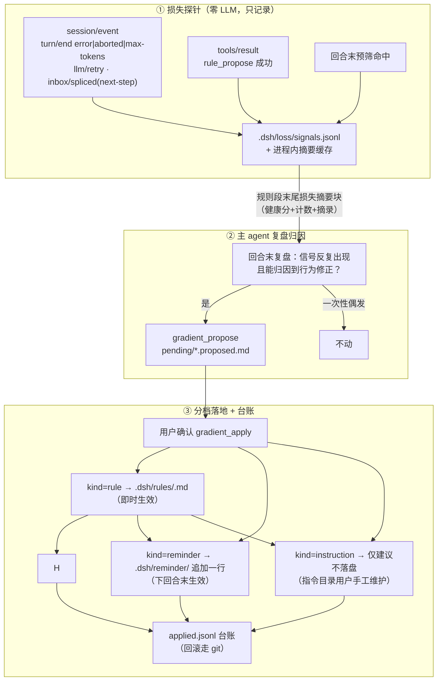

# 损失采集-文本梯度-回归安全网实施计划

> **一句话定位**：给 agent 装上"反向传播"式的 prompt 自我优化闭环——损失探针自动采集摩擦信号（loss）、主 agent 复盘归因产出文本梯度候选（gradient）、用户确认后分档落地并可回滚（apply + 台账）。不训练模型、插件零 LLM 请求，判定永远在主 agent，候选走提案-确认制。
>
> **什么时候会用到你**：开发/维护 ds-feedback 的损失探针或梯度工具、排查「健康分不对 / 信号没落盘 / gradient_apply 报错」、想知道某个 prompt 修改当初为什么被提出（查台账）、给编辑器面板加健康分或候选展示。
>
> 代码位置：`harness/ds-feedback/src/`（lossStore / lossProbe / gradientStore / gradientTools）、数据目录 `.dsh/loss/` 与 `.dsh/gradient/`

---

## 1. 先记住这几个文件

| 文件 | 一句话职责 | 你要改它的场景 |
|---|---|---|
| [lossStore.ts](../../harness/ds-feedback/src/lossStore.ts) | 信号 JSONL 追加（写队列串行化 + 去重 + 压缩）+ 健康分计算 | 改信号类别/权重、调压缩阈值 |
| [lossProbe.ts](../../harness/ds-feedback/src/lossProbe.ts) | 事件订阅接线 + 进程内摘要缓存 + 规则段损失摘要块文本 | 改订阅清单、改摘要块措辞 |
| [gradientStore.ts](../../harness/ds-feedback/src/gradientStore.ts) | 梯度候选 pending 落盘 + 应用台账（applied.jsonl） | 改候选文件格式、台账字段 |
| [gradientTools.ts](../../harness/ds-feedback/src/gradientTools.ts) | gradient_propose/list/apply 三工具 + 预算/冲突检测 + kind 分发 | 改分发逻辑、预算阈值 |
| [index.ts](../../harness/ds-feedback/src/index.ts) | 装配：配置解析、探针注册、规则段合成、5+3 工具注册 | 加配置项、改装配条件 |

**关键心智模型**：这就是神经网络训练循环的离散世界替代——
**前向传播**=一个回合执行；**损失**=turn-error/retry/steer/用户纠正；**反向传播**=复盘归因；**梯度**=一句具体的 prompt 修改建议；**学习率分档**=memory（自动小步）→ gradient pending（聚合中步，待确认）→ rule（签字大步）；**动量**=reinforce/信号重复次数。

---

## 2. 闭环怎么转：从损失到落地



### 2.1 损失信号契约（事件 → 信号）

订阅全部走**插件进程内 `ctx.on`**（与 ds-reminder 同款；host HTTP 流只有拍平的 `host/agent-error`，信息严格劣势，且 :3080 有来源门禁）：

| 事件 | 判定 | 信号 kind | 权重 |
|---|---|---|---|
| `turn/end` | `reason.kind === 'error'`（excerpt=LlmFailure.message） | `turn_error` | 8 |
| `turn/end` | `reason.kind === 'max-tokens'` | `turn_error`（excerpt='max-tokens'） | 8 |
| `turn/end` | `reason.kind === 'aborted'` | `turn_aborted` | 4 |
| `llm/retry` | 每次重试等待前落盘事件（excerpt=failure.message） | `retry` | 5 |
| `agent/inbox/spliced` | `target==='next-step'` 且非 `canceled`（steer 插入） | `steer_interrupt` | 3 |
| `tools/result` | `rule_propose` 成功（确属纠正的强信号） | `rule_propose` | 5 |
| 预筛命中（agent/status 防抖链） | `screenTranscript` 命中疑似纠正 | `correction_hint` | 3 |
| ——（编辑器本地队列撤回重发） | **不可观测**（消息未进 DSH），类别保留给编辑器侧上报 | `edit_resend` | 3 |

> **rc.2 类型坑**：`llm/retry` 是 dsh-llm-retry 动态 `session.append` 的类型，rc.2 的 `SessionEvent` 联合尚未收录——探针里走 `(event.type as string) === 'llm/retry'` 宽松比较 + data 显式形状断言。
> **多会话广播**：`session/event` 是全会话馈送，探针按 `session.header.id` 分流、`delegationDepth > 0` 的子会话不采集。
> **回合号归因**：`turn/start {turn}` 簿记当前回合；落盘事件自带 turn 时优先用事件自带的。

### 2.2 signals.jsonl 与健康分

- 单文件追加：`.dsh/loss/signals.jsonl`，每行 `{ts, sessionId, turn, kind, weight, excerpt?}`（excerpt 缺省键省略——lossless 纪律）。
- **去重**：同 `sessionId+turn+kind+excerpt` 且间隔 <1s 视为重复写入。
- **压缩**：超 2MB 重写保留最近 1000 行。
- **写队列**：进程内 promise 链串行化（并发事件保序，防 read-modify-write 竞态）。
- **健康分 = `max(0, 100 − Σweight)`**（纯派生值，窗口过滤由调用方做）。同一份信号任何消费方（插件/编辑器面板）算出的分数一致——编辑器面板客户端自己读 signals.jsonl 重算，不依赖内核 RPC（插件无自定义 RPC 能力）。

### 2.3 规则段损失摘要块

探针维护**进程内按会话摘要缓存**（环形 50 条），规则段 `text`（同步接口）末尾追加：

```
## 回合末损失摘要（健康分 92/100）

本会话累计损失信号 1 条（turn_error=1）。损失信号是自我优化的 loss 值：……

> 连接超时

复盘指引：若某类信号反复出现且你能归因到具体的行为修正……gradient_propose 提出候选……一次性偶发信号不要产候选。
```

> 为什么放规则段而不是 ds-reminder 新提醒条目：摘要需要**按会话动态渲染**，reminder 文案是静态文件；且零新提醒条目 = 不触碰"DEFAULT_REMINDERS + 挂载块 + home 侧 patch"三步闭环。无信号时不渲染该块。

### 2.4 梯度候选两段式（gradient_propose → apply）

候选文件 `.dsh/gradient/pending/<name>.proposed.md`（frontmatter：name/kind/target/evidence/date + delta 正文），**propose 绝不生效**——与 rule_propose 同一条铁律。apply 按 kind 分发：

| kind | 落地动作 | 生效时机 | 特殊约束 |
|---|---|---|---|
| `rule` | 写 `.dsh/rules/<target>.md` + RULES.md 索引同步 | 即时（规则段每步重算） | 同名已存在必须给 mode（overwrite/append）；delta ≤ 8000 字符；与 active 规则共享 ≥2 判别词时在结果里报 conflicts（非阻塞，人工裁决） |
| `reminder` | 向 `.dsh/reminder/<target>` 追加一行 | 下一回合末（文案实时读取） | 只改现有文件不新建；追加后总量 ≤ 8000 字符（防膨胀预算） |
| `instruction` | 不落盘，action='suggested' | 由用户手工处理 | 指令目录是用户手工领地 |

每次 apply 记台账 `.dsh/gradient/applied.jsonl`（`{ts, name, kind, target, action, deltaPreview}`）——"某个 prompt 修改当初为什么被提出、什么时候落的"从台账+候选 evidence 可完整溯源；回滚 = git revert（`.dsh/` 随 git 走）+ 台账留痕。

### 2.5 学习率档位全景（与其他飞轮的关系）

| 档位 | 通道 | 触发 | 生效门槛 |
|---|---|---|---|
| 自动小步 | memory_write + reinforce | 单次踩坑/决策 | 无（事实层，不改行为规范） |
| 聚集中步 | **gradient_propose → gradient_apply** | 损失信号反复出现 + 复盘归因 | **用户确认** |
| 签字大步 | rule_propose → rule_apply | 用户显式纠正 | **用户确认**（同一铁律） |
| 人工 | ds-instructions | 用户手工维护 | 人工 |

---

## 3. 编辑器面板展示

| 展示 | 落点 | 数据通道 |
|---|---|---|
| 会话健康分徽标 | `SessionSidebar.tsx` 行内（状态灯旁），props 加 `Record<sessionId, number>` 平行 map；接线照抄状态灯链（AgentService map+归约+广播 → AgentPanel 采纳 → Sidebar 下发） | `electronAPI.readTextFile` 读 `.dsh/loss/signals.jsonl`，客户端按本节公式重算 |
| 梯度候选聚合弹窗 | 头部"更多"菜单新条目 → 独立弹窗（UsageStatsPanel 骨架：overlay+Esc+loading/ready/error 三相；内容形态参照 FileManager 列表/查看） | `listDirFiles`（pending/*.md 是 .md 可列）+ `readTextFile`（候选与台账）；**面板保持只读**——落地动作走 agent 的 gradient_apply，面板零新 IPC |
| 刷新时机 | 面板打开时加载 + 手动刷新按钮 | agent 写文件不产生编辑器可感知的 mux 帧，实时推送需新开 fs.watch handler（样板 main.ts watch-project-assets），暂不做 |

---

## 4. 落地状态对照

| 能力 | 状态 | 证据 |
|---|---|---|
| lossStore/gradientStore 存储层 | ✅ 2026-09-30 | 单测 17/17（lossStore 9 + gradientStore 8） |
| 损失探针接线（4 类事件订阅 + 摘要缓存） | ✅ 2026-09-30 | lossGradient.test.ts 15 用例；dist 冒烟 events=agent/status,session/event,tools/result |
| gradient 三工具 + 预算/冲突/台账 | ✅ 2026-09-30 | tools 冒烟 5+3 注册；rule/reminder/instruction 三分发各有用例 |
| 规则段损失摘要块 | ✅ 2026-09-30 | 段合成用例（有信号含块、无信号不含、无 agent 装配隔离） |
| 挂载配置（lossDir/gradientDir/reminderDir 钉根） | ✅ 2026-09-30 | 项目+home 两侧 patch 均含三目录（sync 脚本已同步） |
| 运行时激活 | ⏳ 待内核重启 | junction 代码随进程启动载入，重启编辑器内核后探针开始采集 |
| 编辑器健康分徽标 | 🚧 规划中 | 见 §3 |
| 编辑器梯度候选弹窗 | 🚧 规划中 | 见 §3 |

---

## 5. 边界条件

| 条件 | 行为 | 怎么应对 |
|---|---|---|
| `.dsh/loss/` 不存在 | 首条信号自动 mkdir | 预期行为 |
| signals.jsonl 坏行 | 读时跳过，不崩 | 单行损坏不拖垮全量 |
| 子 agent 会话 | 不采集、不注入摘要 | delegationDepth 门控 |
| 信号为 0 | 规则段无摘要块、健康分不展示 | `viewFor` 返回 undefined |
| gradient_apply 同名 rule 无 mode | 报错提示 overwrite/append 二选一 | 语义同 rule_apply |
| reminder 目标文件不存在 | 报错（只改不建） | 先手工建文案文件 |
| delta 超预算 | 报错要求拆分/精简 | MAX_RULE_CONTENT_CHARS=8000 |
| 编辑器队列"撤回重新编辑" | 插件侧不可观测 | `edit_resend` 类别保留，待编辑器埋点 |
| 插件 `enabled: false` / `enableLossProbe: false` / `enableGradient: false` | 各自静默不注册 | 独立开关 |
