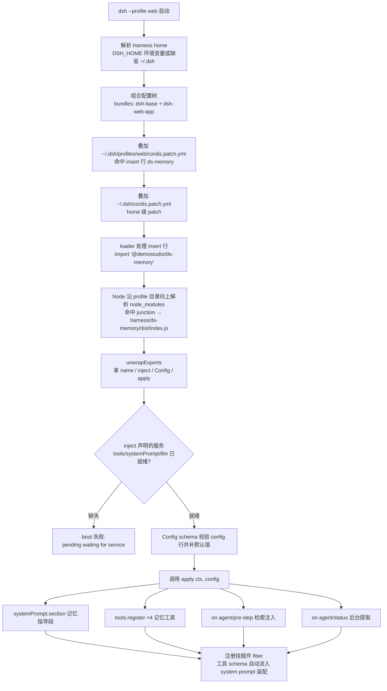

# DSH 插件安装与加载机制（DSH Plugin Installation & Loading）

> 把一个 Cordis 插件包（以 `@demostudio/ds-memory` 与 `@demostudio/ds-sync` 为实例）装入 dsh 内核的完整流程：物理安装（编译 / junction / patch 行）与运行时加载（配置树组合 → import → apply 注册）。
> 代码位置：`harness/ds-memory/`、`harness/ds-sync/`（插件包本体）、`~/.dsh/profiles/{web,headless}/cordis.patch.yml`（挂载点）、`~/.dsh/profiles/{web,headless}/node_modules/@demostudio/`（junction）
> 相关文档：[`harness/harness_system.md`](./harness_system.md)（Harness 工程总览）、[`harness/dsh_engine_integration.md`](./dsh_engine_integration.md)（DSH 与引擎集成架构）、[`harness/slash_command_system.md`](./slash_command_system.md)（编辑器侧命令系统）

---

## 1. 概述

dsh 是 all-plugin 的 Cordis agent harness：内核不带任何固定功能，一切能力（工具、system prompt 段、事件监听）都来自插件在启动时向 Cordis 上下文注册的贡献。因此给 dsh 增加能力**不需要改内核源码**，只需要让两件事成立：

1. **dsh 能按包名找到插件的代码**（物理安装：编译产物 + node_modules 可解析）；
2. **配置树里有一行指向这个插件**（patch 行：`insert: [{ id, name, config }]`）。

DemoStudio 当前运行的内核是全局 npm 安装的 `@deepseek-ai/dsh@0.1.1-rc.2`（非本地 `harness/dsh-source`）。编辑器（electron）与 VS Code 扩展拉起的内核使用默认 home `~/.dsh`，生效组合为：stock web profile（`dsh-base` + `dsh-web-app`）+ profile 级 patch（`~/.dsh/profiles/web/cordis.patch.yml`）+ home 级 patch（`~/.dsh/cordis.patch.yml`）。

### 职责表

| 角色 | 职责 | 不做 |
|------|------|------|
| 插件包（`harness/ds-memory/`、`harness/ds-sync/`） | 导出 `name`/`inject`/`Config`/`apply`，`npm run build` 产出 `dist/` | 不管自己被谁挂载 |
| junction（`node_modules/@demostudio/ds-memory`） | 让 Node 按包名解析到插件目录；链接而非拷贝，改代码只需 rebuild | 不参与配置 |
| profile patch（`cordis.patch.yml`） | 声明"插入哪一行插件、叫什么 id、带什么 config" | 不加载代码 |
| dsh loader | 组合配置树、import 插件模块、按 `inject` 解析服务、按 `Config` 校验配置、调用 `apply` | 不理解插件业务 |
| 插件 `apply(ctx, config)` | 注册即副作用：section / tools / 事件监听，全部挂插件 fiber | 不做卸载清理（fiber 自动回滚） |

### 与相邻功能的边界

| 功能 | 归属文档 |
|------|----------|
| 插件内部如何工作（记忆系统本体） | 插件源码注释 `harness/ds-memory/src/` 与其包内 `REQUIREMENTS.md` |
| dsh 启动 / 内核集成 / 进程守护 | [`harness/dsh_engine_integration.md`](./dsh_engine_integration.md) |
| 插件安装与加载机制 | **本文档** |
| 启动同步插件（home → 项目 .dsh 快照） | 插件源码注释 `harness/ds-sync/src/` |

---

## 2. 核心模块

| 模块 / 文件 | 说明 |
|-------------|------|
| `harness/ds-memory/package.json` | 声明 `"type": "module"`、`main: dist/index.js`、`dsh.bundle.patch` 占位、对 npm 内核同版本（`0.1.1-rc.2`）的 `@deepseek-ai/*` 正式依赖。 |
| `harness/ds-memory/src/index.ts` | 插件入口：导出 `name`（注册名）、`inject`（服务声明）、`Config`（schemastery schema）、`apply(ctx, config)`（全部注册）。 |
| `harness/ds-memory/dist/` | tsc 编译产物，loader 实际加载的就是它；改源码后必须 `npm run build`。 |
| `~/.dsh/profiles/web/node_modules/@demostudio/ds-memory` | Windows junction，目标 `E:\DemoStudio\harness\ds-memory`；headless profile 下有对称的一份。 |
| `~/.dsh/profiles/web/cordis.patch.yml` | profile 级补丁层，本插件的 `- insert:` 行写在这里；headless 同。 |
| `~/.dsh/cordis.patch.yml` | home 级补丁层（editor.bat 生成 agent-presets 行），本插件未使用。 |

---

## 3. 使用方法

### 3.1 安装一个插件的三个步骤（以 ds-memory 为准）

```powershell
# ① 编译插件包（在插件目录内）
cd E:\DemoStudio\harness\ds-memory
npm install        # 首次
npm run build      # 产出 dist/（每次改源码后都要重跑）

# ② 建 junction：让包名可被 Node 解析（无需管理员权限）
mkdir "$env:USERPROFILE\.dsh\profiles\web\node_modules\@demostudio" -Force
New-Item -ItemType Junction `
  -Path  "$env:USERPROFILE\.dsh\profiles\web\node_modules\@demostudio\ds-memory" `
  -Target "E:\DemoStudio\harness\ds-memory"
# headless profile 同样一份（Path 里的 web 换成 headless）
```

```yaml
# ③ 在 profile patch 里写 insert 行
# 文件：~/.dsh/profiles/web/cordis.patch.yml（headless 同理）
- insert:
    - id: ds-memory                          # 树内唯一 id，其他 patch 可按 id 覆盖 config
      name: '@demostudio/ds-memory'          # 包名 → loader import 的目标
      config:                                 # 交给插件 Config schema 校验，可选
        memoryDir: 'E:/DemoStudio/.dsh/memory'  # 把记忆目录钉到项目根（编辑器以 dsh-source 为 cwd 拉内核）
```

### 3.2 触发时机与生效方式

- patch 是启动时组合、web profile 下 `patchReload: live` 热重载：改 patch 行或 rebuild 插件后，正在跑的内核会重挂插件（HMR 语义，fiber 回滚后重放 `apply`）。
- headless 一次性进程无热重载，改动在下次启动生效。
- **内核进程级安装**（electron 拉起的全局 npm dsh）不涉及本插件的重装——只重装 `@deepseek-ai/dsh` 本体时，junction 与 patch 均不受影响。

### 3.3 验证 / 停用 / 卸载

```sh
# 验证 1：配置树里有这一行且能解析
dsh web --dump-config | grep ds-memory

# 验证 2：新会话问 agent "你有 memory_write 工具吗" → 应答 YES
```

| 操作 | 做法 |
|------|------|
| 临时停用 | insert 行 config 加 `enabled: false`（插件 `apply` 直接 return，零注册） |
| 彻底卸载 | 删除两处 junction + 两处 patch 的 insert 行 |
| 改插件代码 | 插件目录 `npm run build`，无需重装（junction 指向目录本身） |

### 3.4 一键安装脚本（迁移到新机器）

**文件**：`harness/ds-memory/install.ps1`（幂等，可重复执行）

```powershell
# 新机器上 clone/copy 项目后，跑一次即可恢复全部挂载
powershell -ExecutionPolicy Bypass -File harness\ds-memory\install.ps1
# 可选：-DshHome <路径> 指定 DSH home（默认 $HOME\.dsh）
# 可选：-ForceBuild 强制重新编译（默认 dist 存在时跳过）
```

脚本自动完成三件事（对应 §3.1 的手动三步）：

1. **编译**：`dist/` 缺失时 `npm install` + `npm run build`
2. **junction**：为 web + headless 两个 profile 建 `node_modules/@demostudio/ds-memory` junction（已存在则跳过）
3. **patch**：检查 `cordis.patch.yml` 是否已含 `ds-memory` 行，没有则幂等追加 insert 块

**迁移时各部分的去向**（为什么记忆不会丢）：

| 部分 | 位置 | 迁移时 |
|------|------|--------|
| 记忆数据（正文 + MEMORY.md） | `E:/DemoStudio/.dsh/memory/` | ✅ 在项目内，随项目拷贝/克隆走（需 git 提交或整目录拷贝） |
| 插件本体（源码 + dist） | `harness/ds-memory/` | ✅ 在项目内，随项目走 |
| 挂载 junction | `~/.dsh/profiles/{web,headless}/node_modules/@demostudio/` | ❌ 在用户 home，由脚本重建 |
| insert patch 行 | `~/.dsh/profiles/{web,headless}/cordis.patch.yml` | ❌ 在用户 home，由脚本重建 |

> ⚠️ **记忆数据要随 git 迁移**：`E:/DemoStudio/.dsh/memory/` 目前未被 git 跟踪（`git ls-files .dsh/memory` 为空），需手动 `git add .dsh/memory/` 提交，否则换机器 clone 后记忆正文不会出现（MEMORY.md 索引会重建但正文丢失）。

---

## 4. 工作流程

### 4.1 主流程：dsh 启动时插件如何被装进插件树



### 4.2 分阶段说明

| 阶段 | 触发点 | 关键动作 | 产物 |
|------|--------|----------|------|
| home 解析 | 进程启动 | 读 `DSH_HOME` 或缺省 `~/.dsh` | home 路径 |
| 配置树组合 | loader 初始化 | bundles → profile patch → home patch 依序叠加 | 完整插件行列表 |
| 模块加载 | 处理 insert 行 | 按包名 `import` + `unwrapExports` | `{ name, inject, Config, apply }` |
| 服务注入 | apply 调用前 | 按 `inject` 数组把服务解析到 ctx | 可安全访问的 ctx |
| 配置校验 | apply 调用前 | schemastery `Config` 校验 + 默认值 | resolved config |
| 注册 | `apply(ctx, config)` | section / tools.register / ctx.on / ctx.effect | 挂在插件 fiber 上的贡献 |

### 4.3 设计要点

#### 为什么用 junction 而不是 npm 拷贝

npm 对 registry 包的 `file:` 依赖是**拷贝**，改插件后必须重装才能生效；junction 是目录链接，`dist/` 重建后内核下一次加载即拿到新代码。junction（`New-Item -ItemType Junction`）不需要管理员权限，`mklink /J` 在 Git Bash 下引号转义易失败，用 PowerShell 执行。

#### inject 声明是硬约束

ctx 是 Cordis Proxy：`apply` 里访问未在 `inject` 中声明的服务键会抛 "cannot get property X without inject"。注意 `logger` 是 Context 内建属性，**不注入**（写了反而 boot 失败 "waiting for service: logger"，因为它是内建属性而非可注入服务键）。

#### 注册即副作用（Cordis 语义）

`apply` 里的每个注册（`section`/`tools.register`/`ctx.on`）都返回 disposer 并挂在本插件 fiber 上；插件卸载或 web profile 的 live patch reload 重挂时自动回滚再重放。插件内自建的副作用（如 ds-memory 的提取防抖定时器）要自己用 `ctx.effect(() => () => 清理)` 登记。

#### 正式 import 而非鸭子类型

插件 package.json 依赖与运行内核**同版本**的 `@deepseek-ai/*` npm 包（`0.1.1-rc.2`），类型与 API 在编译期对齐。跨包传递的只可以是纯工厂产物（`defineTool`、`createUserMessage`、`BlockAssembler`）与普通对象，不能传递类实例或依赖 `instanceof`（插件与内核各有一份模块实例）。

---

## 5. 边界条件

| 条件 | 行为/后果 | 处理方式 |
|------|----------|----------|
| `inject` 写了不可注入的键（如 `logger`） | boot 失败：`pending (waiting for service: logger)` | 从 inject 删除；`logger` 走 `ctx.logger` 内建属性 |
| 插件未编译（无 `dist/index.js`） | import 失败，boot 报模块解析错误 | 插件目录 `npm run build` |
| patch 行 id 与已有行冲突 | loader 按语义替换/插入，行为取决于行类型 | insert 用全新 id；改 config 用 `- id: <已有行>` 目标替换 |
| profile 包列表引用缺 `dsh.bundle` 字段的包 | boot 抛 `declares no dsh.bundle in its package.json` | 不要往 `dsh.profile.bundles` 里加非 bundle 包；插件用 insert 行挂载 |
| 编辑器拉起内核 cwd 为 `harness/dsh-source` | 插件里基于 `process.cwd()` 的默认路径会偏 | 用 `config.memoryDir` 绝对路径钉住（本插件已配） |
| `enabled: false` | `apply` 直接 return，section/工具/监听全部不注册 | 无需删行即可静默 |
| headless 一次性进程 + 异步副作用 | 进程可能在副作用完成前退出 | 用挂起定时器/未完成请求维持事件循环（ds-memory 的 3s 防抖即此用法） |
| 改了 profile patch 但 profile 无 live reload（headless） | 改动不热生效 | 重启该 profile 的内核 |
| 多实例共用同一 home | patch 改动对所有实例生效 | 注意 web profile `patchReload: live` 会热重挂插件 |

---

## 6. 依赖关系 / 注册机制

### 依赖关系

```
编辑器(electron) / VS Code 扩展            手动验证
        │ spawn dsh --profile web               │ dsh --profile headless
        ▼                                       ▼
~/.dsh  home ──► profiles/web ◄── profiles/headless
                    │                        │
        cordis.patch.yml ◄──────── cordis.patch.yml
        node_modules/@demostudio/  node_modules/@demostudio/
          └── junction ──┬── junction ┘
                         ▼
        E:\DemoStudio\harness\ds-memory\dist\index.js
                         ▼
        dsh loader → apply(ctx, config) → Cordis 插件树
```

### 注册机制

1. **物理注册**：junction 让包名可解析（§3.1 步骤②）。
2. **逻辑注册**：profile patch 的 insert 行让配置树里有这一行（§3.1 步骤③）。
3. **能力注册**：`apply` 内部向 Cordis 注册 section / tools / 事件监听，工具 schema 自动流入 system prompt 装配，无需额外接线。

---

## 8. 实例：@demostudio/ds-sync（启动同步插件）

> 第二个按同一机制挂载的插件包：DSH 启动时把 home(~/.dsh) 的记忆/skills/presets/profiles
> 同步到项目根 `.dsh`，内容变化才写，保证项目 .dsh 始终是最新的"可迁移快照"。

### 8.1 用途与背景

| 问题 | 解法 |
|------|------|
| 项目迁移到其他机器时，home(~/.dsh) 里的 profiles patch / presets / skills 不随 git 走 | ds-sync 在每次 DSH 启动时把 home 内容镜像到项目根 `.dsh`（随 git 跟踪） |
| 手动维护两份配置容易漂移 | 只改 home 一处，启动自动同步，sha1 比对内容变化才写，不产生 git 噪音 |

### 8.2 同步映射（home → 项目根/.dsh，结构完全一致）

| home 源 | 项目目标 | 说明 |
|---------|----------|------|
| `~/.dsh/.agent-presets/` | `<项目>/.dsh/presets/` | agent presets（如 game-editor） |
| `~/.dsh/skills/` | `<项目>/.dsh/skills/` | 用户级技能 |
| `~/.dsh/profiles/` | `<项目>/.dsh/profiles/` | profile 配置（cordis.yml / patch / package.json），**跳过 node_modules** |
| `~/.dsh/memory/` | `<项目>/.dsh/memory/` | 记忆文件（ds-memory 的 memoryDir 已钉在项目根时源为空，自动跳过） |

### 8.3 挂载（与 ds-memory 完全对称）

```powershell
# junction（web + headless 各一份）
New-Item -ItemType Junction -Path "$HOME\.dsh\profiles\web\node_modules\@demostudio\ds-sync" -Target "E:\DemoStudio\harness\ds-sync"
New-Item -ItemType Junction -Path "$HOME\.dsh\profiles\headless\node_modules\@demostudio\ds-sync" -Target "E:\DemoStudio\harness\ds-sync"
```

```yaml
# ~/.dsh/profiles/{web,headless}/cordis.patch.yml 追加
- insert:
    - id: ds-sync
      name: '@demostudio/ds-sync'
      config:
        projectRoot: 'E:/DemoStudio'   # 必须显式钉到项目根（编辑器以 dsh-source 为 cwd 拉内核时 cwd 不可靠）
```

### 8.4 行为细节

- **触发时机**：插件 `apply` 时立即同步一次（每次 DSH 启动）；web profile `patchReload: live` 重挂时也会重跑。
- **内容变化才写**：逐文件 sha1 比对，仅复制有差异的文件（验证：二次启动 `复制 0 个文件, 未变化 N 个`）。
- **安全默认**：`deleteExtraneous: false` —— 只增不删，项目 .dsh 里手工维护的文件（如 `<项目>/.dsh/profiles/cordis.patch.yml`）不会被删除；如需完全镜像删除加 `deleteExtraneous: true`。
- **跳过项**：`node_modules`（含 junction）、`.dsh-module-fallback`、`.ds-profile-patches`、`.git`、`dist`。
- **配置项**：`enabled` / `homeDir` / `projectRoot` / `deleteExtraneous` / `extraExcludes`。

### 8.5 验证

```sh
dsh web --dump-config | grep ds-sync   # 配置树里有这一行
# 启动 headless（或 web）后，检查项目 .dsh 下已出现镜像内容
ls E:\DemoStudio\.dsh\profiles\web\cordis.patch.yml   # 由 home 同步而来
```

---

## 7. 踩坑记录

| 现象 | 原因 | 结论/约束 |
|------|------|-----------|
| boot 报 `pending (waiting for service: logger)` | `inject` 数组写了 `'logger'`，但 logger 是 Context 内建属性、不是可注入服务键 | inject 只声明真正通过 fiber 解析的服务键 |
| vitest 全挂 `require is not defined in ES module scope`（`node_modules/.vite-electron-renderer/...`） | 仓库根 `vite.config.ts` 带 electron-renderer 插件，vitest 向上拾取了它，劫持 `node:fs` | 插件包内必须放本地 `vitest.config.ts` 阻止向上查找 |
| `harness/profile` 的 demostudio profile 无法启动 | 其 bundles 列了 `@deepseek-ai/dsh-tool-web`，npm rc.2 时代该包无 `dsh.bundle` 字段 | 不要再往 `harness/profile` 挂插件；实际运行时是 `~/.dsh` |
| `npm view @deepseek-ai/dsh-tools version` 显示旧版本 | npm latest dist-tag 落后，实际存在 `0.1.1-rc.2` | 安装时**写死精确版本**（`0.1.1-rc.2`），不依赖 dist-tag |
| 从 `mklink /J` 建 junction 在 Git Bash 下报 Invalid switch | Git Bash 对 `/J` 的路径改写 | 用 `powershell New-Item -ItemType Junction` |
