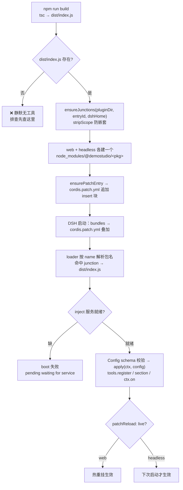

# DSH 插件安装与加载

> **一句话定位**：把一个 Cordis 插件包送进 DSH 内核的完整链路——**物理挂载**（`npm run build` 出 `dist/` + junction 让包名可被 Node 解析 + patch `insert` 行进配置树）与**运行时加载**（loader 组合配置树 → import → 校验 → `apply` 注册），两者缺一不可。
>
> **什么时候会用到你**：新写一个 DSH 插件、插件挂了但工具没出现、换机器重建挂载、改了代码不确定要不要重装、想卸载某个插件。
>
> 代码位置：`harness/ds-*/`（插件包本体）、`harness/ds-plugin-manager/`（挂载工具）、`%USERPROFILE%\.dsh\profiles\{web,headless}\`（运行时挂载点）

---

## 1. 先记住这几个文件

| 文件 | 一句话职责 | 你要改它的场景 |
|---|---|---|
| [mountPlugin.ts](../../harness/ds-plugin-manager/src/tools/mountPlugin.ts) | 一键部署：`build → junction → patch → validate` 四步 | 挂载新插件、排查某一步失败 |
| [junction.ts](../../harness/ds-plugin-manager/src/junction.ts) | 在两 profile 下建/校验/移除 `@demostudio/<pkg>` junction | junction 建错位置、要手动补挂 |
| [patcher.ts](../../harness/ds-plugin-manager/src/patcher.ts) | 幂等追加/删除 `cordis.patch.yml` 里的 insert 块 | patch 行没写进去、要清掉残留行 |
| `~/.dsh/profiles/{web,headless}/cordis.patch.yml` | profile 级挂载清单，**运行时唯一生效的挂载依据** | 手写挂载/停用/调 config |
| [ds-memory/package.json](../../harness/ds-memory/package.json) | 插件元数据：`main: dist/index.js`、`dsh.bundle.patch`、依赖版本 | 抄它做新插件模板 |

**关键心智模型**：DSH 是 **all-plugin** 的 Cordis harness——内核不自带任何固定能力，工具、system prompt 段、事件监听全靠插件在 `apply` 时注册，所以加能力**不用改内核源码**。只需成立三件事：`dist/` 存在 + 包名能解析（junction）+ 配置树里有这一行（patch `insert`）。**三者是"与"关系，少任何一个都只是静默地没有这个工具，不会报错说"少了一个"。**

---

## 2. 一个插件怎么被 DSH 加载：从 npm build 到生效

### 2.1 谁需要它：DSH 加载机制的外部约束

挂载方式不是我们选的，是 DSH loader 决定的。先看运行时真实结构：

```
%USERPROFILE%\.dsh\profiles\
├── node_modules\          # ← 包解析根（在 profiles 层，不在 profile 层）
├── web\
│   ├── package.json       # bundles: [dsh-base, dsh-web-app] + patchReload: live
│   ├── cordis.yml         # 空数组 []，注释明说"Edit cordis.patch.yml, not this file"
│   └── cordis.patch.yml   # ← 挂载清单就写这里
└── headless\              # 结构同 web，但 bundles 为 dsh-headless、无 patchReload
    └── cordis.patch.yml
```

`cordis.yml` 的注释把机制说得很直白：配置树是 **bundles → cordis.patch.yml → --patch 覆盖**逐层叠加出来的，所以插件只能挂在 patch 层。再看 patch 文件本身的头部注释：

```yaml
# Your patch layer for this dsh profile, applied after every bundle layer:
# a top-level YAML array of loader patch entries (id-targeted config
# overrides, disables, and insert lists; `!!js` expressions allowed).
```

> **注意 "id-targeted" 三个字**：`- id: xxx` 是"定位到树里已有的一行去覆盖"，`insert` 是"插入新行"。自研插件在树里不存在，所以**只能用 `- insert:`**——对不存在的 id 用 `- id:` 是空操作。这也是 `session-query-sqlite`（内核自带行）能覆盖、而 `ds-memory` 必须 insert 的原因。
>
> 还有一条约束来自 patch 的覆盖语义：**`- id:` 覆盖是整行替换，不是字段合并。** 只写 `path` 会把 `openAt` 重置回默认值。要么把关键键写全，要么别用覆盖。

还有一条硬约束来自编辑器怎么拉起内核（[electron/main.ts](../../electron/main.ts)）：

```ts
const DSH_SOURCE_DIR = path.join(__dirname, '..', 'harness', 'dsh-source')
// ...
const launcher = spawn('cmd.exe', ['/c', launcherPath,
  nodePath, cliPath, DSH_SOURCE_DIR, dshLogFile, /* ... */
], {
  cwd: DSH_SOURCE_DIR,          // ← 内核进程的 cwd 是 dsh-source，不是项目根
  stdio: 'ignore',
  windowsHide: true,
})
```

> 内核进程的 `cwd` 是 `harness/dsh-source`。**任何插件里写 `process.cwd()` 当默认目录的代码，取到的都是 dsh-source。** 所以 patch 里凡是目录型 config（`memoryDir` / `ruleDir` / `experienceDir` / `projectRoot`）**必须写绝对路径**，不能指望默认值。
>
> `ds-plugin-manager` 为了绕开这点，干脆不用 cwd，改从文件物理路径反推（[projectRoot.ts:18](../../harness/ds-plugin-manager/src/projectRoot.ts)）：

```ts
function findProjectRoot(): string {
  let dir = _dirname
  for (let i = 0; i < 10; i++) {
    if (fs.existsSync(path.join(dir, 'harness', 'ds-plugin-manager', 'package.json'))) {
      return dir
    }
    const parent = path.dirname(dir)
    if (parent === dir) break
    dir = parent
  }
  return path.resolve(_dirname, '..', '..', '..')   // 兜底：src/ → 项目根 2 级上
}
```

> 用 `import.meta.url` 拿到**编译后文件的真实物理路径**再往上找。junction 指向仓库目录，所以这条路径能稳定穿过 junction 指回 `E:\DemoStudio`。写新插件要拿项目根时照抄这个思路，别用 `process.cwd()`。

### 2.2 挂载链路



**① 编译：DSH 加载的是 `dist/`，不是 `src/`**

```powershell
cd E:\DemoStudio\harness\ds-memory
npm install        # 首次
npm run build      # "build": "tsc"
```

> `package.json` 里 `"main": "dist/index.js"`，loader 按包名解析后就是取这个文件。**junction 只是个指针，目录里没有 `dist/index.js` 就等于没挂。** 改完源码不 rebuild，工具行为还是旧的，且没有任何报错。

**② junction：让包名能被 Node 解析**

[junction.ts:32](../../harness/ds-plugin-manager/src/junction.ts) 的核心逻辑：

```ts
const safeName = stripScope(pkgName)
const junctionPath = path.join(profilesDir, profile, 'node_modules', '@demostudio', safeName)
const sourcePath = path.resolve(pluginDir)

// 已存在 → 检查目标是否正确
if (fs.existsSync(junctionPath)) {
  try {
    const target = fs.readlinkSync(junctionPath)
    if (path.resolve(target) === path.resolve(sourcePath)) {
      return { profile, action: 'skipped', path: junctionPath }
    }
    fs.rmSync(junctionPath, { recursive: true, force: true })   // 目标不对 → 删除重建
  } catch {
    fs.rmSync(junctionPath, { recursive: true, force: true })   // 读不出来 → 删除重建
  }
}
```

> 这段**幂等且自愈**：已存在就比对目标，对就跳过（`skipped`），不对或读不出来就删掉重建，所以重复执行 `mount_plugin` 不会出事。
>
> **为什么用 junction 而不是 `npm install file:../`**：npm 对 `file:` 依赖是**拷贝**，改完插件必须重装；junction 是目录链接，`npm run build` 重建 `dist/` 后内核下次加载直接拿到新代码。且 junction **不需要管理员权限**（Windows symbolic link 要）。创建走 PowerShell（[junction.ts:67](../../harness/ds-plugin-manager/src/junction.ts)）：

```ts
execFileSync('powershell', [
  '-NoProfile', '-Command',
  `New-Item -ItemType Junction -Path "${junctionPath}" -Target "${sourcePath}" | Out-Null`,
], { stdio: 'pipe', timeout: 10_000 })
```

> **不能用 Git Bash 的 `mklink /J`**：Git Bash 会对 `/J` 做路径改写，报 `Invalid switch`。

`stripScope()` 是防嵌套的兜底（[junction.ts:25](../../harness/ds-plugin-manager/src/junction.ts)）：

```ts
function stripScope(pkgName: string): string {
  return pkgName.startsWith('@') ? pkgName.split('/')[1] ?? pkgName : pkgName
}
```

> 就算调用侧误传了完整包名，也会被剥成裸名，避免拼出 `@demostudio/@demostudio/x`。

**③ patch 行：把插件写进配置树**

[patcher.ts:69](../../harness/ds-plugin-manager/src/patcher.ts) 的写入逻辑：

```ts
if (fs.existsSync(patchPath)) {
  const content = fs.readFileSync(patchPath, 'utf-8')
  // 已存在 → 跳过
  if (content.includes(`id: ${entry.id}`)) {
    return { profile, action: 'skipped' }
  }
  // 追加
  const newBlock = formatInsertBlock(entry)
  fs.writeFileSync(patchPath, content.trimEnd() + '\n\n' + newBlock, 'utf-8')
  return { profile, action: 'added' }
}
```

> 判定"已存在"用的是**整文件字符串包含 `id: <entryId>`**，命中就跳过。mount 因此幂等，但也意味着**它永远不会更新已有行的 config**——改了 `memoryDir` 想生效得手动编辑 patch（或 unmount 后重挂）。
>
> 生成块长这样（[patcher.ts:53](../../harness/ds-plugin-manager/src/patcher.ts)），与手写格式一致：

```yaml
- insert:
    - id: ds-memory
      name: '@demostudio/ds-memory'
      config:
        memoryDir: 'E:/DemoStudio/.dsh/memory'
```

> `id` 是树内唯一标识（别的 patch 可按 id 覆盖 config）；`name` 是**包名**，loader 拿它去 import；`config` 交给插件自己的 `Config` schema 校验并补默认值。

### 2.3 加载与重载：web 热重载 vs headless 重启

`patchReload` 是 profile 级开关，写在 profile 的 `package.json` 而不是 patch 文件里：

```jsonc
// .dsh/profiles/web/package.json（headless 同构，但无 patchReload 字段）
{ "dsh": { "profile": {
  "bundles": ["@deepseek-ai/dsh-base", "@deepseek-ai/dsh-web-app"],
  "patchReload": "live"     // ← web 有，headless 没有
} } }
```

| profile | bundles | patchReload | 改了 patch / rebuild 之后 |
|---|---|---|---|
| `web` | `dsh-base` + `dsh-web-app` | `live` | 正在跑的内核**热重挂**：fiber 回滚后重放 `apply` |
| `headless` | `dsh-base` + `dsh-headless` | 无 | **必须重启内核**，一次性进程没有热重载 |

> headless 是一次性进程，`patchReload: live` 对它没有意义，改完不重启跑的一定是旧行为。另外注意热重载的连带影响：多实例共用同一个 home（`%USERPROFILE%\.dsh`），在 A 实例改 patch，B 实例也会被热重挂。

**注册即副作用**：`apply` 里调的 `ctx.tools.register(...)`、`ctx.systemPrompt.section(...)`、`ctx.on(...)` 全部挂在插件自己的 fiber 上，卸载或热重载时**自动回滚**，不需要手动清理。推荐把资源都挂进 `ctx.effect()`（[index.ts:31](../../harness/ds-plugin-manager/src/index.ts)）：

```ts
export function apply(ctx: DSHContext): void {
  if (typeof ctx.effect === 'function') {
    ctx.effect(() => registerTools(ctx))   // 闭包捕获 ctx，effect 回调不传参
  } else {
    registerTools(ctx)                     // 老版本无 effect 时直接注册
  }
}
```

> `ctx.effect` 是可选能力，先判断再调，兼容不同 DSH 版本。

**停用而不卸载**：多数插件在 `apply` 开头就有一个总开关（[ds-memory/src/index.ts:75](../../harness/ds-memory/src/index.ts)）：

```ts
// enabled: false — 一切静默，什么都不注册
if (!resolved.enabled) return
```

> 注意这是**各插件自己实现的约定**，不是 DSH 框架能力——`ds-memory` / `ds-feedback` / `ds-experience` / `ds-context-warning` / `ds-instructions` / `ds-sync` 都有，但新插件得自己写。所以想靠 `enabled: false` 停用插件，先确认该插件实现了这个开关；否则只能 `unmount_plugin` 或删 patch 行。

---

## 3. 验证与排障

挂载完别假设成功了。前两步是**静态检查**（不需要内核跑起来），第三步才是运行时确认。

**① junction 建对了吗 + 两 profile 对称吗**

```powershell
foreach ($p in 'web','headless') {
  Get-ChildItem "$env:USERPROFILE\.dsh\profiles\$p\node_modules\@demostudio" -ErrorAction SilentlyContinue |
    Select-Object @{n='profile';e={$p}}, Name, LinkType, Target
}
```

> `LinkType` 必须是 `Junction`，`Target` 必须指向 `E:\DemoStudio\harness\<插件>`；`Name` 出现 `@demostudio`（嵌套）或 `Target` 为空就是建错了，删掉重建。**两个 profile 都要对称出现**——只建 web 时编辑器能用、headless 任务报模块找不到，反之亦然，这是"一个 profile 能跑另一个不能"的头号原因。

**② dist 产物在吗**

```powershell
Test-Path E:\DemoStudio\harness\ds-memory\dist\index.js
```

> 返回 `False` 就 `npm run build`。

**③ 配置树里有这一行吗 + 工具真的注册了吗**

```sh
dsh web --dump-config | grep ds-memory
```

> grep 到说明 patch 行进树且包名可解析；再到新会话问 agent "你有 memory_write 工具吗"，答 YES 才算 `apply` 真跑过。
>
> **注意**：当前本机 `%USERPROFILE%\.dsh\profiles\web\cordis.patch.yml` 内容是 `[]`，且 9 个插件 `dist/` 均未构建——这套挂载在本机**尚未激活**，直接跑上面三条检查会全部落空，先执行 `mount_plugin` 重建。

**内核起不来时的第一现场**：`logs/dsh-agent.log`（路径由 [electron/main.ts:514](../../electron/main.ts) `path.join(LOG_DIR, 'dsh-agent.log')` 指定）。插件加载失败、boot 降级（degraded）都先看它。

---

## 4. 关键命令/脚本速查

| 命令 | 位置 | 干什么 | 注意 |
|---|---|---|---|
| `mount_plugin directory=harness/ds-<短名>` | [mountPlugin.ts:25](../../harness/ds-plugin-manager/src/tools/mountPlugin.ts) | 一键 build → junction → patch → validate | 只接受 `harness/` 下的目录（安全校验） |
| `unmount_plugin directory=harness/ds-<短名>` | [unmountPlugin.ts:24](../../harness/ds-plugin-manager/src/tools/unmountPlugin.ts) | 移除两处 junction + 两处 patch 行 | 不删 `dist/`，源码不受影响 |
| `create_plugin` | [createPlugin.ts:13](../../harness/ds-plugin-manager/src/tools/createPlugin.ts) | 生成插件脚手架 | 生成后仍需 mount |
| `ensureJunctions()` / `removeJunctions()` | [junction.ts:82](../../harness/ds-plugin-manager/src/junction.ts) / [:104](../../harness/ds-plugin-manager/src/junction.ts) | 建/移除两 profile 的 junction | 传裸名 entryId，内部拼 `@demostudio/`；不存在时不报错 |
| `ensurePatchEntry()` | [patcher.ts:69](../../harness/ds-plugin-manager/src/patcher.ts) | 幂等追加 insert 块 | 已存在则 skipped，**不会更新 config** |
| `removePatchEntry()` | [patcher.ts:103](../../harness/ds-plugin-manager/src/patcher.ts) | 逐行删除匹配 id 的 insert 块 | 纯字符串处理，不依赖 yaml 库 |
| `npm run build` | 各插件 `package.json` | `tsc` 产出 `dist/` | 改源码后必跑；`forceBuild: true` 可强制 |
| `New-Item -ItemType Junction` | [junction.ts:71](../../harness/ds-plugin-manager/src/junction.ts) | 创建 junction | Git Bash 的 `mklink /J` 会失败 |
| `dsh web --dump-config \| grep <短名>` | 验证步骤 | 看配置树是否含该插件行 | DSH CLI 外部命令 |

---

## 5. 流程影响：牵动哪些功能

### 上游：谁驱动它

| 上游 | 怎么驱动 | 相关文档 |
|---|---|---|
| DSH 内核启动 | loader 组合 bundles + patch 配置树并 import 插件 | [DSH 引擎集成](./dsh_engine_integration.md) |
| Electron 编辑器 | `spawn` launcher 拉起内核，`cwd` 为 `harness/dsh-source` | [Harness 工程](./harness_system.md) |
| 开发者 + `ds-plugin-manager` | `npm run build` 产出 `dist/`；`create/mount/unmount_plugin` 自动化本流程 | [Harness 工程](./harness_system.md) |

### 下游：它波及谁

| 下游功能 | 波及点 | 相关文档 |
|---|---|---|
| 数据飞轮（ds-feedback / ds-experience） | 按同一机制挂载；`ruleDir` / `experienceDir` 钉在项目根；回归用例要求 junction（web+headless）+ 两 patch 行 + `session-query-sqlite` 覆盖 | [数据飞轮计划](./dsh_data_flywheel_plan.md)、[飞轮测试用例](./dsh_data_flywheel_test_cases.md) |
| ds-memory 与 ds-instructions | 同样靠 junction + patch 行；`memoryDir` / `projectRoot` 不钉绝对路径会落进 `dsh-source` | [DSH 引擎集成](./dsh_engine_integration.md) |
| Preset 同步 | `~/.dsh/.agent-presets` 由 ds-sync 镜像到项目 `.dsh/presets` | [Preset 同步](./preset-sync-mechanism.md) |
| Agent 可调用工具集 | 插件注册的工具进入 agent 工具清单 | [DSH 引擎集成](./dsh_engine_integration.md) |

---

## 6. 踩坑清单

**1. junction 嵌套成 `@demostudio/@demostudio/<pkg>`，内核启动降级** —— `ensureJunctions` 内部已拼 `@demostudio` 前缀，调用侧又传完整包名。规则：mount/unmount 一律传 `entryId`；排查 `Get-ChildItem ...\@demostudio -Force`。

**2. Git Bash 下 `mklink /J` 报 `Invalid switch`** —— Git Bash 对 `/J` 做路径改写。规则：用 PowerShell `New-Item -ItemType Junction`。

**3. 改了插件源码但工具行为没变** —— DSH 加载的是 `dist/index.js`，junction 只是指针不帮你编译。规则：**每次改源码后 `npm run build`**；`mount_plugin` 见 `dist/` 已存在会跳过编译，强制重编传 `forceBuild: true`。

**4. `inject` 写了 `logger` 导致 boot 失败** —— 报 `pending (waiting for service: logger)`。原因：`logger` 是 Context **内建属性**不是可注入服务键。规则：`inject` 只声明 fiber 服务键（如 `['tools']`），具名 logger 用 `ctx.logger('名字')`；`ds-sync` 的 `inject` 就是空数组。

**5. 插件没生效但没有任何报错** —— 三要素是"与"关系，缺任何一个都只是静默地没有这个插件。规则：按 §3 三步静态检查排除，先 `Test-Path ...\dist\index.js`。

**6. 只建了 web profile，headless 任务报模块找不到** —— 两个 profile 的 `node_modules` 是各自独立的解析根。规则：junction 与 patch 行**两个 profile 都要建**。

**7. headless 改了 patch 不生效** —— headless 是一次性进程，`patchReload: live` 只对 web 有效。规则：headless 每次改动后**重启内核**。

**8. patch 覆盖只写了一部分键，其余被重置** —— 覆盖 `session-query-sqlite` 只写 `path`，`openAt` 回到默认；替换粒度是整行。规则：关键键**写全**。

**9. 插件内 `process.cwd()` 拿到的不是项目根** —— 默认目录落在 `harness/dsh-source`，因为 spawn 时 `cwd: DSH_SOURCE_DIR`。规则：目录型 config 用**绝对路径**钉死；拿项目根学 `projectRoot.ts` 用 `import.meta.url` 反推。

**10. `ctx.effect()` 回调写成 `(inner) =>` 拿到 undefined** —— 回调不传参，必须闭包捕获外层 ctx：`ctx.effect(() => registerTools(ctx))`。另：`tools.register` 缺 `output` 字段会挂不上标准 profile（rc.2 强制要求 `output: { schema, render, presentationMeta? }`），一律用 `defineTool`。

**11. vitest 在插件目录下全挂 `require is not defined in ES module scope`** —— 仓库根 `vite.config.ts` 带 electron-renderer 插件，vitest 向上拾取了它并劫持 `node:fs`。规则：**插件包内必须放本地 `vitest.config.ts`** 阻止向上查找。

**12. `npm view @deepseek-ai/dsh-tools version` 装到的不是目标版本** —— npm `latest` dist-tag 落后于实际发布的 rc 版本。规则：安装时**写死精确版本**（如 `0.1.1-rc.2`），不依赖 dist-tag。

**13. 往 `dsh.profile.bundles` 里加非 bundle 包，boot 抛 `declares no dsh.bundle in its package.json`** —— bundles 只接受声明了 `dsh.bundle` 的包（如 `@deepseek-ai/dsh-base`）。规则：**自研插件一律用 insert 行挂载，不进 bundles**；且 `harness/profile/` 不是运行时生效配置，实际运行时读的是 `~/.dsh`。

**14. 换机器 clone 项目后 `.dsh/memory/` 只剩 `.gitkeep`** —— 记忆文件曾未被 git 跟踪，MEMORY.md 索引会重建但正文丢失。规则：迁移前 `git add .dsh/memory/` 提交，或整目录拷贝。当前仓库该目录 17 个文件**已在跟踪中**，但新增记忆文件仍需 `git add`。

---

## 7. 边界条件

| 条件 | 行为 | 怎么应对 |
|---|---|---|
| patch 行已存在但 config 要改 | `ensurePatchEntry` 返回 `skipped`，不会更新 | 手动编辑 patch 文件，或 unmount 后重新 mount |
| `insert` 的 id 与树内已有行冲突 | 行为取决于行类型（insert 插入 / id 覆盖） | 新插件用全新 id；改 config 用 `- id: <已有行>` |
| `config` 里 `enabled: false` | `apply` 开头直接 return，一切不注册 | 无需删行即可静默停用；**前提是插件自己实现了该开关**（ds-memory/feedback/experience/context-warning/instructions/sync 均有，新插件要自己写） |
| web profile 改动 | `patchReload: live` 热重挂 | 无需重启，但多实例共用 home 会连带重挂 |
| headless profile 改动 | 无热重载，下次启动才生效 | 重启内核；异步副作用需挂起定时器维持事件循环 |
| mount 传入 `harness/` 之外的目录 | 工具返回 `安全限制：只能操作 harness/ 目录下的插件` | 传 `harness/ds-<短名>` 或 `harness/` 下的绝对路径 |
| 换机器 / 新 clone | junction 与 patch 行在 `%USERPROFILE%` 不随项目走；ds-sync 镜像也跳过 `node_modules`（含 junction）、`.git`、`dist` | 用 `mount_plugin` 重建两处 junction + 两处 patch |
| 项目 `.dsh/` 与 home `~/.dsh/` 内容不一致 | 项目侧是 ds-sync 的**同步镜像**，运行时生效的是 home 侧 | 改挂载改 home 侧；项目侧由 ds-sync 启动时镜像 |
