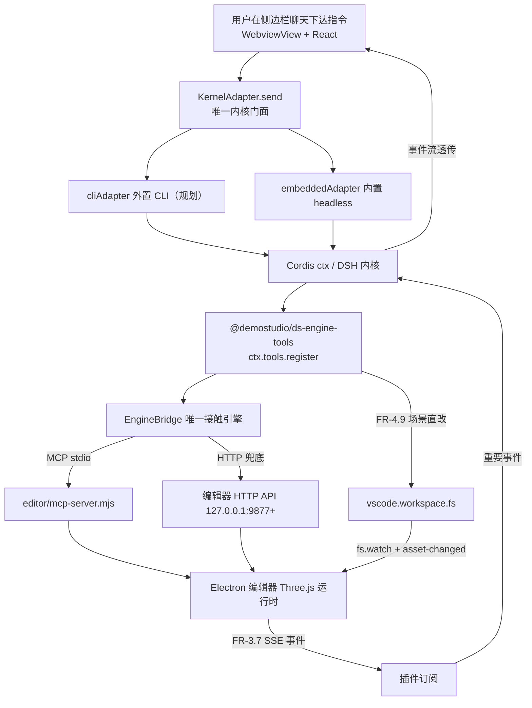

# DSH × VS Code × DemoStudio 集成需求文档（PRD v1.0）

> **一句话定位**：**产品需求文档**——在 DemoStudio 仓库内建一个 VS Code 扩展工程，把 DSH agent 内核接进来，让 agent 能深度操控编辑器（场景/实体/运行/日志），形成「改代码 → 引擎验证 → 读反馈 → 迭代」闭环，同时**内核不 fork、跟随官网升级**。
>
> **什么时候会用到你**：评审或实现 DSH × VS Code 集成需求、确认某个 FR 编号的验收标准、查架构职责边界与配置项、**核对某条 FR 到底落地没有**。
>
> 代码位置：`harness/vscode-ext/`（扩展壳）、`harness/ds-engine-tools/`（引擎特化插件包）、`harness/profile/`（DSH Profile）、`electron/main.ts`（HTTP/SSE 控制面）、`editor/mcp-server.mjs`（已有 MCP 服务器）
>
> 文档状态：v1.0 定稿（2026-08-22）。**本文档记录的是「要做什么」，实现状态见 §5 对照表**——仓库里未落地的部分一律标注为「未实现」。

---

## 1. 先记住这几个文件

| 文件 | 一句话职责 | 你要改它的场景 |
|---|---|---|
| [electron/main.ts](../../electron/main.ts) | 编辑器 HTTP 控制面（`:9877+`）+ SSE 事件总线 + DSH agent 常驻引导（`:3080`） | 加 HTTP 端点 / 加 SSE 事件类型 / 改 agent 认领逻辑 |
| [editor/mcp-server.mjs](../../editor/mcp-server.mjs) | MCP stdio 服务器，把 HTTP 控制面包装成 MCP 工具 | 加一个给外部 agent 用的工具 |
| [ds-engine-tools/src/index.ts](../../harness/ds-engine-tools/src/index.ts) | 引擎特化插件包入口：导出 `ALL_TOOLS`，`apply(ctx)` 里 `ctx.tools.register` | 加/删一个引擎工具 |
| [vscode-ext/src/extension.ts](../../harness/vscode-ext/src/extension.ts) | VS Code 扩展壳 `activate`：装 bridge / 内核 / 聊天视图 / 命令 | 加命令 / 改装配顺序 |
| §5 需求 ↔ 实现对照表 | **逐条 FR 标注落地状态与源码证据** | 判断某需求做到哪一步 |
| [harness_system.md](./harness_system.md) | 该 PRD 的**当前实现状态**（主链路是 Electron → DSH，不是本扩展壳） | 查现状而非需求原文 |

**关键心智模型**：**本 PRD 是需求文档，不是现状文档**。PRD 规划的是「VS Code 扩展壳 → DSH 内核 → EngineBridge → 编辑器」；但当前仓库里**真正在跑的主链路**是 Electron 主进程直接拉起 DSH 内核、插件经 junction + patch 挂载（见 [Harness 工程](./harness_system.md) §2）。`vscode-ext/` 有完整源码但**从未被构建**。一句话：**查需求看本 PRD，查现状看代码与 [harness_system.md](./harness_system.md)。**

---

## 2. 目标架构在代码里长什么样



### 2.1 编辑器侧控制面：已落地（HTTP + SSE）

这条腿是**唯一真实跑通**的部分。端口约定在 [electron/main.ts:1650](../../electron/main.ts)：`MCP_API_PORT_START = 9877`、`MCP_API_PORT_MAX = 9927`（50 个槽位）、`findFreePort` 在 [:1713](../../electron/main.ts)。

> `MCP_API_PORT_START = 9877` 是全仓库端口约定的**唯一事实来源**。写死 9877 的代码在多开场景会连到别人的实例，所有消费方（MCP 服务器、EngineBridge、插件）都必须**先探测再连**。

三个端点在同一个 `http.createServer` 里分发：`/api/command`（[main.ts:1751](../../electron/main.ts)）、`/api/status`（[main.ts:1933](../../electron/main.ts)）、`/api/console-logs`（[:1984](../../electron/main.ts)，取最近 50 行），再加 §2.2 的 `/api/events`。其中 `/api/status` 返回 `{ status:'running', editor, platform, gameRunning: _gameRunning }`——**`gameRunning` 是 agent 判断「游戏跑起来没有」的唯一依据**；注意它**不返回 DSH agent 状态**，因为 agent 是孤儿进程（见 §2.3），编辑器不拥有它。

### 2.2 FR-3.7 事件推送：已落地（SSE + 环形缓冲 + 续传）

PRD 要求引擎往 agent 推事件（崩溃/关卡/测试/状态）。落地形式是 SSE 端点 `/api/events`（[main.ts:1945](../../electron/main.ts)），响应头为 `text/event-stream` + `no-cache` + `keep-alive`，并读取 `Last-Event-ID` 计算 `startCursor = lastId + 1` 后按序补发缓冲事件。

> `Last-Event-ID` 是断线重连的关键——客户端重连时带上最后收到的 id，服务端从 `lastId + 1` 补发。没有它，断一次线就丢一批事件（崩溃事件恰好在断线期间发生则 agent 永远收不到）。

发布侧是环形缓冲 + 广播（[main.ts:1657](../../electron/main.ts) 起）：

```ts
const SSE_BUFFER_CAP = 100
const sseBuffer: SSEEvent[] = []

function ssePublish(type: SSEEventType, data: unknown): void {
  const event: SSEEvent = { id: sseNextId++, type, ts: Date.now(), data }
  sseBuffer.push(event)
  if (sseBuffer.length > SSE_BUFFER_CAP) sseBuffer.shift()   // 环形：丢弃最老事件
  const payload = `id: ${event.id}\nevent: ${event.type}\ndata: ${JSON.stringify(event)}\n\n`
  for (const client of sseClients) {
    try { client.res.write(payload) } catch { /* 交给 cleanupSSEClient 处理 */ }
  }
}
```

> `SSE_BUFFER_CAP = 100` 决定续传窗口——断线超过 100 条事件的量，老事件被挤出去补不回来。事件类型是**封闭枚举** `game.lifecycle | game.error | scene.change | ai.event`，加新事件必须先扩 `SSEEventType`。业务层只调 `publishSSE(type, data)`（[main.ts:1699](../../electron/main.ts)），它被 try/catch 包住——**发事件绝不能把主流程带崩**。

### 2.3 DSH agent 管理：已落地，但不在 `vscode-ext/` 里

PRD 设想由 VS Code 扩展拉起内核。实际拉起者是 Electron 主进程（[main.ts:640](../../electron/main.ts)）：

```ts
async function bootstrapDSH(source: string = 'startup'): Promise<void> {
  if (_dshBootstrapInFlight) {
    console.log(`[DSH] 引导流程进行中，忽略本次触发 (${source})`)
    return
  }
  _dshBootstrapInFlight = true
  try {
    startDshEditorHeartbeat()
    const alive = await probeDshAlive()   // 存活则认领（registerDshOwnership('claim')），否则 spawn
  } catch (err) {
    // 引导失败（如 dsh-cli 缺失 / 就绪超时）：清理残留子进程后终态降级，不阻断编辑器其余功能
    if (_dshChild) { killProcessTree(_dshChild.pid); _dshChild = null }
    _dshLifecycle = 'degraded'
    _dshPort = 0
```

> `_dshBootstrapInFlight` 是防重入闸门——`bootstrapDSH` 有 5 个调用点（startup / auto-restart / manual-restart / version-switch / mcp-restart），没有它会并发 spawn 多个 agent。**多实例共享一个 agent**（端口固定 `:3080`），靠「探测到存活就认领」实现。`degraded` 是终态——agent 起不来时编辑器**照常可用**，只是没有 agent 能力。这条优先级高于「保证 agent 一定在」，因为编辑器本体不可用比没有 AI 助手严重得多。

### 2.4 `vscode-ext/`：有完整源码，但从未构建

`activate` 装配 10 步（[extension.ts:25](../../harness/vscode-ext/src/extension.ts)），逻辑自洽。第 3 步加载插件工具时暴露了它对特定目录布局的依赖（[extension.ts:59](../../harness/vscode-ext/src/extension.ts)）：

```ts
const pluginDist = path.resolve(context.extensionPath, '..', '..', 'ds-engine-tools', 'dist', 'index.js')
```

> 这行假设扩展装在 `harness/vscode-ext/` 下，往上两级回 `harness/`，再进 `ds-engine-tools/dist`。而 `harness/ds-engine-tools/dist/index.js` 当前**不存在**（`Test-Path` 核实为 False）。更关键的是 `vscode-ext/` **没有 `dist/`、没有 `node_modules/`**，`package.json` 的 `main` 指向 `./dist/extension.js`——扩展从未被构建，装都装不上。

`pluginBridge.ts` 头注释自己承认这是过渡方案（[pluginBridge.ts:17](../../harness/vscode-ext/src/bridge/pluginBridge.ts)）：「第一版简化：ds-engine-tools 工具不与 DSH runtime 真集成……等 DSH SDK 提供 `defineTool` 工具装饰器（FR-4.1）稳定后，迁移到真 DSH registration」。

> 注释点名 FR-4.1，说明作者当时就知道是临时绕行。当前走「直接 import `ALL_TOOLS`」而非「真 DSH registration」——**FR-4.1 的验收标准在 vscode-ext 这条链路上没有达成**。

内核模式选择也证明「双模式」未落地（[kernel.ts:35](../../harness/vscode-ext/src/dsh/kernel.ts)）：类型是 `KernelMode = 'embedded'`（[adapter.ts:9](../../harness/vscode-ext/src/dsh/adapter.ts)），**没有 `'external'`**；第二个实现是 `StubKernelAdapter`（占位桩）而非 PRD 要求的 `cliAdapter`；失败时 `回退到 StubAdapter` 是**静默降级**，恰好违反 FR-2.8 的「不静默降级」。

---

## 3. 背景、目标与非目标

### 3.1 背景

- **DemoStudio**（本仓库）：基于 Electron + Three.js 的游戏编辑器，已提供 HTTP 控制面（`127.0.0.1:9877+`，`/api/command`、`/api/status`、`/api/console-logs`）和 MCP 服务器（`editor/mcp-server.mjs`，stdio），可被外部 agent 控制。
- **DeepSeek Harness（DSH）**：DeepSeek 官方的 agent 运行框架，基于 Cordis 插件架构，以 `@deepseek-ai/dsh-*` 系列 npm 包发布（当前 `0.1.0-rc.6`）。提供可嵌入内核 `@deepseek-ai/dsh-headless`（无 Host/HTTP/浏览器层）、官方扩展面（工具注册、事件、技能、UI 槽等）与 profile/bundle 插件加载机制。
- **缺口**：目前引擎只能被「通用 MCP 工具」粗粒度控制；缺少一个原生 VS Code 体验的 agent 工作台，且缺少与引擎深度耦合的特化 agent 能力（场景检查、实体生成、测试闭环、崩溃自动诊断等）。

### 3.2 目标

1. **内核跟随官网更新**：DSH 内核不 fork、不冻结，升级路径 = 官方 npm 包升级，自定义代码零侵入。
2. **与引擎完美结合**：agent 能深度操控 DemoStudio 编辑器（场景、实体、运行、日志），形成「改代码 → 引擎验证 → 读反馈 → 迭代」闭环。
3. **VS Code 原生体验**：聊天侧边栏、命令面板、状态栏、原生终端/任务、原生文件系统，而非嵌入 DSH Web UI。

### 3.3 非目标（Non-Goals）

- 不 fork 或修改 DSH 内核源码。
- 不重写 DemoStudio 编辑器本体。
- 不把 DSH 的 Web UI 直接嵌入 VS Code（外壳型方案仅作为备选/兜底）。
- 不做多用户/云端协作。

---

## 4. 术语表

| 术语 | 含义 |
|---|---|
| DSH | DeepSeek Harness，DeepSeek 官方 agent 运行框架（Cordis 插件架构） |
| Cordis | DSH 底层的插件化框架（服务注入、事件总线、生命周期） |
| Profile | `~/.dsh/profiles/<name>/` 下的插件组合目录，含 `package.json`、`dsh.profile`（bundles 清单）、`cordis.patch.yml`（配置补丁层） |
| Bundle | 一组插件包（官方包解析自内核安装，第三方包解析自 profile 的 node_modules） |
| Extension Host | VS Code 扩展宿主进程（Node.js），扩展代码运行于此 |
| WebviewView | VS Code 侧边栏内的网页视图（本方案用于自绘聊天 UI） |
| EngineBridge | 插件内唯一接触 DemoStudio 引擎的适配模块 |
| MCP | Model Context Protocol，工具协议（本项目已有 `editor/mcp-server.mjs` 实现） |
| Tool Guard | DSH 工具执行前的拦截/审批门（allow / deny / ask） |
| Skill | DSH 技能机制（markdown 指令/知识，可被 agent 调用） |
| Slot | DSH Web 平面 UI 槽，插件可注册自定义组件（如场景预览卡片） |

---

## 5. 需求 ↔ 实现对照表

> 图例：**已实现** = 仓库有可运行代码（给源码证据）｜**部分实现** = 有代码但不满足全部验收标准｜**未实现** = 仓库无对应代码（给 grep 证据）。

| 编号 | 需求摘要 | 状态 | 源码证据 |
|---|---|---|---|
| FR-1.1 | 7 个命令面板命令 | 部分 | 声明完整 [package.json:32](../../harness/vscode-ext/package.json)，处理器 [commands.ts:31](../../harness/vscode-ext/src/commands.ts) 起全数注册。**但扩展无 `dist/`，命令实际不可执行** |
| FR-1.2 | 聊天侧边栏 WebviewView + React | 部分 | [chatView.ts](../../harness/vscode-ext/src/ui/chatView.ts) + [chatApp/](../../harness/vscode-ext/src/ui/chatApp/) 9 组件齐全，`registerWebviewViewProvider` 在 [extension.ts:79](../../harness/vscode-ext/src/extension.ts)。**未构建未验证** |
| FR-1.3 | 状态栏（引擎/内核版本/更新徽标） | 部分 | [statusBar.ts:47](../../harness/vscode-ext/src/ui/statusBar.ts)；[extension.ts:75](../../harness/vscode-ext/src/extension.ts) `setKernelVersion(await kernelManager.getAdapter()?.version() ?? '0.0.0')` |
| FR-1.4 | shell 工具映射原生终端/任务 | 部分 | 仅更新流程用 `vscode.tasks.executeTask`（[updater.ts:77](../../harness/vscode-ext/src/dsh/updater.ts)）；**grep `createTerminal` 全仓库 0 命中** |
| FR-1.5 | 文件操作用 `vscode.workspace.fs` | 部分 | [fileBridge.ts:20](../../harness/vscode-ext/src/bridge/fileBridge.ts) 读、[:36](../../harness/vscode-ext/src/bridge/fileBridge.ts) 写均已实现；[chatView.ts:71](../../harness/vscode-ext/src/ui/chatView.ts) 注释自认「M3 实装」 |
| FR-1.6 | OutputChannel（DSH 通道） | 部分 | [extension.ts:26](../../harness/vscode-ext/src/extension.ts) `createOutputChannel('DSH')`，装配 10 步均有 `appendLine` |
| FR-2.1 | 默认外置内核（探测 + 引导安装） | **未实现** | grep `cliAdapter` 全仓库 0 命中；[adapter.ts:9](../../harness/vscode-ext/src/dsh/adapter.ts) `export type KernelMode = 'embedded'` 无 `external` 分支。无 `npm i -g` 引导逻辑 |
| FR-2.2 | 内置内核（`dsh.kernelMode = embedded`） | 部分 | [embeddedAdapter.ts:41](../../harness/vscode-ext/src/dsh/embeddedAdapter.ts) 实现完整，[:62](../../harness/vscode-ext/src/dsh/embeddedAdapter.ts) `await import('@deepseek-ai/dsh-sdk-client')`。**但配置项 `dsh.kernelMode` 不存在**——[package.json:82](../../harness/vscode-ext/package.json) 的 6 个配置项里没有它 |
| FR-2.3 | 更新检查器（每日检查 + 一键更新） | 部分 | [updater.ts:36](../../harness/vscode-ext/src/dsh/updater.ts) `class Updater`、[:68](../../harness/vscode-ext/src/dsh/updater.ts) `runUpdate`、[:42](../../harness/vscode-ext/src/dsh/updater.ts) 读配置。逻辑完整但随扩展未运行 |
| FR-2.4 | 适配层隔离（上层禁引 DSH API） | **已实现** | grep `@deepseek-ai` 在 `vscode-ext/src/` 仅命中 [embeddedAdapter.ts:24/25/62](../../harness/vscode-ext/src/dsh/embeddedAdapter.ts)，adapter 层之外零引用 |
| FR-2.5 | 版本兼容矩阵 CI | **未实现** | 仓库无 `.github/workflows/`（`.github/` 下只有 agents/hooks/instructions/prompts/scripts/skills），grep `workflow\|matrix` 0 命中 |
| FR-2.6 | 适配层变更版本化（CHANGELOG） | **未实现** | 全仓库 search_files `CHANGELOG` 0 命中 |
| FR-2.7 | `KernelAdapter` 统一接口 | 部分 | 接口定义完整（[adapter.ts:46](../../harness/vscode-ext/src/dsh/adapter.ts)，含 start/stop/send/cancel/on/version/health）。**但只有 2 个实现且非双模式**：`EmbeddedKernelAdapter` 与 `StubKernelAdapter`（占位桩），行为不等价 |
| FR-2.8 | 模式切换（不丢会话、失败不静默降级） | **未实现，且与代码相反** | 无 `dsh.kernelMode` 可切；[kernel.ts:46](../../harness/vscode-ext/src/dsh/kernel.ts) 失败即 `回退到 StubAdapter`，是**静默降级**，直接违反验收标准 |
| FR-3.1 | 端口探测（9877 起递增） | **已实现** | 编辑器侧 [main.ts:1650](../../electron/main.ts) + [:1713](../../electron/main.ts) `findFreePort`；扩展侧 [engineBridge.ts:175](../../harness/vscode-ext/src/bridge/engineBridge.ts) `probePort`，常量 [:17-19](../../harness/vscode-ext/src/bridge/engineBridge.ts) `PORT_START=9877` / `PORT_MAX=9927` / `STATUS_TIMEOUT=1500` |
| FR-3.2 | 自动拉起编辑器 | 部分 | [engineBridge.ts:43](../../harness/vscode-ext/src/bridge/engineBridge.ts) `start()` 读 `autoStartEngine` → `spawnEngine` → `waitForEngine(workspaceRoot, 60000)`。扩展侧实现完整但未装配 |
| FR-3.3 | 封装 6 个引擎工具（start_game 等） | **未实现，清单已完全变更** | grep 6 个工具名在 `harness/` 下**无工具定义**，仅在 [commands.ts:96/103](../../harness/vscode-ext/src/commands.ts) 作为 `bridge.callTool('start_game')` 的**调用点**出现。实际工具是另 9 个（见 FR-4.1） |
| FR-3.4 | 多实例指定端口（`--port`） | **已实现**（编辑器 + MCP 侧） | [mcp-server.mjs:29](../../editor/mcp-server.mjs) `resolveEditorPort()`，默认 9877。**但扩展侧 `dsh.enginePort` 从未被读取**——grep `enginePort` 在 `vscode-ext/src/` 0 命中 |
| FR-3.5 | 错误语义（不可达返回明确错误） | **已实现** | [mcp-server.mjs:52](../../editor/mcp-server.mjs) catch 返回 `{ status:'error', message:'编辑器不可达: ...' }`，不抛出 |
| FR-3.6 | `.vscode/mcp.json` + `contributes.mcpServers` 双注册 | 部分 | 扩展侧已声明（[package.json:144](../../harness/vscode-ext/package.json)）；仓库侧 [.vscode/mcp.json](../../.vscode/mcp.json) 存在但 server 名为 **`demostudio`**（非 PRD 所称 `demostudio-editor`），[.mcp.json](../../.mcp.json) 同为 `demostudio`，`editor_mcp.bat` 全仓库不存在 |
| FR-3.7 | 引擎实时事件推送（SSE/WS，仅 127.0.0.1） | **已实现** | 端点 [main.ts:1945](../../electron/main.ts)，缓冲 [:1657](../../electron/main.ts)，发布入口 [:1699](../../electron/main.ts) `publishSSE`，4 类事件已在 [:297/309/1567/1610/1761](../../electron/main.ts) 实际发布。消费方 [sseClient.ts:33](../../harness/vscode-ext/src/bridge/sseClient.ts) 支持 `Last-Event-ID` 续传（[:67/72](../../harness/vscode-ext/src/bridge/sseClient.ts)）但随扩展未运行 |
| FR-4.1 | 注册 5 个 DSH 原生引擎工具 | **未实现，清单已替换** | PRD 的 `inspect_scene`/`spawn_entity`/`run_scenario`/`get_game_state`/`set_game_speed` 在 `src/tools/` 下**无实现文件**。`ALL_TOOLS`（[index.ts:20](../../harness/ds-engine-tools/src/index.ts)）实为 9 个：`emit_ai_event`、`mouse_click`、`mouse_move`、`mouse_drag`、`key_press`、`get_hud`、`get_scene_outline`、`get_ui_outline`、`get_assets`。且 [pluginBridge.ts:19](../../harness/vscode-ext/src/bridge/pluginBridge.ts) 注释明写「不与 DSH runtime 真集成」 |
| FR-4.2 | 工具守卫（高危默认 ask） | 部分，**守卫已失效** | [guards.ts:25](../../harness/ds-engine-tools/src/guards.ts) `getDecision` / [:32](../../harness/ds-engine-tools/src/guards.ts) `requiresApproval` 逻辑完整。**但高危名单 [:17](../../harness/ds-engine-tools/src/guards.ts) 与 9 个真实工具名零交集**——对每个真实工具一律返回 `DEFAULT_DECISION = 'allow'` |
| FR-4.3 | 引擎事件联动（崩溃自动诊断） | 部分 | [eventLinker.ts:37](../../harness/vscode-ext/src/bridge/eventLinker.ts) 订阅 `onEvent`，[:33](../../harness/vscode-ext/src/bridge/eventLinker.ts) 读 `enableEngineEvents`，[:51](../../harness/vscode-ext/src/bridge/eventLinker.ts) 拼自动诊断 prompt。随扩展未运行 |
| FR-4.4 | 引擎知识技能（`ctx.skills.registerProvider`） | **未实现** | grep `skills.registerProvider\|ctx.skills` 仅命中 [profile/skills/README.md:3](../../harness/profile/skills/README.md) 的**说明文字**，无注册代码。6 个技能是占位骨架，[mcp-tools-reference.md](../../harness/profile/skills/mcp-tools-reference.md) 正文写着「待补充」 |
| FR-4.5 | 引擎专家 persona | 部分 | [cordis.patch.yml:16](../../harness/profile/cordis.patch.yml) 有 `persona` 补丁段，**但内容描述的是 PRD 初期那 5 个已不存在的工具**（[:19-23](../../harness/profile/cordis.patch.yml)），与实现脱节 |
| FR-4.6 | UI 槽文本卡片 | **未实现** | grep `slots.register\|ctx.slots` 在 `harness/` 仅命中 [profile/plugins/conversation-forwarder/index.js:376](../../harness/profile/plugins/conversation-forwarder/index.js)（profile 自带插件，非本 PRD 产物）。`ds-engine-tools` 无 `slots.tsx` |
| FR-4.7 | 工具实现不依赖 DSH 内部 API | **已实现** | [index.ts:6](../../harness/ds-engine-tools/src/index.ts) 注释声明红线；全套工具只依赖 `EngineBridgeLike`/`FileBridgeLike`（[engineContext.ts:15/29](../../harness/ds-engine-tools/src/engineContext.ts)），无 `@deepseek-ai` import |
| FR-4.8 | 插件包经 profile bundles 加载 | **未实现，改用 patch insert** | [cordis.patch.yml:59](../../harness/profile/cordis.patch.yml) 用 `- insert:` 挂载并显式 `inject: [tools, effect, session, on]`。**注意 `inject` 比源码多 3 个键**——与 [index.ts:15](../../harness/ds-engine-tools/src/index.ts) `export const inject = ['tools']` 不一致，是 boot 失败隐患 |
| FR-4.9 | 场景直改 + 编辑器外部变更检测 | 部分 | 编辑器侧已落地：[main.ts:1551](../../electron/main.ts) `fs.watch(assetRoot, {recursive:true})` → [:1559](../../electron/main.ts) `send('asset-changed', { folder })`。agent 侧写入（[fileBridge.ts:29](../../harness/vscode-ext/src/bridge/fileBridge.ts)）随扩展未运行 |
| FR-5.1 | 退出时清理内核子进程与 MCP 连接 | 部分 | [extension.ts:192](../../harness/vscode-ext/src/extension.ts) `deactivate()` 调 `eventLinker?.dispose()` / `kernelManager?.stop()` / `bridge?.stop()`；编辑器侧 [main.ts:681](../../electron/main.ts) `stopDSHService()` |
| FR-5.2 | 工作区 ↔ 会话映射 | **未实现** | grep `onDidChangeWorkspaceFolders` 在 `vscode-ext/src/` 0 命中。[kernel.ts:103](../../harness/vscode-ext/src/dsh/kernel.ts) 重启时用 `process.cwd()` 取 root，非工作区映射 |
| FR-5.3 | 内核崩溃有限次数重启 + 保留日志 | 部分 | [kernel.ts:79](../../harness/vscode-ext/src/dsh/kernel.ts) `bindAutoRestart()` + [:89](../../harness/vscode-ext/src/dsh/kernel.ts) `scheduleRestart()`，常量 [:16-18](../../harness/vscode-ext/src/dsh/kernel.ts) `MAX_RESTART=3` / `RESTART_BASE_MS=1000` / `RESTART_MAX_MS=8000`。随扩展未运行 |
| FR-5.4 | 引擎被外部关闭时状态同步降级 | **未实现** | `eventLinker` 只订阅 SSE 事件，未监听引擎进程退出；编辑器侧 `stopDSHService` 管的是 DSH agent 不是引擎状态同步 |
| FR-6.1 `kernelMode` | enum，默认 `external` | **未实现** | [package.json:82](../../harness/vscode-ext/package.json) 无此键；[adapter.ts:9](../../harness/vscode-ext/src/dsh/adapter.ts) 类型无 `external` |
| FR-6.2 `autoStartEngine` | boolean，默认 `true` | 已声明 | [package.json:83](../../harness/vscode-ext/package.json)；读取点 [engineBridge.ts:49](../../harness/vscode-ext/src/bridge/engineBridge.ts) |
| FR-6.3 `enginePort` | number，默认 `0` | **已声明但未读取** | [package.json:87](../../harness/vscode-ext/package.json) 有声明；grep `enginePort` 在 `vscode-ext/src/` **0 命中** |
| FR-6.4 `engineCommand` | string，`npm run dev` | 已声明 | [package.json:92](../../harness/vscode-ext/package.json)；读取点 [engineBridge.ts:53](../../harness/vscode-ext/src/bridge/engineBridge.ts) |
| FR-6.5 `guardPolicy` | object，高危 `ask` | 已声明但守卫失效 | [package.json:96](../../harness/vscode-ext/package.json)；读取点 [extension.ts:61](../../harness/vscode-ext/src/extension.ts)。名单问题见 FR-4.2 |
| FR-6.6 `enableEngineEvents` | boolean，默认 `true` | 已声明 | [package.json:101](../../harness/vscode-ext/package.json)；读取点 [eventLinker.ts:33](../../harness/vscode-ext/src/bridge/eventLinker.ts) |
| FR-6.7 `checkUpdates` | boolean，默认 `true` | 已声明 | [package.json:106](../../harness/vscode-ext/package.json)；读取点 [updater.ts:42](../../harness/vscode-ext/src/dsh/updater.ts) |
| FR-7.1 | `vsce package` 产出 `.vsix` | **未实现，无产物** | 脚本已配（[package.json:119](../../harness/vscode-ext/package.json) + [.vscodeignore](../../harness/vscode-ext/.vscodeignore)）；**全仓库 search_files `.vsix` 0 命中**，从未打包。另 `viewsContainers` 引用 `assets/dsh-icon.svg`（[package.json:67](../../harness/vscode-ext/package.json)），该图标文件不存在 |
| FR-7.2 | 暂不公开发布 | 符合现状 | 无发布痕迹、无 `.vsix`，与「本地开发调试」一致 |
| FR-7.3 | 插件包与 profile 独立版本化 | 部分 | [ds-engine-tools/package.json:3](../../harness/ds-engine-tools/package.json) `"version": "0.1.0"`，`main` 指向 `dist/index.js`（产物不存在）；无独立 tag 发布痕迹 |

**汇总**：**没有任何一条 FR 达成其完整验收标准。** 已实现 7 条（FR-2.4 / FR-3.1 / FR-3.4 / FR-3.5 / FR-3.7 / FR-4.7 加 FR-6 中 1 条），部分实现 19 条，未实现 10 条，符合现状 1 条。**阻塞根因是 `vscode-ext/` 从未构建**（`dist/`、`node_modules/` 均不存在）。真正跑通的只有 FR-3 系列（编辑器侧控制面）与 FR-2.4 / FR-4.7（架构红线），且它们依托的是 Electron 主链路而非本扩展壳。

---

## 6. 关键方法速查

| 方法 | 位置 | 干什么 | 注意 |
|---|---|---|---|
| `publishSSE(type, data)` | [electron/main.ts:1699](../../electron/main.ts) | 业务层唯一的 SSE 发布入口 | 被 try/catch 包裹，发布失败不阻断业务 |
| `ssePublish` | [electron/main.ts:1673](../../electron/main.ts) | 写环形缓冲 + 广播给所有客户端 | 缓冲上限 100，超限丢弃最老事件 |
| `findFreePort(start)` | [electron/main.ts:1713](../../electron/main.ts) | 从 9877 起找第一个可监听端口 | 上限 9927，全占用则 reject |
| `bootstrapDSH(source)` | [electron/main.ts:640](../../electron/main.ts) | 探测 `:3080` → 认领存活 agent / spawn 新 agent | `_dshBootstrapInFlight` 防重入；失败转 `degraded` 终态 |
| `spawnDshAgent()` | [electron/main.ts:499](../../electron/main.ts) | 经 launcher 拉起 DSH 子进程 | 必须走 `scripts/dsh-agent-launcher.cmd` 躲开 treeKill |
| `stopDSHService()` | [electron/main.ts:681](../../electron/main.ts) | 编辑器退出时注销本实例 | agent 是孤儿进程，不随编辑器停止 |
| `resolveEditorPort()` | [editor/mcp-server.mjs:29](../../editor/mcp-server.mjs) | 解析 `--port`，默认 9877 | 多实例连接指定实例靠它 |
| `callEditor(cmd, params)` | [editor/mcp-server.mjs:44](../../editor/mcp-server.mjs) | POST `/api/command` | catch 后返回 `编辑器不可达`，不抛出 |
| `apply(ctx)` | [ds-engine-tools/src/index.ts:41](../../harness/ds-engine-tools/src/index.ts) | 注册 `ALL_TOOLS` 的 9 个工具 | 先判 `ctx.effect` 存在性再分支，兼容新旧 Cordis |
| `getDecision(toolName, policy)` | [ds-engine-tools/src/guards.ts:25](../../harness/ds-engine-tools/src/guards.ts) | 合并默认策略与配置返回 allow/deny/ask | **`HIGH_RISK_TOOLS` 名单已过期**，对当前工具全放行 |
| `getEngineContext(ctx)` | [ds-engine-tools/src/engineContext.ts:152](../../harness/ds-engine-tools/src/engineContext.ts) | 三种来源找 bridge（ctx / `globalThis` / env port） | 三者全空返回 `null` |
| `EngineBridge.start()` | [vscode-ext/src/bridge/engineBridge.ts:43](../../harness/vscode-ext/src/bridge/engineBridge.ts) | 探测 → 自动拉起 → 连 MCP → 订阅 SSE | 自动拉起受 `autoStartEngine` 控制 |
| `probePort()` | [vscode-ext/src/bridge/engineBridge.ts:175](../../harness/vscode-ext/src/bridge/engineBridge.ts) | 9877→9927 逐个 `GET /api/status` 探活 | 单端口超时 1500ms |
| `loadPluginTools(path, opts)` | [vscode-ext/src/bridge/pluginBridge.ts:42](../../harness/vscode-ext/src/bridge/pluginBridge.ts) | require 插件 dist，注入 `EngineContext` | 头注释自认「不与 DSH runtime 真集成」 |
| `KernelManager.start()` | [vscode-ext/src/dsh/kernel.ts:35](../../harness/vscode-ext/src/dsh/kernel.ts) | 选 adapter，失败回退 Stub | **回退是静默降级**，违反 FR-2.8 |
| `scheduleRestart(payload)` | [vscode-ext/src/dsh/kernel.ts:89](../../harness/vscode-ext/src/dsh/kernel.ts) | 崩溃指数退避重启 | `MAX_RESTART = 3`，退避 1s→2s→4s，上限 8s |
| `SSEClient` | [vscode-ext/src/bridge/sseClient.ts:33](../../harness/vscode-ext/src/bridge/sseClient.ts) | 订阅 `/api/events`，支持 `Last-Event-ID` 续传 | 随扩展未运行 |
| `VscodeFileBridge` | [vscode-ext/src/bridge/fileBridge.ts:11](../../harness/vscode-ext/src/bridge/fileBridge.ts) | 经 `workspace.fs` 读写场景 JSON | 对应 FR-1.5 / FR-4.9 |

---

## 7. 流程影响：牵动哪些功能

### 上游：谁驱动它

| 上游 | 怎么驱动 | 相关文档 |
|---|---|---|
| DSH 官方 npm 包 | 内核升级驱动适配层变更（FR-2.4 隔离点） | [插件安装](./dsh_plugin_install.md) |
| Electron 主进程 | `bootstrapDSH()` 拉起内核；HTTP/SSE 控制面在此 | [DSH 引擎集成](./dsh_engine_integration.md) |
| 编辑器 HTTP/MCP 控制面 | EngineBridge 与 MCP 服务器都依赖它操控引擎 | [MCP 集成](../editor/integration/mcp_integration.md) |
| VS Code 扩展宿主 | 提供 WebviewView / 终端 / 文件系统 API | [Harness 工程](./harness_system.md) |
| 引擎实时事件（SSE） | FR-3.7 已落地的 `/api/events` 是事件源 | [DSH 引擎集成](./dsh_engine_integration.md) |
| 工程目录监听 | `fs.watch` + `asset-changed` 支撑 FR-4.9 外部变更检测 | [资产预览与检查](../editor/asset/asset_preview_lint_system.md) |

### 下游：它波及谁

| 下游功能 | 波及点 | 相关文档 |
|---|---|---|
| Harness 工程实现 | 本 PRD 的落地产物；主链路已改为 Electron → DSH，工具演进为 9 个 | [Harness 工程](./harness_system.md) |
| 插件安装与加载 | 插件包靠 junction + patch `insert` 行挂载，非 PRD 设想的 bundles | [插件安装](./dsh_plugin_install.md) |
| DSH 与引擎集成 | 编辑器侧 agent 常驻化（`:3080` 认领/孤儿进程）是另一条链路 | [DSH 引擎集成](./dsh_engine_integration.md) |
| 场景/蓝图资产 | FR-4.9 场景直改依赖 `fs.watch` + `asset-changed` 检测 | [资产预览与检查](../editor/asset/asset_preview_lint_system.md) |
| 斜杠命令 | `skill.list` 等走同一 AgentService 通道 | [斜杠命令](./slash_command_system.md) |
| MCP 服务器 | 保持向后兼容；VS Code 内置 agent 仍可用（server 名 `demostudio`） | [MCP 集成](../editor/integration/mcp_integration.md) |

---

## 8. 踩坑清单

**1. 把 PRD 的「5 个工具」当成当前实现** —— 照 FR-4.1 找 `inspect_scene`/`spawn_entity` 会 grep 不到。原因：PRD 记录初始需求清单，实现已换成 9 个（`emit_ai_event`/`mouse_click`/`mouse_move`/`mouse_drag`/`key_press`/`get_hud`/`get_scene_outline`/`get_ui_outline`/`get_assets`，见 [index.ts:20](../../harness/ds-engine-tools/src/index.ts)）。规则：**查现状看代码与 [harness_system.md](./harness_system.md)，查需求看本 PRD**；写调用链前必须 grep 确认符号存在。

**2. `ds-engine-tools/package.json` 的 description 也是过期的** —— 它写着 `inspect_scene/spawn_entity/run_scenario/get_game_state/set_game_speed`（[package.json:4](../../harness/ds-engine-tools/package.json)），与 `ALL_TOOLS` 不符。规则：**package.json 的 description、PRD 需求清单都不等同于当前代码**，只有 `src/index.ts` 是事实。

**3. 守卫名单与实际工具名零交集，守卫形同虚设** —— `HIGH_RISK_TOOLS = new Set(['spawn_entity','run_scenario','set_game_speed'])`（[guards.ts:17](../../harness/ds-engine-tools/src/guards.ts)）里三个名字在当前 9 个工具中都不存在，于是 `getDecision` 对每个真实工具都落到 `DEFAULT_DECISION = 'allow'`。规则：**改工具名必须同步改 `HIGH_RISK_TOOLS`**，否则高危操作静默放行。

**4. 单元测试断言的是已不存在的工具名** —— [index.test.ts:14](../../harness/ds-engine-tools/tests/index.test.ts) 断言 `ALL_TOOLS` 长度为 7、名字为 `inspect_scene` 等，与实际的 9 个不符。规则：**这份测试当前是红的**，不要当基线；修工具清单时同步修测试。

**5. `inject` 写了内建属性导致插件 boot 失败** —— 现象 `pending (waiting for service: logger)`。原因：`logger` 是 Context 内建属性、不是可注入服务键。规则：`inject` 只声明真正经 fiber 解析的服务键（[index.ts:15](../../harness/ds-engine-tools/src/index.ts) 只需 `['tools']`）。另注意 [cordis.patch.yml:59](../../harness/profile/cordis.patch.yml) 的 insert 段写了 `inject: [tools, effect, session, on]`，比源码多 3 个键——**两边不一致**，是 boot 隐患。

**6. 把非 bundle 包写进 `dsh.profile.bundles`** —— boot 抛 `declares no dsh.bundle in its package.json`。规则：插件一律用 patch `insert` 行挂载，不进 bundles。

**7. 上层模块直接 import DSH API，内核升级即碎** —— 现象：DSH 升 rc 版本后扩展多处编译失败。规则：上层只依赖 `KernelAdapter`（FR-2.4）。当前 [vscode-ext/src/](../../harness/vscode-ext/src) 守住了这条——`@deepseek-ai` 仅出现在 `embeddedAdapter.ts`。

**8. 把不存在的 `dsh.kernelMode` 当配置项** —— 它在 [package.json](../../harness/vscode-ext/package.json) 里没有声明，`KernelMode` 类型也没有 `external`。规则：改内核模式前先 grep 确认类型分支存在。

**9. 内置模式加载失败被静默降级** —— [kernel.ts:46](../../harness/vscode-ext/src/dsh/kernel.ts) 失败时打一行日志就切 Stub，用户无感。规则：必须**明确报错并指引切回外置，不静默降级**（FR-2.8）。当前代码与该验收标准相反。

**10. 端口暴露到外网有安全风险** —— HTTP/SSE 绑定 `0.0.0.0` 时局域网可访问编辑器控制面。规则：引擎 HTTP/SSE 端口**仅绑定 `127.0.0.1`**（FR-3.7）。

**11. 误以为 `vscode-ext/` 是当前装配路径** —— 改它的代码 agent 行为毫无变化。规则：主链路是 Electron → DSH → junction + patch；`vscode-ext/` 无 `dist/`、无 `node_modules/`，从未构建。

**12. `dsh-agent-service.cjs` 全仓库不存在** —— [cordis.patch.yml:6](../../harness/profile/cordis.patch.yml) 注释称该文件自动创建 profile，但 grep `dsh-agent-service` 全仓库只命中 4 处注释，**没有实现**。规则：不要按该注释推断 profile 的创建者。

---

## 9. 修订历史与开放问题

| 项目 | 内容 |
|---|---|
| 文档版本 | v1.0（定稿） |
| 日期 | 2026-08-22 |
| 状态 | 已定稿 |
| 修订历史 | v0.1 初稿；v0.2：确认双内核模式并存（外置 CLI + 内置 headless），新增适配层接口设计与模式一致性要求（FR-2.7/2.8），关闭开放问题 1；v1.0：关闭全部开放问题（工具清单、实时事件推送、暂不发布、文本卡片、场景文件直改），新增 FR-3.7 / FR-4.9，定稿 |
| 适用范围 | DemoStudio 仓库内的 VS Code 扩展工程 + DSH 插件包工程 |

### 9.1 用户场景与职责边界

| 编号 | 场景 | 涉及需求 |
|---|---|---|
| U1 | 用户在 VS Code 打开仓库，侧边栏聊天下达「给 Snake 增加速度等级，敌人生成加快」，agent 改代码 → 经引擎桥启动游戏 → 读 console-logs 验证 → 迭代 | FR-1、FR-3、FR-4 |
| U2 | 游戏运行中崩溃，插件捕获引擎事件，自动拉起 agent 诊断崩溃原因并提出修复 | FR-4.3、FR-5 |
| U3 | DSH 官方发布新版本，插件状态栏提示可更新；用户一键更新内核，自定义引擎功能不受影响 | FR-2 |
| U4 | 用户在 VS Code 中直接对编辑器下命令（命令面板：启动/停止游戏、打开聊天） | FR-1.1、FR-3 |
| U5 | 第三方 agent（如 VS Code 内置 Copilot/Claude）通过 MCP 使用引擎工具（现有能力，保持兼容） | FR-3.5 |

| 层 | 归属 | 更新路径 | 改动面 |
|---|---|---|---|
| 内核层（DSH） | 官方 `@deepseek-ai/*` 包 | npm 升级（官网发布） | 只动 `src/dsh/adapter.ts` |
| 引擎特化层 | `@demostudio/ds-engine-tools` + `harness/profile/` | 随本仓库版本 | 只动插件包与配置 |
| 集成壳层 | VS Code 扩展（`harness/vscode-ext/`） | 随本仓库版本 | 不含引擎知识、不含 DSH 内部实现 |
| 通用桥（MCP） | `editor/mcp-server.mjs`（已有） | 随本仓库版本 | 保持向后兼容 |

### 9.2 非功能需求（NFR）

| 类别 | 需求 |
|---|---|
| 性能 | 聊天消息端到端延迟可感知 < 1s（不含 LLM 推理）；工具调用开销 < 100ms（不含引擎自身） |
| 安全 | Webview 用 CSP 与 `localResourceRoots` 限制；HTTP 端口仅绑 `127.0.0.1`；密钥用 `dsh-credentials-local` / VS Code SecretStorage，不落明文；工具守卫默认保守 |
| 兼容 | 优先 Windows（当前开发环境）；DSH rc 版本漂移由兼容矩阵兜底；编辑器多实例端口递增兼容 |
| 可维护 | 三层边界单一入口（`adapter.ts`、`engineBridge.ts`、插件包）；模块职责在 README 中声明 |
| 可观测 | OutputChannel 日志分级；关键事件（内核启动/工具调用失败/引擎断连）有日志 |
| 体验 | 状态栏信息零噪音；未就绪状态有引导而非报错 |

### 9.3 里程碑与验收标准

| 里程碑 | 内容 | 估时 | 退出标准 |
|---|---|---|---|
| M0 | 扩展骨架：命令、空聊天 WebviewView、OutputChannel、VSIX 打包 | 0.5 天 | `vsce package` 成功，命令可执行 |
| M1 | 引擎桥：端口探测、自动拉起、状态栏、命令面板手动调用、实时事件推送（FR-3.7） | 1~2 天 | 一键启动/停止引擎与游戏；事件推送可订阅 |
| M2 | 内核接入：外置 CLI 会话运行、事件流 → 聊天界面；随后内置 headless 适配 | 2~3 天 | 两种内核模式均可完成一次 agent 对话 |
| M3 | 闭环：EngineBridge 工具注入 agent，实现「改代码 → 启动游戏 → 读日志 → 迭代」 | 1 天 | U1 场景演示通过 |
| M4 | 特化插件包：DSH 原生工具、守卫、事件联动、技能、UI 槽、更新检查器、兼容矩阵 CI | 3~5 天 | 全部 FR-4 与 FR-2 验收项通过 |

**验收标准（最终）**：① 全新环境：安装 VSIX → 打开仓库 → 自动引导安装 DSH 内核 → 自动拉起引擎 → 聊天中完成 U1 全流程。② 内核升级：DSH 发布新版 → 状态栏提示 → 一键更新 → 重启后所有功能回归（含引擎特化工具）。③ 断连恢复：引擎被关闭 → 状态降级 → 重新启动引擎 → 工具恢复可用。④ 原生体验：shell 命令在 VS Code 终端可见；文件改动在 Git 面板可见；聊天 UI 符合 VS Code 主题。⑤ 打包：VSIX 可安装卸载，无残留进程。

### 9.4 风险与对策

| 风险 | 等级 | 对策 |
|---|---|---|
| DSH 为 `0.1.0-rc`，内部 API 可能大改 | 高 | 单一适配层 `adapter.ts`；内置版本锁 + 更新检查；兼容矩阵 CI；外置 CLI 作稳定兜底 |
| 内置 headless 使扩展体积增大（数十 MB） | 中 | 默认外置 CLI；内置做成可选 |
| 引擎未启动时工具调用失败 | 低 | 桥接层自动拉起 + 明确错误语义（FR-3.2/3.5） |
| 多实例端口漂移导致误连 | 低 | 端口探测 + 显式 `enginePort` 配置（FR-3.4） |
| Webview 安全策略误伤功能 | 中 | 自绘页面 + 严格 CSP；iframe 方案仅作兜底（非目标） |
| 内核与插件包版本失配 | 中 | peerDependencies 版本范围 + 兼容矩阵（FR-2.5） |
| 自动化拉起编辑器与用户手动启动冲突 | 低 | 探测已运行实例优先；`autoStartEngine` 可关 |

### 9.5 开放问题（已全部关闭）

1. ✅ 已确认（v0.2）：双内核模式并存，默认外置 CLI，内置 headless 并行支持；统一 `KernelAdapter` 保证两模式行为等价（FR-2.7/2.8，接口见 §9.6）。
2. ✅ 已确认（v1.0）：工具初始清单即现有五项（`inspect_scene` / `spawn_entity` / `run_scenario` / `get_game_state` / `set_game_speed`，FR-4.1），后续按需扩展。
3. ✅ 已确认（v1.0）：增加实时事件推送（FR-3.7，WebSocket/SSE，仅绑定 `127.0.0.1`），轮询 `console-logs` 作兜底。
4. ✅ 已确认（v1.0）：暂不发布，本地开发调试；`vsce package` 保留用于安装验证。
5. ✅ 已确认（v1.0）：UI 槽首期为文本卡片，截图/实时预览留二期。
6. ✅ 已确认（v1.0）：允许 agent 直接修改场景 `.json` 文件（FR-4.9），编辑器侧需处理外部文件变更。

> **开放问题 2 的关闭结论与代码现状已不一致**：PRD 定为「初始清单即五项」，但 `ALL_TOOLS` 实为 9 个且五项全部不存在（见 §5 FR-4.1）。结论保留为历史决策记录，**实现以代码为准**。

### 9.6 附录

**KernelAdapter 接口草案（FR-2.7，已落地为真实文件）**

```typescript
// harness/vscode-ext/src/dsh/adapter.ts —— 上层模块唯一依赖的内核抽象
export type KernelMode = 'embedded'      // 注意：PRD 草案的 'external' 分支未实现
export interface KernelAdapter {
  readonly mode: KernelMode
  start(options: KernelOptions): Promise<void>
  stop(): Promise<void>
  send(message: UserMessage): Promise<void>
  cancel(): Promise<void>                // PRD 草案无此项，实现时新增
  on(event: KernelEvent['type'], cb: Listener): Disposable
  version(): Promise<string>
  health(): boolean
}
```

实际实现：`EmbeddedKernelAdapter`（[embeddedAdapter.ts:41](../../harness/vscode-ext/src/dsh/embeddedAdapter.ts)，经 `@deepseek-ai/dsh-sdk-client` spawn 子进程）与 `StubKernelAdapter`（[stubAdapter.ts:16](../../harness/vscode-ext/src/dsh/stubAdapter.ts)，占位桩）。PRD 草案要求的 `cliAdapter`（外置 `dsh` CLI）不存在。

**参考资产（本仓库已有）**：`editor/mcp-server.mjs`（工具 `ui_compile`、`get_scene_outline`、`get_ui_outline`、`get_assets` + 13 个 `cdp_*`，见 [mcp-server.mjs:78](../../editor/mcp-server.mjs) 与 [mcp-cdp.mjs:143](../../editor/mcp-cdp.mjs)）；`electron/main.ts`（`/api/command`、`/api/status`、`/api/console-logs`、`/api/events`）；`.vscode/mcp.json` 与 `.mcp.json`（server 名均为 `demostudio`）。

**建议工程结构（PRD 原文，非实际结构）**：PRD 建议 `vscode-extension/`、`ds-profile/`、`packages/ds-engine-tools/`，实际收在 `harness/` 下（`harness/vscode-ext/`、`harness/profile/`、`harness/ds-engine-tools/`），落地结构见 [harness_system.md](./harness_system.md)。

**验证命令（PRD 规划，尚未产生产物）**：`cd harness/vscode-ext && npm install && npm run build && npm run package`，随后 `code --install-extension demostudio-harness-0.1.0.vsix`。

---

## 10. 边界条件

| 条件 | 行为 | 怎么应对 |
|---|---|---|
| 编辑器未运行 | EngineBridge 自动拉起（`engineCommand`），状态栏显示进度 | `autoStartEngine` 可关 |
| 端口被占用 / 多实例 | 自动探测 9877→9927，超时 1500ms/端口 | 固定目标用 `enginePort`（**注意：该配置项当前未被代码读取**） |
| 引擎不可达 | 返回 `编辑器不可达: <原因>`，不抛出（[mcp-server.mjs:52](../../editor/mcp-server.mjs)） | agent 依据错误语义行动 |
| DSH 内核未安装（外置模式） | **外置模式不存在**，无从触发 | 需先实现 FR-2.1 |
| 内置 headless 加载失败 | 静默回退 `StubAdapter`（[kernel.ts:46](../../harness/vscode-ext/src/dsh/kernel.ts)） | 违反 FR-2.8，应改为明确报错 |
| 内核崩溃 | 指数退避重启，最多 3 次（`MAX_RESTART`），日志落 OutputChannel | 超限停止重启，人工介入 |
| SSE 推送不可用 | 客户端 `Last-Event-ID` 续传；超 100 条缓冲窗口的老事件丢失 | 以轮询 `/api/console-logs` 兜底 |
| 工具守卫拒绝 | 返回 `requires approval` | **当前守卫对 9 个真实工具一律 allow**，需先修 `HIGH_RISK_TOOLS` |
| 工作区切换 | **无工作区会话映射**（FR-5.2 未实现） | 需补 `onDidChangeWorkspaceFolders` |
| VS Code 退出 | `deactivate` 调 `kernelManager.stop()` / `bridge.stop()` | 编辑器侧 `stopDSHService` 只注销本实例，agent 作为孤儿进程继续运行（需用 `stop-dsh.bat` 停止） |
| 内核与插件包版本失配 | 由 peerDependencies + 兼容矩阵 CI 兜底 | **CI 未实现**（无 `.github/workflows/`） |
| 场景文件外部改动 | 编辑器 `fs.watch` + IPC `asset-changed`（[main.ts:1551/1559](../../electron/main.ts)） | 已落地，避免双写覆盖 |
| 网络受限（npm registry） | 更新检查失败静默忽略 | 状态栏不显示 |
| 平台 | 优先 Windows；Linux/macOS 未验证 | 见 [DSH 引擎集成](./dsh_engine_integration.md) |
| 扩展从未构建 | `dist/`、`node_modules/` 均不存在，`main` 指向的 `./dist/extension.js` 缺失 | 需先 `npm install && npm run build`；当前所有 FR-1/FR-2 验收项无法执行 |
| 截图/实时 Three.js 预览 | 留二期，本期 UI 槽只做文本卡片 | 见 [harness_system.md](./harness_system.md) |
| 插件 `inject` 与 patch 不一致 | 源码 `['tools']`，patch 写 `[tools, effect, session, on]` | 以源码为准；patch 多声明的键是 boot 失败隐患 |
