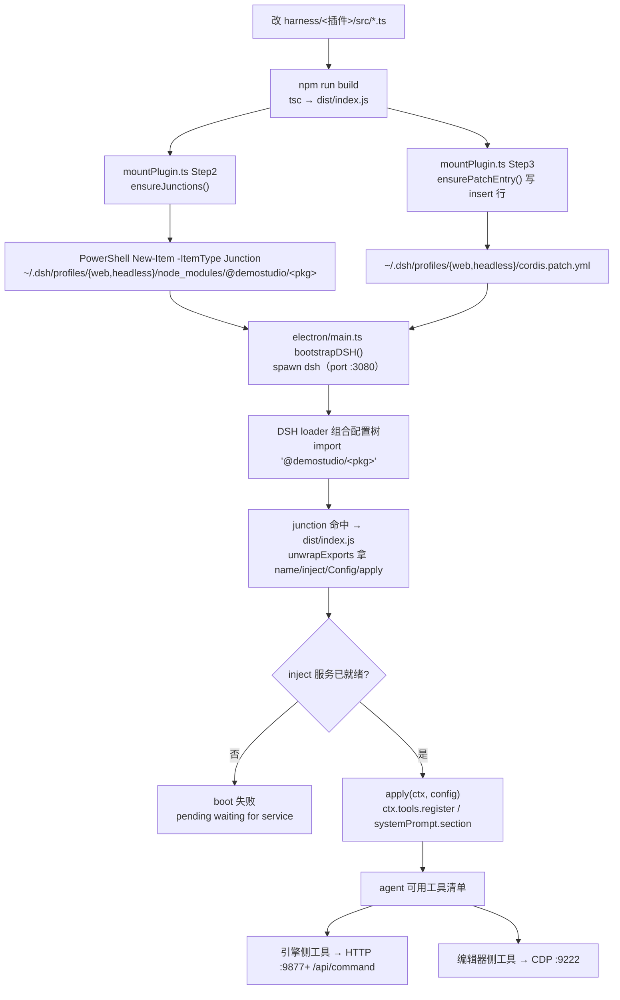

# Harness 工程：VS Code 扩展 + DSH 内核 + 引擎插件

> **一句话定位**：`harness/` 是 DemoStudio 仓库内的 **agent 工作台源码区**——9 个 DSH 插件包（能力本体）+ 1 个 VS Code 扩展壳（未被当前主链路使用）+ 1 份 DSH 内核源码克隆，共同回答一个问题：**agent 用的那些工具是从哪个目录编译、被谁挂载、又通过哪条通道摸到编辑器的**。
>
> **什么时候会用到你**：新增/修改一个 agent 插件工具、排查「改了插件代码没生效」「agent 说没有某某工具」、确认某段代码该放插件包还是别处、理解 MCP/HTTP/CDP 三条通道分别通向编辑器哪个进程。
>
> 代码位置：`harness/`

---

## 1. 先记住这几个文件/目录

| 文件 / 目录 | 一句话职责 | 你要改它的场景 |
|---|---|---|
| [ds-plugin-manager/src/tools/mountPlugin.ts](../../harness/ds-plugin-manager/src/tools/mountPlugin.ts) | 一键部署入口：`build → junction → patch → validate` 四步 | 新插件首次挂载、挂载失败排查 |
| [ds-engine-tools/src/index.ts](../../harness/ds-engine-tools/src/index.ts) | 引擎工具插件入口：`name`/`inject`/`apply`，导出 `ALL_TOOLS` | 加/删一个游戏运行时工具 |
| [ds-editor-tools/src/index.ts](../../harness/ds-editor-tools/src/index.ts) | 编辑器 UI 工具插件入口，7 个工具经 CDP 操控编辑器 | 加/删一个编辑器 UI 操作工具 |
| [vscode-ext/src/extension.ts](../../harness/vscode-ext/src/extension.ts) | VS Code 扩展壳 `activate`，自带一套 `KernelManager` + `EngineBridge` | **当前主链路不走这里**，看 §2.4 再决定要不要动 |

**关键心智模型**：`harness/` 里跑着**两套互不相同的装配方式**，别混。

- **真正在跑的（主链路）**：Electron 主进程 `electron/main.ts` 拉起 DSH 内核（`:3080`），内核启动时按 `~/.dsh/profiles/{web,headless}/cordis.patch.yml` 的 `insert` 行 import 插件包，包名经 **Windows junction** 解析到 `harness/<插件>/dist/index.js`。插件工具再通过 **HTTP 或 CDP** 反向摸编辑器。
- **仓库里有但当前未装配的**：`vscode-ext/`（VS Code 扩展壳）和 `harness/profile/`（内置 profile）。它们有完整源码，但目录内无 `dist/`、无 `node_modules/`，且 `profile/cordis.patch.yml` 引用了**不存在**的 `dsh-agent-service.cjs`。细节见 §2.4 与 §6 坑 1。

> 一句话：**改插件走主链路，别去动 `vscode-ext/`。**

---

## 2. 一次改动怎么生效：从改代码到 agent 用上新能力

### 2.1 谁启动了它

主链路上 DSH 内核由 Electron 主进程拉起（[electron/main.ts](../../electron/main.ts) `bootstrapDSH`），不是由 `harness/` 里的任何脚本启动：

```ts
const DSH_SOURCE_DIR = path.join(__dirname, '..', 'harness', 'dsh-source')
const DSH_PORT_DEFAULT = 3080
const DSH_STATE_DIR = path.join(__dirname, '..', 'cache', 'dsh-runtime')

// DSH 要求 Node.js ^22.19.0 || >=24.0.0，而 Electron 内置的 Node.js 版本较低
```

DSH CLI 由 `getDshCliPath()` 决定，它按候选顺序取第一个存在的文件：`npm root -g` 下的 `@deepseek-ai/dsh/lib/bin.js` → `where npm.cmd` 推导的全局 `node_modules` 同路径 → 全部落空则 `spawnDshAgent` 抛 `DSH CLI 不存在（本地和全局均未找到）`。启动必须经过 `scripts/dsh-agent-launcher.cmd`，因为 launcher 立即退出、让 agent 成为孤儿进程，从而躲开 vite-plugin-electron 的 `treeKillSync`（`taskkill /T /F`）连带误杀。

> **代码与报错文案不一致**：错误写着「本地和全局均未找到」，但 `getDshCliPath()` 实际只构建了**全局 npm** 两类候选，从未把 `harness/dsh-source` 的构建产物当作 CLI 候选——`DSH_SOURCE_DIR` 只作 `cwd` 和 git/npm 操作的执行目录（服务于 `dsh-switch-version`）。结论：**agent 实际跑的是全局 npm 安装的 DSH**，`harness/dsh-source` 是版本管理用的源码副本，不是运行时 CLI 来源。

拉起命令（[electron/main.ts](../../electron/main.ts) `spawnDshAgent`）：

```ts
const launcherPath = path.join(__dirname, '..', 'scripts', 'dsh-agent-launcher.cmd')
// ...
cwd: DSH_SOURCE_DIR,
stdio: 'ignore',        // launcher 自身的 stdio 不需要（DSH 输出已重定向到日志文件）
```

> **`cwd: DSH_SOURCE_DIR` 是 `harness/` 下所有「相对路径踩坑」的总根**。内核进程的工作目录是 `harness/dsh-source`，所以任何插件里写 `process.cwd()` 拼出来的目录都会落在源码克隆里。这是 §6 坑 2 的成因，也是每个目录型 config 都必须用绝对路径钉死的理由。

各子工程**没有统一的根级构建脚本**——仓库根 `package.json` 里 grep 不到任何 `harness` 相关 script。构建命令写在每个插件自己的 `package.json` 里，一律是 `npm run build`（tsc）：

```powershell
cd E:\DemoStudio\harness\ds-memory
npm install
npm run build      # tsc → dist/index.js
```

### 2.2 装配链路



逐段讲代码。

**① 挂载：四步合成一个工具**

[mountPlugin.ts](../../harness/ds-plugin-manager/src/tools/mountPlugin.ts) 是 agent 自己调的一键部署工具（`mount_plugin`），把 build / junction / patch / validate 串成一次调用：

```ts
// Step 2: Junction
// ⚠️ 必须传 entryId（去掉 @demostudio/ scope），junction.ts 内部会再拼 @demostudio 前缀；
// 传完整包名会导致 node_modules/@demostudio/@demostudio/<pkg> 嵌套错位（曾导致 web profile 启动失败）
const junctionResults: JunctionResult[] = ensureJunctions(pluginDir, entryId, dshHome)
```

> 为什么反复强调「传 `entryId` 而不是包名」：`ensureJunctions` 内部自己拼 `@demostudio/` 前缀。传全名会拼出 `@demostudio/@demostudio/ds-x` 双层目录，Node 解析不到，表现为「web profile 启动失败」这种看起来和 junction 毫无关系的症状。这是真踩过的（见 §6 坑 3）。

**② junction 必须用 PowerShell 建**

[junction.ts](../../harness/ds-plugin-manager/src/junction.ts) `ensureJunctionForProfile` 的创建段：

```ts
execFileSync('powershell', [
  '-NoProfile', '-Command',
  `New-Item -ItemType Junction -Path "${junctionPath}" -Target "${sourcePath}" | Out-Null`,
], { stdio: 'pipe', timeout: 10_000 })
```

> 为什么不用 `mklink /J`：Git Bash 会对 `/J` 做路径改写，报 `Invalid switch`。为什么不用 npm 拷贝：npm 对 `file:` 依赖是**拷贝**，改一次源码就得重装一次；junction 是目录链接，`dist/` 重建后内核下次加载即拿新代码。junction 还不需要管理员权限。

注意 `ensureJunctionForProfile` 开头读了 `fs.readlinkSync(junctionPath)` 比对目标，已存在且指向正确就返回 `skipped`——**幂等**，可反复跑。

**③ 插件入口：注册即副作用**

[ds-engine-tools/src/index.ts](../../harness/ds-engine-tools/src/index.ts)：

```ts
export const name = '@demostudio/ds-engine-tools'

/** 本插件访问的 Cordis 服务：tools（工具注册表）。logger 是 Context 内建属性，不走 inject。 */
export const inject = ['tools']

export function apply(ctx: DSHContext): void {
  if (typeof ctx.effect === 'function') {
    ctx.effect(() => registerTools(ctx))
  } else {
    registerTools(ctx)
  }
}

function registerTools(ctx: DSHContext): void {
  const tools = ctx.tools
  if (!tools || typeof tools.register !== 'function') return
  for (const tool of ALL_TOOLS) {
    tools.register(tool)
  }
}
```

> **为什么 `apply` 要判断 `ctx.effect` 存不存在**：Cordis 新旧版本注册入口不同（effect 版 vs 直调版）。判断存在性再分支，让同一份 `dist/index.js` 能在不同内核版本上跑，不用为每个内核版本发一个包。
>
> **为什么 `inject` 写得极度克制**：Cordis 的 `ctx` 是 Proxy，`apply` 里访问未在 `inject` 声明的键会直接抛 `cannot get property X without inject`。反过来，把 `logger` 这类**内建属性**写进 `inject` 也会炸——boot 卡在 `pending (waiting for service: logger)`。所以规则是：多一个键 boot 失败，少一个键运行时抛错，只写真正通过 fiber 解析的服务键。

**④ 工具怎么摸到编辑器：两个方向**

`ds-engine-tools`（游戏运行时）走编辑器 HTTP API，端口从 9877 起递增，与 [electron/main.ts](../../electron/main.ts) 的 `MCP_API_PORT_START = 9877` 对齐：

```ts
// engineBridge.ts（vscode-ext 侧实现，同构的还有 engineContext.ts 的 HttpEngineBridge）
const resp = await fetch(`http://127.0.0.1:${this.port}/api/command`, {
  method: 'POST',
  headers: { 'Content-Type': 'application/json' },
  body: JSON.stringify({ command: name, params: args }),
})
```

`ds-editor-tools`（编辑器 UI）走 CDP，[cdpBridge.ts](../../harness/ds-editor-tools/src/cdpBridge.ts) 连 Electron 已开启的调试端口：

```ts
const CDP_URL = 'http://127.0.0.1:9222'
// 懒连接：首次工具调用时才建立连接；断开后下次调用自动重建
```

> 编辑器开了 `--remote-debugging-port=9222`（[electron/main.ts:2171](../../electron/main.ts)），所以 CDP 这条通道不需要 `harness/` 额外起服务。两条通道的分工是硬的：改游戏运行时状态走 HTTP，点编辑器按钮/截图走 CDP，别交叉用。

**⑤ 插件拿 bridge 的三种来源**

[engineContext.ts](../../harness/ds-engine-tools/src/engineContext.ts) `getEngineContext` 按优先级找 bridge：ctx 直接注入 → `globalThis.__dshEngineCtx` → 环境变量 `DSH_ENGINE_PORT` 自建 `HttpEngineBridge`。三个都落空返回 `null`，工具会拿不到上下文。

### 2.3 验证闭环

改完插件后按这个顺序确认，每一步都能定位到具体失败环节：

```powershell
# 1. 编译产物是否刷新
Test-Path E:\DemoStudio\harness\<插件>\dist\index.js

# 2. junction 是否存在且指向正确
cmd /c dir "$env:USERPROFILE\.dsh\profiles\web\node_modules\@demostudio"

# 3. 配置树里是否有这一行
dsh web --dump-config | Select-String '<插件名>'

# 4. 运行时确认：起新会话问 agent「你有 xxx 工具吗」
```

最直接的验证是第 4 步——`--dump-config` 只能证明配置树里有这一行，**不能证明 `apply` 跑成功了**（`inject` 写错就是有行但 boot 卡住）。所以第 4 步不可替代。

> **web 与 headless 是两个 profile，两份 junction + 两份 patch 都要建**。只建一份会出现「一个 profile 能跑另一个不能」。`ensureJunctions` 内部已经对 `['web', 'headless']` 循环，别自己只写一半。

### 2.4 关于 `vscode-ext/`：仓库里有，但当前未装配

[vscode-ext/src/extension.ts](../../harness/vscode-ext/src/extension.ts) 有一套完整的自洽设计——`KernelManager`（[kernel.ts:35](../../harness/vscode-ext/src/dsh/kernel.ts)）选 adapter、`EngineBridge`（[engineBridge.ts:43](../../harness/vscode-ext/src/bridge/engineBridge.ts)）探测 9877+ 端口并自动拉起编辑器、`loadPluginTools`（[pluginBridge.ts:42](../../harness/vscode-ext/src/bridge/pluginBridge.ts)）require 插件 dist。源码可读、逻辑自洽，**但它是未被当前主链路使用的分支**，理由有三条硬事实：

1. 目录内无 `dist/`、无 `node_modules/`（`activate` 跑不起来，扩展从未被构建过）；
2. `activate` 里 `pluginDist` 拼的是 `path.resolve(context.extensionPath, '..', '..', 'ds-engine-tools', 'dist', 'index.js')`——依赖扩展被装在 `harness/vscode-ext/` 下这个特定布局，而 `harness/ds-engine-tools/dist/` 当前不存在；
3. [profile/cordis.patch.yml](../../harness/profile/cordis.patch.yml) 的注释写着「此文件被 `dsh-agent-service.cjs` 自动创建的 profile 加载」，但全仓库 grep `dsh-agent-service` 只在这两处注释里命中，**没有这个脚本的实现**。

`pluginBridge.ts` 自己的文件头注释也承认了这一点：

```ts
* 第一版简化：ds-engine-tools 工具不与 DSH runtime 真集成，而是由 vscode-ext 直接 import
* 插件的 `ALL_TOOLS` 并通过一个轻量"AgentExecutor"绑定到 KernelAdapter 事件流。
* 等 DSH SDK 提供 `defineTool` 工具装饰器（FR-4.1）稳定后，迁移到真 DSH registration。
```

> 结论：这个壳是**规划中/未落地**的过渡方案。当前 agent 能力的真实装配路径是 §2.2 的 junction + patch，不是 VS Code 扩展。改 `vscode-ext/` 不会改变任何 agent 行为。

---

## 3. 工程清单

`harness/` 下 9 个 DSH 插件包 + 1 个扩展壳 + 1 份内核源码 + 1 份 profile。构建方式**完全一致**：`npm install` → `npm run build`（tsc）→ `dist/index.js`。

| 目录 | 职责 | `inject` | 与其他文档的分工 |
|---|---|---|---|
| [ds-engine-tools/](../../harness/ds-engine-tools) | 游戏运行时工具 9 个（HUD/场景大纲/UI 大纲/资产/鼠标键盘模拟/AI 事件） | `['tools']` | 本文档 §2 |
| [ds-editor-tools/](../../harness/ds-editor-tools) | 编辑器 UI 工具 7 个，经 CDP :9222 点击/输入/截图/发 AI 事件 | `['tools']` | 本文档 §2.2 ④ |
| [ds-memory/](../../harness/ds-memory) | 记忆系统：4 个 memory_* 工具 + 常驻记忆指导段 + 回合末提醒 | `['tools','systemPrompt']` | 挂载细节见 [插件安装](./dsh_plugin_install.md) |
| [ds-feedback/](../../harness/ds-feedback) | 反馈飞轮：规则库段（order 3100）+ rule_propose/rule_apply | `['tools','systemPrompt']` | [数据飞轮计划](./dsh_data_flywheel_plan.md) |
| [ds-experience/](../../harness/ds-experience) | 经验飞轮：经历存取与检索 | `['tools','systemPrompt','sessionQuery']` | [数据飞轮计划](./dsh_data_flywheel_plan.md) |
| [ds-instructions/](../../harness/ds-instructions) | 目录指令：读文件触发 `.dsh/instructions/*.md` 注入 | `['tools','systemPrompt']` | [ds-instructions PRD](./dsh_instructions_prd_revised.md) |
| [ds-sync/](../../harness/ds-sync) | 启动时把 `~/.dsh` 记忆/skills/profiles/presets 同步到项目 `.dsh` | `[]` | [插件安装](./dsh_plugin_install.md) §3 |
| [ds-context-warning/](../../harness/ds-context-warning) | 上下文水位告警（100/200/250/300K 阈值） | `[]` | 本文档总览 |
| [ds-plugin-manager/](../../harness/ds-plugin-manager) | 管理上面这些插件：create/mount/unmount 三个工具 | `['tools']` | 本文档 §2.2 ①② |
| [vscode-ext/](../../harness/vscode-ext) | VS Code 扩展壳（自带 KernelManager + EngineBridge） | — | **未装配**，见 §2.4 |
| [profile/](../../harness/profile) | 内置 profile 与 skills；实际生效的是 `~/.dsh` | — | [插件安装](./dsh_plugin_install.md) 踩坑 3 |
| [dsh-source/](../../harness/dsh-source) | DSH 内核源码克隆（.gitignore 忽略），只消费不改 | — | [DSH 引擎集成](./dsh_engine_integration.md) |

> `ds-engine-tools/package.json` 的 `description` 仍写着 PRD 初期的 5 个工具名（`inspect_scene`/`spawn_entity`/`run_scenario`/`get_game_state`/`set_game_speed`），但 `src/index.ts` 里 `ALL_TOOLS` 实际是另外 9 个。**描述与实现已经不同步**——以源码为准（见 §6 坑 4）。

---

## 4. 关键方法/脚本速查

| 名称 | 位置 | 干什么 | 注意 |
|---|---|---|---|
| `mountPluginTool` | [mountPlugin.ts:25](../../harness/ds-plugin-manager/src/tools/mountPlugin.ts) | 一键部署：build → junction → patch → validate | 只接受 `harness/` 下的目录，越界直接拒绝 |
| `ensureJunctions` | [junction.ts:82](../../harness/ds-plugin-manager/src/junction.ts) | 为 web+headless 各建一个 junction | **传裸包名**，内部会拼 `@demostudio/` |
| `unmountPluginTool` | [unmountPlugin.ts:24](../../harness/ds-plugin-manager/src/tools/unmountPlugin.ts) | 移除 junction + 删除 patch insert 行 | 与 mount 侧同用 `entryId` |
| `apply`（引擎工具） | [ds-engine-tools/src/index.ts:41](../../harness/ds-engine-tools/src/index.ts) | 注册 9 个运行时工具 | `inject=['tools']`，多写少写都 boot 失败 |
| `apply`（编辑器工具） | [ds-editor-tools/src/index.ts:43](../../harness/ds-editor-tools/src/index.ts) | 注册 7 个 CDP 工具，effect 卸载时 `disconnectCDP()` | 与引擎工具按通道分工，不交叉 |
| `apply`（记忆） | [ds-memory/src/index.ts:69](../../harness/ds-memory/src/index.ts) | 注册 4 个 memory 工具 + 指导段 + 回合末提醒 | 提醒有 60s 冷却 |
| `getEngineContext` | [engineContext.ts:152](../../harness/ds-engine-tools/src/engineContext.ts) | 三种来源找 bridge（ctx / globalThis / env port） | 全落空返回 `null` |
| `getEditorPage` | [cdpBridge.ts:24](../../harness/ds-editor-tools/src/cdpBridge.ts) | 懒连接 + 自动重连 CDP :9222，共享 Page | 编辑器需已开 remote-debugging |
| `probePort` | [engineBridge.ts:175](../../harness/vscode-ext/src/bridge/engineBridge.ts) | 9877→9927 逐个 `GET /api/status` 探活 | 属 `vscode-ext/`（未装配），仅作对照 |
| `resolveRuntimeLaunch` | [kernel.ts:126](../../harness/vscode-ext/src/dsh/kernel.ts) | 决定 DSH CLI 路径（env → dsh-source → 全局） | 同上，未装配 |
| `activate` | [extension.ts:25](../../harness/vscode-ext/src/extension.ts) | 扩展壳装配 10 步 | 同上，未装配 |

---

## 5. 流程影响：牵动哪些功能

### 上游：谁驱动它

| 上游 | 怎么驱动 | 相关文档 |
|---|---|---|
| Electron 主进程 | `bootstrapDSH()` 探测/认领 `:3080`，否则 spawn DSH 内核，内核加载插件 | [DSH 引擎集成](./dsh_engine_integration.md) |
| `~/.dsh/profiles/{web,headless}/cordis.patch.yml` | `insert` 行决定哪些插件进配置树 | [插件安装](./dsh_plugin_install.md) |
| Windows junction | 决定包名能否解析到 `harness/<插件>/dist` | [插件安装](./dsh_plugin_install.md) |
| 开发者 `npm run build` | 产出 `dist/index.js`，junction 指向它 | 本文档 §2.1 |
| 编辑器 HTTP API（`:9877+`） | `/api/command`、`/api/status`、`/api/console-logs` | [MCP 集成](../editor/integration/mcp_integration.md) |

### 下游：它波及谁

| 下游功能 | 波及点 | 相关文档 |
|---|---|---|
| 插件挂载与加载 | 全部 9 个插件包按同一机制挂载，junction/patch 细节归该文档 | [插件安装](./dsh_plugin_install.md) |
| 引擎集成与自愈 | 内核由 Electron 拉起（`:3080`），常驻化/崩溃自愈归该文档 | [DSH 引擎集成](./dsh_engine_integration.md) |
| 斜杠命令 | 复用同一 AgentService 通道，`skill.list` 等 RPC | [斜杠命令](./slash_command_system.md) |
| Preset 同步 | `ds-sync` 镜像 `~/.dsh/.agent-presets` → 项目 `.dsh/presets` | [Preset 同步](./preset-sync-mechanism.md) |
| 数据飞轮 | `ds-feedback` / `ds-experience` 同机制挂载，规则库与经验库 | [数据飞轮计划](./dsh_data_flywheel_plan.md) |
| 飞轮验收 | ds-feedback/ds-experience 的测试用例 | [数据飞轮测试用例](./dsh_data_flywheel_test_cases.md) |
| Agent 面板 | 插件注册的工具进入 agent 可调用清单，面板展示 | [Agent 面板](../editor/integration/agent_panel_system.md) |
| 引擎工具调用 | `editor/mcp-server.mjs` 提供 MCP stdio 通道 | [MCP 集成](../editor/integration/mcp_integration.md) |

---

## 6. 踩坑清单

**1. 把 `vscode-ext/` 当成当前装配路径**

现象：改了 `vscode-ext/src/` 的代码，agent 行为毫无变化。
原因：该扩展从未被构建（无 `dist/`、无 `node_modules/`），且 `profile/cordis.patch.yml` 引用的 `dsh-agent-service.cjs` 在全仓库只存在于两处注释里，没有实现。
规则：认准主链路是 Electron → DSH → junction + patch。`vscode-ext/` 是未落地的过渡方案，改它不改变任何 agent 行为。

**2. 以 `harness/dsh-source` 为 cwd 拉起内核，相对路径全偏**

现象：插件里用 `process.cwd()` 拼的目录落在 `dsh-source` 下，找不到项目文件。
原因：`spawnDshAgent` 里 `cwd: DSH_SOURCE_DIR`。
规则：目录型 config（`memoryDir`/`ruleDir`/`experienceDir`/`projectRoot`/`instructionsDir`）用**绝对路径**在 patch 里钉死。`ds-instructions` 的 README 也明确写了 `projectRoot` 必须显式配置，就是这个原因。

**3. `ensureJunctions` 传了完整包名导致 profile 启动失败**

现象：junction 建出来了，但 web profile 启动失败。
原因：`ensureJunctions` 内部会自己拼 `@demostudio/` 前缀，传 `@demostudio/ds-x` 会拼出 `node_modules/@demostudio/@demostudio/ds-x` 嵌套错位。
规则：传 `entryId`（剥掉 scope 的裸包名）。`mountPlugin.ts` 里 `pkgName.replace(/^@demostudio\//, '')` 就是干这个的。

**4. 把 PRD 里的「5 个工具」当成现状**

现象：照旧文档 grep `inspect_scene`/`spawn_entity`，一个都找不到。
原因：`ds-engine-tools/package.json` 的 `description` 还写着 PRD 初期的 5 个工具名，但 `src/index.ts` 的 `ALL_TOOLS` 实际是 9 个（emitAIEvent / mouseClick / mouseMove / mouseDrag / keyPress / getHUD / getSceneOutline / getUiOutline / getAssets）。
规则：**写调用链前 grep 确认符号存在**。package.json 的 description 和 PRD 需求清单都不等同于当前代码。

**5. `inject` 多写内建属性导致 boot 卡死**

现象：boot 报 `pending (waiting for service: logger)`，内核一直起不来。
原因：`inject` 数组里写了 `'logger'`，但 logger 是 Context 内建属性、不是可注入服务键。
规则：`inject` 只声明通过 fiber 解析的服务键，取具名 logger 用 `ctx.logger('名字')`。反过来漏声明也会抛 `cannot get property X without inject`。

**6. Git Bash 下 `mklink /J` 报 Invalid switch**

现象：建 junction 失败。
原因：Git Bash 对 `/J` 做路径改写。
规则：一律用 `powershell New-Item -ItemType Junction`（`junction.ts` 就是这么写的）。junction 不需要管理员权限。

**7. 只建了一个 profile 的挂载**

现象：web profile 能跑，headless 不能（或反之）。
原因：两个 profile 是两份独立的 junction + 两份独立的 patch。
规则：`ensureJunctions` 已对 `['web','headless']` 循环；手写时两边都要建。

**8. 误以为 `harness/dsh-source` 就是编辑器实际运行的内核**

现象：改了 `dsh-source` 的构建产物，编辑器 agent 行为没变。
原因：`getDshCliPath()` 只把**全局 npm** 的 `@deepseek-ai/dsh` 作为 CLI 候选，`harness/dsh-source` 从未进入候选列表（它只当 `cwd` 和版本切换目录）。运行时 CLI 与源码副本是两套。
规则：改内核行为要动全局 npm 那套，或走 `dsh-switch-version`（git checkout + pnpm install + pnpm run build）重建后再确认。切换/版本管理见 [DSH 引擎集成](./dsh_engine_integration.md)。

---

## 7. 边界条件

| 条件 | 行为 | 怎么应对 |
|---|---|---|
| 插件未编译（无 `dist/index.js`） | import 失败，boot 报模块解析错误 | 插件目录 `npm run build` |
| `inject` 写了不可注入的键 | boot 卡 `pending (waiting for service: X)` | 从 `inject` 删除，`logger` 走内建属性 |
| `inject` 漏了要用的键 | `apply` 里访问时抛 `cannot get property X without inject` | 补进 `inject` |
| junction 指向的目录被删除 | 包名解析失败，boot 报模块找不到 | 重建 junction（`mount_plugin` 幂等，可重跑） |
| 编辑器以 `dsh-source` 为 cwd | 基于 `process.cwd()` 的默认路径全偏 | 目录型 config 用绝对路径钉死 |
| `enabled: false` | `apply` 直接 return，section/工具/监听全不注册 | 无需删行即可静默停用 |
| web profile（`patchReload: live`） | 改 patch 或 rebuild 后热重挂 | 无需重启内核 |
| headless 一次性进程 | 无热重载，改动下次启动才生效 | 每次改动后重启内核 |
| `mount_plugin` 传入 `harness/` 外的目录 | 直接拒绝：`只能操作 harness/ 目录下的插件` | 安全限制，不可绕过 |
| `dist/` 已存在且未传 `forceBuild` | 跳过 build 步骤（`skipped`） | 改过源码必须传 `forceBuild: true` |
| 端口漂移（多开编辑器） | 编辑器 HTTP 从 9877 起递增 | 先探测再连；CDP 固定 9222，不受影响 |
| DSH CLI 本地与全局都不存在 | `bootstrapDSH` 失败 → `degraded` 终态，不阻断编辑器其余功能 | 装 `@deepseek-ai/dsh` 或构建 `dsh-source` |
| `getEngineContext` 三种来源全空 | 返回 `null`，工具拿不到 bridge | 检查 ctx 注入 / `globalThis.__dshEngineCtx` / `DSH_ENGINE_PORT` |
| 插件改源码后未重建 | junction 指向目录本身，但内核加载的是旧 `dist/` | 必须 `npm run build`，junction 不会自动编译 |
