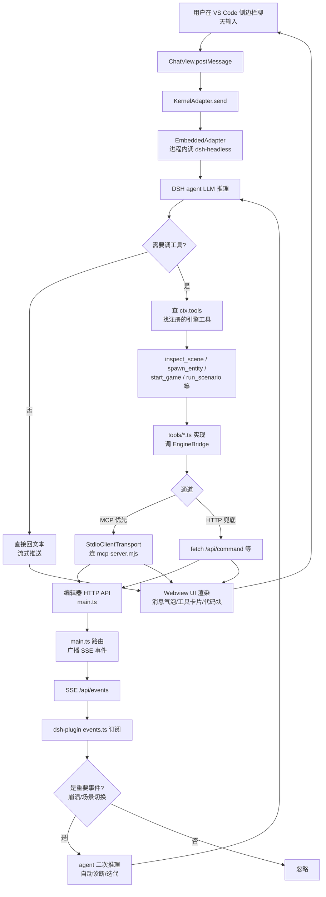

# DemoStudio Harness 工程（VS Code 扩展 + DSH 内核集成 + 引擎特化插件）

> DemoStudio 仓库内的 agent 工作台工程：在 VS Code 中以原生体验连接 DeepSeek Harness（DSH）内核，让 agent 完成"改代码 → 启动游戏 → 读日志 → 迭代"闭环。
> 代码位置：`harness/`（VS Code 扩展 + DSH 插件包 + DSH Profile + DSH 源码克隆）
> 相关文档：[系统总览](../system_overview.md) / [AI 事件系统](../engine/ai_system.md) / [编辑器核心](../editor/core_system.md)

## 1. 概述

### 1.1 背景

DemoStudio 游戏编辑器目前仅能通过通用 MCP 工具（`mcp-server.mjs`）进行粗粒度控制，缺少：

- **原生 VS Code 体验的 agent 工作台**（侧边栏聊天、状态栏、终端、文件资源管理器集成）
- **与引擎深度耦合的特化 agent 能力**（场景检查、实体生成、测试闭环、崩溃自动诊断等）

### 1.2 目标

在 `harness/` 下构建一个三分区工程，对外提供 VSIX 扩展，让用户安装后在 VS Code 内打开 DemoStudio 仓库即可：

1. 聊天侧边栏调用 DSH agent
2. agent 通过引擎特化工具直接操控编辑器/游戏（启动/停止/读日志/检查场景）
3. 引擎事件（生命周期/崩溃/场景/AI）实时推送到 agent，触发自动响应（如崩溃自动诊断）
4. agent 写文件改动通过 VS Code 资源管理器与 Git 面板可见

### 1.3 核心设计决策

| 决策 | 方案 | 理由 |
|---|---|---|
| 内核运行方式 | **进程内 import** `@deepseek-ai/dsh-headless` | 启动快、可直接访问 Cordis 上下文、便于事件流透传；DSH 升级需重装扩展但符合"先内置优先"原则 |
| 内核来源 | 从 GitHub `clone deepseek-ai/deepseek-harness` 到 `harness/dsh-source/`，本地 `tsc` 构建后作为 vscode-ext 依赖 | 全量打包进 VSIX，内置优先；不修改 DSH 源码，只消费构建产物 |
| 内核交互边界 | **KernelAdapter 接口**集中在 `harness/vscode-ext/src/dsh/adapter.ts` | UI/命令/EngineBridge 仅依赖接口，未来切换 CLI stdio 模式不改上层 |
| 引擎通信 | **EngineBridge 双通道**：MCP 客户端（复用 `mcp-server.mjs`）+ HTTP 兜底（直接调编辑器 API） | MCP 优先；HTTP 用于快速操作（如 `get_status`、`read_console_logs`） |
| 引擎事件推送 | **编辑器新增 SSE 端点**（仅绑定 `127.0.0.1`），4 类事件：game.lifecycle / game.error / scene.change / ai.event | 实时性 < 1s；SSE 断线时自动重连 + 轮询 `console-logs` 兜底 |
| agent 工具来源 | **DSH 原生工具**（`ctx.tools.register` + `defineTool`），不复用 MCP 服务器 | MCP 给 VS Code 内置 agent 用；DSH agent 走 Cordis 工具注册 |
| 工程结构 | **三分区**：`vscode-ext/`（扩展工程）+ `dsh-plugin/`（插件包）+ `profile/`（DSH Profile 配置） | 三层职责单一入口，便于独立版本化 |
| 产物打包 | `vsce package` 全量打包（含 dsh-headless 及其依赖），`.vscodeignore` 仅排除源码/测试 | 用户全新环境安装即用 |
| 协议层 | 沿用 DSH 原生事件流格式，**薄协议层只做透传** | 不重新发明协议 |
| 端口 | 编辑器 HTTP/SSE 仅绑定 `127.0.0.1`；端口探测从 `9877` 起递增 | 避免暴露到外网；多实例兼容 |

### 1.4 责任表

| 层 | 模块 | 职责 | 不做 |
|---|---|---|---|
| VS Code 扩展 | `extension.ts` | activate/deactivate、生命周期、命令注册、状态栏 | 直接调 DSH API / 直接调引擎 API |
| VS Code 扩展 | `dsh/adapter.ts` | KernelAdapter 抽象接口定义 | 任何 DSH 具体实现 |
| VS Code 扩展 | `dsh/embeddedAdapter.ts` | 进程内 import dsh-headless 实现 | UI 渲染 / 引擎调用 |
| VS Code 扩展 | `bridge/engineBridge.ts` | MCP + HTTP 双通道桥接引擎 | 直接调 DSH API / 渲染 UI |
| VS Code 扩展 | `ui/chatView.ts` + `ui/chatApp/` | WebviewView + React 18 聊天 UI | 直接调内核 / 引擎 API |
| DSH 插件包 | `dsh-plugin/src/` | 注册引擎特化工具、守卫、事件联动、UI 槽 | 直接调 DSH 内部 API（只调 ctx.* 公开接口） |
| DSH Profile | `profile/dsh.profile`、`cordis.patch.yml`、`skills/` | 声明插件包依赖 + persona 提示词 + 技能目录 | 业务逻辑 |
| DSH 源码 | `dsh-source/` | 本地克隆并构建，供 vscode-ext 引用 | 修改（仅 clone） |

## 2. 核心类 / 模块

| 类 / 模块 | 说明 |
|---|---|
| `KernelAdapter`（`harness/vscode-ext/src/dsh/adapter.ts`） | 内核抽象接口：`start/stop/send/on/version/health`；上层唯一依赖 |
| `EmbeddedKernelAdapter`（`dsh/embeddedAdapter.ts`） | 进程内 `import @deepseek-ai/dsh-headless`，调 `createHeadless()` 获取 Cordis ctx |
| `KernelManager`（`dsh/kernel.ts`） | 包装 Adapter + 启动/停止/健康检查/自动重启（最多 3 次）+ 崩溃日志 |
| `KernelUpdater`（`dsh/updater.ts`） | 启动时 + 每日一次查 npm registry，与本机版本比对；新版提示状态栏 + 一键更新 |
| `EngineBridge`（`bridge/engineBridge.ts`） | 端口探测（9877+ 递增）→ 自动拉起（`npm run dev`）→ MCP/HTTP 双通道工具调用 |
| `ChatViewProvider`（`ui/chatView.ts`） | `WebviewViewProvider` 实现，托管 webview 与 DSH 事件流 |
| `ChatApp`（`ui/chatApp/`） | React 18 + Webview UI Toolkit 聊天 UI：流式消息、工具卡片、代码块、@提及 |
| `StatusBarManager`（`ui/statusBar.ts`） | 状态栏：引擎状态 + 内核版本 + 更新徽标；点击跳转命令 |
| `tools/inspectScene`（`dsh-plugin/src/tools/inspectScene.ts`） | 读场景 JSON，返回 Actor/组件摘要 |
| `tools/spawnEntity`（`dsh-plugin/src/tools/spawnEntity.ts`） | 经 EngineBridge 调 `ai.spawnActor` 生成 Actor |
| `tools/runScenario`（`dsh-plugin/src/tools/runScenario.ts`） | 启动测试场景 → 等结果 → 返回 |
| `tools/getGameState`（`dsh-plugin/src/tools/getGameState.ts`） | 经 EngineBridge 调 `ai.getState` 拿快照 |
| `tools/setGameSpeed`（`dsh-plugin/src/tools/setGameSpeed.ts`） | 经 EngineBridge 调 time scale |
| `guards.ts`（`dsh-plugin/src/guards.ts`） | 工具守卫：高危操作默认 `ask`，可配置 |
| `events.ts`（`dsh-plugin/src/events.ts`） | 引擎事件 → agent 行动联动（如崩溃自动诊断） |
| `slots.tsx`（`dsh-plugin/src/slots.tsx`） | UI 槽：工具结果渲染文本卡片（场景摘要、游戏状态面板、console 摘要） |

## 3. 使用方法

### 3.1 用户使用（开发/调试场景）

```bash
# 1. 安装 VSIX
code --install-extension harness/vscode-ext/demostudio-harness-0.1.0.vsix

# 2. 打开 DemoStudio 仓库
code e:/DemoStudio

# 3. 自动行为
# - 激活扩展 → 内置 DSH 内核自动启动（OutputChannel "DSH" 可见日志）
# - 状态栏显示引擎状态；未启动时点击可触发自动拉起
# - 侧边栏点开 DSH 聊天 → 输入"启动游戏" → agent 调用 start_game → 引擎拉起

# 4. 典型闭环演示（agent 对话）
# 用户："把 eatfish 项目的鱼游速调快一倍，然后跑一局游戏，把最后分数告诉我"
#   → agent: 编辑 eatfish/config/*.config.json → save
#   → agent: start_game → 等 30s → get_game_state → stop_game
#   → agent: 报告最终分数 + 改动文件列表
```

### 3.2 扩展调用 KernelAdapter（程序入口）

```ts
// harness/vscode-ext/src/extension.ts
import { KernelManager } from './dsh/kernel'

const kernel = new KernelManager(new EmbeddedKernelAdapter())
await kernel.start({ profile: 'demostudio' })

// 订阅事件流
kernel.on('message', (msg) => chatView.postMessage(msg))
kernel.on('toolCall', (call) => chatView.showToolCard(call))

// 发送用户消息
await kernel.send({ role: 'user', content: '启动游戏' })

// 健康检查 + 关闭
if (kernel.health()) await kernel.stop()
```

### 3.3 插件包注册 DSH 原生工具

```ts
// harness/dsh-plugin/src/index.ts
import { Context } from 'cordis'
import { defineTool } from '@deepseek-ai/dsh-headless'
import { z } from 'zod'

export const name = '@demostudio/dsh-engine-tools'

export function apply(ctx: Context) {
  ctx.tools.register(defineTool({
    name: 'inspect_scene',
    description: '读取 DemoStudio 当前场景的结构摘要（Actor 列表、组件类型、位置）',
    parameters: z.object({
      scenePath: z.string().optional().describe('场景资产路径，省略时取当前打开场景'),
    }),
    async execute(args, ctx) {
      // 仅依赖 EngineBridge / HTTP API，不依赖 DSH 内部
      const bridge = (ctx as any).engineBridge  // 由扩展注入
      return await bridge.inspectScene(args.scenePath)
    },
  }))
}
```

### 3.4 配置项（`contributes.configuration`）

| 键 | 类型 | 默认 | 说明 |
|---|---|---|---|
| `dsh.autoStartEngine` | boolean | `true` | 激活时自动拉起编辑器 |
| `dsh.enginePort` | number | `0` | `0` = 自动探测（9877 起递增） |
| `dsh.engineCommand` | string | `npm run dev` | 拉起编辑器命令 |
| `dsh.guardPolicy` | object | 高危工具 `ask` | 工具守卫策略（allow/deny/ask） |
| `dsh.enableEngineEvents` | boolean | `true` | 引擎事件 → agent 联动开关 |
| `dsh.checkUpdates` | boolean | `true` | 更新检查开关 |

## 4. 工作流程

### 4.1 工程结构（三分区）

```
E:\DemoStudio\harness\
├── vscode-ext/                    # VS Code 扩展工程
│   ├── package.json               # contributes: commands/views/configuration/mcpServers
│   ├── tsconfig.json
│   ├── .vscodeignore
│   ├── src/
│   │   ├── extension.ts           # activate/deactivate、生命周期
│   │   ├── dsh/
│   │   │   ├── adapter.ts         # ★ KernelAdapter 抽象接口（上层唯一依赖）
│   │   │   ├── embeddedAdapter.ts # 内置实现：import dsh-headless（进程内）
│   │   │   ├── kernel.ts          # 启动/停止/健康检查/自动重启
│   │   │   └── updater.ts         # npm 版本检查与更新
│   │   ├── bridge/
│   │   │   └── engineBridge.ts    # ★ 唯一接触引擎（MCP + HTTP 双通道）
│   │   ├── ui/
│   │   │   ├── chatView.ts        # WebviewViewProvider
│   │   │   └── chatApp/           # React + Webview UI Toolkit 聊天 UI
│   │   │       ├── index.tsx
│   │   │       ├── ChatPanel.tsx
│   │   │       ├── MessageBubble.tsx
│   │   │       ├── ToolCard.tsx
│   │   │       ├── CodeBlock.tsx
│   │   │       └── InputBox.tsx
│   │   └── commands.ts            # 命令面板命令注册
│   ├── media/                     # Webview 静态资源（CSS/图标）
│   └── esbuild.js                 # 扩展主体 esbuild 构建脚本
├── dsh-plugin/                    # DSH 插件包（@demostudio/dsh-engine-tools）
│   ├── package.json
│   ├── tsconfig.json
│   ├── src/
│   │   ├── index.ts               # name/inject/apply
│   │   ├── tools/
│   │   │   ├── inspectScene.ts
│   │   │   ├── spawnEntity.ts
│   │   │   ├── runScenario.ts
│   │   │   ├── getGameState.ts
│   │   │   └── setGameSpeed.ts
│   │   ├── guards.ts              # 工具守卫
│   │   ├── events.ts              # 引擎事件联动
│   │   └── slots.tsx              # UI 槽（文本卡片）
│   └── tsconfig.json
├── profile/                       # DSH profile 配置
│   ├── package.json               # 声明 dsh-engine-tools 依赖
│   ├── dsh.profile                # bundles 清单
│   ├── cordis.patch.yml           # persona / 提示词补丁
│   └── skills/                    # 引擎知识技能（预留目录）
│       └── .gitkeep
└── dsh-source/                    # DSH 源码（git clone deepseek-ai/deepseek-harness）
    └── ...                        # 本地 tsc 构建后作为 vscode-ext 依赖
```

### 4.2 整体闭环（"改代码 → 启动游戏 → 读日志 → 迭代"）



### 4.3 分阶段说明

#### M0：扩展骨架（基础可运行）

- `vscode-ext/` 工程初始化：`package.json`（contributes: 7 个命令 + 1 个侧边栏视图 + 6 个配置项 + mcpServers）
- 7 个命令面板命令占位（`DSH: 打开聊天/启动引擎/停止引擎/启动游戏/停止游戏/重启内核/检查内核更新`）
- 状态栏占位（引擎状态显示 "未启动" / "运行中" / "游戏运行中"）
- 空 WebviewView 聊天侧边栏（React + Webview UI Toolkit，显示 "DSH 内核尚未启动" 占位）
- OutputChannel "DSH" 接入，扩展自身日志走该通道
- `vsce package` 成功产出 `.vsix`，本地安装无报错

#### M1：引擎桥（端口探测 + 自动拉起 + SSE）

- 编辑器 `main.ts` 新增 `/api/events` SSE 端点（仅绑定 `127.0.0.1`）
- 4 类事件：`game.lifecycle`（launch/stop/crash）/ `game.error`（console.error/未捕获/WebGL context lost）/ `scene.change`（加载/切换/Actor 增减）/ `ai.event`（AIModule 现有事件）
- EngineBridge：端口探测（9877 起递增，`GET /api/status`）→ 未运行时自动拉起（`npm run dev`）→ MCP/HTTP 双通道
- 多实例支持（`--port` 语义对齐 `editor_mcp.bat`）
- 引擎不可达时工具返回明确错误，扩展侧不崩溃

#### M2：内核接入（dsh-headless 进程内 + 事件流透传）

- `KernelAdapter` 接口定型 + `EmbeddedAdapter` 实现（`import @deepseek-ai/dsh-headless`，调 `createHeadless()` 拿 Cordis ctx）
- KernelManager：启动/停止/健康检查/自动重启（最多 3 次，避免死循环）+ 崩溃日志保留
- 消息协议：沿用 DSH 原生事件流格式，薄协议层只做透传到 ChatView
- WebviewView 流式渲染 + 工具卡片 + 代码块 + @提及

#### M3：闭环（EngineBridge 工具注入 agent）

- 插件包通过 profile 的 `dsh.profile.bundles` 加载
- 5 个引擎特化工具：`inspect_scene` / `spawn_entity` / `run_scenario` / `get_game_state` / `set_game_speed`
- 工具守卫：高危操作（启动游戏、重置场景、批量删除）默认 `ask`，可配 `allow`/`deny`
- 工具实现只依赖 EngineBridge 或编辑器 HTTP API，不依赖 DSH 内部 API
- 端到端演示："改代码 → 启动游戏 → 读日志 → 迭代"

#### M4：特化插件包 + 更新检查器 + 专家 persona

- 工具守卫策略对象化（`dsh.guardPolicy`）
- 引擎事件联动：崩溃自动诊断流程
- 引擎专家 persona（`cordis.patch.yml` 精简版系统提示词：DemoStudio 目录结构 + 关键 API + 引擎架构概要）
- UI 槽：工具结果渲染文本卡片（场景摘要、游戏状态面板、console 摘要），通过 `ctx.slots` 注册
- 引擎知识技能：`harness/profile/skills/` 预留 markdown 技能文件夹（第一版只建目录结构），通过 `ctx.skills.registerProvider` 注册
- 更新检查器：启动时 + 每日一次查 npm registry，与本机版本比对；有新版状态栏提示 + 一键更新（`npm i -g @deepseek-ai/dsh`）

### 4.4 设计要点

- **三层边界单一入口**：DSH 交互走 `dsh/adapter.ts`、引擎交互走 `bridge/engineBridge.ts`、插件包通过 profile 注册。三层各管一段，互不越界。
- **DSH 升级解耦**：所有 DSH API 集中于 `dsh/adapter.ts` 与 `dsh-plugin/`，DSH 升级 API 变更只影响这两处；UI / 命令 / EngineBridge 通过接口稳定。
- **场景文件直改**：M3 起允许 agent 直接读写项目场景 `.json` 文件（经 VS Code 文件系统 `vscode.workspace.fs`），编辑器侧复用现有 `fs.watch` + IPC `asset-changed` 机制检测外部文件变更。
- **协议层透传**：聊天 UI 看到的就是 DSH 原生事件流（消息 / 工具调用 / 工具结果 / 流式 token），不在中间层重新建模。
- **SSE 仅本地**：服务端绑定 `127.0.0.1`，避免暴露外网；断线重连 + 轮询兜底保证可靠性。
- **薄桥接层**：MCP client 是 thin wrapper（5 行代码）；HTTP 通道是 `fetch` 直调；两通道复用 EngineBridge 的统一 API。

## 5. 边界条件

| 条件 | 行为 / 后果 | 处理方式 |
|---|---|---|
| 编辑器未运行 | 桥接层工具调用失败 | EngineBridge 自动拉起（`npm run dev`），启动过程状态栏显示进度 |
| 端口被占用 | 自动探测 9877+ 递增 | `enginePort = 0` 时自动；`enginePort = N` 时直连 N，失败则明确报错 |
| DSH 内核加载失败 | 启动命令报"DSH 不可用" | 状态栏红点 + 提示检查 `harness/dsh-source/` 构建状态 + 引导 `npm run build` |
| DSH 内核崩溃 | 进程异常退出 | KernelManager 自动重启，最多 3 次，超过则报错并保留崩溃日志到 OutputChannel |
| 引擎进程被外部关闭 | 状态栏不同步 | SSE 断线信号 + 引擎进程探活（轮询 `/api/status`），确认断开后状态降级 |
| SSE 断线 | 事件丢失 | 客户端自动 reconnect；服务端保留最近 100 条事件缓冲；彻底断时降级为轮询 `console-logs`（2s 间隔） |
| MCP 客户端断连 | MCP 通道工具不可用 | 自动重连；失败后 EngineBridge 切 HTTP 兜底 |
| 工具守卫拒绝 | 高危操作返回 `{ ok: false, error: 'requires approval' }` | agent 收到错误后询问用户，用户在 VS Code 弹窗或状态栏点确认 |
| 工作区切换 | 内核会话需清理 | `deactivate` 时清理内核资源与 MCP 连接；切换文件夹时按需重启内核/复用会话（按 workspace 路径映射） |
| VS Code 关闭 | 扩展退出 | `deactivate` 清理所有资源（内核、MCP、终端任务、SSE 订阅） |
| DSH 版本升级 | API 变更 | 适配层变更 + CHANGELOG；上层模块无感 |
| 场景文件外部改动 | 编辑器需感知 | 复用 `fs.watch` + IPC `asset-changed` 检测外部变更并提示刷新 |
| 多 DSH 实例 | profile 冲突 | 按 workspace 路径哈希生成唯一 profile 名；切换工作区复用/新建 |
| 网络受限（npm registry） | 更新检查失败 | 静默忽略，不打扰用户；状态栏不显示 |
| 插件包加载失败 | 工具不可用 | 启动日志明确报错；状态栏提示禁用引擎特化能力 |
| 全新环境首次激活 | 内核未就绪 / 引擎未拉起 | 状态栏引导："DSH: 启动引擎" + "DSH: 重启内核" 一键直达 |

## 6. 依赖关系 / 注册机制

### 6.1 模块依赖

```
extension.ts
  ├── dsh/kernel.ts → dsh/adapter.ts + dsh/embeddedAdapter.ts
  ├── dsh/updater.ts
  ├── bridge/engineBridge.ts → editor MCP / HTTP API
  ├── ui/chatView.ts → dsh/kernel.ts (事件流)
  ├── ui/statusBar.ts → bridge/engineBridge.ts (状态) + dsh/updater.ts (版本)
  └── commands.ts → dsh/kernel.ts + bridge/engineBridge.ts

dsh-plugin/src/index.ts (Cordis plugin)
  ├── tools/*.ts → bridge/engineBridge.ts (注入到 ctx.engineBridge)
  ├── guards.ts → ctx.tools 配置
  ├── events.ts → SSE 订阅
  └── slots.tsx → ctx.slots 注册
```

### 6.2 VS Code 扩展贡献

```jsonc
// harness/vscode-ext/package.json
{
  "contributes": {
    "commands": [
      { "command": "dsh.openChat",       "title": "DSH: 打开聊天" },
      { "command": "dsh.startEngine",    "title": "DSH: 启动引擎" },
      { "command": "dsh.stopEngine",     "title": "DSH: 停止引擎" },
      { "command": "dsh.startGame",      "title": "DSH: 启动游戏" },
      { "command": "dsh.stopGame",       "title": "DSH: 停止游戏" },
      { "command": "dsh.restartKernel",  "title": "DSH: 重启内核" },
      { "command": "dsh.checkUpdate",    "title": "DSH: 检查内核更新" }
    ],
    "viewsContainers": {
      "activitybar": [{
        "id": "dsh",
        "title": "DSH",
        "icon": "assets/dsh-icon.svg"
      }]
    },
    "views": {
      "dsh": [{ "type": "webview", "id": "dsh.chat", "name": "Chat" }]
    },
    "configuration": { "title": "DSH", "properties": { /* FR-6 配置项 */ } },
    "mcpServers": { /* 重复注册现有 mcp.json，使 VS Code 内置 agent 可用引擎工具 */ }
  }
}
```

### 6.3 DSH 插件包加载

`harness/profile/dsh.profile`：
```yaml
name: demostudio
bundles:
  - "@demostudio/dsh-engine-tools"  # 本地相对路径
```

`harness/profile/package.json`：
```json
{
  "name": "@demostudio/dsh-profile",
  "dependencies": {
    "@demostudio/dsh-engine-tools": "file:../dsh-plugin"
  }
}
```

`harness/profile/cordis.patch.yml`：
```yaml
# 精简版系统提示词：DemoStudio 目录结构 + 关键 API + 引擎架构概要
inject:
  - target: 'system.persona'
    content: |
      你是 DemoStudio 引擎的专家 agent ...（略）
```

## 7. 失败处理

| 失败 | 处理 |
|---|---|
| DSH 内核加载失败 | 状态栏红点 + OutputChannel 报错 + 提示检查 `harness/dsh-source/` 构建状态 + 引导 `npm run build` |
| 引擎不可达 | 工具返回 `{ ok: false, error: '编辑器未运行' / '端口未找到' }`；EngineBridge 尝试自动拉起；agent 据此采取行动 |
| SSE 断线 | 客户端自动 reconnect（最多 5 次）+ 服务端保留最近 100 条事件缓冲；彻底断时降级为轮询 `console-logs`（2s 间隔） |
| 内核崩溃 | KernelManager 自动重启（最多 3 次），超过则报错并保留崩溃日志到 OutputChannel |
| MCP 客户端断连 | 自动重连；失败后 EngineBridge 切 HTTP 兜底 |
| 工具守卫拒绝 | 返回 `{ ok: false, error: 'requires approval' }`；agent 询问用户，用户在 VS Code 弹窗或状态栏点确认 |
| 插件包加载失败 | 启动日志明确报错；状态栏提示禁用引擎特化能力 |

## 8. 验收标准

- [ ] `vsce package` 成功产出 `.vsix`，本地安装无报错
- [ ] 命令面板 7 个 DSH 命令全部可执行
- [ ] 侧边栏聊天视图可收发消息，UI 适配深浅主题，支持流式渲染/工具卡片/代码块/@提及
- [ ] 状态栏实时显示引擎状态、内核版本
- [ ] 自动探测编辑器端口并连接；编辑器未运行时可自动拉起
- [ ] SSE 事件推送通道可订阅游戏生命周期/崩溃/场景/AI 事件
- [ ] DSH 内核进程内启动成功，可完成一次 agent 对话
- [ ] 5 个引擎特化工具（inspect_scene 等）可被 agent 调用并返回正确结果
- [ ] "改代码 → 启动游戏 → 读日志 → 迭代"闭环演示通过
- [ ] 引擎崩溃 → agent 自动诊断流程触发
- [ ] 更新检查器：有新版本时状态栏提示可见
- [ ] 扩展卸载无残留进程

## 9. 约束与禁忌

- **不 fork 或修改 DSH 内核源码**（`dsh-source/` 只 clone 不改）
- **不重写 DemoStudio 编辑器本体**
- 扩展上层模块（UI/命令/EngineBridge）只依赖 `KernelAdapter`，不感知 DSH 内部实现
- 工具实现只依赖 EngineBridge 或编辑器 HTTP API，不依赖 DSH 内部 API
- 引擎 HTTP/SSE 端口仅绑定 `127.0.0.1`

## 10. 不做范围（二期）

- 多用户/云端协作
- 外壳型方案（DSH Web UI 直接嵌入 VS Code）
- 截图/实时 Three.js 预览
- 版本兼容矩阵 CI（FR-2.5）
- Skill 内容（第一版只预留目录结构）
