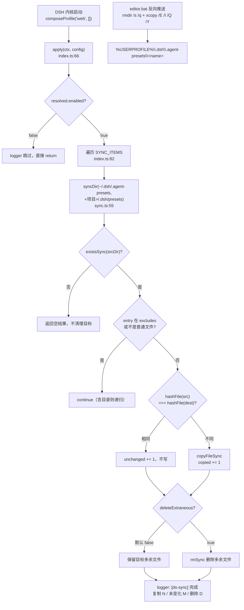

# Preset 同步机制

> **一句话定位**：把「Agent Preset 目录」在**用户 home（`~/.dsh/.agent-presets/`，DSH 运行时事实源）**与**项目根（`.dsh/presets/`，随 git 走的快照）**之间双向搬运，让 `game-editor` 这类自定义 preset 换机器也能用。
>
> **什么时候会用到你**：新增/修改一个自定义 Agent Preset、Agent 面板里看不到 `game-editor`、排查 preset 显示成 `broken`、两台机器 preset 不一致、想搞清「项目 `.dsh/presets` 到底被谁改的」。
>
> 代码位置：同步实现 `harness/ds-sync/`（home → 项目根）+ `editor.bat:70-111`（项目根 → home）；preset 本体 `.dsh/presets/game-editor/`；发现机制 `harness/dsh-source/packages/preset/agent-presets/`（第三方源码，只读）。

---

## 1. 先记住这几个文件

| 文件 | 一句话职责 | 你要改它的场景 |
|---|---|---|
| [ds-sync/src/index.ts](../../harness/ds-sync/src/index.ts) | 同步入口：`SYNC_ITEMS` 映射表 + `apply()` 跑一遍全量同步 | 改同步范围、改项目根、关掉同步 |
| [ds-sync/src/sync.ts](../../harness/ds-sync/src/sync.ts) | `syncDir()` 递归镜像：sha1 比对，内容变了才写 | 改冲突策略（删除多余文件）、改排除目录 |
| [.dsh/profiles/web/cordis.patch.yml](../../.dsh/profiles/web/cordis.patch.yml) | ds-sync 的挂载点（`insert` 行 + `projectRoot` 钉死） | 挂载/停用同步、换机器后重建 |
| [editor.bat](../../editor.bat) | 反向同步：`xcopy` 把项目 presets 覆盖到 home | 改反向推送行为（注意它与 ds-sync 方向相反） |
| [.dsh/presets/game-editor/agent.cordis.yml](../../.dsh/presets/game-editor/agent.cordis.yml) | preset 本体：组合配置（缺了就是 `broken`） | 改这个 preset 的工具/persona 组合 |

**关键心智模型**：preset 的**事实源在 home 不在项目**。DSH 只从 `~/.dsh/.agent-presets/`（由 `includeUserRoot` 自动追加）读自定义 preset；项目根 `.dsh/presets/` 只是 ds-sync 拷出来的**可迁移副本**。改动要生效必须落到 home——`editor.bat` 的反向推送做的正是这件事。

**preset 是什么**：一个目录 = 一个 preset，目录名即 id（须匹配 `PRESET_ID = /^[a-z0-9][a-z0-9-]*$/`，`preset.ts:18`）。目录里必须有 `agent.cordis.yml`（组合配置：装哪些插件/工具/persona），可选 `preset.yml`（显示名/描述/排序）。当前仓库只有一个：`game-editor`。

---

## 2. 一次同步怎么完成：从源到目标

### 2.1 谁触发了它

**链路 A（home → 项目根，已实现）**：ds-sync 是 Cordis 插件，DSH 内核启动、插件 `apply` 时自动跑一次。挂载点在 profile 的 patch 文件里：

```yaml
# .dsh/profiles/web/cordis.patch.yml:14-19
- insert:
    - id: ds-sync
      name: '@demostudio/ds-sync'
      config:
        projectRoot: 'E:/DemoStudio'
```

> `projectRoot` 必须显式钉死：编辑器以 `harness/dsh-source` 为 cwd 拉起内核（`electron/main.ts:524`），不钉的话 `process.cwd()` 指向 dsh-source，同步全部落错位置。

**链路 B（项目根 → home，已实现）**：`editor.bat` 在启动 Electron 前跑一段批处理。它**不在 `npm run electron:dev` 里**——只有双击 `editor.bat` 才触发，直接跑 npm 命令会跳过整个同步（全仓 grep `editor\.bat` 无任何代码引用，纯人工入口）。路径定义见 `editor.bat:71-72`：`LOCAL_PRESETS=%~dp0.dsh\presets`、`SYSTEM_PRESETS=%USERPROFILE%\.dsh\.agent-presets`。

### 2.2 同步链路



**① 映射表决定同步哪些目录**（`index.ts:31`）：

```ts
const SYNC_ITEMS: ReadonlyArray<readonly [source: string, target: string]> = [
  ['.agent-presets', 'presets'],   // ← preset 同步就是这一行
  ['skills', 'skills'],
  ['profiles', 'profiles'],
  ['memory', 'memory'],
]
```

preset 只是四组映射里的第一组——`~/.dsh/.agent-presets` → `<项目>/.dsh/presets`。改同步范围就改这张表，别动循环体。

**② `apply` 解析配置后跑一遍就完事**（`index.ts:66-101`）：

```ts
export function apply(ctx: Context, config?: Config): void {
  const resolved = {
    enabled: config?.enabled ?? true,
    homeDir: config?.homeDir ? resolve(config.homeDir) : join(homedir(), '.dsh'),
    projectRoot: config?.projectRoot ? resolve(config.projectRoot) : process.cwd(),
    deleteExtraneous: config?.deleteExtraneous ?? false,
    extraExcludes: config?.extraExcludes ?? [],
  }
  if (!resolved.enabled) {
    ctx.logger.info('[ds-sync] enabled=false，跳过同步')
    return
  }
  const targetRoot = join(resolved.projectRoot, '.dsh')
  const total: SyncResult = { copied: 0, deleted: 0, unchanged: 0, touched: [] }
  for (const [source, target] of SYNC_ITEMS) {
    const result = syncDir(join(resolved.homeDir, source), join(targetRoot, target), { /* ... */ })
    total.copied += result.copied   /* ... 累加 deleted / unchanged / touched ... */
  }
  ctx.logger.info(`[ds-sync] 完成: home=${resolved.homeDir} → ${targetRoot} | ...`)
}
```

`apply` 是**同步的、只跑一次**，没有 watch、没有增量调度。这意味着 DSH 进程存活期间你在 home 新增的 preset，不会自动流回项目根——要等下次重启内核。

**③ 「内容变化才写」靠 sha1 比对**（`sync.ts:45`、`:79`）：

```ts
function hashFile(filePath: string): string {
  const hash = createHash('sha1')
  hash.update(readFileSync(filePath))
  return hash.digest('hex')
}
// syncDir 内：hashFile(src) === hashFile(dest) 时 unchanged += 1 并 continue，否则 copyFileSync
```

> 为什么不用 mtime：mtime 跨机器/git checkout 时不可靠，且复制本身会改 mtime。sha1 才能真正「内容没变就不写」，避免每次启动制造 git diff 噪音；代价是每次同步要全量读一遍源和目标。

**④ 源不存在时静默返回，绝不清理目标**（`sync.ts:58`）：`if (!existsSync(srcDir)) return result` —— 安全设计，home 侧目录还没建时（新机器首次跑）不能反过来把项目里随 git 带的 preset 删掉；目标不存在则 `mkdirSync(destDir, { recursive: true })` 自动建。

### 2.3 冲突与覆盖

**ds-sync 的冲突策略是「源单向覆盖 + 默认只增不删」**（`sync.ts:91`）：`deleteExtraneous` 为 true 时才遍历目标、对 `srcNames` 与 `excludes` 都没有的条目 `rmSync(..., { recursive: true, force: true })`。该选项**默认 false**，因此同名文件一律以 home 覆盖、目标多余文件默认保留——项目 `.dsh/presets` 里手工维护的内容不允许被误删。

**`editor.bat` 的冲突策略相反，是全量破坏式覆盖**（`editor.bat:92-97`）：先 `rmdir /s /q "%SYSTEM_PRESETS%!PRESET_NAME!"` 连根删掉 home 侧同名目录，再 `xcopy "%%D" "%SYSTEM_PRESETS%!PRESET_NAME!\" /E /I /Q /Y >nul`；失败只 `[WARN]` 不中断启动（`errorlevel` 分支只 echo）。注意它会**无差别抹掉** home 里本地新增但项目里没有的 preset。

**发现侧的冲突是「第一个 root 优先」**（`discovery.ts:177-185`）：`discoverPresets` 用 `if (byId.has(preset.id)) continue` 丢弃后扫描 root 里的同 id preset。root 顺序由 `index.ts:133-135` 决定：配置 roots 在前，home 用户根追加在**最后**，所以自定义 preset 撞上内置 preset id 时会被内置那个挡掉。

---

## 3. 现状与缺口

| 能力 | 状态 | 证据 |
|---|---|---|
| home → 项目根文件镜像（含 presets） | ✅ 已实现，10 个 vitest 用例覆盖 | `harness/ds-sync/src/sync.ts:55` + `tests/sync.test.ts` |
| 项目根 → home 反向推送 | ✅ 已实现 | `editor.bat:86-105` 的 `for /d` + `xcopy` |
| 反向推送接入 `npm run electron:dev` | ❌ 未落地 | 同步逻辑只在 `editor.bat`，npm 脚本不含它 |
| 通过 `--patch` 追加 preset root | ❌ 不可能生效，见下 | `profile-boot.ts:164` 强制覆盖 `roots` |
| DSH 存活期的增量同步 | ❌ 未落地 | `apply()` 只在插件挂载时跑一次，无 watch |
| 冲突检测 / 双向合并 | ❌ 未落地 | 两侧都是单向覆盖，无版本/时间戳仲裁 |
| 同步成功的程序化校验 | ❌ 未落地 | 只能看日志与 UI，无自测命令 |

**最重要的一条缺口**：项目根下的 [.dsh/profiles/cordis.patch.yml](../../.dsh/profiles/cordis.patch.yml) 声称能用 `roots` 把 `.dsh/presets` 注册成额外 preset 根目录——这在 CLI 启动路径上**永远不会生效**：

```ts
// profile-boot.ts:157-165（composedOverlays 排在所有 --patch 之后）
if (rows.has('agent-presets')) {
  composedOverlays.push({
    id: 'agent-presets',
    config: {
      ...(rows.get('agent-presets')?.config ?? {}) as Record<string, unknown>,
      roots: [{ path: SHIPPED_PRESET_ROOT, trust: 'system' }],   // 整键替换
    },
  })
}
```

`composedOverlays` 排在所有 `--patch` overlay 之后（同函数 `:146-151`），把整行的 `roots` **整段替换**成 `SHIPPED_PRESET_ROOT`（`profile-boot.ts:35`，CLI 自带的 `config/agent-presets/`）。任何层配的 `roots` 都被冲掉。

真正让 `game-editor` 被发现的，是 `includeUserRoot` 默认为 true 时自动追加的 home 用户根（`index.ts:133-135`）：

```ts
// index.ts:133-135
this.resolvedRoots = config.includeUserRoot
  ? [...config.roots, { path: dshHomePath(USER_PRESET_DIR), trust: 'user' }]
  : [...config.roots]
```

即 `editor.bat` 把项目 presets 推进 `~/.dsh/.agent-presets` 确实**有效**，但生效原因与那个 patch 文件无关。

---

## 4. 关键方法速查

| 方法 | 位置 | 干什么 | 注意 |
|---|---|---|---|
| `apply(ctx, config)` | `harness/ds-sync/src/index.ts:66` | 同步入口，遍历 `SYNC_ITEMS` 跑一遍 | `inject: []`，只用 `ctx.logger`；同步执行，无重试 |
| `syncDir(src, dest, options)` | `harness/ds-sync/src/sync.ts:55` | 递归镜像单个目录 | 源不存在返回空结果，**不清理目标** |
| `hashFile(path)` | `harness/ds-sync/src/sync.ts:45` | 文件 sha1，「内容变化才写」的基础 | 全量读文件，大目录有 IO 成本 |
| `SYNC_ITEMS` | `harness/ds-sync/src/index.ts:31` | home→项目的四组目录映射 | 改同步范围只改这里 |
| `DEFAULT_EXCLUDES` | `harness/ds-sync/src/sync.ts:18` | 跳过 `node_modules`/`.git`/`dist` 等 | 符号链接与 junction 也一律跳过 |
| `deleteExtraneous` 分支 | `harness/ds-sync/src/sync.ts:91` | 删除目标多余文件 | **默认 false**，置 true 才真镜像 |
| `discoverPresets(roots)` | `dsh-source/.../discovery.ts:177` | 按 root 顺序扫描，第一个 root 赢 | 只读参考，勿改 |
| `scanRoot(root)` | `dsh-source/.../discovery.ts:139` | 扫单个 root，`PRESET_ID` 过滤 + broken 判定 | root 不存在返回 `[]`，非 ENOENT 才抛错 |
| `listPresets()` / `getCurrentPreset()` | `src/editor/AgentService.ts:2100` / `:2110` | RPC `agentPreset.list` / 读当前会话 preset | 验证同步结果最直接的手段 |

**怎么验证同步成功**：① 启动日志搜 `[ds-sync] 完成:`，看 `复制 N 个文件`；`copied > 0` 时还会打一行 `[ds-sync] 变更文件:`。② 比对项目根 `.dsh/presets/game-editor/` 与 `%USERPROFILE%\.dsh\.agent-presets\game-editor\` 应逐字节一致。③ `listPresets()` 返回列表里应有 `game-editor` 且 `broken` 为空，Agent 面板顶部的 preset 标签（[AgentPanel.tsx:303](../../src/components/AgentPanel.tsx) 的 `fetchPreset`）显示当前 preset 名。

---

## 5. 流程影响：牵动哪些功能

### 上游：谁驱动它

| 上游 | 怎么驱动 | 相关文档 |
|---|---|---|
| DSH 内核启动（`--profile web`） | 插件 apply 触发 ds-sync 跑一遍 home→项目同步 | [DSH 引擎集成](./dsh_engine_integration.md) |
| 编辑器拉起 agent | spawn 时 `cwd: DSH_SOURCE_DIR`，逼得 ds-sync 必须钉 `projectRoot` | [DSH 引擎集成](./dsh_engine_integration.md) |
| 用户双击 `editor.bat` | 先跑项目根→home 的 `xcopy` 反向推送，再启动 Electron | [Harness 系统](./harness_system.md) |
| profile patch 层 | `insert` 行决定 ds-sync 是否加载、`projectRoot` 指哪 | [插件安装](./dsh_plugin_install.md) |

### 下游：它波及谁

| 下游功能 | 波及点 | 相关文档 |
|---|---|---|
| Agent 会话创建 | `session.create` 的 `agentPreset` 取自已发现列表；不存在时回退 `cordis` | [DSH 引擎集成](./dsh_engine_integration.md) |
| preset 发现 | root 集合由 home 用户根决定，项目 `.dsh/presets` 本身不参与发现 | [插件安装](./dsh_plugin_install.md) |
| 项目可迁移快照 | `.dsh/presets` 随 git 走，换机器后靠 `editor.bat` 反向推送恢复 | [插件安装](./dsh_plugin_install.md) |
| 插件组合 | preset 的 `agent.cordis.yml` 决定加载哪些官方/自定义插件 | [插件安装](./dsh_plugin_install.md) |
| 目录指令插件 | `agent-instructions` 的 `maxBytes: 65536` 在 preset 里配置 | [Harness 系统](./harness_system.md) |
| VS Code 扩展 | 独立进程拉起内核时同样走 profile patch，同步行为一致 | [VS Code PRD](./dsh_vscode_demostudio_prd.md) |

---

## 6. 踩坑清单

**1. 在项目根 patch 里配 `roots` 追加本地 preset 目录，永远不生效**
现象：写了 `roots: [{path: "E:\\DemoStudio\\.dsh\\presets", trust: user}]`，preset 依旧只从 home 读。
原因：`profile-boot.ts:164` 在最后一层 overlay 把 `roots` 整键替换成 `SHIPPED_PRESET_ROOT`，任何层配的都被覆盖。
规则：不要用 patch 配 roots。自定义 preset 放 `~/.dsh/.agent-presets/`，靠 `includeUserRoot` 默认追加。

**2. 跑 `npm run electron:dev` 时 preset 反向推送被整个跳过**
现象：在项目 `.dsh/presets` 改了 preset，启动后 DSH 用的还是旧版。
原因：反向推送写在 `editor.bat:86-105`，npm 脚本不经过 bat。
规则：双击 `editor.bat` 启动，或手动复制到 `%USERPROFILE%\.dsh\.agent-presets\`。

**3. `editor.bat` 会无差别抹掉 home 里的本地 preset**
现象：home 的 `.agent-presets` 下手工建的 preset，跑一次 `editor.bat` 后消失。
原因：`editor.bat:93` 的 `rmdir /s /q` 按目录名整棵删除后再 `xcopy`，ds-sync 默认 `deleteExtraneous: false` 也救不回来。
规则：新 preset 先在**项目** `.dsh/presets/` 里建，让 bat 推上去；不要只在 home 侧建。

**4. 两条链路方向相反，内容不一致时会互相打架**
现象：home 和项目根的 `game-editor` 内容不同，每次启动结果不一样。
原因：ds-sync 是 home→项目（覆盖、只增不删），editor.bat 是项目→home（删了再拷），启动顺序决定谁赢。
规则：以项目 `.dsh/presets/` 为唯一编辑点；home 侧视为派生物，不要在两边同时改。

**5. `projectRoot` 不钉死，同步全部落到 dsh-source 下**
现象：`.dsh/presets` 迟迟不更新，反而在 `harness/dsh-source/.dsh/` 下冒出内容。
原因：编辑器以 `DSH_SOURCE_DIR` 为 cwd 拉起内核（`electron/main.ts:524`），`process.cwd()` 就是 dsh-source。
规则：patch 的 insert 行必须写死 `projectRoot: 'E:/DemoStudio'`。

**6. 目录名不符合 `PRESET_ID` 时 preset 直接消失，没有任何提示**
现象：新建 `My_Preset` 或 `game.editor` 目录，UI 里完全没有。
原因：`scanRoot`（`discovery.ts:139`）用 `PRESET_ID = /^[a-z0-9][a-z0-9-]*$/` 过滤，不匹配就 `continue`，连 `broken` 都不标。
规则：目录名只用小写字母、数字、连字符，且不能以连字符开头。

**7. 缺 `agent.cordis.yml` 时 preset 显示为 broken 而不是消失**
现象：preset 在列表里但选不了。
原因：`scanRoot` 写入 `broken: 'the composition file agent.cordis.yml is missing — ...'`，preset 仍被返回但所有挂载路径拒绝它。
规则：排查时查 `broken` 字段。Windows 上另需注意 `tool-bash` 未配 `disabled: !!js process.platform === 'win32'` 会让 shell 工具调用失败。

---

## 7. 边界条件

| 条件 | 行为 | 怎么应对 |
|---|---|---|
| home 侧源目录不存在 | 返回空结果，目标原样保留 | 新机器首次跑属正常；先建 home 目录 |
| 目标目录不存在 | `mkdirSync(destDir, { recursive: true })` 自动建 | 无需预建 |
| 源与目标内容一致 | 计入 `unchanged`，不写盘 | sha1 比对，改 mtime 不算变化 |
| 目标有多余文件 | 默认保留（`deleteExtraneous: false`） | 需真镜像就置 `true`，注意会删手工维护的文件 |
| 目录名为 `node_modules`/`.git`/`dist` | 整棵跳过 | `extraExcludes` 只能加不能减 |
| 遇到符号链接 / junction | 跳过，不复制链接本身 | junction 挂载的插件不会同步，需目标机器重建 |
| 预设 id 撞上内置 preset | home 用户根排在最后，被内置挡掉 | 换独有 id |
| `agent.cordis.yml` 缺失或 YAML 非法 | 标记 `broken`，仍在列表但不可挂载 | 查 `broken` 字段文案 |
| 在 patch 里配 `roots` | 被 `profile-boot.ts:164` 覆盖，无效 | 改用 home 用户根 |
| 未传 `--patch` 启动 | overlay 不应用（Electron 启动路径本就不传） | 与 preset 发现无关 |
| 直接跑 `npm run electron:dev` | 跳过 `editor.bat` 反向推送 | 手动复制或改走 bat |
| `session.create` 报 preset 不存在 | 回退 `agentPreset: 'cordis'` 重试一次 | 两次都失败才进 error，`AgentService.ts:580` |
| 内核运行期间在 home 新增 preset | 不会同步回项目根 | 重启 DSH 内核 |
