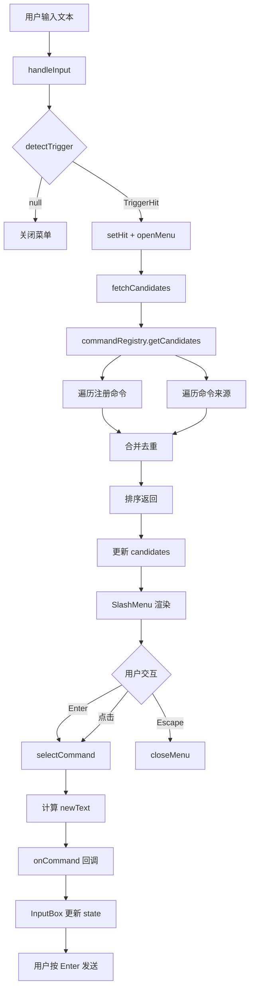

# 斜杠命令系统（Slash Command System）

> 编辑器输入框的斜杠命令发现与执行机制：触发检测、命令注册、菜单展示与命令执行，与 DSH Harness 集成。
> 代码位置：`src/components/agent/slash-command/`（核心模块）、`src/components/agent/InputBox.tsx`（集成入口）
> 相关文档：[`editor/agent_panel_system.md`](../editor/integration/agent_panel_system.md)（Agent 面板通信层）、[`harness/dsh_engine_integration.md`](./dsh_engine_integration.md)（DSH 集成架构）

---

## 1. 概述

斜杠命令系统为 DemoStudio 编辑器的 Agent 输入框提供了类似 DSH WebUI 的命令发现与执行能力。用户在输入框中输入 `/` 时，系统会弹出命令菜单，展示可用的 DSH 内置命令和技能列表，用户可以选择后快速执行。

该系统与 DSH Harness 深度集成：
- 通过 `skill.list` RPC 获取可用技能列表
- 硬编码 DSH 内置命令（`compact`、`plan`、`goal` 等）
- 用户选择命令后，文本直接发送给 DSH 后端执行

### 职责表

| 角色 | 职责 | 不做 |
|------|------|------|
| `CommandRegistry`（命令注册表） | 管理命令注册、来源注册、候选查询、执行分发 | 不处理 UI 渲染 |
| `SlashDetector`（触发检测器） | 检测输入文本中的触发字符和查询文本 | 不管理菜单状态 |
| `SlashMenu`（菜单组件） | 渲染命令菜单、处理键盘/鼠标交互 | 不负责命令获取 |
| `useSlashCommand`（React Hook） | 协调检测、菜单状态、候选获取 | 不持有命令数据 |
| `builtin-commands`（命令来源） | 提供 DSH 内置命令和 skill 列表 | 不直接注册命令 |

### 与相邻功能的边界

| 功能 | 归属文档 |
|------|----------|
| Agent 面板 UI 与通信 | [`editor/agent_panel_system.md`](../editor/integration/agent_panel_system.md) |
| 斜杠命令发现与执行 | **本文档** |
| DSH 后端命令注册 | [`harness/harness_system.md`](./harness_system.md) |
| DSH 引擎集成架构 | [`harness/dsh_engine_integration.md`](./dsh_engine_integration.md) |

---

## 2. 核心类 / 模块

| 类 / 模块 | 说明 |
|-----------|------|
| `CommandRegistry` | 全局命令注册表单例。管理命令注册（`register`）、来源注册（`registerSource`）、候选查询（`getCandidates`）和执行（`execute`）。 |
| `SlashDetector` | 纯函数模块。检测输入文本中的触发字符（`/`），返回 `TriggerHit` 或 `null`。 |
| `SlashMenu` | React 菜单组件。使用 fixed 定位，始终贴着输入框显示，支持键盘导航和鼠标选择。 |
| `useSlashCommand` | React Hook。封装触发检测、菜单状态管理、候选获取、键盘事件处理。 |
| `builtin-commands` | 命令来源模块。提供 DSH 内置命令（`compact`、`plan` 等）和 skill 列表（通过 RPC 获取）。 |
| `types.ts` | 类型定义。`SlashCommand`、`CommandSource`、`TriggerHit`、`MenuState` 等接口。 |

---

## 3. 使用方法

### 3.1 入口与触发方式

```ts
// 在 Agent 输入框中输入 "/" 触发命令菜单
// 示例：用户输入 "/plan" 后按 Enter

// 或在代码中直接调用
import { commandRegistry } from './slash-command'

// 注册自定义命令
const dispose = commandRegistry.register({
  name: 'my-command',
  description: '我的自定义命令',
  handler: (args) => { console.log('执行:', args) },
})

// 注册命令来源
commandRegistry.registerSource({
  name: 'my-source',
  trigger: '/',
  candidates: async (query) => [...],
})
```

### 3.2 CommandRegistry 核心 API

```ts
class CommandRegistry {
  // 注册命令（返回 disposer）
  register(command: SlashCommand): () => void

  // 批量注册
  registerAll(commands: SlashCommand[]): () => void

  // 注册命令来源
  registerSource(source: CommandSource): () => void

  // 获取匹配的候选命令
  async getCandidates(query: string): Promise<SlashCommand[]>

  // 执行命令
  async execute(name: string, args?: string): Promise<boolean>

  // 订阅变更
  subscribe(listener: () => void): () => void

  // 获取所有命令（调试用）
  getAll(): SlashCommand[]
}
```

### 3.3 SlashDetector API

```ts
// 检测输入文本中的触发 token
function detectTrigger(
  draft: string,      // 完整输入文本
  caret: number,      // 光标位置
  guard?: { tier: 'plain' | 'claimed' | 'frozen' }
): TriggerHit | null

// 返回值示例
{
  trigger: '/',
  query: 'plan',
  position: 'leading',
  span: { start: 0, end: 5 }
}
```

### 3.4 触发时机

| 时机 | 说明 |
|------|------|
| 输入 `/` | 菜单打开，显示所有可用命令 |
| 继续输入字符 | 候选列表实时过滤 |
| 按 `↑` `↓` | 高亮在候选列表中移动 |
| 按 `Enter` | 选择高亮的命令，插入到输入框 |
| 按 `Escape` | 关闭菜单 |
| 点击菜单外 | 关闭菜单 |

---

## 4. 工作流程

### 4.1 主流程



### 4.2 分阶段说明

| 阶段 | 触发点 | 关键调用 | 产物 |
|------|--------|----------|------|
| 触发检测 | `handleInput` | `detectTrigger(draft, caret)` | `TriggerHit` 或 `null` |
| 候选获取 | `fetchCandidates` | `commandRegistry.getCandidates(query)` | `SlashCommand[]` |
| 菜单渲染 | React re-render | `SlashMenu` 组件 | 命令菜单 UI |
| 选择执行 | 用户点击/Enter | `selectCommand(command)` | 更新输入框文本 |

### 4.3 设计要点

#### 数据流向

```
用户输入 → SlashDetector → useSlashCommand → CommandRegistry
                                              ↓
InputBox ← useSlashCommand ← SlashMenu ← 候选列表
```

#### 命令来源优先级

| 优先级 | 来源 | 说明 |
|--------|------|------|
| 5 | `dsh-commands` | DSH 内置命令（`compact`、`plan` 等） |
| 10 | `dsh-skills` | DSH 技能列表（通过 RPC 获取） |

#### DSH 集成说明

- **命令来源**：DSH 内置命令是固定的，直接硬编码在 `builtin-commands.ts`
- **技能来源**：通过 `skill.list` RPC 从 DSH 后端获取（需要 session 被 attach）
- **命令执行**：用户选择命令后，文本（如 `/plan`）插入输入框，用户按 Enter 后发送给 DSH 后端执行

#### 菜单定位策略

- 使用 `position: fixed` 定位，避免被父容器 `overflow` 裁剪
- 优先显示在输入框**上方**，底部贴着输入框顶部
- 上方空间不足时，显示在输入框**下方**
- 菜单宽度与输入框同步（读取 `targetRef.getBoundingClientRect().width`）

---

## 5. 边界条件

| 条件 | 行为/后果 | 处理方式 |
|------|----------|----------|
| 输入框为空时输入 `/` | 菜单正常显示 | 正常处理 |
| 已有文本后输入 `/` | `position: 'inline'` | 正常处理 |
| DSH 未连接 | RPC 调用失败 | 使用本地备选命令 |
| 候选列表为空 | 菜单显示但无选项 | 正常显示空菜单 |
| 快速连续输入 | 防抖 50ms 后获取候选 | `setTimeout` 防抖 |
| 窗口缩放 | 菜单位置重新计算 | 监听 `resize` 事件 |
| 滚动页面 | 菜单位置重新计算 | 监听 `scroll` 事件 |
| 选择命令后未按 Enter | 命令文本在输入框中 | 用户手动发送或继续编辑 |
| 同名命令重复注册 | 后注册的覆盖先注册的 | `logger.warn` 提示 |
| `command.list` RPC 不存在 | 404 错误 | 使用硬编码的命令列表 |

---

## 6. 依赖关系 / 注册机制

### 依赖关系

```
InputBox
  ├── useSlashCommand (Hook)
  │     ├── SlashDetector (检测)
  │     └── CommandRegistry (查询)
  ├── SlashMenu (UI)
  └── builtin-commands (来源)
        └── AgentService.rpc (获取 skills)
```

### 注册机制

1. **命令注册**：通过 `commandRegistry.register()` 直接注册
2. **来源注册**：通过 `commandRegistry.registerSource()` 注册异步来源
3. **来源查询**：`getCandidates()` 按优先级遍历所有来源

---

## 7. 参考模板

本文档参照以下现有文档编写：
- 引擎系统范本：`doc/engine/entity_system.md`
- 编辑器系统范本：`doc/editor/integration/agent_panel_system.md`
