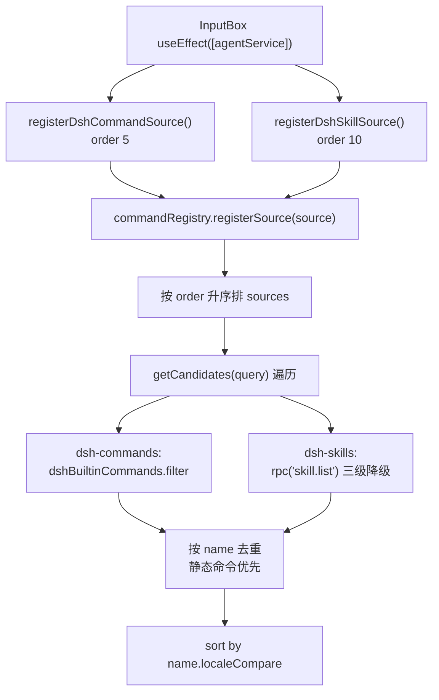

# 斜杠命令系统（Slash Command）

> **一句话定位**：Agent 输入框的 `/` 命令发现机制——检测触发符、合并来源列表、渲染菜单，把选中命令**拼回输入框文本**，真正的执行交给 DSH 后端。
>
> **什么时候会用到你**：排查「打 `/` 不出菜单 / 命令列表不对 / 选中命令没执行」、新增 DSH 内置命令或本地备选 skill、改菜单定位与键盘交互。
>
> 代码位置：`src/components/agent/slash-command/`（核心模块）、`src/components/agent/InputBox.tsx`（集成入口）

> ⚠️ **文件名易误导**：本文件放在 `doc/harness/`，但**斜杠命令的实现不在 `harness/`**。`harness/` 下只有 DSH 后端插件（见 §3），本系统在编辑器前端 `src/components/agent/`。

---

## 1. 先记住这几个文件

| 文件 | 一句话职责 | 你要改它的场景 |
|---|---|---|
| [CommandRegistry.ts](../../src/components/agent/slash-command/CommandRegistry.ts) | 注册表单例：`register`/`registerSource`/`getCandidates`/`execute` | 改去重/排序规则 |
| [SlashDetector.ts](../../src/components/agent/slash-command/SlashDetector.ts) | 纯函数：从文本与光标识别触发 token | 改触发字符、边界规则、URL 排除 |
| [builtin-commands.ts](../../src/components/agent/slash-command/builtin-commands.ts) | 两个命令来源：硬编码内置命令 + RPC 拉 skill | 加/改内置命令或备选 skill |
| [useSlashCommand.ts](../../src/components/agent/slash-command/useSlashCommand.ts) | Hook：串起检测、防抖取候选、菜单状态、键盘 | 改交互行为（防抖、按键） |
| [InputBox.tsx](../../src/components/agent/InputBox.tsx) | 集成入口：注册两个来源、把选中文本写回 textarea | 改选中后的文本处理 |

**心智模型一**：**注册表不持有命令数据**。命令来自两条互不干扰的路径——`register()` 的静态命令与 `registerSource()` 的异步来源，`getCandidates` 每次实时合并，不缓存技能列表。

**心智模型二**：**本系统只做到「文本进输入框」为止**。选中命令不执行任何逻辑，执行发生在用户按 Enter 后 `submit()` → `onSend(text)` → DSH 后端。所以 `execute()` 对无 `handler` 的命令返回 `false` 是预期行为，不是失败。

---

## 2. 一条 /xxx 命令怎么被执行：从输入到输出

### 2.1 谁触发了它

入口是 [InputBox.tsx](../../src/components/agent/InputBox.tsx) 的 textarea `onChange`，每次按键把「新文本 + 光标位置」交给 hook：

```ts
const caret = e.target.selectionStart ?? newValue.length
handleSlashInput(newValue, caret)
```

> **为何传 `selectionStart` 而非 `value.length`**：检测从光标**向前**扫描，用户把光标移到文本中间再打 `/` 时，用长度当光标会误判整个 token。

键盘走「斜杠系统优先，处理不了再发送」的优先级：

```ts
const onKeyDown = (e: React.KeyboardEvent<HTMLTextAreaElement>) => {
  if (handleSlashKeyDown(e)) return
  if (e.key === 'Enter' && !e.shiftKey && !e.nativeEvent.isComposing) {
    e.preventDefault()
    submit()
  }
}
```

> **这是菜单能「吃掉」回车的全部原因**：菜单打开时 `handleSlashKeyDown` 对 `Enter` 返回 `true`，`onKeyDown` 直接 return，不会误发半成品消息。**返回值是契约，不是装饰。**

### 2.2 注册链路



注册时机是 `InputBox` 的 `useEffect`，依赖 `agentService`：

```ts
useEffect(() => {
  if (!agentService) return
  const disposeCommand = registerDshCommandSource(() => agentService)
  const disposeSkill = registerDshSkillSource(() => agentService)
  return () => { disposeCommand(); disposeSkill() }
}, [agentService])
```

> **两个反直觉点**：一是传 `() => agentService` **取值函数**而非实例——`candidates()` 被调用时才取值，保证拿到最新实例（HMR/重连后实例会换）。二是 cleanup 必须精确 dispose：来源是**同名抛错**语义，重挂载不摘除就立刻抛错。

**① 触发检测 —— 边界规则是重点**（[SlashDetector.ts:40](../../src/components/agent/slash-command/SlashDetector.ts)）

```ts
export function detectTrigger(
  draft: string, caret: number,
  guard?: { tier: 'plain' | 'claimed' | 'frozen' }
): TriggerHit | null {
  if (guard?.tier === 'frozen') return null
  // 从光标位置向前扫描
  for (let i = caret - 1; i >= 0; i--) {
    const ch = draft.charAt(i)
    if (WHITESPACE.test(ch)) return null        // 遇空白停止
    if (ch !== '/') continue                    // 只处理 '/' 触发字符
    if (guard?.tier === 'claimed') continue     // claimed 模式下 '/' 被抑制
    if (!boundaryOk(draft, i, ch)) continue
    const hasNonWhitespaceBefore = draft.slice(0, i).trim().length > 0
    return {
      trigger: ch,
      query: draft.slice(i + 1, caret),
      position: hasNonWhitespaceBefore ? 'inline' : 'leading',
      span: { start: i, end: caret },
    }
  }
  return null
}
```

> **为何遇空白是 `return null` 而非 `continue`**：保证只匹配**光标所在的当前 token**。反向扫描越过空白说明 `/` 属于上一个已完成的词。返回的 `span` 是 `selectCommand` 做文本替换的精确区间。

```ts
function boundaryOk(draft: string, index: number, char: string): boolean {
  if (index === 0) return true
  const prev = draft.charAt(index - 1)
  if (WHITESPACE.test(prev)) return true
  if (WORD_CHAR.test(prev)) return false
  if (char === '/') {
    if (prev === '/') return false  // '//' 不触发
    if (prev === ':') return false  // 'https://' 不触发
  }
  return true
}
```

> **为何必须排 `//` 和 `https://`**：用户粘贴路径或网址时 `/` 极常见，不排除则输入 URL 就弹菜单。前导是字母数字（`WORD_CHAR`）也不触发——避免 `and/or` 被误判。

**② 候选获取 —— 静态与来源实时合并**（[CommandRegistry.ts:51](../../src/components/agent/slash-command/CommandRegistry.ts)）

```ts
async getCandidates(query: string): Promise<SlashCommand[]> {
  const results: SlashCommand[] = []
  for (const cmd of this.commands.values()) {
    if (cmd.name.toLowerCase().startsWith(query.toLowerCase())) results.push(cmd)
  }
  for (const source of this.sources) {
    try {
      const candidates = await source.candidates(query)
      for (const cmd of candidates) {
        if (!results.some(r => r.name === cmd.name)) results.push(cmd)
      }
    } catch (error) {
      logger.warn(`[CommandRegistry] 来源 "${source.name}" 获取候选失败`)
    }
  }
  return results.sort((a, b) => a.name.localeCompare(b.name))
}
```

> **三个反直觉点**：① 来源抛错只 `logger.warn` 不中断——某个来源挂了其余命令仍可用。② **静态命令优先**：同名时来源结果被 `results.some` 挡掉；`order` 只决定遍历顺序，即「谁先占位」。③ 最终统一 `localeCompare` 排序，**与来源优先级无关**，菜单里看到的是字典序。

**③ 来源注册 —— 同名抛错而非覆盖**（[CommandRegistry.ts:35](../../src/components/agent/slash-command/CommandRegistry.ts)）

```ts
registerSource(source: CommandSource): () => void {
  if (this.sources.some(s => s.name === source.name)) {
    throw new Error(`Source "${source.name}" already registered`)
  }
  this.sources.push(source)
  this.sources.sort((a, b) => (a.order ?? 50) - (b.order ?? 50))
  this.notify()
  return () => { /* 按 name 找到 idx 后 splice 摘除并 notify */ }
}
```

> **注意与 `register()` 的语义差异**：命令同名是**覆盖**并 warn；来源同名是**抛错**。来源重复注册几乎总是 HMR 或逻辑 bug，静默覆盖会掩盖问题。

**④ 两个命令来源**（[builtin-commands.ts](../../src/components/agent/slash-command/builtin-commands.ts)）

内置命令在 DSH 后端注册，前端只显示名称，因此**无 `handler`**（order 5）：

```ts
const dshBuiltinCommands: SlashCommand[] = [
  { name: 'compact', description: '压缩对话历史，释放上下文空间' },
  { name: 'clear', description: '清除当前对话' },
  { name: 'goal', description: '设置或查看当前目标' },
  { name: 'plan', description: '进入计划模式' },
  { name: 'todo', description: '管理任务列表' },
  { name: 'ralph', description: '启动 Ralph 迭代执行' },
]
```

> **工厂参数为何叫 `_getAgentService`**：这个来源不需要 agent service，只为与 skill 来源保持同一工厂签名，下划线表示故意不用。

技能来源走 RPC（order 10），配三级降级——无 session / 无结果 / 抛错，全回落本地备选：

```ts
const agentService = getAgentService()
if (!agentService?.sessionId) return fallbackSkills.filter(s => s.name.includes(query))
const result = await agentService.rpc('skill.list', { sessionId: agentService.sessionId })
if (!result?.skills) return fallbackSkills.filter(s => s.name.includes(query))
return result.skills.filter((skill: any) => skill.name.includes(query)).map(/* 转 SlashCommand */)
```

> **为何必须留本地备选**：DSH 未连接或 session 未 attach 时 `skill.list` 必然失败，没有备选则断连状态下打 `/` 看到空菜单，体验上像功能坏了。`fallbackSkills` 是 5 条 `skl-*` 硬编码列表，与 `.github/skills/` 同名但**已滞后**——该目录现有 7 个 skill（多出 `skl-create-dsh-plugin`、`skl-create-ui-widget-asset`、`skl-manage-instructions`）。

### 2.3 分发与执行

取候选有 50ms 防抖（[useSlashCommand.ts:70](../../src/components/agent/slash-command/useSlashCommand.ts)）。选中命令时**只拼文本，不执行**（[useSlashCommand.ts:113](../../src/components/agent/slash-command/useSlashCommand.ts)）：

```ts
const selectCommand = useCallback((command: SlashCommand) => {
  if (!hit || !inputRef.current) return
  const textarea = inputRef.current
  const before = textarea.value.slice(0, hit.span.start)
  const after = textarea.value.slice(hit.span.end)
  const newText = `${before}/${command.name} ${after}`
  closeMenu()                                    // 先关闭，再更新
  const args = hit.query.replace(command.name, '').trim()
  onCommand?.(command, args || undefined, newText)
}, [hit, inputRef, onCommand, closeMenu])
```

> **为何只改文本**：命令执行方是 DSH 后端。用户输入 `/plan` 后还要补参数（如 `/plan 重构 AgentService`），必须把文本插回输入框让用户编辑完再按 Enter。末尾那个空格是刻意加的，让用户直接处在「可打字补参数」的位置。

文本回写由 `InputBox` 完成，注意它**手动同步了 textarea 的 DOM 值**：

```ts
setText(newText)
if (textareaRef.current) {
  textareaRef.current.value = newText        // React controlled component 同步
  const cursorPos = newText.indexOf(' ') + 1
  textareaRef.current.selectionStart = textareaRef.current.selectionEnd = cursorPos
}
```

> **为何手动写 `textareaRef.current.value`**：textarea 是受控组件，`selectCommand` 是同步回调，此时 `setText` 还没提交到 DOM；而 `selectCommand` 读的是 `textarea.value` 来算 `before`/`after`，不同步就会「用旧文本算新文本」。

**未命中/异常分支**：`detectTrigger` 返回 `null` → 关菜单并清空 `hit`/`candidates`；候选为空 → [SlashMenu.tsx:157](../../src/components/agent/slash-command/SlashMenu.tsx) `if (!open || candidates.length === 0) return null`，**不渲染空框**；`Enter` 但 `candidates[highlightIndex]` 不存在 → `handleKeyDown` 返回 `false`，冒泡回 `onKeyDown` 按普通回车发送；`getCandidates` 整体抛错 → `setCandidates([])`，菜单静默消失；`execute()` 找不到 `handler` → 返回 `false`，**这是 DSH 内置命令与 skill 的预期路径**。

---

## 3. 与 ds-instructions 的目录指令映射

两者**完全独立、不共享任何代码**，极易用混：

| 维度 | 斜杠命令（本文档） | ds-instructions 目录指令 |
|---|---|---|
| 触发方式 | **用户主动**输入 `/` | **被动**：Agent 读取匹配路径的文件后自动注入 |
| 代码位置 | `src/components/agent/slash-command/` | `harness/ds-instructions/src/` |
| 运行位置 | 编辑器前端（React） | DSH 后端插件（Cordis） |
| 匹配规则 | 命令名子串过滤 | **路径最长段级前缀匹配** |
| 生效结果 | 文本插入输入框，等用户按 Enter | 下一条模型请求自动带上指令全文 |

映射声明在指令文件的 frontmatter 里，由 [frontmatter.ts:32](../../harness/ds-instructions/src/frontmatter.ts) 的 `parseFrontmatterPrefix` 在插件启动时自动扫描，**新增指令无需手改 `cordis.patch.yml`**。仓库现存三条：`global.instructions.md`（`prefix: /`，项目根下所有路径，step 1 自动注入）、`engine.instructions.md`（`prefix: src/engine`）、`harness.instructions.md`（`prefix: harness`）。

匹配是**段级**而非字符串包含（[mapping.ts:37](../../harness/ds-instructions/src/mapping.ts)）：

```ts
export function matchMapping(relPath: string, mappings: readonly ResolvedMapping[]): ResolvedMapping | undefined {
  const segments = relPath.split(/[\\/]+/).filter(segment => segment.length > 0)
  for (const mapping of mappings) {
    if (segments.length < mapping.segments.length) continue
    const ok = mapping.segments.every((segment, index) =>
      pathCompareKey(segments[index]!) === pathCompareKey(segment),
    )
    if (ok) return mapping
  }
  return undefined
}
```

> **`src/engine2/a.ts` 不会命中 `src/engine`**——这是按段比较而非 `startsWith` 的直接收益；win32 下 `pathCompareKey` 忽略大小写。

**两者唯一交汇点是「都为了让 Agent 拿到更好的上下文」，实现上零耦合**：斜杠命令改的是用户即将发送的文本，ds-instructions 改的是模型看到的 system prompt / user message（`tools/pre-execute` 登记候选 → `tools/result` 确认 touch → `agent/pre-step` 对账注入）。改其中一个不影响另一个。完整语义见 [ds-instructions PRD](./dsh_instructions_prd_revised.md)。

---

## 4. 关键方法速查

| 方法 | 位置 | 干什么 | 注意 |
|---|---|---|---|
| `detectTrigger(draft, caret, guard?)` | [SlashDetector.ts:40](../../src/components/agent/slash-command/SlashDetector.ts) | 识别触发 token，返回 `TriggerHit \| null` | `guard` **生产代码从不传** |
| `boundaryOk(draft, index, char)` | [SlashDetector.ts:18](../../src/components/agent/slash-command/SlashDetector.ts) | 前导边界检查（内部函数，未导出） | 排 `//` 与 `https://` |
| `filterCandidates(cands, query)` | [SlashDetector.ts:84](../../src/components/agent/slash-command/SlashDetector.ts) | 按 query 子串过滤 | 已导出但**无生产调用方** |
| `CommandRegistry.register(cmd)` | [CommandRegistry.ts:15](../../src/components/agent/slash-command/CommandRegistry.ts) | 注册静态命令，返回 disposer | **同名覆盖**并 warn |
| `CommandRegistry.registerAll(cmds)` | [CommandRegistry.ts:29](../../src/components/agent/slash-command/CommandRegistry.ts) | 批量注册 | 无生产调用方 |
| `CommandRegistry.registerSource(src)` | [CommandRegistry.ts:35](../../src/components/agent/slash-command/CommandRegistry.ts) | 注册来源，按 order 排序 | **同名抛错** |
| `CommandRegistry.getCandidates(q)` | [CommandRegistry.ts:51](../../src/components/agent/slash-command/CommandRegistry.ts) | 合并静态+来源，去重后排序 | 来源抛错只 warn |
| `CommandRegistry.execute(name, args?)` | [CommandRegistry.ts:79](../../src/components/agent/slash-command/CommandRegistry.ts) | 执行有 handler 的命令 | 无 handler 返回 false（预期） |
| `CommandRegistry.subscribe(fn)` | [CommandRegistry.ts:94](../../src/components/agent/slash-command/CommandRegistry.ts) | 订阅变更 | 无生产调用方 |
| `CommandRegistry.getAll()` | [CommandRegistry.ts:102](../../src/components/agent/slash-command/CommandRegistry.ts) | 取全部静态命令（调试） | 不含来源 |
| `commandRegistry` | [CommandRegistry.ts:118](../../src/components/agent/slash-command/CommandRegistry.ts) | 模块级单例 | |
| `createDshCommandSource()` | [builtin-commands.ts:28](../../src/components/agent/slash-command/builtin-commands.ts) | 内置命令来源（order 5） | 硬编码 6 个 |
| `createDshSkillSource()` | [builtin-commands.ts:55](../../src/components/agent/slash-command/builtin-commands.ts) | 技能来源（order 10，三级降级） | 失败回落 `fallbackSkills` |
| `registerDshCommandSource()` / `registerDshSkillSource()` | [builtin-commands.ts:97](../../src/components/agent/slash-command/builtin-commands.ts) / [:102](../../src/components/agent/slash-command/builtin-commands.ts) | 注册来源，返回 disposer | 由 InputBox useEffect 调 |
| `useSlashCommand(opts)` | [useSlashCommand.ts:42](../../src/components/agent/slash-command/useSlashCommand.ts) | Hook 串起检测/防抖/状态/键盘 | 防抖 50ms |
| `selectCommand(cmd)` | [useSlashCommand.ts:113](../../src/components/agent/slash-command/useSlashCommand.ts) | 拼 `newText` 并回调 `onCommand` | 只改文本，不执行 |
| `SlashMenu` | [SlashMenu.tsx:29](../../src/components/agent/slash-command/SlashMenu.tsx) | 菜单渲染与鼠标交互 | `position: fixed` |
| `parseFrontmatterPrefix(c)` | [frontmatter.ts:32](../../harness/ds-instructions/src/frontmatter.ts) | 解析指令文件的 prefix 声明 | 轻量正则，非完整 YAML |
| `matchMapping(relPath, maps)` | [mapping.ts:37](../../harness/ds-instructions/src/mapping.ts) | 最长段级前缀匹配 | 段级比较，非 `startsWith` |

---

## 5. 流程影响：牵动哪些功能

### 上游：谁驱动它

| 上游 | 怎么驱动 | 相关文档 |
|---|---|---|
| Agent 输入框 | textarea `onChange`/`onKeyDown` 调 `handleSlashInput`/`handleSlashKeyDown` | [Agent 面板](../editor/integration/agent_panel_system.md) |
| `AgentService` | 作为 prop 传入，来源通过它调 `skill.list` RPC | [Harness 工程](./harness_system.md) |
| DSH 后端会话 | `sessionId` 是否存在决定走 RPC 还是回落备选 | [DSH 引擎集成](./dsh_engine_integration.md) |

### 下游：它波及谁

| 下游功能 | 波及点 | 相关文档 |
|---|---|---|
| Agent 面板 | `InputBox` 是其子组件，`agentService` 由它注入 | [Agent 面板](../editor/integration/agent_panel_system.md) |
| DSH 后端命令执行 | 命令文本随正常消息发送（`compact`/`plan`/`goal` 由后端解析） | [DSH 引擎集成](./dsh_engine_integration.md) |
| 技能加载 | 选中 skill 后文本发往后端触发加载 | [插件安装与挂载](./dsh_plugin_install.md) |
| 输入事件处理 | `handleKeyDown` 返回 `true` 时**阻止** Enter 发送 | [Agent 面板](../editor/integration/agent_panel_system.md) |
| ds-instructions | 无代码耦合；两者各自向模型上下文注入信息 | [ds-instructions PRD](./dsh_instructions_prd_revised.md) |

---

## 6. 踩坑清单（都是真踩过的）

**1. 输入 URL 或路径时误弹菜单** —— 只判断字符是 `/` 就触发，未做前导检查。规则：`boundaryOk` 必须排除前导为 `/`（`//`）和 `:`（`https://`），前导是 `WORD_CHAR` 也不触发。

**2. 来源抛错导致整个候选列表为空** —— 早期对来源异常不设防，一个来源挂掉整个 `getCandidates` 抛错。规则：来源循环内 `try/catch` 只 warn；技能来源另配三级降级回落 `fallbackSkills`。

**3. 同名来源重复注册被静默覆盖** —— `registerSource` 早期是覆盖语义，HMR 后技能来源出现两份。规则：改为**同名抛错**立刻暴露；注意这与 `register`（命令）的覆盖语义不同。

**4. 选中命令后立刻执行导致参数丢失** —— 误在 `selectCommand` 里直接 RPC。规则：只拼 `newText` 回调给输入框，执行权交给用户按 Enter 后的 `submit()`。

**5. 菜单被父容器 `overflow` 裁剪** —— 菜单在滚动容器内用绝对定位。规则：`updatePosition()` 用 `position: fixed` + `getBoundingClientRect()` 算坐标，并监听 `resize`/`scroll` 重算。

**6. 快速输入导致 RPC 风暴** —— 每次 `handleInput` 都直接取候选，连打字符时 `skill.list` 被调用十几次。规则：`fetchTimeoutRef` 防抖 50ms，`useEffect` 清理时 `clearTimeout`。

**7. 选中命令后文本错位** —— `selectCommand` 同步读 `textarea.value` 算 `before`/`after`，而 `setText` 尚未提交到 DOM。规则：`onCommand` 里除 `setText(newText)` 外必须手动写 `textareaRef.current.value` 并重设光标。

---

## 7. 边界条件

| 条件 | 行为 | 怎么应对 |
|---|---|---|
| 输入框为空 / 已有文本后输入 `/` | `position: 'leading'` / `'inline'` | 正常 |
| 输入 `//` 或 `https://` | `boundaryOk` 返回 false，不触发 | 已内建排除 |
| 光标在文本中间插入 `/` | 按 `selectionStart` 反向扫描，只匹配当前 token | 已传正确 caret |
| `agentService` 为 undefined | `useEffect` 直接 return，两个来源都不注册 | 打 `/` 无候选、菜单不渲染 |
| DSH 未连接 / 无 `sessionId` | 技能来源回落 `fallbackSkills` | 自动降级 |
| `skill.list` 无结果 / 抛错 | 回落 `fallbackSkills` | 自动降级 |
| 候选列表为空 | `SlashMenu` 返回 `null`，不渲染空框 | 正常 |
| 快速连续输入 / 窗口缩放 / 滚动 | 防抖 50ms；`updatePosition` 重算 | 自动 |
| 菜单打开按 Enter 但无候选项 | `handleKeyDown` 返回 `false`，走普通发送 | 自动 |
| 选择命令后未按 Enter | 文本留在输入框，光标停在空格后 | 用户编辑或手动发送 |
| 同名命令重复注册 | 后注册覆盖先注册并 warn | 属预期；**来源同名则抛错** |
| 静态命令与来源命令同名 | 静态命令占位，来源同名项被去重丢弃 | 想让来源生效别用同名 |
| 无 handler 的命令被 `execute` | 返回 `false`，执行由 DSH 后端负责 | 非错误 |
| 菜单高亮越界 | `moveHighlight` 循环（首→尾、尾→首） | 自动环绕 |

---

## 8. 仓库中查不到实现的部分（如实标注）

以下在 DemoStudio 仓库内**没有对应代码**，属 DSH 内核外部机制或未实现，不要当成主链路：

1. **DSH 后端对 `/compact`、`/plan`、`/goal`、`/todo`、`/ralph`、`/clear` 的解析与执行** —— 前端只硬编码命令名与描述；`harness/dsh-source/` 仅有文档（如 `docs/subsystems/commands.md`），无本仓库实现代码。命令是否生效取决于后端挂载了哪些 command 插件。
2. **`skill.list` RPC 的服务端实现** —— 前端只调用，服务端在 DSH 内核。
3. **`detectTrigger` 的 `guard` 参数（`plain`/`claimed`/`frozen`）** —— 已实现但**生产代码从不传**，`useSlashCommand` 只调 `detectTrigger(value, caret)`。相关分支是死路径，不要指望靠它实现「AI 运行时禁用菜单」。
4. **`CommandRegistry.register` / `registerAll` / `subscribe` / `getAll` / `execute`** —— 已实现并导出，但生产调用方只有 `example-usage.tsx`（未被引用）。真正跑在主链路的只有 `registerSource` 与 `getCandidates`。
5. **`filterCandidates`（SlashDetector.ts:84）** —— 已导出，全仓库无生产调用方；来源内部各自做 `.filter(s => s.name.includes(query))`。
6. **`SlashMenu` 自身的 `handleKeyDown`（SlashMenu.tsx:132）** —— 组件无 `tabIndex`/`autoFocus`，键盘事件到不了它；实际键盘处理走 `useSlashCommand.handleKeyDown`（挂在 textarea 上）。
7. **`CommandSource.onPick`、`SlashCommand.icon`/`argumentHint`/`group`、`MenuState`/`MenuEvent`** —— 类型已定义但**无任何读写方**，是预留字段。
