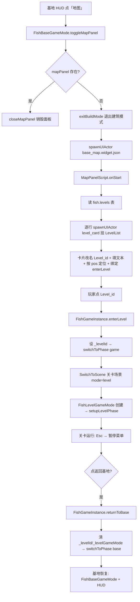

# 关卡系统（Level System）

> ClashMaster（fish 项目，部落冲突风格）的关卡选择与进入流程：基地 HUD 双按钮 → 地图面板（关卡列表）→ 关卡场景 → 返回基地。
> ⚠️ 战斗改造后（2026-08）：关卡场景不再是空壳，`FishLevelGameMode` 已改造为战斗 GameMode（攻打敌方基地），Esc 不再打开暂停菜单。**关卡内的战斗玩法见 [`battle_system.md`](./battle_system.md)**，本文档只覆盖"地图入口 + 关卡切换 + 返回基地"链路。
> 代码位置：`src/projects/fish/gameplay/`（`FishGameInstance.ts` 阶段路由、`level/` 关卡 GameMode、`base/MapPanel.script.ts` 地图面板）、`src/projects/fish/asset/`（`config/levels.table.json`、`fish_level*.scene.json`、`blueprints/ui/*.widget.json`）。
> 相关文档：[`battle_system.md`](./battle_system.md)、[`../engine/gameflow_system.md`](./engine/gameflow_system.md)、[`../engine/ui_system.md`](./engine/ui_system.md)、[`../engine/asset_tools_system.md`](./engine/asset_tools_system.md)。

## 1. 概述

关卡系统让玩家从基地出发，通过地图面板选择关卡进入**空壳关卡场景**（仅地面 + 相机 + 暂停菜单，无玩法逻辑），关卡内可按 Esc 打开暂停菜单并"返回基地"。它是 ClashMaster 三阶段流程（`menu → base → game`）的横向扩展：**关卡复用 `game` 阶段**，通过 `_levelId` 决定加载哪个场景（海域 or 关卡）。

关键角色与职责：

| 角色 | 职责 |
|---|---|
| `FishGameInstance` | 阶段路由（`enterLevel` / `returnToBase` / `_levelId` 状态）、关卡表查询 |
| `FishBaseGameMode` | 基地建造/交互、地图面板开关（`toggleMapPanel`）、建筑模式互斥 |
| `FishLevelGameMode` | 关卡空壳：相机 + Esc 暂停菜单开关 |
| `MapPanel.script.ts` | 地图面板行为：读关卡表动态生成关卡卡片、绑定进入 |
| `PauseMenu.script.ts` | 暂停菜单行为：继续游戏 / 返回基地 |
| `levels.table.json` | 关卡数据表（名称/场景/位置/星级），面板与场景均由此驱动 |

与相邻功能边界：**建筑系统**（`build_menu`/`FishBaseGameMode` 建造逻辑）归基地玩法，本文档只覆盖"地图入口 + 关卡切换 + 暂停返回"链路；**出海捕鱼**（`FishGameMode`）仍走 `startGameplay()`（`_levelId=null`），与关卡互斥。

## 2. 核心类 / 模块

| 类 / 模块 | 说明 |
|---|---|
| `FishGameInstance`（`gameplay/FishGameInstance.ts`） | `_levelId` 状态；`getLevelTable()/getLevel()`；`enterLevel(id)`；`returnToBase()`（public）；`setupLevelPhase()` |
| `FishLevelGameMode`（`gameplay/level/FishLevelGameMode.ts`） | 关卡 GameMode（mode="level" 注册）：正交相机、SpawnPlayer 时 Esc 绑定、`togglePauseMenu/closePauseMenu` |
| `FishLevelPlayerController` / `FishLevelPawn`（`gameplay/level/`） | 关卡输入管线占位（controller 持 `gameMode` 引用供 Esc 绑定） |
| `MapPanel.script.ts`（`gameplay/base/`） | 地图面板：关闭按钮 + 读表生成 `Level_{id}` 卡片（名称/星级/描述/位置/点击） |
| `PauseMenu.script.ts`（`gameplay/level/`） | 暂停菜单：`Btn_resume` → 关菜单；`Btn_returnBase` → `returnToBase()` |
| `LevelType`（`gameplay/common/types.ts`） | 关卡表行类型：name/scene/pos/stars/desc |
| `levels.table.json`（`asset/config/`） | DataTable（id `fish.levels`），transform 在 `FishConfigLoader` 注册 |
| `fish_level{1,2,3}.scene.json`（`asset/`） | 空壳关卡场景（mode="level"，地面 + 天空盒） |

## 3. 使用方法

### 3.1 配置关卡（新增关卡）

在 `asset/config/levels.table.json` 加一行（键 = 关卡 id）：

```json
"level4": { "name": "关卡 4", "desc": "描述", "scene": "FishLevel4", "pos": [3.5, 0.3], "stars": 4 }
```

同时新建对应场景资产 `asset/fish_level4.scene.json`（`name` 与 `scene` 一致、`mode` 必须为 `"level"`）。配置表与场景资产均为自动注册（glob），无需改代码。

### 3.2 进入关卡

```ts
// 地图面板关卡卡片点击（MapPanel.script.ts 内）
cardBtn.onClick = () => inst?.enterLevel(id)

// FishGameInstance 内部
enterLevel(id): boolean {
  // 查关卡表 → 设 _levelId → 清 base 相机 → switchToPhase('game')
  // switchToPhase 内 sceneName = getLevel(_levelId).scene → SwitchToScene 加载关卡场景
  // 场景 mode="level" → GameModeRegistry 匹配 FishLevelGameMode → setupLevelPhase()
}
```

### 3.3 返回基地

```ts
// 暂停菜单"返回基地"按钮（PauseMenu.script.ts）
backBtn.onClick = () => inst.returnToBase()   // public：清关卡状态 → switchToPhase('base')
```

### 3.4 打开/关闭地图面板

```ts
// HUD"地图"按钮（BaseHud.script.ts）
mapBtn.onClick = () => mode.toggleMapPanel()
// 打开时自动 exitBuildMode()（建筑模式互斥）；再点关闭
```

### 3.5 Esc 暂停菜单

`FishLevelGameMode.spawnPlayerInternal` 里绑定：

```ts
controller.inputComponent.BindAction('pause-menu', 'Escape', 'pressed', () => this.togglePauseMenu())
```

键盘链路：Viewport keydown → `InputRouter` → `GameViewport.handleGameKeyDown(e.key)` → `InputSys.handleKeyDown` → `controller.ProcessInput('Escape','pressed')` → 回调。

### 3.6 触发时机

| 操作 | 链路 |
|---|---|
| 点 HUD「建筑」 | `BaseHud.script` → `toggleBuildMode()`（显示/隐藏 build_menu） |
| 点 HUD「地图」 | `BaseHud.script` → `toggleMapPanel()`（生成/销毁 base_map） |
| 点关卡卡片 | `MapPanel.script` → `FishGameInstance.enterLevel(id)` |
| 按 Esc（关卡内） | `InputSys` → `FishLevelGameMode.togglePauseMenu()` |
| 点「返回基地」 | `PauseMenu.script` → `FishGameInstance.returnToBase()` |

## 4. 工作流程

### 4.1 主流程



### 4.2 分阶段说明

| 阶段 | 触发点 | 关键调用 | 产物 |
|---|---|---|---|
| 地图面板 | HUD Btn_map | `toggleMapPanel` / `spawnUIActor` | base_map widget + 关卡卡片 |
| 关卡卡片 | 面板 onStart | `getLevelTable` + `spawnUIActor(level_card)` | `Level_{id}` 节点（Name/Info/位置/onClick） |
| 进入关卡 | 卡片点击 | `enterLevel` → `switchToPhase('game')` | 关卡场景 + FishLevelGameMode + controller |
| 关卡运行 | setupLevelPhase | `mode.SpawnPlayer` + Esc 绑定 | FishLevelPawn（空壳） |
| 暂停 | Esc | `togglePauseMenu` → spawnUIActor | pause_menu widget |
| 返回基地 | Btn_returnBase | `returnToBase` → `switchToPhase('base')` | 基地场景 + HUD 恢复 |

### 4.3 设计要点

- **关卡复用 game 阶段**：不新增 `Phase` 枚举值，`_levelId` 区分出海/关卡——`switchToPhase('game')` 按 `_levelId` 选场景名（无关卡 → `ClashMaster` 海域），`setupGamePhase`/`setupLevelPhase` 二选一。对既有出海流程零侵入。
- **场景 mode 驱动 GameMode**：关卡场景 `mode: "level"`，`GameModeRegistry` 自动匹配 `FishLevelGameMode`——与 `menu/base/game` 同一机制，无需在 switchToPhase 里手写 new。
- **数据驱动地图**：关卡数、名称、位置全部来自 `levels.table.json`（`pos` 作为卡片 `anchorOffset`），新增关卡只需加表行 + 场景资产。
- **互斥单向**：打开地图面板自动 `exitBuildMode()`；关闭面板后可重新进入建筑模式（两面板独立开关，互不影响）。
- **同步清理**：`returnToBase()` 同时清理 `_gameMode`（出海）与 `_levelGameMode`（关卡）的相机注册，`_controller` Unpossess，防跨阶段残留。

## 5. 边界条件

| 条件 | 行为/后果 | 处理方式 |
|---|---|---|
| 关卡 id 不存在 / 表未加载 | `enterLevel` 返回 false，`logger.warn` | 调用方忽略返回值（卡片点击无 UI 反馈） |
| 关卡表未加载（getTable undefined） | 面板 onStart warn，关卡列表为空 | 表为 fire-and-forget 异步加载，开局瞬间可能未就绪 |
| 场景名与资产 name 不一致 | `SwitchToScene` 找不到场景 → 阶段切换失败 | 配置表 `scene` 必须与 `.scene.json` 的 `name` 一致 |
| 非关卡场景 mode 非 "level" | 创建错误 GameMode（如 base 场景） | 场景资产 `mode` 必须为 `"level"` |
| 地图面板打开时点兵营建筑 | 兵营面板打开（`openBarracksPanel` 内 `closeMapPanel()`） | 互斥：兵营优先 |
| 关卡内多次按 Esc | 暂停菜单开关切换（存在则销毁） | `togglePauseMenu` 幂等 |
| `_levelId` 残留 | `startGameplay`/`returnToBase` 均清 `_levelId = null` | 出海与返回不会误带关卡 |
| 关卡无 HUD | `FishLevelGameMode` 不设 `HUDClass` | 暂停菜单按需 spawnUIActor，不常驻 |

## 6. 依赖关系 / 注册机制

```
FishGameInstance
 ├─ FishLevelGameMode（GameModeRegistry 'level' ← register.ts）
 │   ├─ FishLevelPlayerController（Esc BindAction）
 │   └─ pause_menu.widget.json → PauseMenu.script.ts（ScriptRegistry 'gameplay/level/PauseMenu'）
 ├─ FishBaseGameMode
 │   └─ base_map.widget.json → MapPanel.script.ts（ScriptRegistry 'gameplay/base/MapPanel'）
 │       └─ level_card.blueprint.json（spawnUIActor 动态实例化）
 └─ levels.table.json → ConfigRegistry 'fish.levels'（FishConfigLoader.registerTableTransform + registerGlob）
```

- 资产注册：`asset/index.ts` 的 `import.meta.glob` 自动扫描（widget/blueprint/script），`asset/config/index.ts` 自动扫描配置表——**新增文件无需改注册代码**（`projects.instructions.md`）。
- 脚本注册 id 为路径式：`gameplay/base/MapPanel`、`gameplay/level/PauseMenu`（`.script.ts` 默认导出 + 文件路径推导）。

## 7. 踩坑记录

- **页面 hidden 导致 tick 停摆（测试环境）**：Playwright 集成浏览器页面 `visibilityState` 常为 hidden，rAF 暂停 → 游戏 tick 停 → **运行时动态生成的 UI（spawnUIActor）卡在 pendingSpawn 队列，BeginPlay/UIScriptComponent 不执行**（预生成的面板如 build_menu 在 World.BeginPlay 内直接提交，不受影响）。真实 Electron 无此问题；浏览器验证时手动 `inst.tick(0.016)` 驱动一帧提交队列即可。
- **多次开关残留**：toggle 面板时若 destroy 未提交（tick 停摆），旧实例残留（HUD 下出现多个 MapPanel），`ai.getActor` 可能查到旧实例造成误判。驱动 tick 后正常。
