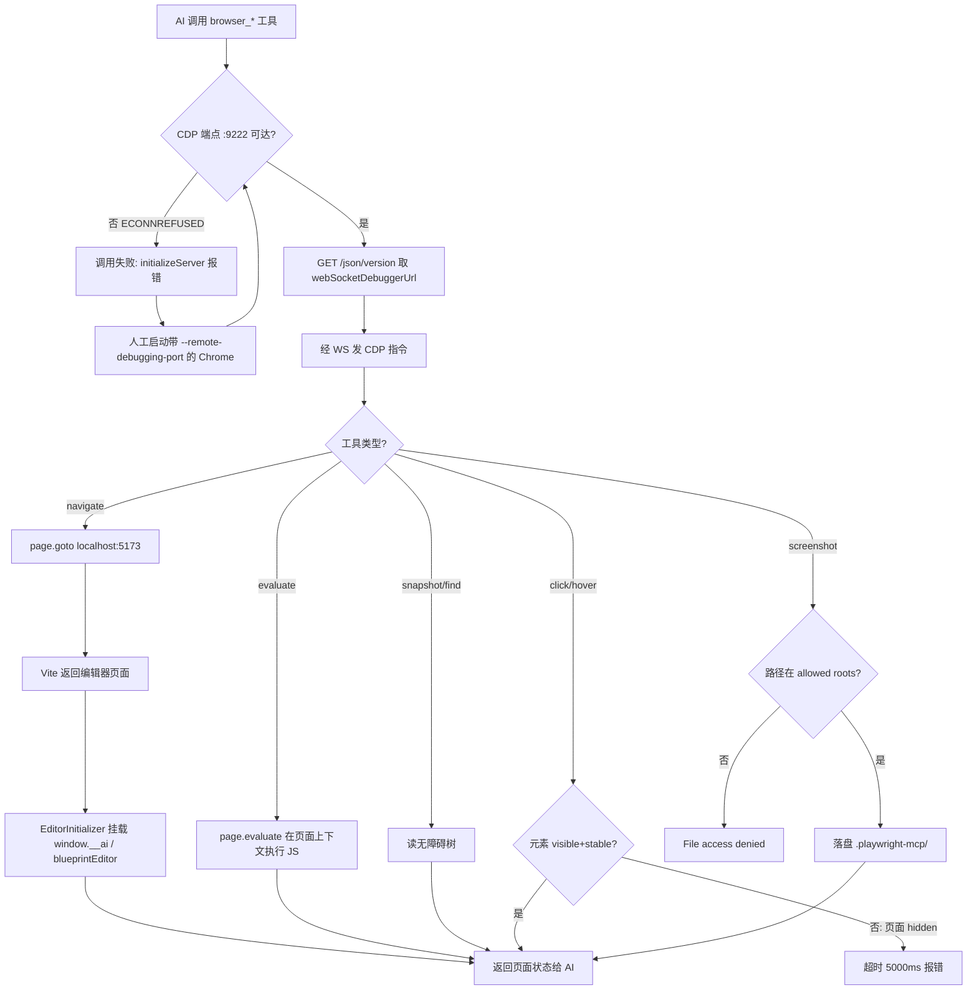

# Playwright MCP 调试（本地浏览器）

> 通过 `playwright` MCP server（`browser_*` 系列工具）操作**本地 Chrome** 调试编辑器的完整链路：CDP 挂载、工具清单、沙箱限制。
> 代码位置：`editor/mcp-server.mjs`（同进程另一通道，非本文）、`src/editor/MockElectronAPI.ts`（浏览器模式降级实现）
> 相关文档：[内置浏览器工具速查](./playwright_commands.md)（另一条路径，能力等价） / [MCP 集成与调试桥](./mcp_integration.md) / [Playwright 测试流程](./playwright_testing.md) / [编辑器核心](./editor/core_system.md)

## 1. 概述

浏览器端调试有**两条并列路径**，本文档只讲其中一条：

| 路径 | 工具族 | 浏览器由谁提供 | 是否需前置配置 |
|---|---|---|---|
| **① Playwright MCP**（本文） | `browser_*` | 用户自己启动的**本地 Chrome**（经 CDP 挂载） | **是**，必须先开 CDP 端口 |
| ② 内置浏览器工具 | `open_browser_page` 等 | VS Code 集成浏览器 | 否，开箱即用 |

两条路径打开的是**同一个 Vite 页面**（`http://localhost:5173/`），因此页面内调试桥（`window.__ai` / `window.blueprintEditor`）、编辑器通用流程、绝大多数踩坑**完全通用**。差异只在三点：**浏览器怎么起**、**元素怎么点**、**产物落在哪**。

关键角色：

| 角色 | 职责 |
|---|---|
| Vite dev server | 提供编辑器页面，监听 `::1:5173`（IPv6），多实例时端口递增 |
| 本地 Chrome | 被调试的浏览器，必须以 `--remote-debugging-port` 启动 |
| CDP 端点 `:9222` | Playwright MCP 与浏览器的连接通道，HTTP 探测 + WebSocket 控制 |
| `playwright` MCP server | 把 `browser_*` 工具调用翻译成 CDP 指令 |
| 输出沙箱目录 | 快照/截图/日志的落盘位置，白名单机制限制 |

**边界划分**：页面内**调试桥的事件语义**归 [AI 事件系统](./engine/ai_system.md)；**MCP 工具转发**（`demostudio-editor` server）归 [MCP 集成与调试桥](./mcp_integration.md)——本文的 `playwright` server 与它是**两个不同的 MCP server**，不要混淆。

## 2. 核心模块

| 模块 / 概念 | 说明 |
|---|---|
| `playwright` MCP server | 平台侧注入的 MCP 服务（不在项目 MCP 配置里），走 CDP 连本地浏览器 |
| CDP（Chrome DevTools Protocol） | 调试协议；MCP 经 `http://localhost:9222` 取 `webSocketDebuggerUrl` 再建 WS |
| `browser_evaluate` | 页面内执行 JS 的工具，**访问调试桥全靠它**，是本文路径的主力 |
| `browser_snapshot` / `browser_find` | 无障碍树快照与文本搜索，用于定位元素与断言，比截图更适合 AI 消费 |
| `MockElectronAPI` | 浏览器模式下 `window.electronAPI` 的降级实现（仅内存缓存，不落盘） |
| `window.__ai` | 页面内 AI 事件桥，见 [AI 事件系统](./engine/ai_system.md) |
| `window.blueprintEditor` | 页面内蓝图编辑服务，见 [蓝图编辑](./editor/blueprint_edit_system.md) |

## 3. 使用方法

### 3.1 前置：启动带 CDP 的 Chrome

`playwright` MCP **不会自己拉起浏览器**。没有可连的 CDP 端点时，任何 `browser_*` 调用直接失败：

```
Error: async initializeServer: connect ECONNREFUSED ::1:9222
Call log:
  - <ws preparing> retrieving websocket url from http://localhost:9222
```

启动命令（**独立 profile，不影响你正在用的浏览器**）：

```powershell
$chrome = 'C:\Program Files\Google\Chrome\Application\chrome.exe'
$ud = Join-Path $env:TEMP 'ds-playwright-cdp'
New-Item -ItemType Directory -Force -Path $ud | Out-Null
Start-Process -FilePath $chrome -ArgumentList @(
  '--remote-debugging-port=9222',
  '--remote-debugging-address=127.0.0.1',
  "--user-data-dir=$ud",
  '--no-first-run',
  '--no-default-browser-check',
  'http://localhost:5173/'
) | Out-Null
```

验证 CDP 已就绪（返回含 `webSocketDebuggerUrl` 即成功）：

```powershell
Invoke-RestMethod -Uri 'http://127.0.0.1:9222/json/version' -TimeoutSec 5
```

```jsonc
// 返回示例
{
  "Browser": "Chrome/151.0.7922.174",
  "Protocol-Version": "1.3",
  "webSocketDebuggerUrl": "ws://127.0.0.1:9222/devtools/browser/<id>"
}
```

**使用前提**：编辑器须已运行（`npm run electron:dev`），Vite 页面可达。探测方式：

```powershell
Invoke-RestMethod -Uri 'http://127.0.0.1:9877/api/status' -TimeoutSec 5
```

### 3.2 工具清单

| 工具 | 参数 | 说明 |
|---|---|---|
| `browser_navigate` | `url` | 打开页面 |
| `browser_snapshot` | `boxes?`、`depth?`、`target?` | 无障碍快照，**定位元素首选**，`boxes: true` 带坐标 |
| `browser_find` | `text` 或 `regex` | 快照内搜文本，比整棵快照便宜 |
| `browser_evaluate` | `function`、`target?` | **主力**：执行 JS，访问调试桥全靠它 |
| `browser_click` / `browser_hover` | `target` | 元素操作，⚠️ hidden 页面超时（见 §5） |
| `browser_type` / `browser_fill_form` | `target`、`text` / `fields` | 输入文本、填表单 |
| `browser_drag` | `startTarget`、`endTarget` | 拖拽 |
| `browser_press_key` | `key` | 按键 |
| `browser_tabs` | `action: list/new/close/select` | 标签页管理 |
| `browser_console_messages` | `level`、`all?` | 读控制台，`level: 'error'` 过滤报错 |
| `browser_network_requests` / `browser_network_request` | `index`、`filter?` | 网络请求列表与详情 |
| `browser_take_screenshot` | `scale`、`filename?` | 截图，⚠️ 有路径沙箱（见 §3.4） |
| `browser_run_code_unsafe` | `code` / `filename` | 任意 Playwright 代码，描述自带 RCE 警告 |
| `browser_wait_for` | `text` / `textGone` / `time` | 等待文本出现/消失/固定时长 |
| `browser_resize` | `width`、`height` | 调整窗口尺寸 |
| `browser_close` | — | 关闭页面 |

`function` 参数为字符串形式的箭头函数，在页面上下文执行：

```js
// browser_evaluate 的 function 参数
() => window.__ai.listEvents()
() => ({ visibility: document.visibilityState, rafOk: typeof requestAnimationFrame })
```

### 3.3 调用示例

打开编辑器并访问 AI 事件桥：

```js
// ① browser_navigate → http://localhost:5173/
// ② browser_evaluate，function 传：
() => window.__ai.listEvents()
```

```js
// 发事件并取回结果
() => window.__ai.emit('ai.getState', {})
```

```jsonc
// 返回（注意断言数据在 results[0]，不是返回值本身）
{
  "event": "ai.getState",
  "handled": true,
  "results": [{ "running": false, "phase": "idle", "score": 0, "gameOver": false, "actorCount": 0, "actors": [] }]
}
```

hidden 页面点击（绕过超时，见 §5）：

```js
// browser_evaluate 的 function 参数
() => {
  const el = document.querySelector('[aria-label="Demo2D"].startup-project-card')
  if (!el) return { err: 'not found' }
  el.dispatchEvent(new MouseEvent('click', { bubbles: true }))
  return { dispatched: true }
}
```

**触发时机**：全部由 AI 客户端显式调用发起，编辑器侧无自动触发。

### 3.4 输出目录沙箱

快照、截图、控制台日志**只能**落在 MCP 白名单根目录内：

```
C:\Users\<用户名>\background_agent_cli\.playwright-mcp\
```

传工作区绝对路径会被拒绝：

```
Error: File access denied: E:\DemoStudio\cache\x.png is outside allowed roots.
Allowed roots: C:\Users\<用户名>\background_agent_cli\.playwright-mcp, C:\Users\<用户名>\background_agent_cli
```

产物命名规则：`page-<ISO 时间戳>.png`、`.playwright-mcp\page-<时间戳>.yml`、`console-<时间戳>.log`。

> ⚠️ 该目录在**工作区外**，AI 侧的读图/读文件工具打不开。需要 AI 自己验证页面内容时，用 `browser_snapshot` / `browser_find` 读文本结构，而不是截图。

### 3.5 与内置工具的能力对应

| 内置浏览器工具 | Playwright MCP 等价 |
|---|---|
| `open_browser_page` | `browser_navigate` |
| `read_page` | `browser_snapshot`（+ `browser_find` 搜文本） |
| `screenshot_page` | `browser_take_screenshot` |
| `click_element` | `browser_click`；hidden 时改 `browser_evaluate` + `dispatchEvent` |
| `type_in_page` | `browser_type` / `browser_fill_form` |
| `run_playwright_code` | `browser_evaluate`（够用）/ `browser_run_code_unsafe`（需要 `page` 对象时） |

> ⚠️ `browser_evaluate` **没有** `run_playwright_code` 的 `deferredResultId` 异步化机制——要么同步返回，要么超时。长任务拆成多次短调用，或改用 `browser_run_code_unsafe`。

## 4. 工作流程

### 4.1 主流程



### 4.2 分阶段说明

| 阶段 | 触发点 | 关键调用 | 产物 |
|---|---|---|---|
| 连接 | 首次 `browser_*` 调用 | `GET http://localhost:9222/json/version` | WebSocket 调试连接 |
| 导航 | `browser_navigate` | CDP `Page.navigate` | 编辑器页面（Vite 5173） |
| 页面初始化 | 页面加载完成 | `EditorInitializer` 挂载调试桥 | `window.__ai`（16 个事件）、`window.blueprintEditor` |
| 交互 | `browser_click` / `browser_evaluate` | CDP 输入事件 / `Runtime.evaluate` | DOM 变化、事件结果 |
| 断言 | `browser_snapshot` / `browser_find` / `browser_console_messages` | 无障碍树 / console 缓冲 | 文本结构、日志条目 |
| 落盘 | `browser_take_screenshot` 等 | 写白名单目录 | `.playwright-mcp/` 下文件 |

### 4.3 设计要点

**为什么必须先挂 CDP**

`playwright` MCP 是**连接型**而非**启动型**服务：它只负责把工具调用翻译成 CDP 指令，不持有浏览器启动逻辑。好处是可以接管任意已有的 Chrome（包括正在调试的会话），代价是首次使用前必须人工开端口。

**为什么快照优于截图**

截图落在工作区外，AI 读不到；无障碍快照以文本形式返回，AI 可直接消费并定位元素 ref。涉及"验证页面确实渲染出某内容"时，优先 `browser_snapshot` / `browser_find`。

**两条路径如何共存**

Playwright MCP 连本地 Chrome（经 9222），内置工具连 VS Code 集成浏览器，两者互不干扰，可同时开着调同一个页面。页面内的编辑器实例、调试桥、HMR 行为完全一致。

### 4.4 双通道对照

| 关注点 | ① Playwright MCP（本文） | ② 内置浏览器工具 |
|---|---|---|
| 浏览器来源 | 用户启动的本地 Chrome | VS Code 集成浏览器 |
| 前置动作 | 必须开 CDP `:9222` | 无 |
| 页面可见性 | `hidden`（实测） | `hidden`（常见） |
| 点击方式 | `browser_click` 会超时 → 用 `browser_evaluate` + `dispatchEvent` | `click_element` 超时 → 用 `run_playwright_code` + `dispatchEvent` |
| 异步长任务 | 无 `deferredResultId`，拆短调用 | 返回 `deferredResultId` 需二次取结果 |
| 产物位置 | 沙箱目录（工作区外，AI 读不到） | 工作区内可读 |
| 需要 `page` 对象 | `browser_run_code_unsafe` | `run_playwright_code` |

## 5. 边界条件

| 条件 | 行为/后果 | 处理方式 |
|---|---|---|
| CDP 端点未启动 | `ECONNREFUSED ::1:9222`，所有工具不可用 | 按 §3.1 启动带 `--remote-debugging-port=9222` 的 Chrome |
| 编辑器未运行 | 页面打不开 / 白屏 | 先 `npm run electron:dev`，用 `:9877/api/status` 探测 |
| 端口被其他 Chrome 占用 | 新实例静默复用已有实例的调试端口 | 无需处理，确认 `json/version` 返回的浏览器是你要的即可 |
| 页面 `visibilityState === 'hidden'` | `browser_click` / `browser_hover` 等待 `visible+stable` 超时（5000ms） | 改用 `browser_evaluate` + `dispatchEvent('click', { bubbles: true })` |
| hidden 页面 rAF 停摆 | 实测 1 秒内 0 帧；动画/渲染类断言失效 | 断言用 DOM 与调试桥返回值，不依赖像素与帧 |
| `browser_evaluate` 执行超时 | 无 `deferredResultId` 兜底，直接报错 | 拆成多次短调用，或改用 `browser_run_code_unsafe` |
| 截图传工作区绝对路径 | `File access denied: ... outside allowed roots` | 不传 `filename` 用默认名，落 `.playwright-mcp/` |
| 读取沙箱目录内文件 | 该目录在工作区外，AI 读图/读文件工具被拒 | 改用 `browser_snapshot` / `browser_find` |
| 调试 CDP 的 Chrome 被关闭 | 连接断开，工具全部失败 | 重新执行 §3.1 启动命令 |
| Vite 多实例 | 页面端口非 5173（递增），但 MCP HTTP 端口为 9877+ 独立递增 | 用 `Get-NetTCPConnection -LocalPort 5173` 确认实际端口 |
| `window.electronAPI` 读写 | 浏览器模式是 `MockElectronAPI`，仅内存缓存**不落盘** | 保存/加载真实磁盘必须回 Electron 验证 |
| `browser_run_code_unsafe` | 工具描述自带 RCE-equivalent 警告 | 非必要不使用 |

## 6. 依赖关系

```
VS Code 集成浏览器（路径②）         本地 Chrome + CDP :9222（路径①，本文）
        │                                     │
        │ open_browser_page 等                │ browser_* 工具
        └──────────────┬──────────────────────┘
                       ▼
              Vite dev server（::1:5173）
                       ▼
              EditorInitializer 挂载
              window.__ai / window.blueprintEditor
                       ▼
              AIModule 事件总线 ──► 引擎 / 编辑器动作
```

另一条 AI 控制通道（不经浏览器，直接控制 Electron）见 [MCP 集成与调试桥](./mcp_integration.md)：

```
AI 客户端 ──stdio──► editor/mcp-server.mjs ──HTTP :9877+──► electron/main.ts ──IPC──► 渲染进程
```

## 7. 踩坑记录

| 现象 | 原因 | 处理 |
|---|---|---|
| `ECONNREFUSED ::1:9222` | 无浏览器开 CDP 端口 | 按 §3.1 启动 Chrome |
| `connect ECONNREFUSED` 但 9222 有监听 | Chrome 只监听 IPv6，地址族不匹配 | 加 `--remote-debugging-address=127.0.0.1` |
| `browser_click` 超时 5000ms | 页面 hidden，`visible+stable` 永不满足 | `browser_evaluate` + `dispatchEvent` |
| 实测 rAF 1 秒 0 帧 | hidden 页面 rAF 暂停（非 bug） | 断言用 DOM / 调试桥，不用像素帧 |
| `File access denied ... outside allowed roots` | 截图路径沙箱 | 用默认文件名或落在允许根目录 |
| 截图生成了但 AI 读不了 | 沙箱目录在工作区外 | 改用 `browser_snapshot` / `browser_find` |
| 误以为 MCP 连的是 Vite 端口 | 9222（CDP）与 5173（Vite）是两回事 | CDP 连浏览器，浏览器再去访问 5173 |
