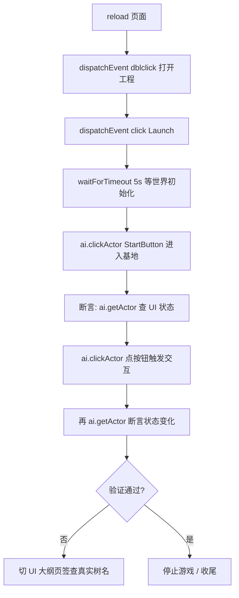

# Playwright 浏览器测试流程（Playwright Testing）

> DemoStudio 编辑器/游戏的浏览器端测试方法论：环境限制、通用操作流程、断言技巧与踩坑记录。
> 代码位置：`src/editor/EditorInitializer.ts`（`window.__ai` 调试桥）、`src/App.tsx`（工程选择/启动）、`src/components/Viewport.tsx`（Game 视口）。
> 相关文档：[`../system_overview.md`](./system_overview.md)、[`./editor/viewport_system.md`](./editor/viewport_system.md)、[`./editor/blueprint_edit_system.md`](./editor/blueprint_edit_system.md)。

## 1. 概述

DemoStudio 是 Electron + Vite + React + Three.js 应用。除 Electron 窗口外，可以通过 VS Code 内置的 Playwright 浏览器工具（`open_browser_page` / `click_element` / `read_page` 等，或 `run_playwright_code` 执行任意 Playwright 代码）打开 `http://localhost:5173/` 进行**端到端验证**——不干扰 Electron 窗口。

但浏览器测试环境与真实 Electron 有显著差异：

| 维度 | Electron 窗口 | 集成浏览器（Playwright） |
|---|---|---|
| `electronAPI`（readJsonFile/writeJsonFile 等） | 可用 | **不可用**（Mock 内存缓存，`src/editor/MockElectronAPI.ts`） |
| 页面可见性 | visible | **常为 `hidden`**（rAF 暂停、渲染循环停摆） |
| 点击交互 | 正常 | Playwright `click()` 等待元素 stable **必超时**，需 `dispatchEvent` |
| 游戏日志文件（`logs/game_*.log`） | 正常写盘 | **写入不稳定**（多次 Launch 可能不新建文件） |
| 文件保存 | 真磁盘 | Mock 只写内存（`readJsonFile` 读缓存） |

> ⚠️ **核心前提**：`electronAPI` 在浏览器不可用，涉及读盘/写盘的流程（打开工程 → 读工程文件）在浏览器能跑通是依赖 Mock 层，**保存/加载真实文件必须回 Electron 验证**。

## 2. 核心概念

| 概念 | 说明 |
|---|---|
| `window.__ai` | 编辑器 AI 事件桥（`EditorInitializer.registerEditorAIHandlers` 注册）：`emit(event, payload)` / `listEvents()`，游戏与编辑器事件都可触发 |
| `ai.clickActor` | 按 UI 节点 `root.name` **递归查找**并触发点击（`{ok, clicked, type}`），无需屏幕坐标 |
| `ai.getActor` | 按 name 查 Actor（`{ok, actor:{name,type,position,active,children,components}}`）——注意返回的 `name` 是类名，**不要用它断言节点名** |
| AI 事件列表 | `ai.selectActor, ai.dragActor, ai.notify, ai.showMessage, ai.spawnActor, ai.destroyActor, ai.transformActor, ai.setScore, ai.addScore, ai.gameOver, ai.switchScene, ai.getState, ai.clickActor, ai.getActor, ai.scrollCamera`（`ai.listEvents()` 实时查） |
| MockElectronAPI | 浏览器环境下的 electronAPI 替代：`readJsonFile` 返回**深拷贝**（模拟真实 IPC 序列化），`writeJsonFile` 只写内存缓存 |

## 3. 使用方法

### 3.1 打开工程（dispatchEvent 原生事件）

集成浏览器页面 hidden 时，Playwright 的 `click()`/`dblclick()` 会等待元素"可见且稳定"，**永远超时**（`locator.click: Timeout ... exceeded`）。必须用原生事件派发：

```js
// ✅ 方式 A（实测最简）：对工程卡片文本 dispatchEvent dblclick，一次打开
// （ProjectSelector 卡片 onClick 只 setSelected，但 dblclick 冒泡路径实测可直接完成打开）
await page.getByText('FishMaster', { exact: false }).first().dispatchEvent('dblclick', { bubbles: true })

// ✅ 方式 B（显式两步，等价真实用户操作）：
await page.getByText('FishMaster').first().dispatchEvent('click', { bubbles: true })       // 选中卡片
await page.getByRole('button', { name: '打开工程' }).dispatchEvent('click', { bubbles: true }) // 点打开

// ❌ 错误：会卡住直到超时
// await page.getByText('FishMaster').first().dblclick()
```

### 3.2 启动 / 停止游戏

```js
// Launch 按钮（状态栏出现 ▶ Launch）
await page.getByRole('button', { name: 'Launch' }).dispatchEvent('click', { bubbles: true })
await page.waitForTimeout(5000)  // 等世界初始化

// 停止（运行中按钮变 ■ Stop）
await page.getByRole('button', { name: 'Stop' }).dispatchEvent('click', { bubbles: true })
```

### 3.3 游戏阶段推进（AI 事件驱动）

鼠标坐标点击游戏 UI 在 hidden 页面不可行，一律用 `window.__ai` 事件桥：

```js
const r = await page.evaluate(async () => {
  // 主菜单 → 点"开始游戏"进入基地阶段
  return await window.__ai.emit('ai.clickActor', { name: 'StartButton' })
})
// r = { event:'ai.clickActor', handled:true, results:[{ok:true, clicked:1, type:'button'}] }
```

### 3.4 断言运行时状态

```js
const info = await page.evaluate(async () => {
  const g = await window.__ai.emit('ai.getActor', { name: 'BuildMenu' })
  const a = g.results[0].actor
  return { active: a.active, pos: a.position, childCount: a.children.length }
})
// BuildMenu 默认 active:false（隐藏）、8 个子节点（背景+7按钮）
```

**注意 `ai.getActor` 的 `name` 字段是类名（如 "Actor"/"GenericActor"），不是资产节点名**。要看真实 UI 树名，切换到"UI 大纲"页签读 DOM。

### 3.5 读页面 DOM / 切页签

```js
// 切到 UI 大纲页签，读真实 UI 树结构（HUD → ActionBar → Btn_map 等）
await page.getByRole('button', { name: 'UI 大纲' }).dispatchEvent('click', { bubbles: true })
const txt = await page.evaluate(() => document.body.innerText)
```

### 3.6 返回值的 deferredResultId 机制

`run_playwright_code` 中带 `await` 的长 evaluate 可能先返回 `deferredResultId`（"code has not finished executing"）。用**同一 pageId、无 code**再调用一次拿最终结果：

```js
// 第一次调用 → 返回 deferredResultId
// 第二次调用（无 code）→ 返回真实结果
```

## 4. 工作流程

### 4.1 完整端到端测试流程（FishMaster 示例）



### 4.2 分阶段说明

| 阶段 | 关键动作 | 验证点 |
|---|---|---|
| 环境准备 | `page.reload()`（改代码后必须！） | 页面标题 "DemoStudio Editor" |
| 打开工程 | dblclick 工程卡片 | 状态栏显示工程名 + `▶ Launch` |
| 启动游戏 | click Launch | 状态栏 `Running`、大纲出现 pawn/camera |
| 阶段推进 | `ai.clickActor` 点菜单按钮 | 大纲切换（如 FishMainMenuPawn → BaseCamera/FishBasePawn） |
| 交互断言 | `ai.clickActor` + `ai.getActor` 组合 | actor.active 翻转、position、children 数量 |
| 结构断言 | "UI 大纲"页签 | 真实节点名（ActionBar/Btn_map/BuildMenu 等） |

### 4.3 关键规则

- **改代码后必须 reload 页面再测**：Vite HMR 只热更新模块，已挂载的 manager 实例不重建；页面 bundle 可能仍是旧代码（现象：日志还是旧格式、新 UI 节点不存在）。改完代码 → `page.reload()` → 重走全流程
- **测试过程中不要再改代码**：HMR 会把模块级静态状态全部重置（UndoManager 栈、workingCopies、`window.blueprintEditor` 引用），导致断言突然失效
- **断言优先用页面 UI 信号**（按钮 disabled 状态、输入框值、DOM 文本），动态 `import()` 的模块**不一定是页面实例**（见踩坑 5.1）
- **查询服务状态走 `window.blueprintEditor`**（页面实际实例），动态 import 结果不可信

## 5. 边界条件 / 踩坑记录

### 5.1 动态 import 与 Vite 模块缓存（大坑）

`page.evaluate` 里裸 `import('/src/engine/xxx.ts')` 与引擎内部模块**不是同一实例**：Vite 转换后的模块 URL 带 `?t=<mtime>`，裸 import 不带 → ES 模块缓存按完整 URL 区分 → 两个类实例 → `instanceof` 判断失败（如 `getComponent(UITransformComponent)` 返回 null）。

- 编辑器服务模块（BlueprintEditorService/UndoManager）**无 `?t=` 的裸 import 与页面同实例**；AssetPreviewManager/UIPreviewManager 等带 `?t=` 的**裸 import 是独立实例**
- 解决：验证用端到端 DOM 事件 + 服务层 `read/undo` 断言，或先 `fetch('/src/engine/xxx.ts')` 拿转换后代码里的 import URL（含 `?t=`）用完全相同的 URL import
- **`instanceof` 判断失败的典型症状**：`getComponent(UITransformComponent)` 返回 null、组件逻辑走默认分支

### 5.2 页面 hidden → 渲染循环不跑

`visibilityState === "hidden"` → 浏览器暂停 rAF → 所有渲染循环不跑（FPS: 0、调试帧计数为 0）——**这是环境限制不是代码 bug**，bringToFront 无效。

- 验证渲染结果的办法：手动驱动一帧（`mgr.updateBounds()` + `renderer.render(scene/camera)` + autoClear=false + clearDepth + 渲染 overlayScene），或直接读 gizmo 几何体 position/scale/rotation（比像素更可靠）
- 点击交互必须走 dispatchEvent（见 §3.1）

### 5.3 游戏日志文件写入不稳定

`logs/game_*.log` 在浏览器 Mock 环境**多次 Launch 可能不新建文件**（真实 Electron 正常）。验证日志输出优先：
- 页面内 console / Recent events
- 或靠 `ai.getActor` 等事件断言状态（行为证据比日志可靠）

### 5.4 Mock readJsonFile 返回深拷贝

Mock 层 `readJsonFile` 返回深拷贝（模拟真实 IPC 序列化）。此前返回共享引用时，Inspector onChange 直接改 `p[i]` 会原地污染缓存/工作副本 → oldSnapshot 已污染 → **撤销无效**。现在的行为与真实 Electron 一致。

### 5.5 HMR 对测试的破坏

- 修改代码实时触发 HMR 重载 → 模块级静态状态全部重置（UndoManager 栈、workingCopies/dirtyKeys、`window.blueprintEditor` 引用、console hook 闭包）
- 实测症状：测试中改一行代码 → 撤销后重做按钮突然禁用（undo 栈被 HMR 清空）
- **日志捕获注意**：console hook 挂在旧实例闭包上，HMR 后新模块的 logger 输出绕过 hook——捕获不到不代表日志没打

### 5.6 资产校验的静态验证替代

浏览器无法跑 assetLint（依赖 Electron 文件系统），资产结构用 node 脚本静态验证：

```powershell
node -e "const a=require('path/to/widget.json'); console.log(a.children.map(c=>c.name+':'+c.id).join(', '))"
```

可验证：id 唯一性（递归）、组件 schema 一致性、UIText 字段完整性、anchor 枚举合法性（对照 `componentChecker.ts` 的允许值）。

### 5.7 其他坑

| 现象 | 原因/处理 |
|---|---|
| `click` 打开工程卡超时 | hidden 页面 → 一律 dispatchEvent 原生事件；打开工程用 dblclick（方式 A）或 选中+点"打开工程"（方式 B），见 §3.1 |
| 点击任何元素都超时 | hidden 页面 → 一律 dispatchEvent 原生事件 |
| `page.evaluate` 返回 deferredResultId | 长 evaluate 异步化，用同 pageId 无 code 再调一次 |
| 首次运行日志显示旧代码 | 页面没 reload，HMR 未重建实例 → reload 重走 |
| PowerShell 写 JSON 带 BOM | `Set-Content -Encoding UTF8` 写 BOM，`JSON.parse` 直接失败；用 `[IO.File]::WriteAllText(path, text, (New-Object Text.UTF8Encoding($false)))` |
| Vite 转换缓存过期 → 白屏 | `The requested module '...' does not provide an export named 'World'`，磁盘文件正常 → touch 文件（`(Get-Item file).LastWriteTime = Get-Date`）→ reload |
| troika 文本度量不全 | 动态 import 的孤立 Actor（未挂渲染场景）中 ascender/lineHeight undefined，换行等渲染结果应在真实游戏内验证 |

## 6. 依赖关系

```
run_playwright_code (VS Code 集成浏览器)
  └─ page.evaluate → window.__ai（EditorInitializer.registerEditorAIHandlers 注册）
       ├─ ai.clickActor → AIModule.emit → 游戏/编辑器 AI 处理器
       ├─ ai.getActor   → 运行时 Actor 树查询
       └─ ai.listEvents → 可用事件枚举
  └─ page.getByText / getByRole → DOM 交互（hidden 下需 dispatchEvent）
  └─ MockElectronAPI（src/editor/MockElectronAPI.ts）→ readJsonFile 内存缓存
```

浏览器环境不依赖 Electron 主进程（无需 `electronAPI` 的 IPC），游戏本体通过 Vite dev server 独立运行于页面内。
