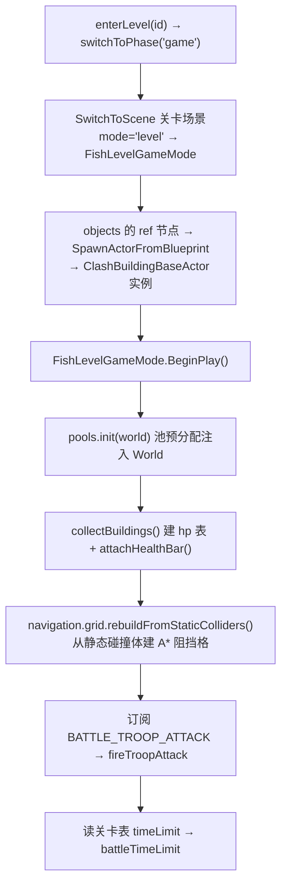
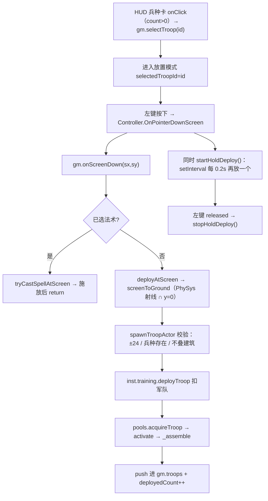

# 战斗系统（Battle）

> **一句话定位**：战斗系统把「关卡场景」改造成一场攻打战——场景资产里的敌方基地是关卡内容，玩家点兵卡选兵、点战场放兵，兵自动寻路拆建筑，防御塔自动索敌开火，打到时限或摧毁城镇大厅后按摧毁率结算星级与掠夺。
>
> **什么时候会用到你**：改放兵手感（长按节奏 / 放置校验）、调兵种 AI（索敌偏好 / 寻路 / 攻击节奏）、调防御塔数值、加战斗计时或胜负规则、排查「兵不动 / 放不出兵 / 掠夺数字不跳 / 结算不来」。
>
> 代码位置：`src/projects/fish/gameplay/battle/`、`src/projects/fish/gameplay/level/`

---

## 1. 先记住这几个文件

| 文件 | 一句话职责 | 你要改它的场景 |
|---|---|---|
| [FishLevelGameMode.ts](../../src/projects/fish/gameplay/level/FishLevelGameMode.ts) | 战斗权威：收集敌方建筑、放兵校验、伤害与掠夺、防御塔开火、计时与结算 | 改战斗规则 / 数值 / 结算条件 |
| [FishLevelPlayerController.ts](../../src/projects/fish/gameplay/level/FishLevelPlayerController.ts) | 玩家输入：左键放兵 + 长按连续放兵 + 鼠标位置转发相机云台 | 改放兵手感、输入绑定 |
| [TroopMoveComponent.ts](../../src/projects/fish/gameplay/battle/troops/TroopMoveComponent.ts) | 兵移动：A* 寻路调用点、阻挡改目标、卡死重算、飞行兵直线 | 兵走位异常、绕不过墙 |
| [BattleProjectileActor.ts](../../src/projects/fish/gameplay/battle/BattleProjectileActor.ts) | 弹丸：池化直线飞行，命中建筑或兵后扣血并归还池 | 改弹道 / 命中判定 |

**关键心智模型**：**用户操作全在 Controller，游戏逻辑全在 GameMode，兵的行为全在组件**。Controller 不认识建筑，GameMode 不碰鼠标事件，兵 Actor 只做薄装配——三方靠 `FishLevelGameMode` 的公开方法（`onScreenDown` / `getBestTargetFor` / `damageBuilding`）对接。

---

## 2. 一场战斗怎么打完：从进入到结算

### 2.1 谁开始了它

玩家点地图面板关卡卡片 → `inst.enterLevel(id)`（[MapPanel.script.ts:119](../../src/projects/fish/gameplay/base/MapPanel.script.ts)），校验关卡与解锁后切阶段（[FishGameInstance.ts:849](../../src/projects/fish/gameplay/FishGameInstance.ts)）：

```ts
this._levelId = id
this._phase = 'game'
const ok = this.switchToPhase('game')
```

> `switchToPhase('game')` 按 `_levelId` 分流——有 id 走 `setupLevelPhase()`（关卡战斗），无 id 走 `setupGamePhase()`（出海捕鱼，[FishGameInstance.ts:600](../../src/projects/fish/gameplay/FishGameInstance.ts)）。**出征与关卡战斗共用同一套战斗代码**，区别只是 `_levelId` 为 null 时不记通关、不评关卡星级。

装配把相机交给 World 托管并注入结算回调（[FishGameInstance.ts:716](../../src/projects/fish/gameplay/FishGameInstance.ts)）：

```ts
private setupLevelPhase(): void {
  const mode = this.world.gameMode as FishLevelGameMode
  this._levelGameMode = mode
  spawnActor(mode.baseCamera)                       // 相机托管给 World（构造者 ≠ 托管者，见坑 5）
  this.setupCamera(mode.baseCamera.cameraComponent, 12, 16, 18)
  // PhySys.setup(camera, uiLayer)：screenToGround 依赖它，没 setup 就永远放不出兵
  if (mode.controller) { this._controller = mode.controller }  // 为 null 说明 StartPlay 漏调 super
  mode.onBattleOver = () => { /* progression.settleBattle({ destroyRate, townhallDestroyed, ... }) */ }
}
```

> 相机是 **GameMode 构造的，却由 `setupLevelPhase` 托管**——「构造者 ≠ 托管者」是历史坑源，见 §5 坑 5；`PhySys.setup` 又是放兵的前置（`screenToGround` 靠它做屏幕→地面求交）。调试可直跳：`window.__fishBattle.enterLevel('level1')` / `addArmy('barbarian', 10)` / `deploy('barbarian', 0, 10)` / `getBattle()`（[FishGameInstance.ts:274](../../src/projects/fish/gameplay/FishGameInstance.ts)）。

### 2.2 战场构建



**敌方基地不是代码生成的，是场景资产摆好的**。`fish_level3.scene.json` 里 15 个 `type: "ref"` 节点，形如 `{ "type": "ref", "name": "Townhall_1", "ref": "asset/blueprints/buildings/townhall.blueprint.json", "position": [0, 0, -8] }`。

> 换关卡布阵 = 改场景资产，**不动一行战斗代码**。加一关只需加 `.scene.json` + `levels.table.json` 一行（场景 `mode` 必须是 `"level"`，否则 GameMode 不匹配）。

`BeginPlay` 把散在场景里的建筑收拢成战斗状态（[FishLevelGameMode.ts:141](../../src/projects/fish/gameplay/level/FishLevelGameMode.ts)）：

```ts
this.pools.init(this.world!)
this.collectBuildings()                                   // 建 hp 表 + 挂血条
this.navigation.grid.rebuildFromStaticColliders(this.world!.physics)
this._unsubTroopAttack = this.gameInstance?.events.on<TroopAttackEvent>(BATTLE_TROOP_ATTACK,
  (ev) => { this.fireTroopAttack(ev.troop, ev.target, ev.damage) }) ?? null
this.battleTimeLimit = level?.timeLimit ?? 180
```

> **顺序不能换**：`collectBuildings()` 必须早于 `rebuildFromStaticColliders`——网格从**物理静态碰撞体**栅格化，建筑 collider 得先 BeginPlay 建好，晚一步网格为空，兵会全部直线穿墙。另两个易漏点：兵攻击走**事件**（组件只 `emit`，由这里统一转 `fireTroopAttack`，攻击组件因此不持有弹丸池）；时限按 `level?.timeLimit ?? 180` 取，`levels.table.json` 里只有 `level3` 显式写了 `150`。

`collectBuildings`（[FishLevelGameMode.ts:258](../../src/projects/fish/gameplay/level/FishLevelGameMode.ts)）遍历 `GetAllActors` 收 `ClashBuildingBaseActor`，建 hp 表并 `attachHealthBar`。

> 血条是**运行时挂组件**，不写进蓝图也不写进场景——所以基地阶段（同一个 `ClashBuildingActors` 类）不会长出敌人血条。`attachHealthBar` 里的 `b.enableTick()` 不能漏：血条的「3 秒无受击隐藏」倒计时靠建筑 Actor 的 Tick 驱动。

### 2.3 放兵链路



**Controller 侧：按下立即放一个，同时起长按定时器**（[FishLevelPlayerController.ts:37](../../src/projects/fish/gameplay/level/FishLevelPlayerController.ts)）：

```ts
override OnPointerDownScreen(screenX: number, screenY: number): void {
  this.lastX = screenX; this.lastY = screenY
  this.gameMode?.onScreenDown(screenX, screenY)
  this.startHoldDeploy()
}
private startHoldDeploy(): void {
  this.stopHoldDeploy()
  this.holdTimer = window.setInterval(() => {
    if (!this.gameMode?.placeTroopId) { this.stopHoldDeploy(); return }
    this.gameMode.deployAtScreen(this.lastX, this.lastY, true)   // true = silent
  }, HOLD_DEPLOY_INTERVAL * 1000)
}
```

`HOLD_DEPLOY_INTERVAL = 0.2`（[FishLevelPlayerController.ts:17](../../src/projects/fish/gameplay/level/FishLevelPlayerController.ts)）。三个反直觉处：**节流靠 GameMode 状态而非消息**——定时器每 tick 读 `gameMode.placeTroopId`，玩家取消后 `cancelPlaceMode()` 只置空 `selectedTroopId`、**不反向通知 Controller**，定时器下一 tick 自行退出（单向依赖：Controller 认识 GameMode，反之不然）；**`silent=true` 是必须的**，否则按住划过建筑群时日志每秒刷 5 条「与建筑重叠」；**长按跟着鼠标走**——`OnPointerMoveScreen` 持续更新 `lastX/lastY`，按住拖动是「刷兵」而非原地叠一堆。

**GameMode 侧：校验顺序决定「军队什么时候扣」**（[FishLevelGameMode.ts:569](../../src/projects/fish/gameplay/level/FishLevelGameMode.ts)）：

```ts
if (Math.abs(x) > PLACE_HALF || Math.abs(z) > PLACE_HALF) { /* warn：超范围 */ return false }
const troop = inst.getTroop(troopId)                       // 兵种表未加载或行缺失 → error 返回
if (!troop || this.findBlockerAt(x, z, troop.size[0] / 2)) { /* warn：与建筑重叠 */ return false }
if (!inst.training.deployTroop(troopId)) { /* warn：军队无此兵 */ return false }
try { actor = this.pools.acquireTroop({ troopId, gm: this, troop, x, z }) }
catch (e) { inst.training.refundTroop(troopId); return false }
this.troops.push(actor as TroopActor); this.deployedCount++
```

> **先扣军队，取池失败再 `refundTroop` 退回**。所有前置校验（范围 / 兵种 / 重叠）都在扣军队**之前**，扣完之后唯一失败点只剩 `acquireTroop` 抛异常，用 try/catch + refund 兜住。别把 `deployTroop` 挪到 `acquireTroop` 之后——那样兵已站到场上而军队未扣，玩家可靠异常刷出无限兵。`PLACE_HALF = 24`（[ClashBaseBuilder.ts:20](../../src/projects/fish/gameplay/base/ClashBaseBuilder.ts)）；`findBlockerAt` 传**半宽** `troop.size[0] / 2`，传全宽会让碰撞盒双倍大（见 §5 坑 1~3）。

兵 Actor 由池取出（[FishObjectPools.ts:106](../../src/projects/fish/gameplay/game/FishObjectPools.ts)），装配分首次与复用两条路径（[TroopActors.ts:76](../../src/projects/fish/gameplay/battle/troops/TroopActors.ts)）：

```ts
protected _assemble(opts: TroopDeployOptions): void {
  const { gm, troop, x, z } = opts
  this.setPosition(x, troop.flying ? 2 : 0, z)
  if (!this._assembled) {                    // 首次：建 mesh / collider / 五个战斗组件
    const cdo = BlueprintRegistry.resolve(troop.blueprint)
    // cdo 里的 CapsuleMeshComponent → ComponentRegistry.create，手动应用蓝图 Transform 偏移
    // !flying → CircleColliderComponent，radius = troop.size[0] / 2
    this.health = this.addComponent(TroopHealthComponent, gm, troop)
    this.addComponent(TroopHealthBarComponent, troop)
    this.addComponent(TroopTargetComponent, gm, troop)
    this.addComponent(TroopMoveComponent, gm, troop)
    this.addComponent(TroopAttackComponent, gm, troop)
    // ability 分派：wallBreaker → WallBreakerAbilityComponent，healer → HealerAbilityComponent
    this._assembled = true
  }
  if (this._collider) this._collider.restore()   // 复用：只 restore + 重置血量
  this.health.resetHp(); this.enableTick()
}
```

> **对象池复用的是整棵 Actor 子树，不是单个 mesh**。`_assembled` 让 mesh / 碰撞体 / 五个战斗组件**只创建一次**，之后每次放兵只 `restore()` + `resetHp()` + `enableTick()`；每兵种一个独立池（[FishObjectPools.ts:57](../../src/projects/fish/gameplay/game/FishObjectPools.ts)，上限 50）。**`flying` 兵没有碰撞体**，不受物理阻挡也不触发 `onCollisionEnter`，天然越过城墙；代价是移动组件里 `collider` 为 null 必须走直线分支。mesh **从蓝图 CDO 克隆**不走 `SpawnActor`，所以不产生额外 Actor 树；蓝图 `TransformComponent.position` 需手动应用到 `mesh.position`——克隆出来的是组件不是 Actor，父级偏移不会自动生效。

### 2.4 兵 AI 与移动 / 攻击

每个兵挂 5 个组件，每帧按 `Target → Move → Attack` 各跑各的 Tick：`TroopTargetComponent` 调 `gm.getBestTargetFor()` 输出 `target`；`TroopMoveComponent` 在射程外 A* 靠近；`TroopAttackComponent` 在射程内按 0.5s 间隔 emit 攻击事件。

**索敌**（[FishLevelGameMode.ts:386](../../src/projects/fish/gameplay/level/FishLevelGameMode.ts)）：目标覆盖优先 → 按 `preferred` 偏好过滤 → 平方距离取最近。

```ts
const override = this.troopTargetOverride.get(troop)
if (override && !override.bPendingDestroy) return override    // 覆盖优先
if (override) this.troopTargetOverride.delete(troop)          // 覆盖目标已摧毁 → 清除后重新索敌
const candidates = this.buildings.filter((b) => this.matchPreferred(b.type.id, troop.troop.preferred))
const list = candidates.length > 0 ? candidates : this.buildings   // 偏好无候选 → 回退全部
```

> 两个防御性设计：偏好过滤不到候选时**回退全部建筑**（否则巨人打光防御塔后会因无 `defenses` 候选原地发呆）；目标覆盖的建筑被摧毁（`bPendingDestroy`）时**自动清除覆盖**，兵重新索敌。

**移动**：寻路终点不是建筑中心，而是「兵→建筑连线上距中心 attackDist 的点」（[TroopMoveComponent.ts:126](../../src/projects/fish/gameplay/battle/troops/TroopMoveComponent.ts)）：

```ts
const attackDist = troopAttackDist(this.troop, target)
const edgeX = center.x - (dx / distToCenter) * attackDist   // 终点取在连线上的攻击范围边界
const edgeZ = center.z - (dz / distToCenter) * attackDist
if (this._inAttackRange) { this.stopMove(); if (!wasInRange) this.path = null; return }
if (!this.collider) {                       // 飞行兵：无碰撞体，直接改 pos
  const step = this.troop.speed * dt
  pos.x += (dx2 / dist) * step; pos.z += (dz2 / dist) * step; return
}
```

> **终点取在连线上是刻意的**：A* 目标点若直接给建筑中心，而中心在阻挡格里，寻路会绕到建筑背后甚至失败；取连线上的边缘点保证路径方向始终是「兵朝建筑」。`troopAttackDist = troop.range + building.type.size / 2`（[TroopTargetComponent.ts:22](../../src/projects/fish/gameplay/battle/troops/TroopTargetComponent.ts)）把射程换算成**中心距**，否则近战兵被 AABB 挡在 `half + 兵半宽` 处时中心距永远大于 range，兵贴着墙却打不到（实测死锁，见 §5 坑 1~3）。飞行兵改 `pos`、地面兵改物理 `velocity`——两条路径都必须保留。

寻路重算不是每帧做的（[TroopMoveComponent.ts:195](../../src/projects/fish/gameplay/battle/troops/TroopMoveComponent.ts)）：

```ts
const needRepath = (() => {
  if (this.pathTickCounter < TroopMoveComponent.REPATH_INTERVAL) return false   // 24 帧最小间隔
  if (this.pathFailCooldownSec > 0) return false                                // 失败后 0.15s 冷却
  if (this.stuckTicks > 36) return true                                         // 卡死强制重算
  if (this.pathTarget !== target) return true
  return this.path && this.path.length > 0 && wpd > this.gm.navigation.grid.cellSize * 2
})()
if (needRepath) {                                            // 唯一寻路调用点
  this.path = this.gm.navigation.findPath(pos, edgePoint)
  if (this.path?.length >= 2) { this.stuckTicks = 0 } else { this.path = null; this.pathFailCooldownSec = 0.15 }
}
```

> `REPATH_INTERVAL = 24`（[TroopMoveComponent.ts:34](../../src/projects/fish/gameplay/battle/troops/TroopMoveComponent.ts)，约 0.8s @30fps）、`pathFailCooldownSec = 0.15`、`wpd > cellSize * 2` 构成三层节流。**唯一寻路调用点是 `this.gm.navigation.findPath(pos, edgePoint)`**，其余都是记账。**卡死检测独立于寻路**（`stuckTicks > 36`，`moved < 0.05` 计数），给「A* 成功但物理没动」兜底；另有备用 AABB 重叠检测（`POS_CHECK_INTERVAL = 8`，[TroopMoveComponent.ts:41](../../src/projects/fish/gameplay/battle/troops/TroopMoveComponent.ts)），因为 cannon 的 `onCollisionEnter` 在高速穿透时不触发。

撞到建筑时**改目标而非改方向**（`onHitBuilding`，[TroopMoveComponent.ts:83](../../src/projects/fish/gameplay/battle/troops/TroopMoveComponent.ts)）：校验目标是 `ClashBuildingBaseActor`、非 `bPendingDestroy`、且不等于当前目标，然后 `gm.setTroopTargetOverride(...)` + `this.path = null`——部落冲突式的「被挡即拆挡路的」，让兵自然拆开墙；挡路建筑已是当前目标时直接 return。

**攻击判定**（[TroopAttackComponent.ts:49](../../src/projects/fish/gameplay/battle/troops/TroopAttackComponent.ts)）：

```ts
if (this.troop.dps <= 0) return               // 治疗师走 HealerAbilityComponent
this.attackTimer = Math.max(0, this.attackTimer - dt)
const halfSum = target.type.size / 2 + this.troop.size[0] / 2
const touching = Math.abs(dx) <= halfSum && Math.abs(dz) <= halfSum   // AABB 接触 OR 中心距在射程内
if (!touching && dist > troopAttackDist(this.troop, target)) return
if (this.attackTimer > 0) return
this.attackTimer = TROOP_ATTACK_INTERVAL
this.gm.gameInstance?.events.emit(BATTLE_TROOP_ATTACK, {
  troop: this.owner as TroopActor, target,
  damage: this.troop.dps * TROOP_ATTACK_INTERVAL * rageMul,
} as TroopAttackEvent)
```

> 判定是 **AABB 接触 OR 中心距在射程内**的或关系，只判中心距会在斜向撞墙时打不到（见 §5 坑 1~3）。伤害 `dps * 0.5` 配 `TROOP_ATTACK_INTERVAL = 0.5`（[TroopAttackComponent.ts:32](../../src/projects/fish/gameplay/battle/troops/TroopAttackComponent.ts)）保证每秒总伤害恒等于配置表 `dps`——**改间隔必须同步改伤害系数**。`dps <= 0` 的治疗师跳过攻击，走 `HealerAbilityComponent`。

### 2.5 防御塔与投射物

防御塔逻辑**不在组件里，在 GameMode.Tick 里**（[FishLevelGameMode.ts:201](../../src/projects/fish/gameplay/level/FishLevelGameMode.ts)）：

```ts
for (const b of this.buildings) {
  const defense = b.type.defense
  if (!defense) continue
  const remain = (this.cannonCooldown.get(b) ?? 0) - dt    // 先扣 dt 再判断，到期帧不开火
  this.cannonCooldown.set(b, Math.max(0, remain))
  if (remain > 0) continue
  const target = this.findNearestTroopInRange(b, defense.range)
  if (!target) continue
  this.cannonCooldown.set(b, defense.cooldown)
  this.pools.acquireProjectile({ gm: this, from, to, speed: TOWER_PROJ_SPEED, damage: defense.damage, target })
}
```

> 塔为什么不放进组件？**塔的索敌要遍历全部兵，兵的索敌要遍历全部建筑**——全局查询放进单个 Actor 的组件会形成 N×M 互相引用；GameMode 持有 `troops` 与 `buildings`，天然是查询归属。防御塔参数写死在 `ClashBuildingTypes.ts`（`cannon` 的 `defense: { range: 9, damage: 30, cooldown: 1.0 }`，[ClashBuildingTypes.ts:59](../../src/projects/fish/gameplay/base/ClashBuildingTypes.ts)），**不在 `cannon.config.json`**——后者是出海捕鱼玩法的炮台等级表。冷却讲究：**先扣 dt 再判断**，且 `remain > 0` 用扣减前的值，到期那一帧不开火。

索敌只看存活兵、不追击（[FishLevelGameMode.ts:454](../../src/projects/fish/gameplay/level/FishLevelGameMode.ts)）：

```ts
let bestDist = range * range                // 初值 = range²，射程与最近判定合成一次比较
for (const t of this.troops) {
  if (t.health.isDead) continue             // 过滤已死但尚未从列表移除的兵
  const d = (p.x - c.x) ** 2 + (p.z - c.z) ** 2
  if (d <= bestDist) { bestDist = d; best = t }
}
```

弹丸池化，命中后归还（[BattleProjectileActor.ts:106](../../src/projects/fish/gameplay/battle/BattleProjectileActor.ts)）：

```ts
this.traveled += this.speed * dt
if (this.traveled >= this.totalDist || pos.distanceTo(this.end) < 0.4) {
  if (this.targetBuilding && !this.targetBuilding.bPendingDestroy) {
    this.gm!.damageBuilding(this.targetBuilding, this.damage)
  } else if (this.targetTroop && !this.targetTroop.health.isDead) {
    this.targetTroop.health.takeDamage(this.damage)
  }
  this.pool?.release(this); return
}
```

> **`traveled >= totalDist` 是防泄漏兜底**：只靠 `distanceTo < 0.4` 判定在目标移动或坐标不更新时会让弹丸永远飞下去。命中前两个守卫（`bPendingDestroy` / `isDead`）保证不对已销毁对象结算。弹速按来源区分：`TOWER_PROJ_SPEED = 15` / `RANGED_PROJ_SPEED = 20` / `MELEE_PROJ_SPEED = 25`（[FishLevelGameMode.ts:41](../../src/projects/fish/gameplay/level/FishLevelGameMode.ts)）；近战兵也发弹丸，只是速度极快、路程极短，视觉上等同挥砍——**近战没有独立动画或瞬时伤害路径**。另外**战斗里没有炮口闪光**：`MuzzleFlashComponent` 只被出海玩法的 `FishCannon` 使用，防御塔开火不触发它。

兵受击统一走 `TroopHealthComponent.takeDamage`（[TroopHealthComponent.ts:78](../../src/projects/fish/gameplay/battle/troops/TroopHealthComponent.ts)）：扣血 → 刷血条 → `hp <= 0` 时置 `_dead`、回调 `gm.onTroopDied(...)`、`pool.release(...)`。死亡是**归还对象池而非 destroy**——Actor 树还在，下次放同种兵直接复用；`_dead` 防重复死亡回调。

### 2.6 计时与结算

**伤害与掠夺**：按实际扣血比例实时累计，摧毁时补发余量（[FishLevelGameMode.ts:308](../../src/projects/fish/gameplay/level/FishLevelGameMode.ts)）：

```ts
const before = this.buildingHp.get(b)!
const hp = Math.max(0, before - amount)
const dealt = before - hp                        // 实际扣血，防最后一击超额掠夺
this.barCompMap.get(b)?.onDamaged(hp / b.type.hp)
const ratio = b.type.hp > 0 ? dealt / b.type.hp : 0
const gain = b.type.lootCoins * ratio
this.lootCoins += gain
this.lootElixir += b.type.lootElixir * ratio
this.lootedCoinsByBuilding.set(b, (this.lootedCoinsByBuilding.get(b) ?? 0) + gain)
this.triggerLootFly(b, coinDelta, elixirDelta)
if (hp <= 0) this.onBuildingDestroyed(b)
```

> 用 `dealt`（实际扣血）而非 `amount`（名义伤害）算比例，是为了**最后一击不超额掠夺**：金矿剩 10 血挨一记 350 的火球只能拿走 10/200 的战利品。每建筑单独记账，摧毁时补发 `loot − 已掠夺`，保证每栋建筑掠夺总量恒等于类型表 `lootCoins/lootElixir`（类型表里只有金矿 150 金、水库 150 水，其余为 0）。内部浮点累计，展示与入账才 `Math.round`。

**计时与胜负**：三种结束条件都在 GameMode.Tick 里（[FishLevelGameMode.ts:201](../../src/projects/fish/gameplay/level/FishLevelGameMode.ts)）：

```ts
if (this.deployedCount > 0 && this.troops.length === 0 && this.isArmyEmpty()) { this.finishBattle(false); return }
this.timeRemaining = Math.max(0, this.timeRemaining - dt)
if (this.timeRemaining <= 10 && !this.timeWarned) { this.timeWarned = true }
if (this.timeRemaining <= 0) this.finishBattle(this.getDestroyRate() >= 0.5 || this.isTownhallDestroyed())
```

> **超时不等于失败**：到 0 时按「摧毁率 ≥ 50% 或大本营已毁」判胜。失败只有一条路径——部署过兵、场上兵全灭、军队也空了；`deployedCount > 0` 是必须的，否则玩家一个兵没放时会瞬间判负。

摧毁城镇大厅立即判胜（[FishLevelGameMode.ts:347](../../src/projects/fish/gameplay/level/FishLevelGameMode.ts)）：补发剩余掠夺后清 5 份状态表（`lootedCoinsByBuilding` / `buildings` / `buildingHp` / `barCompMap` / `cannonCooldown`），遍历 `troopTargetOverride` 清掉指向它的覆盖，`b.destroy()`，最后 `if (b.type.id === 'townhall') this.finishBattle(true)`。漏掉覆盖清理会让 `getBestTargetFor` 返回已移除的建筑；`b.destroy()` 是**真销毁**，与兵的 `pool.release()` 不同——建筑不参与对象池。

**结算**（[FishLevelGameMode.ts:714](../../src/projects/fish/gameplay/level/FishLevelGameMode.ts)）：

```ts
if (this.battleEnded || this.lootSettled) return
this.battleEnded = true; this.winResult = win
if (!this.lootSettled) {
  this.lootSettled = true
  if (coins > 0) inst.resources.add('coins', Math.round(this.lootCoins))
  if (elixir > 0) inst.resources.add('elixir', Math.round(this.lootElixir))
}
this.gameState.setPhase('gameover')
try { this.onBattleOver?.() } catch (e) { logger.error(`[BattleGM] 星级结算异常: ${e}`) }
const panel = w.ui.spawnUIActor('asset/blueprints/ui/battle_result.widget.json')
```

> `battleEnded` 与 `lootSettled` 是两把不同的锁：前者停掉一切战斗逻辑（Tick、放兵、开火、伤害），后者只保证资源入账一次。顺序是「入账 → 置 gameover → 评星 → 面板」，`onBattleOver` 用 try/catch 包住——**评星失败不能阻止结算面板弹出**。

返回基地由结算面板按钮触发 `inst.returnToBase()`（[BattleResult.script.ts:19](../../src/projects/fish/gameplay/battle/BattleResult.script.ts)）：清 `_levelGameMode` 与相机注册后 `switchToPhase('base')`，`syncToKV('回城')` 落盘（[FishGameInstance.ts:791](../../src/projects/fish/gameplay/FishGameInstance.ts)）；战斗侧清理在 `EndPlay` 做（[FishLevelGameMode.ts:171](../../src/projects/fish/gameplay/level/FishLevelGameMode.ts)）。

---

## 3. 关键方法速查

| 方法 | 位置 | 干什么 | 注意 |
|---|---|---|---|
| `StartPlay` | [FishLevelGameMode.ts:132](../../src/projects/fish/gameplay/level/FishLevelGameMode.ts) | 调基类 `SpawnPlayer` 后置 `waiting` 阶段 | **必须 `super.StartPlay()`**，否则无 Controller |
| `BeginPlay` / `EndPlay` | [FishLevelGameMode.ts:141](../../src/projects/fish/gameplay/level/FishLevelGameMode.ts) / [:171](../../src/projects/fish/gameplay/level/FishLevelGameMode.ts) | 收集建筑、建网格、订阅攻击事件、读时限；清 Map、释放池、销毁相机 | `collectBuildings` 必须早于 `rebuildFromStaticColliders` |
| `Tick` | [FishLevelGameMode.ts:201](../../src/projects/fish/gameplay/level/FishLevelGameMode.ts) | 防御塔开火 + 失败判定 + 倒计时 | `battleEnded` 后整体 return |
| `collectBuildings` / `attachHealthBar` | [FishLevelGameMode.ts:258](../../src/projects/fish/gameplay/level/FishLevelGameMode.ts) / [:280](../../src/projects/fish/gameplay/level/FishLevelGameMode.ts) | 收建筑建 hp 表；挂血条并 `enableTick` | 只读场景资产；漏 `enableTick` → 血条永不隐藏 |
| `damageBuilding` / `onBuildingDestroyed` | [FishLevelGameMode.ts:308](../../src/projects/fish/gameplay/level/FishLevelGameMode.ts) / [:347](../../src/projects/fish/gameplay/level/FishLevelGameMode.ts) | 扣血 + 按比例实时掠夺；摧毁补发余量 + 清 5 份状态表 + 大厅判胜 | 用 `dealt`（实际扣血）算比例；需清 `troopTargetOverride` |
| `getBestTargetFor` / `findBlockerAt` | [FishLevelGameMode.ts:386](../../src/projects/fish/gameplay/level/FishLevelGameMode.ts) / [:424](../../src/projects/fish/gameplay/level/FishLevelGameMode.ts) | 覆盖优先 → 偏好过滤 → 最近；AABB 判点是否与阻挡建筑重叠 | 偏好无候选时回退全部建筑；`findBlockerAt` 传**半宽** |
| `fireTroopAttack` / `findNearestTroopInRange` | [FishLevelGameMode.ts:438](../../src/projects/fish/gameplay/level/FishLevelGameMode.ts) / [:454](../../src/projects/fish/gameplay/level/FishLevelGameMode.ts) | 按近战/远程选弹速取池化弹丸；射程内最近存活兵 | 前者由 `BATTLE_TROOP_ATTACK` 驱动；后者 `bestDist` 初值 = `range²` |
| `selectTroop` / `cancelPlaceMode` | [FishLevelGameMode.ts:475](../../src/projects/fish/gameplay/level/FishLevelGameMode.ts) / [:486](../../src/projects/fish/gameplay/level/FishLevelGameMode.ts) | 进入 / 取消放置模式 | 取消只置空 id，Controller 定时器自行退出 |
| `onScreenDown` / `onBuildingClick` / `spawnTroopActor` | [FishLevelGameMode.ts:524](../../src/projects/fish/gameplay/level/FishLevelGameMode.ts) / [:556](../../src/projects/fish/gameplay/level/FishLevelGameMode.ts) / [:569](../../src/projects/fish/gameplay/level/FishLevelGameMode.ts) | 法术落点优先否则放兵；后者为空实现防崩溃；校验 → 扣军队 → 取池 → 入列 | 空地点击未被 Clickable 消费时才到达；**先扣军队，取池失败 `refundTroop`** |
| `onTroopDied` / `finishBattle` / `getDestroyRate` | [FishLevelGameMode.ts:700](../../src/projects/fish/gameplay/level/FishLevelGameMode.ts) / [:714](../../src/projects/fish/gameplay/level/FishLevelGameMode.ts) / [:758](../../src/projects/fish/gameplay/level/FishLevelGameMode.ts) | 移出列表 + 失败判定；入账 + 置 gameover + 评星 + 弹面板；按初始总 hp 归一的摧毁率 | 与 Tick 判定构成双保险；`onBattleOver` 外包 try/catch；分母是**存活**建筑总 hp |
| `OnPointerDownScreen` / `startHoldDeploy` | [FishLevelPlayerController.ts:37](../../src/projects/fish/gameplay/level/FishLevelPlayerController.ts) / [:55](../../src/projects/fish/gameplay/level/FishLevelPlayerController.ts) | 输入侧唯一入口 / 每 0.2s 在最近鼠标位置放兵 | 每 tick 查 `placeTroopId`，取消后自停 |
| `TroopMoveComponent.Tick` / `onHitBuilding` | [TroopMoveComponent.ts:126](../../src/projects/fish/gameplay/battle/troops/TroopMoveComponent.ts) / [:83](../../src/projects/fish/gameplay/battle/troops/TroopMoveComponent.ts) | 算边缘终点 → 重算 A* → 设 velocity / 撞建筑改目标 + 清路径 | 唯一寻路调用点：`navigation.findPath` |
| `troopAttackDist` / `TroopAttackComponent.Tick` | [TroopTargetComponent.ts:22](../../src/projects/fish/gameplay/battle/troops/TroopTargetComponent.ts) / [TroopAttackComponent.ts:49](../../src/projects/fish/gameplay/battle/troops/TroopAttackComponent.ts) | `range + 建筑半宽` 换算中心距阈值；接触或射程内 → 每 0.5s emit 攻击事件 | 不含这个半宽会导致近战兵够不到墙；伤害 `dps × 0.5`，改间隔须同步改系数 |
| `TroopHealthComponent.takeDamage` / `_assemble` / `acquireTroop` / `acquireProjectile` | [TroopHealthComponent.ts:78](../../src/projects/fish/gameplay/battle/troops/TroopHealthComponent.ts) / [TroopActors.ts:76](../../src/projects/fish/gameplay/battle/troops/TroopActors.ts) / [FishObjectPools.ts:106](../../src/projects/fish/gameplay/game/FishObjectPools.ts) / [:95](../../src/projects/fish/gameplay/game/FishObjectPools.ts) | 扣血 → 刷血条 → 死亡回调 → 归还池；首次建 mesh/collider/组件，复用只 restore；池取对象注入 World | 死亡是 `pool.release()` 不是 `destroy()`；无兵种池时 throw，调用方负责 refund |
| `BattleProjectileActor.Tick` / `LootFlyFx.show` / `SpellCaster.castAtScreen` | [BattleProjectileActor.ts:106](../../src/projects/fish/gameplay/battle/BattleProjectileActor.ts) / [LootFlyFx.ts:65](../../src/projects/fish/gameplay/common/fx/LootFlyFx.ts) / [SpellCaster.ts:80](../../src/projects/fish/gameplay/battle/SpellCaster.ts) | 直线飞行 → 命中结算 → `pool.release`；世界→UI 投影飞行战利品；屏幕落点扣药水按 effect 分发 | `traveled >= totalDist` 是防永久飞行的兜底；并发上限 8，超限丢动画但数字照加；扣费失败不产生状态变化 |

---

## 4. 流程影响：牵动哪些功能

### 上游：谁驱动它

| 上游 | 怎么驱动 | 相关文档 |
|---|---|---|
| 地图面板 `MapPanel.script.ts` + `switchToPhase('game')` | 卡片点击 → `enterLevel(id)`；按 `_levelId` 分流 → `setupLevelPhase()` 装配相机与结算回调 | [level_system.md](./level_system.md) / [gameflow_system.md](../engine/gameflow_system.md) |
| 兵营训练 `TrainingComponent` + 配置表（`troop` / `levels` / `spell`） | 基地训练的军队由 `deployTroop` 消耗；配置表给兵种属性、关卡时限、法术参数 | [clash_master.md](./clash_master.md) |
| `battle_hud.widget.json` + `BattleHudScript` | HUD 由登录链自动创建（`SpawnPlayer → PC.ClientSetHUD(HUDClass)`），卡片点击 → `selectTroop` / `selectSpell` | [script_system.md](../engine/script_system.md) |
| `NavigationModule` | `rebuildFromStaticColliders` 建网格，`findPath` 供兵移动 | [navigation_system.md](../engine/navigation_system.md) |

### 下游：它波及谁

| 下游功能 | 波及点 | 相关文档 |
|---|---|---|
| 结算面板 `BattleResultScript` | 读 `getBattleResult()` / `getDestroyRate()` / `isTownhallDestroyed()` 填胜负与星级 | [script_system.md](../engine/script_system.md) |
| 资源组件 + 成就 + 存档 + 基地阶段 | `add('coins'/'elixir')`、`settleBattle` 评星、`syncToKV('回城')` 落盘；`returnToBase()` 切回基地，战斗状态由 `EndPlay` 清空 | [clash_master.md](./clash_master.md) / [level_system.md](./level_system.md) |
| 战斗相机 + 对象池 + 七角色边界 | 相机 GameMode 构造、`setupLevelPhase` 托管、结束回收；池 `pools.init(world)` 注入、`releaseAll()` 释放；放兵在 Controller、逻辑在 GameMode、兵行为在组件 | [gameflow_system.md](../engine/gameflow_system.md) / [gameplay_code_standard.md](./gameplay_code_standard.md) |

---

## 5. 踩坑清单

**1~3. 近战打不到建筑（三种 AABB 边缘死锁）** —— ① 兵被挡在 `half + 兵半宽` 处，攻击只判 `dist <= range` 时中心距永远超标，兵只挨塔打不拆墙；② `findBlockerAt` 传全宽 `troop.size[0]` 让碰撞盒双倍大，放兵被大面积拒绝；③ 斜贴墙角时中心距超标但包围盒已接触。修复：攻击距离改为 `troopAttackDist = range + 建筑半宽`（[TroopTargetComponent.ts:22](../../src/projects/fish/gameplay/battle/troops/TroopTargetComponent.ts)）、攻击加 AABB `touching` 分支（[TroopAttackComponent.ts:63](../../src/projects/fish/gameplay/battle/troops/TroopAttackComponent.ts)）、放兵一律传半宽（[FishLevelGameMode.ts:591](../../src/projects/fish/gameplay/level/FishLevelGameMode.ts)）。规则：**涉及建筑尺寸的判定统一用中心距且阈值加建筑半宽；攻击判定是「AABB 接触 OR 中心距在射程内」，缺一不可。**

**4. `StartPlay` 漏调 `super`** —— 基类 `StartPlay` 内含 `SpawnPlayer()`，漏掉后 `mode.controller` 为 null，`setupLevelPhase` 报「controller 为空」，`InputSys.handlePointerDown` 无 Controller 可转发，点场景永远放不了兵。规则：**重写生命周期先 `super`**（[FishLevelGameMode.ts:132](../../src/projects/fish/gameplay/level/FishLevelGameMode.ts)）。

**5. 战斗相机泄漏（构造者 ≠ 托管者）** —— 相机由 GameMode 构造，却由 `setupLevelPhase` 的 `spawnActor` 托管；裸切换场景时相机从未托管、无 world 归属，`reclaimForWorld` 回收不到。规则：**`EndPlay` 必须 `this.baseCamera?.destroy()`**（[FishLevelGameMode.ts:190](../../src/projects/fish/gameplay/level/FishLevelGameMode.ts)）。

**6. 飞行小圆点钉在画布中心 / 投影坐标镜像** —— 两个独立成因：① `world.ui.spawnUIActor` 默认 attach 到 HUD，而 HUD 是纯容器（无 `UITransformComponent`/`CanvasUIComponent`），`applyAnchor` 取不到父容器尺寸直接跳过，`anchorOffset` 在变但 `position` 不动；② `project` 前没 `cam.updateMatrixWorld()`，且点在相机背面时 `v.z` 超出 [-1,1]，结果是镜像的错误坐标。修复：找 HUD 子树第一个非 `markerOnly` 的画布宿主再 spawn（`findCanvasHost`，[LootFlyFx.ts:141](../../src/projects/fish/gameplay/common/fx/LootFlyFx.ts)）；`worldToUi` 先 `updateMatrixWorld()` 再 project，`v.z > 1 || v.z < -1` 返回 null（[LootFlyFx.ts:128](../../src/projects/fish/gameplay/common/fx/LootFlyFx.ts)）。规则：**需锚点定位的动态 UI 不能直接挂 HUD 根；投影失败要直接调 `onArrive`，不能连数字一起丢。**

**7. `World` 上取不到 GameInstance** —— 战斗 GameMode 取共享组件（resources/training）只能 `GameInstance.current as FishGameInstance`（[FishLevelGameMode.ts:517](../../src/projects/fish/gameplay/level/FishLevelGameMode.ts)）。规则：**跨阶段共享状态一律走 `GameInstance.current`。**

**8. 战斗场景黑屏** —— `getActiveCamera()` 的 game 分支若只查 `_gameMode`（出海），关卡阶段返回 null，画面全黑。规则：该分支必须写 `(this._gameMode ?? this._levelGameMode)`（[FishGameInstance.ts:1014](../../src/projects/fish/gameplay/FishGameInstance.ts)），`syncCamera` 同理。

**9. 点击敌方建筑崩溃** —— 点击回调把 `world.gameMode` 硬编码 cast 成 `FishBaseGameMode` 并调 `onBuildingClick`；战斗阶段是 `FishLevelGameMode`，没有同名方法就抛 TypeError。规则：**战斗 GameMode 必须保留 `onBuildingClick` 空实现**（[FishLevelGameMode.ts:556](../../src/projects/fish/gameplay/level/FishLevelGameMode.ts)）。

**10. 长按放兵把日志刷爆** —— 按住鼠标划过建筑群时，每个 0.2s tick 都触发「与建筑重叠」warn。规则：长按路径必须传 `silent = true`（[FishLevelPlayerController.ts:67](../../src/projects/fish/gameplay/level/FishLevelPlayerController.ts)）。

**11. hidden 页面 setInterval 被深度节流** —— 后台标签页可降至约 1 次/分钟，长按放兵与动画停摆。规则：Playwright 验证用调试桥 `__fishBattle.deploy`（世界坐标直放），别依赖真实时间。

**12. 边遍历边删 `buildings`** —— `onBuildingDestroyed` 会修改 `this.buildings`，直接遍历会漏项。规则：全量遍历且会删除元素的场景用快照 `[...this.buildings]`（[FishLevelGameMode.ts:837](../../src/projects/fish/gameplay/level/FishLevelGameMode.ts)）。

---

## 6. 边界条件

| 条件 | 行为 | 怎么应对 |
|---|---|---|
| `StartPlay` 未调 `super` / 裸场景切换 | controller 为 null，点场景不放兵 / 相机无 world 归属 | 重写生命周期先调基类（坑 4）；`EndPlay` 自销毁相机（坑 5） |
| 军队为空进入战斗 / 部署过兵且兵全灭且军队空 | 放兵被拒、卡片置灰、**不判负** / 判负 → 结算面板 | `deployedCount === 0` 守卫；Tick 与 `onTroopDied` 双触发 |
| 放兵点超 ±24 / 与建筑重叠 / 兵种不存在 | 拒绝，军队不扣 | `spawnTroopActor` 前置三项校验（`findBlockerAt` 传半宽） |
| `acquireTroop` 抛异常 / 长按移至非法位置 / `dps <= 0` 且无 ability | `refundTroop` 退回 / 静默失败不刷日志 / HUD 不生成卡片 | 先扣后取 + try/catch；`silent = true`；**有 ability 的治疗师仍生成卡片** |
| 战斗时限到 0 / 关卡表无 `timeLimit` | **超时不判负**，按「摧毁率 ≥ 50% 或大本营已毁」判胜 / 走 180s 兜底 | `finishBattle(rate >= 0.5 \|\| isTownhallDestroyed())`；`level?.timeLimit ?? 180` |
| 城镇大厅被摧毁 / 目标建筑被摧毁 / 被建筑阻挡 | 立即判胜 / 重新索敌且覆盖自动清除 / 改目标为阻挡物并清路径 | `type.id === 'townhall'`；`bPendingDestroy`；`onHitBuilding` → `setTroopTargetOverride` |
| 战斗已结束 / 重复结算 / 评星回调抛异常 | 停 Tick、拒放兵、拒伤害；只入账一次；评星失败记 error 但面板照常弹出 | `battleEnded` 前置检查；`lootSettled`；`onBattleOver` 外包 try/catch |
| 兵种 `flying` / A* 寻路失败 / 兵卡死 36 帧 | 无碰撞体、出生 y=2、走直线分支、无视阻挡 / 回退直线 + 0.15s 冷却 / 强制重算 | `collider === null`；`pathFailCooldownSec`；`stuckTicks` |
| 弹丸超出总路程 / 战利品并发 > 8 / 投影失败 / 建筑 3 秒（兵 1.5 秒）无受击 | 未命中自毁归还池 / 丢弃动画 / 跳过飞行，三者数字都照增 / 血条直接隐藏（无动画） | `traveled >= totalDist`；`MAX_ACTIVE_FLY = 8`；`worldToUi` 返回 null；`BAR_HIDE_DELAY` |
| 点击敌方建筑 / Esc / 右键平移 / 配置表未加载 / 兵种蓝图缺失 | 无交互（空实现防崩溃）/ 取消放置模式（不弹暂停菜单）/ 平移且不取消放置 / HUD 卡片为空 / 兵无模型（战斗逻辑照常） | `BindAction('battle-cancel', 'Escape', ...)`；`BattleHudScript` warn 跳过；`if (cdoMesh)` 静默跳过 |
