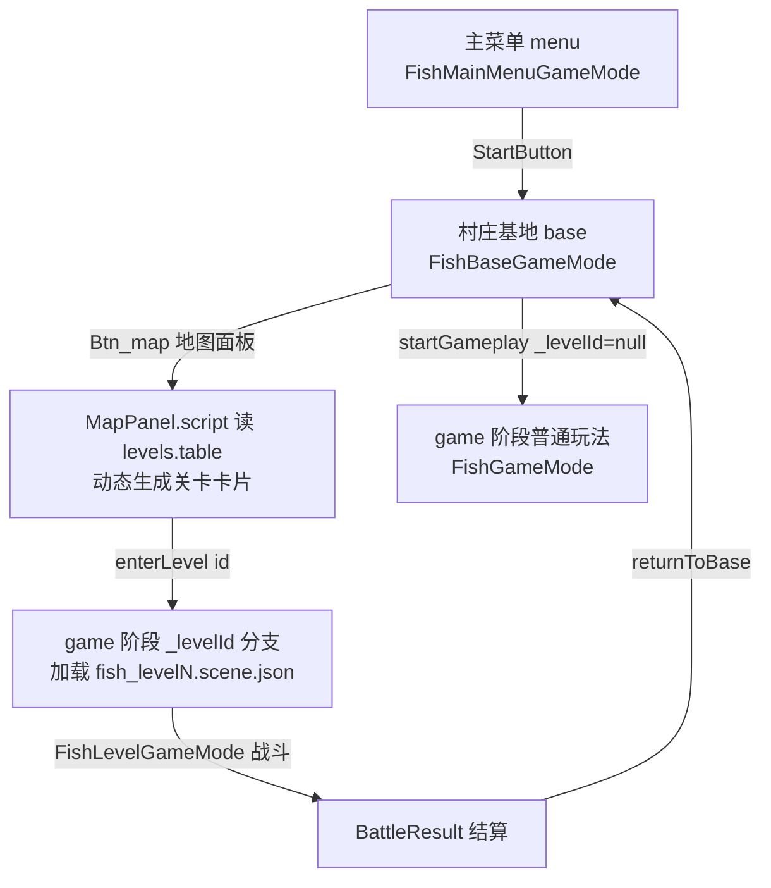
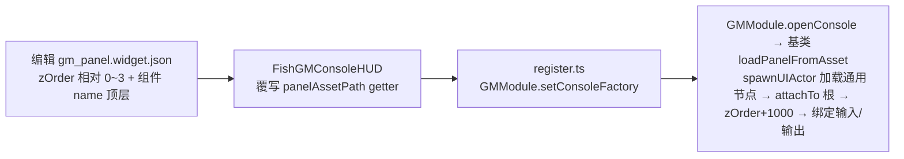

# ClashMaster 项目文档（部落冲突风格，原名 fish）

> ClashMaster 是 DemoStudio 的部落冲突风格示例项目：村庄基地建造（`FishBaseGameMode`）→ 兵营训练军队 → 地图选关卡攻打敌方基地（`FishLevelGameMode` 战斗）。项目原名为 **FishMaster / 捕鱼达人**，2026-08-15 起仅**表现层**（显示名/UI 文案/GM 面板主题）改名为 ClashMaster，**目录/类名/文件名保持 fish 前缀不动**。
> 代码位置：`src/projects/fish/`（`register.ts` 项目注册、`FishGameInstance.ts` 阶段路由、`gameplay/{menu,base,game,level,battle,common,gm}/` 各阶段玩法、`asset/` 全部场景/蓝图/widget/配置表资产）。
> 相关文档：[`level_system.md`](../level_system.md)（关卡入口与切换）、[`battle_system.md`](../battle_system.md)（攻打战斗玩法）、[`../engine/gm_system.md`](../engine/gm_system.md)（GM 命令与控制台，§3.6 项目自定义面板）、[`../engine/gameflow_system.md`](../engine/gameflow_system.md)、[`../engine/ui_system.md`](../engine/ui_system.md)、[`../engine/asset_tools_system.md`](../engine/asset_tools_system.md)。

## 1. 概述

ClashMaster 演示了 DemoStudio 的完整项目形态：**一个项目 = `register.ts` 注册 + 三阶段 GameMode 路由 + 资产目录（场景/蓝图/widget/配置表）+ 项目级 GM 命令与自定义面板**。玩家流程：主菜单（`FishMainMenuGameMode`）→ 部落村庄基地（`FishBaseGameMode`，建造/训练/地图）→ 出征战斗（`FishLevelGameMode` 关卡）或传统玩法（`FishGameMode`）。

关键角色与职责：

| 角色 | 职责 |
|---|---|
| `FishGameInstance` | 阶段路由（`menu → base → game`，`_levelId` 决定 game 加载关卡还是出海场景）、资源组件（金币/药水）、训练组件、`window.__fishBattle` 调试桥 |
| `FishMainMenuGameMode` | 主菜单：启动按钮进入基地，正交相机（`MENU_ORTHO_SIZE=2.7`） |
| `FishBaseGameMode` | 村庄基地：`ClashBaseBuilder` 建地图、建筑放置/移动/删除、建筑模式与兵营面板、`toggleMapPanel` 地图入口 |
| `FishLevelGameMode` | 战斗关卡权威：敌方建筑收集/血条、放兵、防御塔、胜负判定、掠夺入账（详见 battle_system.md） |
| `FishGameMode` | 传统出征玩法（`startGameplay` 直达，非关卡） |
| `FishGMConsoleHUD` | 项目自定义 GM 控制台面板（部落冲突主题，继承引擎 `GMConsoleHUD` 覆写 `buildUI`） |
| `FishConfigLoader` | 配置表加载：`fish.cannon` / `fish.troop` / `fish.levels` 等 |
| `ClashBuildingTypes.ts` / `ClashBuildingActors.ts` | 建筑类型单一数据源 + 每建筑一个 Actor 类（蓝图 baseClass 引用） |

与相邻系统边界：**项目级玩法/资产归本文档**（新增建筑/兵种/命令/UI 面板的落点）；**引擎级能力**（GM 命令体系、UI 组件、配置表加载、场景/蓝图资产格式）一律引用对应引擎文档，不在此重复。

## 2. 核心模块

| 模块 | 说明 |
|---|---|
| `register.ts` | 项目注册入口：GameModeRegistry（menu/base/game/level）、GMRegistry 自动扫描 `gameplay/gm/*.gm.ts`、`GMModule.setConsoleFactory` 注入项目 GM 面板、ActorRegistry（FishHouse + 6 建筑类）、`ProjectModule` 导出 |
| `FishGameInstance.ts` | 三阶段路由中枢 + `__fishBattle` 调试桥（enterLevel/addArmy/deploy/stepTicks/getGM 等） |
| `gameplay/menu/` | 主菜单 GameMode（`fish_menu.scene.json` + `main_menu.widget.json`） |
| `gameplay/base/` | 基地：`FishBaseGameMode`、`ClashBaseBuilder`、`ClashBuildingActors`、`BaseHud.script.ts`、`BuildMenu.script.ts`、`MapPanel.script.ts`、`BarracksUi.script.ts`、`PlaceGridActor` |
| `gameplay/level/` + `battle/` | 战斗关卡 GameMode 与战斗 Actor/脚本（见 battle_system.md） |
| `gameplay/gm/` | 项目 GM 命令（`*.gm.ts` ×5）+ `FishGMConsoleHUD.ts` 自定义面板 |
| `gameplay/common/` | `types.ts`（兵种/关卡/建筑类型）、`comp/`（资源/训练/血条组件）、`textures.ts` 程序化纹理 |
| `asset/` | 场景 `fish{,_menu,_base,_level1-3}.scene.json`、蓝图 `blueprints/`（buildings/troops/ui/）、配置 `config/`（cannon.config/troop.table/levels.table） |

## 3. 使用方法

### 3.1 在编辑器中运行

1. 打开工程：工程选择界面选 **ClashMaster** 卡片 → 打开工程 → `Launch`
2. 主菜单点「⚔️ 开始游戏」→ 进入村庄基地；基地 HUD「🏗️ 建筑」「🗺️ 地图」双按钮进建筑模式/地图面板
3. 地图面板点关卡卡片 → 进入战斗关卡（放兵攻打敌方基地）

### 3.2 GM 命令（调试）

- 键鼠：聚焦视口后 **G+M** 打开控制台；输入 `help` 查看全部命令
- AI 桥接：`window.__ai.emit('ai.gmCommand', { command: 'addCoins', args: ['100'] })`
- 项目命令：`addCoins` / `addElixir` / `addTroop` / `winLevel` / `clearEnemies`（+ 引擎内置 `help`/`list`/`clear`/`gm.enable`/`gm.disable`）
- 新增命令：在 `gameplay/gm/` 下新建 `*.gm.ts` 文件即自动注册，**零注册代码**（glob 扫描）

### 3.3 调试桥 `window.__fishBattle`

| 方法 | 说明 |
|---|---|
| `enterLevel(id)` / `addArmy(...)` / `deploy(...)` | 阶段/军队/放兵控制 |
| `getBattle()` / `getHealthBars()` / `getTroopModels()` | 战斗快照断言（血条组件状态、兵模型 CapsuleGeometry） |
| `getGM()` | GM 面板状态：`{ consoleOpen, outputLines, layers }`（layers 全部 zOrder ≥ 1000 = 面板最顶层） |
| `getState()` | 阶段/关卡/金币/军队摘要 |
| `startTickDriver()` / `stepTicks(n)` | 页面 hidden 时同步推进游戏 tick（测试用） |

### 3.4 表现层定制（主题/文案/面板）

| 想改什么 | 改哪里 |
|---|---|
| 项目显示名/描述 | `project.json` + `stores/projectStore.ts`（**两处必须同步**）+ `register.ts` 的 `fishMasterProject.name` |
| 主菜单标题/副标题/提示 | `asset/blueprints/ui/main_menu.widget.json` 的 UITextComponent `text` |
| GM 面板主题 | **资产驱动**：编辑 `asset/blueprints/ui/gm_panel.widget.json`（暗紫/部落金主题）即可，无需改代码；命令按钮（`GM_CmdList` 挂 `UIScrollListComponent` 滚动列表，item 来自 `gm_cmd_item.blueprint.json`，命令多时滚轮滚动）+ 发送按钮（`GM_SendBtn`）由基类运行时绑定（详见 [`../engine/gm_system.md`](../engine/gm_system.md) §3.6） |
| 基地 HUD / 建筑菜单 / 地图面板 | `asset/blueprints/ui/{base_hud,build_menu,base_map,...}.widget.json` + 对应 `*.script.ts` |

## 4. 工作流程

### 4.1 主流程：三阶段路由



### 4.2 分阶段说明

| 阶段 | 触发点 | 关键调用 | 产物 |
|---|---|---|---|
| menu | Launch / `switchToPhase('menu')` | `SwitchToScene('FishMenu')` | 主菜单 UI（`main_menu.widget.json`） |
| base | StartButton | `switchToPhase('base')` | 基地地图 + 建筑 + HUD（`base_hud`/`build_menu`） |
| game（关卡） | `enterLevel(id)` | `switchToPhase('game')` → 场景名 `getLevel(id).scene` | 战斗场景 + `FishLevelGameMode` |
| game（普通） | `startGameplay()` | `_levelId=null`，场景名 `'ClashMaster'` | `FishGameMode` 传统玩法 |

### 4.3 表现层定制工作流（GM 面板资产驱动示例）



要点：基类构造保证根画布 `hitTest:'block'` 与最顶层 zOrder；面板资产只写相对层级与样式，改主题直接编辑资产 JSON 即可。

## 5. 边界条件

| 条件 | 行为/后果 | 处理方式 |
|---|---|---|
| 场景资产 `name` 改动 | `SwitchToScene` 按 name 查找失败 → 阶段切换失败 | 改 `fish.scene.json` name 必须同步 `FishGameInstance.ts` 的 `'ClashMaster'` 回退引用 |
| 项目名改动 | 显示名来自 `project.json` + `projectStore.ts` + `register.ts` 三处 | 三处同步改，缺一处显示不一致 |
| widget/蓝图资产 JSON 改动 | `BlueprintRegistry` 只在初始化注册，HMR 不重注册 | **必须 reload 页面**再验证 |
| 新增 `*.gm.ts` | glob 自动注册，但 StrictMode 下重复注册覆盖 + warn | 属设计行为非 bug |
| G+M 打开控制台 | 面板打开时键盘全消费不穿透游戏 | 面板关闭（Esc）后恢复 |
| 页面 hidden（测试） | rAF 暂停 → 游戏 tick 停摆，动态 UI 卡 pendingSpawn | `stepTicks(n)` / 手动 `inst.tick(0.016)` 驱动 |
| 建筑蓝图 baseClass | 必须用已注册类名（如 `TownhallActor`/`Actor`） | `'GenericActor'` 未注册会放兵失败 |
| GM 面板 layers | 全部 zOrder 必须 ≥ 1000 | 若出现 `<1000` 说明自定义面板漏了 `GM_ZORDER_BASE` 基数 |

## 6. 依赖关系 / 注册机制

```
src/projects/registry.ts
  └─ fishMasterProject (register.ts)
       ├─ GameModeRegistry.register('menu'|'base'|'game'|'level', ...)
       ├─ GMRegistry.registerProjectGlob('./gameplay/gm/*.gm.ts')   → 5 命令
       ├─ GMModule.setConsoleFactory(() => new FishGMConsoleHUD(gm))
       ├─ ActorRegistry.register('FishHouse' | TownhallActor | ... )
       └─ registerFishAssets (asset/index.ts)
            ├─ import.meta.glob('./**/*.scene.json')   → AssetRegistry
            ├─ import.meta.glob('./**/*.blueprint.json') → BlueprintRegistry
            └─ import.meta.glob('./**/*.widget.json')   → 同上（widget = blueprint）
```

注册机制详见 [`../engine/asset_tools_system.md`](../engine/asset_tools_system.md)（资产 glob 注册）、[`../engine/gm_system.md`](../engine/gm_system.md)（命令/面板注册）。

## 7. 踩坑记录 / 历史决策

- **表现层改名（2026-08-15）**：FishMaster → ClashMaster 只改表现（显示名/文案/GM 面板主题），目录/类名/文件名保持 `fish` 前缀。**场景 `name` 字段与 `FishGameInstance` 代码里的字符串引用必须同步**（`'FishMaster'` → `'ClashMaster'`），否则 `SwitchToScene` 找不到场景。
- **GM 面板主题**：`FishGMConsoleHUD` 原为海洋主题（深海蓝 + 珊瑚金），改名后换部落冲突主题（暗紫面板 `#2a1a3a` + 部落金描边 `#c9a227` + 亮金标题 `#ffd700`），就绪消息 `⚔️ ClashMaster GM 控制台已就绪`。
- **验证 UI 文本**：`ai.getActor` 返回不含 `UITextComponent.text`；验证 UI 文案需遍历 `world.ui.getAllUIActors()` 的 `getComponents(UITextComponent)`。
- **主菜单相机**：`MENU_ORTHO_SIZE=2.7` 让 UI 铺满视口（`CAMERA_ORTHO_SIZE=10` 只用于海域玩法，菜单不要用）。
