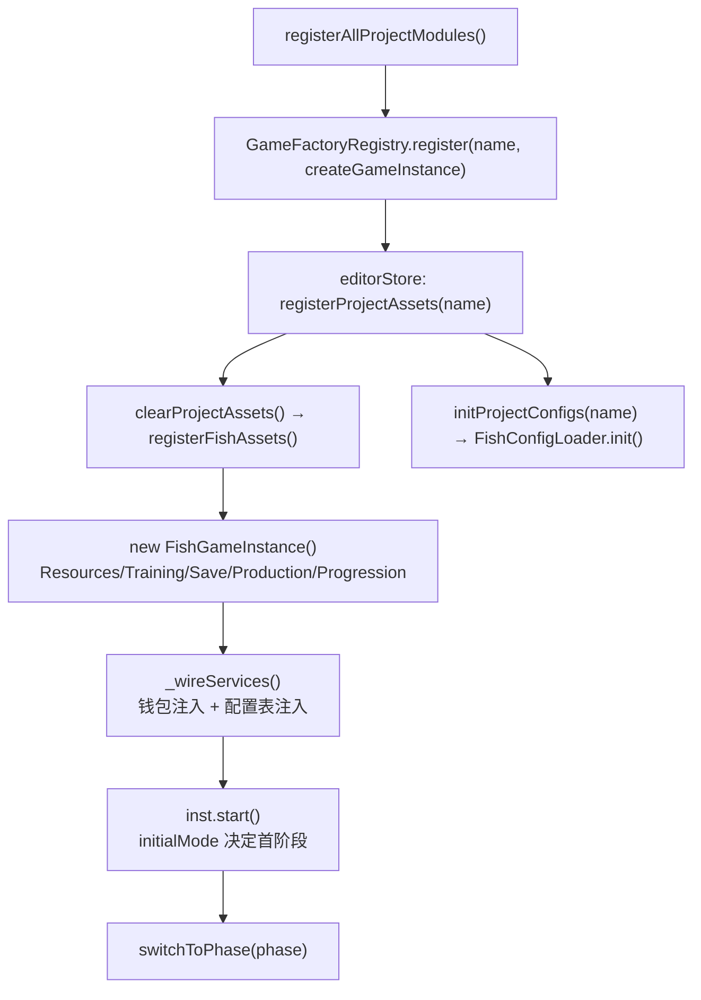
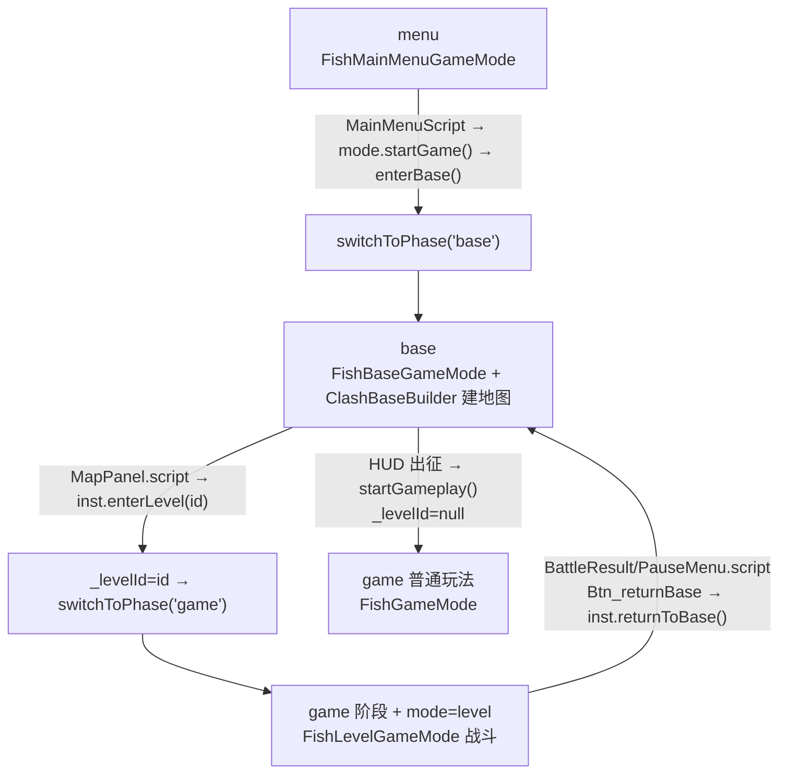

# ClashMaster 项目（部落冲突风，原名 fish）

> **一句话定位**：ClashMaster 是 DemoStudio 的完整参照项目——演示「一个游戏项目 = `register.ts` 注册 + 三阶段 GameMode 路由 + `asset/` 资产目录 + 项目级 GM 面板」这套骨架怎么搭起来。
>
> **什么时候会用到你**：新建游戏项目要照抄骨架时、排查「项目没出现在工程列表 / 点开始没进基地 / 进关卡白屏 / 存档没落盘」时、想知道某个玩法文件属于哪个阶段时。
>
> 代码位置：`src/projects/fish/`

战斗规则见 [battle_system.md](./battle_system.md)，关卡流程见 [level_system.md](./level_system.md)，七角色职责边界见 [gameplay_code_standard.md](./gameplay_code_standard.md)。本文档只讲**项目骨架与阶段路由**。

**关于命名**：项目原名为 FishMaster / 捕鱼达人，2026-08-15 起仅**表现层**（显示名/UI 文案/GM 面板主题）改名为 ClashMaster，**目录/类名/文件名保持 `fish` 前缀不动**——`fishMasterProject`、`FishGameInstance`、`src/projects/fish/` 都不是笔误。

---

## 1. 先记住这几个文件

| 文件 | 一句话职责 | 你要改它的场景 |
|---|---|---|
| [register.ts](../../src/projects/fish/register.ts) | 项目自描述：注册 mode→GameMode 映射、GM 命令 glob、行为类 Actor | 加一个新阶段、注册新的蓝图 baseClass 类 |
| [FishGameInstance.ts](../../src/projects/fish/gameplay/FishGameInstance.ts) | 阶段路由中枢：`switchToPhase` 切场景 + `setupXxxPhase` 接线，持有跨阶段服务 | 加阶段、改切换时的清理逻辑、改存档时机 |
| [asset/index.ts](../../src/projects/fish/asset/index.ts) | 资产自动注册：`import.meta.glob` 扫场景/蓝图/widget/脚本 | 加新资产类型（通常不用改，加文件即可） |
| [FishConfigLoader.ts](../../src/projects/fish/FishConfigLoader.ts) | 配置表加载：注册默认值 + transform + glob 扫描 `asset/config/` | 加一张新配置表或给配置加归一化字段 |

**关键心智模型**：目录名、类名、文件名**全部保留 `fish` 前缀不动**。别被名字骗了——`FishGameMode` 是传统出海玩法，`FishLevelGameMode` 才是部落冲突攻城战斗。

---

## 2. 项目怎么被加载：从目录到可运行

### 2.1 谁注册了它

项目**不是被扫描发现的**，而是在 registry 里手写 import 的——这是新人最容易误解的一点。

```ts
import { fishMasterProject } from './fish/register'

const ALL_PROJECTS: ProjectModule[] = [snakeProject, eatFishProject, demo2DProject, racingProject, fishMasterProject]
```

> **为什么不自动扫描**：`ProjectModule` 里有工厂函数和 glob 调用，必须静态 import 才能保证 Vite 把整棵依赖打进包里。新增项目要**手动加这一行 import + 数组条目**，这是唯一需要改 registry 的地方。

[register.ts](../../src/projects/fish/register.ts) 把四类东西一次性注册掉：

```ts
// ─── mode → GameMode 映射（key 是场景资产的 mode 字段值，不是阶段名）───
GameModeRegistry.register('menu', FishMainMenuGameMode)
GameModeRegistry.register('base', FishBaseGameMode)
GameModeRegistry.register('game', FishGameMode)
GameModeRegistry.register('level', FishLevelGameMode)

// ─── GM 命令：自动扫描 gameplay/gm/*.gm.ts（新增命令文件零注册代码，幂等）───
GMRegistry.registerProjectGlob(
  import.meta.glob('./gameplay/gm/*.gm.ts', { eager: true }) as Parameters<typeof GMRegistry.registerProjectGlob>[0],
)
GMModule.setConsoleFactory((gm) => new FishGMConsoleHUD(gm))

// ─── 建筑 Actor 类（蓝图 baseClass 引用；townhall → TownhallActor）───
for (const [typeId, ctor] of Object.entries(CLASH_BUILDING_ACTOR_CLASSES)) {
  ActorRegistry.register(typeId.charAt(0).toUpperCase() + typeId.slice(1) + 'Actor', () => new ctor())
}

export const fishMasterProject: ProjectModule = {
  name: 'ClashMaster',
  createGameInstance: (renderContainer) => { /* new FishGameInstance + setContainer */ },
  registerAssets: registerFishAssets,
  initConfigs: initFishConfigs,
}
```

> **反直觉处**：`GameModeRegistry.register` 的第一个参数**不是阶段名，是场景资产里的 `mode` 字段值**。`SwitchToScene` 拿场景资产的 `mode` 查表决定 new 哪个 GameMode。`game` 与 `level` 是两个不同 mode——`game` 阶段到底走哪个 GameMode，取决于加载的场景资产写的是 `"mode": "game"` 还是 `"mode": "level"`。`eager: true` 也是必需的：GMRegistry 要同步拿到全部命令做 `help`/`list`，懒加载会出现「输命令提示不存在」。

`registerAssets` 指向 [asset/index.ts](../../src/projects/fish/asset/index.ts)，用 glob 扫完四类资产：

```ts
const scenes = Object.values(
  import.meta.glob<{ default: SceneAsset }>('./**/*.scene.json', { eager: true }),
).map((m) => m.default)
// 蓝图 + UI widget（widget 本质也是 blueprint，命名 *.widget.json 不带 .blueprint 后缀）
const bpModules = import.meta.glob<{ default: BlueprintAsset }>(
  ['./blueprints/**/*.blueprint.json', './blueprints/ui/**/*.json'], { eager: true },
)
// UI 行为脚本，id 从路径推导（如 'gameplay/base/BaseHud'）
const scriptModules = import.meta.glob<{ default: BehaviourScriptConstructor }>('../gameplay/**/*.script.ts', { eager: true })
AssetRegistry.registerAll({ scenes, blueprintModules: bpModules, scriptModules })
```

> **为什么新增资产不用改代码**：三条 glob 覆盖场景、蓝图（含 widget）、UI 脚本。脚本 id 从路径推导，widget 里的 `UIScriptComponent` 按 id 引用——**路径改了 id 就变，引用就断**。

### 2.2 启动链路



**① 工厂注册 / ② 打开工程加载资产**（各执行一次）：

```ts
for (const project of ALL_PROJECTS) {                   // 注册的是工厂函数，实例在 Launch 时才 new
  GameFactoryRegistry.register(project.name, (container) => project.createGameInstance(container))
}

export function registerProjectAssets(name: string): void {
  clearProjectAssets()                                  // 全局注册表，不清会串上一个工程的资产
  const project = projectModuleMap.get(name)
  if (project?.registerAssets) project.registerAssets()
}
```

配置表走另一条路（`initProjectConfigs` → `initFishConfigs`），**延迟到工程被选中才加载**，避免编辑器启动时读所有项目的配置。

**③ 构造期：服务装配一次**（[FishGameInstance.ts:129](../../src/projects/fish/gameplay/FishGameInstance.ts)）

```ts
new FishConfigLoader((msg) => logger.info(msg)).init()
this.resources = new ResourcesComponent(this, { coins: INITIAL_COINS, elixir: 0, gems: 0 })
this.training = new TrainingComponent(this, { maxHousing: 40 })
this.save = new SaveSlotComponent(this, { filePath: FISH_SAVE_FILE })
this.production = new ProductionService(this, { save: this.save })
this.progression = new ProgressionService(this, { save: this.save })
// 五个组件逐一 addComponent 挂到本实例，最后 _wireServices() 互链
this._wireServices()
```

关键设计：**钱包、训练、生产、进度四个服务挂在 GameInstance 上，不挂在 GameMode 上**。GameMode 每次切场景都销毁重建，但金币和军队要跨阶段保留——这是它们必须待在 Instance 层的唯一理由。

**④ `start()`：由 `initialMode` 决定首阶段**（[:170](../../src/projects/fish/gameplay/FishGameInstance.ts)）

```ts
ToastSystem.instance.attach(this.world.ui, 'asset/blueprints/ui/toast.widget.json')
ColorblindService.instance.attach(this.world.ui)
this.installBattleDebugBridge()
this.loadSaveAsync()                    // 故意不 await，见下方讲解
if (this.initialMode === 'base') return this.switchToPhase('base')
if (this.initialMode === 'game') return this.switchToPhase('game')
return this.switchToPhase('menu')
```

> **为什么不 await 存档**：`start()` 必须同步返回（引擎契约）。所以基地布局恢复被设计成**双就绪门控**——KV 先到就等布局，布局先到就等 KV，谁后到谁在 `tryRestoreBaseLayout()` 里补齐。

---

## 3. 三阶段路由：menu → base → level

### 3.1 切换入口与 `switchToPhase`

```ts
private switchToPhase(phase: Phase): boolean {
  this._phase = phase
  const sceneName = phase === 'menu' ? 'FishMenu'
    : phase === 'base' ? 'FishBaseIsland'
    : this._levelId ? (this.getLevel(this._levelId)?.scene ?? 'ClashMaster') : 'ClashMaster'

  const ok = this.world.SwitchToScene(sceneName, () => {   // extraSetup 回调
    switch (phase) {
      case 'menu': this.setupMenuPhase(); break
      case 'base': this.setupBasePhase(); break
      case 'game': this._levelId ? this.setupLevelPhase() : this.setupGamePhase(); break
    }
  })
  if (!ok) logger.error(`[Fish] 切换阶段失败 → ${phase}`)
  return ok
}
```

> **反直觉处**：`phase` 只有 `'menu' | 'base' | 'game'` 三个值，**没有 `'level'` 阶段**。关卡复用 `game` 阶段，靠 `_levelId` 是否为 null 决定加载哪个场景、跑哪个 setup。所以 `_phase` 字段与场景 `mode` 字段不是一一对应的。

`SwitchToScene`（[World.ts:671](../../src/engine/gameflow/World.ts)）切换时**自动清场**：

```ts
if (typeof sceneOrName === 'string') {
  const asset = AssetRegistry.getScene(sceneOrName)
  if (!asset) { logger.error(`[World] SwitchToScene: 场景 "${sceneOrName}" 未在 AssetRegistry 中注册`); return false }
  return this.SwitchToScene(asset, extraSetup)
}
const mode = sceneOrName.mode
if (!mode || !GameModeRegistry.has(mode)) { logger.error(`[World] SwitchToScene: mode "${mode}" 未注册，无法切换`); return false }
const baseline = new Set(ObjectRegistry.snapshot())     // 基线须在 newMode 构造之前记录
const newMode = GameModeRegistry.create(mode)!
this.SwitchScene(newMode, () => { this.loadSceneAsActors(sceneOrName); extraSetup?.() }, baseline)
return true
```

`SwitchScene` 固定顺序：**`Pause()` → `DestroyAllActors()` → `SetGameMode()`（登录链内 `SpawnPlayer → PC.ClientSetHUD` 完成 HUD 创建）→ 执行 setup 回调 → `BeginPlay()`**。

> **为什么 `extraSetup` 排在 HUD 之后、BeginPlay 之前**：HUD 在 `SetGameMode` 内部（登录链）就已创建，故 `setupXxxPhase` 可以绑 UI 按钮；但场景 Actor 此刻还在 `pendingSpawn` 队列没提交——所以 `onLayoutBuilt` 回调是在 `BeginPlay` 末尾才触发的，那时建筑**尚未真正生成**。

### 3.2 每阶段的 GameMode / Pawn / Controller 组合

| 阶段 | 场景（name / mode） | GameMode | Pawn | Controller | HUD 资产 |
|---|---|---|---|---|---|
| menu | `FishMenu` / `menu` | `FishMainMenuGameMode` | `FishMainMenuPawn` | `FishMainMenuPlayerController` | `ui/main_menu.widget.json` |
| base | `FishBaseIsland` / `base` | `FishBaseGameMode` | `FishBasePawn` | `FishBasePlayerController` | `ui/base_hud.widget.json` |
| game（普通） | `ClashMaster` | `FishGameMode` | `FishCannon` | `FishPlayerController` | 未声明 `HUDClass` |
| game（关卡） | `FishLevel1/2/3` / `level` | `FishLevelGameMode` | `FishLevelPawn` | `FishLevelPlayerController` | `ui/battle_hud.widget.json` |



**menu → base**：按钮逻辑在 [MainMenu.script.ts](../../src/projects/fish/gameplay/menu/MainMenu.script.ts) 的 `onStart` 里——`this.button.onClick = () => mode.startGame()`，不手写遍历。

> **注意**：`setupMenuPhase` 里还有一段**递归遍历 HUD 绑定所有 `UIButtonComponent`** 的兜底逻辑，两者并存意味着菜单按钮可能被绑两次——新加菜单 UI 优先走 widget 挂脚本（`data-script`）。

**base 阶段**：`setupBasePhase`（[:641](../../src/projects/fish/gameplay/FishGameInstance.ts)）建相机并接管持久化门控：

```ts
this._baseLayoutBuilt = false
this._baseRestored = false
mode.onLayoutBuilt = () => { this._baseLayoutBuilt = true; this.tryRestoreBaseLayout() }
mode.onLayoutChange = () => {
  if (this._baseRestored && mode === this._baseGameMode) {
    this.save.set('baseBuildings', mode.getLayoutSnapshot())
  }
}
spawnActor(mode.baseCamera)                             // 交给 World 托管生命周期
this.setupCamera(mode.baseCamera.cameraComponent, 12, 16, 18)
```

> **`_baseRestored` 这个闸门是干什么的**：`BeginPlay` 里 `ClashBaseBuilder` 先按 `INITIAL_LAYOUT` 建默认布局。若此时 `onLayoutChange` 就生效，会**把默认布局写进 `baseBuildings` 键、覆盖玩家存档**。所以恢复完成前一律静音。

**base → level / 回城**：`enterLevel`（[:849](../../src/projects/fish/gameplay/FishGameInstance.ts)）先校验再切；`returnToBase`（[:791](../../src/projects/fish/gameplay/FishGameInstance.ts)）反向清空：

```ts
// enterLevel：校验 → 置 _levelId → 解绑 → 切
if (!level) { logger.warn(`[Fish] 进入关卡失败：关卡 "${id}" 不存在（关卡表未加载或行缺失）`); return false }
if (!this.progression.isLevelUnlocked(level.unlockRequirement)) { /* warn */ return false }
this._levelId = id
if (this._controller) { this._controller.Unpossess(); this._controller = null }
this._baseGameMode?.cameraManager.Clear()
const ok = this.switchToPhase('game')

// returnToBase：退订 → 清四个引用 → 切回 base
this.stopDebugTickDriver()
if (this.unsubGameState) { this.unsubGameState(); this.unsubGameState = null }
if (this._gameMode) { this._gameMode.cameraManager.Clear(); this._gameMode = null }
if (this._levelGameMode) { this._levelGameMode.cameraManager.Clear(); this._levelGameMode = null }
if (this._controller) { this._controller.Unpossess(); this._controller = null }
this._returningToBase = false
this.switchToPhase('base')
```

> **为什么离开前必须手动 `Unpossess()` + `cameraManager.Clear()`**：`SwitchToScene` 只销毁 Actor，**不清 GameInstance 持有的 `_controller` / `_baseGameMode` / `_levelGameMode` 引用**。不手动解绑，旧 Controller 会悬挂，旧相机继续参与 `syncCamera` 竞争。真实调用方：[BattleResult.script.ts:60](../../src/projects/fish/gameplay/battle/BattleResult.script.ts)、[PauseMenu.script.ts:36](../../src/projects/fish/gameplay/level/PauseMenu.script.ts)，以及 `setupGamePhase` 里 GameOver 的自动回城。

### 3.3 表现层定制点

| 想改什么 | 改哪里 | 备注 |
|---|---|---|
| 项目显示名 | [project.json](../../src/projects/fish/project.json) + `stores/projectStore.ts:46` + `register.ts` 的 `name` | **三处必须同步** |
| 主菜单 UI | `asset/blueprints/ui/main_menu.widget.json` + [MainMenu.script.ts](../../src/projects/fish/gameplay/menu/MainMenu.script.ts) | 交互态色由编译器透传到 `UIScript.args` |
| 基地 HUD / 建筑菜单 / 地图面板 | `asset/blueprints/ui/{base_hud,build_menu,base_map}.widget.json` + `gameplay/base/*.script.ts` | UI 结构与行为解耦 |
| GM 面板主题 | `asset/blueprints/ui/gm_panel.widget.json` | 资产驱动，改样式不改代码 |
| 新增 GM 命令 | 在 `gameplay/gm/` 下新建 `*.gm.ts` | glob 自动注册 |

`FishGMConsoleHUD` 只覆写 `panelAssetPath` 一个 getter 指向项目面板资产，其余（加载资产树、绑定 `GM_OutputText`/`GM_InputText`、加 `GM_ZORDER_BASE` 保证最顶层）由基类 `GMConsoleHUD` 处理，详见 [../engine/gm_system.md](../engine/gm_system.md)。

---

## 4. 关键方法速查

| 方法 | 位置 | 干什么 | 注意 |
|---|---|---|---|
| `registerAllProjectModules` | [registry.ts:76](../../src/projects/registry.ts) | 注册引擎内置件 + 所有项目工厂 | 编辑器启动调一次 |
| `registerProjectAssets` | [registry.ts:119](../../src/projects/registry.ts) | 清旧资产 → 注册新工程资产 | 先 `clearProjectAssets()` 再注册 |
| `registerFishAssets` | [asset/index.ts:14](../../src/projects/fish/asset/index.ts) | glob 扫场景/蓝图/脚本并注册 | 新增资产文件无需改此文件 |
| `start` | [:170](../../src/projects/fish/gameplay/FishGameInstance.ts) | 挂 Toast/色盲/调试桥 → 异步读档 → 按 `initialMode` 切首阶段 | 必须同步返回，存档不 await |
| `switchToPhase` | [:589](../../src/projects/fish/gameplay/FishGameInstance.ts) | 算场景名 → `SwitchToScene` → 分派 setup | `_levelId` 决定 game 走 level 还是普通玩法 |
| `setupMenuPhase` | [:608](../../src/projects/fish/gameplay/FishGameInstance.ts) | 接 `onStartGame`、注册相机、`PhySys.setup` | 递归绑 HUD 所有 `UIButtonComponent` |
| `setupBasePhase` | [:641](../../src/projects/fish/gameplay/FishGameInstance.ts) | 复位门控位、接 `onLayoutBuilt/onLayoutChange`、`spawnActor(baseCamera)` | 恢复期静音 `onLayoutChange` |
| `setupGamePhase` | [:681](../../src/projects/fish/gameplay/FishGameInstance.ts) | 出征玩法：注册相机、绑 pawn、订阅 `gameState` | GameOver 时自动 `returnToBase()` |
| `setupLevelPhase` | [:716](../../src/projects/fish/gameplay/FishGameInstance.ts) | 注册战斗相机、订阅结算、接 `onBattleOver` | 先退订旧 `unsubGameState` 再订阅 |
| `enterLevel` | [:849](../../src/projects/fish/gameplay/FishGameInstance.ts) | 校验关卡存在 + 解锁 → 置 `_levelId` → 切 game 阶段 | 走 `progression.isLevelUnlocked` |
| `returnToBase` | [:791](../../src/projects/fish/gameplay/FishGameInstance.ts) | 退订 + 清四个引用 + 切回 base | 不手动清会悬挂旧 Controller |
| `saveGame` | [:204](../../src/projects/fish/gameplay/FishGameInstance.ts) | 采集布局快照 → `flush(true)` 强制落盘 | **唯一的常规写盘入口** |
| `tryRestoreBaseLayout` | [:237](../../src/projects/fish/gameplay/FishGameInstance.ts) | 双就绪门控，置 `_pendingRestore` | 无 `baseBuildings` 键则保留默认布局 |
| `tick` | [:936](../../src/projects/fish/gameplay/FishGameInstance.ts) | menu 直接返回；base 推进训练/生产/恢复；game 驱动 world | menu 阶段只跑 `save.tick(dt)` |
| `ProductionService.update` | [ProductionService.ts:284](../../src/projects/fish/gameplay/base/ProductionService.ts) | 产出结算 + 升级/研究/清障队列推进 | 由 GameInstance 的 base 分支驱动 |
| `spawnObstaclesForBase` | [ObstacleSystem.ts:63](../../src/projects/fish/gameplay/base/ObstacleSystem.ts) | 生成障碍物（树/石头，占格不可建） | 在 `FishBaseGameMode.BeginPlay` 调用 |

---

## 5. 流程影响：牵动哪些功能

### 上游：谁驱动它

| 上游 | 怎么驱动 | 相关文档 |
|---|---|---|
| `EditorInitializer.registerAllProjectModules` | 编辑器启动时注册项目工厂 | [../editor/core/core_system.md](../editor/core/core_system.md) |
| `editorStore` 打开工程 | 调 `registerProjectAssets` + `initProjectConfigs` | [../engine/asset_tools_system.md](../engine/asset_tools_system.md) |
| `GameFactoryRegistry.create` / `World.SwitchToScene` | Launch 时 new 实例；按场景 `mode` 取 GameMode | [../engine/gameflow_system.md](../engine/gameflow_system.md) |
| `MapPanel.script` / `MainMenu.script` / `BattleResult.script` | UI 脚本回调触发阶段切换 | [level_system.md](./level_system.md) |

### 下游：它波及谁

| 下游功能 | 波及点 | 相关文档 |
|---|---|---|
| 关卡流程 | `enterLevel` 决定加载哪个关卡场景与解锁条件 | [level_system.md](./level_system.md) |
| 战斗玩法 | `setupLevelPhase` 建战斗相机、订阅结算与 `onBattleOver` | [battle_system.md](./battle_system.md) |
| 资产系统 | `registerFishAssets` 把 glob 结果灌进三个注册表 | [../engine/asset_tools_system.md](../engine/asset_tools_system.md) |
| GM 命令系统 | `registerProjectGlob` 扫 `*.gm.ts`；`setConsoleFactory` 换项目面板 | [../engine/gm_system.md](../engine/gm_system.md) |
| gameplay 七角色规范 | 各阶段 GameMode/Pawn/Controller 组合需符合职责边界 | [gameplay_code_standard.md](./gameplay_code_standard.md) |

---

## 6. 踩坑清单

| # | 现象 | 原因 | 规则 |
|---|---|---|---|
| 1 | 改场景 `name` 后阶段切换失败 | `SwitchToScene` 按 `SceneAsset.name` 查表 | 改 `fish.scene.json` 的 `name` 必须同步 [:592](../../src/projects/fish/gameplay/FishGameInstance.ts) 的 `'ClashMaster'` 回退串 |
| 2 | 项目显示名与工厂 key 对不上 | 名字散在 `project.json`、`stores/projectStore.ts:46`、`register.ts` | 三处同步改 |
| 3 | 改了 widget/蓝图 JSON 页面没变化 | `registerProjectAssets` 只在打开工程时跑一次，HMR 不重注册 | 必须 reload 页面再验证 |
| 4 | 默认布局覆盖玩家存档布局 | `ClashBaseBuilder.build` 先建默认布局，`onLayoutChange` 过早写进 `baseBuildings` | `_baseRestored` 置位前静音写入 |
| 5 | 布局恢复后出现幽灵碰撞体 | 旧建筑要等下一帧 `commitDestroy` 才移除，同帧重放会碰撞 | 在 `manualTick` 后分两帧：帧 A `clearClashLayout()`，帧 B `rebuildLayoutFrom()` |
| 6 | 切阶段后旧 Controller 悬挂 | `SwitchToScene` 只销毁 Actor，不清 GameInstance 引用 | 切走前 `Unpossess()` + `cameraManager.Clear()` + 引用置 null |
| 7 | 按钮/输入全失效 | 漏调 `super.StartPlay()`，基类内含 `SpawnPlayer()` → `controller` 为 null | 所有 `override StartPlay()` 首行必须 `super.StartPlay()` |
| 8 | 以为不点保存也落盘 | 手动存档模型：平时只写内存 KV | 唯一写盘入口是存档菜单 `saveGame()` → `flush(true)`；`syncToKV()` 只打日志 |
| 9 | 蓝图 `baseClass` 未注册 → 放置失败 | `ActorRegistry` 只有 `FishHouse` + `CLASH_BUILDING_ACTOR_CLASSES` 推导的 7 个类名 | `townhall` → `TownhallActor`（首字母大写 + `Actor`） |
| 10 | 页面 hidden 时 tick 停摆 | rAF 被节流，动态 UI 卡 `pendingSpawn` | 用 `__fishBattle.startTickDriver()` / `stepTicks(n)` 补偿 |
| 11 | `ai.getActor` 拿不到 UI 文案 | 返回值不含 `UITextComponent.text` | 遍历 `world.ui.getAllUIActors()` 再 `getComponents(UITextComponent)` |

---

## 7. 边界条件

| 条件 | 行为 | 怎么应对 |
|---|---|---|
| 场景 `name` 不在 `AssetRegistry` 中 | `SwitchToScene` 返回 false，`switchToPhase` 打 error | 见踩坑 1，同步代码里的场景名字符串 |
| 场景 `mode` 未注册到 `GameModeRegistry` | `SwitchToScene` 返回 false | 在 `register.ts` 补 `GameModeRegistry.register(mode, ...)` |
| `enterLevel` 传入不存在的关卡 id | 打 warn 返回 false，不切阶段 | 检查 `levels.table.json` 行键与 id 一致 |
| 关卡未达解锁星级 | 打 warn 返回 false | 先通关前置关卡或用 `unlockBattle` GM 命令 |
| `levels.table.json` 未加载完成 | `getLevelTable()` 返回 undefined，走「关卡不存在」分支 | 等配置表加载；`ConfigRegistry.getTable` 拿不到就是没加载 |
| `fish.buildingLevels` 异步加载未完成 | 构造期 `_wireServices` 注入空对象兜底 | base 阶段 tick 首帧 `_refreshConfigTables()` 补注入 |
| StrictMode 下 `*.gm.ts` 重复注册 | 同名覆盖并打 warn | 属设计行为，glob 注册幂等 |
| 首次运行无 `baseBuildings` 存档键 | `_baseRestored` 直接置 true，保留默认布局 | 属正常设计行为，非 bug |
| 切阶段时旧场景对象未回收 | `SwitchScene` 打「残留诊断」warn 并按类分组统计 | 按打印的 owner/parent 链定位泄漏根对象 |
| 直接关窗（App 未走 destroy） | `save.onDestroy()` 来不及执行 | 靠 `SaveSlotComponent` 的 ≤10s 周期 flush 兜底 |
| `FishGameMode` 未声明 `HUDClass`，或 `spawnPlayerInternal` 返回 null | 登录链 `PC.ClientSetHUD` 三分支静默跳过，全程无 HUD（对齐 UE：无玩家即无 HUD） | 需要 HUD 的阶段必须声明 `HUDClass` 且保证 SpawnPlayer 出 controller |
| 新增 `.script.ts` 后 widget 引用不到 | 脚本 id 由路径推导，路径变 id 就变 | 保持 `gameplay/**/*.script.ts` 路径与 widget 里 script 引用一致 |
