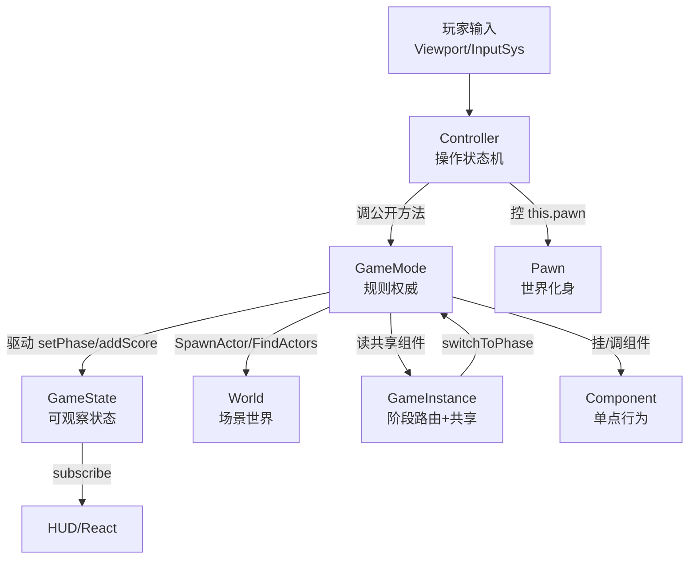

# gameplay 代码规范（Gameplay Code Standard）

> **一句话定位**：这是一份**给七类 gameplay 角色划地盘的裁判手册**——它不描述任何系统怎么实现，只回答一个问题：你新写的这段代码该放进 `GameMode` / `Controller` / `Pawn` / `GameState` / 组件 / `GameInstance` / `World` 的哪一个。
>
> **什么时候会用到你**：新增放兵/建造/出海/UI 联动等 gameplay 功能前决定代码落点；`ag-gameplay-reviewer` 子代理审查改动时的**唯一判定依据**；纠结"定时器该放哪""掠夺累计该记在哪"时；重构已有 gameplay 代码前确认归属。
>
> 代码位置：`src/projects/fish/gameplay/`（各阶段 `{menu,base,game,level}/` 下的 GameMode/Controller/Pawn 三件套）、引擎基类 `src/engine/`（`gameflow/GameMode.ts`、`input/PlayerController.ts`、`entity/Pawn.ts`、`gameflow/GameState.ts`、`gameflow/GameInstance.ts`、`gameflow/World.ts`、`entity/Component.ts`）。

---

## 1. 先记住这几个文件

| 文件 | 一句话职责 | 你要改它的场景 |
|---|---|---|
| [GameMode.ts](../../src/engine/gameflow/GameMode.ts) | 规则权威基类：持有 `gameState`/`cameraManager`/`controller`，统一驱动生命周期 | 所有 GameMode 的基类，加通用生命周期逻辑时 |
| [PlayerController.ts](../../src/engine/input/PlayerController.ts) | 输入操作者基类：持有 `pawn`+`inputComponent`，屏幕/世界坐标输入回调 | 加新的输入回调类型时 |
| [FishLevelGameMode.ts](../../src/projects/fish/gameplay/level/FishLevelGameMode.ts) | 战斗规则权威（放兵/掠夺/胜负），**本规范的最佳正面样例** | 改战斗规则、加战斗逻辑方法 |
| [FishLevelPlayerController.ts](../../src/projects/fish/gameplay/level/FishLevelPlayerController.ts) | 战斗输入操作者（长按放兵定时器/坐标记录），**"操作归 Controller"的纠正后样板** | 改放兵交互、长按/连点手势 |
| [FishGameInstance.ts](../../src/projects/fish/gameplay/FishGameInstance.ts) | 阶段路由 + 跨阶段共享组件持有者 + 调试桥 | 加阶段、加跨阶段共享数据 |
| [World.ts](../../src/engine/gameflow/World.ts) | 场景世界：Actor 生成/销毁/查询/场景切换 | 加对象生命周期或场景切换能力 |

**关键心智模型**：七角色里只有 **GameMode 是规则权威、Controller 是操作执行者**，其余五个都是"被二者使用的容器/模块"。判断归属时不要问"这段代码跟谁有关"，而要问"**这段代码是规则、是操作、还是数据**"——规则进 GameMode，操作进 Controller，数据按"全局可观察/单点行为/跨阶段共享"分流到 GameState/组件/GameInstance。最容易误解的一点：**Controller 持有 `gameMode` 引用，但 GameMode 绝不反向调用 Controller**——需要通知时 GameMode 只暴露公开回调（如 `onLootDisplayChange`），由订阅方自己去读。

---

## 2. 七角色职责边界：谁该拥有你写的那行代码

### 2.1 谁驱动这条链 —— 引擎基类的生命周期模板

引擎 `GameMode` 基类把生命周期做成模板方法，`StartPlay` 里直接调 `SpawnPlayer()` 创建三件套，并在 `BeginPlay`/`Tick`/`EndPlay` 里统一驱动 GameState 与 Controller：

```ts
StartPlay(): void {
  this.gameState.setPhase('playing')
  // GameMode 创建时自动生成玩家 Controller + Pawn（子类实现 spawnPlayerInternal）
  this.SpawnPlayer()
}

override Tick(dt: number): void {
  super.Tick(dt) // component ticks
  // 统一驱动：GameState → Controller → 摄像机管理器（由 GameMode 集中驱动，World 不再逐个调用）
  this.gameState.Tick(dt)
  this.controller?.Tick(dt)
  this.cameraManager.UpdateCamera()
}
```

> **为什么这样写**：Controller 与 GameState 的生命周期**归 GameMode 管理，World 不持有它们**（基类注释写明）。好处是场景切换时 `SetGameMode` 清理旧 GameMode，`EndPlay` 会级联带走 Controller 与 GameState，不会残留。不这么写就要在 World 里逐个调用，任何一处漏调都会留下幽灵 Controller 继续收输入。

`SpawnPlayer` 是模板方法，真正的创建点留给子类 `spawnPlayerInternal`：

```ts
SpawnPlayer(): { controller: PlayerController; pawn: Pawn } | null {
  const result = this.spawnPlayerInternal()
  if (!result) return null
  this.controller = result.controller
  // Pawn 由 World 统一生成；生成完成后经 OnPawnSpawned 通知 Controller（Possess）
  this.world?.actorMgr.SpawnPawn(result.pawn, (pawn) => this.OnPawnSpawned(pawn))
  return result
}
```

### 2.2 七角色分工图



### 2.3 逐角色讲解

**① GameMode —— 规则权威**

只做五件事：胜负/分数/生成回收等规则判定、状态表（hp 表、军队、当前选中兵种 `selectedTroopId`）、世界对象管理（`collectBuildings`/`SpawnActor`/挂血条组件）、对外暴露游戏逻辑方法（`onScreenDown`/`deployAtScreen`/`spawnTroopActor`/`selectTroop`）、以及**仅限装配期内**的输入绑定。

状态归 GameMode 但**只经公开方法/回调外泄**。以当前放置兵种为例——字段是 private，外面只读 getter：

```ts
/** 当前放置模式兵种 id（HUD 卡片高亮判断） */
get placeTroopId(): string | null {
  return this.selectedTroopId
}
```

> **为什么用 getter 而不是把字段设成 public**：Controller 的长按定时器需要"读一下现在还有没有放置模式"来决定要不要自停，但绝不能让 Controller 改它。getter 把这个契约固化在类型上——想改只能调 `selectTroop`/`cancelPlaceMode`，规则变更永远走 GameMode。

**② Controller —— 用户输入操作者**

只做四件事：把输入翻译成对 GameMode/Pawn 的调用、**操作状态机**（定时器/坐标/按住标记）、输入绑定、控制 `this.pawn`。这是历史上踩过坑的角色，见 §2.4。

**③ Pawn —— 玩家世界化身**

做位置/移动/动作/属性（`FishCannon` 的 `SetLevel`/`SetAimTarget`/`SetFiring`）。**无物理化身的阶段（base/level）Pawn 保持空壳**——[FishLevelPawn.ts](../../src/projects/fish/gameplay/level/FishLevelPawn.ts) 就是占位。Pawn 被动响应 Controller 命令，不主动查询输入、不碰规则。

**④ GameState —— 可观察的全局状态**

只存 `phase`/`score`/`timeElapsed`/`gameOver` 并提供 `setPhase`/`addScore`/`subscribe` 等读写 API。**只存状态不做规则**，由 GameMode 驱动（`InitGame`→`reset`、`StartPlay`→`setPhase('playing')`）。

**⑤ 组件 —— 单点行为模块（组件优先原则）**

项目铁律：新行为**优先做成组件挂到 Actor/Instance 上**，非必要不修改拥有者类。组件自管生命周期，`BeginPlay` 建资源、`Tick` 驱动自身、`EndPlay` 释放；拥有者只调公开方法（如 `onDamaged(ratio)`）。

**⑥ GameInstance —— 阶段路由 + 跨阶段共享**

只做：阶段路由（`switchToPhase`/`setupXxxPhase`/`enterLevel`/`returnToBase`）、跨阶段共享组件持有者（`resources`/`training`）、调试桥（`window.__fishBattle`）、实例级服务挂接（Toast/Colorblind）、相机委托（`getActiveCamera()`）。

**阶段玩法逻辑严禁写进 GameInstance**——它只做路由与共享，`FishLevelGameMode` 才是放兵判定的家。

**⑦ World —— 场景世界**

只做：Actor 生命周期（`SpawnActor`/`SpawnActorFromBlueprint`/`DestroyAllActors`/`actorMgr.GetAllActors`）、场景切换（`SwitchToScene`）、查询与网格工厂（`FindActors`/`createBoxMesh`）、UI 入口（`world.ui`）、运行态标记（`world.running`）。

### 2.4 真实教训：长按放兵定时器为什么必须在 Controller

这是本规范最有价值的一条红线，它是被真实纠正出来的。当前 [FishLevelPlayerController.ts](../../src/projects/fish/gameplay/level/FishLevelPlayerController.ts) 的正确写法：

```ts
/** 长按连续放兵间隔（秒）：按住期间每隔该时长放一个兵 */
const HOLD_DEPLOY_INTERVAL = 0.2

export class FishLevelPlayerController extends PlayerController {
  /** 所属 GameMode（SpawnPlayer 时由 GameMode 注入） */
  gameMode: FishLevelGameMode | null = null
  /** 长按连续放兵定时器 id（null = 未在长按） */
  private holdTimer: number | null = null
  /** 最近鼠标屏幕坐标（长按期间按此位置放兵） */
  private lastX = 0
  private lastY = 0

  constructor() {
    super('FishLevelPlayerController')
    // 左键释放 → 结束长按连续放兵（InputSys.handlePointerUp → ProcessMouseButton 广播）
    this.inputComponent.BindMouseButton((button, eventType) => {
      if (button !== 0) return
      if (eventType === 'released') this.stopHoldDeploy()
    })
  }

  override OnPointerDownScreen(screenX: number, screenY: number): void {
    this.lastX = screenX
    this.lastY = screenY
    this.gameMode?.onScreenDown(screenX, screenY)
    this.startHoldDeploy()
  }
```

```ts
private startHoldDeploy(): void {
  this.stopHoldDeploy()
  this.holdTimer = window.setInterval(() => {
    if (!this.gameMode) return
    // 放置模式取消（Esc/点卡片）后不再放兵
    if (!this.gameMode.placeTroopId) {
      this.stopHoldDeploy()
      return
    }
    this.gameMode.deployAtScreen(this.lastX, this.lastY, true)
  }, HOLD_DEPLOY_INTERVAL * 1000)
}

override EndPlay(): void {
  // 清理定时器（防悬挂）
  this.stopHoldDeploy()
  super.EndPlay()
}
```

> **为什么定时器/坐标/释放订阅三者必须同在 Controller**：初版把它们写进了 `FishLevelGameMode.spawnPlayerInternal`，用 `placingHold` 字段记录按住态。问题在于——这些是**"用户操作过程状态"**，不是游戏规则。塞进 GameMode 后：(a) 规则类被操作细节污染，`deployAtScreen` 的规则校验与"现在是按住的第几帧"混在一起；(b) 定时器生命周期跟着 GameMode 走，而 GameMode 的 `EndPlay` 只清规则状态与相机，定时器悬挂；(c) 同类交互（连点、拖拽）再来一次就只能在 GameMode 里继续堆字段。
> 归位后 GameMode 只剩 `onScreenDown`/`deployAtScreen`/`spawnTroopActor` 三个纯规则方法，Controller 持有 `holdTimer`/`lastX`/`lastY` 并在 `EndPlay` 里自清。
> **注意 `deployAtScreen(..., true)` 的第三个参数 `silent`**：长按重复路径必须静默，否则按住非法位置会每 0.2 秒刷一条 warn 日志。

> **为什么 Controller 能自停而不需要 GameMode 反向通知**：`startHoldDeploy` 每次触发先检查 `this.gameMode.placeTroopId`，为空就 `stopHoldDeploy()`。GameMode 的 `cancelPlaceMode()` 只把 `selectedTroopId` 置 null，**不反向调用 Controller**——单向依赖是刻意的设计。

### 2.5 装配期唯一例外：`spawnPlayerInternal`

这是 GameMode **唯一允许碰输入组件**的地方。以战斗为例：

```ts
override spawnPlayerInternal() {
  const controller = new FishLevelPlayerController()
  controller.gameMode = this
  const pawn = new FishLevelPawn()
  // 滚轮缩放 + 右键平移：把 controller 的输入组件绑定到战斗摄像机云台
  this.baseCamera.rig.bindInput(controller.inputComponent)
  // 相机平移边界与战场范围一致（±24）
  this.baseCamera.rig.panLimit = PLACE_HALF
  // Esc → 取消放置模式（不弹暂停菜单，战斗不中途暂停）
  controller.inputComponent.BindAction('battle-cancel', 'Escape', 'pressed', () => this.cancelPlaceMode())
  return { controller, pawn }
}
```

> **为什么这里允许**：此刻 Controller 刚刚 `new` 出来、尚未完全就绪，这些绑定是"**场景级装配**"（相机云台接输入、全局 Esc 动作），不是"用户操作状态机"。装配完就把 Controller 交出去，之后所有交互输入一律在 Controller 构造/`OnPossess` 里绑。
> **为什么 `controller.gameMode = this` 是注入而不是 Controller 自己找**：保持 Controller 对 GameMode 的引用由装配期一次性建立，Controller 不反向依赖具体场景查找逻辑。

---

## 3. 禁止越界（红线清单）

| 红线 | 正确归属 | 错误示范 |
|---|---|---|
| ❌ GameMode 里写用户操作状态机（定时器/坐标/按住标记） | Controller | 长按连续放兵的 `setInterval` 写在 `FishLevelGameMode`（**真实踩坑，见 §2.4**） |
| ❌ Controller 直接改游戏状态/世界对象 | GameMode 公开方法 | Controller 里直接 `world.SpawnActor`、直接改 `lootCoins` |
| ❌ Controller 持有规则数据 | GameMode | Controller 里缓存"掠夺累计值" |
| ❌ Pawn 查询输入或实现规则 | Controller / GameMode | `FishLevelPawn` 里做放兵判定 |
| ❌ GameMode 在装配期之外绑输入组件 | Controller | `FishLevelGameMode.Tick` 里 `BindMouseButton` |
| ❌ 项目逻辑写进引擎基类 | 项目层继承覆写 | 改 `PlayerController.ts` 加战斗逻辑 |
| ❌ 规则逻辑写进 GameState | GameMode | 在 `GameState.setPhase` 里塞胜负判定 |
| ❌ 把行为写进拥有者类而非组件 | 新组件 | 在 `FishLevelGameMode` 里直接实现兵的血条显隐逻辑（应该用 `TroopHealthBarComponent`） |
| ❌ 阶段玩法逻辑写进 GameInstance | 对应阶段 GameMode | `FishGameInstance` 里做放兵判定/建造逻辑 |
| ❌ GameMode/组件直接改全局共享资源 | GameInstance 的组件 | 战斗里直接改 `resources` 数值而不经 `ResourcesComponent` |
| ❌ 跨阶段共享逻辑写进单阶段 GameMode | GameInstance / 共享组件 | 把训练军队逻辑写进 `FishLevelGameMode` |
| ❌ 绕开 World 生命周期直接操作 THREE 对象 | `World.SpawnActor` / 组件 | 手动 `scene.add` 而不经 `SpawnActor`（漏生命周期/回收） |

### 3.1 越界自查表

新增 gameplay 代码前逐条对照：

| 检查项 | 判定 | 正确落点 |
|---|---|---|
| 要放一个兵/扣一滴血/判定胜负 | 规则/世界状态 | GameMode 公开方法 |
| 要响应鼠标按下/释放/移动、长按、连点 | 用户操作 | Controller（`OnPointerDownScreen`/`BindMouseButton`/定时器） |
| 要响应键盘（Esc 取消放置等） | 装配期 → GameMode `spawnPlayerInternal`；阶段内 → Controller `BindAction` | 见 §2.3/§2.5 |
| 要动玩家模型/位置/属性 | 化身行为 | Pawn |
| 需要跨阶段共享（资源/军队） | 非三者职责 | GameInstance / 组件（`ResourcesComponent`/`TrainingComponent`） |
| 需要 UI 联动（HUD 刷新） | 非三者职责 | UIScriptComponent 脚本 / 公开回调 |
| Controller 需要"再等 0.5 秒做什么" | 定时器 | Controller（**不得写进 GameMode.Tick**） |
| GameMode 需要"知道鼠标在哪" | 操作过程坐标 | Controller 记录并作为参数传给 GameMode 方法 |
| 需要记录"当前是第几关/是否结束" | 全局可观察状态 | GameState（`setPhase`/`subscribe`），**规则判定留在 GameMode** |
| 需要血条/索敌/特效/资源这类单点行为 | 组件优先 | 新建组件挂到 Actor/Instance，**不塞拥有者类** |
| 需要给某建筑/兵种加可复用行为 | 组件 | 新建 `XxxComponent` + `addComponent` 挂载 |
| 需要切换阶段/维护跨阶段资源/暴露调试桥 | 实例级骨架 | GameInstance |
| 需要生成/销毁/查询 Actor 或切换场景 | 世界操作 | World（`SpawnActor`/`FindActors`/`SwitchToScene`） |
| 要读当前阶段/分数/是否 gameover | 只读状态 | GameState（`phase`/`score`/`gameOver`） |

---

## 4. 关键方法速查

| 方法 | 位置（文件:行号） | 干什么 | 注意 |
|---|---|---|---|
| `GameMode.StartPlay()` | `GameMode.ts:45` | 置 `playing` → `SpawnPlayer()` | **子类覆写必须 `super.StartPlay()`**，漏调则 `controller` 为 null，点击永远放不了兵 |
| `GameMode.SpawnPlayer()` | `GameMode.ts:93` | 调 `spawnPlayerInternal` 并登记 controller | 模板方法，别覆写它 |
| `GameMode.spawnPlayerInternal()` | `GameMode.ts:103` | 子类创建 Controller+Pawn 的覆写点 | **唯一允许 GameMode 碰输入组件的地方** |
| `GameMode.Tick(dt)` | `GameMode.ts:72` | 统一驱动 GameState → Controller → 相机 | 别在这里塞操作定时器 |
| `GameMode.EndPlay()` | `GameMode.ts:62` | 级联结束 GameState/Controller/相机 | Controller 私有状态由 Controller 自己清 |
| `PlayerController.OnPointerDownScreen` | `PlayerController.ts:69` | 屏幕坐标按下回调 | 由 `InputSys.handlePointerDown` 转发 |
| `PlayerController.OnPointerMoveScreen` | `PlayerController.ts:71` | 屏幕坐标移动回调 | 同上 |
| `FishLevelPlayerController.startHoldDeploy` | `FishLevelPlayerController.ts:55` | 启动长按连续放兵定时器 | 操作状态机的正确落点 |
| `FishLevelPlayerController.stopHoldDeploy` | `FishLevelPlayerController.ts:71` | 清理定时器 | `EndPlay` 必须调，防悬挂 |
| `FishLevelPlayerController.OnPointerDownScreen` | `FishLevelPlayerController.ts:37` | 记录坐标 → `gm.onScreenDown` → 起长按 | 只做操作，不做规则 |
| `FishLevelGameMode.spawnPlayerInternal` | `FishLevelGameMode.ts:239` | 装配 Controller/Pawn + 相机输入 + Esc | 装配期例外的唯一现场 |
| `FishLevelGameMode.placeTroopId` | `FishLevelGameMode.ts:495` | 放置模式兵种 getter（只读） | Controller 据此自停长按 |
| `FishLevelGameMode.cancelPlaceMode` | `FishLevelGameMode.ts:486` | 取消放置模式 | **不反向通知 Controller** |

---

## 5. 流程影响：牵动哪些功能

### 上游：谁驱动它

| 上游 | 怎么驱动 | 相关文档 |
|---|---|---|
| 输入系统（InputSys） | `handlePointerDown/Move` 转发到 `Controller.OnPointerDownScreen/MoveScreen` | [输入系统](../engine/input_system.md) |
| 物理/点击系统（PhySys） | `raycastClick` 先消费 UI/建筑点击，未消费才下发 Controller | [物理系统](../engine/physics_system.md) |
| 游戏流程注册表 | `GameModeRegistry.register('menu'/'base'/'game'/'level')` 决定场景 mode 创建哪个 GameMode | [游戏流程系统](../engine/gameflow_system.md) |
| 项目注册入口 | `register.ts` 注册 GameMode/Actor/GM，是三件套的装配源头 | [ClashMaster 项目总览](./clash_master.md) |

### 下游：它波及谁

| 下游功能 | 波及点 | 相关文档 |
|---|---|---|
| 攻打战斗系统 | 本文档是它的规范来源；放兵/掠夺/胜负全部按七角色归位 | [攻打战斗系统](./battle_system.md) |
| 关卡系统 | `enterLevel`/`returnToBase` 的路由职责归 GameInstance，不由 GameMode 代劳 | [关卡系统](./level_system.md) |
| 战斗 HUD / 结算面板 | 经 `onLootDisplayChange` 等公开回调联动，GameMode 不直接操控 UI | [UI 系统](../engine/ui_system.md) |
| 脚本组件（BehaviourScript） | UI 行为脚本经 `GameInstance.current` 拿实例，不塞进 GameMode | [脚本系统](../engine/script_system.md) |
| 实体与组件体系 | 组件优先原则的落点，`BeginPlay/Tick/EndPlay` 自管生命周期 | [实体系统](../engine/entity_system.md) |
| 世界与场景切换 | GameMode 经 `World.SpawnActor`/`SwitchToScene` 操作世界 | [游戏流程系统](../engine/gameflow_system.md) |

---

## 6. 踩坑清单（都是真踩过的）

**1. 长按连续放兵定时器误入 GameMode（2026-08-17）**

现象：初版把"放置模式 + 左键长按每 0.4s 放一个兵"的定时器与释放处理写在 `FishLevelGameMode.spawnPlayerInternal`（`BindMouseButton` 回调里置 `placingHold` 字段）。
原因：把"用户操作过程状态"误判成规则。用户纠正：**用户操作应写在 Controller 里**。
规则：重构后定时器/坐标/释放订阅全部移入 `FishLevelPlayerController`，GameMode 只保留 `onScreenDown`/`deployAtScreen`/`spawnTroopActor` 游戏逻辑方法。判定口诀——"这是操作还是规则？"操作归 Controller。（当前间隔已由 0.4s 调整为 `HOLD_DEPLOY_INTERVAL = 0.2`）

**2. 部署后自动退出放置模式（2026-08-17 反转）**

现象：曾按"防连点"思路在 `spawnTroopActor` 成功后调 `cancelPlaceMode()`。
原因：与 CoC 风格长按连续放兵矛盾。
规则：用户要求**部署后保持放置模式**，已删除该调用；放置模式仅由 Esc / 再次点卡片退出。当前 `spawnTroopActor` 注释明确写了这条。

**3. 右键平移取消放置（2026-08-17 反转）**

现象：曾绑 `rig.onRightPanStart = () => cancelPlaceMode()`（右键与放置互斥）。
原因：与"平移地图继续放兵"的诉求冲突。
规则：用户要求**右键平移不取消放置模式**，已删除该绑定；`CameraRigComponent.onRightPanStart` 回调机制保留给基地阶段使用。注意 `FishLevelGameMode.EndPlay` 里仍会 `this.baseCamera.rig.onRightPanStart = null` 防悬挂。

**4. `super.StartPlay()` 漏调导致放兵全链路失效**

现象：`FishLevelGameMode.StartPlay` 若不调 `super.StartPlay()`，基类里的 `SpawnPlayer()` 不执行 → `mode.controller` 为 null → `setupLevelPhase` 拿不到控制器 → `InputSys.handlePointerDown` 无 Controller 可转发 → 点击场景永远放不了兵。
原因：基类把 `SpawnPlayer()` 藏在 `StartPlay` 里，子类覆写时极易漏掉基类调用。
规则：**任何覆写 `StartPlay` 的 GameMode 必须第一句 `super.StartPlay()`**。源码注释已就地写明这段因果链。

**5. World 不暴露 gameInstance 属性**

现象：战斗 GameMode 想取共享组件（`resources`/`training`）时写 `this.world.gameInstance` 取不到。
原因：`World` 没有这个属性，GameInstance 是全局单例。
规则：用 `GameInstance.current as FishGameInstance`。`FishLevelGameMode` 把它封装成 getter：

```ts
/** 战斗 GameInstance（资源/训练组件跨阶段共享） */
get gameInstance(): FishGameInstance | null {
  return GameInstance.current as FishGameInstance | null
}
```

**6. `GameInstance.current` 运行中才有值**

现象：脚本/组件在未运行时取 `GameInstance.current` 返回 null。
原因：全局唯一实例，未启动/已销毁时为 null。
规则：取到后必须判空再用（上面的 getter 返回 `| null` 就是在类型层面强制这件事）。

---

## 7. 边界条件

| 条件 | 行为 | 怎么应对 |
|---|---|---|
| Controller 定时器触发时放置模式已取消（`placeTroopId` 为空） | 立即 `stopHoldDeploy()` 自停 | 不依赖 GameMode 反向通知，Controller 自行检查 |
| Controller `EndPlay` | 必须清理定时器防悬挂 | `FishLevelPlayerController.EndPlay` 调 `stopHoldDeploy()` |
| GameMode `EndPlay` | 只清规则状态与相机（`baseCamera?.destroy()`） | **不清理 Controller 私有状态** |
| 长按移动到非法位置（叠建筑/超范围） | GameMode 静默失败 | 走 `deployAtScreen(..., silent=true)`，Controller 不自行做合法性判断 |
| 组件 `BeginPlay` 依赖 `this.owner.world` | 无 world 时静默跳过（如未托管 Actor） | 组件随宿主销毁自动 `EndPlay` 释放资源 |
| `world.running` 为 false（场景切换期/未启动） | 动态生成 UI/特效可能无 HUD 可挂 | 动态 UI/特效前做前置检查 |
| 扫不出调用方的"文档主链路"方法 | 该方法可能是死代码 | 写调用链前必须先 grep 确认调用方存在 |
| 组件/脚本需要访问 GameInstance | 运行中才能取到 | 判空，**不缓存到模块级变量**（跨阶段会失效） |
