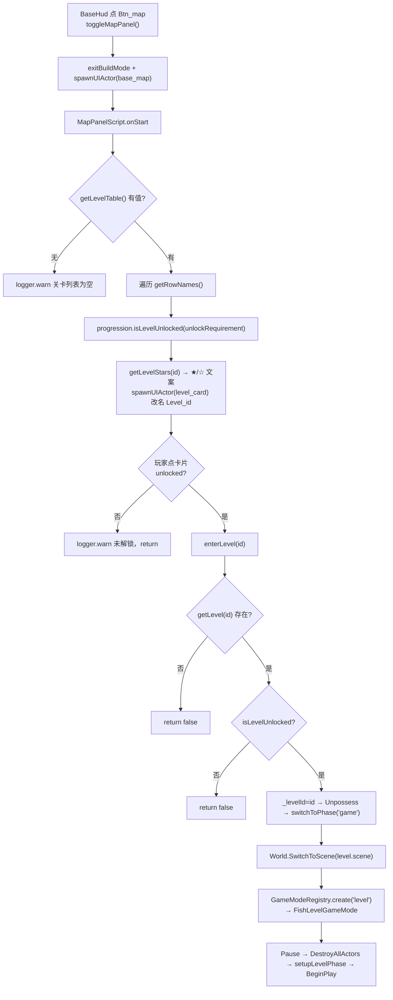

# 关卡系统（Level）

> **一句话定位**：关卡系统是 ClashMaster 的「选关 → 打一场 → 评星 → 回城」闭环，用一张配置表驱动地图面板，复用 `game` 阶段加载不同场景资产。
>
> **什么时候会用到你**：新增一个关卡（加表行 + 场景资产）、改解锁条件或星级规则、排查「卡片点了没反应 / 关卡锁着进不去 / 星级没涨 / 回基地卡住」。
>
> 代码位置：`src/projects/fish/gameplay/level/`、`src/projects/fish/gameplay/base/MapPanel.script.ts`、`src/projects/fish/gameplay/common/ProgressionService.ts`

---

## 1. 先记住这几个文件

| 文件 | 一句话职责 | 你要改它的场景 |
|---|---|---|
| [FishGameInstance.ts](../../src/projects/fish/gameplay/FishGameInstance.ts) | 阶段路由主人：`enterLevel` / `switchToPhase` / `returnToBase`，持有 `_levelId` | 加阶段、改场景选择规则、改进关校验 |
| [MapPanel.script.ts](../../src/projects/fish/gameplay/base/MapPanel.script.ts) | 读 `fish.levels` 表动态生成关卡卡片，判锁 + 展示星级 | 改卡片外观、改解锁文案、加字段展示 |
| [ProgressionService.ts](../../src/projects/fish/gameplay/common/ProgressionService.ts) | 评星 + 写 `levelRecords` + 判解锁 + 三星首杀发宝石 | 改星级规则、改解锁口径、加奖励 |
| [FishLevelGameMode.ts](../../src/projects/fish/gameplay/level/FishLevelGameMode.ts) | 关卡战斗本体（敌方建筑 / 放兵 / 胜负 / 结算弹面板） | 改战斗玩法，见 [battle_system.md](./battle_system.md) |

**关键心智模型**：关卡**不新增阶段枚举**。`_levelId` 非空就走关卡场景，`null` 就走海域场景，两者共用 `switchToPhase('game')`；场景资产里的 `mode: "level"` 决定 `World` 创建哪个 GameMode。所以「加关卡」不需要改任何阶段调度代码。

---

## 2. 一次进攻怎么走完：从基地到结算返回

### 2.1 谁发起了它

基地 HUD 的「地图」按钮打开关卡选择面板（[BaseHud.script.ts:70](../../src/projects/fish/gameplay/base/BaseHud.script.ts)）：

```ts
mapBtn.onClick = () => mode.toggleMapPanel()
```

`toggleMapPanel` 在 [FishBaseGameMode.ts:260](../../src/projects/fish/gameplay/base/FishBaseGameMode.ts)：

```ts
toggleMapPanel() {
  if (this.mapPanel) { this.closeMapPanel(); return }
  // 打开地图面板时自动退出建筑模式（建筑菜单隐藏；关闭地图面板后可重新进入）
  this.exitBuildMode()
  const w = this.world
  if (!w) { logger.error('[BaseGM] 打开地图面板失败：world 为空'); return }
  const panel = w.ui.spawnUIActor('asset/blueprints/ui/base_map.widget.json')
  if (!panel) { logger.error('[BaseGM] 地图面板生成失败'); return }
  this.mapPanel = panel
}
```

面板是**打开时才 spawn** 的一次性 UI Actor，关闭即 `destroy()`（`closeMapPanel`，`FishBaseGameMode.ts:282`），不常驻。开启前强制 `exitBuildMode()`：建筑模式与地图面板单向互斥，避免同时出现两个放置态。

### 2.2 选关与进入



**① 地图面板读表生成卡片**（[MapPanel.script.ts:62](../../src/projects/fish/gameplay/base/MapPanel.script.ts) 起）：

```ts
const levelTable = inst?.getLevelTable()
const world = this.world
const levelList = this.findInChildren('LevelList')
if (!levelTable) logger.warn('[MapPanelScript] 关卡表未加载（getTable 返回 undefined），关卡列表为空')
else if (!world) logger.error('[MapPanelScript] world 为空，无法动态生成关卡卡片')
else if (!levelList) logger.error('[MapPanelScript] 未找到关卡容器节点 "LevelList"')
else {
  for (const id of levelTable.getRowNames()) {
    const level = levelTable.getRow(id)
    if (!level) continue
    const unlocked = inst?.progression.isLevelUnlocked(level.unlockRequirement) ?? true
    const bestStars = inst?.progression.getLevelStars(id) ?? 0
```

表是**异步加载**的，开局瞬间 `getLevelTable()` 会返回 `undefined`——面板退化为空列表并 warn，不崩。`?? true` 是兜底：拿不到 `inst` 时按「已解锁」处理，避免面板全灰。

**② 卡片实例化与定位**（`MapPanel.script.ts:86`）：

```ts
const card = world.ui.spawnUIActor(LEVEL_CARD_BLUEPRINT, levelList)
if (!card) continue
card.root.name = `Level_${id}`
```

改名 `Level_{id}` 便于调试桥与 Playwright 按关卡定位；位置直接吃配置表 `pos`（`tsf.anchorOffset = [...level.pos]`），改位置改表即可。

**③ 点击进关**（`MapPanel.script.ts:119`）：

```ts
cardBtn.onClick = () => {
  if (!unlocked) { logger.warn(`[MapPanelScript] 关卡 ${level.name} 未解锁：${lockText}`); return }
  void inst?.enterLevel(id)
}
```

`enterLevel` 同步返回 boolean，`void` 只是显式丢弃返回值。面板先判一次锁，`enterLevel` 内再判一次——**双保险**，防调试桥 `__fishBattle.enterLevel` 绕过 UI 直进锁着的关。

**④ `enterLevel` 本体**（[FishGameInstance.ts:849](../../src/projects/fish/gameplay/FishGameInstance.ts)）：

```ts
enterLevel(id: string): boolean {
  const level = this.getLevel(id)
  if (!level) { logger.warn(`[Fish] 进入关卡失败：关卡 "${id}" 不存在`); return false }
  // 解锁校验（实时推导 levelRecords 星级；前置关卡不在存档表 = 未解锁）
  if (!this.progression.isLevelUnlocked(level.unlockRequirement)) {
    logger.warn(`[Fish] 进入关卡失败：${level.name} 未解锁（需 ${level.unlockRequirement?.levelId} ≥ ${level.unlockRequirement?.stars}★）`)
    return false
  }
  this._levelId = id
  this._phase = 'game'
  if (this._controller) { this._controller.Unpossess(); this._controller = null }
  this._baseGameMode?.cameraManager.Clear()
  const ok = this.switchToPhase('game')
  if (ok) this.syncToKV(`进关-${id}`)
  return ok
}
```

顺序有讲究：先把 `_levelId` 和 `_phase` 落位，**再** `Unpossess` 旧 controller、清旧相机注册，最后才切场景。反过来的话新 GameMode 已起来、旧 controller 引用还挂着，会出现「两个 controller 抢输入」。

**⑤ 场景切换走哪个 API**（`FishGameInstance.ts:589`）：

```ts
private switchToPhase(phase: Phase): boolean {
  this._phase = phase
  const sceneName = phase === 'menu' ? 'FishMenu'
    : phase === 'base' ? 'FishBaseIsland'
    : this._levelId ? (this.getLevel(this._levelId)?.scene ?? 'ClashMaster') : 'ClashMaster'
  const ok = this.world.SwitchToScene(sceneName, () => {
    switch (phase) {
      case 'game': this._levelId ? this.setupLevelPhase() : this.setupGamePhase(); break
    }
  })
  if (!ok) logger.error(`[Fish] 切换阶段失败 → ${phase}`)
  return ok
}
```

用的是 `World.SwitchToScene(name, extraSetup)`（[World.ts:671](../../src/engine/gameflow/World.ts)），不是直接 `new GameMode`。内部按场景资产的 `mode` 从注册表取构造函数——`register.ts:22` 注册了 `GameModeRegistry.register('level', FishLevelGameMode)`，所以 `fish_level1.scene.json` 里 `"mode": "level"` 是硬要求。

**旧 World（旧场景）的处置**在 `World.SwitchScene`（[World.ts:427](../../src/engine/gameflow/World.ts)）：`Pause()` → `DestroyAllActors()` → 残留诊断 → `SetGameMode(newMode)`（登录链内 `SpawnPlayer → PC.ClientSetHUD` 完成 HUD 创建）→ `extraSetup()` → `BeginPlay()`。三个反直觉点：`extraSetup` 在 `BeginPlay` **之前**跑（世界暂停、Actor 已加载未 BeginPlay，故 `spawnActor(mode.baseCamera)` 与 `PhySys.setup(...)` 安全）；场景建筑是 `type: "ref"` 节点，`BeginPlay` 后才建好网格，故 `collectBuildings()` 只能在 `BeginPlay` 调；切换前记 `baseline = new Set(ObjectRegistry.snapshot())`，切换后比对残留并报类名×数量，这是查「切场景后相机/Actor 泄漏」的第一手线索。

**⑥ 结算回调与相机托管**（`FishGameInstance.ts:716` 的 `setupLevelPhase`）：

```ts
spawnActor(mode.baseCamera)                    // 相机交 World 托管，销毁走 World 队列
this.setupCamera(mode.baseCamera.cameraComponent, 12, 16, 18)
mode.cameraManager.RegisterCamera(mode.baseCamera.cameraComponent)
if (this.world.gameRenderer?.uiLayer) PhySys.setup(mode.baseCamera.camera, this.world.gameRenderer.uiLayer)
// 通关记录：仅带 levelId 且胜利才写 clearedLevels
this.unsubGameState = mode.gameState.subscribe(() => {
  if (mode.gameState.phase !== 'gameover' || !this._levelId) return
  if (mode.getBattleResult().win) addClearedLevel(this.save, this._levelId)
})
// 星级战绩：gameover 时结算（超时/胜负共用管线）
mode.onBattleOver = () => {
  const r = this.progression.settleBattle({
    levelId: this._levelId, destroyRate: mode.getDestroyRate(),
    townhallDestroyed: mode.isTownhallDestroyed(), destroyedCount: mode.getDestroyedCount(),
  })
}
```

战斗相机交给 World 托管（`spawnActor`），销毁由 World 队列负责；`EndPlay` 里的 `this.baseCamera?.destroy()` 只兜底「未托管」的情况（如 GM 命令等裸切换不跑 `extraSetup`），否则相机无 world 归属会永久泄漏。

### 2.3 结算与返回

胜负一定，[FishLevelGameMode.ts:714](../../src/projects/fish/gameplay/level/FishLevelGameMode.ts) 的 `finishBattle` 收口：

```ts
private finishBattle(win: boolean): void {
  if (this.battleEnded || this.lootSettled) return
  this.battleEnded = true
  this.winResult = win
  const inst = this.gameInstance
  if (!this.lootSettled) {
    this.lootSettled = true
    if (inst) {
      if (Math.round(this.lootCoins) > 0) inst.resources.add('coins', Math.round(this.lootCoins))
      if (Math.round(this.lootElixir) > 0) inst.resources.add('elixir', Math.round(this.lootElixir))
    }
  }
  this.gameState.setPhase('gameover')
  try { this.onBattleOver?.() } catch (e) { logger.error(`[BattleGM] 星级结算异常: ${e}`) }
  const panel = w.ui.spawnUIActor('asset/blueprints/ui/battle_result.widget.json')
}
```

`battleEnded` 和 `lootSettled` 是**两把锁**：前者停兵 AI/防御塔，后者保掠夺只入账一次（缺一个会出现「大本营已炸，防御塔还在打最后一颗弹丸」或重复发钱）。顺序是**先发钱 → 再 `setPhase('gameover')` → 再评星**，评星在 `onBattleOver` 里，`try/catch` 保证星级存档异常不吞掉结算面板。结算面板在此 `spawnUIActor` 动态生成，并非常驻 HUD——`HUDClass` 是 `battle_hud`（战斗中的兵种卡片栏）。

星级在 [ProgressionService.ts:71](../../src/projects/fish/gameplay/common/ProgressionService.ts) 算：

```ts
static evaluateStars(destroyRate: number, townhallDestroyed: boolean): number {
  let stars = 0
  if (destroyRate >= 0.5) stars++
  if (townhallDestroyed) stars++
  if (destroyRate >= 1) stars++
  return stars
}
```

三条**独立累加**（不是互斥档位）：100% 全拆自动拿 3 星，因为它同时满足 50% 和大本营两个条件。

返回基地有两条路：结算面板的「回基地」按钮（[BattleResult.script.ts:60](../../src/projects/fish/gameplay/battle/BattleResult.script.ts) `backBtn.onClick = () => inst.returnToBase()`），以及出海玩法 `gameState.phase === 'gameover'` 的自动回城（`FishGameInstance.ts:703`）。两条都收敛到 `returnToBase()`（`FishGameInstance.ts:791`）：

```ts
returnToBase() {
  this._phase = 'base'
  this._levelId = null
  this.stopDebugTickDriver()
  if (this.unsubGameState) { this.unsubGameState(); this.unsubGameState = null }
  if (this._gameMode) { this._gameMode.cameraManager.Clear(); this._gameMode = null }
  if (this._levelGameMode) { this._levelGameMode.cameraManager.Clear(); this._levelGameMode = null }
  if (this._controller) { this._controller.Unpossess(); this._controller = null }
  this.pawn = null
  this.switchToPhase('base')
  this.syncToKV('回城')
}
```

`_gameMode`（出海）和 `_levelGameMode`（关卡）**都清**，因为两条路径都能回城；`unsubGameState` 也必须解绑，否则旧订阅闭包会在下次 `setPhase('gameover')` 时二次触发回城。

---

## 3. 关卡数据与存档

**配置表** [levels.table.json](../../src/projects/fish/asset/config/levels.table.json)：键是关卡 id，行结构由 [types.ts:343](../../src/projects/fish/gameplay/common/types.ts) 的 `LevelType` 定义。

| 字段 | 谁读它 | 说明 |
|---|---|---|
| `name` / `desc` | MapPanel 卡片文本 | 纯展示 |
| `scene` | `switchToPhase` | **必须等于 `.scene.json` 的 `name`**，`SwitchToScene` 按 name 查 |
| `pos` | MapPanel `anchorOffset` | 父容器局部坐标，改位置改表即可 |
| `stars` | MapPanel `☆` 补齐位数 | 难度星，与战绩星无关 |
| `unlockRequirement` | `isLevelUnlocked` | `{ levelId, stars }`，第 1 关不填 = 默认解锁 |
| `timeLimit` | `FishLevelGameMode.BeginPlay` | 秒，缺省 180 |

新增关卡只需加一行表 + 一个 `mode: "level"` 的场景资产，两者都由 `import.meta.glob` 自动注册，**无需改代码**。

**解锁判定**不落存档字段，而是实时推导（`ProgressionService.ts:129`）：

```ts
isLevelUnlocked(requirement: { levelId: string, stars: number } | undefined): boolean {
  if (!requirement) return true                 // 第 1 关不填条件 = 默认解锁
  const records = this.save.get<Record<string, LevelRecord>>('levelRecords') ?? {}
  const got = records[requirement.levelId]?.bestStars ?? 0
  if (got >= requirement.stars) return true
  logger.debug(`[Progression] 关卡未解锁: 需 ${requirement.levelId} ≥ ${requirement.stars}★（当前 ${got}★）`)
  return false
}
```

**写点**在 `settleBattle`（`ProgressionService.ts:94`），只增不减：`bestStars` 和 `bestDestroyRate` 都取 `Math.max`，三星首杀通过 `addGems` 回调发 10 宝石。

**存档**：`levelRecords` 走 `SaveSlotComponent`，文件是 [FishSaveAdapter.ts:42](../../src/projects/fish/gameplay/common/FishSaveAdapter.ts) 定义的 `src/projects/fish/data/save.json`。写入分三层——`settleBattle` 里 `save.set` 只改内存；资源/训练变化经 `syncRuntimeKeys` 监听器（`FishGameInstance.ts:155`）同步；**真正落盘只有玩家点存档菜单的 `saveGame()`**（`FishGameInstance.ts:203`，内部 `syncRuntimeKeys` + `writeMetaKeys` + `save.flush(true)`）。战斗打完不点保存就退出，星级会丢。另有 `clearedLevels`（`FishSaveAdapter.ts:196`）记录通关 id，现阶段只写不读。

---

## 4. 关键方法速查

| 方法 | 位置 | 干什么 | 注意 |
|---|---|---|---|
| `toggleMapPanel` / `closeMapPanel` | [FishBaseGameMode.ts:260](../../src/projects/fish/gameplay/base/FishBaseGameMode.ts) / [:282](../../src/projects/fish/gameplay/base/FishBaseGameMode.ts) | 开关关卡选择面板 | 打开前强制 `exitBuildMode()` |
| `MapPanelScript.onStart` | [MapPanel.script.ts:43](../../src/projects/fish/gameplay/base/MapPanel.script.ts) | 读表生成卡片 + 判锁 + 绑点击 | 表未加载时只 warn，列表为空 |
| `enterLevel(id)` | [FishGameInstance.ts:849](../../src/projects/fish/gameplay/FishGameInstance.ts) | 校验 → 设 `_levelId` → 切场景 | 返回 `boolean`，失败只 warn |
| `switchToPhase(phase)` | [FishGameInstance.ts:589](../../src/projects/fish/gameplay/FishGameInstance.ts) | 按 `_levelId` 选场景名 → `SwitchToScene` | 场景未注册 / mode 未注册都返回 false |
| `World.SwitchToScene` | [World.ts:671](../../src/engine/gameflow/World.ts) | 按 name 查资产 → 按 mode 建 GameMode → 切 | `extraSetup` 在 `BeginPlay` 前跑 |
| `setupLevelPhase` | [FishGameInstance.ts:716](../../src/projects/fish/gameplay/FishGameInstance.ts) | 托管相机、接 controller、注结算回调 | controller 为空会 `logger.error` |
| `FishLevelGameMode.BeginPlay` | [FishLevelGameMode.ts:141](../../src/projects/fish/gameplay/level/FishLevelGameMode.ts) | 收建筑、建寻路网格、读 `timeLimit` | `collectBuildings` 必须在此（ref 节点已建网格） |
| `finishBattle(win)` | [FishLevelGameMode.ts:714](../../src/projects/fish/gameplay/level/FishLevelGameMode.ts) | 掠夺入账 → gameover → 评星 → 弹结算面板 | `battleEnded` / `lootSettled` 双锁 |
| `evaluateStars` | [ProgressionService.ts:71](../../src/projects/fish/gameplay/common/ProgressionService.ts) | 50% / 大本营 / 100% 三条独立累加 | 100% 必得 3 星 |
| `settleBattle` | [ProgressionService.ts:94](../../src/projects/fish/gameplay/common/ProgressionService.ts) | 写 `levelRecords`，三星首杀发宝石 | `levelId` 为 null（普通出征）时只上报成就 |
| `isLevelUnlocked` | [ProgressionService.ts:129](../../src/projects/fish/gameplay/common/ProgressionService.ts) | 实时比对前置关卡星级 | 未解锁用 `debug` 级日志，不刷屏 |
| `returnToBase` | [FishGameInstance.ts:791](../../src/projects/fish/gameplay/FishGameInstance.ts) | 清 `_levelId` / 相机 / controller → 切 base | 清 `_gameMode` 与 `_levelGameMode` 两处 |
| `saveGame` | [FishGameInstance.ts:203](../../src/projects/fish/gameplay/FishGameInstance.ts) | 全量采集 + `flush(true)` 落盘 | 唯一常规写盘入口 |

---

## 5. 流程影响：牵动哪些功能

**上游：谁驱动它**

| 上游 | 怎么驱动 | 相关文档 |
|---|---|---|
| 基地 HUD「地图」按钮 | `BaseHud.script` → `toggleMapPanel()` 打开选关入口 | [clash_master.md](./clash_master.md) |
| 关卡数据表 `fish.levels` | 面板卡片、场景名、时限全部由表驱动 | [../engine/asset_tools_system.md](../engine/asset_tools_system.md) |
| `ProgressionService.levelRecords` | 面板星级展示与解锁判定的唯一数据源 | [gameplay_code_standard.md](./gameplay_code_standard.md) |
| 战斗系统（胜负/摧毁率） | `finishBattle` 触发结算，`onBattleOver` 才评星 | [battle_system.md](./battle_system.md) |

**下游：它波及谁**

| 下游功能 | 波及点 | 相关文档 |
|---|---|---|
| `World` / `GameModeRegistry` | `SwitchToScene` 按 `mode: "level"` 建 `FishLevelGameMode`；切换销毁全部旧 Actor | [../engine/gameflow_system.md](../engine/gameflow_system.md) |
| 存档（`levelRecords` / `clearedLevels`） | `settleBattle` 与 `addClearedLevel` 写内存 KV，靠 `saveGame()` 落盘 | [../engine/asset_tools_system.md](../engine/asset_tools_system.md) |
| 成就 / 每日任务 | `settleBattle` 内 `report('destroyBuildings')`、`report('battleWins')` | [gameplay_code_standard.md](./gameplay_code_standard.md) |
| 宝石经济 | 三星首杀经 `addGems` 回调发 10 宝石 | [clash_master.md](./clash_master.md) |
| 基地布局恢复 | `returnToBase` 回 base 阶段后重建布局，星级已入 KV | [clash_master.md](./clash_master.md) |

---

## 6. 踩坑清单

**1. 卡片点了没反应，日志刷「关卡未解锁」却看不到** —— `isLevelUnlocked` 用 `logger.debug` 输出，默认不可见；面板侧只在点击时才 `logger.warn`。规则：先查 `levelRecords[前置关].bestStars`，或用 `gmUnlockLevel(id)` 强制写 3★ 验证。

**2. 页面 hidden 导致 tick 停摆，动态生成的面板卡在 pendingSpawn** —— Playwright 集成浏览器 `visibilityState` 常为 hidden，rAF 暂停 → 游戏 tick 停 → `spawnUIActor` 的关卡卡片停在 pendingSpawn 队列，`MapPanelScript.onStart` 根本不执行。规则：浏览器验证时手动 `__fishBattle.startTickDriver()` 驱动，真实 Electron 无此问题。

**3. 多次开关面板残留多个 MapPanel** —— `destroy()` 未提交（tick 停摆）时旧实例还在，`ai.getActor` 会查到旧实例造成误判。规则：驱动 tick 后复现正常，不要靠「再点一次」修。

**4. 场景资产 `name` 与表 `scene` 不一致 → 阶段切换失败** —— `SwitchToScene` 按 name 从 `AssetRegistry` 查，查不到直接 `logger.error` 返回 false，`enterLevel` 也就返回 false。规则：新增关卡时两处名字必须逐字符相同。

**5. 场景资产 `mode` 写错 → 创建错误 GameMode** —— 写成 `"game"` 会创建 `FishGameMode`（出海），没有敌方建筑收集逻辑，战斗直接空转。规则：`fish_level*.scene.json` 的 `mode` 必须是 `"level"`。

**6. 战斗打完星级没保存** —— `settleBattle` 只写内存 KV，落盘要等玩家点存档菜单的「保存存档」。规则：验证星级持久化必须显式调一次 `saveGame()`。

**7. `collectBuildings` 放错生命周期 → 建筑列表为空** —— 场景建筑是 `type: "ref"` 节点，`BeginPlay` 后网格才建好。放在 `StartPlay` 里 `GetAllActors()` 拿不到任何 `ClashBuildingBaseActor`，战斗会立刻判负。规则：只在 `BeginPlay` 收集。

**8. `unlockBattle.gm.ts` 的注释已过时** —— 它写着「fish.levels 表无锁定机制，所有关卡本就可进入」，但 `MapPanel.script.ts:78` 与 `enterLevel`（`FishGameInstance.ts:856`）都做了 `isLevelUnlocked` 校验。规则：以运行时校验为准，别信这条注释。

---

## 7. 边界条件

| 条件 | 行为 | 怎么应对 |
|---|---|---|
| 前置关卡无记录 | 视为未解锁（`?? 0`）；第 1 关无 `unlockRequirement` 默认解锁 | 用 `gmUnlockLevel` 验证是配置错还是流程错 |
| 战斗时限到 0 | 按摧毁率 ≥50% 或大本营已毁判胜，**超时 ≠ 失败** | 时限来自 `timeLimit`，缺省 180 |
| 军队全灭且已部署过兵 | 判负，`finishBattle(false)` | 一次没放兵不判负（`deployedCount > 0` 门槛） |
| 普通出征（`_levelId = null`） | `settleBattle` 跳过 `levelRecords`，只上报成就 | 评星展示在结算面板由 `BattleResultScript` 独立算 |
| 战斗内按 Esc | 取消放兵模式（`BindAction('battle-cancel')`），**不弹暂停菜单** | `pause_menu.widget.json` 与 `PauseMenu.script.ts` 已无调用方，属兼容占位 |
| 结算面板生成失败 | `logger.error`，战斗结果保留在 `getBattleResult()` | 仍可经调试桥 `returnToBase()` 退出 |
| 回城时旧订阅未解绑 | 下次 `gameover` 二次触发 `returnToBase` | `returnToBase` 里已 `unsubGameState()`，新增订阅需同步解绑 |
