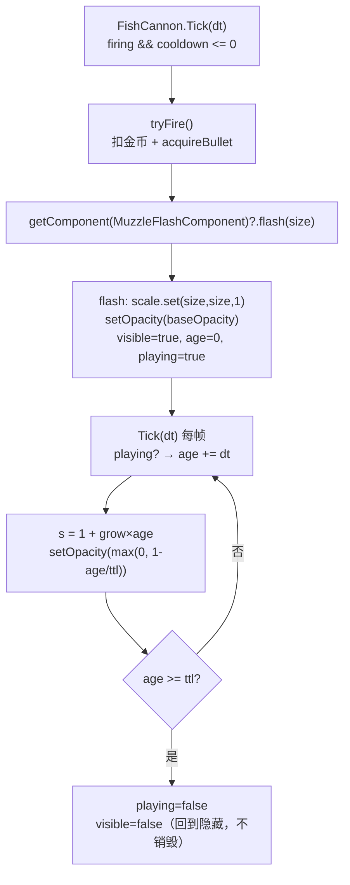

# MuzzleFlashComponent：炮口闪光特效

> **一句话定位**：炮台开炮瞬间那一下「放大 + 淡出」的光斑——`FishCannon` 只喊一声 `flash(size)`，面片、材质、动画、回收全由本组件自管。
>
> **什么时候会用到你**：改炮口闪光的大小/时长/亮度、排查「闪光不出现」「闪一下就没」「闪光被别人带崩了」、往别的地方加同类短命特效时决定「用组件还是用对象池」。
>
> 代码位置：`src/projects/fish/gameplay/game/comp/`

---

## 1. 先记住这几个文件

| 文件 | 一句话职责 | 你要改它的场景 |
|---|---|---|
| [MuzzleFlashComponent.ts](../../src/projects/fish/gameplay/game/comp/MuzzleFlashComponent.ts) | 闪光本体：组合 `SpriteComponent` 建面片，`flash()` 触发、`Tick` 跑动画 | 改闪光外观、时长、放大速度、透明度 |
| [FishCannon.ts](../../src/projects/fish/gameplay/game/FishCannon.ts) | 炮台 Pawn：构造时挂载组件，`tryFire()` 里触发一次 | 改触发时机/触发尺寸、换触发源 |
| [SpriteComponent.ts](../../src/engine/rendering/SpriteComponent.ts) | 引擎精灵组件：共享单位平面 + 每实例材质，提供 `setTexture` / `setOpacity` | 需要纹理/透明度之外的渲染能力 |
| [FishFlash.ts](../../src/projects/fish/gameplay/game/FishFlash.ts) | 池化版通用闪光（对比物，非本组件依赖） | 要写「世界任意位置的一次性闪光」别抄本组件 |

**关键心智模型**：本组件**不是**对象池特效——它是**每个炮台常驻一份、反复复用同一张面片**的状态机。同一个闪光面片被无限次重播，靠 `age = 0` 重置，不回收、不新建。这是它与 `FishFlash` 的根本分野（见 §6 坑 4）。

---

## 2. 一次开火怎么闪起来：从开火事件到闪光结束

### 2.1 谁触发了它

调用方只有一处——`FishCannon.tryFire()`，在子弹发出之后触发（[FishCannon.ts:97](../../src/projects/fish/gameplay/game/FishCannon.ts)）：

```ts
// ─── 炮口闪光（MuzzleFlashComponent 自管动画；位置已固定在炮口，随 root 旋转自动跟随） ───
this.getComponent(MuzzleFlashComponent)?.flash(cfg.netRadius * 2.6)
```

上游链路是标准的输入 → Pawn → 组件：`FishPlayerController` 收鼠标按下调 `SetFiring(true)` → `FishCannon.Tick` 冷却到期调 `tryFire()` → 扣金币、发子弹、触发闪光。

注意 `?.` 是**可选链**：组件没挂载时整行静默跳过、不报错。这不是防御性冗余，而是让「炮台不带闪光」成为一种合法配置。

### 2.2 特效链路



**① 构造：组合一个精灵，而不是裸 new THREE**

```ts
constructor(owner: Actor) {
  super(owner)
  this.name = 'MuzzleFlash'
  this.sprite = this.owner.addComponent(SpriteComponent, 1, 1, 'MuzzleFlashSprite')
  this.sprite.setTexture(flashTexture())
  this.sprite.setOpacity(0)
  ;(this.sprite.mesh.material as THREE.MeshBasicMaterial).depthWrite = false
  this.sprite.mesh.position.set(0, 1.4, 0.3)
  this.sprite.mesh.visible = false
}
```

组件用 `owner.addComponent(SpriteComponent, 1, 1, ...)` **组合**出面片，项目代码零裸 `new THREE.Mesh` / `new THREE.MeshBasicMaterial`——这是「组件优先 + 项目代码禁止裸 new THREE」的项目红线。面片挂在 `owner.root` 下，所以炮台旋转时闪光自动跟着转，不需要每帧算炮口朝向。

`depthWrite = false` 是透明面片的标配：不写深度，闪光就不会把后面的其他透明对象（水波、光环）挡掉或打乱排序。

**② 纹理：模块级共享缓存**

```ts
let _flashTex: THREE.Texture | null = null
function flashTexture(): THREE.Texture {
  if (!_flashTex) {
    const c = document.createElement('canvas')
    c.width = 64
    c.height = 64
    // ...径向渐变绘制
    _flashTex = new THREE.CanvasTexture(c)
  }
  return _flashTex
}
```

所有炮台共用同一张纹理，第一次用到才画。**这是本组件最反直觉、也最危险的一处**——它是模块级静态变量，跨场景常驻，但共享不等于安全，销毁时会被引擎连坐释放，见 §6 坑 1。

**③ 触发：只重置状态，不新建对象**

```ts
flash(size: number): void {
  this.sprite.mesh.scale.set(size, size, 1)
  this.sprite.setOpacity(this.baseOpacity)
  this.sprite.mesh.visible = true
  this.age = 0
  this.playing = true
}
```

连射时**不创建新面片**，只是把年龄拨回 0 重播一次。所以高频开火零分配、零 GC。

**④ 动画：放大 + 淡出**

```ts
override Tick(dt: number): void {
  if (!this.playing) return
  this.age += dt
  const k = this.age / this.ttl
  const s = 1 + this.grow * this.age
  this.sprite.mesh.scale.set(s, s, 1)
  this.sprite.setOpacity(Math.max(0, 1 - k))
  if (this.age >= this.ttl) {
    this.playing = false
    this.sprite.mesh.visible = false
  }
}
```

注意 `scale` 是**绝对值** `1 + grow×age`，不是累加——所以重播时不会残留上一次的大小。但这也埋了一个真实缺陷，见 §6 坑 2。

组件本身不注册任何调度：由 `BObject.Tick` 遍历组件列表驱动（[BObject.ts:49](../../src/engine/entity/BObject.ts)），`if (!this.playing) return` 让空闲炮台每帧只付出一次布尔判断。

### 2.3 结束与回收

到期后**只把 `playing` 置 false、`visible` 置 false**，面片仍在 `owner.root` 下、材质纹理全部保留，等下一次 `flash()`。

真正的销毁跟着炮台走：`FishCannon.EndPlay` → `BObject.EndPlay` 逆序遍历组件 → `ThreeObjectComponent.EndPlay` → `obj.dispose()`，材质和几何在这里释放。

---

## 3. 可调参数与配置对应

组件三个公有字段都能在运行期直接改（[MuzzleFlashComponent.ts:51-55](../../src/projects/fish/gameplay/game/comp/MuzzleFlashComponent.ts)）：

| 组件字段 | 默认值 | 含义 | 对应来源 |
|---|---|---|---|
| `ttl` | `0.15` | 闪光总时长（秒） | 硬编码默认值，无配置项 |
| `grow` | `6` | 每秒放大系数，`scale = 1 + grow × age` | 硬编码默认值，无配置项 |
| `baseOpacity` | `0.9` | 触发瞬间不透明度 | 硬编码默认值，无配置项 |

**唯一的外部输入是触发尺寸**，来自炮台配置表（[cannon.config.json](../../src/projects/fish/asset/config/cannon.config.json)）：

```ts
this.getComponent(MuzzleFlashComponent)?.flash(cfg.netRadius * 2.6)
```

`cfg` 是 `ConfigRegistry.getConfig<CannonConfig>('fish.cannon')` 按 `level` 取的一档，`netRadius` 随炮等级递增（0.8 → 2.6），所以**炮等级越高，闪光越大**（初始尺寸 2.08 → 6.76）。2.6 这个倍数是经验值，写在 `FishCannon` 里而非组件里。

**资产挂载？没有。** 全仓 `grep MuzzleFlash` 只命中两个 `.ts` 文件——组件是 `FishCannon` 构造函数里用代码挂的（[FishCannon.ts:35](../../src/projects/fish/gameplay/game/FishCannon.ts)），**不在任何蓝图/场景资产里**。别去 `cannon.blueprint.json` 找它，那份蓝图属于 ClashMaster 的建筑炮台 `CannonActor`，跟 `FishCannon` 不是一个东西。

---

## 4. 关键方法速查

| 方法 | 位置 | 干什么 | 注意 |
|---|---|---|---|
| `constructor(owner)` | MuzzleFlashComponent.ts:61 | 组合 `SpriteComponent`、贴纹理、定位炮口、初始隐藏 | 组件内部又挂了一个组件，销毁时会连带释放 |
| `flashTexture()` | MuzzleFlashComponent.ts:26 | 懒创建模块级共享径向闪光纹理 | 跨场景常驻；但会被 `dispose` 连坐释放，见 §6 坑 1 |
| `flash(size)` | MuzzleFlashComponent.ts:75 | 设初始尺寸/不透明度 → 显示 → 重置 `age=0`、`playing=true` | 唯一外部入口；`size` 只影响首帧，见 §6 坑 2 |
| `Tick(dt)` | MuzzleFlashComponent.ts:85 | 放大 + 淡出，到期隐藏 | 由 `BObject.Tick` 遍历驱动，不自己注册调度 |
| `SpriteComponent.setOpacity` | SpriteComponent.ts:71 | 设 `material.opacity`，`<1` 自动开 `transparent` | 参数不会被 clamp，调用方自己 `Math.max(0, ...)` |
| `SpriteComponent.setTexture` | SpriteComponent.ts:77 | 贴纹理并把颜色刷回白色基底 | 传字符串走 `loadTexture` 缓存，传 `Texture` 直接用 |

---

## 5. 流程影响：牵动哪些功能

### 上游：谁驱动它

| 上游 | 怎么驱动 | 相关文档 |
|---|---|---|
| `FishPlayerController` | 鼠标按下/抬起 → `SetFiring(true/false)`，转动 → `SetAimTarget` | [./clash_master.md](./clash_master.md) |
| `FishCannon.Tick` | 冷却到期调 `tryFire()`，先扣金币再触发闪光 | [./clash_master.md](./clash_master.md) |
| `fish.cannon` 配置表 | 提供 `netRadius`，决定闪光初始尺寸 | [../engine/asset_tools_system.md](../engine/asset_tools_system.md) |
| `FishGameMode.spawnPlayerInternal` | `new FishCannon()` 构造时挂上本组件 | [../engine/entity_system.md](../engine/entity_system.md) |
| `BObject.Tick` | 每帧遍历组件，驱动 `Tick(dt)` 动画 | [../engine/entity_system.md](../engine/entity_system.md) |

### 下游：它波及谁

| 下游 | 波及点 | 相关文档 |
|---|---|---|
| `SpriteComponent` | 组件内部组合一个，占用炮台的组件列表与 `root` 子节点 | [../engine/entity_system.md](../engine/entity_system.md) |
| 共享闪光纹理 `_flashTex` | 与所有炮台共用；任一炮台销毁会 `dispose` 它，拖垮其余炮台 | [./battle_system.md](./battle_system.md) |
| `ThreeObject.dispose` | 炮台 `EndPlay` 时释放材质与纹理，几何为共享不释放 | [../engine/entity_system.md](../engine/entity_system.md) |
| 渲染排序 | `depthWrite = false` 影响同场景其他透明对象的绘制顺序 | [./battle_system.md](./battle_system.md) |

---

## 6. 踩坑清单

**1. 炮台一销毁，所有炮台的闪光变黑 —— 共享纹理由 `dispose` 连坐释放。**

`_flashTex` 是模块级单例，但 `SpriteComponent` 的材质持有它的引用。`ThreeObject.dispose()` 会遍历材质所有属性、凡是 `THREE.Texture` 就 `dispose()`（[ThreeObject.ts:85](../../src/engine/rendering/ThreeObject.ts)），而 `ThreeObjectComponent.EndPlay` 必然调 `dispose()`。所以**任何一次炮台 `EndPlay` 都会把这张共享纹理释放掉**，`_flashTex` 变量还非 null，后续新建的炮台会拿到一张已释放的纹理。**规则**：要么给共享纹理加引用计数，要么改用 `loadTexture` 路径缓存（走引擎缓存体系），不要自己用模块级变量持有唯一实例。

**2. `flash(size)` 的 `size` 只在触发那一帧有效，之后立刻被 `Tick` 覆盖。**

`flash()` 里 `scale.set(size, size, 1)` 设的是**绝对**尺寸，但下一帧 `Tick` 就把它覆盖成 `1 + grow × age`（age≈dt，约等于 1）。所以视觉上闪光总是从 1×1 起步放大，传进去的 `size` 只在同帧渲染时闪一下。**规则**：想让闪光从 `size` 起步放大，必须像 `FishFlash` 那样存 `baseSize` 再算 `baseSize × (1 + grow×age)`，不能直接 `scale.set(size,...)`。

**3. 触发时的 `opacity` 恒为 `baseOpacity`，外部改不了。**

`flash(size)` 只有一个参数，透明度永远取字段值 `0.9`。想单发更亮只能先改字段再触发。**规则**：需要逐发控制亮度时给 `flash` 加可选参数 `flash(size, opacity?)`，默认值回落到 `baseOpacity`。

**4. 别把本组件当「通用闪光」用——它不是对象池，位置是写死的。**

面片位置在构造时钉死在炮台本地坐标 `(0, 1.4, 0.3)`，靠挂在 `owner.root` 下随炮台旋转。它天生只服务「炮台炮口」这一个点。**规则**：要在世界任意位置放一次性闪光（比如鱼被捕获的光环），用池化的 [FishFlash.ts](../../src/projects/fish/gameplay/game/FishFlash.ts) + `pools.acquireFlash({...})`，它每次 `activate` 都重设位置与纹理。

**5. `tryFire()` 里闪光在子弹之后触发，但两者互不阻塞。**

`acquireBullet` 走对象池、`flash()` 是同步改属性，任一步失败都不影响另一步；金币不足时函数在最前面就 `return false`，**闪光完全不会触发**。**规则**：调闪光效果时先确认金币够——`cost` 为 1 但钱包为 0 时，看到的是"按了没反应"，不是闪光坏了。

---

## 7. 边界条件

| 条件 | 行为 | 怎么应对 |
|---|---|---|
| 组件未挂载就触发 | `?.` 可选链静默跳过，不抛错 | 合法配置，无需处理；排查"不闪"时先确认构造里有 `addComponent` |
| 金币不足 | `tryFire` 在触发闪光前 `return false`，闪光不发生 | 检查 `resources.has('coins', cfg.cost)` |
| 高频连射（冷却 0.12s） | 每次 `flash()` 重置 `age=0` 重播，复用同一面片，零分配 | 无需限流；但 `ttl=0.15` > 冷却 0.12，前一次未淡完就被重置，连射时闪光看起来是持续亮 |
| `ttl` 内再次开火 | 立即从 `age=0` 重来，`opacity` 跳回 `baseOpacity` | 表现为"闪得更亮更久"，这是复用式设计的预期行为 |
| 炮台销毁 / 场景切换 | 组件随 `EndPlay` 释放材质；**共享纹理被连坐 dispose** | 见 §6 坑 1，这是当前实现的已知缺陷 |
| `ttl` 设为 0 | 首帧 `k = age/0 = Infinity` 或 NaN，`opacity` 立刻为 0，随即隐藏 | 不要把 `ttl` 调到 0 |
| `baseOpacity` > 1 | `setOpacity` 不做 clamp，材质 `opacity` 直接超 1 | 保持 ≤ 1，超出无意义且可能触发渲染异常 |
| `netRadius` 配置缺失 | `cfg.netRadius` 为 undefined，`flash(undefined)` → `scale` 变 NaN，面片消失 | 保证 `cannon.config.json` 每档 `levels` 都有 `netRadius` |
| 纹理已释放后新建炮台 | 拿到已 dispose 的纹理，闪光渲染为黑块或空白 | 见 §6 坑 1 |
| 浏览器/无 WebGL 环境 | `document.createElement('canvas')` 的 `getContext('2d')` 返回 null 会抛错 | 组件未做空判；当前仅在 Electron 渲染进程内使用 |
