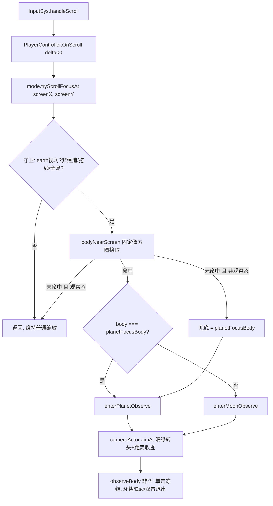

# 滚轮聚焦吸附与行星观察视角（Scroll Focus Snap & Observe Mode）

> **一句话定位**：地球系视角下滚轮拉近时，光标附近有天体就"原地转头"聚焦它并进入环绕观察态，而不是普通缩放。
> **什么时候会用到你**：调星球聚焦/观察交互手感时；排查"单击星球不弹信息面板""滚轮一滚视角乱转"时；给聚焦吸附加新天体类型时。
> 代码位置：`projects/warm-current/gameplay/base/WarmCurrentGameMode.ts`、`projects/warm-current/gameplay/map/SolarCameraActor.ts`、`projects/warm-current/gameplay/base/WarmCurrentPlayerController.ts`

## 1. 先记住这几个文件

| 文件 | 一句话职责 | 你要改它的场景 |
|---|---|---|
| [WarmCurrentGameMode.ts](../../projects/warm-current/gameplay/base/WarmCurrentGameMode.ts) | 吸附判定 + 观察态进出（`tryScrollFocusAt` / `enterPlanetObserve` / `enterMoonObserve`） | 改吸附触发条件、拾取口径、观察态行为 |
| [SolarCameraActor.ts](../../projects/warm-current/gameplay/map/SolarCameraActor.ts) | 相机"瞄准滑移"执行者（`aimAt` 逐帧 lerp 注视点与距离） | 改转头手感、滑移打断逻辑 |
| [WarmCurrentPlayerController.ts](../../projects/warm-current/gameplay/base/WarmCurrentPlayerController.ts) | 滚轮输入转发（拉近滚动 → GameMode 判定） | 改输入触发时机（如放宽到 delta>0） |
| [balance.ts](../../projects/warm-current/gameplay/core/balance.ts) | `B.map.focusSnapTolerance` 吸附像素圈半径 | 调吸附灵敏度 |

**关键心智模型**：观察态（`observeBody` 非空）下**左键被征用了**——单击不再是"点天体开面板"，而是环绕拖拽的一部分；退出观察只认双击同一目标 / Esc。所以"滚轮拉近星球 → 进观察态 → 单击没反应"不是 bug 链断了，是交互语义切换了。

## 2. 主流程：从滚轮滚动到环绕观察



### 2.1 输入入口：只有"拉近"触发吸附

[WarmCurrentPlayerController.ts:95](../../projects/warm-current/gameplay/base/WarmCurrentPlayerController.ts)

```ts
override OnScroll(delta: number): void {
  if (delta >= 0 || !this.lastScreen) return
  this.mode.tryScrollFocusAt(this.lastScreen.x, this.lastScreen.y)
}
```

拉近（delta < 0）才判定吸附，拉远永远是普通缩放。这里不做任何模式守卫——守卫全部集中在 GameMode 侧（§2.2），Controller 保持"哑管道"。`lastScreen` 是 `OnPointerMove` 时缓存的屏幕坐标，云台 zoom 先行、本虚方法后行的时序由 InputSys 保证。

### 2.2 吸附判定：tryScrollFocusAt 三层守卫 + 兜底

[WarmCurrentGameMode.ts:1151](../../projects/warm-current/gameplay/base/WarmCurrentGameMode.ts)

```ts
tryScrollFocusAt(screenX: number, screenY: number): void {
  if (this.viewMode !== 'earth' || this.viewSwitching) return
  if (this.buildMode || this.routeEditMode || this.hologramSel) return
  const body = this.bodyNearScreen(screenX, screenY)
    ?? (this.observeBody ? null : this.planetFocusBody as StarBodyId)
  if (!body || body === this.observeBody) return
  logger.info(`[WarmCurrent] 滚轮聚焦吸附（镜头看向不跳变） → ${PLANET_NAMES[body] ?? body}（光标 ${screenX.toFixed(0)},${screenY.toFixed(0)}）`)
  if (body === this.planetFocusBody) this.enterPlanetObserve(body as PlanetId)
  else this.enterMoonObserve(body as MoonId)
}
```

三层守卫缺一不可：视角切换进行中（450ms 窗口）判定会拿到漂移中的投影；建筑落位/航线拖拽/全息勘探中滚轮必须保持纯缩放，否则左键语义冲突。**兜底分支是手感的关键**：光标圈外无命中且当前不在观察态时，吸附到 `planetFocusBody`——即"在空旷处滚轮拉近 = 特写当前聚焦行星"；但观察态中兜底返回 null，滚轮回归纯缩放（已在该天体特写里，再拉近就是真的拉近）。末行按"是否当前聚焦体"分流：聚焦体走行星观察，它的卫星走卫星观察。

### 2.3 屏幕拾取：固定像素圈 + 差分投影求屏幕半径

[WarmCurrentGameMode.ts:1168](../../projects/warm-current/gameplay/base/WarmCurrentGameMode.ts)

```ts
private bodyNearScreen(screenX: number, screenY: number): StarBodyId | null {
  const el = this.world?.gameRenderer?.uiLayer
  const cam = this.gameCamera.camera
  if (!el || !cam) return null
  const rect = el.getBoundingClientRect()
  if (rect.width === 0 || rect.height === 0) return null
  const focus = this.planetFocusBody as PlanetId
  const members: StarBodyId[] = [focus]
  for (const [id, mc] of Object.entries(B.map.moons)) {
    if (mc.parent === focus) members.push(id as MoonId)
  }
  cam.updateMatrixWorld()
  const right = new THREE.Vector3().setFromMatrixColumn(cam.matrixWorld, 0)
  const v = new THREE.Vector3()
  const tol = B.map.focusSnapTolerance
  let best: StarBodyId | null = null
  let bestDist = Infinity
  for (const id of members) {
    const actor = this.starActors.get(id)
    if (!actor) continue
    v.copy(actor.root.position).project(cam)
    if (v.z < -1 || v.z > 1) continue
    const cx = rect.left + ((v.x + 1) / 2) * rect.width
    const cy = rect.top + ((1 - v.y) / 2) * rect.height
    const ex = v.copy(actor.root.position).addScaledVector(right, B.map.nodes[id].r).project(cam)
    const px = rect.left + ((ex.x + 1) / 2) * rect.width
    const py = rect.top + ((1 - ex.y) / 2) * rect.height
    const screenR = Math.hypot(px - cx, py - cy)
    const d = Math.hypot(screenX - cx, screenY - cy)
    if (d <= tol || d <= screenR) {
      const score = Math.min(d, screenR)
      if (score < bestDist) {
        bestDist = score
        best = id
      }
    }
  }
  return best
}
```

四个反直觉点：

1. **候选集只有"聚焦行星 + 其卫星"**，不是全部天体——视角锁定地球系后，其它行星的投影远离屏幕或被裁剪，全量遍历既浪费又会误吸。
2. **屏幕半径用差分投影求**：把球心沿相机右轴偏移 `r` 再投影一次，两点像素距离就是屏幕半径。免推 fov/距离换算公式，任意焦距、任意窗口尺寸下都精确。`cam.updateMatrixWorld()` 必须手动调——拾取发生在 Tick 外，矩阵可能是上一帧的。
3. **NDC z 出 [-1,1] 直接跳过**：球心在相机背后或裁剪面外时投影坐标是镜像/发散的，不可信。
4. **命中 = 光标入固定像素圈（`d ≤ tol`）或落在天体投影盘内（`d ≤ screenR`）**，二者取像素距离近者胜。`tol` 是固定 60px，不随天体投影半径/镜头远近膨胀（2026-09-15 五版用户口径）——远看时星球只有十几像素，60px 圈照样能吸到，这是"光标附近有天体就吸"的手感来源。

### 2.4 进入观察：enterPlanetObserve / enterMoonObserve

[WarmCurrentGameMode.ts:1251](../../projects/warm-current/gameplay/base/WarmCurrentGameMode.ts)（行星）/[WarmCurrentGameMode.ts:1290](../../projects/warm-current/gameplay/base/WarmCurrentGameMode.ts)（卫星）

```ts
enterPlanetObserve(body: PlanetId): void {
  if (this.viewMode !== 'earth' || this.planetFocusBody !== body) return
  if (this.hologramSel) this.closeHologram()
  if (this.buildMode) this.cancelBuildMode()
  if (this.routeEditMode) this.toggleRouteEditMode()
  this.observeBody = body

  const rig = this.cameraActor.rig
  const r = B.map.nodes[body].r
  const stage = planetStageOffset(body)
  rig.setEdgePanEnabled(false)
  this.applyZoomFloor(r)
  this.cameraActor.aimAt(() => new THREE.Vector3(stage.x, r * 0.55, stage.z), r * 4)
  rig.orbitMode = true
  rig.leftOrbitEnabled = true
  this.observeFollowLast = null
  this.applyObserveBoost(body)
  audioSys.play('wc.ok', { volume: 0.4 })
  logger.info(`[WarmCurrent] 行星观察：${PLANET_NAMES[body] ?? body}（拖拽环绕 · 滚轮缩放 · Esc/再双击退出）`)
}
```

进入观察前先把三个互斥态清干净（全息/建造/拖线）——左键在观察中是环绕拖拽，不能同时落位或拖线。行星与卫星的差别在**锚点闭包**：行星钉在舞台中心，闭包直接返回固定 `stage` 点；卫星随公转漂移，闭包每帧取 `starActors` 实时位，滑移期间自动跟踪。`observeFollowLast` 只在卫星观察置值，供 Tick 逐帧跟随收敛后的公转漂移。`setEdgePanEnabled(false)` 是因为边缘平移会拖走注视点破坏环绕，退出/切视图时恢复。

## 3. 滑移执行：aimAt 的"玩家接管让位"

[SolarCameraActor.ts:86](../../projects/warm-current/gameplay/map/SolarCameraActor.ts)

```ts
aimAt(anchor: () => THREE.Vector3, wantDist?: number): void {
  this.aimAnchor = anchor
  this._aimLastTarget = this.rig.target.clone()
  if (wantDist !== undefined) {
    this.aimDist = Math.max(1, wantDist)
    this._aimLastPos = this.camera.position.clone()
  } else {
    this.aimDist = null
    this._aimLastPos = null
  }
}
```

```ts
if (this.aimAnchor) {
  const goal = this.aimAnchor()
  const expected = this._aimLastTarget
  const dragged = expected !== null && this.rig.target.distanceToSquared(expected) > 1e-4
  if (dragged) {
    this.aimAnchor = null
    logger.info('[SolarCamera] 聚焦看向：玩家接管，滑移让位')
  } else {
    const alpha = Math.min(1, AIM_LERP * (dt / (1 / 60)))
    // ... target lerp 向锚点；有 aimDist 时相机沿视线收拢距离
  }
}
```

滑移设计成**可被玩家随时打断**：`_aimLastTarget`/`_aimLastPos` 是上帧滑移写回的基准，帧间 target 偏离基准 = 玩家在 pan（接管转头），pos 偏离基准 = 玩家在 zoom（接管距离），对应分量让位。**滚轮缩放沿视线动相机、不改 target，与滑移天然共存**——这就是"边转头边收拢距离，玩家一滚轮就改滚自己的"的手感实现。观察态收敛后的逐帧公转跟随不走 aimAt，而是 GameMode Tick 写 `rig.target.x/z` 后调 `SyncCameraLook()`（[SolarCameraActor.ts:113](../../projects/warm-current/gameplay/map/SolarCameraActor.ts)）摆正朝向。

## 4. 关键方法速查

| 方法 | 位置 | 干什么 | 注意 |
|---|---|---|---|
| `OnScroll` | WarmCurrentPlayerController.ts:95 | 拉近滚动转发 GameMode 判定 | 只转 delta<0，无守卫 |
| `tryScrollFocusAt` | WarmCurrentGameMode.ts:1151 | 吸附总入口：守卫 + 拾取 + 兜底 + 分流 | 观察态兜底返回 null |
| `bodyNearScreen` | WarmCurrentGameMode.ts:1168 | 固定像素圈屏幕拾取 | tol=60px 固定，不随缩放膨胀 |
| `enterPlanetObserve` | WarmCurrentGameMode.ts:1251 | 进行星观察（锚=舞台钉扎点） | 先清全息/建造/拖线互斥态 |
| `enterMoonObserve` | WarmCurrentGameMode.ts:1290 | 进卫星观察（锚=公转实时位） | observeFollowLast 置值供 Tick 跟随 |
| `enterPlanetSystem` | WarmCurrentGameMode.ts | 双击地球 toggle 观察（退出入口） | 双击其它行星已屏蔽 |
| `aimAt` / `isAiming` | SolarCameraActor.ts:86 / :102 | 滑移启动/状态查询 | 锚点是闭包，支持实时跟踪 |
| `SyncCameraLook` | SolarCameraActor.ts:113 | 写 target 后摆正朝向（原地转头） | 不动相机位置 |
| `focusSnapTolerance` | balance.ts:609 | 吸附像素圈半径（B.map） | star_map.config 可覆盖 |

## 5. 流程影响：牵动哪些功能

### 上游：谁驱动它

| 上游 | 怎么驱动 | 相关文档 |
|---|---|---|
| InputSys 滚轮分发 | handleScroll → Controller.OnScroll | [`engine/input_system.md`](../engine/input_system.md) |
| 星图双击 | onMapPointerDown → enterPlanetSystem toggle | [`game/modules/00-模块总览.md`](../game/modules/00-模块总览.md) |
| 相机云台 | rig zoom/orbit/pan 与滑移共存或打断 | [`game/modules/00-模块总览.md`](../game/modules/00-模块总览.md) |

### 下游：它波及谁

| 下游功能 | 波及点 | 相关文档 |
|---|---|---|
| 星图单击开面板 | 观察态分支 `if (this.observeBody) {...return}` 冻结单击，只认 350ms 双击 | [`game/modules/00-模块总览.md`](../game/modules/00-模块总览.md) |
| 相机云台 | edgePan 关闭、orbitMode/leftOrbitEnabled 开启、zoomFloor 贴球心 | [`game/modules/00-模块总览.md`](../game/modules/00-模块总览.md) |
| 全息勘探 | 互斥：进观察先 closeHologram | [`game/modules/11-特殊建筑系统.md`](../game/modules/11-特殊建筑系统.md) |
| 大气渲染 | applyObserveBoost ×1.8 特写提亮，退出 resetObserveBoost 复位 | [`engine/rendering_system.md`](../engine/rendering_system.md) |

## 6. 踩坑清单（都是真踩过的）

**1. 单击星球不弹信息面板（2026-09-15 已修复）** —— 现象：单击地球/月球无反应，但 `bodyAt`/`openPlanetInfo` 直接调用正常。原因（历史）：滚轮吸附静默进入观察态后，观察态分支整体冻结单击（只认 350ms 双击）。修复：观察态单击解冻——按下记 `pendingObserveClick` 快照、抬起位移 ≤8px 结算为单击（走 `resolveMapClick`，点星球开面板），>8px 归环绕拖拽；`clearObserveState` 统一清快照。规则：排查"点击没反应"先查 `outcome === 'defeat'` / `pendingCard` / `hologramSel`（这三者仍冻结星图点击，为正常语义）；观察态单击已解冻，不再吞点击。

**2. 吸附命中判定看似太宽** —— 现象：光标离星球还有几十像素就触发了聚焦。原因：`tol` 是固定 60px 且不随天体投影半径膨胀，远看星球投影只有十几像素，60px 圈远大于星球本身。规则：这是手感设计（"光标附近有天体就吸"），调灵敏度改 `B.map.focusSnapTolerance`，不要改判定逻辑。

**3. 诊断时游戏自动败局吞点击** —— 现象：AI 桥注入的点击 consumed=true 但面板不弹，且复现不稳定。原因：确定性模拟在分析期间走到 `outcome='defeat'`，`onMapPointerDown` 败局分支（`s.outcome === 'defeat' || s.pendingCard`）同样吞点击。规则：验证点击链路前先查 `state().outcome === 'playing'`，必要时 GM 置回 playing 再测。

**4. 滑移期间玩家滚轮"无效"** —— 现象：吸附转头过程中滚轮似乎没反应。原因：没反应是错觉——aimAt 的距离收拢（wantDist）与玩家 zoom 共存，玩家滚动会打断收拢但转头继续，最终距离以玩家滚到的为准。规则：调"转头不飞近"传 `aimAt(anchor)` 不带 wantDist（五版行为），调"边转边收拢"才传 wantDist。

## 7. 边界条件

| 条件 | 行为 | 怎么应对 |
|---|---|---|
| 拉远滚动（delta > 0） | 永远普通缩放，不触发吸附 | 无需处理 |
| 建造/拖线/全息中滚轮拉近 | 守卫拦截，纯缩放 | 互斥态进观察前已被清，但滚轮先行拦截 |
| 观察态中光标圈外拉近 | 兜底返回 null，纯缩放 | 已在特写中，不再重复吸附 |
| 天体在相机背后/裁剪面外 | NDC z 越界跳过，不误吸 | bodyNearScreen 内置守卫 |
| 双击非聚焦行星 | enterPlanetSystem 屏蔽（仅地球系） | 视角锁定 2026-09-14 生效 |
| 观察态单击（抬起位移 ≤ 8px） | 走星图点击判定（点星球开信息面板），双击仍退出/切换观察 | 2026-09-15 单击解冻 |
| 观察态拖拽（抬起位移 > 8px） | 环绕拖拽，相机层消费，不结算点击 | 快照在 clearObserveState 统一清理 |
| 败局/事件卡弹出 | onMapPointerDown 整体 return，滚轮吸附不受限 | 观察态在败局下仍可进出 |
