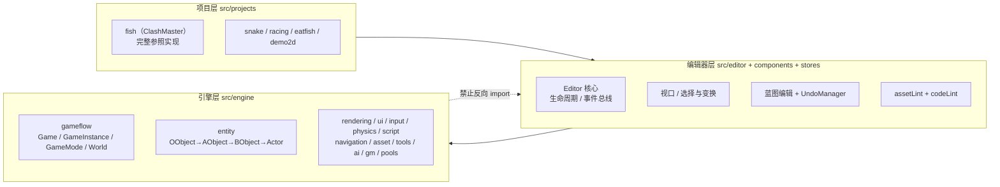

# DemoStudio 系统总览（System Overview）

> **一句话定位**：这是整个 DemoStudio 的**一张地图**——它不深入任何系统，只回答「这个仓库由哪几层组成、每层有哪些子系统、该看哪篇文档」。
>
> **什么时候会用到你**：第一次接触本仓库想建立全局认知时、要改某个功能但不知道该看哪篇文档时、判断一段代码属于「引擎 / 编辑器 / 项目 / 资产」哪一层时、新增子系统后要同步架构认知时。
>
> 代码位置：`src/engine/`（引擎）、`src/editor/` + `src/components/` + `src/stores/`（编辑器）、`src/projects/`（游戏项目）
>
> 统计基准：2026-09-03 全量实扫（`Get-ChildItem -Recurse` + `Select-String`），**非沿用旧稿数字**

---

## 1. 先记住这几层

| 层 | 目录 | 一句话职责 | 你要读它的场景 |
|---|---|---|---|
| **引擎层** | `src/engine/` | 运行时通用能力：对象层级 + 组件 + 游戏流 + 渲染/UI/输入/物理 | 加组件、改游戏流、改渲染或命中逻辑 |
| **编辑器层** | `src/editor/` + `src/components/` + `src/stores/` | 编辑期能力：视口、选择变换、蓝图编辑、资产检查 | 改面板、改编辑器行为、加调试能力 |
| **项目层** | `src/projects/` | 具体游戏的玩法实现（每个目录一个游戏） | 写玩法、加关卡、加 GameMode |
| **资产层** | `src/projects/*/asset/` | 数据资产：场景 / 蓝图 / UI widget / 配置表，由 `import.meta.glob` 自动注册 | 配场景、写蓝图、调数值 |

**关键心智模型**：本仓库是**单向依赖链**——`projects/` → `editor/` → `engine/`，**引擎永远不反向 import 编辑器或项目**。

这条红线在代码里是可验证的：对 `src/engine/` 全目录搜 `from '...gameplay`、`from '../projects`、`from '@/projects`，**命中 0 条**。所以判断一段代码该放哪层，只问一句：它描述的是**通用能力**（引擎）、**编辑期能力**（编辑器）、还是**某个具体游戏的玩法**（项目）。

---

## 2. 系统是怎么分层的



引擎层再往下拆就是「游戏流 + 实体 + 支撑域」三大块，从 `src/engine/index.ts` 的导出分组能直接看出来：

```ts
export { GameMode } from './gameflow/GameMode'
export { GameState } from './gameflow/GameState'
export { GameInstance } from './gameflow/GameInstance'
export { Game } from './gameflow/Game'
export { World } from './gameflow/World'
```

> **这段代码说明什么**：`Game → GameInstance → GameMode → World` 是运行时的主干，`GameState` 挂在 GameMode 上而不是 World 上。所以「全局状态归谁」的答案是 GameMode，不是 World——[gameflow_system.md](./engine/gameflow_system.md) 里讲的就是这条链。

```ts
export { OObject } from './entity/OObject'
export { AObject } from './entity/AObject'
export { BObject } from './entity/BObject'
export { Actor } from './entity/Actor'
export { Component } from './entity/Component'
```

> **这段代码说明什么**：四级对象层级是**逐层加能力**的——`OObject` 只有名字与生命周期，`AObject` 加组件容器，`BObject` 加变换与父子树，`Actor` 加游戏语义。组件基类也跟着分三档（`Component` / `AObjectComponent` / `BObjectComponent` / `ActorComponent`），**组件挂在哪一层取决于它要访问哪一层的能力**。详见 [entity_system.md](./engine/entity_system.md)。

```ts
export { AIModule, registerBuiltinAIHandlers } from './ai'
export { InputSys } from './input/InputSys'
export { PhySys } from './physics/PhySys'
export { NavigationModule } from './navigation/NavigationModule'
```

> **这段代码说明什么**：`InputSys` / `PhySys` / `NavigationModule` / `AIModule` 都是**从引擎统一出口导出的单例或模块**，项目层不自己 new，一律从这里拿。加新的引擎级单例，必须在这份 `index.ts` 里补一行 export——这是引擎对外的**唯一契约面**。

---

## 3. 引擎子系统清单（13 个功能域 / 116 个 .ts）

实扫 `src/engine/` 得到 **13 个子目录 + 2 个根文件（`index.ts`、`Logger.ts`），共 116 个 `.ts`**。

| 功能域 | 文件数 | 关键类 | 你要改它的场景 | 文档 |
|---|---:|---|---|---|
| `entity/` | 12 | `OObject` / `AObject` / `BObject` / `Actor` / `Component` 族 | 加组件基类、改对象生命周期 | [实体体系](./engine/entity_system.md) |
| `gameflow/` | 20 | `Game` / `GameInstance` / `GameMode` / `GameState` / `World` | 改阶段路由、改生成/胜负规则 | [游戏流程](./engine/gameflow_system.md) |
| `rendering/` | 22 | `CameraComponent` / `SpriteComponent` / `CanvasUIComponent` / `Compositor2D` / `TextureLoader` | 改渲染管线、加渲染组件 | [渲染系统](./engine/rendering_system.md) |
| `ui/` | 18 | `UIManager` / `HUD` / `UIText|Image|Button...Component` / `UIScriptComponent` | 加 UI 控件、改 UI 生命周期 | [世界 UI](./engine/ui_system.md)、[CanvasUIComponent](./engine/ui_canvas_component.md) |
| `input/` | 3 | `InputSys` / `InputComponent` / `PlayerController` | 加新输入类型、改按键路由优先级 | [输入系统](./engine/input_system.md) |
| `physics/` | 5 | `PhySys`（全局射线）/ `PhysicsWorld`（World 级碰撞）/ `ColliderComponent` | 点不中、碰撞不触发、重叠判定 | [物理与射线命中](./engine/physics_system.md) |
| `script/` | 2 | `BehaviourScript` / `ScriptRegistry` | 给 UI 面板写交互脚本 | [脚本系统](./engine/script_system.md) |
| `navigation/` | 3 | `NavigationModule` / `NavGrid` / `AStarPathfinder` | 改寻路、加障碍判定 | [导航系统](./engine/navigation_system.md) |
| `asset/` | 5 | `AssetRegistry` / `BlueprintRegistry` / `SceneLoader` | 加新资产类型、改加载流程 | [资产与工具](./engine/asset_tools_system.md) |
| `tools/` | 13 | `ComponentRegistry` / `ActorRegistry` / `GameModeRegistry` / `ConfigRegistry` / `ObjectPool` | 加注册表、改配置表加载 | [资产与工具](./engine/asset_tools_system.md) |
| `ai/` | 4 | `AIModule` 事件总线 | 加一个 AI 可调用的事件 | [AI 事件系统](./engine/ai_system.md) |
| `gm/` | 6 | `GMModule` / `GMRegistry` / `GMConsoleHUD` | 加一个游戏内调试命令 | [GM 命令系统](./engine/gm_system.md) |
| `pools/` | 1 | `ObjectPoolManager` | 改池化策略 | [资产与工具](./engine/asset_tools_system.md) |

另有一篇与域无关但改 API 前必读的兼容性参考：[Ursina 参考](./engine/ursina_reference.md)。

> **旧稿修正**：2026-09-03 实扫确认旧总览**遗漏了 `gm/`、`navigation/`、`pools/` 三个功能域**，本文已补齐。判断一个域是否存在，以 `ls src/engine/` 为准，不要沿用旧文档结论。

---

## 4. 编辑器子系统清单（69 + 55 个 ts/tsx，4 个 store）

编辑器基于 React 18 + zustand + Three.js，经 Electron preload 用 `electronAPI` 桥接文件系统；**浏览器调试模式下 `electronAPI` 不存在**，走 `MockElectronAPI`。

### 4.1 `src/editor/` —— 69 个文件（根目录 22 + 4 个二级目录 47）

| 位置 | 文件数 | 一句话职责 | 文档 |
|---|---:|---|---|
| 根目录 | 22 | `Editor.ts` 生命周期 / `EditorInitializer.ts` 装配 / `SceneViewport.ts` 与 `GameViewport.ts` 两类视口 / `SelectionManager.ts` + `TransformGizmo.ts` + `AnchorGizmo.ts` / `ConsoleCommands.ts` / `KeyboardShortcuts.ts` / `LogPoller.ts` / `FpsTracker.ts` / `MockElectronAPI.ts` | [编辑器核心](./editor/core/core_system.md)、[视口](./editor/core/viewport_system.md)、[选择与变换](./editor/core/selection_transform_system.md) |
| `asset/` | 33 | 资产预览四 Manager + `assetLint/`（12 文件资产检查引擎）+ `uiCompiler/`（14 文件 widget 编译） | [资产预览与检查](./editor/asset/asset_preview_lint_system.md)、[UI 源格式](./editor/ui/ui_source_format_system.md) |
| `blueprintEdit/` | 5 | `BlueprintEditorService` / `blueprintOps` / `UndoManager` / `nodeTemplates` / `windowApi` | [蓝图编辑](./editor/blueprint/blueprint_edit_system.md)、[撤销/重做](./editor/blueprint/undo_redo_system.md) |
| `codeLint/` | 8 | `CodeLintEngine` + `checkers/`（3 个规则：addComponent / bareThree） | [代码检查](./editor/asset/code_lint_system.md) |
| `configEdit/` | 1 | 配置表编辑能力 | [资产与工具](./engine/asset_tools_system.md) |

### 4.2 `src/components/`（55 个）+ `src/stores/`（4 个）

`components/` 根目录 26 个面板 tsx + `agent/`（28）+ `icons/`（1）。主要面板：`Viewport`（[Viewport.tsx:40](../src/components/Viewport.tsx#L40)）、`Inspector`（[Inspector.tsx:991](../src/components/Inspector.tsx#L991)）、`Outline` / `UiOutline`、`AssetBrowser`、`BlueprintEditor`（[BlueprintEditor.tsx:54](../src/components/BlueprintEditor.tsx#L54)）、`ScenePreviewEditor`、`UISceneView`、`Console`、`StatusBar` / `MenuBar`、`RightPanel`、`ProjectSelector`。

| Store | 用途 | 文档 |
|---|---|---|
| `editorStore.ts` | 编辑器全局状态（选中、脏标记、游戏运行状态） | [编辑器核心](./editor/core/core_system.md) |
| `projectStore.ts` | 项目列表与当前项目 | [React 面板组件](./editor/ui/ui_components_system.md) |
| `editorPrefsStore.ts` | 编辑器偏好（控制台可见性、面板布局） | [React 面板组件](./editor/ui/ui_components_system.md) |
| `useCodeLintStore.ts` | 代码检查结果状态 | [代码检查](./editor/asset/code_lint_system.md) |

其余 UI 专题：[UI 增强](./editor/ui/ui_enhancement_system.md)（Tween / Toast / Tooltip / 色盲模式）、[UI 锚点](./editor/ui/ui_anchor_system.md)、[widget HTML 手册](./editor/ui/ui_widget_html_manual.md)、[MCP 集成](./editor/integration/mcp_integration.md)、[Agent 面板](./editor/integration/agent_panel_system.md)。

> **旧稿修正**：旧总览只列了 3 个 store，实扫有 **4 个**（`useCodeLintStore.ts` 为后加）。

---

## 5. 项目与资产

### 5.1 项目清单（5 个）

实扫 `src/projects/` 得到 **5 个项目**（旧稿写的 6 个含 `mainmenu`，该目录**已不存在**）。每个项目含 `project.json` + `register.ts`，由 `registry.ts` 统一收集：

```ts
const ALL_PROJECTS: ProjectModule[] = [
  snakeProject,
  eatFishProject,
  demo2DProject,
  racingProject,
  fishMasterProject,
]
```

> **这段代码说明什么**（[registry.ts:52](../src/projects/registry.ts#L52)）：项目列表是**手写数组**，不是 `import.meta.glob` 自动扫描。所以**新增一个项目必须回来改这个文件**——这一点与资产（全自动）相反，是最容易忘的一步。

| 项目（`ProjectModule.name`） | 目录 | 玩法 | ts/tsx | 文档 |
|---|---|---|---:|---|
| `ClashMaster` | `fish/` | 基地建造 + 兵种训练 + 攻打敌方基地，**完整参照实现** | 78 | [ClashMaster](./projects/clash_master.md)、[关卡](./projects/level_system.md)、[战斗](./projects/battle_system.md)、[炮口闪光](./projects/muzzle_flash_component.md) |
| `Snake` | `snake/` | 贪吃蛇 | 8 | — |
| `Racing` | `racing/` | 竞速 | 7 | — |
| `EatFish` | `eatfish/` | 吃鱼 | 12 | — |
| `Demo2D` | `demo2d/` | 2D 演示 | 8 | — |

只有 `fish/` 有 `gameplay/` 目录（73 个 ts，按 `menu` / `base` / `level` / `battle` / `game` / `gm` / `common` 分包），也是新项目的结构样板。写 gameplay 代码前必读 [gameplay 代码规范](./projects/gameplay_code_standard.md)。

### 5.2 资产类型与数量（实扫 `src/` 递归）

| 资产类型 | 后缀 | 数量 | 分布 | 创建方式 | 文档 |
|---|---|---:|---|---|---|
| 场景资产 | `*.scene.json` | 9 | fish 7（含 blueprints 下 1）/ demo2d 1 / snake 1 | `skl-create-scene-asset` | [资产与工具](./engine/asset_tools_system.md) |
| 蓝图资产 | `*.blueprint.json` | 21 | 全部在 fish（顶层 4 + buildings 7 + troops 10） | `skl-create-blueprint-asset` | [资产与工具](./engine/asset_tools_system.md) |
| UI widget | `*.widget.json` | 24 | 全部在 `fish/asset/blueprints/ui/` | `skl-create-ui-widget-asset` | [UI 源格式](./editor/ui/ui_source_format_system.md) |
| UI widget 源 | `*.widget.html` | 24 | 同上，与 `.widget.json` **一一对应**（24/24） | 手写 HTML+CSS → `ui_compile` | [widget HTML 手册](./editor/ui/ui_widget_html_manual.md) |
| 单例配置 | `*.config.json` | 6 | fish 5 / eatfish 1 | `skl-create-config-asset` | [资产与工具](./engine/asset_tools_system.md) |
| 数据表 | `*.table.json` | 6 | fish 5 / eatfish 1 | `skl-create-config-asset` | [资产与工具](./engine/asset_tools_system.md) |

> **资产文件新增无需改代码**：项目 `asset/` 目录由 `import.meta.glob` 自动注册（见 `src/projects/fish/asset/index.ts` 的 `registerFishAssets`）。**这条只对资产成立，对 `gameplay/` 下的 `.ts` 不成立**。

---

## 6. 关键统计数字

| 项 | 数量 | 统计方式 |
|---|---:|---|
| 引擎功能域 | 13 | `Get-ChildItem src/engine -Directory` |
| 引擎 .ts 文件 | 116 | `Get-ChildItem src/engine -Recurse -Include *.ts` |
| 引擎对外导出符号 | 254 | 解析 `src/engine/index.ts` 的 150 条 `export {}`（含 44 条 `export type`） |
| 内置注册组件 | 29 | 解析 `registerBuiltinComponents.ts` 的 `ComponentRegistry.register(` 调用 |
| 内置注册 Actor | 1 | `registerBuiltinActors.ts` 仅注册 `'Actor'` → `GenericActor` |
| 编辑器 .ts/.tsx 文件 | 69 | `Get-ChildItem src/editor -Recurse -Include *.ts,*.tsx` |
| React 面板文件 | 55 | `Get-ChildItem src/components -Recurse -Include *.ts,*.tsx` |
| zustand store | 4 | `Get-ChildItem src/stores -File` |
| 游戏项目 | 5 | `Get-ChildItem src/projects -Directory` |
| 资产总数（6 类） | 90 | `Get-ChildItem src -Recurse -Filter` 逐后缀统计（9+21+24+24+6+6） |
| GM 命令文件 | 8 | `Get-ChildItem src -Recurse -Filter *.gm.ts`（全在 `fish/gameplay/gm/`） |
| 行为脚本文件 | 14 | `Get-ChildItem src/projects -Recurse -Filter *.script.ts` |
| `doc/` 文档总数 | 48 | `Get-ChildItem doc -Recurse -Filter *.md` |

文档分布：总览 1 / 引擎 13 / 编辑器 15（core 4 / blueprint 2 / asset 2 / ui 5 / integration 2）/ 项目 5 / Harness 9 / 测试 3 / 根级 3。完整索引见 [doc/README.md](./README.md)。

---

## 7. 关键入口速查

| 入口 | 位置 | 干什么 | 注意 |
|---|---|---|---|
| 引擎统一出口 | [index.ts](../src/engine/index.ts) | 254 个对外符号的唯一契约面 | 新增引擎能力必须在这里补 export |
| 内置组件注册 | [registerBuiltinComponents.ts:56](../src/engine/tools/registerBuiltinComponents.ts#L56) | 注册 29 个组件工厂 | 幂等（`_registered` 标记） |
| 内置 Actor 注册 | [registerBuiltinActors.ts:15](../src/engine/tools/registerBuiltinActors.ts#L15) | 注册 `'Actor'` 蓝图默认 baseClass | 项目行为类在各项目 `register.ts` 里注册 |
| 项目模块收集 | [registry.ts:52](../src/projects/registry.ts#L52) | `ALL_PROJECTS` 手写数组 | **新增项目必须改这里** |
| 项目批量注册 | [registry.ts:76](../src/projects/registry.ts#L76) | 注册组件/Actor/AI/GM + 游戏工厂 | 配置表延迟到 `initProjectConfigs` |
| 配置表延迟加载 | [registry.ts:105](../src/projects/registry.ts#L105) | 按项目名加载配置表 | 打开工程时才调 |
| 工程资产注册/清理 | [registry.ts:119](../src/projects/registry.ts#L119) / [:130](../src/projects/registry.ts#L130) | 切工程时清旧资产再注册新资产 | 直接 `reset` + `clearAll` 三个注册表 |
| 编辑器启动 | [Editor.ts:38](../src/editor/Editor.ts#L38) | `init` 按顺序拉起子系统 | ⚠️ 只能调一次（见 §9 坑 2） |
| 编辑器销毁 | [Editor.ts:123](../src/editor/Editor.ts#L123) | 执行 `cleanupFns` 收摊 | 所有清理函数都在 `init` 里 push |
| 事件桥接 | [EditorInitializer.ts:67](../src/editor/EditorInitializer.ts#L67) | `editorBus` → zustand 的 3 条映射 | 加底层→UI 通知就在这加一行 |
| 项目+AI 处理器注册 | [EditorInitializer.ts:355](../src/editor/EditorInitializer.ts#L355) | `registerAllProjects` | 内含 `_editorAIHandlersInstalled` 幂等标记 |
| 资产检查启动 | [Editor.ts:84](../src/editor/Editor.ts#L84) | `assetLintEngine.start()` | 首扫 + 30s 定时 |
| 代码检查启动 | [Editor.ts:88](../src/editor/Editor.ts#L88) | `codeLintEngine.start()` | 事件驱动 + 去抖增量 |
| 资产检查手动跑 | [AssetLintEngine.ts:172](../src/editor/asset/assetLint/AssetLintEngine.ts#L172) | `runNow(folderOverride?)` | 返回 `LintIssue[]` |
| 代码检查手动跑 | [CodeLintEngine.ts:201](../src/editor/codeLint/CodeLintEngine.ts#L201) | `runNow(folderOverride?)` | 返回 `CodeIssue[]` |
| 游戏流主干 | [GameMode.ts:45](../src/engine/gameflow/GameMode.ts#L45) | `StartPlay` → 置 phase + `SpawnPlayer()` | 子类实现 `spawnPlayerInternal` |
| 实例启动 | [GameInstance.ts:96](../src/engine/gameflow/GameInstance.ts#L96) | `start()` → `createGameMode()` → `gm.StartPlay()` | [L118](../src/engine/gameflow/GameInstance.ts#L118) 会报 controller 为空 |
| 游戏创建/启动 | [Game.ts:129](../src/engine/gameflow/Game.ts#L129) / [:170](../src/engine/gameflow/Game.ts#L170) | `createInstance` / `launch` | 先 `createInstance` 再 `launch` |
| World 生命周期 | [World.ts:216](../src/engine/gameflow/World.ts#L216) / [:294](../src/engine/gameflow/World.ts#L294) | `Start()` / `BeginPlay()` | 场景加载走 `loadSceneAsActors`([L519](../src/engine/gameflow/World.ts#L519)) |
| 组件工厂 | [ComponentRegistry.ts:75](../src/engine/tools/ComponentRegistry.ts#L75) / [:83](../src/engine/tools/ComponentRegistry.ts#L83) | `register` / `create` | `getRegisteredTypes`([L114](../src/engine/tools/ComponentRegistry.ts#L114)) 可枚举 |
| 配置读取 | [ConfigRegistry.ts:74](../src/engine/tools/ConfigRegistry.ts#L74) / [:114](../src/engine/tools/ConfigRegistry.ts#L114) | `getConfig<T>` / `getTable<Row>` | 未加载时回退注册默认值，未注册则抛错 |
| AI 事件总线 | [AIModule.ts:149](../src/engine/ai/AIModule.ts#L149) | `emit(event, payload)` | `clearEvent`([L122](../src/engine/ai/AIModule.ts#L122)) 用于防重复注册 |
| GM 命令执行 | [GMModule.ts:104](../src/engine/gm/GMModule.ts#L104) | `execute(line, out?)` | 控制台开关 `toggleConsole`([L226](../src/engine/gm/GMModule.ts#L226)) |
| 蓝图编辑服务 | [BlueprintEditorService.ts:200](../src/editor/blueprintEdit/BlueprintEditorService.ts#L200) | 蓝图读写 + op 派发 | 读写依赖 `electronAPI`，浏览器模式返回 `ok:false` |
| 脚本注册 | [ScriptRegistry.ts:39](../src/engine/script/ScriptRegistry.ts#L39) / [:69](../src/engine/script/ScriptRegistry.ts#L69) | `register` / `registerAll(glob modules)` | 路径自动注册 |
| 场景视口 | [SceneViewport.ts:23](../src/editor/SceneViewport.ts#L23) | `createSceneViewport(...)` | `PreviewSceneManager` 在 [L103](../src/editor/SceneViewport.ts#L103) |
| 编辑器实例创建 | [App.tsx:56](../src/App.tsx#L56) | `new Editor()`（在 `useEffect` 内） | 仅执行一次 |

---

## 8. 流程影响：牵动哪些功能

本总览本身不实现任何逻辑，它是**源码结构的镜像 + 文档体系的入口**，所以它的上下游都是「结构性」的。

### 8.1 上游：谁驱动本文件

| 上游 | 怎么驱动 | 相关文档 |
|---|---|---|
| `src/` 目录结构变化 | 新增/删除功能域、项目、store → §3/§4/§5 的清单与统计失真 | — |
| `src/engine/index.ts` 导出变化 | 新增引擎对外能力 → §6 导出符号数与 §7 入口表要改 | [资产与工具](./engine/asset_tools_system.md) |
| 注册表变化 | `registerBuiltinComponents` 加一个组件 → §6 组件数 29 要改 | [资产与工具](./engine/asset_tools_system.md) |
| 资产文件增删 | 新增 `.scene.json` / `.blueprint.json` 等 → §5.2 数量要改 | [资产预览与检查](./editor/asset/asset_preview_lint_system.md) |
| 文档新建/拆分/移动 | `doc/` 下文件增删 → §3/§4 的文档列出现断链 | [文档维护](./doc_maintenance.md) |

### 8.2 下游：本文件波及谁

| 下游功能 | 波及点 | 相关文档 |
|---|---|---|
| 文档索引一致性 | 本文件的文档列必须与 `doc/README.md` 索引表指向同一批文件，两处打架会让新人无所适从 | [README](./README.md) |
| 文档维护巡检 | §3/§4 的功能域清单是「是否有域缺文档」巡检的依据 | [文档维护](./doc_maintenance.md) |
| 新人上手路径 | 这是新人看的第一篇，失真会直接误导后续所有调研 | — |
| 子系统文档 | 各专篇只讲自己这一块，跨层定位（这段代码属于哪层）只在本文件回答 | [实体体系](./engine/entity_system.md)、[编辑器核心](./editor/core/core_system.md) |
| 项目开发 | 新项目以 `fish/` 为样板，样板结构在本文件 §5.1 给出 | [ClashMaster](./projects/clash_master.md) |

---

## 9. 踩坑清单（都是真踩过的）

**1. 旧总览把已删除的项目当事实、并漏掉三个引擎域**

现象：旧稿写「6 个项目」含 `mainmenu`，且完全没有 `gm/` `navigation/` `pools/`；2026-09-03 实扫确认 `mainmenu` 目录不存在，而三个域一直存在。
原因：统计写在 2026-08-13 后未随代码演进同步，后人把文档当事实来源继续引用。
规则：**总览类的统计数字必须实扫源码得出**（`Get-ChildItem -Recurse`），不能沿用旧稿数字。改总览先 `ls`。

**2. 把已废弃的合并文档当索引目标**

现象：旧总览「输入/物理/脚本」统一指向 `engine/input_physics_script_system.md`，该文档已拆分为 `input_system.md` / `physics_system.md` / `script_system.md` 三篇并删除。
原因：拆分后只改了新文档与 README，没回头清理总览引用。
规则：**拆分/删除文档后必须全局 grep 该文件名**，把所有引用改指新文档。见 [文档维护](./doc_maintenance.md) §5。

**3. 文档移动后链接断链（`muzzle_flash_component.md` 案例）**

现象：该文件已从 `doc/engine/` 移到 `doc/projects/`，旧总览仍按 `./engine/muzzle_flash_component.md` 链接。
原因：组件属于 fish 项目的实现，不属于引擎通用能力，按分层归属移动了但引用没跟。
规则：**链接前先 `list_dir` 确认目标目录的真实文件清单**；判断落点用 §1 的分层心智模型（通用能力→`engine/`，项目实现→`projects/`）。

**4. 源码链接深度写错（两级 vs 三级）**

现象：本文位于 `doc/` 根目录，到仓库根是 `../`。同一份链接在 `doc/engine/` 下的文档里要写成 `../../src/`，在本文里要写成 `../src/`，直接复制会全断。
规则：**源码相对链接一律用两级**（`../src/...`）。跨文档互链用 `./engine/xxx.md`、`./projects/xxx.md` 这种同根相对路径。

**5. 以为「项目是自动扫描注册的」**

现象：资产确实由 `import.meta.glob` 自动注册，于是以为项目也是，结果新增项目后 `ALL_PROJECTS` 没加条目，游戏工厂永远查不到。
规则：**资产自动、项目手写**。`src/projects/registry.ts:52` 的 `ALL_PROJECTS` 数组新增项目必须手动加。

**6. 把统计口径混为一谈**

现象：「组件数」可以指 `registerBuiltinComponents` 的 29 个注册项，也可以指 `entity/` 下的组件基类文件数（12）；「导出符号数」可以指 150 条 export 语句，也可以指 254 个符号名。
规则：**每个数字后面必须写清统计方式**（本文 §6 的第三列），否则下次更新无法复现口径。

---

## 10. 边界条件

| 条件 | 行为 | 怎么应对 |
|---|---|---|
| 某功能域/项目暂无独立文档 | 表中文档列标注「—」或指向最相近的文档 | 按 [skl-write-doc](../.github/skills/skl-write-doc/SKILL.md) 补文档并更新 [README](./README.md) 索引 |
| 新增/删除项目或引擎域 | 本文件 §3/§5 清单与 §6 统计会失真 | 实扫 `ls` 后更新，并同步核对 README 统计段 |
| 文档被拆分或删除 | 本文件出现断链 | 全局 grep 文件名，改指新文档（见 §9 坑 2） |
| 想深入某个系统的实现 | 本文件**只做索引，不讲实现** | 进对应 `doc/engine/` 或 `doc/editor/` 专篇 |
| 统计数字与旧稿冲突 | 以源码实扫为准 | 不要沿用旧稿数字，见 §9 坑 1 |
| 浏览器调试模式下看编辑器 | `electronAPI` 不存在，走 `MockElectronAPI`；蓝图读写等依赖文件 IO 的能力返回失败 | 见 [Playwright 命令手册](./testing/playwright_commands.md)、[Playwright MCP](./testing/playwright_mcp_commands.md) |
| 要判断「这段代码该放哪层」 | 引擎禁止 import 编辑器/项目（实测 0 命中） | 用 §1 分层心智模型判断；引擎内禁止 import `gameplay/`（Logger 除外） |
| 需要 Harness / DSH 相关能力 | 不在本文件的四层模型内（它是 VS Code 扩展 + agent 集成） | 见 [Harness 工程](./harness/harness_system.md) |
