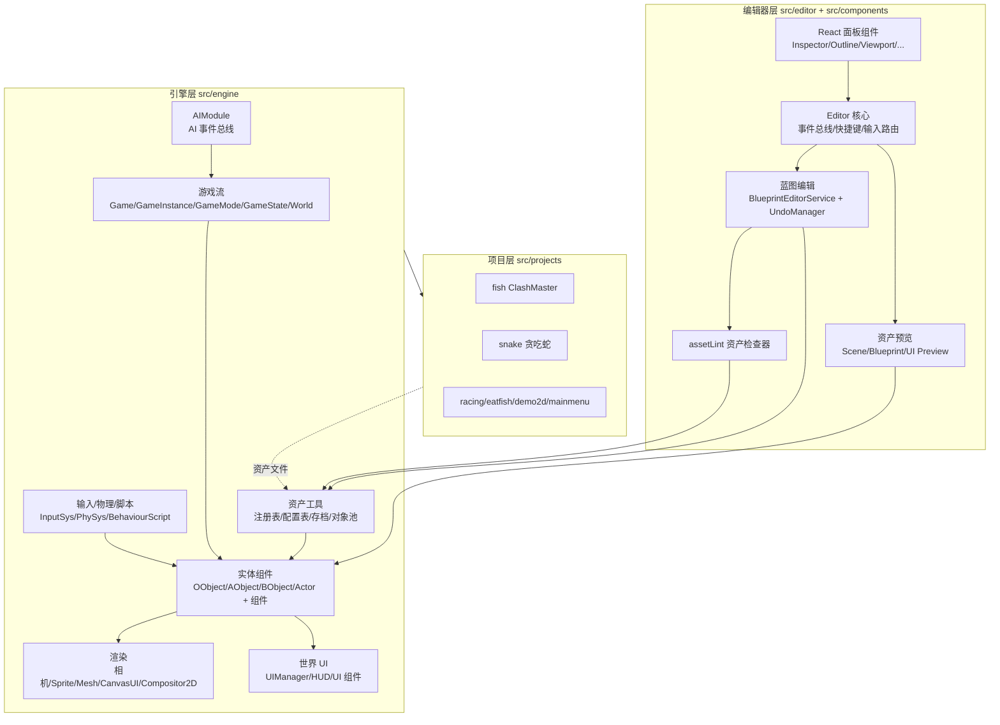

# DemoStudio 系统总览

> 本文档统计 DemoStudio 引擎与编辑器的全部子系统，作为架构索引。
> 统计日期：2026-08-13
> 每个系统均有独立文档：见 [doc/README.md](./README.md) 目录索引

## 目录

- [一、引擎核心系统（src/engine/）](#一引擎核心系统srcengine)
  - [1. 实体体系](#1-实体体系)
  - [2. 游戏流程系统](#2-游戏流程系统)
  - [3. 渲染系统](#3-渲染系统)
  - [4. UI 系统](#4-ui-系统)
  - [5. 输入 / 物理 / 脚本](#5-输入--物理--脚本)
  - [6. 资产与工具系统](#6-资产与工具系统)
  - [7. AI 事件系统](#7-ai-事件系统)
- [二、编辑器系统（src/editor/ + src/components/）](#二编辑器系统srceditor--srccomponents)
  - [1. 编辑器核心](#1-编辑器核心)
  - [2. 视口与场景](#2-视口与场景)
  - [3. 选择与变换](#3-选择与变换)
  - [4. 蓝图编辑](#4-蓝图编辑)
  - [5. 资产预览与检查](#5-资产预览与检查)
  - [6. 辅助系统](#6-辅助系统)
  - [7. React 面板组件](#7-react-面板组件)
  - [8. 状态管理（stores/）](#8-状态管理stores)
- [三、项目系统（src/projects/）](#三项目系统srcprojects)
- [四、资产类型系统](#四资产类型系统)
- [五、总览图](#五总览图)

---

## 一、引擎核心系统（src/engine/）

引擎采用 **UE 风格组件化框架**：`OObject → AObject → BObject → Actor` 四级对象层级 + `Game/GameMode/GameState` 游戏流 + 组件注册表驱动。

```
src/engine/
├── entity/     # 实体与组件基类
├── gameflow/   # 游戏流程（Game/World/GameMode/GameState）
├── rendering/  # 渲染（相机/Sprite/Mesh/CanvasUI/合成器）
├── ui/         # 世界 UI（UIManager/HUD/UI 组件）
├── input/      # 输入系统
├── physics/    # 物理系统
├── script/     # 行为脚本
├── asset/      # 资产注册与加载
├── tools/      # 注册表/配置表/存档/对象池等工具
├── ai/         # AI 事件总线（MCP 控制游戏）
└── index.ts    # 统一导出入口
```

### 1. 实体体系

| 系统 | 说明 | 文件 |
|---|---|---|
| 对象层级 | `OObject`（根）→ `AObject`（原子对象）→ `BObject`（蓝图对象）→ `Actor`（场景实体） | `entity/OObject.ts` `AObject.ts` `BObject.ts` `Actor.ts` |
| Pawn | 可操控实体（玩家/敌人），挂 `PlayerController` | `entity/Pawn.ts` |
| GenericActor | 通用 Actor（按资产/配置实例化） | `entity/GenericActor.ts` |
| 组件基类 | `Component` → `AObjectComponent` / `BObjectComponent` / `ActorComponent`，支持 `EditableProperty` 声明式属性 | `entity/Component.ts` 等 |
| SpawnComponent | 生成逻辑组件 | `entity/SpawnComponent.ts` |
| TransformComponent | 变换组件（位置/旋转/缩放） | `entity/TransformComponent.ts` |

### 2. 游戏流程系统

| 系统 | 说明 | 文件 |
|---|---|---|
| Game | 全局入口，持有 GameInstance | `gameflow/Game.ts` |
| GameInstance | 单局游戏实例（含回调 `GameInstanceCallbacks`） | `gameflow/GameInstance.ts` |
| GameMode | 游戏规则（生成/胜负/分数），项目可继承 | `gameflow/GameMode.ts` |
| GameState | 全局游戏状态 | `gameflow/GameState.ts` |
| World | 场景世界：Actor 生命周期管理、场景切换 | `gameflow/World.ts` |
| ActorManagerComponent | Actor 批量管理组件 | `gameflow/ActorManagerComponent.ts` |
| SceneRendererComponent | 场景渲染挂载入口 | `gameflow/SceneRendererComponent.ts` |
| SaveSlotComponent | 存档槽组件（`KVValue` 键值存储） | `gameflow/SaveSlotComponent.ts` |
| 对象工厂 | `OObjectFactory`（OObject 族）/ `ThreeObjectFactory`（Three 对象族） | `gameflow/` |

### 3. 渲染系统

| 系统 | 说明 | 文件 |
|---|---|---|
| 相机族 | `CameraComponent`（含 CameraMode）、`CameraActor`、`CameraRigComponent`、`CameraZoomComponent`、`PlayerCameraManager`、`UICamera` | `rendering/` |
| SpriteComponent | 2D 精灵渲染 | `rendering/SpriteComponent.ts` |
| MeshComponent / LineComponent / LightComponent | 3D 网格/线条/灯光 | `rendering/` |
| TroikaTextComponent | 文本渲染（troika-three-text） | `rendering/TroikaTextComponent.ts` |
| CanvasUIComponent | Canvas 2D UI 渲染（世界内 UI） | `rendering/CanvasUIComponent.ts` |
| CameraOverlayRenderer | 相机叠加渲染 | `rendering/CameraOverlayRenderer.ts` |
| Compositor2D | 2D 合成器 | `rendering/Compositor2D.ts` |
| SceneRenderHost | 渲染宿主（承载整个渲染树） | `rendering/SceneRenderHost.ts` |
| TextureLoader | 纹理加载与缓存（`loadTexture` / `clearTextureCache`） | `rendering/TextureLoader.ts` |
| ThreeObject / ThreeObjectComponent | Three.js 对象封装 | `rendering/` |

### 4. UI 系统

| 系统 | 说明 | 文件 |
|---|---|---|
| UIManager | 世界 UI 统一管理器：UI Actor 生成（蓝图实例化）、HUD 创建/销毁、UI 生命周期独立于 3D Actor | `ui/UIManager.ts` |
| HUD | 纯容器 Actor，承载 UI 树（对应 UE `GameMode.HUDClass`） | `ui/HUD.ts` |
| UITransformComponent | UI 布局变换（anchors/pivot/offset） | `ui/UITransformComponent.ts` |
| UITextComponent / UIImageComponent / UIButtonComponent | UI 文本/图片/按钮控件 | `ui/` |
| UILayoutComponent | UI 布局组件 | `ui/UILayoutComponent.ts` |
| UIScriptComponent | UI 挂载脚本组件 | `ui/UIScriptComponent.ts` |

### 5. 输入 / 物理 / 脚本

| 系统 | 说明 | 文件 |
|---|---|---|
| InputSys | 输入系统主模块 | `input/InputSys.ts` |
| InputComponent | 输入组件（`InputEventType` 事件类型） | `input/InputComponent.ts` |
| PlayerController | 玩家控制器（驱动 Pawn） | `input/PlayerController.ts` |
| PhySys | 物理系统 | `physics/PhySys.ts` |
| ClickableComponent | 可点击组件（射线拾取） | `physics/ClickableComponent.ts` |
| BehaviourScript | 行为脚本基类（游戏逻辑脚本） | `script/BehaviourScript.ts` |
| ScriptRegistry | 脚本注册表（`BehaviourScriptConstructor` / `ScriptModules`） | `script/ScriptRegistry.ts` |

### 6. 资产与工具系统

| 系统 | 说明 | 文件 |
|---|---|---|
| AssetRegistry | 资产全局注册表 | `asset/AssetRegistry.ts` |
| BlueprintAsset / BlueprintRegistry | 蓝图资产结构（`BlueprintComponentDef` / `BlueprintChildDef` / `ResolvedBlueprint`）与注册/解析 | `asset/` |
| SceneAsset / SceneLoader | 场景资产结构（`SceneNode` / `SpriteNode` / `MaterialProps` / `SkyboxConfig`）与加载器（`loadScene` / `SceneGroup`） | `asset/` |
| ComponentRegistry | 组件工厂注册表（`ComponentFactory` / `ComponentConfigurator`） | `tools/ComponentRegistry.ts` |
| ActorRegistry | Actor 工厂注册表 | `tools/ActorRegistry.ts` |
| ObjectRegistry / GameModeRegistry / GameFactoryRegistry | 对象/游戏模式/游戏工厂注册表 | `tools/` |
| ConfigRegistry / DataTable / ConfigLoaderBase | 配置表与数据表加载（`*.config.json` / `*.table.json`） | `tools/` |
| SaveSystem | 存档系统（`SaveData` / `SaveMeta` / `SaveSlotInfo` / `SAVE_FORMAT_VERSION`） | `tools/SaveSystem.ts` `ISaveData.ts` |
| ObjectPool | 对象池 | `tools/ObjectPool.ts` |
| deepMerge | 属性补丁合并（`mergePatch` / `clonePatch` / `emptyPatch` / `PropertyPatch`） | `tools/deepMerge.ts` |
| Gizmos | 引擎侧 Gizmos | `tools/Gizmos.ts` |
| 内置注册 | `registerBuiltinComponents` / `registerBuiltinActors` | `tools/` |

### 7. AI 事件系统

| 系统 | 说明 | 文件 |
|---|---|---|
| AIModule | AI 事件总线：AI 经 MCP 控制游戏场景的事件通道 | `ai/AIModule.ts` |
| 事件类型 | `AI_EVENT_NOTIFY` / `SPAWN_ACTOR` / `DESTROY_ACTOR` / `TRANSFORM_ACTOR` / `SET_SCORE` / `ADD_SCORE` / `GAME_OVER` / `SWITCH_SCENE` / `GET_STATE` / `SHOW_MESSAGE` | `ai/AIEvents.ts` |
| 载荷类型 | `AINotifyPayload` / `AISpawnActorPayload` / `AIDestroyActorPayload` / `AITransformActorPayload` / `AISetScorePayload` / `AIAddScorePayload` / `AISwitchScenePayload` / `AIShowMessagePayload` / `AIGameStateSnapshot` | `ai/AIEvents.ts` |
| 内置处理器 | `registerBuiltinAIHandlers` 注册全部内置事件处理 | `ai/registerBuiltinAIHandlers.ts` |

---

## 二、编辑器系统（src/editor/ + src/components/）

编辑器基于 React + Three.js（react-three-fiber）构建，通过 Electron preload 桥接文件系统（`electronAPI`），浏览器调试模式使用 `MockElectronAPI`。

### 1. 编辑器核心

| 系统 | 说明 | 文件 |
|---|---|---|
| Editor | 编辑器主类 | `editor/Editor.ts` |
| EditorInitializer | 编辑器初始化（装配所有子系统） | `editor/EditorInitializer.ts` |
| EditorEvents / EditorEventNames | 编辑器事件总线与事件名常量 | `editor/` |
| ConsoleCommands | 控制台命令注册 | `editor/ConsoleCommands.ts` |
| InputRouter | 编辑器输入路由 | `editor/InputRouter.ts` |
| KeyboardShortcuts | 快捷键系统 | `editor/KeyboardShortcuts.ts` |
| ProjectValidator | 项目结构校验 | `editor/ProjectValidator.ts` |
| MockElectronAPI | 浏览器调试模式的 electronAPI 模拟 | `editor/MockElectronAPI.ts` |

### 2. 视口与场景

| 系统 | 说明 | 文件 |
|---|---|---|
| SceneViewport | 场景编辑视口（Three 渲染 + Gizmo） | `editor/SceneViewport.ts` |
| GameViewport | 游戏运行视口（预览游玩） | `editor/GameViewport.ts` |
| SceneSetup / SceneDefaults | 场景初始化与默认场景数据 | `editor/` |
| FpsTracker | FPS 统计 | `editor/FpsTracker.ts` |
| LogPoller | 运行日志轮询（对接 `logs/` 目录） | `editor/LogPoller.ts` |

### 3. 选择与变换

| 系统 | 说明 | 文件 |
|---|---|---|
| SelectionManager | 场景对象选择管理 | `editor/SelectionManager.ts` |
| TransformGizmo | 变换 Gizmo（移动/旋转/缩放） | `editor/TransformGizmo.ts` |
| AnchorGizmo | 锚点 Gizmo | `editor/AnchorGizmo.ts` |
| SelectionBoundsGizmo | 选中包围盒 Gizmo | `editor/SelectionBoundsGizmo.ts` |

### 4. 蓝图编辑

| 系统 | 说明 | 文件 |
|---|---|---|
| BlueprintEditorService | 蓝图编辑编排层（读盘 → 应用 op → 注册表同步 → 通知刷新） | `editor/blueprintEdit/BlueprintEditorService.ts` |
| UndoManager | 快照式撤销/重做栈（每资产独立栈，上限 50 条） | `editor/blueprintEdit/UndoManager.ts` |
| blueprintOps | 纯函数操作集（对 BlueprintAsset 增删改） | `editor/blueprintEdit/blueprintOps/` |
| windowApi | 蓝图编辑器窗口桥接 | `editor/blueprintEdit/windowApi.ts` |

> 详细设计见 [`undo_redo_system.md`](./undo_redo_system.md)

### 5. 资产预览与检查

| 系统 | 说明 | 文件 |
|---|---|---|
| ScenePreviewManager | 场景资产预览 | `editor/asset/ScenePreviewManager.ts` |
| BlueprintPreviewManager | 蓝图资产预览 | `editor/asset/BlueprintPreviewManager.ts` |
| UIPreviewManager | UI widget 资产预览 | `editor/asset/UIPreviewManager.ts` |
| AssetPreviewManager | 资产预览统一入口 | `editor/asset/AssetPreviewManager.ts` |
| RuntimeUIEditor | 运行时 UI 编辑 | `editor/asset/RuntimeUIEditor.ts` |
| **assetLint** | 资产检查器引擎 | `editor/asset/assetLint/` |
| ├─ AssetLintEngine | lint 主引擎 | `AssetLintEngine.ts` |
| ├─ AssetCheckerRegistry / AbstractAssetChecker | 检查器注册表与基类 | `AssetCheckerRegistry.ts` `AbstractAssetChecker.ts` |
| ├─ AssetSource / AssetWalker | 资产来源与遍历 | `AssetSource.ts` `AssetWalker.ts` |
| ├─ schemaEngine | JSON Schema 校验引擎 | `schemaEngine.ts` |
| ├─ checkers | 检查器：`componentChecker`（组件）/ `nodeCheckers`（节点）/ `docCheckers`（文档级） | `checkers/` |
| └─ types | lint 类型定义 | `types.ts` |

### 6. 辅助系统

| 系统 | 说明 | 文件 |
|---|---|---|
| 资产预览/检查 | 见上节 | — |
| 项目校验 | `ProjectValidator` 校验项目结构 | `editor/ProjectValidator.ts` |
| 调试工具 | `MockElectronAPI`、`LogPoller`、`FpsTracker`、`ConsoleCommands` | `editor/` |

### 7. React 面板组件

| 组件 | 功能 | 文件 |
|---|---|---|
| Viewport | 编辑视口面板 | `components/Viewport.tsx` |
| Inspector | 属性检查器面板 | `components/Inspector.tsx` |
| Outline | 场景大纲树 | `components/Outline.tsx` |
| UiOutline | UI 大纲树 | `components/UiOutline.tsx` |
| AssetBrowser | 资产浏览器 | `components/AssetBrowser.tsx` |
| ProjectPanel / ProjectSelector / NewProjectDialog | 项目管理面板/选择器/新建对话框 | `components/` |
| BlueprintEditor | 蓝图编辑器面板 | `components/BlueprintEditor.tsx` |
| ScenePreviewEditor | 场景预览编辑器 | `components/ScenePreviewEditor.tsx` |
| UISceneView | UI 场景视图 | `components/UISceneView.tsx` |
| Console | 控制台面板 | `components/Console.tsx` |
| StatusBar / MenuBar | 状态栏 / 菜单栏 | `components/` |
| AxisIndicator | 坐标轴指示器 | `components/AxisIndicator.tsx` |
| KeyboardShortcuts | 快捷键面板 | `components/KeyboardShortcuts.tsx` |
| LoadingScreen | 加载界面 | `components/LoadingScreen.tsx` |
| ResizeHandle | 面板拖拽调整 | `components/ResizeHandle.tsx` |

### 8. 状态管理（stores/）

| Store | 用途 | 文件 |
|---|---|---|
| editorStore | 编辑器全局状态 | `stores/editorStore.ts` |
| projectStore | 项目状态 | `stores/projectStore.ts` |
| saveStore | 保存状态 | `stores/saveStore.ts` |
| editorPrefsStore | 编辑器偏好设置 | `stores/editorPrefsStore.ts` |

---

## 三、项目系统（src/projects/）

6 个项目，通过 `src/projects/registry.ts` 注册，每个项目含 `project.json` + `register.ts`（注册 GameInstance/GameMode/配置加载器）。

| 项目 | 玩法 | 核心文件 |
|---|---|---|
| **fish**（ClashMaster 部落冲突） | 基地建造 + 兵种训练 + 攻打敌方基地关卡 | `gameplay/`：`FishGameInstance`（三阶段路由）、`FishMainMenuGameMode`、`FishBaseGameMode`（村庄基地）、`FishLevelGameMode`（战斗关卡）、`FishGameMode`、`ClashBaseBuilder`、`ClashBuildingActors`（6 建筑类）、`troops/`（每兵种一个 Actor 类 + 4 个战斗组件）、`FishGMConsoleHUD`（GM 面板）<br>`FishConfigLoader.ts`：加载 cannon/troop/levels 等配置表<br>场景：`fish.scene.json` / `fish_menu.scene.json` / `fish_base.scene.json` / `fish_level{1,2,3}.scene.json`<br>详见 [`projects/clash_master.md`](./projects/clash_master.md) |
| **snake**（贪吃蛇） | 蛇吃食物 | `SnakeGameInstance` / `SnakeGameMode` / `SnakePlayerController` / `SnakePawn` / `SnakeFoodPawn` + `snake.scene.json` |
| **racing** | 竞速 | — |
| **eatfish** | 吃鱼 | — |
| **demo2d** | 2D 演示 | — |
| **mainmenu** | 主菜单 | — |

## 四、资产类型系统

项目资产位于 `src/projects/*/asset/`，共 5 种类型：

| 资产类型 | 后缀 | 说明 |
|---|---|---|
| 场景资产 | `*.scene.json` | 场景结构（节点树） |
| 蓝图资产 | `*.blueprint.json` | Actor 蓝图（组件 + 子节点） |
| UI widget | `*.widget.json` | UI 蓝图（控件树） |
| 单例配置 | `*.config.json` | 单例配置表 |
| 数据表 | `*.table.json` | 多行数据表 |

---

## 五、文档索引

每个系统均有独立设计文档，按需查阅：

### 引擎（`doc/engine/`）

| 系统 | 文档 |
|---|---|
| 实体体系 | [`engine/entity_system.md`](./engine/entity_system.md) |
| 游戏流程 | [`engine/gameflow_system.md`](./engine/gameflow_system.md) |
| 渲染系统 | [`engine/rendering_system.md`](./engine/rendering_system.md) |
| 世界 UI | [`engine/ui_system.md`](./engine/ui_system.md) |
| 输入/物理/脚本 | [`engine/input_physics_script_system.md`](./engine/input_physics_script_system.md) |
| 资产与工具 | [`engine/asset_tools_system.md`](./engine/asset_tools_system.md) |
| AI 事件 | [`engine/ai_system.md`](./engine/ai_system.md) |

### 编辑器（`doc/editor/`）

| 系统 | 文档 |
|---|---|
| 编辑器核心 | [`editor/core_system.md`](./editor/core_system.md) |
| 视口与场景 | [`editor/viewport_system.md`](./editor/viewport_system.md) |
| 选择与变换 | [`editor/selection_transform_system.md`](./editor/selection_transform_system.md) |
| 蓝图编辑 | [`editor/blueprint_edit_system.md`](./editor/blueprint_edit_system.md)（撤销/重做另见 [`undo_redo_system.md`](./undo_redo_system.md)） |
| 资产预览与检查 | [`editor/asset_preview_lint_system.md`](./editor/asset_preview_lint_system.md) |
| React 面板与状态 | [`editor/ui_components_system.md`](./editor/ui_components_system.md) |

---

## 六、总览图



## 附：统计速览

| 层级 | 系统数量 | 说明 |
|---|---|---|
| 引擎核心 | 7 大系统 | 实体、游戏流、渲染、UI、输入/物理/脚本、资产工具、AI 事件 |
| 编辑器 | 8 大系统 | 核心、视口场景、选择变换、蓝图编辑、预览、lint 检查、辅助、React 面板 |
| 项目 | 6 个 | fish、snake、racing、eatfish、demo2d、mainmenu |
| 资产类型 | 5 种 | 场景、蓝图、widget、配置、数据表 |
