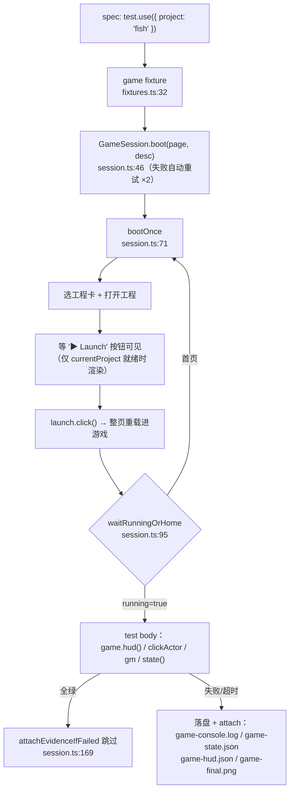

# E2E 回归框架（e2e Framework）

> **一句话定位**：`e2e/` 下所有项目共用的 Playwright 端到端回归框架——一条 `npm run test:e2e` 从「编辑器首页」自动引导到「任意已注册项目的游戏运行中」，用通用 `ai.*` 事件断言，失败自动落盘游戏运行时证据（控制台日志/GameState/HUD/截图）。
>
> **什么时候会用到你**：给新项目补 e2e 时；改了 gameplay/HUD 要回归验证时；排查「e2e 挂在引导路径」时；要给日志自愈喂结构化失败报告时。
>
> 代码位置：`e2e/framework/`（框架本体）+ `e2e/<项目>/*.spec.ts`（用例，一项目一文件夹）+ `playwright.e2e.config.ts`（配置）

---

## 1. 先记住这几个文件

| 文件 | 一句话职责 | 你要改它的场景 |
|---|---|---|
| [session.ts](../../e2e/framework/session.ts) | `GameSession`：引导（boot）+ 查询/操作包装 + 失败自动取证 | 改引导路径、加失败证据类型 |
| [ai.ts](../../e2e/framework/ai.ts) | `window.__ai` 事件桥封装：emit/断言辅助/点击冷却 | 新增一种 ai 事件的封装 |
| [projects.ts](../../e2e/framework/projects.ts) | 项目描述符注册表（新项目接入点） | **新项目接入框架时** |
| [fixtures.ts](../../e2e/framework/fixtures.ts) | 对外入口：`test`/`expect` + `game` fixture（自动 boot + 取证） | 加新的 fixture 选项 |

**关键心智模型**：框架断言**只走通用 `ai.*` 事件**（`ai.getState`/`ai.getHUD`/`ai.clickActor`/`ai.gmCommand`），不 import 任何引擎代码、不碰项目私有调试桥——所以 fish 的用例和 warm 的用例跑在同一个框架上，新项目零适配。与 warm 老 spec（直接 import `@playwright/test` + 摸 `window.__warmCurrent` 私有桥）的分工见 [playwright_testing.md](./playwright_testing.md)。

---

## 2. 一条用例怎么跑完：从 spec 到证据落盘



### 2.1 spec 侧：两行接入

```ts
// e2e/fish/smoke.spec.ts（每个项目一个文件夹）
import { test, expect } from '../framework/fixtures'

test.use({ project: 'fish' })

test('主菜单 → 开始游戏 → 基地 HUD 完整', async ({ game }) => {
  const startButtons = await game.findHUD((n) => n.name === 'StartButton')
  expect(startButtons.length).toBeGreaterThan(0)
  await game.clickActor({ name: 'StartButton' }, 30_000)
  await game.waitHUD((n) => n.name === 'Btn_build', 30_000)
})
```

讲解：`game` fixture 在用例开始前已把页面带到「游戏运行中」，用例体只写业务步骤。`game` 的方法在每次查询时顺手缓存 `lastState`/`lastHudRoots`——失败取证时现采失败就退回缓存。

### 2.2 引导路径的三个坑（都踩过，代码里已防）

**① 启动按钮绝不能用 `hasText: '▶'` 定位**。大纲折叠箭头（Outline.tsx:52）、agent 面板箭头（ToolCard.tsx:68）全是 '▶'，`.first()` 是 DOM 序赌博——实测同一段代码一次通过、一次挂 2 分钟。正确定位是 MenuBar 的启动按钮，可访问名唯一且自带"工程就绪"语义：

```tsx
// src/components/MenuBar.tsx:179-186
{currentProject && (
  <button ... onClick={() => gameState.running ? stopGame() : launchGame()}>
    {gameState.running ? '■ Stop' : '▶ Launch'}
  </button>
)}
```

讲解：按钮仅在 `currentProject` 就绪时渲染，所以 `getByRole('button', { name: '▶ Launch' })` 等到它可见 = 工程一定打开成功，一步双查。

**② Launch 点击会触发整页重载，浏览器模式可能被打回首页**。浏览器调试模式下 `window.electronAPI` 是 Mock 假实现（内存缓存不落盘），若重载早于工程状态持久化，页面回到首页。所以 boot 是「尝试循环 ×2」：`waitRunningOrHome` 同时盯两个信号——`ai.getState.running === true` 或「打开工程」按钮重新可见（回家信号），后者立即抛错进重试，不干等超时。

**③ `page.evaluate` 的字符串按纯 JS 求值**，不过 TS 转译——字符串里写 `(window as unknown as ...)` 直接 `SyntaxError: Unexpected identifier 'as'`。要 TS 类型就传函数（Playwright 转译测试文件后函数已是 JS），要传字符串就写纯 JS。框架约定：**`ai.ts` 统一用 JSON 内联字符串**（函数参数序列化在部分工具链不稳），`waitForFunction` 用函数形式。

### 2.3 运行时回执的三种形状（断言别想当然）

同是 `ai.*` 事件，回执形状有三种（实测自 `registerBuiltinAIHandlers.ts`）：

| 事件 | results[0] 形状 | 源码证据 |
|---|---|---|
| `ai.getState` | 裸快照 `AIGameStateSnapshot` | 直接 return 快照对象 |
| `ai.getHUD` | `{ ok, error?, hud: HUDNode[] }` — **数组，多根可能** | `return { ok: true, hud: hudTree }`（registerBuiltinAIHandlers.ts:963） |
| `ai.getSceneOutline` | `{ ok, error?, outline: SceneOutlineNode[] }` | `return { ok: true, outline }`（registerBuiltinAIHandlers.ts:1011） |
| `ai.gmCommand` | `{ ok, message }` | registerGMBridge.ts:19-22 |

`firstResult`（ai.ts:33）统一处理三种静默失败：事件未注册（`handled:false`）、处理器抛异常（`results[0]` 为 `undefined`）、`ok:false` 业务失败——都抛可读错误，**断言永不断言一个恒真的回执对象**。

### 2.4 失败取证：自愈循环的证据源

```ts
// e2e/framework/session.ts:169 attachEvidenceIfFailed（节选）
if (testInfo.status !== 'failed' && testInfo.status !== 'timedOut') return
// ① game-console.log —— ConsoleCollector 自 boot 起的页面控制台环形缓冲（800 行）
// ② game-state.json —— 现采失败退回最后一次成功查询的缓存
// ③ game-hud.json  —— 全部 UI 根 Actor 树
// ④ game-final.png —— teardown 时补拍（Playwright 自带截图是失败瞬间）
```

讲解：每份证据独立 try/catch——页面崩了也要把已收集的写出去。证据通过 `testInfo.attach` 进 HTML 报告 + 落在 `test-results/e2e/<spec>/attachments/`，agent 读 JSON 报告（`test-results/e2e-report.json`）即可定位失败，不用人开 devtools。

---

## 3. 新项目接入：三步

1. 在 `src/projects/<项目>/register.ts` 确认 `ProjectModule.name`（编辑器工程卡显示名，如 fish 的 `'ClashMaster'`）；
2. 在 [projects.ts](../../e2e/framework/projects.ts) 的 `PROJECTS` 加一条 `{ id, cardName, description }`；
3. 建项目文件夹 `e2e/<项目>/`，写 `<场景>.spec.ts`：`test.use({ project: '<id>' })`，用 `game.*` 写冒烟链路。

不需要暴露任何项目私有调试桥。临时用例也可以在 spec 里 `registerProject()` 内联注册，不动公共表。

---

## 4. 关键方法速查

| 方法 | 位置 | 干什么 | 注意 |
|---|---|---|---|
| `GameSession.boot` | session.ts:46 | 引导到游戏运行中，失败自动重试 ×2 | 每次 attempt 独立 goto('/') |
| `bootOnce` | session.ts:71 | 选卡→打开工程→等 Launch→点击 | 等 Launch 可见 = 工程就绪 |
| `waitRunningOrHome` | session.ts:95 | 轮询 running / 回家信号 | 字符串 evaluate 禁 TS 语法 |
| `attachEvidenceIfFailed` | session.ts:169 | 失败落盘四件套 | 只在 failed/timedOut 时动手 |
| `emitAI` | ai.ts:26 | 同步调 ai 事件拿聚合回执 | JSON 内联，禁函数参数序列化 |
| `firstResult` | ai.ts:33 | 取 results[0] + 三种静默失败转可读错误 | 恒真断言的天敌 |
| `getHUDRoots` | ai.ts:68 | HUD 全部根 Actor | 返回是数组不是单节点 |
| `clickActor` | ai.ts:103 | 带轮询重试的点击 | 成功后等 600ms 吸收点击冷却 |
| `PROJECTS` / `getProject` | projects.ts:10 / :27 | 项目注册表 / 按 id 取描述符 | 新项目接入点 |
| `test.extend` | fixtures.ts:32 | `game` fixture + `project` 选项 | spec 一律从这里 import test/expect |

## 5. 流程影响：牵动哪些功能

### 上游：谁驱动它

| 上游 | 怎么驱动 | 相关文档 |
|---|---|---|
| `npm run test:e2e` / `test:e2e:fish` / `test:e2e:warm` | Playwright CLI 入口（package.json scripts） | [playwright_testing.md](./playwright_testing.md) |
| Vite dev server（:5173+） | 页面提供方；多实例端口递增用 `E2E_BASE_URL` 指路 | [playwright_commands.md](./playwright_commands.md) |
| AI 事件系统 | 框架所有断言/操作的执行层 | [../engine/ai_system.md](../engine/ai_system.md) |
| GM 命令系统 | `game.gm()` 做测试置位（加钱/跳关） | [../engine/gm_system.md](../engine/gm_system.md) |

### 下游：它波及谁

| 下游功能 | 波及点 | 相关文档 |
|---|---|---|
| 项目 e2e 用例 | fish 已有 smoke；warm 老 spec（`e2e/warm/`）同 config 共存，可逐步迁移 | [../../e2e/fish/smoke.spec.ts](../../e2e/fish/smoke.spec.ts) |
| 日志自愈（规划中） | `e2e-report.json` + 失败四件套是自愈循环的机器可读证据 | 本文档 §2.4 |
| 编辑器重启/MCP | 框架跑在独立 headless 浏览器，不干扰 Electron 编辑器实例 | [../editor/integration/electron_main_ipc.md](../editor/integration/electron_main_ipc.md) |

## 6. 踩坑清单（都是真踩过的）

**1. `'▶'` 定位启动按钮，一次通过一次挂死 2 分钟** —— 大纲折叠箭头、agent 面板箭头都是 '▶'，`.first()` 依赖 DOM 序。规则：用 `getByRole('button', { name: '▶ Launch' })`，可访问名唯一。

**2. Launch 后偶发被打回首页** —— 浏览器模式工程状态不持久（Mock 只写内存），整页重载若早于持久化就回首页。规则：`waitRunningOrHome` 双信号轮询，回家立即整轮重试（boot ×2），不干等超时。

**3. `page.evaluate` 字符串里写 TS 断言直接 SyntaxError** —— 字符串求值不走转译。规则：字符串只写纯 JS；带类型的逻辑用函数形式（测试文件整体转译后函数已是 JS）。

**4. getHUD 断言恒空** —— 实测回执是 `{ ok, hud: HUDNode[] }` 包一层且是**数组**，不是 AIEvents.ts 注释暗示的单根对象。规则：运行时形状以 `registerBuiltinAIHandlers.ts` 的 return 为准，框架类型只从那里抄。

**5. back-to-back 点击被吞** —— ClickComponent.clickCooldown=500ms，连点被冷却吃掉。规则：`clickActor` 成功后固定等 600ms；相邻点击不要塞进同一个 evaluate 原子执行。

## 7. 边界条件

| 条件 | 行为 | 怎么应对 |
|---|---|---|
| dev server 未启动 | 用例在 goto 时报连接失败 | 先 `npm run dev`；多实例端口用 `E2E_BASE_URL` |
| 项目未注册 | `getProject` 抛可读错误 | projects.ts 登记（§3 三步） |
| 游戏未运行时调 ai 查询 | 处理器返回 `{ ok:false, error:'游戏未运行' }` | `firstResult`/`getHUDRoots` 抛可读错误 |
| 处理器内部抛异常 | `results[0]` 为 undefined，不抛 | `firstResult` 转 `可读错误`，证据在 game-console.log |
| boot 双尝试仍失败 | 抛最后一次错误，报告含截图+trace+四件套 | 看 error-context.md 页面快照定位 |
| 用例失败但页面已崩溃 | 取证逐步 try/catch，已有内容照常落盘 | game-console.log 总能拿到 |
| 运行时改动 ai 事件回执形状 | 框架 firstResult 报错而非静默错断言 | 同步改 ai.ts 的类型镜像（types.ts） |
