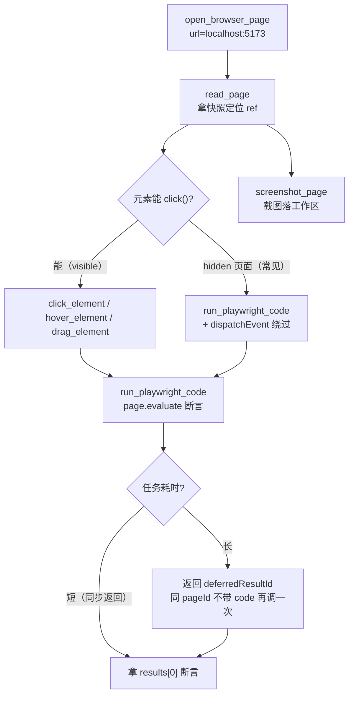

# Playwright 命令速查（VS Code 内置浏览器）

> **一句话定位**：这是 DemoStudio **浏览器端调试的默认入口**——用 VS Code 内置 Playwright 浏览器工具（`open_browser_page` / `read_page` / `click_element` / `screenshot_page` / `run_playwright_code`）操作 `http://localhost:5173/`，不干扰 Electron 窗口，产物落在工作区内。
>
> **什么时候会用到你**：改完编辑器 UI 要快速验证（按钮/页签/面板是否按预期）；要跑一遍「打开工程 → 启动游戏 → 断言状态」的端到端流程；需要自己读截图与快照；CDP `:9222` 连不上要换一条不受影响的链路。
>
> 代码位置：`src/editor/MockElectronAPI.ts`（浏览器模式的假实现）、`src/App.tsx`（页面入口）

**分工**：本文档只讲 **VS Code 内置浏览器**。本地 Chrome + CDP `:9222` 那套归 [playwright_mcp_commands.md](./playwright_mcp_commands.md)，方法论与用例组织归 [playwright_testing.md](./playwright_testing.md)。三篇打开的是同一个 Vite 页面，页面内调试桥与绝大多数踩坑通用，差异只在**浏览器怎么起、元素怎么点、产物落在哪**。

---

## 1. 先记住这几个文件

| 文件 | 一句话职责 | 你要改它的场景 |
|---|---|---|
| [MockElectronAPI.ts](../../src/editor/MockElectronAPI.ts) | 浏览器模式下 `window.electronAPI` 的降级实现（内存缓存，不落盘） | 某个 IPC 能力在浏览器里缺失或行为不一致 |
| [App.tsx](../../src/App.tsx) | 启动页工程卡片与「打开工程」按钮（调试第一个要点的东西） | 启动页/工程选择交互变了 |
| [EditorInitializer.ts](../../src/editor/EditorInitializer.ts) | 挂 `window.__ai` 调试桥（`:336`）+ 调 `installBlueprintWindowApi()`（`:414`） | 加一个新的页面内 AI 事件入口 |
| [windowApi.ts](../../src/editor/blueprintEdit/windowApi.ts) | 把 `BlueprintEditorService` 暴露成 `window.blueprintEditor`（`:38`） | 改蓝图编辑的页面内调用接口 |

**关键心智模型**：这条路径下 `window.electronAPI` 是 `MockElectronAPI` 注入的假实现，`readJsonFile` 返回深拷贝、`writeJsonFile` **只写内存不落盘**。所以浏览器里「保存成功」不等于磁盘变了，**任何落盘结论必须回 Electron 复验**。反过来，页面内的东西（`window.__ai` / `window.blueprintEditor` / React DOM）都是**真实例**，可以直接断言。

---

## 2. 一次操作怎么走通：从打开页面到验证结果

### 2.1 入口与地址

页面由 `npm run electron:dev` 拉起的 Vite dev server 提供。多实例时 Vite 与 MCP 端口各自递增、互不冲突：

```ts
// electron/main.ts:143-144
// 多实例时 Vite 自动递增端口：5173 → 5174 → ...）
const VITE_URL = process.env.VITE_DEV_SERVER_URL || 'http://localhost:5173'
```

```ts
// electron/main.ts:1650
const MCP_API_PORT_START = 9877
```

讲解：Vite 端口（5173+）与 MCP 端口（9877+）是两条独立递增序列，别拿 MCP 端口号去猜页面端口。开页面前先确认实际端口，`Get-NetTCPConnection -LocalPort 5173` 有结果才说明 dev server 在跑。

`main.tsx` 在渲染前注入 Mock，这是浏览器模式一切「假能力」的起点：

```tsx
import { injectMockElectronAPI } from './editor/MockElectronAPI'

// ─── 浏览器调试模式：注入 Mock Electron API（仅在 electronAPI 不可用时生效）───
injectMockElectronAPI()

ReactDOM.createRoot(document.getElementById('root')!).render(
  <React.StrictMode>
    <App />
  </React.StrictMode>
)
```

讲解：`injectMockElectronAPI()` 内部是 `if (window.electronAPI) return`，所以 Electron 窗口里它什么都不做；浏览器里没有 preload，才会把整套 Mock 挂上。判断当前是哪种模式，直接在页面里看 `getAppInfo().platform`——返回 `'browser'` 就是 Mock 模式。

### 2.2 命令组合链路



逐段讲这四个阶段：

**① 打开页面** —— `open_browser_page` 传 `url`，返回 `pageId`，后续所有命令都靠它认页面。第二次调同一 URL 用 `forceNew` 决定是否新开，调试时保持同一 `pageId` 才能复用已打开工程的状态。

**② 定位元素** —— `read_page` 返回带 `ref` 编号的快照，`click_element` 直接吃 `ref`。页面很大时快照会写成临时文件，用 `read_file` 读回。定位不准时用 `run_playwright_code` 自己查，比猜 ref 可靠：

```js
await page.evaluate(() => Array.from(document.querySelectorAll('canvas'))
  .map(c => { const r = c.getBoundingClientRect(); return { w: r.width, h: r.height, x: r.x, y: r.y } }))
```

讲解：视口 canvas 没有稳定 id，是按 `getBoundingClientRect()` 反查的——宽高大于 100 的那个通常是编辑器视口。盲猜 `ref` 在 HMR 后必然失效，这个函数每次实时算。

**③ 操作** —— hidden 页面 `click()` 必超时，一律走 `dispatchEvent`（这是本路径最硬的一条规则）：

```js
await el.dispatchEvent('click', { bubbles: true })       // 单击
await el.dispatchEvent('dblclick', { bubbles: true })    // 双击（工程卡片/资产行走这条）
```

讲解：`bubbles: true` 不是可选项——React 17+ 把合成事件监听挂在 root 容器上，事件不冒泡就到不了 React 的处理器，表现为「dispatch 了但什么都没发生」。`page.mouse.click` 的真实坐标点击在 hidden 页面同样不可靠，不要用它碰 React 按钮。

**④ 验证** —— 断言优先读页面内调试桥或 DOM，而不是像素。回执结构由 `AIModule.emit` 决定：

```ts
// src/engine/ai/AIModule.ts:147-170（节选）
emit(event: string, payload: unknown = undefined): AIEmitResult {
  const list = this.handlers.get(event)
  if (!list || list.length === 0) {
    logger.warn(`[AIModule] 事件 "${event}" 无处理器（未注册？），已忽略`)
    return { event, handled: false, results: [] }
  }
  const results: unknown[] = []
  for (const handler of list) {
    try {
      results.push(handler(payload, ctx))
    } catch (err) {
      results.push(undefined)
    }
  }
  return { event, handled: true, results }
}
```

讲解：**数据在 `results[0]`，不是返回值本身**；处理器抛异常时 `results[0]` 是 `undefined` 且不抛；事件未注册时 `handled: false` 而 `results` 为空数组。三种失败都不抛错，所以断言必须写成 `res?.results?.[0]?.ok === true`，把回执当真值会**恒真**。

### 2.3 浏览器模式的能力边界

`MockElectronAPI` 里凡是「涉及真实文件系统或跨进程」的能力都是假的，`readJsonFile` / `writeJsonFile` 这对最能说明问题：

```ts
readJsonFile: async (relativePath: string) => {
  // 深拷贝返回，模拟真实 Electron IPC 序列化（防止调用方原地修改污染内存缓存）
  const clone = (v: unknown) => JSON.parse(JSON.stringify(v)) as unknown
  if (jsonCache.has(relativePath)) {
    return { success: true, data: clone(jsonCache.get(relativePath)) }
  }
  ...
  return { success: false, error: `Mock: file not found: ${relativePath}` }
},

writeJsonFile: async (relativePath: string, data: unknown) => {
  if (typeof relativePath !== 'string' || !relativePath) {
    return { success: false, error: 'relativePath 必须是非空字符串' }
  }
  jsonCache.set(relativePath, data)
  console.log(`[Mock] writeJsonFile: ${relativePath}（仅写入内存缓存）`)
  return { success: true }
},
```

（`MockElectronAPI.ts:203` / `:229`）讲解：数据来自构建期 `import.meta.glob` 预加载的 `jsonCache`，命中不到才 `fetch` 兜底。`writeJsonFile` 只是 `jsonCache.set(...)` 然后**返回 `{ success: true }`**——返回成功但磁盘没动，这正是「保存了却没生效」的根源。深拷贝是为了模拟 IPC 序列化，所以**改返回值不会影响页面后续读到的内容**，必须回写。

能力差异表（`MockElectronAPI.ts` 行号为据）：

| 能力 | 浏览器模式（Mock） | Electron 模式 |
|---|---|---|
| `readJsonFile`（`:203`） | 读内存缓存，返回**深拷贝**；未命中才 fetch | 真读盘 |
| `writeJsonFile`（`:229`） | **只写内存，不落盘**，仍返 `{success:true}` | 真写盘 |
| `writeTextFile`（`:239`） | 只写 `textCache`，不落盘 | 真写盘 |
| `readTextFile`（`:318`） | 走 `?raw` glob loader；**`.html` 不走 fetch 兜底** | 真读盘 |
| `watchProjectAssets`（`:272`） | 恒返 `{ ok: false }` | 真文件监听 |
| `onAssetChanged`（`:274`） | 空实现，**永不触发** | 真回调 |
| `onSrcChanged` | 空实现，永不触发 | 真回调 |
| `createProject`（`:197`） | 不建文件，直接返 `{ success: true }` | 真建目录 |
| `readLogFile`（`:181`） | 返回三条固定中性启动日志 | 读真实 `logs/console_*.log` |
| `startGameLog` / `stopGameLog`（`:168`） | 只 `console.log`，无文件 | 真写游戏日志 |
| `onMCPCommand`（`:156`） / `forwardAgentLog`（`:360`） | 空实现，浏览器收不到 MCP 转发 | 真 IPC |
| `discoverProjectsScan`（`:253`） / `listProjectAssets`（`:257`） | 从 glob keys 推导，**真实可用** | 真扫描 |
| DSH 相关方法 | 不提供，`AgentService` 回退 `fetch('/api/...')`（Vite 代理到 :3080） | 真 IPC |

讲解：只有**只读的列举类**能力（`discoverProjectsScan`、`listProjectAssets`）在浏览器里可信，因为它们的数据源和 Electron 一样是磁盘上的工程目录，只不过经 glob 推导。凡是「写」和「监听」，浏览器里一律是空转。

---

## 3. 常见任务配方

### 3.1 打开页面

```js
open_browser_page({ url: 'http://localhost:5173/' })
```

判据：`read_page` 能看到 `.startup-overlay` 与 `.startup-title`（文本 `DemoStudio`）。看不到说明还在 `loading` 阶段（[LoadingScreen.tsx](../../src/components/LoadingScreen.tsx) 遮挡），等 1~2 秒再读。

### 3.2 打开工程

```js
// 方式 A：选中卡片 + 点「打开工程」按钮（等价真实用户操作，推荐）
await page.getByRole('button', { name: 'ClashMaster' }).first().dispatchEvent('click', { bubbles: true })
await page.getByRole('button', { name: '打开工程' }).dispatchEvent('click', { bubbles: true })
```

```jsx
// App.tsx:210-214（对照：卡片为什么不能只单击）
className={`startup-project-card ${selected === p.name ? 'selected' : ''}`}
role="button"
aria-label={p.name}
onClick={() => setSelected(p.name)}
onDoubleClick={() => selected === p.name && onSelect(p)}
```

讲解：`onClick` **只做选中**（`setSelected`），打开是 `onDoubleClick`，且要求 `selected === p.name`。所以单击卡片不会打开工程。方式 A 走两步绕开双击，比 `dispatchEvent('dblclick')` 更贴近真实交互。卡片文案是**显示名** `ClashMaster`（`src/projects/fish/project.json` 的 `name`），`fish` 只是 **folder 名**——启动页上没有 `fish` 卡片不是 bug，但资产路径仍用 `src/projects/fish/...`。

判据：`read_page` 快照中出现工程卡片选中态、且主界面标题变为已打开工程（`editor.getState` AI 事件已于 2026-09-03 移除，不能再作为判据）。

### 3.3 读编辑器状态

```js
// editor.getState AI 事件已移除（编辑器控制由 demostudio-editor MCP 的 CDP 工具承担）
// 编辑器状态改用 cdp_read / read_page 读 DOM 快照，或 cdp_evaluate 执行 JS：
const r = await page.evaluate(() => JSON.parse(localStorage.getItem('demostudio-editor-prefs') ?? '{}'))
// results: { panels, consoleVisible, layout, viewport, ... }（editorPrefsStore 的持久化快照）
```

讲解：编辑器结构化状态原本走 `window.__ai.emit('editor.getState')`，该事件移除后从 localStorage 持久化键 `demostudio-editor-prefs` 读（与 zustand persist 同源、实时更新）。游戏运行态仍可用 `window.__ai.emit('ai.getState', {})`。`consoleOutput` 类日志直接读 `logs/console_*.log`。

左侧面板页签也能直接点，三个按钮文案固定（`ProjectPanel.tsx:18-40`）：`大纲` / `资产` / `UI 大纲`。

### 3.4 切工程

```js
// editor.switchProject AI 事件已移除；用启动页交互或 MCP start_game {project}
await page.getByRole('button', { name: 'ClashMaster' }).first().dispatchEvent('click', { bubbles: true })
await page.getByRole('button', { name: '打开工程' }).dispatchEvent('click', { bubbles: true })
```

讲解：参数是 `folder` 不是显示名（启动页卡片显示 `ClashMaster`）。切工程会触发 [Viewport.tsx](../../src/components/Viewport.tsx) 停止当前游戏并重载 defaultScene，别在断言中途切。

### 3.5 启停游戏

```js
await page.getByRole('button', { name: /Launch/ }).dispatchEvent('click', { bubbles: true })
await page.waitForTimeout(5000)   // 等 World 初始化完成
await page.getByRole('button', { name: /Stop/ }).dispatchEvent('click', { bubbles: true })
```

```jsx
// MenuBar.tsx:183-185（按钮文案随状态变）
onClick={() => gameState.running ? stopGame() : launchGame()}
{gameState.running ? '■ Stop' : '▶ Launch'}
```

讲解：按钮文案带 `▶` / `■` 符号，用正则 `/Launch/` 匹配更稳。启动后按钮翻成 `■ Stop`，**这个翻转本身就是最直接的判据**。`waitForTimeout(5000)` 是等 World 初始化的经验值，不等就断言会拿到空 Actor 树。注意按钮只在 `currentProject` 存在时渲染（`MenuBar.tsx:179`），没打开工程时找不到它。

### 3.6 触发控制台命令

控制台默认关闭（`editorPrefsStore.ts:42` `consoleVisible: false`），两步走：

```js
// ① 开控制台（editor.toggleConsole AI 事件已移除；用快捷键事件或 UI 入口）
await page.evaluate(() => window.dispatchEvent(new Event('shortcut-toggle-console')))
// ② 往 .console-input 输入命令并回车（Console.tsx:92-96，onKeyDown 里只认 Enter）
await page.locator('.console-input').fill('status')
await page.locator('.console-input').press('Enter')
```

讲解：命令由 `Console.tsx` 的 `handleCommand` 在 **Enter** 时触发，调 `executeCommand(cmd, ctx)`。已注册命令见 [ConsoleCommands.ts](../../src/editor/ConsoleCommands.ts:57)：`help` / `clear` / `echo` / `status` / `start_game` / `stop_game` / `toggle_game` / `ui.compile` / `ui.decompile`。未注册命令不报错，只输出 `未知命令: X。输入 help 查看可用命令。`

判据：`.console-output` 里出现 `> status` 与其输出行。要清空用命令 `clear`（`editor.clearConsole` 事件已移除）。

### 3.7 开资产预览

```js
// editor.openBlueprint AI 事件已移除；用编辑器 store 直调（与原事件处理器同逻辑）
const r = await page.evaluate(() => {
  const store = (window as any).__ZUSTAND_EDITOR_STORE // 无导出时可走 UI 双击资产树
  return null
})
// 推荐：走 UI——资产树展开目录后双击 .blueprint.json 卡片
await page.locator('[class*="asset-item"]', { hasText: 'xxx.blueprint' }).first().dispatchEvent('dblclick', { bubbles: true })
```

讲解：资产树要手动展开目录、双击路径不稳定。原 `editor.openBlueprint` / `editor.openScenePreview` 事件已于 2026-09-03 移除，目前没有等价的一键事件，只能走 UI 双击。

---

## 4. 命令速查表

| 命令 | 干什么 | 注意 |
|---|---|---|
| `open_browser_page` | 打开页面，返回 `pageId` | `url`；产物落工作区，AI 可读 |
| `read_page` | 页面快照（**读页面主力**） | 传 `pageId`；大快照写临时文件，用 `read_file` 读 |
| `screenshot_page` | 截图 | `pageId`、`selector`；hidden 页画面可能不更新 |
| `click_element` | 点击元素 | `ref`/`selector`；`dblClick: true`、`button: 'right'`；**hidden 页会超时** |
| `type_in_page` | 输入文本或按键 | `text` 或 `key: 'Enter'` |
| `hover_element` | 悬停 | `ref`/`selector` |
| `drag_element` | 拖 A 到 B | `fromRef` + `toRef`；hidden 页不可靠 |
| `navigate_page` | 导航/刷新 | `type: 'reload'/'url'`；改完代码用 `reload` |
| `run_playwright_code` | 执行任意 Playwright 代码（**交互与断言主力**） | `pageId` + `code`；长任务返 `deferredResultId`，**同 `pageId` 不带 `code`** 再调一次取结果 |

**页面内调试桥速查**（都从 `run_playwright_code` 里调）：

| 入口 | 位置 | 干什么 | 注意 |
|---|---|---|---|
| `window.__ai.emit(event, payload)` | `EditorInitializer.ts:336` | 发 AI 事件，页面内总入口 | 断言在 `results[0]`；失败也返回对象 |
| `window.__ai.listEvents()` | `EditorInitializer.ts:338` | 列出已注册事件名 | 编辑器卸载时 `delete window.__ai` |
| `window.blueprintEditor.read/apply/dispatch` | `windowApi.ts:41-45` | 蓝图读盘/编辑/统一入口 | 幂等安装，HMR 后仍是同一实例 |
| `ai.selectActor` / `ai.dragActor` | `EditorInitializer.ts:108` / `:142` | 按**名字**选中/拖动 Actor | 免坐标，等价 gizmo 操作 |
| `ai.clickActor` | `registerBuiltinAIHandlers.ts:304` | 按 `name`/`text`/`path` 触发点击 | 游戏运行时用；回执 `{ok, clicked, type}` |
| `ai.getActor` | `registerBuiltinAIHandlers.ts:476` | 查 Actor 详情 | `name` 是**构造时传入的 Actor 名**，不是类名 |
| `ai.getState` | `registerBuiltinAIHandlers.ts:279` | 查运行时状态 | 数据在 `results[0]` |
| `ai.getSceneOutline` | `registerBuiltinAIHandlers.ts:789` | 查场景大纲 | 后台节流时可能拿到陈旧结果 |
| `electronAPI.readJsonFile` / `writeJsonFile` | `MockElectronAPI.ts:203` / `:229` | 读（深拷贝）/写（内存） | 浏览器里写不落盘 |

---

## 5. 流程影响：牵动哪些功能

### 上游：谁驱动它

| 上游 | 怎么驱动 | 相关文档 |
|---|---|---|
| Vite dev server | 提供 `http://localhost:5173/` 页面；`vite.config.ts` 的 `server.watch` 让资产 JSON 参与监听 | [编辑器核心](../editor/core/core_system.md) |
| `EditorInitializer` | 挂 `window.__ai`、调 `installBlueprintWindowApi()` | [编辑器核心](../editor/core/core_system.md) |
| `MockElectronAPI` | 无 `window.electronAPI` 时注入，撑起浏览器模式 | [编辑器核心](../editor/core/core_system.md) |
| AI 事件系统 | `window.__ai.emit` 落到 `AIModule.emit` | [playwright_testing.md](./playwright_testing.md) |
| 蓝图编辑服务 | `window.blueprintEditor` 背后是 `BlueprintEditorService.dispatch` | [playwright_testing.md](./playwright_testing.md) |

### 下游：它波及谁

| 下游功能 | 波及点 | 相关文档 |
|---|---|---|
| 蓝图编辑与撤销 | `window.blueprintEditor.apply/dispatch` 改工作副本与撤销栈 | [playwright_testing.md](./playwright_testing.md) |
| 选择与变换 | `ai.selectActor` / `ai.dragActor` 复用其能力 | [playwright_testing.md](./playwright_testing.md) |
| 资产预览与检查 | 走 UI 双击资产树卡片开预览页签（原 `editor.openBlueprint` 事件已移除） | [playwright_testing.md](./playwright_testing.md) |
| React 全部面板 | 调试桥写 Zustand store，面板随之重渲染 | [playwright_testing.md](./playwright_testing.md) |
| MCP 集成 | `:9877` 的 `ai_event` 只转发给 Electron 窗口（`onMCPCommand` 在 Mock 里是空实现），浏览器收不到 | [MCP 集成](../editor/integration/mcp_integration.md) |
| 本地 Chrome + CDP 链路 | 与本文档是并行方案，页面内调试桥与踩坑通用 | [playwright_mcp_commands.md](./playwright_mcp_commands.md) |

---

## 6. 踩坑清单

**1. `click()` / `dblclick()` 超时** —— 现象：`locator.click: Timeout ... exceeded`。原因：集成浏览器页面 `visibilityState` 常为 `hidden`，Playwright 等「可见且稳定」永不满足。规则：**一律 `dispatchEvent('click'/'dblclick', { bubbles: true })`**，`bubbles: true` 不能省，否则 React 收不到。

**2. HMR 不重建已挂载实例** —— 现象：改了代码行为还是旧的，新 UI 节点不存在。原因：Vite HMR 只热更新模块，已挂载的 manager 实例不重建。规则：改完代码 → `navigate_page` 或 `page.reload()` → 重走全流程。

**3. 改代码导致调试桥行为突变** —— 现象：断言突然失效。原因：HMR 会重置 UndoManager 栈、workingCopies 与 `window.blueprintEditor` 引用。规则：**测试过程中不要改代码**，改完必 reload 重开。

**4. FPS 恒 0 / 渲染不动** —— 原因：hidden 页面 rAF 暂停，**环境限制不是 bug**，`bringToFront` 也无效。规则：断言用 DOM 与调试桥返回值，**不用像素与帧**。

**5. `evaluate` 返回 `deferredResultId`** —— 现象：「code has not finished executing」。原因：带 `await` 的长 evaluate 被异步化。规则：**同一 `pageId`、不带 `code`** 再调一次取结果。MCP 路径无此机制（`browser_evaluate` 超时直接刷页），那是 [playwright_mcp_commands.md](./playwright_mcp_commands.md) 的坑。

**6. 动态 `import('/src/...')` 拿不到页面实例** —— 现象：`getComponent(X)` 返回 null、`instanceof` 失败、manager `_instances.size === 0`。原因：Vite 转换后的模块 URL 带 `?t=<mtime>`，裸 import 不带 → ES 模块按完整 URL 缓存 → 两个类实例。规则：查运行时状态走 `window.blueprintEditor` / `window.__ai`；非要 import 就先 `fetch('/src/engine/xxx.ts')` 抠出带 `?t=` 的 import URL，用**完全相同的 URL** import。

**7. HMR 后静态状态「幽灵分裂」** —— 现象：`push` 执行了但 `depth` 不变。原因：模块热更新后新组件图 import 到 `?t=` 版本、旧代码持裸版本，类内 static 字段双份互不可见。规则：静态状态挂 `globalThis`，或改完必 reload。诊断「某方法是否真被调用」：在方法开头塞 `console.info(new Error().stack)`，日志里的模块 URL 是否含 `?t=` 直接暴露调用方属于哪个模块图。

**8. hidden 页 rAF 停 → troika `sync` 回调不触发** —— 现象：`await mesh.sync(cb)` 永久卡死，返回 `deferredResultId` 后轮询也拿不到。原因：troika 的 `sync` 挂 rAF 后通知。规则：**别等 sync 回调**，直接读 `mesh.textRenderInfo`（`caretPositions.length/4 === 文本字符数` 表示就绪）。

**9. 拖不动 gizmo** —— 原因有二：① 没先 `ai.selectActor` 选中（gizmo 才 attach）；② hidden 页 rAF 停摆 → `matrixWorld` 陈旧 → `gizmo.hitTest` 射线命中失败。规则：优先用 `ai.dragActor` 驱动；必须模拟拖拽时，先拿真实 manager 实例 → `mgr.scene.updateMatrixWorld(true)` + `mgr.gizmo.syncTransform()` → 投影坐标 → `canvas.dispatchEvent(new PointerEvent('pointerdown/move/up', ...))` 完整模拟。`setPointerCapture` 报错可忽略。

**10. React 受控输入改值不生效** —— 现象：native setter + 同步 blur 后 React state 未更新。规则：两条路——① `page.locator('input').nth(i).fill('5')` 触发 onChange，**等约 300ms 后再 blur**；② evaluate 里单次调 native setter 即可（实测左侧面板搜索框）：

```js
const s = Object.getOwnPropertyDescriptor(HTMLInputElement.prototype,'value').set
s.call(input,'词'); input.dispatchEvent(new Event('input',{bubbles:true}))
```

**11. 保存/加载「没生效」** —— 现象：浏览器里 `writeJsonFile` 返 `{success:true}`，磁盘没变。原因：`MockElectronAPI.ts:229` 只写 `jsonCache`。规则：**落盘结论必须回 Electron 复验**。反过来，直连 Electron 窗口时 `writeJsonFile` 是真 IPC 直接落盘，测试产生的文件必须当场清理。

**12. 文件监听在浏览器里完全失效** —— 现象：改了 `.scene.json`，页面不刷新。原因：`watchProjectAssets` 恒返 `{ok:false}`、`onAssetChanged` / `onSrcChanged` 是空实现（`MockElectronAPI.ts:272`）。规则：靠 `navigate_page` 手动 reload，不要指望监听。

**13. `ai.getActor` 的 `name` 不是 UI 树节点名** —— 现象：断言「节点叫 X」失败。原因：`findActorByName` 匹配的是 `a.name === name || a.root.name === name`（`registerBuiltinAIHandlers.ts:83-104`），`Actor` 的 `name` 是**构造时传入的名字**（`Actor.ts:36` `constructor(name = 'Actor')`），未显式传名的 Actor 拿到的就是 `'Actor'` 这类默认值，与资产里的节点名是两回事。规则：要看真实 UI 树名，切「UI 大纲」页签读 DOM，或用 `ai.getSceneOutline`。

**14. 打开工程卡片单击无效** —— 原因：卡片 `onClick` 仅选中（`App.tsx:213`），打开要 `onDoubleClick`。规则：走 §3.2 的「选中 + 点「打开工程」」两步。

**15. 启动页找不到 `fish` 卡片** —— 原因：`fish` 是 folder 名，显示名是 `ClashMaster`（`src/projects/fish/project.json` 的 `name`）。规则：卡片找 `ClashMaster`，资产路径仍用 `src/projects/fish/...`。

**16. 打开资产预览原有一键事件已移除** —— 规则：`editor.openBlueprint` 事件已于 2026-09-03 移除，走资产树双击卡片；双击路径不稳定时先展开目录再精准定位卡片文本。

**17. 捕获不到 console 日志** —— 现象：hook 装了但新日志收不到。原因：console hook 挂在旧实例闭包上，HMR 后新模块的 logger 输出绕过 hook。规则：**捕获不到不代表没打**，改看 `logs/console_*.log`。

**18. `ai.emit` 回执当真值恒真** —— 原因：`emit` 失败也返回对象，错误藏在 `results[0].error`；未注册事件是 `handled:false` + `results:[]`。规则：断言 `res?.results?.[0]?.ok === true`，并顺带查 `handled`。

**19. `__fishBattle.debugHit(sx,sy)` 只测 UI 层** —— 原因：它只查 `_uiClickables`（UI 相机射线），世界层点击不在其 targets 内。规则：**别用它断言 3D 命中**；世界层走 `PhySys`：拿真实单例（`ready===true`）→ `sys._camera.updateMatrixWorld()` → 手算投影 → `sys.raycastClick(sx,sy)` → 断言 `sys._pressedClickable?.owner.name` → 测完 `sys.raycastRelease()` 清理。

**20. 点击结果无日志可观察** —— 原因：`logger.debug`（如「房子被点击」）不进控制台。规则：断言点击用 `PhySys._pressedClickable`，**不用日志**。

**21. 不可见碰撞体射线打不中** —— 原因：`ClickableComponent.hitTest` **沿父链过滤 `visible=false` 目标**，而 `THREE.Raycaster` 本身不检查 visible。规则：不可见点击区让 mesh 保持 `visible`、用 `colorWrite:false` 材质（不写颜色）+ 可选 `depthWrite:false`，**不要 `setVisible(false)`**。

**22. `executeGM('xxx')` 无效果不报错** —— 原因：GM 命令未注册时静默返 `{ok:false}`。规则：回城等流程直接调 GameInstance 公共方法 `returnToBase()`。

**23. 阶段敏感 UI 用例时灵时不灵** —— 原因：`getAllUIActors` 是**累计集合**，场景切换后旧 HUD 树残留且同名，`findActorByName` 会命中旧树按钮。规则：显隐断言改走 GameMode 广播通道；用例开头防御性 `returnToBase()` + 断言 `_phase==='base'`。

**24. 浏览器实例收不到 MCP `ai_event`** —— 原因：MCP `:9877` 的 `ai_event` 经主进程**只转发给 Electron mainWindow**，且 Mock 的 `onMCPCommand` 是空实现；浏览器与 Electron 是两个世界。规则：浏览器里用 `window.__ai`。

**25. 根目录 vitest 测 `src/engine` 冷启动报 `Class extends value undefined`（HUD.ts:16）** —— 原因：引擎存在循环依赖 `Actor → ActorUtils → GameInstance → … → World → UIManager → HUD → Actor`，HUD 在模块求值期就要用 Actor；Vite 构建靠 HMR 容忍，vitest+jsdom 冷启动直接炸。规则：测试文件里 `vi.mock('../src/engine/gameflow/ActorUtils', …)` + `vi.mock('../src/engine/physics/PhySys', …)`，**必须在 import 引擎模块之前**；别从 `../src/engine` 桶导入，改引具体模块文件。别名打桩（`resolve.alias`）实测**不生效**。

**26. 引擎测试构造 UI Actor 收集不到受控渲染对象** —— 原因：`UIMaskComponent.install()` 的 `collectRenderObjects` 只认 `CanvasUIComponent.panel`/`renderObjects`，裸 `THREE.Object3D` 收不进去。规则：测试里子 Actor 必须挂真实 `CanvasUIComponent`（`markerOnly: false`）。

**27. hidden 页面用像素截图验证渲染结果不可靠** —— 原因：rAF 停摆导致画面不更新。规则：改**数值断言**——拿真实 manager 实例 + 相机参数，在 evaluate 里复现换算公式，对比不同相机状态下的计算结果。

**28. 拿 UIPreviewManager 真实实例（fiber 桥）** —— 规则：找 `getBoundingClientRect().width > 100` 的 canvas → 沿 `parentElement` 找 `__reactFiber$` 键 → 沿 `return` 遍历 fiber，在 `memoizedState` 链里找 `{ current: { renderer, camera } }` 的 ref → `.current` 即 manager（含 `scene/camera/renderer/_rootActor`）。

**29. `evaluate` 里调页面对象方法崩 `instanceof is not an object`** —— 原因：测试函数经 `new Function` 序列化执行，页面内对象的方法（如 `getComponents()`）内部 instanceof 测的是 **realm 的类**必崩。规则：改读私有字段（如 `_components`）+ 包 try/catch。

**30. 运行时 CodeLint 无法从日志确认归零** —— 原因：E2E 页面停在首页时 CodeLint 只打「无工程」。规则：探针——`import('/src/stores/useCodeLintStore.ts')` + `import('/src/editor/codeLint/CodeLintEngine.ts')` → `codeLintEngine.scan('fish')` → 读 `getState().issues`（0 即归零）。

**31. PowerShell 写 JSON 带 BOM** —— 原因：`Set-Content -Encoding UTF8` 会写 BOM，`JSON.parse` 直接失败。规则：用 `[IO.File]::WriteAllText(path, text, (New-Object Text.UTF8Encoding($false)))`。

**32. Vite dev `fetch('/xxx.html?raw')` 返回的不是纯文本** —— 原因：dev server 对 `.html` 请求注入 react-refresh 前导码返回模块包装。规则：Mock 的 `readTextFile`（`MockElectronAPI.ts:318`）已按此实现——`.html` 只走 `import.meta.glob(..., { query: '?raw' })` 的 loader，**fetch 兜底显式排除 `.html`**。

**33. 文档断链检测脚本会误报示例代码里的 `.md` 链接** —— 原因：示例代码常含 `.md` 链接占位，不剥离代码块会被当成真实断链。规则：校验脚本**先剥离 ``` 围栏**再检测。PowerShell 里反引号是转义符，正则用字符类 `` [`] `` 或 `[char]96` 表示。

**34. `edit_file` 报 `panic recovered` 时改动未落盘** —— 现象：整文件重写 `.widget.html` 时工具返回 `panic recovered`，回读仍是原文。原因：该工具在整文件大段替换场景不稳定。规则：**不要重试同一工具**，改用 `write_to_file` 整文件写入，写完必须 `read_file` 回读确认。

**35. UI 几何校验的换算基准要看父级** —— 现象：把 widget.json 的 `UITransformComponent.position` 一律按「画布中心 ± 半宽」换算，结果与预期差几百 px，误判成漂移。原因：`position` 是**相对父容器内容原点**的偏移，只有根节点才是画布基准。规则：先递归 `find(node, name)` 找到节点并**确认其父容器**再选基准；校验「等间距」看相邻子项 position 的**差值**是否与 px 步进一致（1920px 画布 ↔ 9.6m，即 1px = 0.005m）。另注意 flex 容器不写显式 `width` 时会被撑满画布宽，从而被解算出 `bottom-right` 等锚点——需要精确落位的容器要给显式宽度。

**36. 选错浏览器调试路径** —— 现象：拿 MCP 的 `browser_*` 命令往内置路径套，或反之。规则：两套**并行**方案——VS Code 集成浏览器用本文件，本地 Chrome + CDP 见 [playwright_mcp_commands.md](./playwright_mcp_commands.md)。需要 AI **自己读截图/快照**时只能用本路径（MCP 沙箱目录在工作区外）。

**37. CDP `:9222` 有 LISTENING 但 HTTP 探测超时（假监听）** —— 原因：残留进程占着端口不放，`Invoke-RestMethod /json/version` 超时即中招。规则：不要硬试，**切本路径**（两套链路互不干扰），或先 kill 占用进程再重启 Chrome。

**38. `localhost:5173` 连接被拒但 Vite 在跑** —— 原因：Vite 有时只监听 IPv6 回环 `::1`，而 `localhost` 解析为 IPv4 `127.0.0.1`。规则：`netstat -ano | findstr :5173` 确认输出为 `[::1]:5173` 时，导航用 `http://[::1]:5173/`。

**39. `window.dispatchEvent(KeyboardEvent)` 打不开 GM 面板（G+M 无效）** —— 现象：evaluate 里合成 `keydown('g')→keydown('m')` 后 `getGM().consoleOpen` 仍 false。原因：游戏键盘管线挂在 `Viewport.tsx` 的 `viewportFocused` 条件下（`:404` `if (!viewportFocused) return`），合成事件既不改变聚焦状态也可能被前置 return 挡住。规则：**模拟游戏按键一律走 `window.__ai.emit('ai.keyPress', { key })`**（`registerBuiltinAIHandlers.ts:652` 直通 `inputSys.handleKeyDown`，绕过 DOM 聚焦），G+M 组合 = 先 emit `g` 再 emit `m`，`Escape` 关面板同理。

**40. 点击进入关卡后固定等 2.5s 仍读到旧阶段（误判点击无效）** —— 现象：向 StartButton 派发点击后等 2.5s 读 `_phase` 仍是 `menu`，连续换坐标重试；实际最后一击已生效，只是场景切换是**异步加载**（卸 HUD、建基地 Actor、装配相机），耗时超过固定等待。规则：**点击后不要固定等待，轮询断言直到状态翻转**（`ai.getState` 的 `phase` 从 menu → base/game，或 `__ai.emit('ai.clickActor')` 前后各读一次），超时再重试。另一个稳定做法：**点 UI 按钮优先用 `ai.clickActor`（按 name/text 定位，不依赖坐标换算）**——canvas 坐标点击要自己算世界→屏幕映射（HALF_W=4.8/HALF_H=2.7），偏 20px 就 miss；但注意阶段切换后原按钮已销毁，"未找到 Actor" 可能恰恰说明已切走。坐标点击也可用 MCP 的 `cdp_mouse_click`（Input.dispatchMouseEvent 原生点击）；2026-09-03 之前它调用报"未知工具"，根因是 `editor/mcp-cdp.mjs` 的 `cdpTools` 数组定义了该工具但 `handleCdpTool` switch 缺 case（落到 default 返回 null），已补全 mouse_click/mouse_move/key_press 三个 case——**改 `editor/mcp-*.mjs` 必须重启 MCP 服务才生效**（stdio 进程不热更）。

**41. 改 `.scene.json` 后运行时仍加载旧场景（stop/launch 无效）** —— 现象：编辑并保存场景 JSON 后 `stop_game`+`launchGame` 重启游戏实例，`SwitchToScene` 日志里 objects 数量还是旧的。原因：场景 JSON 经 `import.meta.glob(eager)` 在 **打开工程时一次性注册** 进 `AssetRegistry`（`editorStore.setCurrentProject → registerProjectAssets`，只跑一次）；Vite HMR 会更新 JSON 模块本身，但**不会重跑注册**，注册表 Map 里仍是旧引用。规则：改场景资产要看到运行时效果，**Reload 页面**（或重新走一次项目切换）再启动游戏；急验证可用热注入——CDP `import('/src/projects/fish/<项目>/asset/<场景>.scene.json?import&fresh=' + Date.now())` 拿新模块后 `AssetRegistry.registerAll({ scenes: [新场景] })`（按 name 覆盖 Map 项），再 launchGame。另注意：CDP `evaluate` 里动态 `import('/src/....json?import&t=' + Date.now())` 与页面模块图是**两个实例**（坑 7 同源），用带时间戳的模块只能做"数据验证"，别把它当页面真身。

---


## 7. 边界条件

| 条件 | 行为 | 怎么应对 |
|---|---|---|
| 页面 `visibilityState === 'hidden'` | `click()` 等 stable 必超时、rAF 停摆、FPS 0 | 一律 `dispatchEvent`；断言用 DOM/调试桥，不用像素与帧 |
| `window.electronAPI` 是 Mock | 写操作只入内存；`watchProjectAssets` 返 `{ok:false}`；`onAssetChanged` / `onSrcChanged` 永不触发 | 落盘结论回 Electron 复验；reload 代替监听 |
| 直连 Electron 窗口（非本路径） | `electronAPI` 是真 IPC，`writeJsonFile` 直接落盘 | 测试产生的文件当场清理 |
| `run_playwright_code` 长任务 | 返回 `deferredResultId` | 同 `pageId` 不带 `code` 再调一次 |
| 动态 `import('/src/...')` | 带 `?t=` 的模块裸 import 是独立实例 | 走 `window.__ai` / `window.blueprintEditor`，或 fetch 抠出带 `?t=` 的 URL |
| 改代码 / HMR | 不重建已挂载实例；静态状态呈双份 | 改完必 reload；测试过程中不改代码 |
| 编辑器卸载 | `delete window.__ai`（`EditorInitializer.ts:342`） | `window.__ai is undefined` 时先确认页面活着 |
| `ai.getActor` 返回的 `name` | 是 Actor 构造名，未显式命名时为默认值 | 切「UI 大纲」页签读 DOM，或用 `ai.getSceneOutline` |
| 工程卡片单击 | 仅选中（`setSelected`），不打开 | 选中 + 点「打开工程」，或 dblclick |
| 未打开工程时 | 启停按钮不渲染（`MenuBar.tsx:179`） | 先按 §3.2 打开工程 |
| 控制台默认关闭 | `consoleVisible: false`（`editorPrefsStore.ts:42`） | 先 `shortcut-toggle-console` 事件或点状态栏入口，再操作 `.console-input` |
| GM 命令未注册 | 静默返 `{ok:false}` | 直接调 GameInstance 公共方法 |
| MCP `:9877` 的 `ai_event` | 只转发给 Electron mainWindow | 浏览器实例内用 `window.__ai` |
| PowerShell 无 `tail` / `head` | 管道不支持 | 用 `Select-Object -Last N` / `-First N` |
| 需要 AI 自己读截图 | MCP 沙箱目录在工作区外 | 用本路径，产物落工作区内 |
