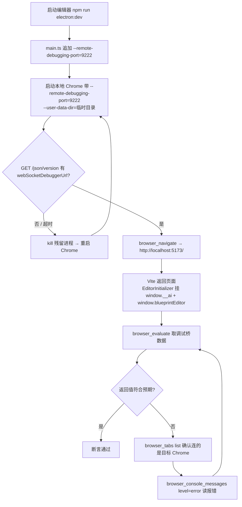

# Playwright MCP 调试（本地 Chrome + CDP `:9222`）

> **一句话定位**：用 `playwright` MCP server 的 `browser_*` 工具族，经 CDP `:9222` 接管**你自己的本地 Chrome** 去操作 `http://localhost:5173/`——它是**连接型**服务，不自己拉浏览器，所以必须先有人把调试端口开出来。
>
> **什么时候会用到你**：需要无障碍树快照（`browser_snapshot` / `browser_find`）做结构化断言；要用 `browser_console_messages` / `browser_network_requests` 这类页面级诊断；要在**带登录态/扩展的本地 Chrome** 里调试；或内置浏览器工具不可用而 CDP 能挂上。
>
> 代码位置：`electron/main.ts`（CDP 端口 + 反节流开关）、`editor/mcp-server.mjs`（MCP 工具表）、`editor/mcp-cdp.mjs`（CDP 通道实现）

适用范围：本文只覆盖 **② Playwright MCP + 本地 Chrome** 链路。另外两条是 [① VS Code 内置浏览器](./playwright_commands.md)（项目默认入口，产物落工作区）与 [③ 方法论/组织流程](./playwright_testing.md)。三条链路打开的是**同一个 Vite 页面**，页面内调试桥、编辑器通用流程、绝大多数踩坑**完全通用**，差异只在**浏览器怎么起、元素怎么点、产物落在哪**。

---

## 1. 先记住这几个文件

| 文件 | 一句话职责 | 你要改它的场景 |
|---|---|---|
| [main.ts](../../electron/main.ts) | 追加 `--remote-debugging-port=9222` + 三个反节流开关；决定 `VITE_URL` 与 MCP HTTP 端口 | 改调试端口 / 后台节流行为 / 端口分配 |
| [mcp-server.mjs](../../editor/mcp-server.mjs) | `demostudio` MCP server：stdio ↔ `:9877` HTTP，把 `cdp_*` 并进工具表 | 加 MCP 工具 / 改默认端口 |
| [mcp-cdp.mjs](../../editor/mcp-cdp.mjs) | 项目自带的 CDP 通道：`cdp_*` 工具 + `ensureBrowserWS`/`sendCdp` | 加/改一个 CDP 工具，排查连不上 |
| [EditorInitializer.ts](../../src/editor/EditorInitializer.ts) | 挂 `window.__ai` 调试桥 + 调 `installBlueprintWindowApi()` | 加一个新的页面内调试入口 / AI 事件 |

**关键心智模型（最容易搞混的一点）**：项目里有**两个都走 `:9222` 的 MCP 通道，别混为一谈**——

- **`playwright` MCP server**（本文主角）：平台侧注入，`browser_*` 工具族，连**本地 Chrome**。
- **`demostudio` MCP server**（`editor/mcp-server.mjs`）：项目自带，`cdp_*` 工具族，连 **Electron 编辑器窗口**。

端口都是 9222，但连的是**不同的浏览器进程**。用错的表现是"连上了但点的页面不是你想的那个"。判定方法：`cdp_list_tabs` 列出的 title 是 Electron 窗口，`browser_tabs list` 列出的才是本地 Chrome。

---

## 2. 一次 CDP 调试怎么打通：从启动到拿到值

### 2.1 端口从哪来

`9222` 不是 Playwright 的约定，而是 Electron 主进程在启动时**自己追加**的开关（[main.ts](../../electron/main.ts) `2170-2181`）：

```ts
// 仅在启动参数未显式指定调试端口时追加：外部调试工具（如 Playwright electron.launch 传
// --remote-debugging-port=0 走 pipe 模式）会自带该参数，无条件覆盖会与运行中实例的 9222
// 冲突（bind 失败 → devtools http server 起不来 → 调试链路瘫痪）
if (!app.commandLine.hasSwitch('remote-debugging-port')) {
  app.commandLine.appendSwitch('remote-debugging-port', '9222')
}

// 三开关对本进程所有 renderer（含 Playwright/CDP 连入的页面）生效
app.commandLine.appendSwitch('disable-renderer-backgrounding')
app.commandLine.appendSwitch('disable-backgrounding-occluded-windows')
app.commandLine.appendSwitch('disable-background-timer-throttling')
```

讲解三点：① `hasSwitch` 守卫是**必须的**——无条件覆盖会与已运行实例的 9222 抢 bind，devtools HTTP 起不来，两条 MCP 链路一起瘫。② 这三个反节流开关是 Electron **进程级**的，只对 Electron 窗口内的 renderer 生效；你用本地 Chrome 打开的标签页**不受它们保护**，所以后台 tab 仍会被节流（见 §6 坑 10）。③ 因为端口是 Electron 加的，**CDP 端点属于 Electron 进程，页面却是本地 Chrome 打开的**——这就是"两个 MCP 共用 9222 却连到不同进程"的根源。

页面 URL 与端口（[main.ts](../../electron/main.ts) `143-144`）：

```ts
// 多实例时 Vite 自动递增端口：5173 → 5174 → ...）
const VITE_URL = process.env.VITE_DEV_SERVER_URL || 'http://localhost:5173'
```

讲解：`vite.config.ts` 的 `server` 块**没有** `port` / `host` 配置（只有 `watch` 与 `/api` 代理），所以 5173 是 Vite 默认值、冲突时由 Vite 自动递增；`main.ts` 这行是 Electron 侧拿不到 `VITE_DEV_SERVER_URL` 时的兜底。多实例时**先查实际端口再导航**：

```powershell
netstat -ano | findstr :5173      # 确认 Vite 实际端口（LISTENING）
netstat -ano | findstr :9222      # 确认 CDP 端点（LISTENING）
Invoke-RestMethod -Uri 'http://127.0.0.1:9222/json/version' -TimeoutSec 5
```

讲解：`netstat` 的 `LISTENING` 只证明**有进程占了端口**，不证明 CDP 的 HTTP 服务还活着（假监听，见 §6 坑 2）。必须再用 `Invoke-RestMethod` 探 `/json/version`，返回体里**有 `webSocketDebuggerUrl`** 才算就绪——这正是 `ensureBrowserWS`（[mcp-cdp.mjs](../../editor/mcp-cdp.mjs)`44-52`）判活的依据。`-TimeoutSec 5` 不能省，否则假监听时会挂住很久。

编辑器本身也要在跑（MCP HTTP 端口 `9877+`，`MCP_API_PORT_START` 在 `main.ts:1650`，`findFreePort` 在 `main.ts:1738` 自动递增）：

```powershell
Invoke-RestMethod -Uri 'http://127.0.0.1:9877/api/status' -TimeoutSec 5
```

讲解：`/api/status` 路由在 `main.ts:1933`，`9877` 与 `5173` **各自独立递增、互不冲突**。多实例连非首实例时，给 `mcp-server.mjs` 显式传 `--port 9878`。

### 2.2 连接与导航链路



逐段讲链路上的三个关键动作：

**① 启动带 CDP 的 Chrome**（端口起不来，后面全是空谈）：

```powershell
$chrome = 'C:\Program Files\Google\Chrome\Application\chrome.exe'
$ud = Join-Path $env:TEMP 'ds-playwright-cdp'
New-Item -ItemType Directory -Force -Path $ud | Out-Null
Start-Process -FilePath $chrome -ArgumentList @(
  '--remote-debugging-port=9222',
  '--remote-debugging-address=127.0.0.1',
  "--user-data-dir=$ud",
  '--no-first-run',
  '--no-default-browser-check',
  'http://localhost:5173/'
) | Out-Null
```

讲解：`--user-data-dir` 用独立临时目录，**不影响你正在用的浏览器**（复用默认 profile 会被 Chrome 以"已在运行"为由拒绝挂调试端口）；`--remote-debugging-address=127.0.0.1` **不能省**——Chrome 默认只监听 IPv6，MCP 用 IPv4 连会 `ECONNREFUSED`（`mcp-cdp.mjs` 的 `getCdpHttpBase` 硬编码 `http://127.0.0.1:${port}`，见 `mcp-cdp.mjs:25`）；末尾带上目标 URL，起来就直接导航到编辑器。

**② 导航**：`browser_navigate` 传 `url: 'http://localhost:5173/'`。若上一节探测到 Vite 只监听 `[::1]`，改传 `http://[::1]:5173/`（见 §6 坑 19）。

**③ 取值**：`browser_evaluate` 的 `function` 参数是**字符串形式的箭头函数**，在页面上下文执行。

### 2.3 用 `browser_evaluate` 取值

```js
// browser_evaluate 的 function 参数
() => window.__ai.listEvents()
```

```js
// 发事件并取回结果
() => window.__ai.emit('editor.getState', {})
```

```jsonc
// 返回结构（断言数据在 results[0]，不是返回值本身）
{
  "event": "editor.getState",
  "handled": true,
  "results": [{
    "currentProject": { "name": "fish", "folder": "fish", "renderMode": "3d" },
    "gameState": { "running": false, "score": 0 },
    "activeTabId": null,
    "dynamicTabs": [],
    "consoleErrors": []
  }]
}
```

讲解三点：① `handled: false` + `results: []` 表示**事件名没注册**——先用 `listEvents()` 核对，常见错误是把 `ai.getState`（游戏运行时，`registerBuiltinAIHandlers.ts:279`，常量 `AI_EVENT_GET_STATE` 在 `AIEvents.ts:34`）和 `editor.getState`（编辑器 UI 快照，`EditorInitializer.ts:221`）搞混。② 返回体是 `AIModule.emit` 的原样结构（`AIModule.ts:149`），**处理器返回值一律进 `results` 数组**，断言要写 `results[0]`。③ `emit` 是**同步**的——异步事件（如 `ai.readJsonFile`）返回的是 Promise，evaluate 里要 `await`。

游戏运行时断言走 `ai.getState` / `ai.getActor` / `ai.getHUD` / `ai.getSceneOutline`（常量分别在 `AIEvents.ts:34/42/70/73`）：

```js
() => window.__ai.emit('ai.getState', {})
```

hidden 页面点击（绕过 `browser_click` 超时）：

```js
// browser_evaluate 的 function 参数
() => {
  const el = document.querySelector('[aria-label="Demo2D"].startup-project-card')
  if (!el) return { err: 'not found' }
  el.dispatchEvent(new MouseEvent('click', { bubbles: true }))
  return { dispatched: true }
}
```

讲解：`browser_click` 走 `Input.dispatchMouseEvent` 并等元素 `visible+stable`，hidden 页永不满足；`browser_evaluate` 直接派发 DOM 事件绕过稳定性等待。`bubbles: true` 保留是为了让 React root 上的合成事件处理器收到。

配套工具速查（定位与诊断）：

| 工具 | 干什么 | 注意 |
|---|---|---|
| `browser_snapshot` | 无障碍树快照，**定位元素首选**，`boxes: true` 带坐标 | AI 可直接消费，比截图可靠 |
| `browser_find` | 快照内搜文本，比整棵快照便宜 | 传 `text` 或 `regex` |
| `browser_console_messages` | 读控制台，`level: 'error'` 过滤报错 | 页面级诊断主力 |
| `browser_network_requests` | 网络请求列表 | 配合 `browser_network_request` 看详情 |
| `browser_tabs` | `list/new/close/select` 管标签页 | **用它确认连的是哪个 Chrome** |
| `browser_wait_for` | 等文本出现/消失/固定时长 | 动画期间元素未 `stable`，先等再点 |

---

## 3. 工具清单（`demostudio` MCP server）

`mcp-server.mjs` 的工具表 = 4 个编辑器命令 + `...cdpTools`（`mcp-server.mjs:130`）。所有命令经 `POST /api/command`（`main.ts:1751`）转给 Electron 主进程。

| 工具 | 参数 | 干什么 | 注意 |
|---|---|---|---|
| `ui_compile` | `asset`（必填） | 编译 `*.widget.html` → `.widget.json`，过 assetLint 零错误门槛后覆写并同步预览 | 错误里的 `line` 指向 **.widget.html** 源文件 |
| `get_scene_outline` | `project`（可选） | 当前场景 Actor 大纲树（3D + UI 层级） | 缺省=当前打开工程 |
| `get_ui_outline` | — | 运行中游戏的 UI Widget 大纲树 | **游戏必须在运行**，否则拿不到 |
| `get_assets` | `project`（可选） | 当前工程资产文件列表（path/ext/size） | 缺省=当前打开工程 |
| `cdp_click` | `selector`（必填）、`targetId` | 点 DOM 元素，支持 CSS / `text=` / XPath | selector 三种写法由 `EVALHelper` 的 `findEl` 解析 |
| `cdp_type` | `selector`（必填）、`text`、`mode`(fill/type/press)、`key`、`targetId` | 输入文字 / 按键 | `press` 模式看 `key`，不看 `text` |
| `cdp_read` | `selector`（必填）、`mode`(text/attr/value)、`attribute`、`targetId` | 读文本 / 属性 / 输入框值 | `attr` 模式必须带 `attribute` |
| `cdp_hover` | `selector`（必填）、`targetId` | 悬停（触发 hover/tooltip） | — |
| `cdp_evaluate` | `expression`（必填）、`targetId` | 页面内执行 JS 表达式 | `awaitPromise: true`，支持 async |
| `cdp_navigate` | `url`、`targetId` | 导航；**省略 `url` = 刷新当前页** | 刷页是清 `import.meta.glob` 缓存的唯一手段 |
| `cdp_wait` | `selector` / `text`、`timeoutMs`(默认 5000)、`targetId` | 等元素出现或文本出现 | 两个条件都不传会立刻返回 |
| `cdp_scroll` | `selector`、`deltaY`、`deltaX`、`targetId` | 滚动元素或整页 | 省略 `selector` 滚整页 |
| `cdp_screenshot` | `selector`、`targetId` | 截图，返回 **base64 内联 PNG** | **不受 MCP 沙箱路径限制**，比 `browser_take_screenshot` 实用 |
| `cdp_list_tabs` | `port`（默认 9222） | 列所有可控 tab（id/type/title/url） | **区分 Electron 窗口与本地 Chrome 的唯一手段** |
| `cdp_mouse_click` | `x`（必填）、`y`（必填）、`targetId` | 原生 `Input.dispatchMouseEvent` 坐标点击 | canvas / 无 DOM 元素场景用 |
| `cdp_mouse_move` | `x`（必填）、`y`（必填）、`targetId` | 鼠标移动 | — |
| `cdp_key_press` | `key`（必填）、`targetId` | 模拟按键（`Enter`/`Escape`/`Space`…） | — |

讲解：这张表里只有前 4 个是 `mcp-server.mjs` 自己实现的编辑器命令，其余 13 个 `cdp_*` 来自 [mcp-cdp.mjs](../../editor/mcp-cdp.mjs)`143-307`，由 `handleCdpTool`（`mcp-cdp.mjs:355`）统一分发，**默认端口 `args.port || 9222`**。

---

## 4. 页面里的调试钩子

| 钩子 | 位置（`文件:行号`） | 能拿什么 |
|---|---|---|
| `window.__ai` | [EditorInitializer.ts:336](../../src/editor/EditorInitializer.ts) | `emit(event, payload)` / `listEvents()`——**页面内唯一的 AI 事件总入口** |
| `window.blueprintEditor` | [windowApi.ts:41](../../src/editor/blueprintEdit/windowApi.ts)（安装点 [EditorInitializer.ts:413](../../src/editor/EditorInitializer.ts)） | `read` / `listTypes` / `apply` / `dispatch`——蓝图资产读改，与 Inspector 同一套实现 |
| `window.__fishBattle` | [FishGameInstance.ts:273](../../src/projects/fish/gameplay/FishGameInstance.ts)（安装点 `:177`） | 战斗调试桥，见下表 |
| `window.__mcp_findEl` | [mcp-cdp.mjs](../../editor/mcp-cdp.mjs) 的 `EVALHelper` | `cdp_*` 注入的选择器解析函数（CSS / `text=` / XPath） |

`window.__ai` 的真实定义（`EditorInitializer.ts:336-339`）：

```ts
// 浏览器调试入口（Playwright / 控制台验证用）：window.__ai.emit('ai.selectActor', { name })
;(window as any).__ai = {
  emit: (event: string, payload?: unknown) => ai.emit(event, payload),
  listEvents: () => ai.listEvents(),
}
```

讲解：清理函数里 `delete (window as any).__ai`（`EditorInitializer.ts:342`）——**编辑器卸载后这个桥会消失**，断言报 `window.__ai is undefined` 时先确认页面还活着，别急着改代码。

`window.__fishBattle` 的方法（[FishGameInstance.ts:273-365](../../src/projects/fish/gameplay/FishGameInstance.ts)，`fish` 项目专用）：

| 方法 | 能拿什么 |
|---|---|
| `probe()` | 运行时探针：`phase` / `levelId` / `hasController` / `controllerName` / `levelGameMode` / `worldGameMode` / `placeTroopId` / `phySysReady` / `viewportRect` |
| `getState()` | 当前阶段 / 关卡 / 资源 / 军队快照 |
| `getBattle()` | 战斗状态快照（建筑血量 / 掠夺 / 胜负） |
| `getTroops()` | 场上部队列表（`name` / `x` / `z`） |
| `getHealthBars()` / `getTroopHealthBars()` | 血条组件显隐状态 |
| `getTroopModels()` | 兵模型摘要（胶囊体断言） |
| `enterLevel(id)` | 直跳某关卡战斗场景 |
| `selectTroop(id)` / `getPlaceTroopId()` | 选兵种进入放置模式 / 读当前放置兵种 |
| `deploy(troopId,x,z)` / `gmSpawnTroop(troopId,x,z)` | 放兵（前者扣军队，后者不扣） |
| `addArmy(troopId,count)` | 绕过训练队列直接注入兵种 |
| `debugClick(sx,sy,button)` | 走 `InputSys.handlePointerDown` 全链路的模拟点击 |
| `debugHit(sx,sy)` | 手动射线命中测试，返回 UI 层命中结果 |
| `stepTicks(n)` | 同步推进 n × (1/30)s 游戏时间（上限 3000），**不受浏览器节流影响** |
| `startTickDriver()` / `stopTickDriver()` | rAF 被节流时用 `setInterval` 补偿驱动 tick |
| `executeGM(line)` / `getGM()` | 执行 GM 命令 / 读 GM 控制台状态 |

> `FishGameInstance.ts:548` 的启动日志只列了部分方法名，**以源码里的对象字面量为准**——`stepTicks` / `debugHit` / `getHealthBars` / `getTroopModels` / `getTroopHealthBars` / `getGM` 都不在那条日志里。

---

## 5. 流程影响：牵动哪些功能

### 上游：谁驱动它

| 上游 | 怎么驱动 | 相关文档 |
|---|---|---|
| Electron 主进程 | 追加 `--remote-debugging-port=9222` + 三个反节流开关，提供 CDP 端点 | [MCP 集成](../editor/integration/mcp_integration.md) |
| 本地 Chrome（你手动启动） | 提供被调试页面，必须带 `--remote-debugging-port=9222` | [MCP 集成](../editor/integration/mcp_integration.md) |
| Vite dev server | 提供 `http://localhost:5173/` 页面内容（多实例端口递增） | [方法论：环境限制](../testing/playwright_testing.md) |
| `editor/mcp-cdp.mjs` | 项目自带 `cdp_*` 工具经 9222 连 Electron 窗口 | [MCP 集成](../editor/integration/mcp_integration.md) |

### 下游：它波及谁

| 下游功能 | 波及点 | 相关文档 |
|---|---|---|
| AI 事件系统 | `browser_evaluate` 里的 `window.__ai.emit` 落到 `AIModule.emit`，改的是真实运行时状态 | [AI 事件系统](../engine/ai_system.md) |
| 蓝图编辑 | `window.blueprintEditor.apply` 会改工作副本与撤销栈 | [蓝图编辑](../editor/blueprint/blueprint_edit_system.md) |
| 资产预览与检查 | 改资产后必须整页 reload 才重求值（`import.meta.glob` 模块级缓存） | [资产预览与检查](../editor/asset/asset_preview_lint_system.md) |
| Agent 面板 | 点「Agent」开**独立子窗口**（`agent.html`），需 `browser_tabs` 切 tab | [Agent 面板](../editor/integration/agent_panel_system.md) |
| 内置浏览器链路 | 两条链路打开同一页面，页面内钩子与绝大多数踩坑通用，可整体切换 | [VS Code 内置浏览器](./playwright_commands.md) |
| 调试流程组织 | 先做什么后做什么、环境限制与真 bug 的区分 | [方法论](./playwright_testing.md) |

---

## 6. 踩坑清单（都是真踩过的）

**1. `ECONNREFUSED ::1:9222`** —— 没有任何浏览器开 CDP 端口，`playwright` MCP 是**连接型**，不自己拉浏览器。规则：按 §2.2 启动带 `--remote-debugging-port=9222` 的 Chrome。

**2. `connect ECONNREFUSED` 但 9222 有监听 / 假监听** —— 两个变体：① Chrome 只监听 IPv6、MCP 连 IPv4 → 加 `--remote-debugging-address=127.0.0.1`；② netstat 显示 `LISTENING` 但 `/json/version` 超时——**残留进程占着端口不放，CDP HTTP 服务已死**，症状是 `browser_*` 全部超时且无连接错误。规则：先 `-TimeoutSec 5` 探测确认；中招就 netstat 找 PID → kill → 重启；急用可切[内置浏览器路径](./playwright_commands.md)（两套链路互不干扰）。

**3. `browser_click` 超时 5000ms** —— 页面 `visibilityState === 'hidden'`，`browser_click` 等 `visible+stable` 永不满足。规则：改用 `browser_evaluate` + `dispatchEvent('click', { bubbles: true })`。

**4. hidden 页面 rAF 停摆** —— 实测 1 秒内 **0 帧**，FPS 恒 0，动画/渲染类断言失效。原因：hidden 页 rAF 暂停，非 bug。规则：断言用 DOM 与调试桥返回值，**不依赖像素与帧**。

**5. `browser_evaluate` 执行超时** —— 多步操作超时（默认 10s），超时后页面**被导航刷新**，工程打开状态与组件上下文全丢。原因：`browser_evaluate` **没有** `run_playwright_code` 的 `deferredResultId` 异步化机制，要么同步返回要么超时。规则：拆成多次短调用，或改用 `browser_run_code_unsafe`；超时后重走打开工程流程。

**6. 截图路径沙箱 `File access denied ... outside allowed roots`** —— 产物只能落 `C:\Users\<用户名>\background_agent_cli\.playwright-mcp\`。规则：不传 `filename` 用默认名；或改用 `cdp_screenshot`（返 base64 内联，不受限）。

**7. 截图生成了但 AI 读不了** —— 沙箱目录在**工作区外**，AI 读图/读文件工具被拒。规则：改用 `browser_snapshot` / `browser_find` 读文本结构；需要 AI 自己读图就切[内置浏览器路径](./playwright_commands.md)。

**8. 误以为 MCP 连的是 Vite 端口** —— `9222`（CDP）与 `5173`（Vite）是两回事：CDP 连**浏览器**，浏览器再去访问 5173。规则：两个端口各司其职，别互相替代。

**9. 混淆 `playwright` MCP 与 `demostudio` MCP** —— 两个 server 都走 `:9222`，前者连本地 Chrome（`browser_*`），后者连 Electron 窗口（`cdp_*`）。规则：用 `cdp_list_tabs` / `browser_tabs list` 看 title 与 URL 区分。

**10. 本地 Chrome 的后台 tab 里游戏"假死"** —— 日志/生成队列 45–70s 才动一次，`ai.clickActor` 报"未找到 Actor"。原因：Chrome 对后台页面 rAF 节流（约 1 帧/分钟），World tick 驱动的一切都被拖慢。规则：`browser_run_code_unsafe` 里 `page.bringToFront()` 前台化；或调 `__fishBattle.stepTicks(n)` 同步推时间。**注意**：Electron 窗口已配 `backgroundThrottling: false`（`main.ts:255`/`2129`）并追加三个反节流开关（`main.ts:2179-2181`），窗口隐藏/遮挡时 rAF 照常——本条只针对**本地 Chrome 里的后台 tab**。

**11. 改了 `.widget.json` 等资产后游戏行为没变** —— `import.meta.glob` 的资产注册是**模块级求值**，重启游戏不会重新读盘；`BlueprintRegistry.cache` 在同一会话内缓存 resolve 结果。规则：必须 `page.reload()` 整页刷新（顺带重置 Registry 缓存）。

**12. 场景大纲类断言拿不到建筑 Actor** —— 后台节流 + 旧注册缓存叠加，大纲结果不代表最新磁盘资产。规则：先 `bringToFront` + `reload` 再跑断言；大纲走 `ai.getSceneOutline` 事件。

**13. 页面内动态 `import('/src/xxx.ts')` 拿到的不是运行中实例** —— Vite dev 下页面代码经依赖图加载，动态 import 拿到**新求值的模块副本**，单例状态不共享。规则：读运行时状态走 `window.blueprintEditor` / `window.__ai`，**不要动态 import 模块**。

**14. HMR 后页面突然大量 `ReferenceError: xxx is not defined`** —— HMR 增量更新产生陈旧模块引用。规则：**整页 reload 后 0 报错**即确认为 HMR 假象；reload 后仍在才是真 bug。

**15. 浏览器 Mock 模式打开 widget 蓝图必报两条 error** —— `UIImageComponent/UITextComponent 工厂未消费属性 hitTest`。原因：资产带 `hitTest` 字段而组件工厂白名单未消费——**既有问题，与调试链路无关**。规则：忽略即可，勿误判为本次改动引入。

**16. Agent 面板不在当前页面内** —— `dshOpenAgentWindow` 创建**独立子窗口**（dev 加载 `${VITE_URL}/agent.html`），不是同页面切换；agent 是独立模块图（`agent-main.tsx`），不含引擎初始化。旧链接 `/?agentWindow=1` 由 `App.tsx:35-40` 重定向到 `/agent.html`。规则：用 `browser_tabs` 的 `list` 列出所有标签页后 `select` 切换。

**17. 启动页卡片 `browser_click` 超时** —— `.startup-project-card` 有 CSS `transition: all 0.15s ease`（`src/styles/editor.css:1220`），动画期间元素未 `stable`。规则：`browser_evaluate` + `dispatchEvent` 绕过，或 `browser_wait_for` 等动画结束再点。

**18. 启动页卡片点击后项目未打开** —— 卡片 `onClick` 仅**选中**（出现 ✓，`App.tsx:213`），打开需 `onDoubleClick`（`App.tsx:214`）或点「打开工程」按钮。规则：选中后补点 `button:has-text("打开工程")`，等 10s+ 出现项目状态栏。

**19. `localhost:5173` 连接被拒但 Vite 在跑** —— Vite 仅监听 IPv6 回环 `::1`，`localhost` 在部分环境解析为 IPv4 `127.0.0.1`。规则：`netstat -ano | findstr :5173` 确认输出为 `[::1]:5173` 时，导航用 `http://[::1]:5173/`；或改 `vite.config.ts` 的 `server.host` 为 `'0.0.0.0'`（当前 `server` 块**没有** `host`/`port` 配置）。

**20. `browser_run_code_unsafe` 的安全警告** —— 工具描述自带 RCE-equivalent 警告。规则：非必要不使用；只有需要 `page` 对象时才用（如 `bringToFront`）。

**21. 文档断链检测脚本会误报示例代码里的 `.md` 链接** —— 不剥离代码块会被当真实断链。规则：校验脚本必须**先剥离 ``` 围栏**再检测；PowerShell 里反引号是转义符，正则用字符类 `[\`]` 或 `[char]96` 表示。

**22. 用 `editor.getState` 的 `consoleOutput` 找游戏运行时日志，结果为空** —— `consoleOutput` 只收**编辑器面板**的输出（启动横幅、AIModule 事件触发等）；游戏运行时 `logger.info`（如 `[BaseHudScript] 按钮已绑定`、`[BaseGM] 放置建筑`）走另一条链路落到 `logs/console_YYYY-MM-DD_HHmmss.log`。规则：验证游戏运行时行为（按钮绑定、GM 命令、阶段切换）时，grep 最新 `logs/console_*.log`，不要指望编辑器控制台。

**23. `ai.getHUD` 返回同一棵 widget 树的三份拷贝，inner 节点 `active` 语义难猜** —— 返回里 `/HUD/...`、`/Actor/...` 两个根各带一份完整子树，还有第三份 `active:false` 的拷贝；面板（如 build_menu）节点常驻树里靠 active 链显隐，扫文本节点判断"菜单开没开"会误判。规则：可见性断言以**根级** `active` + 日志里的 `[UIManager] 根节点失活/激活: "Xxx"` 行为准，不要在 inner 节点里猜。

---

## 7. 边界条件

| 条件 | 行为 | 怎么应对 |
|---|---|---|
| CDP 端点未启动 | `ECONNREFUSED ::1:9222`，所有工具不可用 | 按 §2.2 启动带 `--remote-debugging-port=9222` 的 Chrome |
| 编辑器未运行 | 页面打不开 / 白屏 | 先 `npm run electron:dev`，用 `:9877/api/status` 探测 |
| 端口被其他 Chrome 占用 | 新实例静默复用已有实例的调试端口 | 确认 `/json/version` 返回的浏览器是你要的即可 |
| 页面 `visibilityState === 'hidden'` | `browser_click` / `browser_hover` 等 `visible+stable` 超时（5000ms） | 改用 `browser_evaluate` + `dispatchEvent` |
| hidden 页 rAF 停摆 | 实测 1 秒 0 帧；动画/渲染类断言失效 | 断言用 DOM 与调试桥；或用 `stepTicks(n)` 同步推时间 |
| `browser_evaluate` 超时 | 无 `deferredResultId` 兜底，直接报错，页面被刷新 | 拆成多次短调用，或改用 `browser_run_code_unsafe` |
| 截图传工作区绝对路径 | `File access denied: ... outside allowed roots` | 不传 `filename` 用默认名；或改用 `cdp_screenshot` |
| 读取沙箱目录内文件 | 目录在工作区外，AI 工具被拒 | 改用 `browser_snapshot` / `browser_find`；需读图切内置路径 |
| 调试的 Chrome 被关闭 | 连接断开，工具全部失败 | 重新执行 §2.2 启动命令 |
| Vite 多实例 | 页面端口非 5173（递增），MCP HTTP 端口 9877+ 独立递增 | `netstat -ano \| findstr :5173` 确认实际端口再导航 |
| `window.electronAPI` 读写 | 浏览器模式是 `MockElectronAPI`，**仅内存缓存不落盘** | 落盘结论必须回 Electron 复验 |
| 编辑器卸载后 | `__ai` 被 `delete`，钩子消失 | 先确认页面还活着，再排查断言失败 |
| Electron 窗口（非 hidden） | `backgroundThrottling:false` + 三个反节流开关，rAF 恒全速、`visibilityState` 恒 visible | 无需 dispatchEvent / 手动驱动帧等绕行手段 |
| 两个 MCP 都走 9222 | `playwright` 连本地 Chrome，`demostudio` 连 Electron 窗口 | 用 `cdp_list_tabs` / `browser_tabs list` 区分 title |
