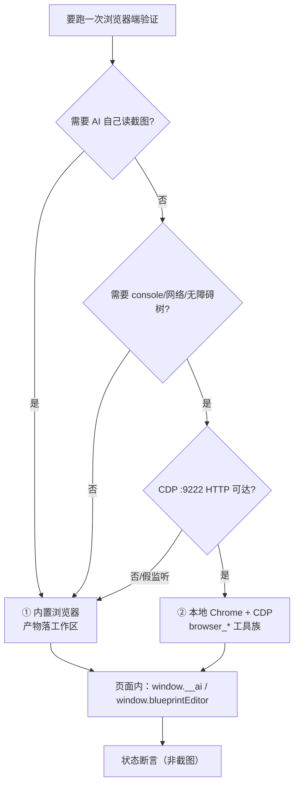

# Playwright 浏览器测试流程

> **一句话定位**：这是**一次浏览器端验证怎么组织**的方法论——从启动编辑器到拿到可判定结论要走哪几步，每步的判据是什么，以及哪些异常是环境限制而非真 bug。
>
> **什么时候会用到你**：准备跑一次端到端验证想确认先后顺序；断言拿到意外结果要区分「环境限制」还是「真 bug」；要决定这次走 VS Code 内置浏览器还是本地 Chrome + CDP；想理解为什么浏览器里和 Electron 里行为不一样。
>
> 代码位置：`vite.config.ts`、`scripts/`、`src/editor/MockElectronAPI.ts`、`src/editor/EditorInitializer.ts`

与两篇旁参的分工，别看串：

- [playwright_commands.md](./playwright_commands.md) —— **① VS Code 内置浏览器**的命令速查（`open_browser_page` / `read_page` / `run_playwright_code`）
- [playwright_mcp_commands.md](./playwright_mcp_commands.md) —— **② 本地 Chrome + CDP `:9222`** 的 `browser_*` 工具链路

两条链路打开的是**同一个 Vite 页面**，页面内调试桥与通用流程完全一致，差异只在浏览器怎么起、元素怎么点、产物落在哪。本文只讲流程与方法论，命令清单不复制。

---

## 1. 先记住这几个文件

| 文件 | 一句话职责 | 你要改它的场景 |
|---|---|---|
| [vite.config.ts](../../vite.config.ts) | 定 dev server（5173+）、资产 JSON 的 HMR 守卫、DSH 代理 | 改端口 / 改 HMR 排除规则 |
| [MockElectronAPI.ts](../../src/editor/MockElectronAPI.ts) | 浏览器模式下 `window.electronAPI` 的降级实现（内存缓存，不落盘） | 浏览器里某个 IPC 能力缺失或行为不一致 |
| [EditorInitializer.ts](../../src/editor/EditorInitializer.ts) | 挂 `window.__ai` 调试桥 + 调 `installBlueprintWindowApi()` | 加页面内调试入口 / AI 事件 |
| [main.ts](../../electron/main.ts) | 追加 CDP `9222`、三个反节流开关、`9877+` 的 MCP HTTP 端点 | 改调试端口 / 后台节流行为 |

**关键心智模型**：**浏览器与 Electron 是两套环境，差异是设计使然而非 bug**。判定「限制还是 bug」的第一问永远是——我现在在哪个环境里？

---

## 2. 一次验证怎么跑完：从启动到出结论

### 2.1 启动等待

编辑器 dev 链路的入口脚本就是 `vite`（`package.json` 的 `electron:dev`）：

```json
"electron:dev": "vite"
```

> **为什么这条命令就够了**：`vite-plugin-electron` 会在 Vite 启动时连带编译并拉起 `electron/main.ts`，所以不需要再手动 `npx electron .`。Vite 端口从 5173 起，MCP HTTP 端口从 `MCP_API_PORT_START = 9877` 起（`electron/main.ts:1650`），**多实例时各自独立递增、互不冲突**（`electron/main.ts:2165`）。

启动后不要凭感觉等，用这两条命令确认端口真的就绪：

```powershell
Get-NetTCPConnection -LocalPort 5173 -State Listen -ErrorAction SilentlyContinue
Invoke-RestMethod -Uri 'http://127.0.0.1:9877/api/status' -TimeoutSec 5
```

> **为什么必须探测而不是 sleep**：Vite 冷启动要编译整个引擎模块图，固定 `sleep` 秒数要么不够要么浪费。第一条确认页面端口在听，第二条打主进程真端点（`electron/main.ts:1933` 的 `/api/status`），**返回 200 才说明主进程已接管**；端口递增到 5174/9878 时也会直接暴露实际端口。

`scripts/` 下的 `check-deps.mjs`、`ui-compile-gate.mjs` 等是启动与编译辅助脚本；**没有独立的 HMR 守卫脚本**——HMR 守卫是 `vite.config.ts:129` 的内联插件，见 §3.3。

### 2.2 两条调试链路



| 关注点 | ① 内置浏览器 | ② 本地 Chrome + CDP |
|---|---|---|
| 浏览器来源 | VS Code 集成浏览器 | 用户手动启动的本地 Chrome |
| 前置动作 | 无（开箱即用） | **必须开 CDP `:9222`** |
| 可见性 / 交互 | `hidden`（常见）；`click_element` 超时 → `run_playwright_code` + `dispatchEvent` | `hidden`（实测）；`browser_click` 超时 → `browser_evaluate` + `dispatchEvent` |
| 异步长任务 | 返回 `deferredResultId`，需二次取结果 | **无**此机制，拆短调用 |
| 产物位置 / 诊断能力 | 工作区内、**AI 可读**；无页面级诊断 | 沙箱目录（工作区外，AI 读不到）；有 `browser_console_messages` / `browser_network_requests` / `browser_snapshot` |

讲解：**默认走 ①**，它是项目默认入口且产物 AI 能自己读。只有当需要页面级诊断工具（控制台/网络/无障碍树）时才走 ②；② 若探测超时立刻回退 ①，两套链路互不干扰，不会互相污染。

### 2.3 操作与取结果

一次完整验证的阶段顺序与判据：

| 阶段 | 关键动作 | 成功判据 |
|---|---|---|
| 页面就绪 | 导航 `http://localhost:5173/` | 页面标题为 DemoStudio Editor |
| 打开工程 | dblclick 工程卡片 | 状态栏出现工程名 + `▶ Launch` |
| 启动游戏 | 点 Launch，`waitForTimeout(5000)` | 状态栏 `Running`、大纲出现 pawn/camera |
| 推进阶段 | `window.__ai.emit('ai.clickActor', …)` | 大纲节点切换 |
| 取结果 | 调试桥回执 + DOM 断言 | 见下方判据写法 |
| 收尾 | 点 Stop | 状态栏回到 `Launch` |

**为什么必须用状态断言而不是截图**：浏览器路径下页面 `visibilityState` 常为 `hidden`，rAF 停摆导致画面不更新，截图拿到的是陈旧帧——**像素证据不可信**。状态断言读的是内存真值，与渲染无关。

```js
// ✅ 断言具体的 ok 字段，数据在 results[0] 而不是返回值本身
const ok = await page.evaluate(async () => {
  const r = await window.__ai.emit('ai.getActor', { name: 'BuildMenu' })
  return r?.results?.[0]?.ok === true
})
```

> **为什么必须取 `results[0].ok`**：`AIModule.emit` 把每个处理器返回值收进 `results` 数组，失败信息藏在 `results[0].error`，外层对象照常返回。所以 `if (r)` **恒真**、等于什么都没判——这是测试里最常见的假阳性来源。

```js
// ✅ 页面文本断言（最稳的通用手段）
await page.evaluate(() => document.body.innerText)
```

> **为什么 `name` 是类名**：`ai.getActor`（`registerBuiltinAIHandlers.ts:475`）返回的 `name` 是构造类名（如 `Actor`/`GenericActor`），不是资产节点名。要断言真实节点名就切「UI 大纲」页签读 DOM——接口设计如此，不是 bug。

**判定优先级**：调试桥回执 `results[0].ok` > DOM 文本/属性 > 数值断言（手算相机/矩阵换算）> 截图。截图只在粗粒度确认「有没有渲染出东西」时用。

---

## 3. 环境限制与规避

### 3.1 `electronAPI` 不可用

**现象**：浏览器里 `window.electronAPI` 存在，但读写全在内存，磁盘纹丝不动。

**原因**：浏览器模式注入的是 `MockElectronAPI`，注入逻辑是「有则不注入」：

```ts
export function injectMockElectronAPI(): void {
  if (typeof window === 'undefined') return
  if (window.electronAPI) return // Electron 环境，不做注入

  ;(window as any).electronAPI = mockAPI
```

（`MockElectronAPI.ts:373-376`）**规避**：下面这些能力在浏览器里是假的，涉及它们的结论必须回 Electron 复验——

| 能力 | 浏览器行为 | 位置 |
|---|---|---|
| `writeJsonFile` | 只 `jsonCache.set(...)`，**不落盘** | `MockElectronAPI.ts:229` |
| `readJsonFile` | 走 `import.meta.glob` 缓存，返回**深拷贝** | `MockElectronAPI.ts:203` |
| `watchProjectAssets` | 恒返 `{ ok: false }` | `MockElectronAPI.ts:272` |
| `onAssetChanged` | 空函数，**永不触发** | `MockElectronAPI.ts:274` |
| `startGameLog` / `writeGameLog` | 只打 console，**不建日志文件** | `MockElectronAPI.ts` |

> **为什么 `readJsonFile` 要深拷贝**：模拟真实 IPC 的序列化语义。历史上返回共享引用时，Inspector 的 `onChange` 原地改 `p[i]` 会污染缓存与工作副本 → oldSnapshot 已污染 → **撤销失效**。

**页面内的 `window.__ai` / `window.blueprintEditor` / React DOM 都是真实例**，可直接断言——只有跨进程 IPC 是假的。

### 3.2 hidden 页面

**现象**：`click()` / `dblclick()` 报 `Timeout ... exceeded`；FPS 恒 0；动画类断言不推进。

**原因**：浏览器路径下页面 `visibilityState` 常为 `hidden`，Playwright 的元素「可见且稳定」等待永不满足，同时 rAF 暂停使渲染循环停摆。

**规避**：一律用 `dispatchEvent` 原生事件，且 `bubbles: true` 不能省——

```js
await el.dispatchEvent('click', { bubbles: true })      // 单击
await el.dispatchEvent('dblclick', { bubbles: true })   // 双击（打开工程卡片走这条）
```

> **为什么 `bubbles: true` 不是可选项**：React 的合成事件监听挂在 root 容器上，事件不冒泡就到不了 React 处理器，表现为「dispatch 了但什么都没发生」。`page.mouse.click` 的真实坐标点击在 hidden 页面同样不可靠，别用它碰 React 按钮。

这条限制**只对浏览器路径成立**。Electron 窗口配了 `backgroundThrottling: false`（`electron/main.ts:255` 与 `:2129`），`main.ts:2179-2181` 又追加三个反节流开关：

```ts
app.commandLine.appendSwitch('disable-renderer-backgrounding')
app.commandLine.appendSwitch('disable-backgrounding-occluded-windows')
app.commandLine.appendSwitch('disable-background-timer-throttling')
```

注释里写明「三开关对本进程所有 renderer（含 Playwright/CDP 连入的页面）生效」，所以**直连 Electron 窗口时 rAF 恒全速、visibilityState 恒 visible**，不需要 dispatchEvent 与手动驱动帧这些绕行手段。

### 3.3 HMR 不重建实例

**现象**：改完一行代码，断言突然失效；或日志仍是旧格式、新 UI 节点不存在。

**原因**：Vite HMR 只热更新模块，**已挂载的 manager 实例不重建**，模块级静态状态（UndoManager 栈、workingCopies/dirtyKeys）还会被重置。

**规避**：改完代码必须 `page.reload()` 重走全流程；测试过程中不要改代码。

资产类文件的 HMR 已被 `vite.config.ts:129` 的内联插件挡掉：

```ts
name: 'ignore-asset-json-hmr',
handleHotUpdate({ file }) {
  if (/(?:widget|scene|blueprint|config|table)\.json$/.test(file)) return []
  if (/[/\\]src[/\\]projects[/\\][^/\\]+[/\\]data[/\\].+\.json$/i.test(file)) return []
  if (/\.widget\.html$/i.test(file)) return []
},
```

> **为什么要排除资产 JSON**：这些文件由编辑器保存机制驱动（`writeJsonFile` → `loadFromJson` → 预览重建），不需要 Vite 热更新传播。不排除的话 `import.meta.glob` 的依赖链会把整个引擎模块树重载一遍；游戏存档与 `.widget.html` 同理——整页刷新会**杀掉正在运行的游戏会话**。

反过来这也意味着**改了资产文件后光重启游戏没用**，必须整页 reload 让 `import.meta.glob` 重新求值。

---

## 4. 关键命令与脚本速查

| 命令 / 脚本 | 位置 | 干什么 | 注意 |
|---|---|---|---|
| `npm run electron:dev` | `package.json` | 启动编辑器（Vite + Electron 一起拉起） | Vite 5173+、MCP 9877+ 自动递增 |
| `Get-NetTCPConnection -LocalPort 5173` | — | 确认页面端口在听 | 多实例时端口会递增 |
| `Invoke-RestMethod .../9877/api/status` | `electron/main.ts:1933` | 确认主进程已就绪 | 必须带 `-TimeoutSec` |
| `window.__ai.emit / listEvents` | `EditorInitializer.ts:336` | 页面内 AI 事件总入口 | 断言数据在 `results[0]`；卸载时 `delete window.__ai` |
| `window.blueprintEditor.read/apply/dispatch` | `windowApi.ts:38` | 蓝图读/编辑/统一入口 | 幂等安装（`windowApi.ts:40`），HMR 后仍是同一实例 |
| `ai.selectActor` / `ai.dragActor` | `EditorInitializer.ts:108` / `:142` | 编辑器侧按名选中/拖动 | 免坐标，等价 gizmo 操作 |
| `ai.clickActor` | `registerBuiltinAIHandlers.ts:303` | 游戏运行时按 name/text/path 点击 | 递归查找，无需坐标 |
| `ai.getActor` | `registerBuiltinAIHandlers.ts:475` | 查 Actor 详情 | 返回 `name` 是**类名**，别断言节点名 |
| `ai.getState` | `registerBuiltinAIHandlers.ts:278` | 查运行时状态 | 数据在 `results[0]` |
| `ai.getSceneOutline` | `registerBuiltinAIHandlers.ts:788` | 查场景大纲 | 后台节流时会拿到陈旧结果 |
| `registerBuiltinAIHandlers()` | `registerBuiltinAIHandlers.ts:139` | 注册引擎侧内置 AI 事件 | 经 `registry.ts:84` 由 `registerAllProjectModules` 调用 |
| `injectMockElectronAPI()` | `MockElectronAPI.ts:373` | 浏览器模式注入 Mock API | 仅 `window.electronAPI` 不存在时生效 |
| `scripts/check-deps.mjs` | `scripts/` | 启动前依赖检查 | 依赖缺失时启动会失败 |
| 三个反节流开关 | `electron/main.ts:2179-2181` | 后台 rAF/定时器不节流 | 对**所有** renderer 生效 |
| CDP 端口追加 | `electron/main.ts:2170-2171` | 仅当启动参数未指定时追加 `9222` | 无条件覆盖会与运行中实例冲突 |

---

## 5. 流程影响：牵动哪些功能

### 上游：谁驱动它

| 上游 | 怎么驱动 | 相关文档 |
|---|---|---|
| Vite dev server | 提供 `http://localhost:5173/` 被测页面（5173+ 递增） | [MCP 集成](../editor/integration/mcp_integration.md) |
| `EditorInitializer` | 挂载 `window.__ai`、调 `installBlueprintWindowApi()` | [Agent 面板](../editor/integration/agent_panel_system.md) |
| 项目注册表 | `registry.ts:84` 在 `registerAllProjectModules` 内注册引擎 AI 事件 | [编辑器核心](../editor/core/core_system.md) |
| `MockElectronAPI` | 浏览器模式撑起 `electronAPI` 降级 | [VS Code 内置浏览器](./playwright_commands.md) |

### 下游：它波及谁

| 下游功能 | 波及点 | 相关文档 |
|---|---|---|
| 内置浏览器命令链路 | 本文的方法论决定了命令怎么组合、结果怎么判 | [VS Code 内置浏览器](./playwright_commands.md) |
| CDP 调试链路 | 同一套流程判据；差异只在浏览器怎么起、产物落哪 | [Playwright MCP](./playwright_mcp_commands.md) |
| MCP 集成 | `:9877` 的 `ai_event` 只转发给 Electron 窗口，浏览器实例收不到 | [MCP 集成](../editor/integration/mcp_integration.md) |
| Agent 面板 | 点「Agent」开的是**独立子窗口**（`/agent.html`），不在当前页面内 | [Agent 面板](../editor/integration/agent_panel_system.md) |
| AI 事件系统 | `window.__ai.emit` 最终落到 `AIModule.emit` | [VS Code 内置浏览器](./playwright_commands.md) |

---

## 6. 踩坑清单

**1. 动态 `import('/src/...')` 拿不到页面实例**

现象：`getComponent(UITransformComponent)` 返回 null、`instanceof` 失败。原因：Vite 转换后的模块 URL 带 `?t=<mtime>`，裸 import 不带 → ES 模块按完整 URL 缓存 → 两个类实例。规则：**查运行时状态一律走 `window.__ai` / `window.blueprintEditor`**，不要动态 import 模块。

**2. hidden 页面渲染循环不跑**

现象：`visibilityState === "hidden"` → rAF 暂停 → FPS 0，`bringToFront` 无效。规则：**环境限制不是 bug**。断言用 DOM/调试桥/数值，不用像素与帧；点击交互必须 `dispatchEvent`。

**3. 游戏日志文件写入不稳定**

现象：浏览器 Mock 环境多次 Launch 不新建 `logs/game_*.log`（Electron 正常）。原因：`startGameLog`/`writeGameLog` 在 Mock 里只打 console。规则：用**行为证据**（`ai.getActor` 等状态断言）而非日志文件。

**4. Mock `readJsonFile` 曾返回共享引用**

现象/历史：返回共享引用时 Inspector 的 `onChange` 原地改 `p[i]` 会污染缓存与工作副本 → oldSnapshot 已污染 → **撤销无效**。规则：现在返回深拷贝（`MockElectronAPI.ts:203`），与真实 IPC 序列化语义一致。

**5. HMR 对测试的破坏**

现象：测试中改一行代码 → 撤销后重做按钮突然禁用；或首次运行日志仍是旧格式。原因：模块级静态状态全部重置（UndoManager 栈、workingCopies/dirtyKeys、`window.blueprintEditor` 引用、console hook 闭包）。规则：**测试过程中不要改代码**；改完 `page.reload()` 重走全流程。捕获不到 console 日志不代表日志没打——hook 挂在旧实例闭包上，HMR 后新模块输出绕过它。

**6. 资产校验跑不了 assetLint**

现象：浏览器无法跑 assetLint（依赖 Electron 文件系统）。规则：用 node 脚本静态验证资产结构（id 唯一性、组件 schema 一致性、anchor 枚举合法性）。

**7. 点击任何元素都超时**

原因：hidden 页面，Playwright 等元素「可见且稳定」永不满足。规则：一律 `dispatchEvent('click'/'dblclick', { bubbles: true })`。

**8. `page.evaluate` 返回 `deferredResultId`**

原因：带 `await` 的长 evaluate 被异步化（"code has not finished executing"）。规则：用**同 pageId、不带 code** 再调一次取结果。此机制**仅内置浏览器路径有**，MCP 的 `browser_evaluate` 没有，只能拆短调用。

**9. Vite 转换缓存过期 → 白屏 / troika 文本度量不全**

两条同源：前者报 `does not provide an export named 'World'` 但磁盘文件正常，touch 文件（`(Get-Item file).LastWriteTime = Get-Date`）→ reload 即可；后者是动态 import 的孤立 Actor（未挂渲染场景）中 ascender/lineHeight undefined，换行等渲染结果应在**真实游戏内**验证。

**10. 点击命中类断言的三个坑**

① 不可见碰撞体射线打不中：`ClickableComponent.hitTest` **沿父链过滤 `visible=false` 目标**（THREE.Raycaster 本身不检查 visible）→ 不可见点击区必须保持 `visible` + `colorWrite:false` 材质，**禁用 `setVisible(false)`**。② 点击结果无日志可观察：`logger.debug` 不进控制台 → 断言用 `PhySys._pressedClickable`（命中者引用），测完 `sys.raycastRelease()` 清理。③ `__fishBattle.debugHit(sx,sy)` 只查 `_uiClickables`（UI 相机射线），**别用它断言 3D 命中**，世界层走 `PhySys` 单例。

**11. `ai.getActor` 的 `name` 是类名 + 回执当真值恒真**

两条同源：返回的 `name` 是构造类名不是节点名；`emit` 失败也返回对象（error 在 `results[0].error`），`if (r)` **恒真**。规则：断言节点名切「UI 大纲」页签读 DOM；断言成功必须写成 `res?.results?.[0]?.ok === true`。

**12. 浏览器实例收不到 MCP `ai_event`**

原因：MCP `:9877` 的 `ai_event` 经主进程**只转发给 Electron mainWindow** 渲染进程。规则：验证须在**对应实例自己的通道内**做，浏览器里就用 `window.__ai`。

**13. PowerShell 写 JSON 带 BOM / 无 `tail`**

原因：`Set-Content -Encoding UTF8` 写 BOM，`JSON.parse` 直接失败。规则：用 `[IO.File]::WriteAllText(path, text, (New-Object Text.UTF8Encoding($false)))`；取日志尾段用 `Select-Object -Last N`（PowerShell 管道不支持 `tail`/`head`）。

**14. 阶段敏感 UI 用例时灵时不灵**

原因：`getAllUIActors` 是**累计集合**，场景切换后旧 HUD 树残留且同名，`findActorByName` 会命中旧树按钮。规则：显隐断言改走 GameMode 广播通道；用例开头防御性 `returnToBase()` + 断言 `_phase==='base'`。

**15. 文档断链检测脚本误报示例代码里的 `.md` 链接**

原因：文档示例代码常含 `.md` 链接占位，不剥离代码块会被当真实断链。规则：校验脚本必须**先剥离 ``` 围栏**再检测；PowerShell 里反引号是转义符，正则用字符类 `[\`]` 或 `[char]96` 表示。

---

## 7. 边界条件

| 条件 | 行为 | 怎么应对 |
|---|---|---|
| 浏览器模式（无 `electronAPI`） | `MockElectronAPI` 内存缓存，不落盘 | 落盘结论回 Electron 复验 |
| Electron 窗口（直连） | `backgroundThrottling:false` + 三个反节流开关，rAF 恒全速、`visibilityState` 恒 visible | 不需要 dispatchEvent / 手动驱动帧等绕行 |
| 页面 `hidden`（浏览器路径） | rAF 停摆、FPS 0、`click()` 超时 | 断言用 DOM/调试桥/数值，不用像素与帧 |
| 改代码 / HMR | 不重建已挂载实例；模块级静态状态重置 | 改完必 `page.reload()`；测试过程中别改代码 |
| 改资产 JSON / `.widget.html` | HMR 已被 `vite.config.ts:129` 挡掉，不触发重载 | 必须整页 reload 让 `import.meta.glob` 重新求值 |
| 动态 `import('/src/...')` | 带 `?t=` 的裸 import 是独立实例 | 走 `window.__ai` / `window.blueprintEditor` |
| 未注册 AI 事件 | `registerBuiltinAIHandlers` 在 `registerAllProjectModules`（`registry.ts:84`）内调用，随编辑器启动完成 | 事件不存在先查 `listEvents()` |
| `ai.getActor` 返回的 `name` | 是类名不是节点名 | 切「UI 大纲」页签读真实树名 |
| `watchProjectAssets` / `onAssetChanged` | Mock 恒返 `{ ok: false }`、回调永不触发 | 资产热更新类结论回 Electron 验证 |
| 游戏日志 / assetLint（浏览器） | 多次 Launch 不新建文件；assetLint 依赖 Electron 文件系统跑不了 | 用行为证据断言；资产结构用 node 脚本静态验证 |
| `logs/console_*.log` 捕获 | HMR 后新模块输出绕过 console hook | 捕获不到不代表没打，直接读日志文件 |
| 多实例 / `deferredResultId` | Vite 5173+ 与 MCP 9877+ 各自独立递增；`deferredResultId` 仅内置浏览器路径有 | 启动后先探测实际端口；MCP 路径拆短调用 |
