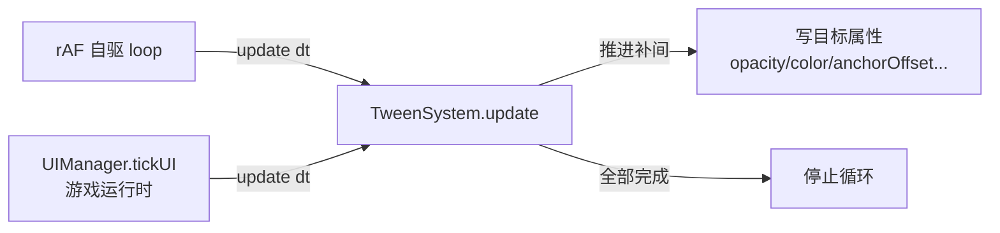

# UI 增强系统（Tween / Toast / Tooltip / 安全区 / 色盲 / 输入提示 / 通用组件）

> 在基础 UI 系统（UIManager/HUD/控件组件，见 [世界 UI 系统](./engine/ui_system.md)）之上补齐的游戏 UI 能力，
> 对齐 game-ui-design 设计准则：动效、通知、悬停提示、TV 安全区、色盲适配、输入设备感知、进度/列表组件、设计级 lint。
> 代码位置：`src/engine/ui/TweenSystem.ts` `ToastSystem.ts` `UITooltipComponent.ts` `ColorblindService.ts`
> `InputPromptSystem.ts` `UIProgressBarComponent.ts` `UIScrollListComponent.ts`；
> 编辑器侧：`src/editor/asset/assetLint/checkers/uiDesignChecker.ts` `UIPreviewManager.ts`（安全区参考线）

## 1. 总览

| 系统 | 文件 | 核心能力 |
|---|---|---|
| 补间动画 | `TweenSystem.ts` | 通用数值/颜色补间 + 缓动库 + fade 快捷方法（自驱 rAF + tick 双驱动） |
| 通知队列 | `ToastSystem.ts` | 优先级队列（critical 插队）、同时最多 3 条、自动淡出销毁 |
| 悬停提示 | `UITooltipComponent.ts` | 控件挂组件，悬停 delay 秒后动态生成 tooltip 面板 |
| 安全区 | `CanvasUIComponent.safeArea` | 根画布安全区内缩百分比，锚点边角元素自动内缩，编辑器预览参考线 |
| 色盲模式 | `ColorblindService.ts` | 3 套色板（绿盲/红盲/蓝黄盲），语义色映射替换，可撤销 |
| 输入提示 | `InputPromptSystem.ts` | 键盘/鼠标设备检测 + 提示文本切换 |
| 进度条 | `UIProgressBarComponent.ts` | value/min/max + fill 子节点尺寸按比例填充 |
| 滚动列表 | `UIScrollListComponent.ts` | item 对象池 + 滚动偏移 + 平滑滚动 |
| 设计级 lint | `uiDesignChecker.ts` | widget 资产字号/触控/阴影/zOrder/安全区检查（全 warn） |

## 2. 使用方法

### 2.1 TweenSystem（全局单例）

```ts
import { TweenSystem } from '@/engine'

// 补间任意对象属性（数值/数组/颜色字符串，从当前值开始）
TweenSystem.instance.to(comp, { opacity: 0, color: '#ff0000' }, {
  duration: 0.3, easing: 'quadOut', delay: 0, yoyo: false, repeat: 0,
  onUpdate: (values) => {}, onComplete: () => {},
})

// 显式起止
TweenSystem.instance.fromTo(comp, { anchorOffset: [0, 0] }, { anchorOffset: [0, 0.6] }, { duration: 0.5 })

// UI 快捷方法：整树淡入/淡出（遍历 CanvasUIComponent.setOpacity）
TweenSystem.instance.fadeIn(actor, { duration: 0.2 })
TweenSystem.instance.fadeOut(actor, { duration: 0.2, onComplete: () => ui.destroyUIActor(actor) })

// 取消
const h = TweenSystem.instance.to(...); h.kill()

// 测试/隐藏页：关闭 rAF 自驱，改由外部 update(dt) 驱动
TweenSystem.instance.autoDrive = false

// 减少动效开关（Motion Sickness 无障碍）
TweenSystem.instance.motionEnabled                    // 读取（首次自动检测 prefers-reduced-motion）
TweenSystem.instance.setMotionEnabled(false)          // 手动关闭：新补间瞬时完成 + 进行中补间跳终点
```

**驱动链**：默认 rAF 自驱（编辑器预览/独立环境可用）；游戏运行时 `UIManager.tickUI` 额外调 `update(dt)` 双保险（隐藏页面 rAF 暂停时仍推进）。

**减少动效（motionEnabled）**：
- 首次访问自动检测系统 `prefers-reduced-motion`（浏览器/OS 设置）→ 开启时动画默认瞬时完成
- `setMotionEnabled(false)` 手动关闭（游戏设置 UI 调用，覆盖自动检测）：进行中补间全部跳到终点（属性置目标值 + 触发 onComplete），新补间不播放
- 语义安全：Toast fadeOut 的 onComplete 销毁逻辑、Tooltip 显隐等在瞬时完成模式下仍正常执行

### 2.2 ToastSystem（全局单例，需挂接）

```ts
import { ToastSystem } from '@/engine'

// 项目启动时挂接一次（FishGameInstance.start 已做）
ToastSystem.instance.attach(world.ui, 'asset/blueprints/ui/toast.widget.json')

// 显示通知（优先级：critical > high > normal > low；critical 插队）
ToastSystem.instance.show('金币 +50', { priority: 'normal', duration: 3 })
ToastSystem.instance.dismiss(id)      // 按 id 提前消失
ToastSystem.instance.dismissAll()     // 全部消失
```

**widget 资产约定**（`toast.widget.json`）：根画布（top-center 锚点）+ 子节点 `name="ToastText"` 的 UITextComponent（消息写于此）。

### 2.3 UITooltipComponent（控件挂组件）

```json
{ "baseClass": "UITooltipComponent", "properties": { "text": "兵营：训练部队", "delay": 0.3, "direction": "top" } }
```

- `text`：提示文本；`delay`：悬停延迟（默认 0.3s）；`direction`：top/bottom
- 组件自动挂载 ClickableComponent（UI 层），悬停延迟到点后经 `spawnUIActor('tooltip.widget.json')` 动态生成面板（挂宿主下，位置自动跟随），离开销毁
- widget 约定：子节点 `name="TooltipText"` 的 UITextComponent

### 2.4 安全区（CanvasUIComponent.safeArea）

```json
// 根 Canvas 上配置
{ "baseClass": "CanvasUIComponent", "properties": { "width": 1920, "height": 1080, "safeArea": 5 } }
```

- `safeArea`：百分比 0-15（默认 5），根画布四周内容安全区
- **运行时**：子元素单点锚（边角锚）自动内缩此比例（`UITransformComponent.applyAnchor` 读取父真实画布 safeArea；stretch 背景铺满不受影响，center 锚不受影响）
- **编辑器**：UIPreviewManager 绘制黄色虚线安全区参考线（预览 widget 时可见）
- **lint**：根画布未配置 safeArea → warn 提示

### 2.5 ColorblindService（全局单例，需挂接）

```ts
import { ColorblindService } from '@/engine'

ColorblindService.instance.attach(world.ui)          // FishGameInstance.start 已做
ColorblindService.instance.setMode('deuteranopia')   // 绿盲 / protanopia 红盲 / tritanopia 蓝黄盲 / off 还原
```

- 语义色映射替换：danger 红 → 橙棕、ally 绿 → 蓝等（`COLORBLIND_PALETTES` 可查/扩展）
- 首次替换记录原始色（WeakMap），切换/还原时先恢复再应用——**可完全撤销**

### 2.6 InputPromptSystem（全局单例，自动驱动）

```ts
import { InputPromptSystem } from '@/engine'

InputPromptSystem.instance.onDeviceChanged = (device) => refreshPrompts()
textComp.text = InputPromptSystem.instance.prompt('按 E 交互', '点击交互')  // 键盘→kbLabel，否则→mouseLabel
```

- 驱动：`InputSys.handleKeyDown` → keyboard；`handlePointerDown` → mouse（已接入）

### 2.7 UIProgressBarComponent

```json
{ "baseClass": "UIProgressBarComponent", "properties": { "value": 50, "min": 0, "max": 100, "fillActorName": "HealthFill", "direction": "left-to-right" } }
```

- 容器 Actor 挂组件，fill 子 Actor（UIImage + UITransform，锚点 middle-left/middle-right/bottom-center/top-center 决定生长方向）
- 脚本：`bar.value = 37` 自动刷新 fill 尺寸

### 2.8 UIScrollListComponent

```json
{ "baseClass": "UIScrollListComponent", "properties": { "itemWidget": "asset/blueprints/ui/troop_card.blueprint.json", "itemSize": [1.2, 0.5], "spacing": 0.15, "visibleCount": 5, "direction": "vertical" } }
```

```ts
const list = actor.getComponent(UIScrollListComponent)
list.totalCount = 20
list.onItemSpawned = (item, idx) => { /* 填充 item 内容 */ }
list.scrollBy(1)          // 滚动 1 项（支持小数平滑滚动）
list.scrollTo(3)
```

- 对象池：visibleCount+1 个 item 复用，超范围隐藏（`bActive=false`）
- **已知限制**：不裁剪溢出可视区（引擎无 mask）；如需裁切需自行用 active 控制

### 2.9 设计级 lint（widget 资产）

自动运行（无需手动触发）：`doc:ui-design` 检查器在 `AssetLintEngine` 对 `.widget.json` 文件额外运行，规则：

| ruleId | 触发 | 级别 |
|---|---|---|
| `ui:font-size` | UIText fontSize < 14 | warn |
| `ui:small-touch-target` | 按钮世界尺寸换算像素 < 44px（按根画布比例折算） | warn |
| `ui:no-text-shadow` | 非按钮文本无 shadowColor | warn |
| `ui:z-index-war` | CanvasUI zOrder > 100 | warn |
| `ui:safe-area` | 根画布未配置 safeArea | warn |

## 3. 工作流程

### 3.1 动态 UI 生成与浮动层

```
spawnUIActor（运行中）
  ├─ applyFloatLayerBias：整树 zOrder += 100（FLOAT_LAYER_BIAS）→ 盖过常驻 HUD
  ├─ ToastSystem：spawn toast 卡片 → 文本填充 → fadeIn → 超时 fadeOut → destroyUIActor
  ├─ UITooltipComponent：悬停延迟 → spawn tooltip 面板（挂宿主下）→ 离开 → destroyUIActor
  └─ UIScrollListComponent：BeginPlay 初始化对象池（visibleCount+1）→ 滚动重排
```

### 3.2 TweenSystem 双驱动



### 3.3 安全区布局链路

```
CanvasUIComponent.safeArea（资产字段）
  ├─ UITransformComponent.applyAnchor：边角锚元素可用区域 = 容器 ×(1-2×safeArea%)
  ├─ UIPreviewManager：黄色参考线（getSafeAreaSize）
  └─ uiDesignChecker：未配置 → warn
```

### 3.4 色盲模式切换

```
setMode(mode)
  ├─ _restore()：按记录的原始色还原全部组件（WeakMap）→ 清空记录
  └─ _apply(mode)：遍历 UI Actor 树 → UIImage/UIText 颜色命中色板映射 → 替换 + 记录原始色
```

## 4. 边界条件

| 条件 | 行为/后果 | 处理方式 |
|---|---|---|
| TweenSystem 无活动补间 | 自动停止 rAF 循环 | 引擎内置 |
| Toast 未挂接 UIManager/widget | 通知丢弃 + 控制台 warn | 先 attach |
| Toast widget 缺 ToastText 节点 | 文本不设置 + warn | 按资产约定建节点 |
| Tooltip 宿主无 World | 不显示 + warn | 挂到已生成 UI 树 |
| 安全区 > 15 / < 0 | 钳制到 [0,15] | setter 内置 |
| 色盲模式未挂接 | setMode 仅记录不应用 + warn | 先 attach |
| 滚动列表无 itemWidget / 未挂 World | 初始化跳过 + warn | 配置资产 + 挂 World |
| 滚动列表 item 生成失败 | 池中断 + error | 检查 itemWidget 路径 |
| rAF 隐藏页面暂停 | tickUI 双驱动仍推进 | 引擎内置（测试依赖） |
| 设计级 lint 全 warn | 不影响资产通过率 | 只提示不阻断 |

## 5. 依赖关系

```
TweenSystem ─→ CanvasUIComponent（setOpacity/opacity）
ToastSystem ─→ UIManager（spawnUIActor/destroyUIActor）+ TweenSystem + UITextComponent
UITooltipComponent ─→ UIManager + ClickableComponent + UITransformComponent + UITextComponent
ColorblindService ─→ UIManager（getAllUIActors）+ UIImageComponent + UITextComponent
InputPromptSystem ─→ InputSys（事件驱动）
UIProgressBarComponent / UIScrollListComponent ─→ UITransformComponent（锚点/尺寸）
uiDesignChecker ─→ AssetLintEngine（doc:ui-design 调度）+ AssetWalker
```
