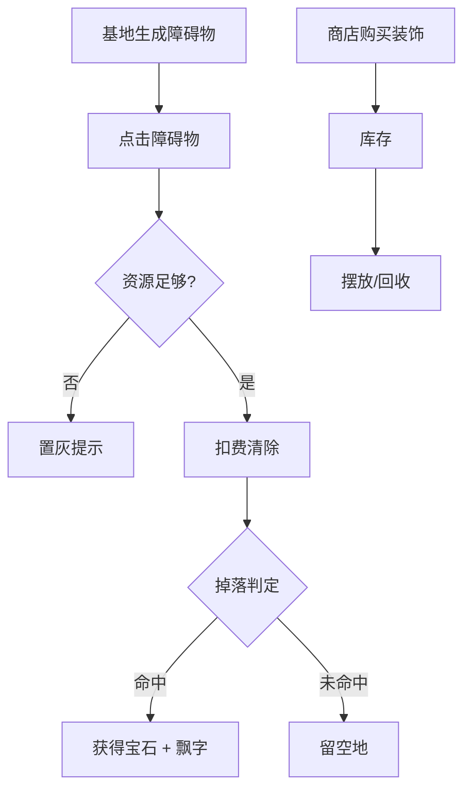

# 障碍物清除与装饰品商店

> 归属系统：基地经营 ｜ 优先级：P3 ｜ 状态：规划中
> 基地周边玩法：障碍物提供资源与宝石掉落，装饰品满足摆放个性化。

## 现状与差距

- 现状：无障碍物（树/石头），无装饰品；基地内只有功能建筑。
- 目标：地图随机生成障碍物可花费资源清除（概率掉宝石）；商店可购买纯装饰品摆放。

## 设计方案（使用方法）

### 障碍物

- 基地初始化随机撒布树/石头（占格，不可建造重叠）。
- 点击 → 清除面板（费用 + 耗时或即时）→ 清除后留空地；概率掉落宝石（[宝石货币](../economy/gem.md)）。
- 定期（或 GM）刷新新障碍物，保持可持续收集。

### 装饰品

- 商店列表（旗帜/雕像/花坛等，纯外观，无属性）。
- 购买后进入库存 → 摆放模式与建筑移动共用交互；可回收（全额或部分返还）。

### 涉及文件（预估）

- `gameplay/base/`：障碍物实体与清除流程、装饰品库存与摆放
- `asset/config/`：障碍物/装饰品配置表

## 工作流程

## 边界条件

- 障碍物占格参与建造网格校验；清除计时不阻挡其他操作。
- 掉落概率入配置表，GM 命令可强制掉落用于调试。
- 装饰品不参与战斗与掠夺结算。

## 验收标准

- 清除、掉落、摆放、回收全链路日志完整；存档兼容零 lint。

## 关联

- 联动：[宝石货币](../economy/gem.md)（掉落渠道）、[新手引导](../meta/tutorial.md)（首次清除引导，可选）。
