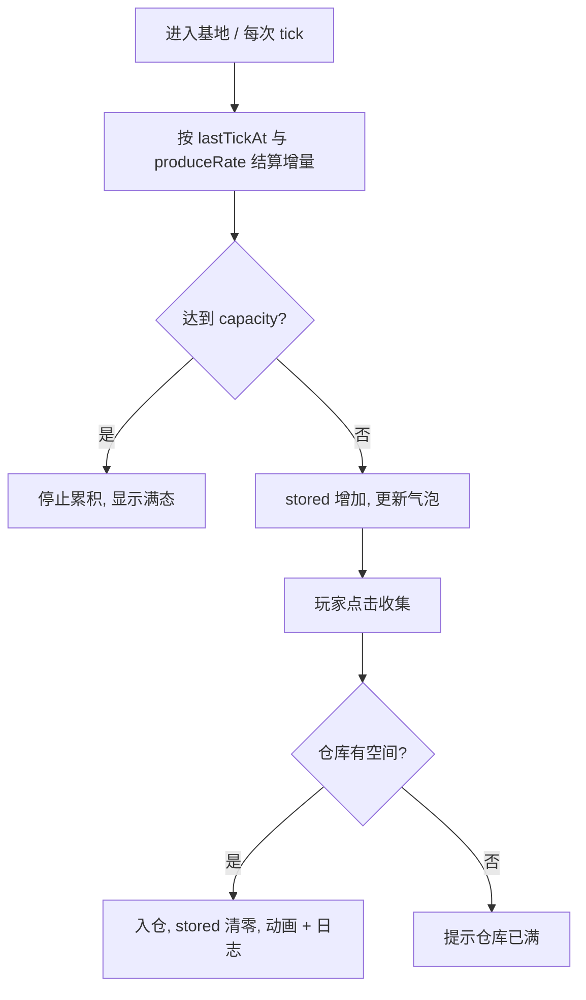

# 资源产出与收集

> 归属系统：基地经营 ｜ 优先级：P0 ｜ 状态：规划中
> 金矿/水库随时间产出金币/药水，玩家点击收集，形成资源循环的源头。

## 现状与差距

- 现状：金矿/水库仅是可放置建筑与战斗中的掠夺目标（按伤害比例掠夺）；不随时间产出，无收集交互。
- 目标：按建筑等级定义产出速率与积压上限；基地内点击收集进仓库；未收集积压可被战斗掠夺。

## 设计方案（使用方法）

### 数据与配置

- 金矿/水库配置增加：`produceRate`（每分钟产量，按等级）、`capacity`（仓内积压上限，按等级）。
- 建筑实例运行时状态：`stored`（当前积压量）、`lastTickAt`（上次结算时间）。
- 仓库容量（大本营/仓库建筑）约束收集上限，随 [建筑升级](building-upgrade.md) 成长。

### 交互

- 建筑上方浮动资源图标 + 数量气泡，达到上限显示"满"态。
- 点击气泡收集：数量飞向 HUD 资源栏，`stored` 清零并写存档。
- 战斗侧：敌方矿的 `stored` 计入掠夺量（未收集部分按现有按伤害比例规则可被抢）。

### 涉及文件（预估）

- `gameplay/base/`：产出组件（惰性时间戳结算，避免高频 tick）、收集 UI、存档字段
- 战斗侧掠夺计算读取矿 `stored`

## 工作流程

## 边界条件

- 离线累积：按时间戳一次性结算，封顶 `capacity`，不做无上限挂机。
- 仓库满：收集失败并提示；仓库容量本身由建筑升级提供。
- 战斗掠夺只针对"未收集积压"与仓库存储；口径与现有按伤害比例规则保持一致。
- 日志规范：高频 tick 不埋点；仅收集、满态、结算异常埋点。

## 验收标准

- 产出与配置一致：挂机 10 分钟数量正确、封顶正确。
- 收集后 HUD、存档、战斗掠夺三处数值一致。

## 关联

- 依赖：[建筑升级](building-upgrade.md)（速率/容量随等级成长）。
- 联动：[联机 PvP](../social/pvp.md)（未来被攻打时积压资源可被抢）。
