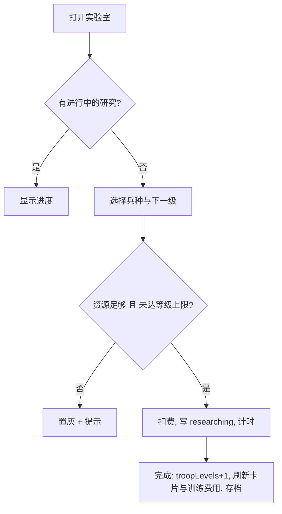

# 兵种升级（实验室与研究）

> 归属系统：基地经营 ｜ 优先级：P0 ｜ 状态：规划中
> 实验室建筑 + 研究队列，让兵种拥有多等级属性，是战斗深度的主要成长线。

## 现状与差距

- 现状：`asset/config/troop.table.json` 无等级字段，兵种固定单级；训练营生产即最终属性。
- 目标：新增实验室建筑；每个兵种可研究升级（费用 + 时间）；训练与战斗使用当前研究等级的属性。

## 设计方案（使用方法）

### 数据与配置

- `troop.table.json` 每兵种增加 `levels[]`：`hp / dps / cost(训练费) / researchCost / researchTime`；第 1 级 = 现有数值。
- 存档增加 `troopLevels: { [troopId]: level }` 与 `researching: { troopId, targetLevel, finishAt }`。
- 实验室等级 gate 可研究上限（简化规则：实验室等级 = 兵种可研究最高等级）。

### 交互

- 实验室面板：兵种列表 + 当前等级/下一级预览/费用耗时；同一时间只能进行一项研究。
- 研究完成：兵种卡片属性即时更新；训练队列中已下单的不追溯（按下单时等级生产）。
- 取消研究：返还 50% 资源（与建筑升级规则对齐）。

### 涉及文件（预估）

- `gameplay/base/`：实验室组件与研究计时、实验室面板 UI
- `gameplay/battle/`：兵种属性读取改为按等级查表（`TroopActors.ts` 装配数值来源）
- 训练营：训练费用/耗时按当前等级取值

## 工作流程

## 边界条件

- 研究唯一性：同时仅一项；升级实验室不重置进行中的研究。
- 已训练在场/队列中的兵保持下单时等级属性，不做追溯。
- 离线完成按 `finishAt` 结算；旧存档无 `troopLevels` 默认全 1。
- 等级上限：实验室等级与表内 `levels` 长度取小。

## 验收标准

- 研究后新训练的兵属性变化在战斗中可验证。
- 训练费用随等级正确变化；存档兼容、零 lint。

## 关联

- 复用：[建筑升级](building-upgrade.md) 的计时/离线结算体系（提取公共 UpgradeTimer 服务）。
- 联动：[兵种专属技能](../battle/troop-abilities.md)（healer 修复后可设为高等级解锁，可选）。
