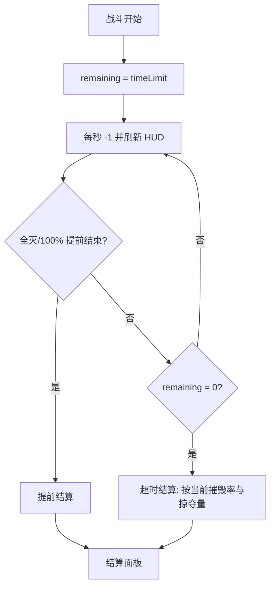

# 战斗时限

> 归属系统：单位与战斗 ｜ 优先级：P2 ｜ 状态：规划中
> 战斗引入倒计时，限制拖局，统一结算节奏。

## 现状与差距

- 现状：战斗无时限（`doc/projects/battle_system.md` 边界条件已注明），僵持局可无限拖。
- 目标：单场战斗 3 分钟倒计时，超时按当前摧毁率直接结算。

## 设计方案（使用方法）

- 战斗 HUD 顶部中央倒计时（最后 30 秒变红 + 提示音预留）。
- `BattleTimerComponent`：由战斗 GameMode 持有，`remaining` 每秒递减；到 0 触发"时间到"结算（与现有胜负判定共用结算管线）。
- 结算口径：超时 ≠ 失败，按已达成摧毁率/掠夺量结算（可能赢）。
- 配置入关卡表：`timeLimit`（默认 180 秒，允许特殊关卡自定义）。

## 工作流程

## 边界条件

- 提前全灭或 100% 摧毁：立即结算，不等待倒计时。
- 最后 10 秒高频提示只触发一次，避免重复埋点日志。
- 暂停/调试桥：GM 暂停战斗时计时同步暂停。

## 验收标准

- 超时结算与正常结算走同一管线，奖励口径一致；日志记录开始/结束/耗时。

## 关联

- 被依赖：[英雄系统](hero.md)、[法术系统](spell.md) 的结算规则在本模块稳定后叠加。
