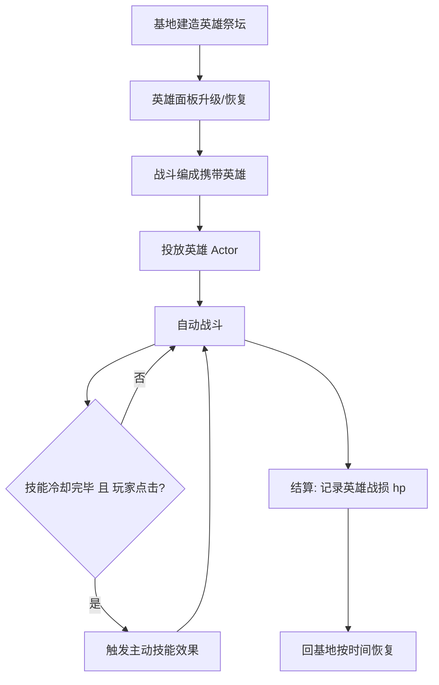

# 英雄系统

> 归属系统：单位与战斗 ｜ 优先级：P2 ｜ 状态：规划中
> 可培养的英雄单位：单兵作战力强、拥有主动技能，是后期战斗核心。

## 现状与差距

- 现状：无英雄单位；战斗单位全部为消耗型兵种。
- 目标：英雄可建造/升级/治疗，战斗中上场一名，具备主动技能；防守端可驻守基地参与防御。

## 设计方案（使用方法）

### 数据与配置

- 新增英雄配置：`hero.table.json`（`hp / dps / skillId / skillCooldown / levels[]`）。
- 英雄等级独立于兵种研究（实验室体系外，走 [建筑升级](../base/building-upgrade.md) 式的升级建筑，如"英雄祭坛"）。
- 生命值跨战斗保留（战损需时间恢复），区别于消耗型兵种。

### 交互

- 基地：英雄祭坛建筑 → 英雄面板（属性/技能/升级/恢复进度）。
- 战斗：英雄作为特殊卡片投放；主动技能为按钮（冷却圈），点击立即生效（如范围冲锋、护盾）。
- 防守：英雄可设为驻守，基地被攻打（[联机 PvP](../social/pvp.md)）时参与防御。

### 涉及文件（预估）

- `gameplay/battle/`：英雄 Actor 装配 + 技能组件 + 冷却 UI
- `gameplay/base/`：祭坛面板、英雄恢复计时
- 存档：`hero: { id, level, hp }`

## 工作流程

## 边界条件

- 每场战斗限上场一名英雄；hp=0 时本场移除并按 0 恢复计时。
- 技能冷却战斗内不重置；英雄不受治疗法术过量溢出。
- 旧存档无 `hero` 字段默认未解锁（祭坛建成后解锁）。

## 验收标准

- 英雄战损/恢复闭环正确；技能冷却与效果数值一致；存档兼容零 lint。

## 关联

- 依赖：[战斗时限](battle-timer.md) 结算稳定后叠加；驻守能力依赖 [联机 PvP](../social/pvp.md)。
