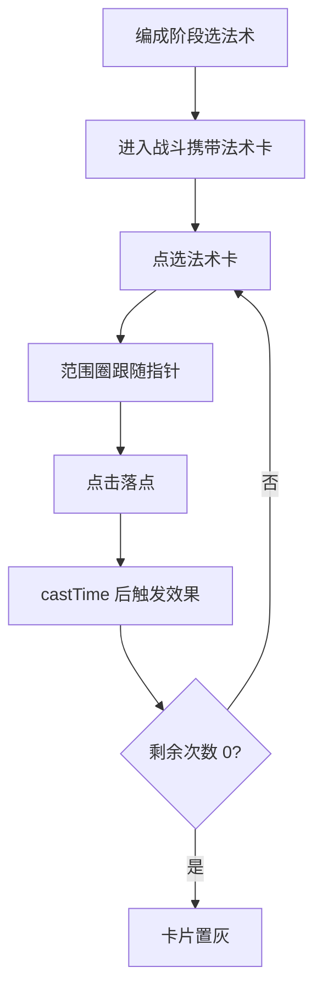

# 法术系统

> 归属系统：单位与战斗 ｜ 优先级：P2 ｜ 状态：规划中
> 战斗中可携带并施放法术，提供范围伤害/增益/治疗等战术维度。

## 现状与差距

- 现状：战斗 HUD 仅兵种卡片；无法术卡槽、无施放交互。
- 目标：进攻编成时可选法术；战斗中选择法术卡 → 指定落点施放，产生范围效果。

## 设计方案（使用方法）

### 数据与配置

- 新增 `spell.table.json`：`id / name / cost(占用法术槽容量) / radius / effect / value / castTime`；首批法术：火球（范围伤害）、治疗（范围回复）、狂暴（范围攻速/移速增益）。
- 战斗编成增加法术槽容量（随大本营等级成长，简化初期可固定）。
- 存档：法术制作数量（复用训练营/工厂产出口径）。

### 交互

- 战斗 HUD 第二页签（法术卡）；点选法术 → 场景出现施放范围圈 → 点击/拖动落点施放。
- 法术一次性消耗，每个卡片显示剩余次数。

### 涉及文件（预估）

- `gameplay/battle/`：法术组件（AoeEffect）、落点选取与范围圈渲染
- 战斗 HUD：卡页切换、剩余次数
- `asset/config/`：`spell.table.json` + assetLint 校验

## 工作流程

## 边界条件

- 法术不受防御攻击，不参与兵 AI；效果对己方/敌方的影响按表内 `effect` 定义。
- 落点不限制在战场内（允许预判圈外边缘）；剩余 0 后卡片置灰不可选。
- 范围伤害同时作用于建筑与兵（治疗/狂暴只作用兵）。

## 验收标准

- 三种法术效果数值与表一致；HUD 次数、存档消耗一致；`npx tsc --noEmit` 通过。

## 关联

- 依赖：[战斗时限](battle-timer.md)（结算规则稳定后再叠加）。
