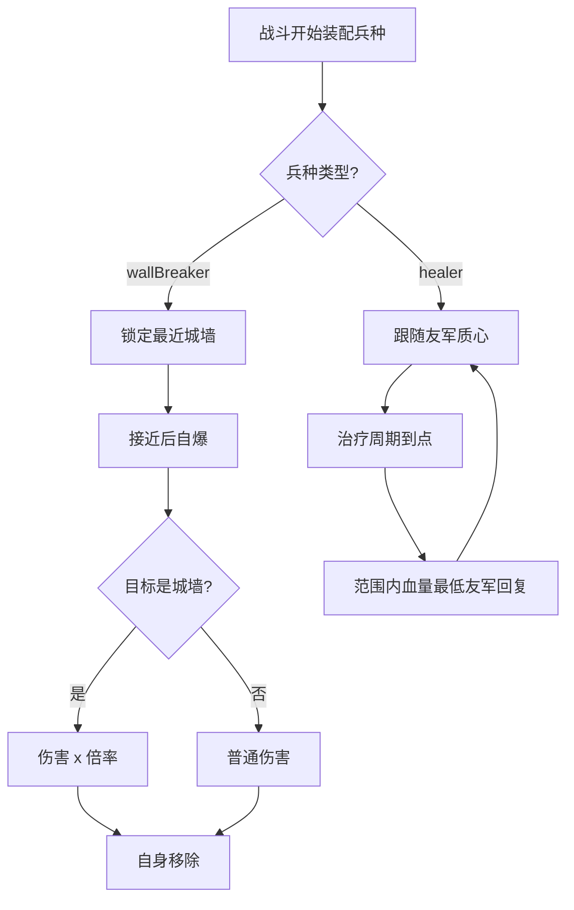

# 兵种专属技能（炸弹人 / 治疗师）

> 归属系统：单位与战斗 ｜ 优先级：P1 ｜ 状态：规划中
> 补齐两个已预留待办的兵种技能，让兵种组合产生战术差异。

## 现状与差距

- 现状：`gameplay/battle/troops/TroopActors.ts` 注释明确留有待办：炸弹人的"自爆对城墙伤害翻倍"与治疗师的治疗逻辑均未实现；`healer` 因 dps=0 不生成战斗卡片，等于无法上场。
- 目标：炸弹人拥有对城墙高倍率伤害；治疗师成为可上场、可治疗友军的辅助单位。

## 设计方案（使用方法）

### 炸弹人（wallBreaker）

- 携带 `WallBreakerAbility` 组件：攻击目标为城墙时伤害 × `wallDamageMultiplier`（配置，建议 10x+）。
- 行为：优先锁定路径上的城墙；命中/自爆一次后自身移除（一次性单位，自爆动画）。
- 配置项入 `troop.table.json`：`ability: { type: 'wallBreaker', wallDamageMultiplier }`。

### 治疗师（healer）

- 携带 `HealerAbility` 组件：周期性对范围内生命值最低的友军恢复 `healAmount`；自身无攻击（修复 dps=0 不生成卡片的问题）。
- 寻路：跟随友军集群质心，保持 `followDistance`；不主动接近敌方防御。
- 被攻击会死亡；不互相治疗。

### 涉及文件（预估）

- `gameplay/battle/troops/TroopActors.ts`：装配两个能力组件
- `gameplay/battle/components/`：新增 `WallBreakerAbility`、`HealerAbility`
- 战斗 HUD 卡片生成逻辑：取消"零 dps 不生成"限制，改为"有能力即生成"

## 工作流程

## 边界条件

- 炸弹人：无城墙时按普通近战单位行动；自爆可被防御提前击杀（伤害不落地）。
- 治疗师：范围内无受伤友军时待机跟随；治疗量不溢出上限；同一友军多治疗师不叠加溢出。
- 卡片生成：能力型兵种（无 dps）必须出现在战斗 HUD。

## 验收标准

- 炸弹人可炸开最内圈城墙改变进攻路线；治疗师可显著延长前排存活时间。
- `npx tsc --noEmit` 通过；战斗日志可还原自爆/治疗事件。

## 关联

- 联动：[兵种升级](../base/troop-upgrade.md)（治疗量/倍率随等级成长，可选）。
