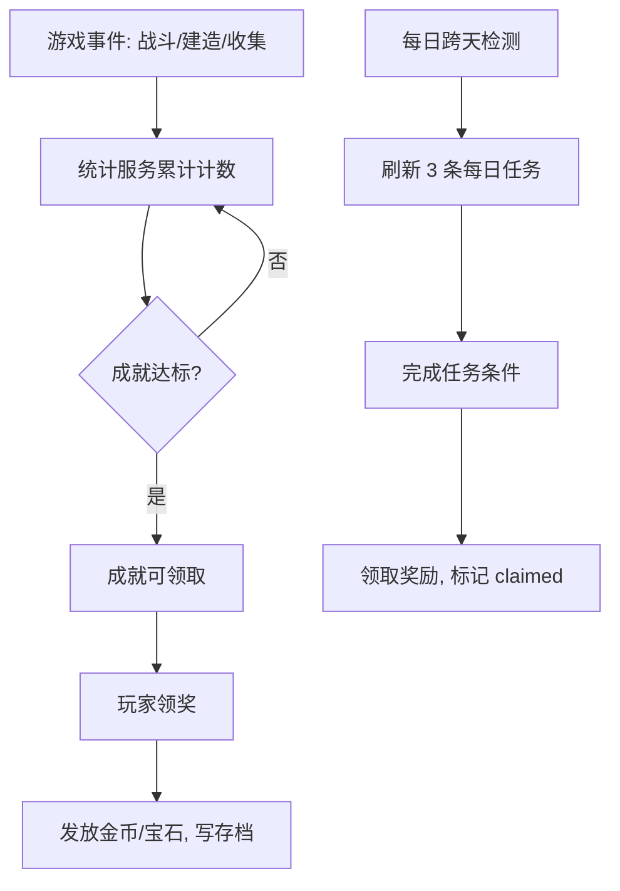

# 成就与每日任务

> 归属系统：周边 ｜ 优先级：P3 ｜ 状态：规划中
> 长线目标与每日活跃奖励，同时是宝石的稳定产出渠道。

## 现状与差距

- 现状：无成就、无每日任务；玩家缺少战斗外的目标感与奖励来源。
- 目标：成就（一次性里程碑）+ 每日任务（每日刷新的活跃目标），完成后领奖（金币/药水/宝石）。

## 设计方案（使用方法）

### 成就

- 配置表 `achievement.table.json`：`id / 类型 / 阈值 / 奖励`；类型如累计摧毁数、累计三星、建筑数量、研究等级。
- 进度事件驱动：战斗结算、建造完成等埋点上报计数；进度持久化存档。

### 每日任务

- 配置表 `daily.table.json`：任务池（战斗 N 场 / 收集 N 资源 / 训练 N 兵），每日随机取 3 条。
- 每日重置基于本地日期跨天检测；奖励领取后标记，防重复领取。

### 涉及文件（预估）

- `gameplay/`：统计上报服务（复用战斗/基地埋点事件）、任务面板 UI
- 存档：`achievements: { id: progress }`、`daily: { date, tasks[], claimed[] }`

## 工作流程

## 边界条件

- 跨天检测以本地日期为准；修改系统时间不补发（只按检测到的新日期刷新）。
- 奖励发放统一走资源入口（宝石走 [GemService](../economy/gem.md)），保证日志对账。
- 成就进度只增不减；表更新后新成就从 0 开始计。

## 验收标准

- 成就达标-领取-入账闭环正确；每日任务跨天刷新且不可重复领取；存档兼容零 lint。

## 关联

- 联动：[宝石货币](../economy/gem.md)（主要产出渠道）。
