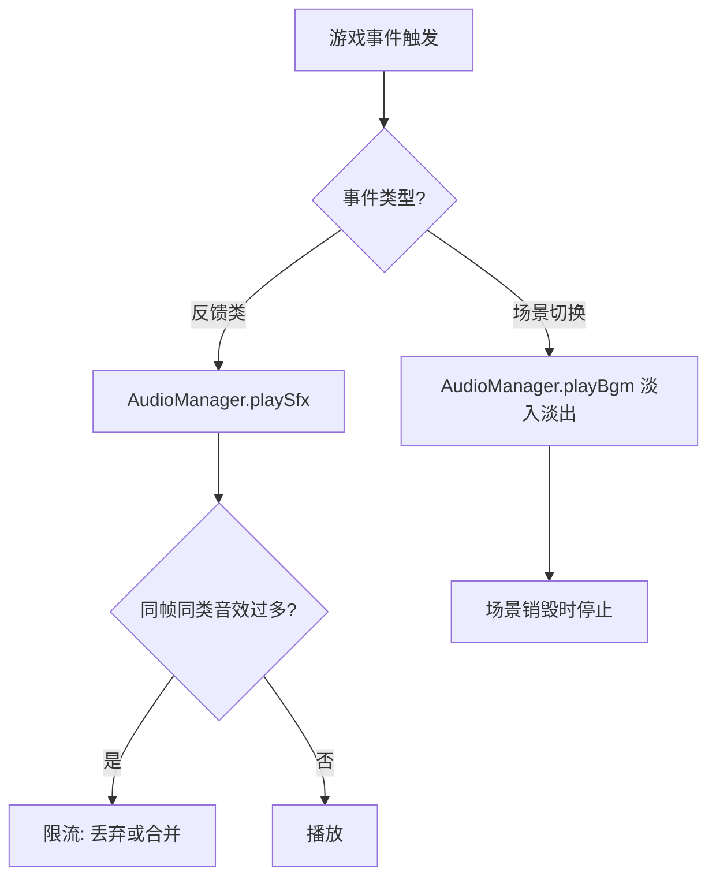

# 音频系统

> 归属系统：周边 ｜ 优先级：P3 ｜ 状态：规划中
> 引入 BGM 与音效，覆盖战斗/建造/UI 反馈。

## 现状与差距

- 现状：代码中无音效/BGM 模块，全程无声。
- 目标：AudioManager 统一管理 BGM 与音效，事件驱动播放，音量可配置。

## 设计方案（使用方法）

- `AudioManager`（gameplay 层）：`playBgm(key)` / `playSfx(key)`；BGM 按场景切换（主菜单/村庄/战斗），Sfx 按事件触发。
- 音频资产清单：战斗（放兵、爆炸、摧毁、结算）、建造（放置、升级完成、收集）、UI（点击、错误提示）。
- 配置：`audio.table.json`（事件 → 资源映射），音量三通道（BGM/Sfx/UI）入设置存档。
- 资产接入方式遵循项目 `import.meta.glob` 自动注册约定，新增音频文件无需改代码。

## 工作流程

## 边界条件

- 音频文件缺失：warn 日志 + 静默跳过，不阻塞流程。
- 静音开关全局生效；设置持久化入存档。
- 高频事件（多次放兵）做同帧限流，避免音效爆音。

## 验收标准

- 场景切换 BGM 正确衔接；关键战斗/建造事件均有音效；静音设置重启后保留。

## 关联

- 联动：[战斗时限](../battle/battle-timer.md) 最后 30 秒提示音、[新手引导](tutorial.md) 步骤完成音。
