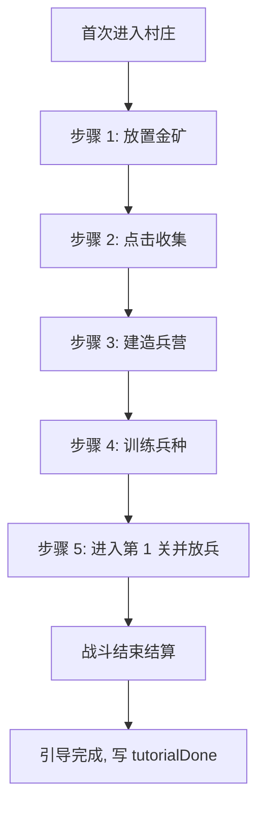

# 新手引导

> 归属系统：周边 ｜ 优先级：P3（可提前） ｜ 状态：规划中
> 首次进入的强制引导流程：建造 → 训练 → 进攻，教完核心循环即释放。

## 现状与差距

- 现状：无教程，新玩家面对空基地与多面板无从下手。
- 目标：一次性引导（存档标记），串联"造金矿 → 收资源 → 建兵营 → 训练兵 → 打第 1 关"完整闭环。

## 设计方案（使用方法）

- 引导步骤配置化：`tutorial.table.json`（`stepId / 触发条件 / 高亮目标 / 文案 / 完成条件 / 允许跳过`）。
- 遮罩 + 高亮 + 气泡指向目标 UI/建筑；期间锁定无关输入。
- 步骤推进事件驱动（监听建造完成、收集完成、战斗结算等事件），不依赖轮询。
- 完成后写存档 `tutorialDone: true`，之后不再触发；GM 命令可重置重放。

## 工作流程

## 边界条件

- 引导中断（中途退出）：按已完成步骤续接，不从头重来。
- 引导期间禁用 GM 面板/调试桥对流程状态的干扰（GM 可跳过整段引导）。
- 第 1 关战斗失败不阻塞：引导在进入战斗并放兵后即可完成，不强制胜利。

## 验收标准

- 全新存档走完引导全程无卡死；中断续接正确；`tutorialDone` 后不再触发。

## 关联

- 前置：P0 经营闭环（[建筑升级](../base/building-upgrade.md)、[资源产出与收集](../base/resource-collection.md)）已存在，引导才有的教。
- 指向：[关卡进度解锁](../progression/level-unlock.md) 的第 1 关。
